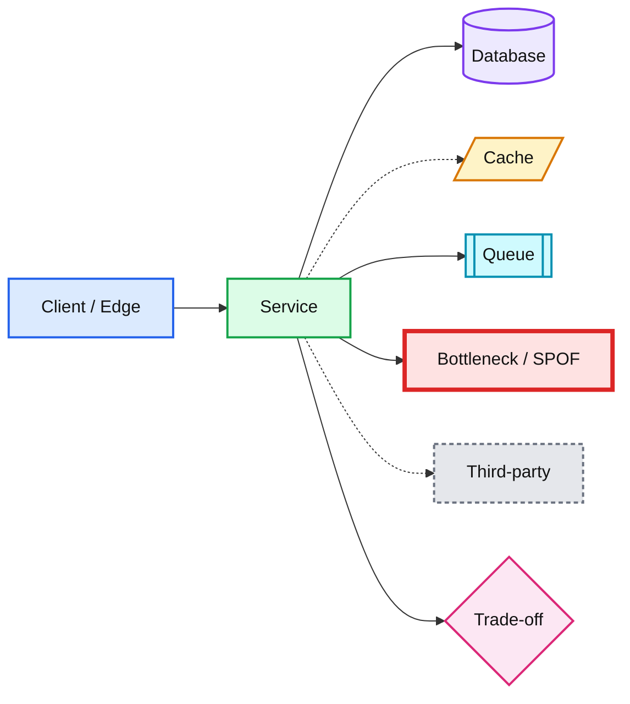

# Staff Engineer Interview Prep

Study repo for HLD, LLD, distributed systems concepts, DSA, and behavioral prep.
Everything is explained with **colored Mermaid diagrams** and plain language.

Read `CLAUDE.md` for the answer style, color legend, and templates.

| Folder | What lives here |
|---|---|
| `hld/` | System design case studies |
| `lld/` | Object-oriented design problems |
| `concepts/` | Reusable building blocks (CAP, sharding, Kafka, caching, consensus) |
| `problem_solving/` | DSA patterns and solutions (Python) |
| `behavioral/` | Staff-level STAR stories |
| `templates/` | Templates + canonical color legend |

## Color legend

## How to study here

1. Ask for a design: *"design a rate limiter"* -> a file appears in `hld/` or `lld/`.
2. Try answering first, then ask for a critique against the Staff bar in `CLAUDE.md` §7.
3. Concepts you keep tripping on go into `concepts/` as one-page notes.
