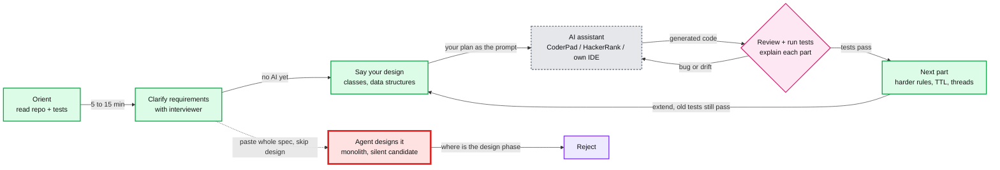

# AI Programming Exercise: coding rounds where AI is allowed

> One-line answer: Stripe, Meta, DoorDash, Coinbase, Canva and Rippling now run a coding round where you are **expected** to use an AI assistant. Stripe calls it the **AI Programming Exercise**. In 5 of 7 Stripe reports it is the same multi-part problem: a transaction rule evaluator. The round grades how you drive, check and explain the AI's code. It does not grade whether you can hand-write an algorithm.

Research and observations for the AI-allowed coding round. **How to approach and practise it: [strategy.md](strategy.md).** Each exercise will get its own subfolder here (see §9).

Checked 2026-10-08. Tags:

| Tag | Meaning |
|---|---|
| ✅ official | I opened the company's own page |
| ✅ report | I opened the candidate's own post (Blind, LeetCode) |
| [prachub] | First-hand write-up hosted on PracHub ("curated and edited by PracHub"). I opened it, but the author cannot be checked |
| [guide] | Prep-site guide. Used only for format details, never as proof |
| [agent] | A research agent opened it and I did not re-check it |

---

## 1. The shape of the round



- **Problems come in parts.** Each part adds a rule, and the old tests must keep passing. Nobody reports finishing every part.
- **The red path is the main failure.** A Rippling interviewer asked "Where is the design phase?" after the candidate had the model scaffold everything ✅ [Blind 2rmxo7or](https://www.teamblind.com/post/rippling-senior-swe-phone-screen-2rmxo7or). A Stripe Staff candidate concluded "the interviewer wanted me to drive the design and write modular code, not to let the agent solve everything by itself" [prachub](https://prachub.com/interview-experiences/stripe-staff-software-engineer-interview-experience-feature-flag-design-and-an-ai-coding-round-rejected).
- **Not using the AI also costs points.** A Rippling Senior candidate "basically didn't use the assistant" and was cut after that round [prachub](https://prachub.com/interview-experiences/rippling-senior-backend-engineer-interview-experience-an-onsite-where-the-coding-round-expected-you-to-use-ai).

---

## 2. Company table

| Company | Status | Round name | Format | Tool | Source |
|---|---|---|---|---|---|
| **Stripe** | Yes. No official page; 7 reports (Apr to Sep 2026) | "AI Programming Exercise", "AI coding", "AI-pairing" | One onsite round. Senior+ also reports AI phone screens. Staff: 60-min mini onsite | AI built into the platform (HackerRank chat box). One report says "simulating using Codex", another used Opus | [prachub] x7, see §3 |
| **Meta** | Yes, official | "AI-Native Coding Interview" | Multi-file repo: fix failing tests, then implement. 60 min [guide] | CoderPad built-in assistant: "Claude, ChatGPT, Gemini, and Meta's models". You pick the model. "No outside AI tools" | ✅ official [metacareers](https://www.metacareers.com/hiring-process/), 4 ✅ reports, see §4 |
| **DoorDash** | Yes, official (2026-03-19) | "AI-assisted engineering working session" | 60 min. Replaces traditional coding rounds. Starter code plus a task like "order dispatch system", "smart menu composer", "support request resolution" | Your own machine and IDE. "Cursor, Claude Code, and Codex" free tiers are enough. Agent mode allowed | ✅ official [careersatdoordash](https://careersatdoordash.com/blog/doordash-is-rebuilding-its-engineering-interviews-around-ai/) (read via Wayback) |
| **Coinbase** | Yes, official (2026-07-13) | "Repo-based coding and debugging" (live). "System design with AI" is in early testing | Existing codebase: triage, debug, review for correctness and performance, rollback reasoning. Backend since Jan 2026 | Not named | ✅ official [coinbase blog](https://www.coinbase.com/blog/interviewing-engineers-in-the-ai-era-lessons-from-a-year-of-rebuilding) (read via r.jina.ai, site 403s) |
| **Canva** | Yes, official (2025-06-11) | "AI-Assisted Coding" | Replaces the CS Fundamentals round for backend, frontend and ML. Open-ended, e.g. "Build a control system for managing aircraft takeoffs and landings at a busy airport." | "Copilot, Cursor, and Claude" | ✅ official [canva.dev](https://www.canva.dev/blog/engineering/yes-you-can-use-ai-in-our-interviews/), [candidate guide](https://www.canva.dev/blog/engineering/ai-interview-success/) |
| **Rippling** | Yes, by reports. The official interview kit does not mention AI [agent] | AI exercise in the phone screen and onsite | OOD problems: Food Delivery, Rule Evaluation Engine, Article Management, task scheduler. A phone screen had 3 pages of requirements and 20 to 25 min to code | "chatgpt, cursor, claude or any other tool". Code runs in HackerRank | ✅ report x3, [prachub] x1 |
| **LinkedIn** | Yes, 1 report (Aug 2026) | "AI coding" | 4 staged tasks: LRU, LRU + TTL, (forgotten), thread-safe. "I had to come up with the algorithm myself" | CoderPad: GPT, Gemini, Claude | [prachub](https://prachub.com/interview-experiences/linkedin-software-engineer-interview-experience-two-of-four-ai-coding-tasks-completed) |
| **Shopify** | Yes, 1 report (Nov 2025) | Pair programming | Recruiter said "open book" and Cursor allowed | Bring your own: one candidate used Cline + OpenRouter in VS Code | ✅ report [Blind svd31luq](https://www.teamblind.com/post/shopify-pair-programming-interview-svd31luq) |
| **Google** | Pilot only (H2 2026) | "Code comprehension" | "read, debug, and optimize" existing code. Junior to mid-level, select US teams | Gemini | Business Insider via [shopifreaks repost](https://www.shopifreaks.com/google-pilots-new-software-engineering-interview-process-that-lets-candidates-use-ai-assistant-gemini-during-coding-rounds/), 2026-05-07 |
| **Axon** | Yes, 1 comment | AI coding | "work with the AI assistant to refine the requirements" | Codility with a Copilot-like assistant | ✅ report [Blind u0ntbrv1](https://www.teamblind.com/post/axon-ai-coding-u0ntbrv1) |
| **Anthropic** | **Bans** by default | n/a | Live interviews: "This is all you–no AI assistance unless we indicate otherwise." | n/a | ✅ official [candidate-ai-guidance](https://www.anthropic.com/candidate-ai-guidance) (updated 2025-07-10) |
| **Amazon** | **Bans** unless permitted | n/a | Internal guidance: no GenAI tools in interviews unless explicitly permitted | n/a | [agent] [ITPro 2025-03-14](https://itpro.com/business/careers-and-training/amazon-bans-ai-tools-during-job-interviews) |
| **Microsoft** | **Bans** unless permitted | n/a | Hiring tips: show your own skills without outside help unless explicitly permitted | n/a | [agent] [careers.microsoft.com](https://careers.microsoft.com/v2/global/en/hiring-tips.html) |
| Databricks, Intuit, Uber, Airbnb | Nothing found | n/a | Intuit grades AI inside its case study instead. See [hld/company-questions.md](../hld/company-questions.md) §1 | n/a | n/a |

---

## 3. Stripe deep dive: the AI Programming Exercise

**The problem (5 of 7 reports):** given one transaction (a dict of fields) and an ordered list of rules, return `accept` or `block`.

| Part | What gets added | Source |
|---|---|---|
| 1 | String equality (`merchant_name = "X"`). First matching rule wins. Default is accept. The field and the constant can sit on either side of `=` | [prachub, Sep 2026](https://prachub.com/interview-experiences/stripe-software-engineer-interview-experience-reconciliation-a-requests-307-bug-squash-bikemap-and-an-ai-exercise-no-offer) |
| 2 | Boolean fields plus `AND` / `OR`, no precedence yet. Interviewer's edge case: a merchant name that contains "and" or "or" | same, plus [Staff report](https://prachub.com/interview-experiences/stripe-staff-software-engineer-interview-experience-feature-flag-design-and-an-ai-coding-round-rejected) |
| 3 | Nested parentheses | both |
| 4+ | "There were many more parts after that, and the interviewer said I definitely wouldn't finish them all" | Staff report |

What the reports say:

- **Levels.** L3 (May 2026), Senior (Sep), Senior+ (Aug), and Staff (Aug 2026). At Staff it was half of a two-round, 60-min-each mini onsite. The other half was system design: a feature flag service.
- **Time.** "you really only get 30 minutes of actual coding time" (L3) [prachub](https://prachub.com/interview-experiences/stripe-software-engineer-interview-experience-five-onsite-rounds-including-a-superhero-dispatch-system). By hand "there's about an 80% chance you won't finish in time" (Apr 2026, HackerRank AI chat box) [prachub](https://prachub.com/interview-experiences/stripe-software-engineer-interview-experience-new-ai-coding-debug-and-integration-questions).
- **Write your own tests.** "You had to write the test cases yourself too" (Senior, Sep 2026) [prachub](https://prachub.com/interview-experiences/stripe-senior-software-engineer-interview-experience-bug-hunt-ai-pairing-and-map-drawing-rounds-no-system-design).
- **Narrate.** The L3 candidate read and explained all the AI's code, but the feedback was "I still didn't explain my thinking enough".
- **Set up beforehand.** The Senior candidate lost the first 30 min of the bug-hunt round installing the IDE ("the details are in the email"). A Sep 2026 candidate's local debugger would not run, and that round sank the loop [prachub](https://prachub.com/interview-experiences/stripe-software-engineer-interview-experience-ai-coding-reconciliation-and-a-debugger-that-would-not-run).
- **Senior+ phone screens.** "Two phone screens, coding with AI ... let the AI write all the code, and your job is mainly to review it" [prachub](https://prachub.com/interview-experiences/stripe-seniorplus-software-engineer-interview-experience-ai-assisted-phone-screens-rejected-after-four-onsite-rounds).
- **FDE track.** "The coding round explicitly let me use AI, but they were not looking for a one-shot prompt" [guide: aced.io](https://www.aced.io/experiences/stripe-forward-deployed-engineer-interview-5498d0).
- **Rest of the Stripe loop** (same reports, no AI): Bug Squash (`requests` 307 redirect body replay, SnakeYAML, Mako), Integration (BikeMap with staticmap, JGit reviewer assignment), Reconciliation (invoice matching in 3 parts).

**Why the rule evaluator suits an AI round:** part 3 is a small expression parser. An AI one-shots it as one big regex or `eval`, which then breaks on "merchant name contains `and`". The signal is whether *you* pick a tokenizer plus a small AST at part 2, so part 3 is a small diff.

---

## 4. Meta deep dive: the AI-Native Coding Interview

- **Official facts** ✅ [metacareers](https://www.metacareers.com/hiring-process/):
  - "Candidates are expected to use this AI assistant as part of the interview."
  - Graded on "problem-solving, coding, debugging, and collaboration".
  - Languages: Python, Java, TypeScript, C++, C#, Kotlin, Swift, Rust, Go.
- **Loop.** One AI coding round plus one classic coding round (SWE Product, Nov 2025) ✅ [LC 7335102](https://leetcode.com/discuss/interview-experience/7335102). For an "AI native" role at E5/E6, the recruiter said "2 ai enabled coding, 2 sys design and behavioral" ✅ [Blind ur1shuco](https://www.teamblind.com/post/ai-native-sde-meta-e5-vs-e6-interview-ur1shuco) (Mar 2026, recruiter quote relayed by the candidate).
- **Format** [guide: Hello Interview](https://www.hellointerview.com/blog/meta-ai-enabled-coding):
  - 60 min: 5 to 6 min orientation, then a bug-fix phase, then "roughly 30 to 40 minutes" to implement.
  - The assistant "can only respond in the chat panel. It can't directly edit your files."
- **Models were weak in late 2025.** Lightweight models only: "o4 mini, claude haiku, llama 4 maverick" (7335102). Another candidate: "a small model, not too reliable" ✅ [Blind ppb0lh1g](https://www.teamblind.com/post/meta-ai-enabled-coding-experience-ppb0lh1g). The official page now lists the four model families, but no versions.
- **Prep.** "Meta provides a sample codebase that's pretty much like the real interview. TAKE ADVANTAGE OF THIS" (7335102).
- **Reported problems:**
  - Word list in `data/`: fix 2 failing `utils.py` tests, then implement `solve.py` to find a subset of words with a property. The interviewer then pushed on complexity. It was NP-complete, and "most candidates don't notice that" (7335102).
  - Card grid: fix the invalid-move validation test, then auto-pick 3 cards summing to 15 until none are left (ppb0lh1g).
  - String processing: a debug step, then remove words that share letters (SDE2, rejected) ✅ [LC 7374944](https://leetcode.com/discuss/post/7374944).
  - A commenter claims "only 4 vetted questions" and mentions Pac-Man and news feed variants (ppb0lh1g thread, Nov 2025, unverified insider claim).

---

## 5. Practice list

| Company | Problem | Parts / follow-ups | Source |
|---|---|---|---|
| Stripe | Transaction rule evaluator | equality, then AND/OR, then parentheses, then more | §3 |
| Rippling | Expense rule engine `Evaluate(List<Rule>, List<Expense>)` | category ban, trip total cap, entertainment cap, "add new rules easily" | ✅ [LC 8367124](https://leetcode.com/discuss/post/8367124) |
| Rippling | Food Delivery (`AddDelivery`, `RecordDelivery`, `PayUpto`) | OOD, data structure choice | ✅ LC 8367124, ✅ [LC 7649290](https://leetcode.com/discuss/post/7649290/rippling-offer-received-ai-coding-experi-ixr6/) |
| Rippling | Article Management (`Upvote`, `Downvote`, `PrintLastKFlippedArticles`) | efficient updates | ✅ LC 8367124 |
| Rippling | Task scheduler | dedupe by (description, due date), drop completed, priority sort, subtasks right after their parent | [prachub](https://prachub.com/interview-experiences/rippling-senior-backend-engineer-interview-experience-an-onsite-where-the-coding-round-expected-you-to-use-ai) |
| Meta | Word-subset `solve.py` in a multi-file repo | fix utils tests first, then complexity probe | ✅ LC 7335102 |
| Meta | Card grid, 3 cards summing to 15 | fix validation test, then auto-play | ✅ Blind ppb0lh1g |
| LinkedIn | LRU cache | + TTL, + (unknown), + thread safety | [prachub](https://prachub.com/interview-experiences/linkedin-software-engineer-interview-experience-two-of-four-ai-coding-tasks-completed) |
| DoorDash | DAG refund workflow | partial refunds, then "workflow is slow, fix it" (AI gave 10 options) | [prachub](https://prachub.com/interview-experiences/doordash-software-engineer-interview-experience-four-round-onsite-with-an-ai-assisted-coding-round) |
| DoorDash | Order dispatch / menu composer / support resolution | extend starter code | ✅ official |

The Rippling offer post (7649290) recommends "offerretriever" for questions. Treat that part as possible promotion.

---

## 6. What graders say they reward

| Signal | Company's own words | Source |
|---|---|---|
| Think before asking the AI | "If your interviewer asks you a question, tell us what you think before getting help from AI" | ✅ Canva guide |
| Verify, do not trust | "write targeted checks to prove a fix works, rather than blindly trusting an AI output" | ✅ DoorDash |
| Catch plausible-but-wrong code | "tell a correct change from one that merely looks plausible" | ✅ Coinbase |
| Fix AI bugs | "Can they identify and fix issues in AI-generated code?" | ✅ Canva |
| Velocity still counts | "Finishing every task is less important than showing a tight loop and good judgment, although velocity does matter." | ✅ DoorDash |
| One-shotting is allowed | "(yes, you are allowed to one-shot problems)" | ✅ DoorDash |
| Anti-patterns | "AI Showcase", "Feature Marathon", "Hands-Off" | ✅ Canva guide |

---

## 7. Trade-offs (candidate-side)

| Choice | Option A | Option B | Pick | Why |
|---|---|---|---|---|
| Who designs | Paste the spec and let the agent design | Say your classes and data flow, then prompt with your plan | **B** | The red path in §1. The Stripe Staff and Rippling rejections both cite it |
| Granularity | One prompt for all parts | One part at a time, tests green after each | **B** | Parts stack up. A monolith from part 1 makes part 3 a rewrite (Stripe Staff) |
| Small edits | Prompt for every change | Type small fixes yourself | **Mixed** | LinkedIn: "using AI made it slower" on LRU. Stripe: by hand you likely won't finish |
| Model | Biggest model | The one you use daily | **Daily one** | Meta's late-2025 menu was small models. Prompt habits transfer better than raw model power |
| Tests | Trust the given tests | Add edge-case tests yourself | **B** | Stripe asks you to write tests and to keep old ones passing |

**Staff-level angle.** At Staff the extra signal is *seams*: you name the extension point before part 2 asks for it. In Stripe's evaluator that seam is a tokenizer plus a rule AST. In Rippling's expense engine it is a `Rule` interface (Strategy pattern). Also expect a scale follow-up (DoorDash: "workflow is slow") and a complexity follow-up (Meta: NP-complete).

---

## 8. Not found or not verified

- No Stripe official page on the AI round. Everything in §3 is [prachub]. One Jul 2026 Stripe write-up ("AI pair-coding round and a real GitHub bug bash") is premium and was not read.
- Meta's 60-min length and the "chat panel only" detail are from Hello Interview, not Meta.
- Glassdoor and 1point3acres threads (Stripe, Coinbase, Atlassian, Intuit) return 403.
- Canva's guide date is not shown on the page.
- PracHub write-ups can be translated or edited by PracHub. Treat quotes from them as close paraphrase.

---

## 9. Folder layout (planned)

One folder per exercise, built from the problems in §5. Each is self-contained. Why it is split this way is in [strategy.md §6](strategy.md#6-practice-setup-reuse-an-existing-one-or-build-our-own).

```
ai-programming-exercises/
  README.md                    this file: research, round format, grading signals
  strategy.md                  how to approach the round, practice setup
  stripe-transaction-rules/    example kit
    CLAUDE.md                  interviewer script: reveal order, time calls, follow-ups, grading
    candidate/                 minute-zero view: part 1 README, starter code, tests
    interviewer/               later parts, their tests, rubric, answer key, model solution
```

Meta-style bug, implement, optimize problems are not rebuilt here. Use [azizu06/ai-coding-interview-practice](https://github.com/azizu06/ai-coding-interview-practice), cloned outside this repo.
