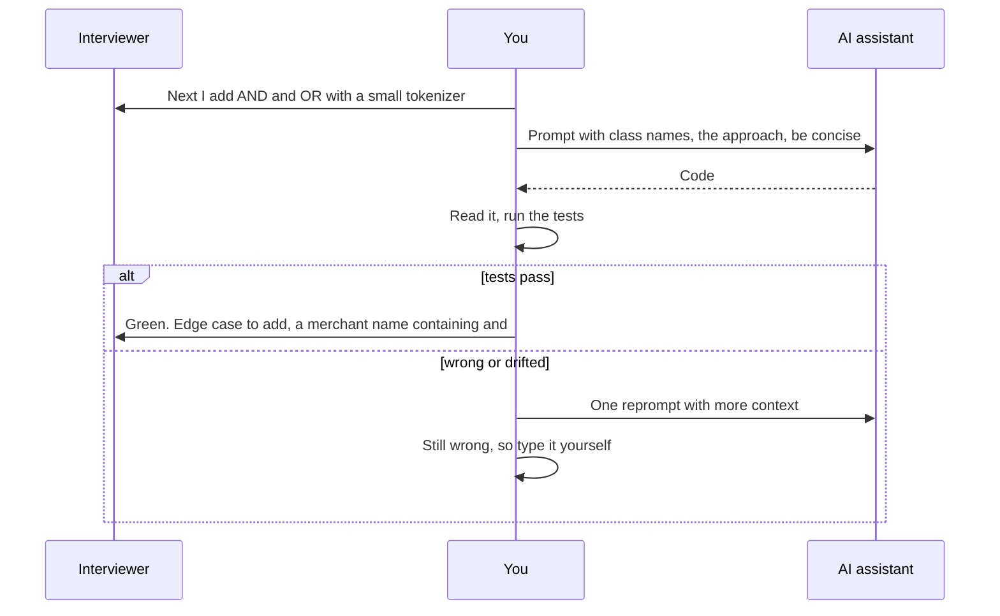
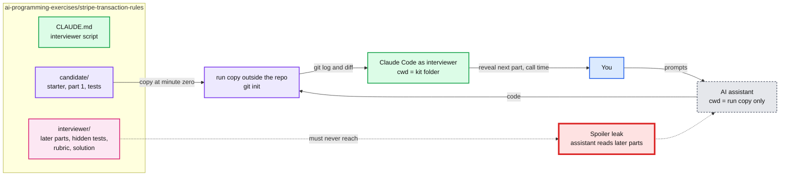

# Strategy: how to approach and practise the AI Programming Exercise

> One-line answer: **You make the decisions, the AI does the typing, and you say every decision out loud before you prompt.** Practise in two places. Use the company's own practice pad (or Hello Interview's sandbox) for the platform feel. Use our own kits in this folder for problems nobody else has built, such as Stripe's rule evaluator.

Built 2026-10-08 from:
- Hello Interview's AI-coding track: introduction, formats, patterns, the five fundamentals, and the Meta, LinkedIn and Shopify posts. All read in full, tagged [HI].
- The official company posts and candidate reports in [README.md](README.md).

Rules marked [HI] are Hello Interview's advice, built from candidate and interviewer interviews. They are not company policy.

---

## 1. First, know which format you are in

| | Structured | Open-ended |
|---|---|---|
| Who | Meta, LinkedIn, Stripe (HackerRank AI chat), Uber (HackerRank) [HI], Google pilot | DoorDash, Shopify, Rippling ("any tool"), Canva |
| Environment | Browser pad with a multi-file repo already loaded | Your IDE and your AI tools over screen share. Shopify sends an empty repo with a README, and you push a branch at the end [HI] |
| The AI | Fixed model menu. At Meta and LinkedIn it sits in a chat panel and **cannot edit files**, so you copy and paste [HI]. Often feels weaker than your daily tool | Anything you like. DoorDash allows "agent/autopilot modes" ✅ official |
| Shape | Phases: fix a bug, build the feature, then optimize (Meta). Or staged parts (Stripe, LinkedIn) | One problem that grows as requirements are added (Shopify), or a realistic project (DoorDash) |
| Biggest risk | Weak AI plus the clock | Your messy workflow is fully visible. Over-delegating |

**Ask your recruiter** [HI]:
- Structured or open-ended?
- Which platform, and is there a practice environment?
- How many phases? Is there starter code?
- Which AI tools and models are allowed? Do I push to a repo at the end?
- If the answers are vague: "What should I have set up on my machine before the interview?"

---

## 2. The 60-minute playbook

```mermaid
%% Time budget for a 60-min structured round. Meta numbers per HI: interviewer orientation 5 to 6 min, about 30 to 40 min left for the main work.
gantt
    dateFormat mm
    axisFormat %M
    section Interviewer
    Orients you to the pad          :o1, 00, 6m
    section You
    Read code and run tests         :o2, after o1, 6m
    Plan aloud in 3 to 5 steps      :p, after o2, 4m
    Part 1 bug fix or base case     :p1, after p, 10m
    Part 2 core feature             :crit, p2, after p1, 18m
    Part 3 scale or extension       :p3, after p2, 10m
    Follow-up questions             :f, after p3, 6m
```



Red = the part that carries the most weight. Meta guidance: "Don't spend 15 minutes perfecting phase 1 when phases 2 and 3 carry more weight" [HI].



### Before the day
- **Take the practice pad.** Meta's is a sample problem called "the puzzle", and it is harder than most real problems. LinkedIn also offers a practice session [HI]. One Meta E7 said the biggest win was that he "wasn't surprised in the interview" [HI].
- **Set up your IDE a day early.** A Stripe candidate lost the first 30 minutes of a round installing it ([README §3](README.md#3-stripe-deep-dive-the-ai-programming-exercise)).
- **Open-ended:** configure the IDE, an agent, and a browser chat as a fallback [HI]. DoorDash requires "a working setup" ✅ official.
- **Do one run with weak AI or none.** "The candidates who panicked when the AI gave bad answers were the ones who had never practiced without it" [HI].

### Orient (about 6 min)
- Read in this order: entry point, then the data models, then the core function, then the tests. Run the tests [HI].
- Have the AI add comments to every class, or answer targeted questions. Then check its claims by reading the code yourself [HI].
- Narrate what you find: "Board holds a 2D grid of Cells, each Cell tracks its own state."
- Never skip this. Prompting before reading is "one of the clearest failure signals" [HI].

### Plan (about 4 min)
- Split the work into **3 to 5 steps** for a 45 to 60 minute round [HI].
- Map the problem to a pattern before you prompt. Graph search, topological sort and backtracking "cover the majority of problems" [HI].
- Ask whether AI-assisted planning is OK. It varies by interviewer, and some LinkedIn interviewers want AI for boilerplate only [HI].
- Say the plan aloud. It takes ten seconds and lets the interviewer redirect you early.

### Execute (each step is one cycle of the diagram)
- **Prompt with "what" and "how" in the codebase's own words,** and add "be concise" [HI]. For example: "Add `searchByPrefix` to `Dictionary` using the existing `TrieNode`."
- **Under 30 seconds of typing? Do it yourself** [HI].
- **One-reprompt rule.** If it misses twice, write it yourself. Never fight one generation for more than 2 minutes [HI].
- **Run after every generation.** Never stack new code on broken code [HI].
- **Scan each generation for shortcuts** [HI]: deleted or weakened tests, `any` or needless casts, swallowed exceptions, hard-coded values, and abstractions you didn't ask for (a `BaseProcessor` for two classes).
- **Watch for the AI spiral.** When the model proposes a rewrite it can't justify, stop and redirect [HI].
- **Open-ended: commit after every green step.** Rolling back beats patching three bad generations [HI].

### Verify
- Add your own edge tests: empty, single item, boundary, duplicates, invalid input, scale [HI]. Provided tests "usually cover the happy path and maybe one or two basic edge cases" [HI].
- Open-ended: write tests first and agree them with the interviewer. Then the prompt is "make these pass" [HI].
- When a test fails, **say your hypothesis first**, then ask the AI. You can check it yourself in parallel [HI].

### Talk
- Say what you are about to do **before** you prompt, not after [HI].
- Make about one statement every 30 to 60 seconds, covering decisions, surprises and corrections [HI].
- Fill the AI's wait time with reasoning, or read ahead [HI].
- DoorDash scores whether you "narrate what you are doing, what you plan to try next, and why" ✅ official.

### Finish
- Not finishing is OK. Meta candidates who missed phase 3 still got offers [HI]. DoorDash: "Finishing every task is less important than showing a tight loop and good judgment" ✅ official.
- Leave about 6 minutes for follow-ups. At LinkedIn "the follow-ups matter more than the initial solution" [HI].

---

## 3. Staff-level additions

- **Expect design framing.** At Staff, LinkedIn gives `addInterval()` and `insertInterval()` and asks you to choose the bookkeeping structure [HI]. Make the architecture call yourself.
- **Name the extension point before part 2 asks for it.** Stripe: a tokenizer plus a small expression tree. Rippling expense rules: a `Rule` interface (Strategy pattern).
- **Optimization is a trade-off, not just "faster".** Meta's data files stress different shapes. Many short words favour a trie, and few long words favour greedy. Candidates who explained this scored well even without building both [HI].
- **Use the AI to benchmark** two implementations against input profiles [HI].
- **Expect production follow-ups:** concurrency, malformed data, 10x data (LinkedIn) [HI], and "the workflow is slow" (DoorDash report).

---

## 4. Prompt templates

These are our own synthesis of the rules above. Swap in the real class names.

```text
ORIENT   Add a one-line comment to every class and public method in this repo.
         Do not change any code.
PLAN     My plan: 1) fix the failing utils test, 2) parse rules into tokens,
         3) evaluate with first-match-wins. What edge cases does this plan miss?
         Do not write code.
BUILD    In rules.py, add a Tokenizer class that splits a rule string into
         FIELD, OP, VALUE, AND, OR, LPAREN, RPAREN tokens. Quoted values may
         contain spaces and the words and/or. Be concise, no comments.
TEST     Write unittest cases for Tokenizer: empty rule, quoted value with
         "and" inside, nested parentheses, unknown field. Expected values only,
         no implementation changes.
DEBUG    test_or_precedence fails. My hypothesis: the evaluator reads left to
         right and ignores parentheses. Confirm or reject by reading evaluate().
```

---

## 5. Company dials

| Company | Format | AI edits files? | Emphasize |
|---|---|---|---|
| Stripe | Structured, HackerRank AI chat. One report says "simulating using Codex" | Unclear | Staged parts, write your own tests, explain your thinking aloud |
| Meta | Structured, CoderPad, model menu | No, chat panel only [HI] | Fix bug, then implement, then optimize. Know the algorithm cold. AI may feel weak |
| LinkedIn | Structured, CoderPad | No [HI] | A well-known problem plus deep follow-ups. You must come up with the algorithm yourself |
| Rippling | Open: any tool, code runs in HackerRank | Yes, in your IDE | Object-oriented design first, then let the AI write it |
| Shopify | Open: own IDE, Google Meet, push a branch [HI] | Yes | An LLD interview with AI. File layout and extensibility |
| DoorDash | Open: own machine, 60 min ✅ official | Yes, agent mode allowed | Get oriented, manage scope, verify, narrate trade-offs |

---

## 6. Practice setup: reuse an existing one or build our own?

**Answer: both. Reuse what exists for the Meta-style format, and build our own kits only for the formats nobody covers.**

### What already exists (checked 2026-10-08)

| Option | What you get | AI in it? | Cost | Verdict |
|---|---|---|---|---|
| **Company practice pad** (Meta "the puzzle" via Career Profile, LinkedIn practice session) | The real UI, real model menu, real test runner | Yes, the real one | Free, only once you have an interview | **Always do it** when scheduled. Nothing else teaches the exact pad ✅ [metacareers](https://www.metacareers.com/hiring-process/) says "explore the CoderPad practice environment if applicable" |
| **[azizu06/ai-coding-interview-practice](https://github.com/azizu06/ai-coding-interview-practice)** (MIT, 32 stars, created 2026-09-15) | 10 Meta-style problems (Card Game, Task Scheduler, Maze Solver, Word Container, Rate Limiter, ...). Each has 2 planted bugs, `????` test values to fill, a timed-test ladder, an answer key, an ask/edit mode rule sheet, an interviewer prompt, a 1 to 4 rubric, and a stdlib-only timer | Your own agent | Free | **Reuse as is** for the bug, implement, optimize format. Do not rebuild these |
| **Hello Interview AI-coding practice** | 13 in-browser problems with a built-in AI, "the same shape as the CoderPad and HackerRank environments", plus graded open-ended runs | Yes | Premium (₹3,199 per month as shown 2026-10-08) | Optional. It is the closest CoderPad clone and has AI grading |
| CoderPad free sandbox | The CoderPad editor | **No.** "minus the multi-user functions, AI assist, and the ability to save the session" ✅ [CoderPad docs](https://coderpad.io/resources/docs/for-candidates/interview-preparation-guide/) | Free | Only to learn the editor |
| HackerRank, CodeSignal, Karat | AI-assisted interview products | Yes | Sold to employers. No candidate practice pad found [agent] | Not usable |
| interviewing.io mocks | A mock with an engineer "in the same environment, with the same models, as the real thing" [agent] | Yes | Paid per session | Optional, near the real date |

### What nothing covers, so we build it here

- **Staged reveal by an interviewer.** Stripe's rule evaluator, Rippling's expense engine and LinkedIn's LRU, then TTL, then thread-safe. Each part arrives only after the last one is green. Every existing kit shows all tasks at minute zero.
- **Follow-up discussion.** LinkedIn's production questions, DoorDash's "workflow is slow", Meta's complexity push.
- **Open-ended greenfield** (Shopify, DoorDash): an empty repo plus a README, where your file layout is graded.

### How our kits work



Per kit folder, borrowing what works from the azizu06 repo:

```
<kit>/
  CLAUDE.md          interviewer script: reveal order, time calls, follow-ups, grading
  candidate/         what you see at minute zero: README for part 1, starter code, tests
  interviewer/       parts 2..N, their tests, rubric, answer key, model solution
```

- Tests use stdlib `unittest`, so the repo stays dependency-free.
- Grading uses the same six dimensions as the azizu06 rubric: comprehension, debugging, implementation, optimization, AI usage, communication. Our CLAUDE.md adds the company-specific checks from §5.

### The things to make sure of

1. **The assistant must never see future parts or the answer key. Isolate it by structure, not by rule.**
   - Claude Code loads every `CLAUDE.md` from the working directory up to the root. An assistant started anywhere under this repo would read our root CLAUDE.md (teaching mode) and the kit's interviewer script.
   - So the run copy goes **outside the repo**, e.g. `~/ai-ex-runs/<kit>-<date>/`.
   - The azizu06 repo instead keeps `solutions/` in the same tree and relies on a written rule ("Never open, read, grep, list, or summarize anything under `solutions/`").
2. **Match the AI to the target format.** Practising only with your strongest agent is the failure Hello Interview warns about.

| Mode | Simulates | How to start the assistant (in the run copy) |
|---|---|---|
| A. Structured, weak AI | Meta, LinkedIn, Stripe | `claude --model haiku --disallowedTools "Edit Write NotebookEdit Bash"`. It can read files and answer in chat but cannot edit or run anything, like Meta's chat panel. You type, and you run tests yourself |
| B. Open-ended, full agent | DoorDash, Shopify, Rippling | `git init`, commit, then `claude` with your normal model and edits allowed. Commit after every green step |
| C. No AI | The "AI is nerfed" day | No assistant. Same kit. Proves you can carry the algorithm yourself |

3. **Communication can't be graded from git alone.** Record the screen with voice (QuickTime) and watch it back, as [HI] recommends. The interviewer session grades the code side from `git log -p` and your pasted chat.
4. **Read third-party tools before running them.** azizu06's `tools/*.py` are stdlib-only, but read them first. Clone that repo outside this one, e.g. `~/PycharmProjects/ai-coding-interview-practice`, so its `CLAUDE.md` and ours never mix.

### Trade-offs

| Choice | Option A | Option B | Pick | Why |
|---|---|---|---|---|
| Meta-style practice | Build our own bug, implement, optimize kits | Reuse azizu06 (10 problems) | **B** | Already built and MIT-licensed, with a verify script and a CI workflow. Rebuilding is weeks of work for no new signal |
| Stripe / Rippling / LinkedIn practice | Wait for someone to publish kits | Build our own with staged reveal | **B** | Nothing public covers staged parts or the Stripe problem |
| Spoiler protection | A written rule in AGENTS.md | Separate run copy outside the repo | **B** | A rule depends on the model obeying it. A directory boundary does not |
| Assistant strength | Your daily agent | A deliberately weak, read-only one (mode A) | **Both** | Meta and LinkedIn give you a weak chat panel. DoorDash and Shopify let you bring your best |
| Paid tools | Hello Interview Premium, interviewing.io | Free kits plus company pads | **Free first** | Pay only in the last 1 to 2 weeks for the real-UI rehearsal |
