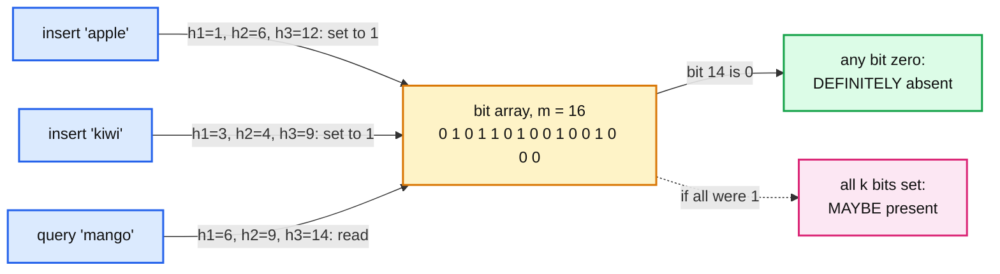
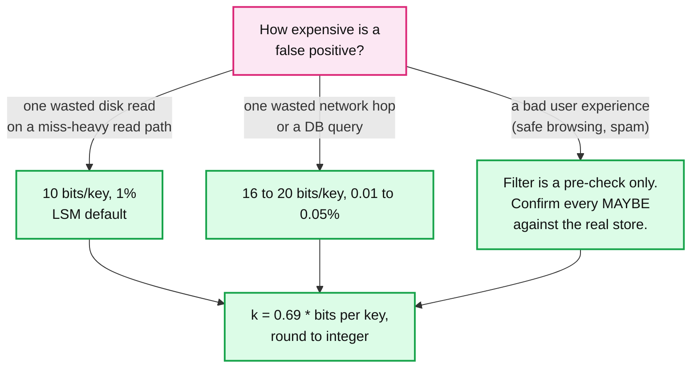
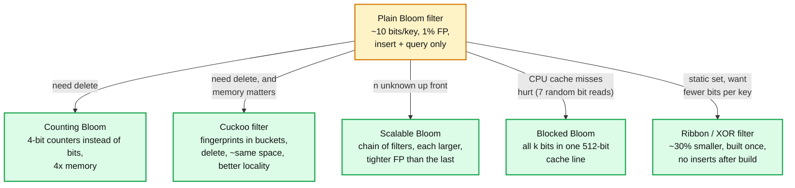
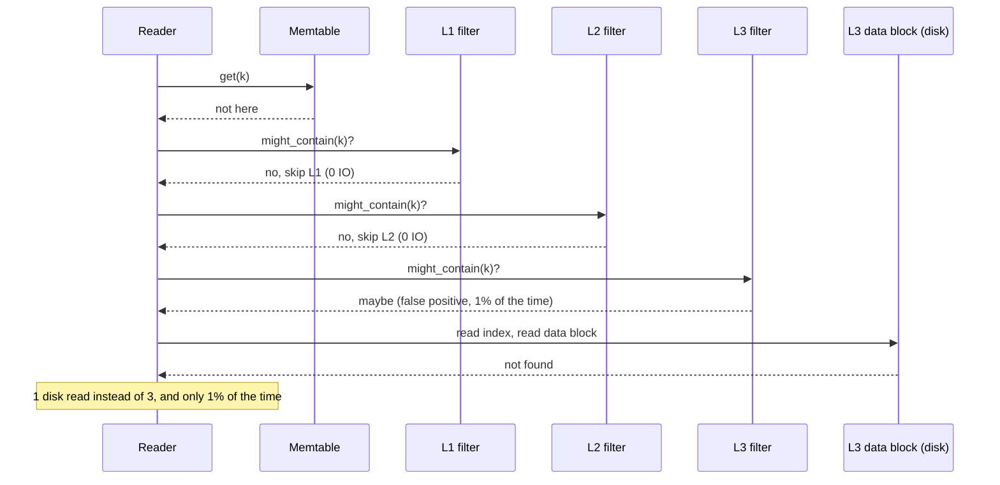

# Concept: Bloom Filter

> One-liner: a Bloom filter is a bit array plus k hash functions that answers "is this key in the set?" with either a definite **no** or a probable **yes**, using about 10 bits per key instead of storing the keys, at the cost of a tunable false positive rate and no deletes.

Depth target: high-level, same as [raft.md](raft.md), [lsm-tree.md](lsm-tree.md), and [skip-list.md](skip-list.md). It is the structure that makes multi-file LSM reads affordable, so it is asked in every storage design round. Because it is DSA, this note has runnable code.

---

## 1. Mental model

You want to know whether a key is in a set of a billion items, but you cannot afford to store a billion keys in memory. A Bloom filter stores a **fingerprint of the set**, not the set. It can never lie about absence. It can occasionally claim presence for something that was never inserted.



- **Insert**: hash the key `k` times, set those `k` bits to 1. Bits already set stay set.
- **Query**: hash the key `k` times, read those `k` bits. Any zero means the key was never inserted. All ones means "probably", because other keys could have set those same bits.
- The filter is amber because it is **losable**: it is derived data, rebuilt from the real set at any time. It is never the source of truth.

**Why Bloom filters exist.** Burton Bloom, 1970, for hyphenation dictionaries that did not fit in core memory. The modern reason: any time a lookup is expensive (disk read, network hop, database query) and most lookups miss, a Bloom filter in front of it turns the misses into zero-cost answers. In an LSM tree, this is the difference between a point read costing one disk IO per level and costing one disk IO total.

---

## 2. The math (memorise three numbers, derive the rest)

Given `n` keys, `m` bits, `k` hash functions, the false positive rate is:

```
FP ≈ (1 - e^(-k n / m))^k
```

Optimal `k` for a given `m / n`:

```
k = (m / n) · ln 2  ≈ 0.69 · (m / n)
```

At the optimum, each bit is set with probability 1/2, and:

```
FP ≈ 0.6185^(m / n)
```

The table every interviewer wants you to know:

| Bits per key (`m / n`) | Optimal `k` | False positive rate |
|---|---|---|
| 4 | 3 | ~15% |
| 8 | 6 | ~2% |
| **10** | **7** | **~1%** |
| 12 | 8 | ~0.3% |
| 16 | 11 | ~0.05% |
| 20 | 14 | ~0.007% |

Rule of thumb: **10 bits per key, 7 hashes, 1% false positives.** A 1 billion key set costs 1.25 GB. Storing the keys would cost 20 to 100x that.



Two things people get wrong:

- **False positive rate is per query, and only on absent keys.** A query for a key that *is* present is always "yes". The 1% applies to the fraction of *absent* keys the filter wrongly admits. A read path that is 90% hits barely notices the filter's false positives.
- **`n` is the number of keys you will insert, decided up front.** Insert 2x the planned `n` and the FP rate does not double, it goes from 1% to ~10%. A Bloom filter does not resize. Section 5 covers what to do about that.

---

## 3. Hashing: you do not need k hash functions

Running 7 independent hashes per key is slow. Every real implementation uses **double hashing** (Kirsch and Mitzenmacher, 2006): compute two 32-bit or 64-bit hashes `h1` and `h2` once, then derive the rest.

```
h_i(key) = h1(key) + i · h2(key)   (mod m),   for i in 0 .. k-1
```

Same false positive rate as k independent hashes, at the cost of one or two hash computations. RocksDB goes further and gets both halves from a single 64-bit hash (XXH3), then rotates.

The hash must be fast and well distributed, not cryptographic. MurmurHash3, XXH3, CityHash, FarmHash. Never `md5` or `sha` in a hot path, and never Java's `String.hashCode` (too many collisions on short strings).

---

## 4. Code

Python, runnable, no dependencies. Sized from `n` and the target FP rate, double hashing, the way a real one is built.

```python
import math
import hashlib


class BloomFilter:
    def __init__(self, n: int, fp_rate: float = 0.01):
        # m = -n ln(p) / (ln 2)^2,  k = (m / n) ln 2
        self.m = math.ceil(-n * math.log(fp_rate) / (math.log(2) ** 2))
        self.k = max(1, round((self.m / n) * math.log(2)))
        self.bits = bytearray((self.m + 7) // 8)
        self.n_inserted = 0

    def _positions(self, key: bytes):
        # Double hashing: two 64-bit halves of one digest give all k positions.
        # A real implementation uses XXH3 or Murmur3. sha256 keeps this dependency-free.
        d = hashlib.sha256(key).digest()
        h1 = int.from_bytes(d[:8], "little")
        h2 = int.from_bytes(d[8:16], "little") | 1     # odd, so it cycles through all bits
        for i in range(self.k):
            yield (h1 + i * h2) % self.m

    def add(self, key: bytes) -> None:
        for pos in self._positions(key):
            self.bits[pos >> 3] |= 1 << (pos & 7)
        self.n_inserted += 1

    def might_contain(self, key: bytes) -> bool:
        return all(self.bits[pos >> 3] & (1 << (pos & 7)) for pos in self._positions(key))

    def estimated_fp_rate(self) -> float:
        # Useful for the "what if I overfill it" question.
        return (1 - math.exp(-self.k * self.n_inserted / self.m)) ** self.k

    def __or__(self, other: "BloomFilter") -> "BloomFilter":
        # Union of two filters with identical m and k is the bitwise OR. No rehashing.
        assert (self.m, self.k) == (other.m, other.k)
        out = BloomFilter.__new__(BloomFilter)
        out.m, out.k = self.m, self.k
        out.bits = bytearray(a | b for a, b in zip(self.bits, other.bits))
        out.n_inserted = self.n_inserted + other.n_inserted
        return out


if __name__ == "__main__":
    n = 100_000
    bf = BloomFilter(n, fp_rate=0.01)
    print(f"m={bf.m} bits ({bf.m / n:.1f} per key), k={bf.k}")
    for i in range(n):
        bf.add(f"key-{i}".encode())
    assert all(bf.might_contain(f"key-{i}".encode()) for i in range(n))   # no false negatives
    trials = 100_000
    fps = sum(bf.might_contain(f"absent-{i}".encode()) for i in range(trials))
    print(f"measured FP rate {fps / trials:.4f}, predicted {bf.estimated_fp_rate():.4f}")
```

Expected output: `m=958506 bits (9.6 per key), k=7` and a measured FP rate near `0.01`. The two lines to remember: the sizing formula in `__init__`, and `h1 + i * h2` in `_positions`.

---

## 5. What a Bloom filter cannot do, and the variant that fixes each



| Limit | Why | Variant | Cost of the variant |
|---|---|---|---|
| **No delete** | Clearing a bit might clear it for another key that shares it. Now you have false negatives, which breaks the one guarantee. | **Counting Bloom filter**: each slot is a small counter. Insert increments, delete decrements, query checks non-zero. | 4x memory (4-bit counters). Counters can overflow (rare, then you must not decrement). |
| No delete, memory matters | Same. | **Cuckoo filter** (Fan et al., 2014): store an 8 to 16 bit fingerprint per key in one of two candidate buckets, cuckoo-hash on collision. Supports delete, and beats Bloom on space below ~3% FP. | Insert can fail when the table is ~95% full. Needs a resize plan. |
| Fixed `n` | The bit array is sized once. | **Scalable Bloom filter**: when the current filter reaches its planned `n`, start a new, larger one with a tighter FP target. Query checks all of them. | Query cost grows with the number of filters. FP rates add up. |
| Cache misses | `k = 7` random bits across a 1 GB array is 7 cache misses per query. | **Blocked Bloom filter**: hash once to pick a 512-bit block (one cache line), set all k bits inside it. | Slightly higher FP for the same bits (~1.5x). RocksDB's default since 2019 for this reason. |
| Static set | Bloom pays ~44% more space than the information-theoretic minimum. | **XOR filter**, **Ribbon filter**: build once from the full key set, ~1.23x the minimum. Query is 3 lookups. | Cannot insert after build. Build takes CPU and memory. Perfect for SST files, which are immutable anyway. RocksDB offers Ribbon for the bottom levels. |
| Can only answer membership | | **Count-min sketch**: same trick with counters, answers "roughly how many times did I see key X". **HyperLogLog**: "roughly how many distinct keys". Same family, different question. | Different structures, listed here because interviewers group them. |

---

## 6. Bloom filters in an LSM tree

The single most important use. Without filters, a point read for an absent key touches one data block per level. With them, it touches none.



Details that matter in a storage design:

- **One filter per SST file** (or per data block, or per partition of a huge file). Built when the file is written, stored in the file, loaded into the block cache and usually **pinned** so it never pages out. Budget: 10 bits per key across all live SSTs. A 1 TB store with 100 B values has ~10 B keys, so ~12 GB of filters. This is why "how much RAM do you need" in an LSM design starts with the filters.
- **The bottom level holds 90% of the data and answers 90% of hits.** Filters there are mostly useless for present keys (the key is there, the filter says yes, you read anyway) and only pay off on absent keys. RocksDB lets you skip the bottom-level filter (`optimize_filters_for_hits`) when the workload is hit-heavy, saving most of the filter memory.
- **Prefix Bloom filters.** A plain filter cannot help a range scan. If scans always start with a known prefix (user ID, tenant), build the filter over the prefix instead of the full key, and `seek(prefix)` can skip whole files. Cassandra's partition key filter is the same idea.
- **Filters are why compaction style matters.** Leveled compaction gives ~7 sorted runs, so 7 filter checks per miss. Tiered gives 10 to 20. Each check is ~100 ns in cache but the false positives add up: 20 runs at 1% is a 20% chance of at least one wasted disk read per miss.

---

## 7. Where else you meet Bloom filters

| System | What the filter answers | Why it fits |
|---|---|---|
| LevelDB, RocksDB, Cassandra, HBase, Bigtable | "Is key K in this SST file?" | Immutable files, miss-heavy point reads. See section 6. |
| Cassandra, ScyllaDB | Per-SSTable partition key filter. | Same, plus filter size is the first thing to tune when node RAM fills. |
| Apache Spark, Presto, Trino, Impala | **Runtime join filter**: build a Bloom filter of the small side's join keys, ship it to the scan of the big side, skip rows that cannot match. | Turns a shuffle of 1 B rows into a shuffle of the ~1% that matter. |
| Parquet, ORC, Iceberg, Delta | Per-row-group or per-file Bloom filters on high-cardinality columns. | `WHERE user_id = X` skips whole files without reading them. Min/max stats do not help on random IDs, Bloom does. |
| PostgreSQL `bloom` index, Oracle | Multi-column equality index in a fraction of a B-tree's space. | Many columns, any subset in the predicate, approximate is fine because the heap tuple is re-checked. |
| CDN edge (Akamai) | "Have I seen this URL before?" Only cache on the second request. | Kills **one-hit wonders**, which are ~75% of requests. Cache hit ratio and disk write load both improve. |
| Chrome Safe Browsing (historically), spam filters, malware URL lists | "Is this URL on the bad list?" A `maybe` triggers a real lookup. | Client-side list of millions of URLs in a few MB. False positives are harmless because they are verified. |
| Bitcoin SPV clients (BIP 37) | Light client sends a filter of its addresses, full node returns only matching transactions. | Bandwidth and a bit of privacy. |
| Squid, Cassandra gossip, distributed caches | **Cache digest**: each node advertises a Bloom filter of what it has. Peers ask only the node that probably has it. | One small message replaces a full key list. |
| Redis (`RedisBloom` module), Guava `BloomFilter`, Go `bits-and-blooms` | Library implementations. | Deduplication, "already sent this notification", "already crawled this URL". |
| Medium, Quora, feed systems | "Has this user already seen this post?" | Millions of users times thousands of posts. A `maybe` just hides one post the user had not seen. Acceptable. |
| Certificate revocation (CRLite) | Compressed set of revoked certificates shipped to browsers. | Uses cascaded filters to eliminate false positives entirely against a known universe. |

---

## 8. Practical additions every real implementation has

| Addition | Problem it fixes |
|---|---|
| **Double hashing** | 7 hash computations per op. Two hashes derive all k. |
| **Blocked / cache-line layout** | 7 cache misses per query. One block, one miss. |
| **Pinned filter blocks** | Filter evicted from cache means reading it from disk, which defeats the purpose. Pin them, size the cache to hold all of them. |
| **Partitioned filters** | A 10 GB SST has a 100 MB filter. Split it into 4 KB partitions with a small index so only the relevant partition is loaded. |
| **Per-level filter policy** | Skip filters at the bottom level for hit-heavy workloads. Use Ribbon (smaller, slower to build) at the bottom, Bloom (faster to build) at the top. |
| **Serialisation and merge** | Filters with the same `m` and `k` combine by bitwise OR. Ship them between nodes, union them across shards. |
| **Bits per key as a knob, not a constant** | Read-heavy tables get 16 to 20, write-heavy or hit-heavy tables get 6 to 10, or none. |
| **Whole-key vs prefix** | Choose at table creation based on the query pattern. Getting this wrong makes the filter useless for scans, or wrong for point reads. |

---

## 9. Failure modes and what happens

| Failure | What happens | Fix |
|---|---|---|
| **Overfilled** (inserted 3x the planned `n`) | Bits saturate toward all-ones. FP rate climbs from 1% to 30%+. The filter still never gives a false negative, it just stops being useful. | Size from the real `n`. Scalable Bloom if `n` is unknown. Monitor "fraction of bits set", alert above ~60%. |
| Deleted from a plain filter | False negatives. Reads say "absent" for present keys. **Data appears lost.** | Never. Rebuild the filter, or use a counting / cuckoo filter. |
| Filter out of sync with the data | Same as above if keys were added to the data but not the filter. | Build the filter from the immutable data, at write time, and store them together. Never maintain the two separately. |
| Bad hash (clustering, weak mixing) | Real FP rate far above the formula. | Murmur3, XXH3. Test the measured FP rate against predicted, as in section 4's `__main__`. |
| Filter blocks evicted from cache | Every query pays a disk read to load the filter, which is what the filter was supposed to save. | Pin filters. Size the cache. Partition filters for huge files. |
| Adversarial keys | An attacker who knows the hash can craft keys that collide, forcing false positives on chosen targets. | Salt the hash with a per-filter random seed. Matters for public-facing filters, not for an internal SST. |
| Treating `maybe` as `yes` | Serving a wrong answer 1% of the time. | A Bloom filter is a **pre-check**. Every `maybe` must be confirmed against the real store unless a false positive is explicitly acceptable (dedup, "already seen"). |

---

## 10. Trade-offs

| Gain | Cost |
|---|---|
| ~10 bits per key regardless of key size. A billion keys in ~1.2 GB. | Cannot enumerate the keys. Cannot tell you *which* key matched. Membership only. |
| Zero false negatives, so it is safe as a pre-check in front of anything. | False positives, tunable but never zero. Every `maybe` costs a real lookup. |
| O(k) insert and query, no allocation, cache-friendly when blocked. | Fixed size. Must know `n` up front or accept degradation. |
| Union is a bitwise OR. Filters ship and merge trivially. | Intersection is only approximate. No delete without moving to a counting or cuckoo variant and paying 4x or changing structure. |
| Simple to implement correctly (~40 lines). | Easy to misuse: wrong `n`, wrong hash, deleting, trusting `maybe`. |
| Makes LSM point reads cost 1 IO instead of 1 per level. | Filter memory is a real budget line. 1 TB of small keys wants 10+ GB of RAM for filters alone. |

**What a Staff answer refuses to build:** a Bloom filter as the source of truth for anything, a plain Bloom filter for a set that needs deletes, a filter on a hit-heavy read path (it only saves work on misses), and a filter on the key when the queries are on a prefix or a range.

---

## 11. Numbers worth memorizing

- **10 bits per key, k = 7, 1% false positives.** 16 bits gives 0.05%, 20 bits gives 0.007%.
- `k_opt = 0.69 · (m/n)`. `FP ≈ 0.6185^(m/n)`. Bits are half set at the optimum.
- Information-theoretic minimum for 1% FP is ~6.6 bits per key. Bloom uses 9.6, Ribbon and XOR filters ~7.
- 1 billion keys at 10 bits: 1.25 GB. The keys themselves at 32 bytes: 32 GB.
- Query cost: ~7 bit reads. Blocked layout: one cache line, ~20 to 50 ns. Plain layout: up to 7 cache misses, ~500 ns.
- Overfill by 2x: FP goes from 1% to ~10%. By 4x: ~40%.
- Counting Bloom: 4-bit counters, 4x memory. Cuckoo filter: ~same space as Bloom at 3% FP, better below that, supports delete, fills to ~95%.
- RocksDB default: 10 bits per key, blocked Bloom, whole-key, filter block pinned in cache.

---

## 12. Interview soundbite

> "A Bloom filter is a bit array with k hash functions. Insert sets k bits, query checks them. A zero means definitely absent, all ones means probably present. At 10 bits per key and 7 hashes you get a 1% false positive rate and no false negatives ever, so it is safe as a pre-check in front of anything expensive. It cannot delete and cannot grow, so you size it for the real n or use a counting or cuckoo variant. In an LSM tree there is one per SST file, pinned in memory, and it is the reason a point read for a missing key costs zero disk reads instead of one per level."

Follow-ups an interviewer will ask, in order of likelihood:

1. Why can it not delete, and what would you use if you need to? (Section 5, counting or cuckoo.)
2. How do you size it? Walk me through 1 billion keys at 1%. (Section 2, 10 bits per key, 1.25 GB.)
3. What happens if you insert more than planned? (Section 9, FP climbs, never false negatives.)
4. Does it help a range scan? (Section 6, no, unless it is a prefix filter.)
5. Where does the filter live in an LSM and what does it cost in RAM? (Section 6, per SST, pinned, 10 bits per key across all live data.)
6. Why 7 hash functions and how do you compute them cheaply? (Section 3, double hashing.)
7. Give me a use outside databases. (Section 7, CDN one-hit wonders, join pruning, safe browsing.)
8. What is the difference from a hash set, a count-min sketch, and HyperLogLog? (Exact set vs membership vs frequency vs cardinality.)

Related: [lsm-tree.md](lsm-tree.md) section 3 and 4 (the read path this structure accelerates), [skip-list.md](skip-list.md) (the memtable in front of it), `popular_systems_deepdive/rocksdb/rocksdb-02-read-path-and-sst.md` (RocksDB's blocked Bloom and Ribbon filters), `popular_systems_deepdive/cassandra/` (per-SSTable partition filters).
