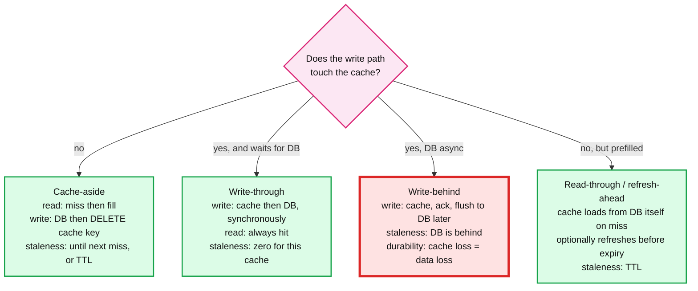
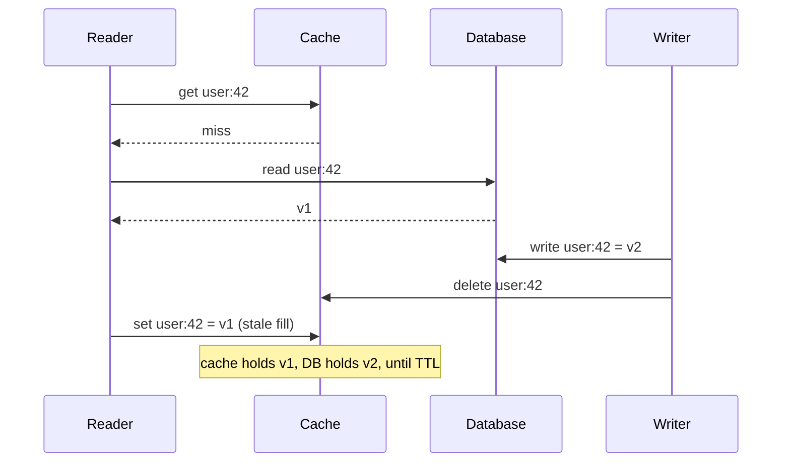
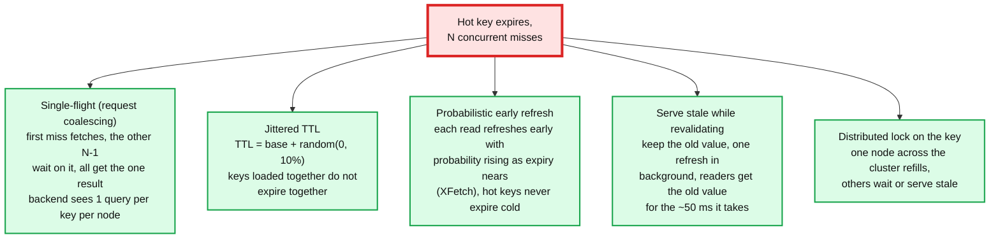

# Concept: Caching Patterns and Invalidation

> One-liner: a cache is a copy of data placed closer to the reader so most reads never touch the source; the design questions are **who writes the cache** (the application on a miss, or the write path), **how a stale copy gets fixed** (TTL, explicit invalidation, or versioned keys), and **what happens when a hot key expires and 10,000 readers miss at once** (single-flight and jittered TTLs). Every cache is a consistency trade made on purpose, and the Staff answer states the staleness bound in seconds.

Depth target: high-level, same as [sharding.md](sharding.md) and [bloom-filter.md](bloom-filter.md). It is under test in the distributed cache, deny list, Zanzibar, and feed problems, and "how do you invalidate" is the follow-up that separates levels. Because single-flight is a small piece of DSA, this note has runnable code.

---

## 1. Mental model

The database can serve 5k QPS. The read load is 500k QPS. A cache in front absorbs 99% of reads, and the database sees 5k. The price is that a value in the cache can be older than the value in the database, and someone has to decide by how much.


Three numbers describe any cache:

- **Hit ratio.** 99% means the backend sees 1% of traffic. 90% means 10%, ten times more. The difference between 99% and 99.9% is another 10x on the backend. Hit ratio is the metric, and a drop of one point is an incident.
- **Staleness bound.** The longest a reader can see an old value. TTL-based: the TTL. Invalidation-based: the invalidation delay, typically ms. Write-through: zero for readers of that cache.
- **Miss cost.** What one miss costs the backend, and what 10,000 simultaneous misses cost. This is the stampede number.

Where caches live, from nearest to farthest: **browser** (HTTP cache headers), **CDN** (edge, static and semi-static), **API gateway**, **app-local** (in-process LRU, microseconds, per node), **distributed** (Redis, memcached, sub-ms, shared), **database buffer pool** (the DB's own). Each layer has its own staleness and its own invalidation problem.

---

## 2. Who writes the cache: the four patterns



| Pattern | Read | Write | Staleness | Fits | Trap |
|---|---|---|---|---|---|
| **Cache-aside** (lazy) | App checks cache, on miss reads DB and writes cache | App writes DB, then **deletes** the cache key | Until the next read refills it, bounded by TTL | The default. Read-heavy, tolerates ms of staleness. | Delete-then-write and write-then-delete both have a race, section 3. |
| **Write-through** | Always a hit (cache is populated on write) | App writes cache and DB together, sync | Zero for readers of this cache | Data that must be fresh and is written rarely | Every write pays two systems. Cache holds everything written, including cold data. |
| **Write-behind** (write-back) | Hit | App writes cache, cache flushes to DB in batches | DB behind by the flush interval | Counters, metrics, anything where losing the last N seconds is acceptable | **Cache node dies, unflushed writes are gone.** Needs replication or a WAL in the cache. |
| **Read-through** | Cache fetches from DB itself on miss | Separate | TTL | Libraries (Caffeine, Guava `LoadingCache`) | Same as cache-aside with the miss logic moved into the cache. |
| **Refresh-ahead** | Hit; cache refreshes hot keys shortly before expiry | Separate | Under one TTL for hot keys | Hot keys with expensive loads | Refreshes cold keys for nothing unless gated on recent access. |

**Delete, not update, on write for cache-aside.** Updating the cache on write seems better (no miss) but two concurrent writers can leave the cache with the older value (writer A updates DB, writer B updates DB, B updates cache, A updates cache: cache has A's value, DB has B's). Delete is idempotent and order-independent. The next reader refills from the DB, which is authoritative.

---

## 3. Invalidation: how a stale copy gets fixed

"There are only two hard things in computer science." This is the one that pages you.

| Mechanism | How | Staleness bound | Cost |
|---|---|---|---|
| **TTL** | Every entry expires after `T` | `T` | Free. Misses at every expiry. Everything is stale up to `T`, even if never written. |
| **Explicit delete on write** | Writer deletes the key after the DB commit | ms, the delete latency | Every write path must know every cache key its write affects. Miss it once and that key is stale until TTL. |
| **Event-driven** (CDC) | Database change log feeds an invalidator that deletes affected keys | 100 ms to 1 s | No app code forgets. One more pipeline. Handles writes that bypass the app (migrations, admin scripts). Facebook's mcsquare / McRouter model. |
| **Versioned keys** | Key includes a version: `user:42:v17`. Writer bumps the version in a small, authoritative place. Readers look up the version, then the versioned key. | Version lookup latency | Two lookups per read (cache the version too, briefly). Old versions expire by TTL. No delete race: a new version is a new key. |
| **Lease / generation** (memcached leases, Facebook) | On a miss the cache hands the reader a lease token. A fill is only accepted if the lease is still valid. A delete invalidates outstanding leases. | ms | Solves the fill-after-delete race in section 3.1. |
| **Pub/sub broadcast** | Writer publishes `invalidate(key)`, every app-local cache subscribes | ms, plus fan-out to N nodes | N nodes times write rate messages. Nodes that were down missed it: pair with TTL. |

### 3.1 The cache-aside race



Fixes, cheapest first:

1. **Short TTL as a backstop.** The stale window is bounded. Most systems stop here, with a TTL of seconds to minutes.
2. **Memcached leases.** The miss returns a lease; the delete invalidates it; the stale `set` is rejected.
3. **Versioned keys.** The reader fills `user:42:v1`; the writer bumped the version to `v2`; nobody reads `v1` again.
4. **Delayed double delete.** Writer deletes, writes DB, sleeps ~500 ms, deletes again. Catches the stale fill most of the time. Ugly but common.

### 3.2 Multi-layer invalidation

An app-local cache in front of Redis in front of the DB has three copies. A delete in Redis does nothing for the 200 app-local caches. Options: short TTL on the local layer (1 to 5 s, the usual answer), pub/sub broadcast of invalidations to all app nodes, or versioned keys where the version lives in Redis and the local cache stores `(version, value)`.

---

## 4. Stampede: hot key expiry and single-flight

A key read 10,000 times per second expires. In the next millisecond, hundreds of readers miss, and every one of them queries the database for the same row. The database that was fine at 5k QPS sees a burst it cannot serve, and now *every* miss is slow, which means more concurrent misses. This is the **thundering herd** or **cache stampede**, and it is the standard way a cache outage becomes a database outage.



| Technique | Cuts the herd to | Cost |
|---|---|---|
| **Single-flight** (per node) | 1 backend call per key per app node | Waiters pay the fetch latency. Per-node, so 200 nodes still make 200 calls. |
| **Jittered TTL** | Spreads expiry, does not prevent per-key herds | None. Always do it. |
| **Probabilistic early refresh** (XFetch, Vattani et al. 2015) | Hot keys refresh before expiry, one reader at a time | A few early refreshes per TTL per hot key. Cold keys just expire. |
| **Stale-while-revalidate** | 1 backend call, zero waiters | Readers see one stale value during the refresh. Needs a soft TTL (refresh) and a hard TTL (evict). |
| **Distributed lock on refill** | 1 backend call per key cluster-wide | A lock round trip on every miss. Lock holder dies, everyone waits for the lock TTL. |
| **Never expire, invalidate only** | No expiry herd at all | Every write must invalidate correctly. Memory grows to the full key set. |

**Negative caching.** A miss for a key that does not exist (deleted user, unknown ID) is the most expensive kind: the DB scans an index and returns nothing, and nothing is cached, so the next request misses again. Cache the absence (`user:99 = NONE`, short TTL). A [bloom-filter.md](bloom-filter.md) in front does the same for a known key universe. Attack traffic (random IDs) is all negative lookups.

---

## 5. Code

Python, runnable, no dependencies. A per-process single-flight wrapper and a demonstration that 1,000 concurrent misses for the same key result in one backend call.

```python
import threading
import time
from collections import defaultdict


class SingleFlight:
    """Coalesce concurrent calls for the same key into one in-flight execution."""

    def __init__(self):
        self._lock = threading.Lock()
        self._inflight: dict[str, tuple[threading.Event, list]] = {}

    def do(self, key: str, fn):
        with self._lock:
            entry = self._inflight.get(key)
            if entry is None:
                entry = (threading.Event(), [])            # (done signal, result slot)
                self._inflight[key] = entry
                leader = True
            else:
                leader = False
        done, slot = entry
        if leader:
            try:
                slot.append(("ok", fn()))
            except Exception as e:                          # propagate the same failure to all waiters
                slot.append(("err", e))
            finally:
                with self._lock:
                    del self._inflight[key]                 # next miss after this one starts a new flight
                done.set()
        else:
            done.wait()
        status, value = slot[0]
        if status == "err":
            raise value
        return value


if __name__ == "__main__":
    backend_calls = defaultdict(int)
    calls_lock = threading.Lock()

    def load_from_db(key: str):
        with calls_lock:
            backend_calls[key] += 1
        time.sleep(0.05)                                    # 50 ms "database" read
        return f"value-for-{key}"

    sf = SingleFlight()
    results = []

    def reader():
        results.append(sf.do("user:42", lambda: load_from_db("user:42")))

    threads = [threading.Thread(target=reader) for _ in range(1000)]
    t0 = time.perf_counter()
    for t in threads:
        t.start()
    for t in threads:
        t.join()
    print(f"1000 concurrent misses: backend calls = {backend_calls['user:42']}, "
          f"all same result = {len(set(results)) == 1}, wall time = {(time.perf_counter() - t0) * 1000:.0f} ms")
```

Expected output: `backend calls = 1`, `all same result = True`, wall time around 100 to 200 ms, which is one 50 ms backend read plus the cost of starting 1,000 Python threads. The line to remember: the check-and-insert into `_inflight` under one lock, so exactly one caller becomes the leader.

---

## 6. Eviction and sizing

When the cache is full, something goes. The policy is a bet about what will be read again.

| Policy | Idea | Good | Bad |
|---|---|---|---|
| **LRU** | Evict the least recently used | Simple, good for temporal locality | A single scan (backup, crawler) evicts the whole working set. |
| **LFU** | Evict the least frequently used | Keeps hot keys through a scan | Old hot keys stay forever; needs decay. Counters cost memory. |
| **TinyLFU / W-TinyLFU** (Caffeine) | Small LRU window for new keys, frequency sketch (count-min) gates admission to the main LFU | Near-optimal hit ratio on real traces, scan-resistant | More complex. The default in Caffeine, worth naming. |
| **ARC** | Adapts between recency and frequency | Self-tuning | Patented (IBM), rarely in open source. |
| **Random / sampled LRU** (Redis) | Sample 5 keys, evict the least recent | Cheap, no linked list | Approximate. Redis `allkeys-lru` is this. |
| **TTL-only** | Nothing evicted until expiry | Predictable | Memory bounded only by TTL times write rate. |

Sizing: **the working set is what matters, not the total data.** If 5% of keys get 95% of reads, a cache holding 5% of the data gets a 95% hit ratio. Measure the hit ratio curve against cache size on a trace before buying RAM. Redis: ~100 bytes overhead per key on top of the value. 100M keys of 200 B values is ~30 GB.

**Redis vs memcached** in one line: memcached is a flat multi-threaded LRU with no persistence and no data structures, and is faster per core for plain get/set; Redis is single-threaded per shard with data structures, replication, persistence, pub/sub, and Lua, and is the default for anything beyond plain caching.

---

## 7. Where you meet it

| System | Pattern | Detail |
|---|---|---|
| **Facebook memcache** ("Scaling Memcache at Facebook", 2013) | Cache-aside, delete on write, leases against stale fills, McSqueal tails the MySQL binlog to invalidate across regions | The reference paper. Regional pools, gutter pool for failed servers, ~99% hit ratio. |
| **Zanzibar** (Google authz) | Per-check cache keyed by (object, relation, user, snapshot timestamp) | The `zookie` (a snapshot token) makes the cache consistent: a check at snapshot T can be cached forever because the answer at T never changes. Consistency by versioning, not by invalidation. |
| **CDNs** (Cloudflare, Akamai, Fastly) | TTL via `Cache-Control`, purge API for explicit invalidation, stale-while-revalidate, surrogate keys for tag-based purge | Purge propagation is ~150 ms globally at Fastly. Surrogate keys let one purge hit every page containing product 42. |
| **HTTP** | `Cache-Control: max-age`, `ETag` and `If-None-Match` for conditional revalidation, `stale-while-revalidate` | A 304 revalidation is the versioned-key pattern over HTTP. |
| **DynamoDB DAX** | Write-through for item writes, read-through with TTL for queries | Item cache and query cache have different staleness. |
| **Twitter / Instagram feeds** | Redis lists as the materialised feed, write fan-out populates them | The cache *is* the serving store; the DB is the fallback. |
| **Deny list / block list** (`hld/` #23) | Bloom filter plus local cache, pushed invalidations with a version, TTL backstop | Consistency window is the pushed-invalidation latency, stated in seconds. |
| **Database buffer pools, OS page cache** | LRU variants with scan resistance (Postgres clock-sweep, MySQL midpoint insertion) | The reason "the DB is fast on the second query". |
| **Caffeine, Guava** | W-TinyLFU, loading cache, refresh-ahead | The in-process layer. |

---

## 8. Practical additions every real implementation has

| Addition | Problem it fixes |
|---|---|
| **Jittered TTL** | Synchronised expiry. |
| **Single-flight per node** | Per-node herd. |
| **Stale-while-revalidate with soft and hard TTL** | Waiters during refresh. |
| **Negative caching** | Repeated misses on absent keys. |
| **Leases or versioned keys** | Stale fill race. |
| **CDC-driven invalidation** | App code forgetting to invalidate. |
| **Short TTL on the local layer** | Multi-layer staleness. |
| **Hit ratio metric per key class, alert on a 1-point drop** | Silent degradation into a DB overload. |
| **Gutter pool** | A failed cache server sends its whole keyspace to the DB. Redirect its misses to a small spare pool. |
| **Warm-up on deploy** | Cold cache after a restart is a stampede. Replay recent keys or pre-fill top-N. |
| **Cache key namespace with a version prefix** | Schema change makes old cached values wrong. Bump the prefix, everything misses once. |
| **Per-key TTL by data class** | Config: minutes. User profile: seconds. Balance: do not cache, or version it. |
| **Compression for large values, size cap per value** | One 10 MB value evicts 100k small ones. |

---

## 9. Failure modes and what happens

| Failure | What happens | Fix |
|---|---|---|
| Cache cluster down | 100% miss. DB gets 100x load, falls over. Full outage from a "cache". | Gutter pool, load shedding at the DB, degrade features, and size the DB for some multiple of the miss rate. |
| Hot key expires | Stampede. DB spike. | Single-flight, early refresh, stale-while-revalidate. |
| Deploy restarts all app nodes | Every local cache cold at once. Redis gets the full load. | Rolling deploy, warm-up. |
| Write path forgets to invalidate one key | Stale until TTL. Users see old data. | CDC invalidation, or versioned keys. |
| Update-on-write with concurrent writers | Cache holds the older value indefinitely. | Delete, not update. |
| Stale fill race | Stale until TTL. | Leases, versioned keys, TTL backstop. |
| Write-behind cache node dies | Unflushed writes lost. | Replicate the cache, or accept the loss window and say so. |
| No negative caching | Every lookup for a missing key hits the DB. Random-ID attack takes the DB down. | Cache absence. Bloom filter. |
| Scan evicts working set (LRU) | Hit ratio collapses during a batch job. | TinyLFU, or a separate cache for the batch path. |
| Large value | Evicts thousands of small ones, and one get saturates the NIC. | Size cap, compression, split. |
| Key schema change, old values still cached | Deserialisation errors or wrong data. | Version prefix on all keys. |
| Multi-layer, local cache not invalidated | Users on node A see the update, on node B do not. | Short local TTL or broadcast. |

---

## 10. Trade-offs

| Gain | Cost |
|---|---|
| Cache-aside: simple, only hot data cached, cache failure is survivable. | Miss latency on first read, stale-fill race, every writer must invalidate. |
| Write-through: readers of this cache never see stale. | Write latency doubles, cold data fills the cache. Other caches (local, CDN) still stale. |
| Write-behind: fastest writes, absorbs bursts. | Data loss on cache failure. DB is behind. |
| TTL: bounded staleness with zero coordination. | Everything is potentially stale for a full TTL, and expiry causes herds. |
| Explicit invalidation: ms staleness. | Every write path must be correct. One miss is stale until TTL. |
| CDC invalidation: nothing forgotten, handles out-of-band writes. | One more pipeline, 100 ms to 1 s lag. |
| Versioned keys: no delete race, consistent snapshots (Zanzibar). | Two lookups, old versions consume memory until TTL. |
| Single-flight: herd to 1 per node. | Waiters pay latency, per-node only. |
| Local cache: microsecond reads, no network. | N copies, N invalidation targets, memory times N. |

**What a Staff answer refuses to build:** a cache with no stated staleness bound, update-on-write for cache-aside, a write-behind cache for anything that cannot lose data, a hot-key path with no single-flight, a cache tier the database cannot survive losing, and TTLs without jitter.

---

## 11. Numbers worth memorizing

- Hit ratio: **99% means the DB sees 1%**. 99% to 90% is 10x more DB load. Alert on a 1-point drop.
- Latency: in-process cache ~100 ns to 1 µs. Redis or memcached same-AZ ~0.2 to 0.5 ms. DB point read ~1 to 5 ms. CDN edge ~10 to 30 ms to the user.
- Redis: ~100k ops/s per core, single-threaded per shard, ~100 B overhead per key. memcached: ~1M ops/s per node multi-threaded.
- TTL jitter: base plus random 0 to 10%. Local layer TTL: 1 to 5 s. Distributed layer: seconds to hours by data class.
- Stampede: a key at 10k reads/s expiring means ~10 to 50 concurrent misses per ms without coalescing.
- Facebook memcache: 99% hit ratio, leases cut stale sets and herds, binlog-driven invalidation in ~1 s cross-region.
- CDN purge propagation: ~150 ms (Fastly), seconds (others). Surrogate-key purge: one call, thousands of URLs.
- Working set rule: **if 5% of keys get 95% of reads, cache 5%.** Measure the curve.
- Negative cache TTL: 10 to 60 s.

---

## 12. Interview soundbite

> "Cache-aside with delete-on-write is my default: the app fills on a miss, the writer commits to the database and then deletes the key, and a jittered TTL bounds any staleness the delete misses. I state the bound: seconds at the distributed layer, one to five seconds at the app-local layer. Stale fills from the read-write race are stopped with memcached-style leases or versioned keys; where the write path cannot be trusted to invalidate I tail the database change log instead. Hot-key expiry is the outage path, so every fetch goes through single-flight, hot keys refresh probabilistically before expiry, and absent keys are cached negatively. The database is sized to survive the cache being gone, with a gutter pool and load shedding, because a cache that the backend cannot live without is not a cache, it is a second database with no durability."

Follow-ups an interviewer will ask, in order of likelihood:

1. How do you invalidate? (Section 3, delete on write, CDC, versioned keys, and the staleness bound.)
2. A hot key expires. (Section 4, single-flight, early refresh, stale-while-revalidate.)
3. What is the race in cache-aside? (Section 3.1, stale fill, leases.)
4. Cache goes down. What happens to the DB? (Section 9, gutter pool, shedding, size for it.)
5. Update or delete the cache on write? (Section 2, delete, concurrent writer race.)
6. Local cache plus Redis: how do you keep both fresh? (Section 3.2, short local TTL or broadcast.)
7. Which eviction policy and why? (Section 6, W-TinyLFU for scan resistance, LRU if simple.)
8. Someone requests random user IDs at 100k QPS. (Section 4, negative caching, Bloom filter.)
9. How does Zanzibar cache permission checks consistently? (Section 7, snapshot token in the key.)

Related: [sharding.md](sharding.md) (consistent hashing for the cache tier, hot key detection), [bloom-filter.md](bloom-filter.md) (negative lookups, one-hit wonders), [fan-out-fan-in.md](fan-out-fan-in.md) (coalescing at the aggregator), [replication-and-quorums.md](replication-and-quorums.md) (replicating the cache tier), [stream-processing.md](stream-processing.md) (CDC pipeline for invalidation), [rate-limiting-and-load-shedding.md](rate-limiting-and-load-shedding.md) (protecting the DB when the cache fails), `hld/` #20 distributed cache, #23 deny list, #30 Zanzibar.
