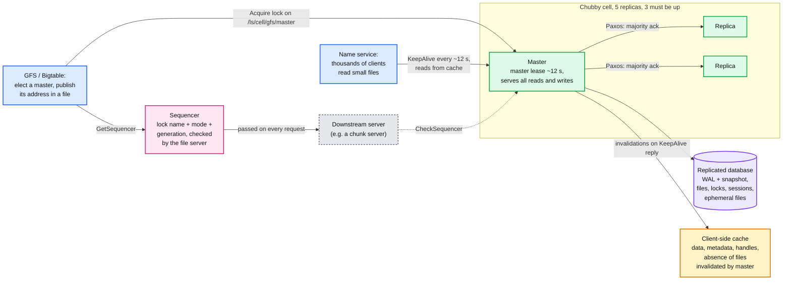
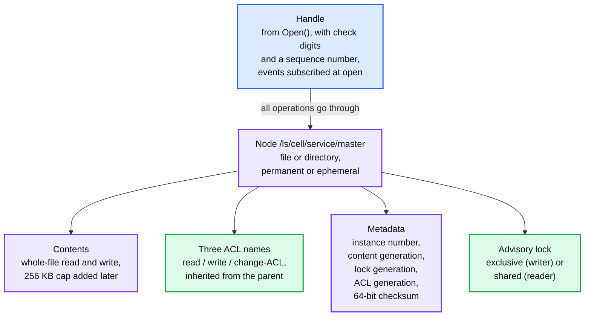
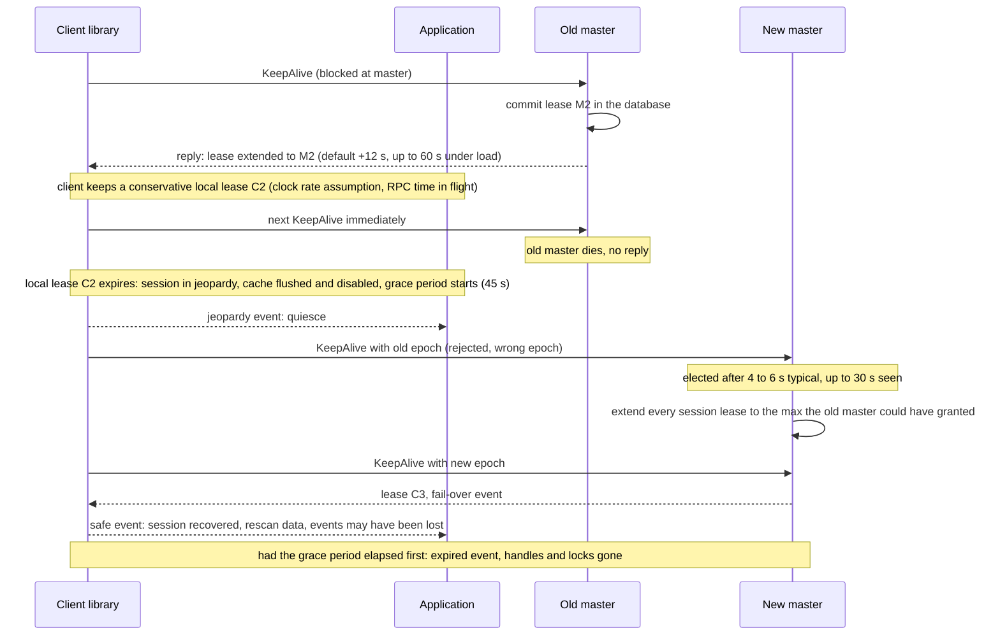
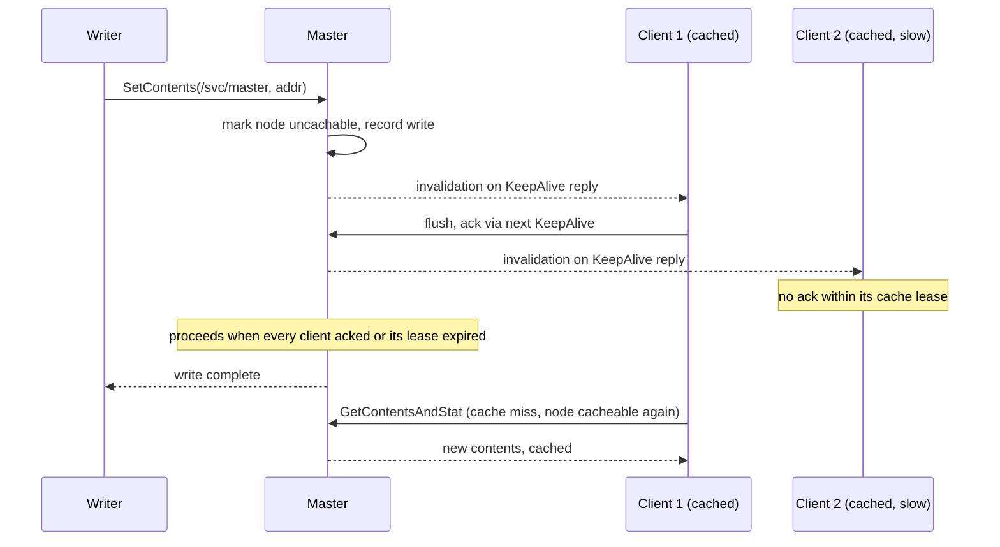
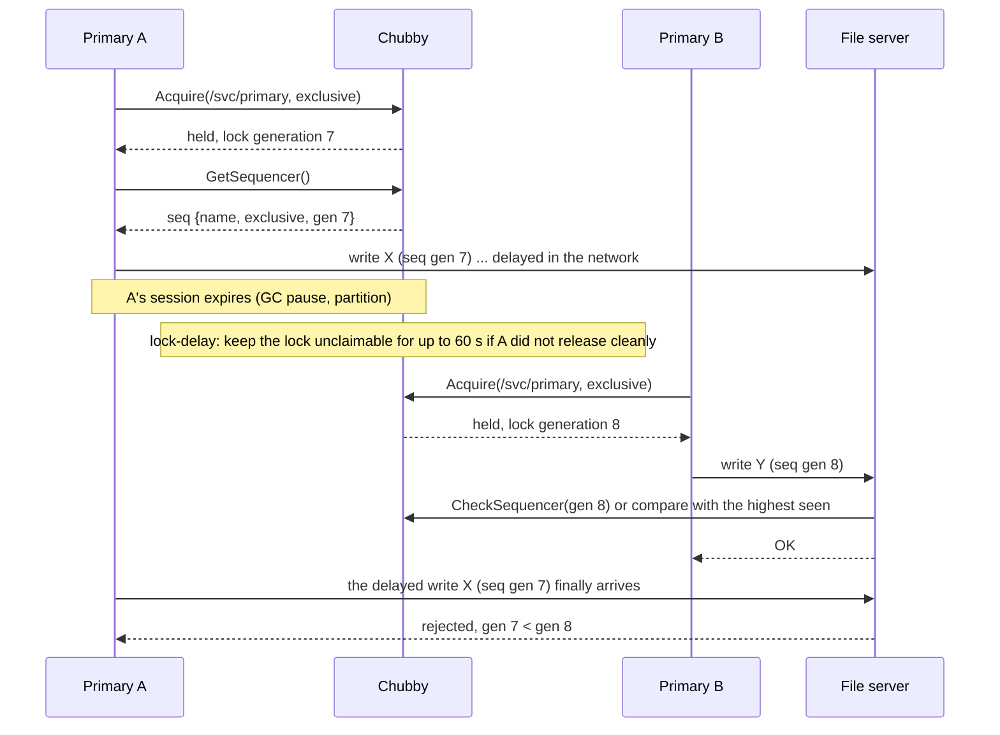
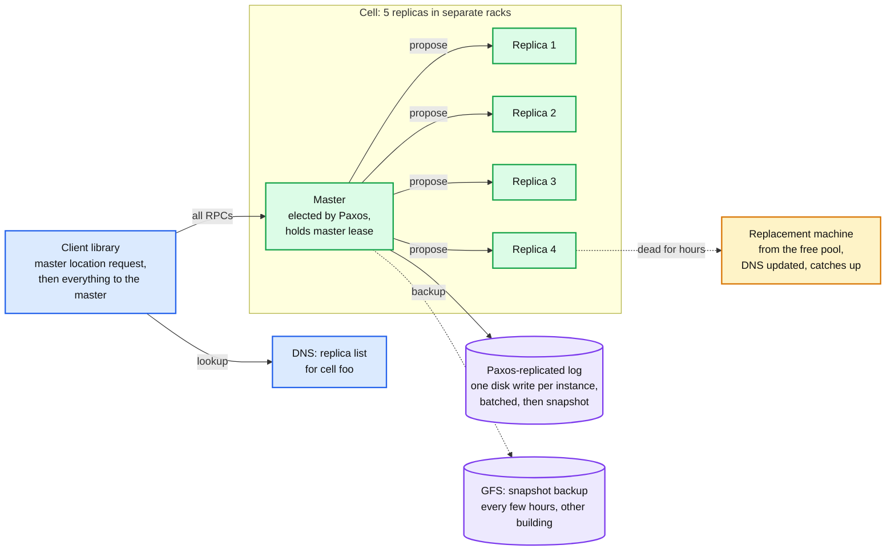
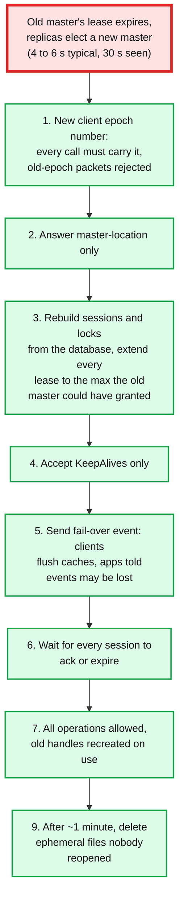
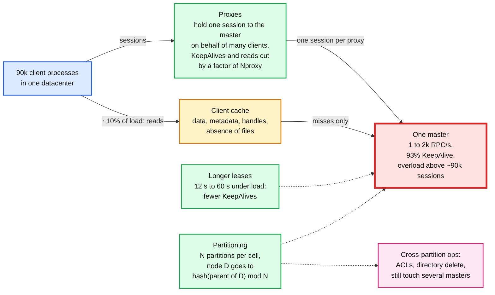
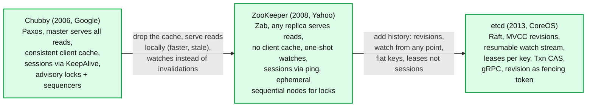

# Concept: Chubby

> One-liner: Chubby is Google's lock service (2006): a cell of 5 replicas elects one master with Paxos, the master serves a tiny filesystem of small files with **advisory reader/writer locks**, **sessions** kept alive by KeepAlive RPCs, **consistent client caches** invalidated by the master, and **sequencers** (fencing tokens) so a stale lock holder cannot damage anything. It exists to do coarse-grained work like electing the GFS or Bigtable master and to be the name service, and it is the design that ZooKeeper and etcd re-implemented in the open.

Depth target: high-level, same as [etcd.md](etcd.md) and [zookeeper.md](zookeeper.md). Chubby is not something you deploy; you read it because every "design a lock service / leader election / coordination store" question is Chubby's paper with the names changed, and because the paper is the best written account of what goes wrong in production with locks, caches, and sessions.

Sources: "The Chubby lock service for loosely-coupled distributed systems" (Burrows, OSDI 2006) and "Paxos Made Live" (Chandra, Griesemer, Redstone, PODC 2007), read in full. Every number in section 13 is from those two papers.

---

## 1. Mental model

A Chubby **cell** is 5 machines. One is the **master**; it holds a master lease from the others and serves every read and write. Clients talk only to the master, keep a **session** alive with KeepAlive RPCs, and cache file contents locally with the master invalidating on change. Locks are **advisory** and **coarse-grained**: held for hours or days by a primary, not milliseconds by a transaction.

- **Why a lock service and not a Paxos library.** The paper's answer: teams bolt availability onto working systems late, and "acquire a lock, write the master's address into a file" is something every programmer already understands. A consensus library would have forced them to redesign.
- **Why coarse-grained.** Lock churn is low, so the master handles tens of thousands of clients. Locks survive master fail-over so a primary is not re-elected because Chubby hiccupped.
- **Reads and writes both go to the master**, reads served from its memory under the master lease. Compare ZooKeeper, where any replica serves reads.

**Why this matters at Staff level.** Senior answers describe leader election with a lock. Staff answers cover the four things the paper spends its pages on: what a lock holder does when it cannot tell whether it still holds the lock (jeopardy, grace period), how a downstream server rejects a stale holder (sequencer, lock-delay), what a client cache promises and what it costs the master (invalidation on the KeepAlive path), and what actually caused outages and data loss over 700 cell-days (network and software, not disks).

---

## 2. Namespace, files, and handles

The interface looks like a filesystem so that existing tools work and programmers need no new concepts. `/ls/foo/wombat/pouch`: `ls` for lock service, `foo` the cell (resolved by DNS), the rest is the cell's tree.

Deliberate omissions, each with a reason in the paper: no moves (cross-directory rename is expensive under partitioning), no path-based permissions (one lookup per file, ACL is per node), no modified time on directories, no last-access time (so the cache never has to write back), no symbolic links.

- **Ephemeral files** vanish when no client has them open (directories: when empty). They are the "I am alive" indicator, one per process, and the basis of membership.
- **Generation numbers** are the concurrency story: `SetContents` can pass a content generation and fails if the file changed; the lock generation goes into the sequencer; the instance number distinguishes a re-created node from the old one with the same name.
- The API is small: `Open`, `Close`, `Poison`, `GetContentsAndStat`, `SetContents`, `Delete`, `Acquire` / `TryAcquire` / `Release`, `GetSequencer` / `SetSequencer` / `CheckSequencer`, plus `SetACL` and `GetStat`. Whole-file operations only.

---

## 3. Sessions, KeepAlives, and the master lease

A session is a lease between client and master. The client keeps it alive with a **KeepAlive** RPC that the master deliberately **blocks** until the lease is nearly out, then answers with a new lease. Every event and cache invalidation rides back on that reply. So there is almost always one KeepAlive parked at the master per client, and RPC traffic is 93% KeepAlives.

- **Jeopardy** is the honest state: the client's own lease ran out and it cannot tell whether the master expired the session. It stops trusting its cache and warns the application. If a KeepAlive succeeds within the **grace period (45 s)**, the application saw only a delay; if not, the session is **expired** and every lock and ephemeral file is gone.
- **Master lease.** The master holds a lease from a majority of replicas (renewed as long as it keeps winning votes) so it can serve reads from memory alone: no other master can exist while the lease is valid. Election happens only after the lease expires, which bounds fail-over at lease plus election.
- **Lease length is the load knob.** Under heavy load the master stretches leases from 12 s toward 60 s so it processes fewer KeepAlives. Failing to answer KeepAlives in time is the typical symptom of an overloaded master.
- Compare ZooKeeper: same session idea, but ZooKeeper's client pings on a timer and the cluster expires; Chubby's KeepAlive is the transport for everything, so a client cannot keep its session without also acknowledging invalidations.

---

## 4. Consistent client cache

Clients cache file data, metadata, open handles, and even the **absence** of files (negative caching, 32k entries in the sample cell), all in memory, with a lease. The master keeps a list of who might cache what and invalidates on change; it never pushes updates.

- The cache is **strictly consistent**: a client never reads stale data from it, because the write does not complete until all cachers have dropped it. The paper calls this "heavyweight" and says it is why Chubby is a bad pub/sub system.
- Handles are cached too: reopening a file you already opened costs no RPC. Locks can be cached as well, held until another client's conflicting request produces an event.
- Cost: one slow client delays every writer of that file for up to a cache lease. Mitigation in the paper: piggybacking invalidations on KeepAlives means a client cannot stay alive while ignoring them.
- This is where DNS-style TTL caching was rejected: TTLs either make the name service slow to update or hammer the master. Invalidation gives immediate updates at the cost of tracking cachers.

---

## 5. Locks, sequencers, and lock-delay

Locks are advisory: holding `/foo` does not stop anyone reading `/foo`, it only stops others from *acquiring* the lock. The hard problem is not mutual exclusion inside Chubby, it is the **delayed message from a client that lost the lock** arriving at some other server.

- A **sequencer** is an opaque string: lock name, mode, lock generation. The holder passes it on every request to servers that guard the resource; the server checks it against Chubby (or against the highest sequencer it has seen) and rejects anything older. This is the fencing token from [leases-fencing-clocks.md](leases-fencing-clocks.md), and the paper is where the idea was published.
- **Lock-delay** is the fallback for servers you cannot modify: if a lock is freed because the holder died rather than released, nobody can take it for up to a minute. It reduces the window for delayed messages; it does not close it.
- **Coarse-grained by design.** Few clients hold locks (1k exclusive, 0 shared in the sample cell). Fine-grained locking is left to the application, which can use one Chubby lock to elect a server that then hands out its own cheap locks. Lock loss on Chubby fail-over is acceptable because it is rare; lock loss on every network blip would not be.

Primary election in four lines, from the paper: all candidates `Acquire` the same lock; the winner writes its identity into the file with `SetContents`; the others read the file (with a modification event) to find the primary; the primary gets a sequencer and its servers `CheckSequencer` it, or use a lock-delay.

---

## 6. Events

Subscribed at `Open`, delivered asynchronously after the change has taken effect (so a client that reads after the event sees the new state):

| Event | Used for |
|---|---|
| File contents modified | "The primary's address changed", the name service |
| Child added / removed / modified | Membership via ephemeral files, mirroring, without holding the children open |
| Master failed over | "You may have missed events, rescan" |
| Handle or lock invalid | Usually a communication problem |
| Lock acquired, conflicting lock request | Rarely used; the paper says they could have been omitted, clients wait for the file write instead |

Events are a notification that something changed, not the change itself. Same design conclusion as ZooKeeper's one-shot watch: re-read after the event.

---

## 7. Under the hood: replicas, Paxos, database, fail-over

- **Consensus**: Multi-Paxos with a master lease, see [paxos.md](paxos.md). Writes are acknowledged when a majority has them. Reads never touch the replicas. A replica dead for a few hours is replaced from a free pool and DNS is updated; the new one catches up from the log.
- **Database**: first the replicated version of Berkeley DB (path-name keys sorted so siblings are adjacent), then, because its replication code was young and Chubby needed only atomic operations, a purpose-built WAL plus snapshot store on top of their own Paxos. "Paxos Made Live" is that rewrite: one disk write per Paxos instance on each replica (not five), batching, master leases, snapshots with a "snapshot handle" tying the app snapshot to the log position, and a corrupted-disk replica that rejoins as a non-voter until it has caught up. Their benchmark: 640 ops/s at 20 workers on 5-byte files, 3.6x the Berkeley DB version.
- **Backup**: every few hours the master writes a database snapshot to GFS in a different building.
- **Mirroring**: a global cell (replicas spread across distant datacenters) holds config that is mirrored into every local cell; the event mechanism keeps mirrors current within seconds.

### 7.1 Fail-over, the part with "a rich source of interesting bugs"

- **Client epoch** is the master's fencing token against its own past: a packet sent to a previous master, even one on the same machine, is rejected.
- **Conservative lease extension** is why sessions survive fail-over: the new master cannot know what the old one promised, so it assumes the maximum.
- The original design wrote every new session to the database, which melted under start-up storms; they changed it to write a session on its first modification, lock, or ephemeral open. Read-only sessions then cost nothing durable. Proxies made this worse, because a proxy's sessions look like one client to the master (section 8).

---

## 8. Scaling a cell: 90,000 clients on one master

Chubby's clients are **processes**, not machines. One cell per datacenter of several thousand machines sees tens of thousands of sessions on one master that is an ordinary machine. So every scaling trick reduces traffic to the master rather than speeding it up.

- The master is the red node by construction: one process, ordinary hardware, every read and write. The paper is explicit that micro-optimising it "has little effect"; only cutting traffic does.
- **Proxies** are trusted and can answer KeepAlives and reads themselves; writes and lock operations still go through (under 1% of load). A proxy that dies takes many sessions into jeopardy at once, which is the fail-over interaction they call out.
- **Partitioning** was designed and never needed in practice. Its rule keeps siblings together (hash the parent) so directory listing stays local.
- Naming turned out to be the dominant use: 60% of open files are name-related. The consistent cache was heavier than a name service needs, so they added a protocol-conversion name server and a DNS front end.

---

## 9. What went wrong: the lessons section

The paper's best part. Each of these is a Staff-level interview answer waiting to happen.

| Surprise | What happened | What they did |
|---|---|---|
| Developers do not plan for unavailability | Apps assumed Chubby, especially the global cell, was always up; a Chubby outage became their outage | Review every planned use, inject artificial outages, make the client library keep working through short outages |
| No quotas | One team rewrote a 1.5 MB file on every user action until it dwarfed every other client | 256 KB file size limit; it took about a year to move the data out |
| Pub/sub attempts | The invalidation cache makes Chubby slow for anything but trivial fan-out | Caught in review |
| Abusive clients | Loops that call `Open` in a tight loop, or that never close handles | Artificial delays in `Open`, review of RPC rates and file counts |
| Java clients | JNI wrapper for the C library was slow and awkward; teams avoided it | Kept the C library as the single implementation |
| Fail-over cost | Writing every new session durably melted under start-up storms; proxies multiplied sessions | Sessions recorded on first write or lock; rethink proxy fail-over |
| Fine-grained locks | Expected demand, never materialised | Not built |
| Outages | 61 in 700 cell-days; most under 15 s, 52 under 30 s; the long nine were network maintenance (4), network (2), software (2), overload (1) | Apps tolerate 30 s; the client library's grace period is 45 s |
| Data loss | 6 times in a few dozen cell-years: 4 database software bugs, 2 operator errors during upgrades to fix those bugs, 0 hardware | Rewrote the database on their own Paxos; runtime consistency checks (Paxos Made Live) |

---

## 10. Failure modes and what pages you

| Failure | Behaviour | Design response |
|---|---|---|
| Master dies | Master lease expires, election 4 to 6 s typical, up to 30 s. Sessions survive via grace period. Locks survive | Grace period 45 s > worst election; clients quiesce on jeopardy |
| Client cannot reach master for > local lease | Jeopardy: cache disabled, app warned. If > grace period: expired, locks and ephemerals lost | Fencing with sequencers, lock-delay for legacy servers |
| Master overloaded (> 90k sessions, read storms) | KeepAlives answered late, sessions dropped in bulk | Longer leases, proxies, client cache, review of abusive clients |
| One slow cacher | Delays every write to that file for up to one cache lease | Invalidation on KeepAlive path, so an alive client must ack |
| Replica dies | Majority continues; replaced within hours from the free pool via DNS | Five replicas, three needed |
| Datacenter loses the cell | Everything that used it as a name service or lock root stalls | Local cell per DC, global cell mirrored, apps must tolerate ~30 s |
| Database corruption on a replica | Detected by checksum / GFS marker; replica rejoins as a non-voter and catches up | Paxos Made Live section 5.1 |
| Delayed packet from an old master or old client | Rejected by client epoch / master epoch | Epoch numbers on every call |

---

## 11. Chubby, ZooKeeper, etcd

| | Chubby | ZooKeeper | etcd |
|---|---|---|---|
| Consensus | Multi-Paxos + master lease | Zab | Raft |
| Reads | Master only, from memory under lease | Any server, local, may be stale | Linearizable via ReadIndex, or local serializable |
| Client cache | Consistent, master-invalidated | None in the protocol | None in the protocol |
| Liveness | Session, KeepAlive blocked at master | Session, client ping | Lease, keepalive stream |
| Change notice | Events on handle | One-shot watches | Watch stream from a revision |
| Locks | First-class advisory locks, shared / exclusive | Recipe on sequential ephemerals | Recipe on Txn + lease |
| Fencing token | Sequencer (name, mode, generation) | Sequence number, `czxid` | `revision`, `create_revision` |
| Stale-holder fallback | Lock-delay up to 60 s | None | None |
| Scale unit | One cell per DC, ~90k sessions | Ensemble + observers | One cluster, ~50k writes/s |
| Where | Google internal | Hadoop, HBase, Kafka < 4.0 | Kubernetes, CNCF |

---

## 12. When you meet it in an interview

Chubby is the answer key for:

- **Design a distributed lock service** (#33): section 3 (sessions, jeopardy, grace), section 5 (sequencers, lock-delay), section 7.1 (fail-over with epochs), section 8 (why one master and how to keep it alive).
- **Leader election for GFS / a file system master** (#3): acquire the lock, write the address into the file, everyone else watches the file, servers check the sequencer.
- **Name service / service discovery**: consistent cache vs TTL, and why the paper ended up adding a DNS front end anyway.
- **Coordination store sizing**: KeepAlive-dominated load, lease length as the throttle, proxies before partitioning.

What a Staff answer refuses to build, quoting the paper: fine-grained locks in the lock service, mandatory locks, a pub/sub system on the event mechanism, a storage system in the lock service (256 KB), and a fail-over design that writes every session durably.

---

## 13. Numbers worth memorizing

- Cell: **5 replicas**, **3 must be up**; typically **one cell per datacenter** of several thousand machines, plus a **global cell** spread across datacenters.
- Master lease and session lease default **12 s**, stretched up to **~60 s** under load. Grace period **45 s**. Lock-delay bound **1 minute**.
- Master election **4 s and 6 s** in two recent cases, **up to 30 s** observed; sample cell fail-over duration **14 s**.
- Sample cell: **22k** direct clients, **32k** proxied, **12k** open files (60% naming), **230k** client-cache entries for **24k** distinct files (~10 clients per file), **32k** negative-cache entries, **1k** exclusive locks, **0** shared, **8k** directories, **22k** files (90% under 1 KB), RPC **1 to 2k/s**, **93%** KeepAlive, **2%** GetStat, **1%** Open, **0.4%** SetContents, Acquire **31 ppm**.
- Scale: up to **90,000** clients on one master; overload above that. Mean latency "a small fraction of a millisecond" until overload.
- Outages: **61** in **700 cell-days**, most **≤ 15 s**, **52 < 30 s**; apps tolerate **30 s**. Data loss **6** times in a few dozen cell-years (4 software, 2 operator, 0 hardware).
- File size cap **256 KB** (after a 1.5 MB file rewritten per user action). Reads under **10%** of load; proxies cut KeepAlives and reads by **Nproxy**; partitioning by **hash(parent) mod N**.
- Paxos Made Live: **one** disk write per Paxos instance per replica instead of five; **640 ops/s** at 20 workers on 5-byte files vs 178 on the Berkeley DB version (3.6x); 100 MB database.

---

## 14. Interview soundbite

> "Chubby is a lock service: five replicas run Paxos to elect a master with a lease, the master serves a small filesystem out of memory, and clients hold sessions kept alive by KeepAlive RPCs that the master blocks and uses to carry cache invalidations. Locks are advisory and coarse-grained, held by a primary for its whole life. The two ideas I carry into any design: when my session lease runs out I am in jeopardy, so I stop trusting my cache and wait a grace period before I assume I lost the lock; and I never let a lock be the only protection, I hand every downstream server a sequencer, the lock's generation number, and it rejects anything older, with a lock-delay as a fallback for servers I cannot change. Operationally the master is the bottleneck by design: ninety thousand sessions, ninety-three percent of RPCs are KeepAlives, so the levers are longer leases, client caching, and proxies, not a faster master. The paper's own lessons: apps do not plan for outages, so I test with injected ones; there were no quotas, so I add them on day one; and the data loss they saw came from software and operators, never disks."

Follow-ups an interviewer will ask, in order of likelihood:

1. The lock holder pauses and its session expires. How do you stop its late writes? (Section 5, sequencer; lock-delay if the server cannot check.)
2. Why is the master the only reader? (Section 3, master lease makes memory reads safe; section 8, the cost is that it is the bottleneck.)
3. What happens to sessions and locks when the master dies? (Section 3 and 7.1, grace period, conservative lease extension, epochs.)
4. Why a lock service rather than a Paxos library? (Section 1, teams add availability late; locks are a known concept.)
5. Why coarse-grained? (Section 5, low churn, survive fail-over, fine-grained belongs to the app.)
6. How does the client cache stay consistent, and what does it cost? (Section 4, invalidation before write completes, one slow client delays writers.)
7. How do you scale to 90k clients? (Section 8, leases, cache, proxies, then partitioning.)
8. What actually caused outages? (Section 9, network and software; 30 s tolerance.)
9. Chubby vs ZooKeeper vs etcd for a new system? (Section 11, etcd; the differences are read path, cache, and history.)
10. What would you leave out? (Section 12, fine-grained locks, mandatory locks, pub/sub, large files.)

Related: [paxos.md](paxos.md) (the consensus underneath, and Paxos Made Live's engineering), [zookeeper.md](zookeeper.md) and [etcd.md](etcd.md) (the open-source descendants), [leases-fencing-clocks.md](leases-fencing-clocks.md) (sequencer = fencing token, jeopardy = lease expiry handling), [caching-patterns.md](caching-patterns.md) (invalidation vs TTL, the name-service trade-off), `hld/distributed-file-system/` (GFS master election is the canonical use), `hld/distributed-job-scheduler/` (partition ownership with epochs).
