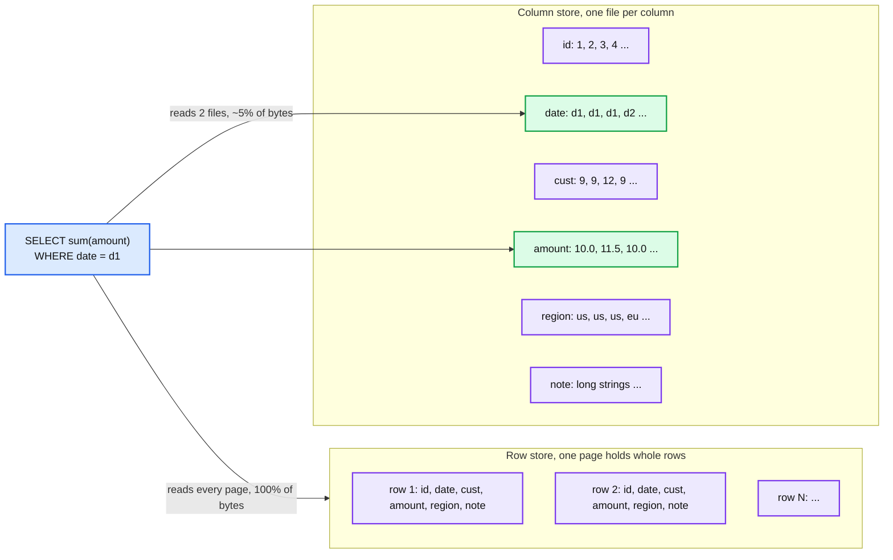
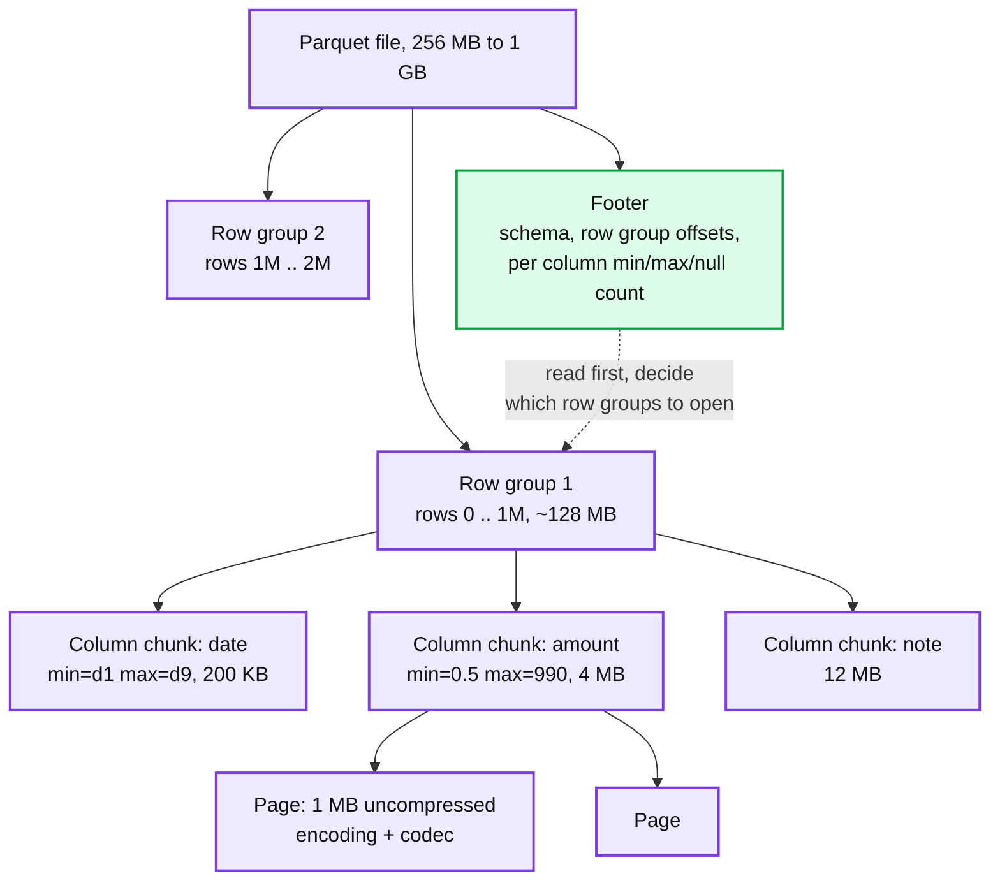
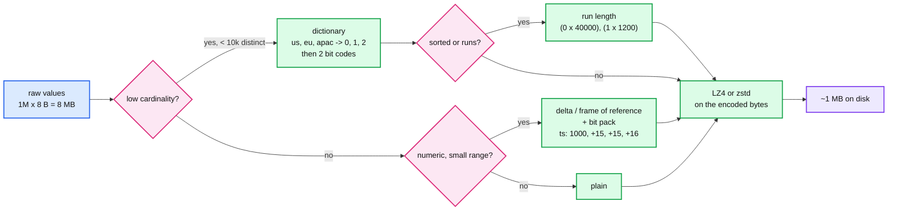
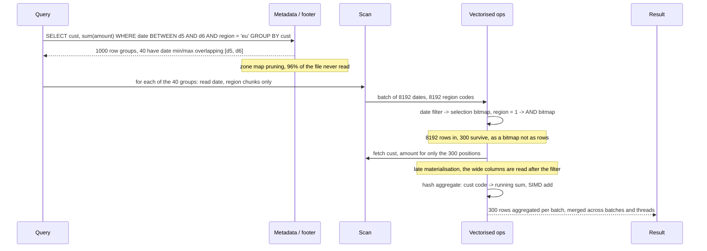
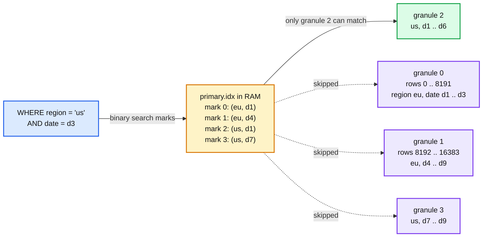
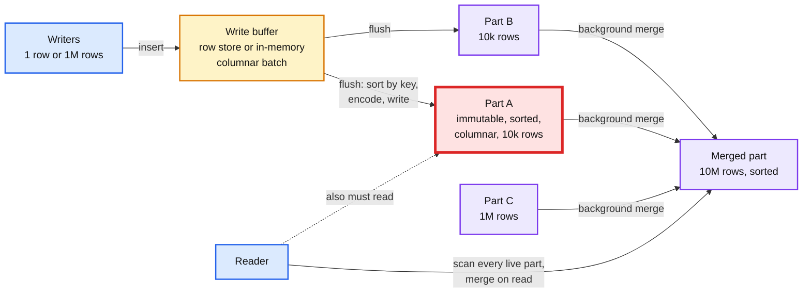
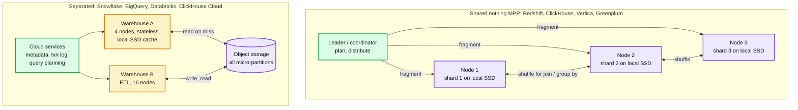

# Concept: Columnar Database

> One-liner: a columnar database stores each column of a table as its own contiguous, compressed array instead of storing rows one after another. A query that reads 3 columns out of 50 then touches 3/50 of the bytes, similar values sit next to each other so they compress 5 to 10x, and the engine can process a whole column at a time with tight CPU loops. The price is that writing or reading one full row means touching every column file, so single-row inserts, updates and point lookups get slow.

Depth target: high-level, same as [lsm-tree.md](lsm-tree.md) and [time-series-db.md](time-series-db.md). Reference implementations: Parquet for the file layout, ClickHouse MergeTree for a full engine, Snowflake for the separated compute and storage shape.

---

## 1. Mental model

Every table is a 2D grid. The only real question is which direction you serialise it to disk.

Three wins, in order of size:

| Win | Why | Typical number |
|---|---|---|
| **Read only the columns you need** | Analytical queries touch 3 to 10 columns of a 50 to 500 column table. Row stores read whole pages regardless. | 10 to 50x less IO |
| **Compression** | A column is one type and often low entropy: 5 distinct regions, sorted dates, small deltas. Dictionary + run-length + bit packing + LZ4 on top. | 5 to 10x smaller than the row store, 3x smaller than a gzipped CSV |
| **Vectorised execution** | The engine runs `sum` over an array of 1024 doubles in a tight loop, SIMD, no per-row function calls and branches. | 10 to 100x fewer CPU cycles per row than a tuple-at-a-time row engine |

And the one loss that every other section is about: **a row is now scattered across N files.** Inserting one row is N appends, reading one row is N random reads, updating one field means rewriting a compressed block. Columnar engines are OLAP (online analytical processing) engines. They are not a replacement for the row store under your checkout page.

**History in one line each.** Sybase IQ (1996) shipped a commercial column store. C-Store (Stonebraker, 2005) became Vertica and set the write-optimised-store + read-optimised-store pattern. MonetDB/X100 (2005) invented vectorised execution and became VectorWise. Dremel (Google, 2010) added nested columnar and became BigQuery and the Parquet format (2013). ClickHouse (2016 open source) and DuckDB (2019) are the two engines most likely to come up in an interview today.

**Trap to name out loud:** Cassandra, HBase and Bigtable are "wide-column" stores. They are **row-oriented** with flexible columns per row and a column-family grouping. They are not columnar. Saying "Cassandra is a columnar database" in an interview is an instant credibility loss.

---

## 2. File layout: row groups, column chunks, pages

Pure column-per-file does not survive contact with reality: you still need to reassemble rows, and a 10 TB column cannot be one file. So every format chops the table **horizontally first** into row groups, then **vertically** into column chunks inside each group. Parquet is the reference vocabulary.

| Level | Parquet | ORC | ClickHouse MergeTree | Snowflake | What it is for |
|---|---|---|---|---|---|
| **Horizontal slice** | Row group, 128 MB to 1 GB | Stripe, 64 to 256 MB | Part (a directory) and inside it granules of 8192 rows | Micro-partition, 50 to 500 MB raw, ~16 MB compressed | Unit of parallelism and of skipping. Each carries min/max per column. |
| **Column inside slice** | Column chunk | Column stream | One `.bin` file per column per part | Column inside the micro-partition | Unit of "read only these columns". |
| **Compression unit** | Page, ~1 MB | Compression chunk, 256 KB | Block, 64 KB to 1 MB | Internal | Decompress this much to read one value. Sets the point-lookup cost. |
| **Statistics** | Footer: min, max, null count, distinct estimate per chunk | Same, plus optional bloom filter | `primary.idx` sparse index, one mark per granule, plus skip indexes | Per micro-partition metadata in the cloud services layer | Prune before reading. Section 4. |

The footer at the end (not the start) is deliberate: the writer streams row groups out and appends metadata last, so a file is written in one pass and never rewritten. Readers fetch the last 8 bytes for the footer length, then the footer, then only the byte ranges they need. This is what makes Parquet on S3 work: two small range reads, then targeted large ones.

**Nested data** (structs, arrays, maps) is flattened into columns too. Dremel's trick is two extra small integer columns per leaf, **repetition level** and **definition level**, that say how deep in the array and how far down the struct a value sits. `user.addresses[].city` becomes one column of cities plus those two levels, and you can read cities without reading the rest of the address.

---

## 3. Encoding and compression

Columns compress well because the encoder sees one type with structure. The pipeline is two stages: a **type-aware encoding** that exploits the structure, then a **general codec** that squeezes what is left.

| Encoding | Works on | How | Ratio | Bonus |
|---|---|---|---|---|
| **Dictionary** | Strings and anything with few distinct values | Store distinct values once, replace each value with its index, bit pack the indexes. | 10 to 100x on `region`, `status`, `country` | Filters run on the dictionary: `region = 'eu'` becomes `code = 1`, an integer compare. Group by can use the code as an array index. |
| **Run length (RLE)** | Sorted columns, columns with long repeats | `(value, count)` pairs. | 1000x on a sort key | `count(*) where x = v` sums run lengths without touching values. |
| **Bit packing** | Small integers, dictionary codes | Use 3 bits instead of 32 when max value is 7. | 4 to 16x | Decodes at memory bandwidth with SIMD. |
| **Delta, delta-of-delta** | Timestamps, sequences, sorted ints | Store differences from the previous value, then bit pack. | 10x on timestamps | Same trick as [time-series-db.md](time-series-db.md) section 4. |
| **Frame of reference** | Ints clustered in a narrow band | Store `min` once, then `value - min` bit packed. | 4 to 8x | Random access stays O(1), unlike delta. |
| **Gorilla XOR** | Floats that drift slowly | XOR with previous, store the changed bits. | 5 to 10x on sensor data | ClickHouse `Gorilla` codec, InfluxDB. |
| **General codec** | The output of the above | LZ4 (fast, ~2x), zstd (slower, ~3x), Snappy (Parquet default). | 2 to 3x on top | Always on. LZ4 decompresses at ~4 GB/s per core, so it is close to free. |

Two consequences that shape everything else:

- **Sort order is the biggest compression knob.** A sorted column is runs and small deltas. An unsorted one is noise. That is why every columnar engine has a sort key / clustering key (section 5), and why the same table can be 3x bigger under a bad one.
- **Compression ratio depends on cardinality, and cardinality is per column, not per table.** `user_id` will not compress. `event_date` will. Put the high-entropy columns last in the sort key or leave them out.

---

## 4. Query execution: skip, then vectorise, then materialise late

A columnar engine plans a scan in three moves. Being able to narrate them is the difference between "it reads fewer columns" and actually understanding the speedup.

| Move | What it does | Why it matters |
|---|---|---|
| **Predicate pushdown + zone maps** | Every row group carries min/max per column. `date BETWEEN d5 AND d6` skips any group whose range does not overlap. Bloom filters do the same for equality on high-cardinality columns. | Turns "scan 1 TB" into "scan 40 GB" without an index. Only works if the data is sorted or naturally clustered on the filter column, section 5. |
| **Projection pushdown** | Read only the referenced columns. | The original columnar win. Falls apart on `SELECT *`. |
| **Vectorised execution** | Operators take a batch (1k to 64k values of one column) and return a batch. Filters produce a selection vector or bitmap. Aggregates loop over arrays. | CPU is the bottleneck once IO is pruned. Tuple-at-a-time engines spend 90% of cycles in function call overhead and branch misses. Vectorised loops let the compiler and CPU pipeline them. ClickHouse and DuckDB both quote ~1 GB/s per core for simple aggregations. |
| **Late materialisation** | Evaluate filters on the narrow, cheap columns first. Only decode the wide columns (strings, JSON) for the rows that survived. Reassemble rows as late as possible, ideally never. | A filter with 1% selectivity means 99% of the expensive string decoding is skipped. Early materialisation (build rows first, then filter) throws away the columnar advantage. |
| **Operating on compressed data** | Compare dictionary codes not strings, sum run lengths not values. | Skips the decode step for common predicates. |

Parallelism falls out of the layout: each row group is independent, so N cores scan N row groups and merge partial aggregates. Hash joins and group bys build hash tables on the dictionary codes where possible.

---

## 5. Sort keys and the sparse primary index

There is usually no B-tree. Instead the table is kept sorted by a chosen key and the engine keeps one entry per block, a **sparse index**, so it can jump to the right block range and scan from there.

- **Sparse, not dense.** One index entry per 8192 rows means a 10B row table has ~1.2M marks, a few hundred MB, fits in RAM. A dense B-tree would be as big as the data.
- **Prefix rule.** The index helps for a filter on a prefix of the sort key. `ORDER BY (region, date)` serves `region = x` and `region = x AND date = y`, but `date = y` alone scans everything (or relies on min/max skipping). Same rule as a composite B-tree index, but here it is the one index you get.
- **Choose the key by (a) most common filter first, (b) lowest cardinality first for compression, (c) the timestamp last.** `(tenant_id, event_type, toDate(ts))` is the common shape.
- **Skip indexes** (ClickHouse `INDEX ... TYPE minmax / set / bloom_filter GRANULARITY n`) add per-N-granule statistics on non-key columns. They prune, they do not locate. Cheap, and the right answer to "how do you filter on a column that is not in the sort key".
- **Cloud warehouses hide this as clustering.** Snowflake clustering keys, BigQuery clustering, Redshift sort keys, Databricks `ZORDER` / liquid clustering. Same idea: keep micro-partitions sorted so min/max pruning works. Re-clustering is a background rewrite that costs compute credits, which is where the "why is my Snowflake bill high" conversation starts.

---

## 6. The write path: why single-row inserts hurt and what to do about it

Writing one row to a 50 column table means appending to 50 compressed streams. Compressed blocks are immutable, so you cannot append in place. Every columnar engine solves this the same way: **buffer rows somewhere row-friendly, convert to columns in batches, merge in the background.** It is the LSM tree again.

| Engine | Buffer | Part | Merge | Failure mode |
|---|---|---|---|---|
| **C-Store / Vertica** | WOS, a row-oriented write-optimised store in RAM | ROS, read-optimised columnar on disk | Tuple mover moves WOS to ROS in batches | WOS overflow when ingest outruns the mover. |
| **ClickHouse MergeTree** | None. Each `INSERT` writes one part directly. | Part directory, one `.bin` + `.mrk` per column, sorted by `ORDER BY` | Background merges combine parts, like LSM tiered compaction | **Too many parts.** 1 row per insert = 1 part per insert. Past 300 active parts per partition, inserts are throttled, then rejected. Batch to 10k+ rows or use async_insert. |
| **SQL Server / Oracle columnstore** | Delta store, a B-tree row group | Compressed row group, 1M rows | Tuple mover compresses closed delta stores | Small trickle inserts leave data in slow delta stores. |
| **Parquet on a lake (Delta, Iceberg, Hudi)** | Spark or Flink micro-batch in memory | New Parquet files per commit, a transaction log lists them | Compaction job (`OPTIMIZE`) rewrites small files into 1 GB files | **Small files.** A 1 minute streaming job writes 1440 files/day/partition. Listing and opening them dominates query time. |
| **Snowflake / BigQuery** | Streaming ingest buffer (row oriented, separate service) | Micro-partition | Automatic reclustering and compaction | Streaming rows are visible but slower to query until compacted. Costs credits. |

Small red part is the bottleneck: every reader must merge every live part, so read latency degrades linearly with un-merged part count. The dial is batch size on the writer and merge concurrency on the engine.

---

## 7. Updates and deletes

Compressed, sorted, immutable column blocks cannot be updated in place. Three strategies, and modern engines support two or all three.

| Strategy | How | Read cost | Write cost | Where |
|---|---|---|---|---|
| **Copy on write** | Rewrite the whole part / file with the row changed or removed. | Zero, files are clean. | Rewrite up to 1 GB to change one row. | Delta Lake default, Iceberg COW, ClickHouse `ALTER ... UPDATE` mutations (rewrites affected parts asynchronously). |
| **Merge on read with delete markers** | Append a tombstone (row id, or a **deletion vector** bitmap per file). Readers apply the bitmap. Compaction removes for real. | Apply a bitmap per file, usually cheap. Updates become delete + insert, so the reader also dedups. | Tiny. | Iceberg MOR, Delta deletion vectors (2023+), ClickHouse lightweight `DELETE`, Hudi MOR tables. |
| **Versioned rows, dedup on read** | Insert a new version with a higher version column. Reader keeps the max version per key. Merges collapse versions. | Dedup per key at read time unless merged. | Same as insert. | ClickHouse `ReplacingMergeTree`, `CollapsingMergeTree`. CDC pipelines into a warehouse. |

Rule of thumb: **updates are rare and batch, or you picked the wrong store.** A columnar table fed by a CDC stream at 10k updates/s is a merge-on-read table with a compaction schedule and a query-time dedup. That works. The same table with `UPDATE ... WHERE id = ?` from an application is a mistake.

**Transactions** on the lake formats are optimistic: the transaction log (Delta `_delta_log/`, Iceberg metadata files) is the only mutable thing, writers add files then commit by atomically appending a log entry, conflicting commits retry. Snapshot isolation and time travel fall out of it. Related to the HLD problem #15 in [hld/README.md](../hld/README.md).

---

## 8. Scaling out: shared-nothing MPP vs separated compute and storage

| | Shared nothing | Separated compute and storage |
|---|---|---|
| **Where data lives** | Local disks of the compute nodes, sharded by a distribution key (hash of `customer_id`, or round robin). | Object storage. Compute nodes cache hot micro-partitions on local SSD. |
| **Scaling** | Add a node, rebalance shards (hours, IO heavy). Compute and storage scale together whether you need both or not. | Add a warehouse in seconds, no data movement. Scale storage to zero compute at night. |
| **Isolation** | One cluster, all workloads contend. | Many warehouses on the same data. ETL cannot slow dashboards. |
| **Latency** | Lower. Data is local, no S3 round trip. Sub-second on hot data. | First touch pays an S3 read (10s of ms per object, high throughput). Cache makes the second query fast. |
| **Cost** | Pay for the cluster 24/7. | Pay per second of compute plus $0.02 per GB month of storage. Cheap when idle, expensive when a query is sloppy. |
| **Joins** | Co-located join if both tables are distributed on the join key, else shuffle across the network. Distribution key choice is the main tuning knob. | Same shuffle inside a warehouse. No co-location control, so pruning and broadcast joins matter more. |
| **Consistency** | Node local, coordinator serialises DDL. | Metadata service is the single writer of the transaction log. Snapshot isolation across all warehouses for free. |

**The shuffle** is the cost centre of any distributed group by or join: every node repartitions its rows by the group or join key and sends them over the network. Tricks to avoid it: distribute both tables on the join key (co-located), **broadcast** the small table to every node (dimension tables), pre-aggregate locally then shuffle only partial sums (two-phase aggregation). A Staff answer to "the join is slow" starts with "which of the three is it doing".

---

## 9. Where columnar falls over

| Workload | What happens | Number | Use instead |
|---|---|---|---|
| **Point lookup by primary key** | Binary search the sparse index, then decompress a whole granule (8192 rows) for every selected column. | 5 to 50 ms vs 0.1 ms in a B-tree. | Row store, or a KV cache in front. |
| **High rate of small inserts** | Each insert is a part or a delta store entry. Merges cannot keep up. | ClickHouse throttles at ~300 parts per partition. Wants batches of 10k to 1M rows. | Buffer in Kafka, micro-batch every 1 to 10 s. |
| **Frequent updates by key** | Every update is a rewrite or a tombstone plus read-time merge. | 100 updates/s is fine with MOR, 10k/s is a compaction treadmill. | Row store as the system of record, CDC into the column store. |
| **`SELECT *` on wide tables** | Reads every column, reassembles rows, loses both IO and CPU advantages. | 50 columns = 50 file reads per row group. | Project columns. Or accept it for exports. |
| **Many concurrent small queries** | Each query still parallelises across cores and scans granules. 1000 dashboards refreshing every 5 s saturates CPU. | Warehouses cap concurrency at ~8 to 20 queries per cluster. | Result cache, pre-aggregated tables, a serving layer (Druid, Pinot) built for high QPS. |
| **Transactions across rows** | No row-level locking, no multi-statement isolation in most engines. | ClickHouse: none. Snowflake: statement-level with optimistic retry. | OLTP database. |
| **Bad sort key** | Zone maps prune nothing, compression is 2x instead of 10x, every query is a full scan. | 5x cost difference on the same table. | Re-sort. It is a rewrite, so choose carefully up front. |

---

## 10. HTAP: getting both

"I want OLTP writes and OLAP reads on the same data" is a common follow-up. The answers, from simplest to most integrated:

| Approach | How | Freshness | Example |
|---|---|---|---|
| **Two stores + CDC** | Row store is the source of truth. Change data capture streams into a columnar store. | Seconds to minutes. | Postgres -> Debezium -> Kafka -> ClickHouse / Snowflake. The default answer. |
| **Row store with a columnar replica** | The database maintains a column format copy of hot tables, keeps it in sync via the replication log, routes analytical queries to it. | Sub-second, transactionally consistent snapshot. | TiDB TiFlash (Raft learner replica in column format), SQL Server columnstore index, Oracle Database In-Memory dual format. |
| **Row store with time-based conversion** | Recent rows stay row-format for inserts and updates. After N days a chunk is converted to columnar. | Immediate, but analytics on recent data is row-speed. | TimescaleDB compression, see [time-series-db.md](time-series-db.md) section 11. |
| **Single hybrid engine** | One storage engine with a row buffer and columnar segments, query planner picks. | Immediate. | SingleStore, Alloy DB columnar engine, DuckDB for a single node. |

The trade-off is always the same: **the closer the analytics get to the transactional writes, the more the OLTP side pays** in memory, replication lag sensitivity, or CPU stolen from the write path. CDC into a separate store is boring and correct. Say so, then say when you would move up the table (sub-second freshness is a product requirement, or the ops cost of two systems is the bottleneck).

---

## 11. The landscape

| System | Type | Storage | Sort / prune | Distributed model | Note |
|---|---|---|---|---|---|
| **Parquet, ORC** | File format | Row groups, column chunks, pages, footer stats | Min/max, bloom, dictionary | None, a file | The lingua franca. Every engine reads it. |
| **Delta Lake, Iceberg, Hudi** | Table format over Parquet | Parquet files + transaction log | Partition + file stats in metadata | Any engine (Spark, Trino, Flink) | ACID, time travel, schema evolution. HLD #15. |
| **DuckDB** | Embedded engine | Own format + reads Parquet | Zone maps | Single node, all cores | "SQLite for analytics". Vectorised, 1 GB/s per core. |
| **ClickHouse** | Server engine | MergeTree parts, one file per column | Sparse primary key, skip indexes | Shared-nothing shards + replicas (Keeper), Cloud version separates storage | Fastest open-source scan engine. Weak joins historically, no transactions. |
| **Apache Druid, Pinot** | Real-time OLAP | Segments with bitmap inverted indexes per column | Bitmap index on every dimension | Shared-nothing, deep storage in S3 | Built for 1000s of QPS of sub-second queries on event streams. Trades flexibility for concurrency. |
| **Snowflake** | Cloud warehouse | Micro-partitions in S3 | Per partition min/max, clustering keys | Separated, virtual warehouses | Zero-ops, pay per second. |
| **BigQuery** | Cloud warehouse | Capacitor format in Colossus | Partitioning + clustering | Dremel: separated, serverless slots | Scans TB in seconds by throwing thousands of workers at it. Pay per byte scanned. |
| **Redshift** | Cloud warehouse | 1 MB blocks per column per slice | Sort keys, zone maps | Shared-nothing, RA3 nodes add managed S3 tier | Postgres-derived SQL. Distribution key matters. |
| **Vertica** | Server engine | ROS containers, projections | Sorted projections | Shared-nothing, Eon mode separates | C-Store's descendant. Projections = materialised sorted copies. |
| **Cassandra, HBase, Bigtable** | Wide-column, **not columnar** | Row-oriented SSTables, column families | Row key only | Shared-nothing ring / regions | The trap. Column family = grouping of columns stored together, still row by row. |

---

## 12. Failure modes and what happens

| Failure | Symptom | Blast radius | Mitigation |
|---|---|---|---|
| **Too many parts / small files** | Inserts throttled or rejected. Queries slow as they open thousands of files. S3 list calls dominate. | Whole table or partition. | Batch inserts (10k+ rows). Async insert buffering. Scheduled compaction `OPTIMIZE`. Alert on part count and average file size. |
| **Merge / compaction cannot keep up** | Disk fills with un-merged parts. Read latency climbs linearly. | Node. | Merge threads and disk IO headroom. Keep 30% disk free for merge temp space. Back-pressure the writer. |
| **Wrong sort key or partition key** | Every query full scans. Compression 2x not 10x. | Every query on the table. | Re-create the table sorted correctly. There is no online re-sort in most engines, so this is a migration. |
| **Runaway query** | One `SELECT * ... JOIN ... ` without pruning scans 10 TB, spills to disk, starves everything. | Cluster or warehouse. | Query memory limits, max bytes to read, max execution time, a query queue per user. BigQuery: max bytes billed. |
| **Skewed distribution key** | One shard holds 40% of rows. Every query waits for it. | Cluster. | Hash a higher cardinality key or use round robin plus broadcast joins. |
| **Metadata service down** (separated architecture) | Nothing can plan or commit, even though data and compute are fine. | Every warehouse. | This is the SPOF of the separated model. Vendors run it replicated with consensus. |
| **Schema evolution on Parquet** | Old files lack the new column, some readers fail, some return null. | Anything reading the mixed set. | Table format (Iceberg, Delta) with schema tracking. Additive changes only. |
| **Replication lag in HTAP** | Analytics answers are seconds stale and nobody knows. | Correctness of reports. | Expose the watermark. Alert on lag. |

---

## 13. Trade-offs

| Gain | Cost |
|---|---|
| Read 3 columns of 50: 10 to 50x less IO on analytical queries | Read all 50: 50 file reads per row group. `SELECT *` and row reconstruction are the worst case. |
| 5 to 10x compression from type-aware encodings plus a codec | Compression needs sorted, low-entropy columns. A bad sort key gives 2x and no pruning. Re-sorting is a rewrite. |
| Zone maps and sparse indexes prune 90%+ of data with a few hundred MB of metadata | No dense index, so a point lookup decodes a whole granule. 5 to 50 ms, not 0.1 ms. |
| Vectorised execution: 1 GB/s per core, joins and aggregations on integer codes | Engine complexity. Every operator has to be written for batches, with selection vectors and null masks. |
| Immutable parts: trivial replication, backup, object storage, time travel, snapshot isolation for free | Every write is a new part. Updates are rewrites or tombstones plus read-time merge. Small inserts create the "too many parts" failure. |
| Separated compute and storage: elastic, isolated workloads, storage at $0.02 per GB month | Cold reads pay S3 latency. The metadata service is a SPOF. Cost is per query and a sloppy query is expensive. |
| One table format (Parquet) readable by every engine | The file format has no transactions, no schema evolution, no deletes. You need a table format on top, and there are three competing ones. |

**What a Staff answer refuses to build:** an OLTP workload on a column store, a home-grown column format when Parquet exists, a streaming job that commits every second into Parquet without a compaction job, a ClickHouse table with `INSERT` per event, a warehouse without query cost limits, and "Cassandra because it is columnar". It also refuses to answer "row or column" without asking "what is the read pattern, what is the write pattern, and how fresh does it need to be".

---

## 14. Numbers worth memorizing

- **Compression:** 5 to 10x over the row store on typical fact tables, 3x over gzipped CSV. Sorted low-cardinality columns 100x+. `user_id` and free text ~1.5x.
- **Row group / stripe / micro-partition:** Parquet 128 MB to 1 GB, ORC 64 to 256 MB, Snowflake 50 to 500 MB raw (~16 MB compressed), Redshift 1 MB blocks per column.
- **Granule / batch:** ClickHouse 8192 rows per mark, 65536 rows per processing block. DuckDB 2048 vector size. Parquet page ~1 MB.
- **Scan speed:** ~1 GB/s per core for simple filter + aggregate in ClickHouse or DuckDB. 100M to 1B rows/s per server. Full table scan of 1 TB compressed on 32 cores: ~30 s cold from S3, ~5 s from local SSD.
- **Point lookup:** 5 to 50 ms (decompress one granule per column). B-tree: 0.1 ms.
- **Insert batching:** ClickHouse wants 10k to 1M rows per insert, 1 insert/s per table. Throttles at ~300 active parts per partition. Delta/Iceberg target files of 128 MB to 1 GB.
- **LZ4** decompresses at ~4 GB/s per core, **zstd** ~1 GB/s at 20 to 30% better ratio. Snappy sits between.
- **Cloud pricing shape:** S3 $0.023 per GB month. Snowflake ~$2 to $4 per credit hour for an XS warehouse. BigQuery $6.25 per TB scanned on demand (2024). A `SELECT *` on a 10 TB table is a $60 query.
- **Dates:** Sybase IQ 1996, C-Store / MonetDB X100 2005, Dremel 2010, Parquet 2013, ClickHouse open sourced 2016, DuckDB 2019.

---

## 15. Interview soundbite

> "A columnar database stores each column as its own compressed array. Three things fall out. Queries read only the columns they touch, so IO drops 10 to 50x. Values of one type sit together, so dictionary, run-length and delta encoding plus LZ4 give 5 to 10x compression, and a sort key is what makes that work. And the engine processes batches of one column at a time in tight vectorised loops, with min/max zone maps to skip whole blocks before reading them. The cost is that a row is scattered across N files: single-row inserts, updates and point lookups are slow. So every columnar engine buffers writes and merges immutable parts in the background, exactly like an LSM tree, and the failure mode is too many small parts. It is an OLAP engine. I put the transactional system of record in a row store and CDC into the column store, unless sub-second freshness is a real product requirement."

Follow-ups an interviewer will ask, in order of likelihood:

1. Why is it faster, concretely? (Section 1 and 4: fewer bytes, compression, vectorised CPU, zone map pruning. Say all four.)
2. How does compression work and what decides the ratio? (Section 3, sort key and cardinality.)
3. How do inserts and updates work if blocks are immutable? (Sections 6 and 7, buffer + merge, copy-on-write vs merge-on-read.)
4. When would you not use one? (Section 9, point lookups, high update rate, high concurrency small queries, transactions.)
5. Where is the index? (Section 5, sparse primary index, prefix rule, skip indexes.)
6. Shared-nothing or separated storage, and why? (Section 8, elasticity and isolation vs latency and cost.)
7. Is Cassandra columnar? (Section 1. No. Wide-column is row-oriented with column families.)
8. How do you get analytics on fresh transactional data? (Section 10, CDC first, columnar replica if freshness demands.)
9. What is a Parquet footer and why is it at the end? (Section 2, single-pass writes, two range reads to plan.)
10. How does a distributed join work and how do you make it cheap? (Section 8, co-locate, broadcast, pre-aggregate.)
