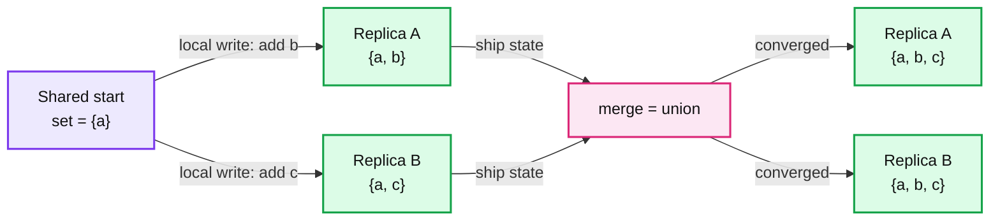
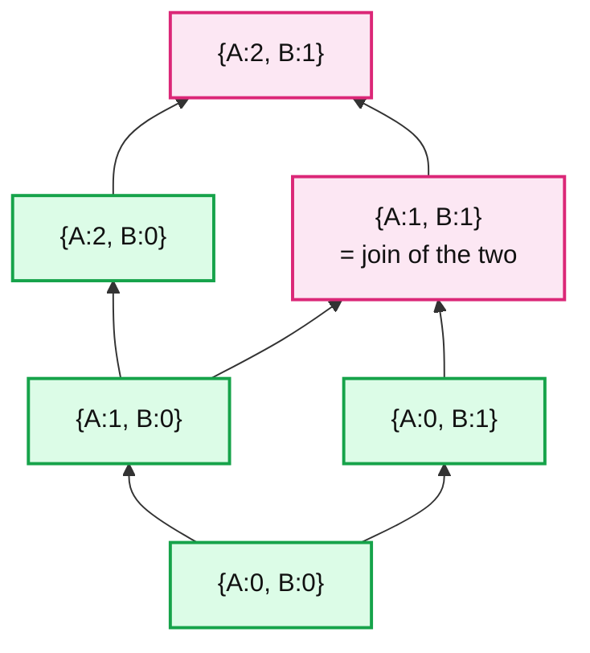
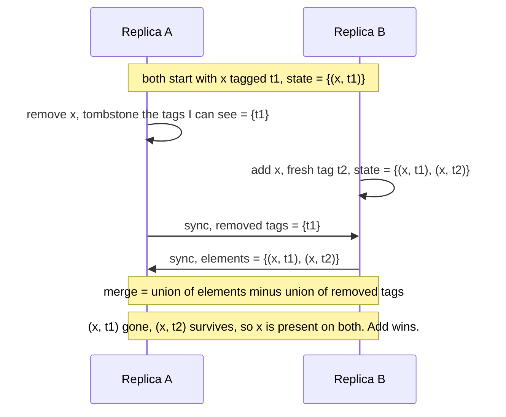
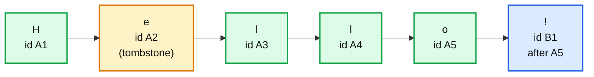
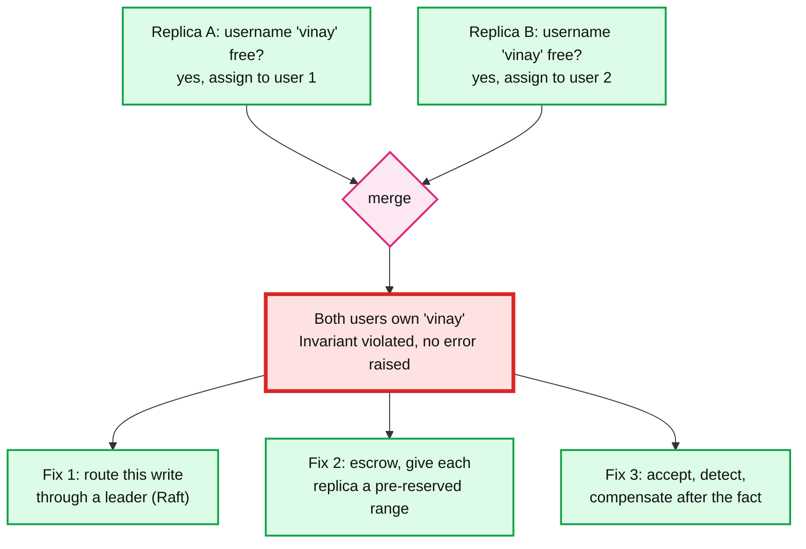
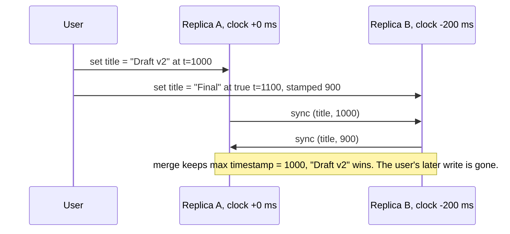
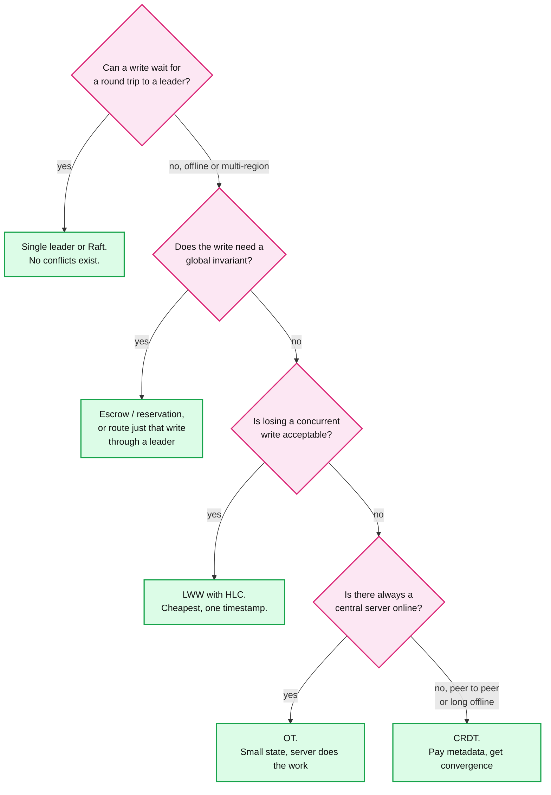

# Concept: CRDTs (Conflict-free Replicated Data Types)

> One-liner: A CRDT is a data structure whose merge function is commutative, associative and idempotent, so any number of replicas can accept writes locally with zero coordination and are mathematically guaranteed to end up in the same state once they have exchanged updates, in any order, any number of times.

Depth target: high-level, same as [gossip-protocol.md](gossip-protocol.md) and [raft.md](raft.md). CRDTs sit at the far end of the spectrum from Raft. Raft makes every write wait for a majority so there is never a conflict. A CRDT lets every write succeed instantly and designs the data so that conflicts cannot exist. Gossip is the transport CRDT state usually rides on.

---

## 1. Mental model



The whole trick is choosing a merge function with three properties:

| Property | Means | Why it matters |
|---|---|---|
| **Commutative** | `merge(a, b) == merge(b, a)` | Messages can arrive in any order |
| **Associative** | `merge(merge(a, b), c) == merge(a, merge(b, c))` | Replicas can merge in any grouping, via any path |
| **Idempotent** | `merge(a, a) == a` | Duplicates and retries are harmless, so at-least-once delivery is enough |

A structure with all three is a **join-semilattice**: state only ever moves "up" toward a bigger value, and merge is the least upper bound. Set union, `max`, and "union of tagged elements" are all joins. Subtraction, overwrite, and "insert at index 5" are not, which is why the hard part of CRDTs is rephrasing ordinary operations as joins.

The guarantee this buys is **Strong Eventual Consistency (SEC)**: any two replicas that have received the same set of updates are in the same state, immediately, without a round of coordination. Plain eventual consistency says "they will agree eventually, somehow". SEC says "the merge is deterministic, so agreement is automatic".

**Why CRDTs exist.** Shapiro, Preguiça, Baquero and Zawirski, INRIA, 2011 ("Conflict-free Replicated Data Types"). Dynamo (2007) had already shown multi-master writes at scale, but it handed conflicts back to the application as "siblings" and the shopping-cart merge famously resurrected deleted items. The 2011 paper asked: which data types can the database merge on its own, provably, without ever asking the app? The answer is the catalogue in §3.

The entire idea fits in a dozen lines. This is a grow-only counter:

```python
class GCounter:
    def __init__(self, replica_id):
        self.id, self.counts = replica_id, {}      # replica -> count

    def increment(self):                            # local write, no network
        self.counts[self.id] = self.counts.get(self.id, 0) + 1

    def value(self):
        return sum(self.counts.values())

    def merge(self, other):                         # elementwise max: commutative, associative, idempotent
        for r, c in other.counts.items():
            self.counts[r] = max(self.counts.get(r, 0), c)
```

Each replica owns one slot and only ever increases it. `max` per slot is the join. Nobody can ever lose an increment.

---

## 2. The three flavours: state, op, delta

```mermaid
%% What flows on the wire in each flavour, and what the receiver must do with it
flowchart TB
    subgraph st["State-based (CvRDT)"]
        SA["A"] -->|"full state {A:3, B:1}"| SB["B"]
        SB -->|"merge = join"| SB2["B = max per slot"]
    end
    subgraph op["Op-based (CmRDT)"]
        OA["A"] -->|"op: increment A"| OB["B"]
        OB -->|"apply op exactly once,<br/>in causal order"| OB2["B += 1"]
    end
    subgraph dl["Delta-state"]
        DA["A"] -->|"delta {A:3} only"| DB["B"]
        DB -->|"merge = join,<br/>delta is itself a state"| DB2["B = max per slot"]
    end

    class SA,SB,SB2,OA,OB,OB2,DA,DB,DB2 service
    classDef service fill:#dcfce7,stroke:#16a34a,stroke-width:2px,color:#111
```



| Flavour | What is shipped | Delivery requirement | Message size | Where |
|---|---|---|---|---|
| **State-based** (convergent, CvRDT) | The whole replica state | Eventual only. Duplicates, reorder, loss-then-retry are all fine because merge is idempotent | Grows with the object. A 10k element set ships 10k elements per sync | Riak data types, anti-entropy in Dynamo-style stores |
| **Op-based** (commutative, CmRDT) | The operation ("add x", "insert char after id 7") | **Reliable causal broadcast**: every op delivered exactly once, and after the ops it causally depends on | Tiny, a few bytes per op | Yjs, Automerge, collaborative editors |
| **Delta-state** | Only the part of state changed since the last sync. A delta is a valid state, so merge is still the join | Eventual, same as state-based. Deltas can be batched and re-sent freely | Small in steady state, full state only on first sync | Akka Distributed Data, Redis Enterprise Active-Active, most modern libraries |

Rule of thumb: state-based is the one you can reason about and prove. Op-based is what you actually want on the wire. Delta-state is the compromise that won (Almeida, Shoker, Baquero, 2016). In practice Yjs and Automerge are hybrids: op-based on the wire, with a compact state encoding for initial sync and storage.

The op-based trap is the delivery requirement. If your transport is plain at-least-once (Kafka, SQS, a retrying HTTP client), an "increment" op applied twice double-counts. You either dedupe by op ID at the receiver or switch to delta-state, where the retry is idempotent for free.

---

## 3. The catalogue

Every CRDT is an ordinary data type plus a decision about what happens when two replicas do conflicting things concurrently. Learn the decision, not the acronym.

| Type | State | Merge | Concurrent conflict rule | The lie it tells | Used in |
|---|---|---|---|---|---|
| **G-Counter** | `map replica -> int` | elementwise max | none, increments commute | cannot decrement | vote counts, likes |
| **PN-Counter** | two G-Counters (P for +, N for -) | max each, value = P - N | none | cannot enforce `value >= 0` | Riak, Redis Enterprise counters |
| **G-Set** | set | union | none | cannot remove | seen-message IDs |
| **2P-Set** | add set + tombstone set | union both | **remove wins**, forever | cannot re-add a removed element | rarely, too rigid |
| **LWW-Register** | `(value, timestamp)` | keep higher timestamp | **last writer wins** | a concurrent write is silently dropped, and "last" depends on clocks | Cassandra cells, Redis Enterprise strings, Figma properties |
| **MV-Register** | `set of (value, version vector)` | keep all concurrent values | **keep both**, app decides | punts the merge to the application | Dynamo / Riak siblings |
| **LWW-Element-Set** | per element `(add_ts, remove_ts)` | max each | timestamp decides, tie-break by config | clock skew flips add/remove | SoundCloud Roshi timelines |
| **OR-Set** (observed-remove, add-wins) | `set of (element, unique tag)` + removed tags | union, minus removed tags | **add wins** over a concurrent remove | element metadata grows with every add | Riak sets, Redis Enterprise sets, Phoenix Presence |
| **OR-Map / JSON CRDT** | OR-Set of keys, each value a nested CRDT | recursive | per field rule | deep nesting multiplies metadata | Automerge, Riak maps, Yjs maps |
| **Sequence** (RGA, YATA, Logoot, Fugue) | list of `(unique id, left-neighbour id, char, tombstone?)` | insert by ID ordering | deterministic tie-break per algorithm | interleaving and tombstone growth | Yjs, Automerge text, Apple Notes (reported) |

The G-Counter state space, drawn as a lattice, is the picture to keep in mind. Every arrow goes up and every pair of states has exactly one join:



---

## 4. Worked example: OR-Set, why "add wins"

The interesting case is the one 2P-Set and LWW get wrong: one replica removes `x` while another concurrently adds it back.



- A's remove says "delete the `x` I observed", not "delete `x`". It only kills tag `t1`.
- B's add created `t2`, which A never observed, so A's remove cannot touch it.
- Result: `x` is present. This matches what a user expects ("I just added it") and needs no clock.
- Cost: every add carries a unique tag (replica ID + counter, 16 to 24 bytes), and removed tags must be remembered until every replica has seen the removal. That is the tombstone problem in §7.

The same "observed" trick is why Dynamo-style version vectors work: a write says "I supersede exactly these versions", so a concurrent write it never saw is preserved as a sibling instead of being clobbered.

---

## 5. Sequence CRDTs: collaborative text

Text is the hard case and the one interviewers reach for (#28 collaborative editing). The problem: "insert `!` at index 5" means something different after a concurrent delete at index 2 shifts everything left. Index-based operations do not commute.

The fix: give every character a **permanent unique ID** and express inserts relative to IDs, not indexes.



- B's insert is "`!` after `A5`", valid no matter what else happened, so it commutes with A's concurrent delete of `e`.
- The deleted `e` stays as a **tombstone** because some replica may still hold an in-flight op that says "insert after `A2`". Delete it and that op has nothing to attach to.
- When two replicas insert after the same ID concurrently, the algorithm needs a deterministic tie-break. RGA uses timestamp then replica ID. YATA (Yjs) uses the left and right neighbour at insert time plus client ID. Logoot / LSEQ allocate dense fractional positions between neighbours instead.

**The interleaving anomaly.** Two users each type a word at the same spot while offline: A types `abc`, B types `xyz`. A naive tie-break yields `axbycz`. Position-based schemes (Logoot, LSEQ) are prone to this. RGA and YATA avoid it for forward typing because consecutive inserts by one replica chain off each other. Fugue (Weidner and Kleppmann, 2023) is the first with a proof of "maximal non-interleaving". In an interview, name the anomaly and say which family avoids it.

**Why it is affordable.** Yjs stores a run of consecutive inserts by one client as a single item, so the cost is per typing burst, not per character. On the standard editing trace (Kleppmann's `automerge-perf`: a 104,852 character LaTeX paper built from 182,315 inserts and 77,463 deletes) the Yjs document with full history is roughly 160 KB, under 1 byte per operation. Early Automerge was ~100 bytes per character before its columnar encoding.

---

## 6. What a CRDT guarantees, and what it does not

| Property | Holds? | Notes |
|---|---|---|
| Replicas with the same updates have the same state | **Yes** | This is SEC. The whole point. |
| Every write succeeds immediately, offline included | Yes | No quorum, no leader, no round trip |
| Survives any partition, any number of replicas dying | Yes | Each side keeps accepting writes and merges later |
| Preserves causality | Yes, if delivery is causal | State-based gets it from the lattice, op-based needs a causal transport |
| Preserves the user's intent | Partly | The merge is deterministic but it may not be what either user meant (two users rename the same field) |
| Total order of writes | **No** | Different replicas apply in different orders by design |
| **Global invariants** | **No** | Anything involving a scarce resource cannot be expressed as a join |

That last row is the one that matters in a Staff interview:



Same shape for "balance never negative", "one booking per seat", "at most 3 admins". The test: if a decision needs to know what every other replica has done, it is not coordination-free and no CRDT will make it so. This is the CALM theorem in one line: **monotone logic is coordination-free, non-monotone logic is not.** A set growing is monotone. "Is the seat still free?" is not.

Escrow is the trick worth knowing: a PN-Counter with a floor of zero becomes coordination-free if a leader hands each replica a budget up front (replica A may spend 100, replica B may spend 100). Replicas coordinate only to refill, not per write. Bank branches did this before computers.

---

## 7. Failure modes and what happens

| Failure | What happens | Fix |
|---|---|---|
| **Clock skew in LWW** | A write with a later true time but an earlier wall clock loses. Silent data loss, no error. Skew of 10 to 100 ms across VMs is normal, seconds if NTP is broken. | Hybrid Logical Clocks (HLC), or avoid LWW for anything a user typed. Use it only for "set a flag" style writes where losing one is harmless. |
| **Tombstone growth** | OR-Set removed tags and sequence tombstones are never freed. A busy set that churns 1M elements a day holds 1M tombstones a day. | Garbage collect once every replica has acked the removal. That needs stable membership, which is coordination again. Or snapshot and reset epochs. |
| **Metadata growth** | Version vectors are `O(replicas)`. If every browser tab or phone is a replica, that is thousands of entries per object. | Server-assigned actor IDs (a few dozen servers, not a million clients), actor pruning (Riak), dotted version vectors. |
| **Op-based double apply** | At-least-once transport delivers "increment" twice. Counter is now wrong forever. | Op IDs + receiver dedupe, or delta-state where a repeat merge is a no-op. |
| **Causal order broken** | "insert after id 7" arrives before "insert id 7". Receiver cannot apply it. | Buffer until dependencies arrive (Yjs does this), or ship causal context with each op. |
| **Object too big to ship** | State-based sync sends the full object. Riak sets over ~1 MB make every sync slow and every sibling merge slower. | Delta-state, or split the object (one CRDT per user, per day, per shard). |
| **Merge is right, meaning is wrong** | Two users edit the same sentence, CRDT produces a grammatically broken but "converged" mix. | Show presence and cursors so users avoid the collision in the first place. Lock at coarser granularity (a cell, a paragraph) where it matters. |
| **Undo** | "Undo my last op" while others continued is not a simple inverse. | Model undo as a new op that reverts the effect, scoped to the user's own history. Yjs UndoManager. |

The LWW case in a sequence diagram, because it is the one people ship by accident:



---

## 8. Where you meet CRDTs

| System | What it uses | Notes |
|---|---|---|
| **Riak 2.0+** | Counters, sets, maps, flags, registers as native data types | The first mainstream DB to merge for you instead of returning siblings |
| **Redis Enterprise Active-Active** | Delta-state CRDTs per key type: PN-Counter for INCR, OR-Set for sets, LWW for strings, per-field rules for hashes | Multi-region writes to the same key with local latency |
| **Yjs** | YATA sequence CRDT plus map and array types, op-based on the wire | JupyterLab real-time collaboration, Tiptap, many editors |
| **Automerge** | JSON CRDT (OR-Map + RGA text), columnar history encoding | The "local-first software" paper (Ink & Switch, 2019) |
| **Phoenix Presence** (Elixir) | ORSWOT (OR-Set without tombstones) | "Who is online in this channel" with no central store |
| **Akka Distributed Data** | Delta CRDTs gossiped across the cluster | Cluster-wide config and small shared state |
| **SoundCloud Roshi** | LWW-Element-Set over Redis | Fan-out timelines, timestamps from the event itself so skew is not an issue |
| **Apple Notes** | Reported to use a sequence CRDT for note sync | Offline edits on multiple devices |
| **Figma multiplayer** | LWW per object property, server orders and resolves | Figma calls it "CRDT-inspired". Not a pure CRDT because the server is the authority. Useful contrast |
| **Dynamo / Cassandra** | Version vectors + siblings (MV-Register), LWW cells | Cassandra is LWW per cell with wall clocks, the §7 failure is real there |
| **Google Docs** | **Operational Transformation, not CRDT** | Central server transforms ops. Works because Docs always has a server. Say this when asked "OT vs CRDT" |

---

## 9. CRDT vs the alternatives



| | Consensus (Raft) | OT | LWW | CRDT |
|---|---|---|---|---|
| Write latency | 1 round trip to a majority | 1 round trip to server | local | local |
| Works offline | no | no | yes | yes |
| Needs a server | yes, the leader | yes, to transform | no | no |
| Global invariants | yes | yes, at the server | no | no |
| Data lost on conflict | never | never | yes, the "older" write | never |
| Per-object metadata | log index | op history at server | 1 timestamp | tags, version vectors, tombstones |
| Proof burden | well understood | transformation functions are notoriously hard to get right | none | merge must be a join, per type |

---

## 10. Trade-offs

| Gain | Cost |
|---|---|
| Every write succeeds locally in microseconds, online or offline | Every object carries metadata: tags, version vectors, tombstones. 2x to 10x the raw payload is normal |
| No leader, no quorum, no single point of failure | No global invariants. Uniqueness, budgets, seat counts all need coordination anyway |
| Provable convergence, the DB merges instead of the app | The merge is right by construction but may not match user intent. Presence and cursors are not optional in an editor |
| Tolerates any partition, any delivery order, duplicates | Garbage collection of tombstones needs to know every replica has caught up, which is a membership problem |
| Multi-region active-active with local latency | Debugging is harder: there is no single log to replay, and "what did the user see" depends on which replica they hit |

---

## 11. Numbers worth memorizing

- Three merge laws: commutative, associative, idempotent. If you can only remember one, idempotent is the one that makes retries safe.
- SEC paper: Shapiro et al., 2011. Delta-state: 2016. Fugue (non-interleaving proof): 2023.
- OR-Set tag: replica ID + counter, 16 to 24 bytes per add. A 1M element set carries 16 to 24 MB of tags before payload.
- Version vector: `O(number of replicas)`. Keep replicas in the tens (servers), never in the millions (clients).
- Yjs on the standard 104k character trace with 260k ops: ~160 KB with full history, under 1 byte per op. Early Automerge: ~100 bytes per char.
- Clock skew you should assume for LWW: 10 to 100 ms between healthy VMs, seconds when NTP breaks. Anything a user typed does not survive that.
- Riak guidance: keep a single CRDT object under ~1 MB. Split by user, day, or shard beyond that.
- Convergence time = gossip time: `O(log N)` rounds, seconds within a region, hundreds of ms cross-region for delta sync in Redis Enterprise.

---

## 12. Interview soundbite

> "A CRDT rephrases every operation as a join on a lattice, so replicas never need to agree on order. That buys local writes and offline support with provable convergence, and the price is per-object metadata and the loss of any global invariant. I would use an OR-Set for presence, a PN-Counter for likes, a sequence CRDT for the document body, and I would still route 'claim this username' through a leader, because scarcity does not commute."

Follow-ups an interviewer asks, and the short answer:

- **"Why not just use OT like Google Docs?"** OT needs a server to serialize and transform. Fine when you always have one. CRDTs win when clients are offline for hours or talk peer to peer.
- **"How do you delete in a CRDT?"** You do not. You mark. Tombstones and removed tags stay until every replica has seen them, then a GC pass that needs membership (see [gossip-protocol.md](gossip-protocol.md) §5 and LSM tombstones in [lsm-tree.md](lsm-tree.md)).
- **"What about a counter that cannot go below zero?"** Not a CRDT. Escrow: pre-allocate budgets from a leader, replicas spend locally, coordinate only to refill.
- **"Two users type in the same place at once."** Interleaving anomaly. RGA and YATA avoid it for forward typing, Fugue proves it. Show cursors so it rarely happens.
- **"What does the wire protocol look like?"** Delta-state or op-based, over WebSocket ([realtime-client-server-communication.md](realtime-client-server-communication.md)). Ops carry a causal context, receiver buffers out-of-order ops.
- **"How do you migrate an LWW system to CRDTs with zero downtime?"** Dual-write: keep LWW as the read path, write the CRDT alongside, backfill, compare converged values against LWW in shadow, flip reads per tenant, keep LWW for rollback for one retention window.
