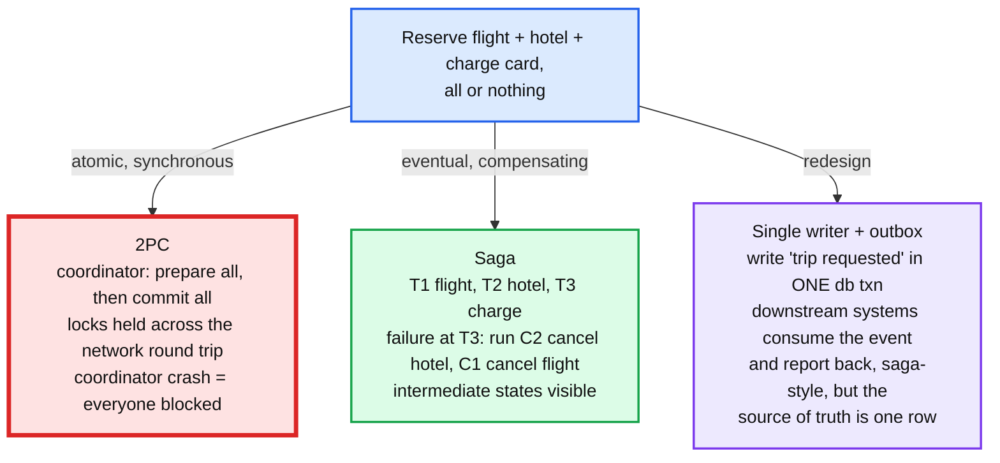
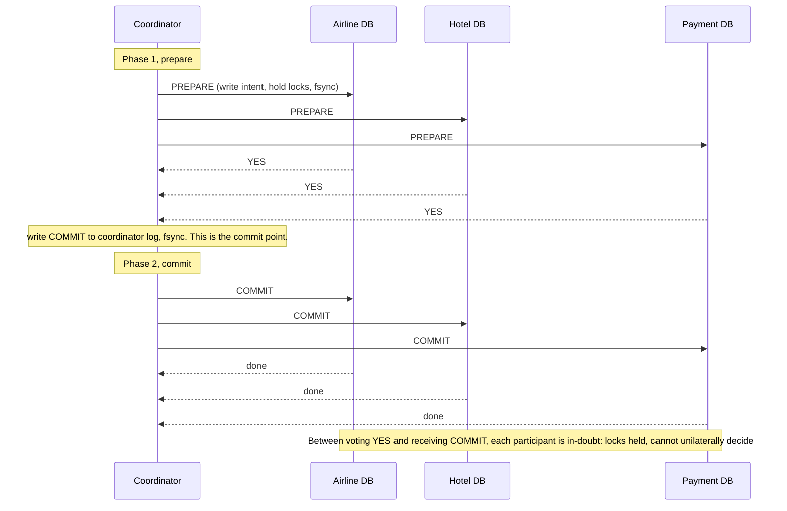
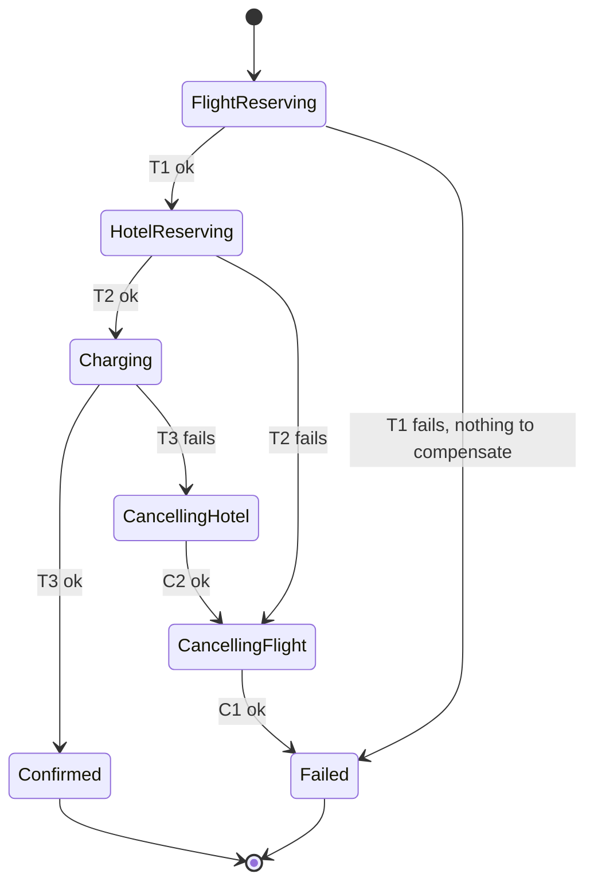
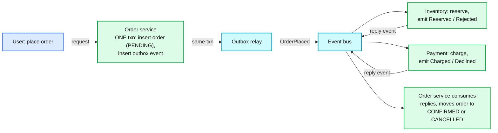

# Concept: Distributed Transactions (2PC vs Saga vs Outbox)

> One-liner: a distributed transaction is one logical change that must land in more than one system; two-phase commit (2PC) makes it atomic by having a coordinator ask every participant to prepare and then commit, at the cost of blocking everyone if the coordinator dies; a saga replaces atomicity with a sequence of local transactions plus compensating actions for rollback, at the cost of intermediate states being visible; and the best answer is usually to redesign so the change lands in one system and the rest follows asynchronously through an outbox.

Depth target: high-level, same as [exactly-once.md](exactly-once.md) and [leases-fencing-clocks.md](leases-fencing-clocks.md). It is under test in booking, inventory, payments, and payroll problems, and the Staff signal is refusing to build 2PC.

---

## 1. Mental model

Book a trip: reserve a flight (airline system), a hotel (hotel system), and charge the card (payment system). All three or none. Each system has its own database and its own transactions. There is no single `COMMIT` that covers all three.

| Approach | Atomic | Isolated | Blocking | Needs from participants | Where it fits |
|---|---|---|---|---|---|
| **2PC** | Yes | Yes (locks held) | Yes, on coordinator failure | Prepare/commit/abort protocol (XA) | Inside one system's control: a database's own cross-shard commit |
| **Saga** | No, eventually consistent | No, intermediate states visible | No | Idempotent forward step and a compensating step | Across services or companies, long-running flows |
| **Single writer + outbox** | Yes for the local write | Yes for the local write | No | Consumers are idempotent | Whenever the flow can be reframed as "record intent, then execute" |
| **TCC** (try, confirm, cancel) | No | Partial: reservations hold resources | No | Three endpoints per participant | Inventory and booking, where a soft hold is natural |

**Why this matters more at Staff level.** Senior answers pick sagas because "microservices". Staff answers say what the user sees between T2 and C2, which steps cannot be compensated (an email, a bank transfer), how the saga's own state survives a crash, and whether the whole thing should have been one database in the first place.

---

## 2. Two-phase commit

A coordinator drives every participant through two phases. The protocol is short; the failure analysis is the topic.

The rules that make it correct:

1. A participant that votes YES has durably written everything needed to commit **or** abort later. It may not change its mind.
2. The coordinator's decision is durable (logged) before any participant is told. The coordinator's log is the single source of the outcome.
3. Any NO or timeout in phase 1 means ABORT for everyone.
4. Once COMMIT is sent, the coordinator retries forever until every participant acknowledges. Participants must accept a repeated COMMIT idempotently.

The failure that defines it:

| Failure | Effect |
|---|---|
| Participant crashes before voting | Coordinator times out, aborts. Fine. |
| Participant crashes after voting YES | On restart it reads its prepare log, asks the coordinator for the outcome. Fine, as long as the coordinator is up. |
| **Coordinator crashes after participants voted YES, before logging the decision** | Participants are **in-doubt**: locks held, cannot commit (maybe someone voted NO), cannot abort (maybe the coordinator decided COMMIT). They wait for the coordinator to come back. Minutes, hours. Every other transaction touching those rows queues behind the locks. |
| Coordinator crashes after logging COMMIT, before sending it | Same wait, but the outcome is decided. Recovery is reading the log and resending. |
| Network partition between coordinator and a participant | In-doubt on that participant for the duration. |

**2PC is a blocking protocol.** The fix is to make the coordinator itself highly available: run it on a Raft group so its log survives and a new coordinator can finish the protocol. That is what Spanner, CockroachDB, TiDB, and FoundationDB do: 2PC across shards with Paxos or Raft under both the coordinator and every participant. **Inside one system, with consensus under it, 2PC is fine and widely used.** Across independent systems (XA between a database and a message broker, or between two companies), the coordinator is a plain process and in-doubt is real.

**Three-phase commit** adds a pre-commit phase so participants can decide without the coordinator. It assumes bounded network delay, which a partition violates, so it is rarely deployed. Say the name, say why not.

---

## 3. Sagas

A saga (Garcia-Molina and Salem, 1987) is a sequence of local transactions `T1, T2, ..., Tn`, each with a compensating transaction `C1, C2, ..., Cn-1`. If `Tk` fails, run `Ck-1, ..., C1` in reverse. Each `Ti` commits on its own; there is no global lock, and no global rollback, only semantic undo.

Two ways to run it:

| Style | How | Good | Bad |
|---|---|---|---|
| **Orchestration** | A saga coordinator (a state machine with persisted state) calls each service and decides the next step | Flow visible in one place. Easy to add steps, timeouts, retries. Testable. | The orchestrator is a service to run. Temporal, Camunda, AWS Step Functions, or a hand-written one over a database table. |
| **Choreography** | Each service listens for the previous event and emits the next. No central coordinator. | No new service. Loosely coupled. | The flow exists nowhere. Debugging is reading five services' logs. Cyclic dependencies appear by accident. Compensation logic spreads everywhere. |

Rules that make a saga survivable:

- **The saga's state is persisted before every step.** `saga(id, step, status)` in a database. The orchestrator crashes, restarts, reads the state, resumes. Without this, a crash between T2 and T3 leaves a hotel reserved forever.
- **Every `Ti` and `Ci` is idempotent.** The orchestrator will retry them. See [exactly-once.md](exactly-once.md).
- **Compensations must not fail permanently.** `C2` (cancel hotel) can fail transiently; it is retried forever. If it can fail *permanently* (the hotel refuses), a human is paged. Design compensations to be things the other side always accepts.
- **Order steps by compensability.** Put the hardest-to-undo step **last**. Charge the card after the reservations, send the confirmation email after the charge. A step with no compensation (email sent, SMS delivered) must be the final step, or be replaced by a "pending" version that is confirmed later.
- **Pivot step.** The step after which the saga will not compensate, only retry forward. Usually the charge. Everything before it can roll back; everything after it must succeed eventually.

**What isolation loss looks like.** Between T1 and T3, another saga sees a reserved flight seat it cannot get, and after C1 the seat reappears. A user checking their card sees a charge that is later reversed. Balance reads mid-saga are wrong. Mitigations, each a cost:

| Anomaly | Mitigation |
|---|---|
| Dirty reads of intermediate state | **Semantic lock**: mark the row `PENDING` so readers know. Or version the row and let readers filter. |
| Lost update: two sagas modify the same row | **Commutative updates** (reserve 1 of N, not "set count") or a per-row optimistic version. |
| Compensation after another saga read the data | **Pessimistic view**: reorder so the visible step is last. **Reread**: the second saga re-validates before its pivot. |

---

## 4. TCC: try, confirm, cancel

A saga variant for resources that support a soft hold. Each participant exposes three operations:

- **Try**: reserve the resource tentatively (hold the seat for 10 minutes, place a card authorisation, decrement `available` but not `sold`). Must be idempotent.
- **Confirm**: make the hold permanent. Must succeed given a successful try.
- **Cancel**: release the hold. Must be idempotent and always succeed. Also run by a timer if confirm never arrives.

TCC has better isolation than a plain saga because the try phase holds the resource, so a second saga cannot take it. The cost is that every participant must be built with a hold state and an expiry. Airlines, hotels, ticketing, and card networks already work this way (authorisation then capture), which is why TCC fits booking problems.

---

## 5. Avoiding the problem: single writer plus outbox

The strongest Staff move is to notice that most "distributed transactions" are one system's write plus notifications to others.

- The order row is the saga state. Its status column is the state machine. No separate orchestrator service.
- The first write is atomic and local. The rest is a choreographed saga over an outbox, with the order service as the implicit orchestrator because every reply comes back to it.
- User-visible contract: "order placed, confirming" then "confirmed" or "cancelled" within seconds. Most real checkout flows already work this way, which is why users accept it.
- When this does not work: the change is genuinely symmetric across two systems that both own truth (moving money between two banks' ledgers, both authoritative). Then it is a saga with a pivot, or 2PC inside a system that owns both ledgers.

---

## 6. Where you meet it

| System | Mechanism | Detail |
|---|---|---|
| **Spanner, CockroachDB, TiDB, YugabyteDB** | 2PC across shards, Paxos or Raft under coordinator and participants | The coordinator's log is replicated, so in-doubt is bounded by leader election (seconds). Spanner uses the first participant's Paxos group as coordinator. CockroachDB's parallel commits skip a round trip by making the commit decision implicit once all intents are written. |
| **FoundationDB** | 2PC-like commit through a resolver and log servers | Optimistic: conflicts detected at commit, no locks held during the transaction. |
| **Kafka transactions** | 2PC coordinated by the transaction coordinator, markers in the log | Atomic across partitions and offset commit. Not across external systems. |
| **XA / JTA** | 2PC across databases and brokers via the XA interface | The classic in-doubt problem. Most teams that used it turned it off. |
| **Temporal, Cadence, Step Functions, Camunda** | Saga orchestration with persisted workflow state and deterministic replay | The workflow code *is* the state machine; the engine records every step. |
| **Stripe, card networks** | Authorise then capture, with auth expiry | TCC in production for 40 years. |
| **Airline GDS (Amadeus, Sabre)** | Hold (PNR) then ticket, hold expires | TCC. |
| **Amazon order pipeline** | Order placed, then inventory, payment, fulfilment as async steps with compensation | Section 5 at scale. |
| **`hld/payments-ledger/`** | Idempotency row in the payment txn, attempt per rail call, reversal on unknown | A saga with the rail as the non-compensable pivot. |
| **`hld/distributed-job-scheduler/`** | Event log plus rows in one txn | Outbox: the run's state change and its event commit together. |

---

## 7. Practical additions every real implementation has

| Addition | Problem it fixes |
|---|---|
| **Coordinator on a consensus group** | 2PC in-doubt on coordinator crash. |
| **Participant prepare log with fsync** | Participant that voted YES forgets after a crash. |
| **Idempotent COMMIT and ABORT** | Coordinator resends after partial delivery. |
| **In-doubt timeout with operator alert** | Locks held for hours silently. |
| **Persisted saga state, one row per saga** | Orchestrator crash loses the flow. |
| **Idempotency key per saga step** | Retried step double-executes. |
| **Compensation retry with backoff and dead-letter to a human** | Compensation fails permanently and nobody knows. |
| **Steps ordered by compensability, pivot last** | Non-compensable step in the middle. |
| **Semantic lock / PENDING status** | Readers act on intermediate state. |
| **Hold expiry in TCC** | Try without confirm holds the resource forever. |
| **Saga timeout** | A saga waiting on a reply that never comes. Compensate after N minutes. |
| **Correlation ID on every event** | Debugging a choreographed saga across services. |

---

## 8. Failure modes and what happens

| Failure | What happens | Fix |
|---|---|---|
| 2PC coordinator dies after prepare | Participants in-doubt, locks held, other transactions queue. Outage. | Replicated coordinator, or do not use 2PC across independent systems. |
| 2PC participant votes YES then loses its log | Cannot honour the commit. **Atomicity broken.** | Prepare must fsync. |
| Saga orchestrator crashes between steps | Hotel reserved, flight not, nobody continuing. | Persist state before each step, resume on restart. |
| Saga step not idempotent | Retry double-books. | Idempotency key. |
| Compensation fails permanently | Flight reserved, payment refunded, nobody cancels the flight. | Retry forever, dead-letter, page. Choose compensations the counterpart always accepts. |
| Non-compensable step in the middle | Email "confirmed" sent, then the charge fails. | Reorder: non-compensable last. |
| Two sagas race on one resource | Both reserve the last seat, one compensates, the other sees a phantom. | TCC hold, or commutative decrement with a floor, or semantic lock. |
| Choreography with a cycle | Event A triggers B triggers A. Infinite loop. | Orchestrate, or a saga ID with step count. |
| Saga waits on a reply that never arrives | Stuck in HotelReserving forever, hold never released. | Saga timeout, compensate on expiry. |
| XA across a DB and a broker | Works until the coordinator process dies with a prepared branch. Then the DB has a prepared transaction holding locks that only the XA recovery log can resolve. | Outbox instead. |
| Outbox consumer not idempotent | Inventory reserved twice for one order. | Inbox table. |

---

## 9. Trade-offs

| Gain | Cost |
|---|---|
| 2PC: true atomicity and isolation across participants. | Blocking on coordinator failure. Locks held across network round trips, so throughput on contended rows is bounded by RTT. Every participant must implement prepare. |
| 2PC with replicated coordinator: atomicity without unbounded in-doubt. | Only available when one system controls both coordinator and participants. Two Paxos rounds per commit. |
| Saga: no distributed locks, no blocking, works across any services. | No isolation. Intermediate states visible. Every step needs a compensation and idempotency. The saga's own state is a database you operate. |
| Orchestrated saga: flow in one place, testable, resumable. | One more service (or a workflow engine). |
| Choreographed saga: no central service. | The flow is invisible. Cycles. Compensation logic scattered. |
| TCC: reservation semantics give real isolation on the held resource. | Three endpoints per participant, hold expiry to manage, participants must support holds. |
| Single writer plus outbox: local atomicity, eventual everything else, simplest to operate. | Only works when one system can own the truth. User sees "pending". |

**What a Staff answer refuses to build:** 2PC across independently owned systems, XA between a database and a message broker, a saga with no persisted state, a saga with a non-compensable step before the pivot, choreography for a flow with more than three steps, and any design that puts "send email" before "charge card".

---

## 10. Numbers worth memorizing

- 2PC: **2 network round trips** plus 2 fsyncs (participant prepare, coordinator decision) on the commit path. Cross-region: 100 to 300 ms per transaction. Same-AZ: 2 to 5 ms.
- In-doubt duration with a plain coordinator: until it restarts, minutes to hours. With a replicated coordinator: one leader election, ~1 to 5 s.
- Spanner commit: 2PC plus Paxos plus a ~7 ms TrueTime commit wait, ~10 to 15 ms in-region.
- CockroachDB parallel commit: 1 round trip instead of 2 for the common case.
- Card authorisation hold: **7 days** typical expiry. Hotel hold: 10 to 30 minutes. Airline PNR hold: 24 to 72 hours.
- Saga step timeout: 30 s to 5 min per step, saga timeout 10 min to 24 h depending on the domain.
- Outbox relay latency: 100 ms polling, sub-second with CDC.
- Temporal history limit: ~50k events per workflow before you must continue-as-new.

---

## 11. Interview soundbite

> "I avoid distributed transactions by finding the one system that owns the truth, writing its row and an outbox event in one local transaction, and letting the other systems react and reply. The row's status column is the saga state. Where a real multi-step flow is unavoidable I run an orchestrated saga with persisted state before every step, idempotent steps, compensations that the counterpart always accepts, and the least compensable step, the charge, as the pivot at the end. TCC when the resources support holds, which booking and payments already do. 2PC only inside a system that puts consensus under both the coordinator and the participants, like Spanner or CockroachDB, because a plain 2PC coordinator dying after prepare leaves every participant locked and in-doubt until it returns."

Follow-ups an interviewer will ask, in order of likelihood:

1. Why not 2PC? (Section 2, in-doubt on coordinator crash.)
2. The saga orchestrator crashes after step 2. (Section 3, persisted state, resume.)
3. Compensation fails. (Section 3, retry forever, dead-letter, page, choose compensations that cannot fail.)
4. What does the user see between steps? (Section 3, isolation loss, PENDING status, order steps so the visible one is last.)
5. Two users book the last seat at once. (Section 4, TCC hold, or commutative decrement with floor.)
6. How does Spanner do it if 2PC is bad? (Section 2 and 6, replicated coordinator.)
7. Orchestration or choreography? (Section 3, orchestration past three steps.)
8. The email was sent and then the payment failed. (Section 3, reorder, non-compensable last.)
9. What about XA? (Section 8, in-doubt with locks, use an outbox.)

Related: [exactly-once.md](exactly-once.md) (idempotent steps, outbox and inbox), [raft.md](raft.md) and [paxos.md](paxos.md) (what makes a replicated coordinator possible), [leases-fencing-clocks.md](leases-fencing-clocks.md) (one owner per saga, fenced), [fan-out-fan-in.md](fan-out-fan-in.md) (a fan-out with side effects is a saga), [replication-and-quorums.md](replication-and-quorums.md) (why a quorum write is not a transaction), `hld/payments-ledger/` (saga with a rail as pivot), `hld/distributed-job-scheduler/` (outbox in the run state machine).
