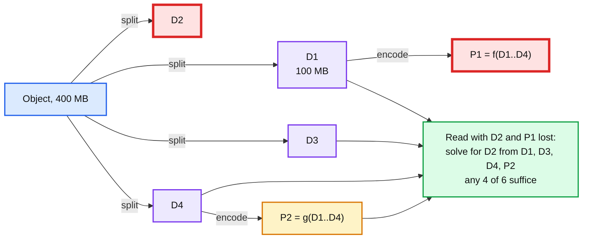
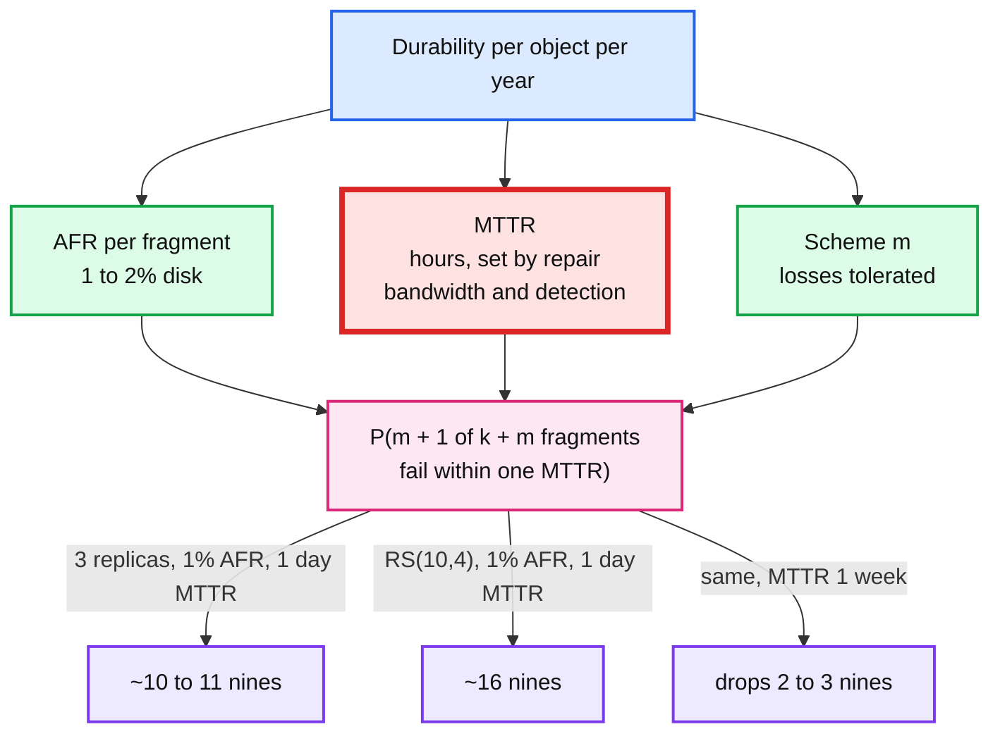

# Concept: Erasure Coding and Durability Math

> One-liner: erasure coding splits an object into `k` data fragments and computes `m` parity fragments so that **any** `k` of the `k + m` survive a loss, giving the fault tolerance of `m` extra copies at a storage overhead of `(k + m) / k` instead of `m + 1`; a 3-way replica costs 3x for 2 failures, Reed-Solomon RS(10,4) costs 1.4x for 4 failures, and the price is that every read of a degraded object and every repair needs `k` fragments from `k` different machines.

Depth target: high-level, same as [merkle-tree.md](merkle-tree.md). It is the storage-cost half of the object store, file system, and Street View problems, and "why not just replicate three times" is the follow-up. `hld/immutable-object-store/` has the source-verified placement maths; this note is the reusable block.

---

## 1. Mental model

Store 1 GB with 3 replicas: 3 GB on disk, survive any 2 disk losses. Store it as RS(10,4): cut into 10 fragments of 100 MB, compute 4 parity fragments of 100 MB, spread all 14 across 14 disks. 1.4 GB on disk. Lose any 4 disks, reconstruct from the remaining 10.



- **Reed-Solomon** treats each fragment as a number in a finite field (GF(2^8), one byte at a time) and computes parity as linear combinations. Any `k` of the `k + m` fragments form a solvable system, so any `k` reconstruct the rest. This is polynomial interpolation: `k` points define a degree `k - 1` polynomial, and parity fragments are extra evaluations of it.
- **RAID 5** is RS(n,1) with XOR parity. **RAID 6** is RS(n,2). Object stores use `m` of 3 to 6.
- Every fragment goes to a different failure domain (disk, host, rack, AZ). Two fragments on one host means one host loss counts as two fragment losses.

**Why this matters more at Staff level.** Senior answers say "erasure code for cost". Staff answers give the overhead ratio, the failure tolerance, the read amplification on a degraded object, the repair bandwidth when a disk dies, and why small objects and hot objects stay replicated.

---

## 2. The numbers

| Scheme | Overhead | Tolerates | Fragments per read (healthy) | Fragments per read (degraded) | Repair traffic per lost fragment |
|---|---|---|---|---|---|
| 3 replicas | 3.0x | 2 | 1 | 1 | 1 fragment (copy from a replica) |
| 2 replicas | 2.0x | 1 | 1 | 1 | 1 |
| RS(4,2) | 1.5x | 2 | 4 | 4 | 4 fragments read to rebuild 1 |
| RS(6,3) | 1.5x | 3 | 6 | 6 | 6 |
| RS(10,4) (HDFS default, Facebook f4 style) | 1.4x | 4 | 10 | 10 | 10 |
| RS(12,4) | 1.33x | 4 | 12 | 12 | 12 |
| RS(9,6) over 3 AZs (`hld/immutable-object-store/`) | 1.67x | 6, including one whole AZ (6 fragments) | 9 | 9 | 9 |
| RS(17,3) (Backblaze) | 1.18x | 3 | 17 | 17 | 17 |
| LRC(12,2,2) (Azure) | 1.33x | 3 arbitrary, 4 in most patterns | 12 | 6 for a single loss (local group) | 6 |

Reading the table:

- **Overhead is `(k + m) / k`.** Bigger `k` means cheaper storage and more fragments to touch per read and repair.
- **Tolerance is `m`**, independent of `k`. RS(10,4) and RS(4,4) both survive 4 losses; the second costs 2x instead of 1.4x.
- **Repair cost is `k` fragments of network read to rebuild 1.** This is the hidden cost. A dead 16 TB disk holding RS(10,4) fragments needs 160 TB read across the cluster to rebuild. At 10 Gbps per node that is hours, and during those hours the objects are one failure closer to loss. **Locally repairable codes** (Azure LRC, HDFS-EC with local parity) add a parity per small group so a single loss is rebuilt from 6 fragments instead of 12.
- **Reads of small objects are amplified.** A 4 KB object as RS(10,4) is ten 400-byte requests to ten machines, with the tail latency of [fan-out-fan-in.md](fan-out-fan-in.md). Small objects are replicated, or packed into large blobs and the blob is coded.

---

## 3. Durability: the eleven nines

Durability is the probability an object survives a year. The calculation:

1. **Annual failure rate (AFR)** of a disk: 1 to 2% (Backblaze publishes ~1%). A host: higher, includes disk plus everything else. An AZ: designed for "almost never", but plan for one AZ loss.
2. **Mean time to repair (MTTR)**: time from a fragment loss to its reconstruction on a new disk. Hours for disks (limited by repair bandwidth), days for a whole host if repair is throttled.
3. **Loss requires `m + 1` failures of the same object's fragments within one MTTR window**, before repair completes.



Back of envelope, independent failures. A loss needs one fragment to fail (rate `(k + m) x AFR` per object-year) and then `m` more of the remaining `k + m - 1` to fail before repair finishes. With `p = AFR x MTTR / 1 year` as the per-fragment failure probability inside one repair window (1% AFR and a 1 day MTTR gives `p ~ 2.7e-5`):

```
P(loss per object-year) ~ (k + m) x AFR x C(k + m - 1, m) x p^m
```

3 replicas: `3 x 0.01 x 1 x (2.7e-5)^2 ~ 2e-11`, about **10.6 nines**. RS(10,4): `14 x 0.01 x 715 x (2.7e-5)^4 ~ 6e-17`, about **16 nines**. Stretch MTTR to a week and `p` grows 7x: 3 replicas drop to ~9 nines, RS(10,4) to ~13. Real numbers differ (correlated failures, detection delay, bit rot) but the shape is the lesson: **each extra tolerated failure multiplies durability by `1/p`, and MTTR is what sets `p`.**

What actually loses data, in order: **correlated failures** (a rack power event, a firmware bug across one disk model, a bad deploy of the storage daemon), **silent corruption** (bit rot, needs checksums and scrubbing, see [merkle-tree.md](merkle-tree.md)), **operator error** (delete the wrong bucket), and last, independent disk failures. The eleven nines are a statement about the last one; the other three are handled by placement across failure domains, checksums plus background scrub, and soft delete with a retention window.

---

## 4. Placement and repair

- **Failure domains**: fragment placement must ensure no single domain (host, rack, AZ) holds more than `m` fragments, or that domain's loss is data loss. RS(9,6) across 3 AZs, 5 per AZ: losing one AZ loses 5, tolerance is 6, the object survives with one failure to spare. That extra 1 is why it is 9,6 and not 9,5.
- **Repair scheduling**: detect (scrub or heartbeat), prioritise objects with the most fragments missing, throttle to protect foreground traffic (a full-speed repair storm is its own outage), and repair onto a *different* domain than the one that failed.
- **Scrubbing**: read every fragment on a schedule (weeks), verify its checksum, repair on mismatch. This is what catches bit rot before it becomes a second failure.
- **Write path**: the client or a front-end encodes and writes all `k + m` fragments; the write is acknowledged when `k + m` (or `k + m - 1` with a queued repair) are durable. See `hld/immutable-object-store/` for the commit point argument.
- **Hot and small objects**: kept as replicas in a cache tier, or replicated for their first N days and erasure coded on a lifecycle transition (Facebook f4: 3 replicas in Haystack while warm, RS(10,4) in f4 once cold).

---

## 5. Where you meet it

| System | Scheme | Note |
|---|---|---|
| **HDFS 3** | RS(6,3) and RS(10,4), striped across DataNodes | 1.5x vs 3x for cold data. Small files stay replicated. |
| **Ceph** | Configurable, jerasure and ISA-L plugins, LRC available | Erasure-coded pools for RGW object data, replicated for metadata. |
| **Azure Storage** | LRC(12,2,2), 1.33x | The LRC paper (2012) is the reference for local repair. |
| **Facebook f4** | RS(10,4) within a datacenter, XOR across datacenters, 2.1x total | Warm blob store behind Haystack. |
| **Backblaze** | RS(17,3), 1.18x, 20 drives across 20 racks | Their open-source Java RS library. |
| **Google Colossus** | RS across chunk servers, scheme varies by tier | GFS replaced; erasure coding is the default for most data. |
| **Amazon S3** | Undisclosed scheme across at least 3 AZs, "11 nines" | Correlated-failure engineering is the real story. |
| **MinIO** | RS with `k + m` up to 16, per-object parity selectable | Object-level configurability. |
| **BLAKE3, Merkle proofs** | Not EC, but the integrity layer EC relies on | Every fragment carries a checksum; the object carries a Merkle root. |
| **`hld/immutable-object-store/`** | RS(9,6) over 3 AZs, 1.67x, one AZ loss survivable | The worked placement with the 1.5x floor argument. |

---

## 6. Trade-offs

| Gain | Cost |
|---|---|
| 1.2x to 1.7x storage for the durability of 3x to 7x replication. | Every read touches `k` machines; degraded reads pay a reconstruction; small objects amplified. |
| Tolerance `m` chosen independently of overhead. | Repair reads `k` fragments per lost one; repair bandwidth is the durability bottleneck. |
| Cross-AZ coding survives a whole AZ. | Cross-AZ reads on every degraded access; write latency includes the slowest AZ. |
| LRC: single-loss repair from a small group. | Slightly more overhead than plain RS, more complex placement. |
| Lifecycle (replicate warm, code cold): best of both. | Two storage paths, a migration job, and objects in transition. |
| Encoding is cheap with ISA-L (GB/s per core). | Decoding a degraded read is also CPU, on the read path. |

**What a Staff answer refuses to build:** erasure coding for small or hot objects, a scheme where one rack or AZ holds more than `m` fragments, a repair pipeline with no throttle and no priority, and a durability claim with no MTTR and no scrub interval behind it.

---

## 7. Numbers worth memorizing

- Overhead `(k + m) / k`: 3 replicas 3.0x, RS(6,3) 1.5x, RS(10,4) **1.4x**, RS(12,4) 1.33x, RS(17,3) 1.18x, RS(9,6) 1.67x.
- Disk AFR: **1 to 2%**. 16 TB disk rebuild at 200 MB/s: ~22 hours for a full copy; EC repair reads `k` times that across the cluster but in parallel.
- Repair bandwidth target: rebuild a lost disk in under 24 hours, throttled to ~10 to 20% of cluster network.
- Scrub interval: 1 to 4 weeks for every byte.
- Encoding throughput: 1 to 5 GB/s per core with ISA-L (AVX2). Decoding similar.
- Small-object threshold for coding: ~1 MB; pack smaller ones into blobs.
- Facebook f4: 3x warm in Haystack, 2.1x cold in f4 (RS(10,4) plus cross-DC XOR). Azure LRC(12,2,2): 1.33x. HDFS default policy RS(6,3).
- "Eleven nines" = 99.999999999%, i.e. lose one object in 100 billion per year. Independent-failure maths gets there easily; correlated failures are what the engineering is about.

---

## 8. Interview soundbite

> "For cold objects I erasure code with Reed-Solomon, ten data and four parity fragments on fourteen failure domains, so the store survives any four losses at 1.4x instead of 3x for two losses. Every fragment carries a checksum and a background scrub reads all of them monthly so bit rot is found before it becomes a second failure. The durability lever is time-to-repair, so repair is prioritised by how many fragments an object is missing and throttled to a fraction of cluster bandwidth, and I keep a whole AZ below the parity count so an AZ loss is survivable. Small and hot objects stay replicated, because a 4 KB read as ten fragments from ten machines is a fan-out with tail latency, and the lifecycle job codes them once they go cold."

Follow-ups an interviewer will ask, in order of likelihood:

1. Why not 3 replicas? (Section 2, 3x vs 1.4x, same or better tolerance.)
2. What does a degraded read cost? (Section 2, `k` fragments plus decode.)
3. A disk dies. What happens and how long? (Section 4, repair reads `k` per fragment, throttled, priority.)
4. How do you get eleven nines? (Section 3, `m + 1` failures within one MTTR, and correlated failures are the real risk.)
5. Why RS(9,6) over 3 AZs and not RS(9,5)? (Section 4, AZ loss is 5, need one spare.)
6. Small files? (Section 2 and 4, replicate or pack.)
7. What is LRC? (Section 2, local parity groups, cheap single-loss repair.)

Related: [merkle-tree.md](merkle-tree.md) (checksums, scrub, and integrity), [replication-and-quorums.md](replication-and-quorums.md) (the alternative and the metadata path), [fan-out-fan-in.md](fan-out-fan-in.md) (why `k`-fragment reads have tail latency), [sharding.md](sharding.md) (placement across domains), `hld/immutable-object-store/` (RS(9,6) placement and the 1.5x floor, source-verified), `hld/distributed-file-system/` (chunk replication vs coding), `hld/` #27 Street View storage.
