# Concept: etcd

> One-liner: etcd is a small, strongly consistent key-value store: 3 or 5 members replicate a log with Raft, every write gets a cluster-wide **revision**, old revisions are kept (MVCC) so clients can **watch** changes from any revision, and **leases** delete keys when their owner stops heartbeating. It is the store under Kubernetes and the usual home for leader election, locks, service discovery, and config. It is not a database: 2 GiB default quota, 8 GiB suggested max, 1.5 MiB per request, tens of thousands of writes per second at most.

Depth target: high-level, same as [raft.md](raft.md), which already covers the consensus part. This note is about what etcd builds on top of Raft and how to use it. It is the coordination store in #6 scheduler (partition leases), #20 cache (ring ownership), #3 file system and #33 lock service, and the backing store in every Kubernetes question.

Sources: etcd v3.5 docs (data model, API, API guarantees, configuration, performance, hardware, tuning, FAQ, metrics), etcd and client source on GitHub, kubernetes.io. Every number in section 13 was read from those pages, not from memory.

---

## 1. Mental model

Think of etcd as a **replicated, versioned map with a change feed and heartbeats**. Small values (config, membership, locks, the Kubernetes object graph), read far more than written, where being wrong is worse than being slow.

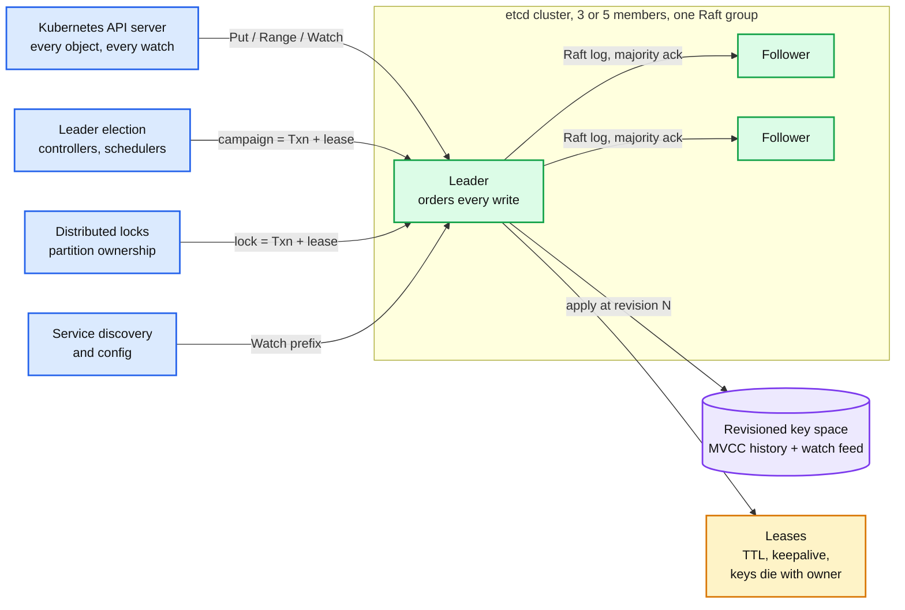

- **One Raft group.** Every write goes through the leader and is durable on a majority before it is acknowledged. No sharding inside a cluster; if you need more, you run more clusters.
- **Revision** is a 64-bit counter incremented once per atomic write (a Txn with 10 puts is one revision). It is a global logical clock and the fencing token you get for free.
- **Watch** streams every change after a revision, in order, without gaps, until the history is compacted.
- **Lease** is the liveness primitive. Attach keys to a lease, keep it alive, and the keys vanish when you stop.

**Why this matters at Staff level.** Senior answers say "store it in etcd". Staff answers say what the revision is used for (fencing), why a watch can miss nothing but can be told to start over (compaction), what happens to a lease during a leader election (extended), why the cluster is 5 and not 7, what the 8 GiB number means for the design, and when the right answer is a real database instead.

---

## 2. Data model: a flat key space with a revision history

etcd v3 has **no directories**. Keys are byte strings in one sorted space; "list a directory" is a range query `[prefix, prefix+1)`. Every mutation creates a new store revision and keeps the old value.

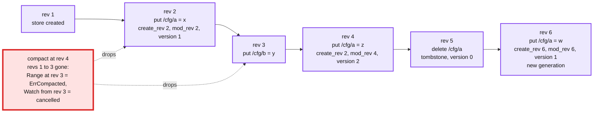

Every `KeyValue` carries three numbers. They are the whole concurrency story:

| Field | Meaning | Use it for |
|---|---|---|
| `create_revision` | Store revision when this generation of the key was created | Lock ordering: lowest create_revision under a prefix owns the lock |
| `mod_revision` | Store revision of the last write to the key | Compare-and-swap: "update only if nobody wrote since I read" |
| `version` | Writes to this key in this generation, 0 after delete | "Key does not exist" check: `version = 0` |
| `revision` (response header) | Store revision at the time of the response | Where to start a watch, what to use as a fencing token |

- A **generation** runs from create to delete. A delete writes a tombstone and resets `version` to 0. Re-creating starts a new generation with a new `create_revision`.
- **Compaction** discards all revisions below a given one. History before that is gone: point-in-time reads and watches that need it get `ErrCompacted`. Auto-compaction is **off by default** (`--auto-compaction-retention 0`); Kubernetes asks for one every 5 minutes.
- Keys are stored **in revision order** on disk, not key order. Section 4 shows why that works.

---

## 3. The API: five services, one that matters most

| Service | Calls | What it is for |
|---|---|---|
| **KV** | `Range`, `Put`, `DeleteRange`, `Txn`, `Compact` | Reads, writes, and the compare-and-swap that everything else is built on |
| **Watch** | `Watch(key or prefix, start_revision)` | Change feed, ordered by revision, resumable |
| **Lease** | `Grant(ttl)`, `KeepAlive`, `Revoke`, `TimeToLive` | Liveness. Keys attached to a lease are deleted when it expires |
| **Cluster** | `MemberAdd`, `MemberRemove`, `MemberPromote` | Runtime reconfiguration, learners |
| **Maintenance** | `Snapshot`, `Defragment`, `Alarm`, `Status` | Backups, reclaiming space, the NOSPACE alarm |

`Txn` is the primitive to know. It is an atomic **if / then / else** over the store, guarded by comparisons on `version`, `create_revision`, `mod_revision`, `value`, or `lease`, with up to **128 operations** per transaction. There is no interactive transaction, no locking across calls, and no cross-key isolation beyond this one request.

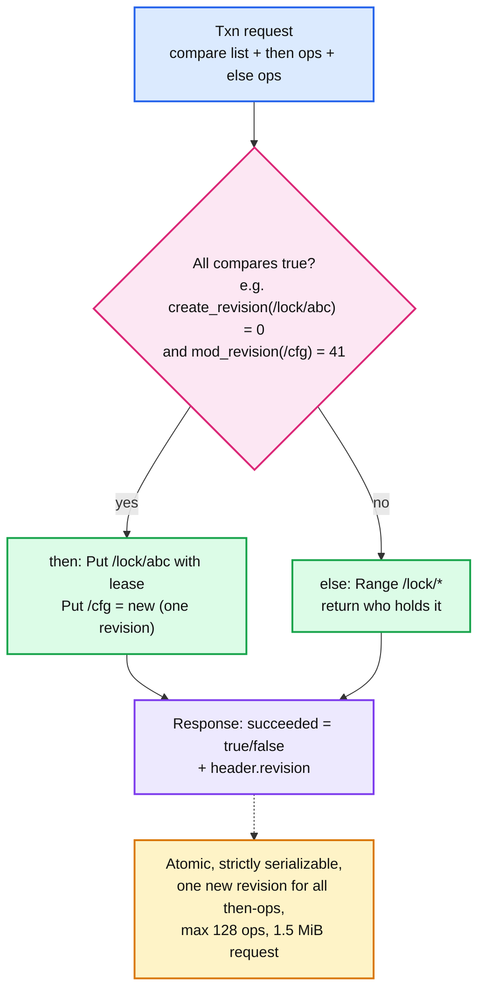

Idioms built on it:

- **Create if absent**: `if version(k) = 0 then put(k)`. This is how a lock key is claimed.
- **Optimistic update**: read `k` at mod_revision `m`, compute, `if mod_revision(k) = m then put(k)`. Retry on `succeeded = false`. Kubernetes `resourceVersion` conflicts (HTTP 409) are exactly this.
- **Atomic multi-key write**: put three keys in one `then`; watchers see all three at one revision, in one watch response.

---

## 4. Under the hood: WAL, Raft, treeIndex, bbolt

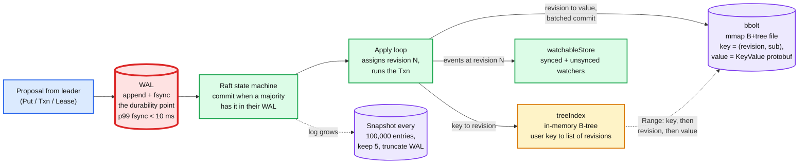

- **WAL**: every Raft entry is appended and fsynced before the member votes for it. This fsync is the floor under every write's latency. Spinning disk ~10 ms, SSD under 1 ms.
- **Raft**: one leader, majority commit, see [raft.md](raft.md). etcd uses the ReadIndex optimisation for linearizable reads, not lease reads.
- **treeIndex**: an in-memory B-tree from user key to its revision list. Rebuilt from bbolt at startup. This is why memory scales with key count (8 GB typical, 16 to 64 GB for millions of keys).
- **bbolt**: a single mmap'd B+tree file. Keys are `(main revision, sub revision)`, so consecutive writes append at the end of the tree and a watch catch-up is a sequential scan. Pages freed by compaction go on a freelist and are reused; the file **never shrinks** until you defragment.
- **Snapshots**: every 100,000 committed entries (`--snapshot-count`) the member snapshots and truncates the WAL. Keeps 5 snapshots and 5 WAL files by default.

### 4.1 Write path

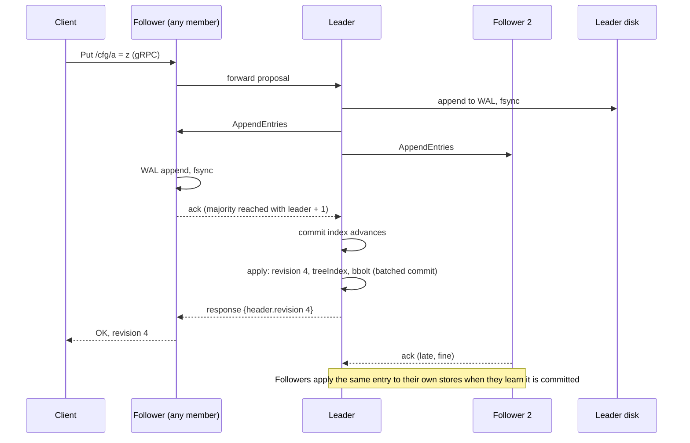

- Minimum write latency = one RTT between members + one fsync. Datacenter: sub-millisecond RTT, so fsync dominates. Cross-region: the RTT dominates and the FAQ says so plainly.
- The leader **batches** proposals into one Raft round and bbolt commits are batched, which is how 583 QPS from one client becomes 50,000 QPS from 1,000 clients on the same hardware (section 13).
- Membership changes and lease grants go through the same log.

### 4.2 Read path: linearizable vs serializable

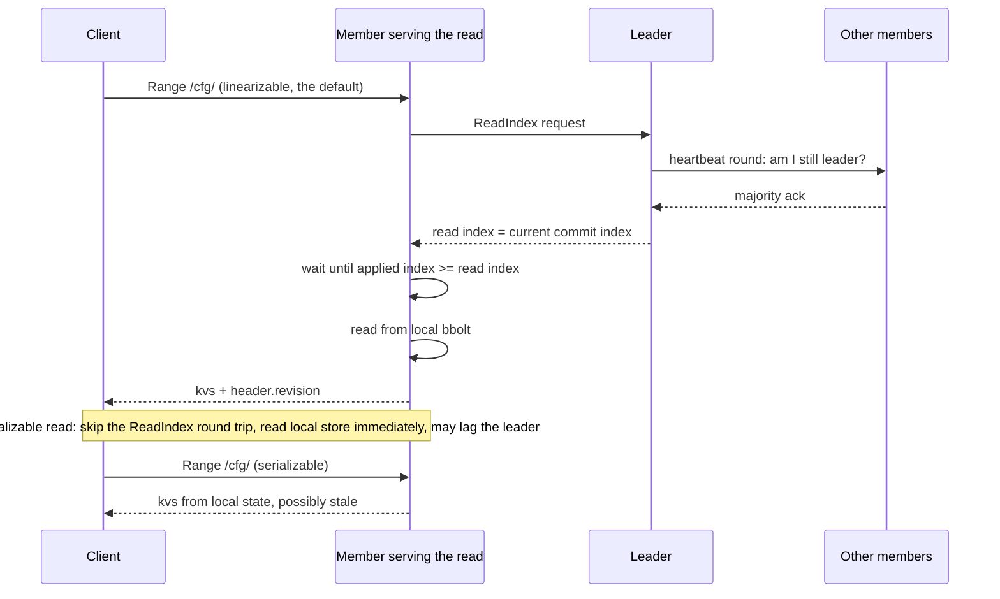

- **Linearizable** (default): one network round trip, no disk write, never stale. The API guarantees page calls the overall model strict serializability with revision as the total order.
- **Serializable**: local read, no round trip. Roughly 30 to 100% more throughput and half the latency in the official benchmark, at the cost of reading a follower that may be behind. Fine for caches and dashboards, wrong for "who holds the lock".
- A read at a specific past revision is a time-travel query, valid until compaction.

---

## 5. Watch: a resumable change feed

A watch is a server-streamed list of events, ordered by revision, starting from a revision the client chooses. The MVCC history is what makes "start from revision N" possible after a disconnect.

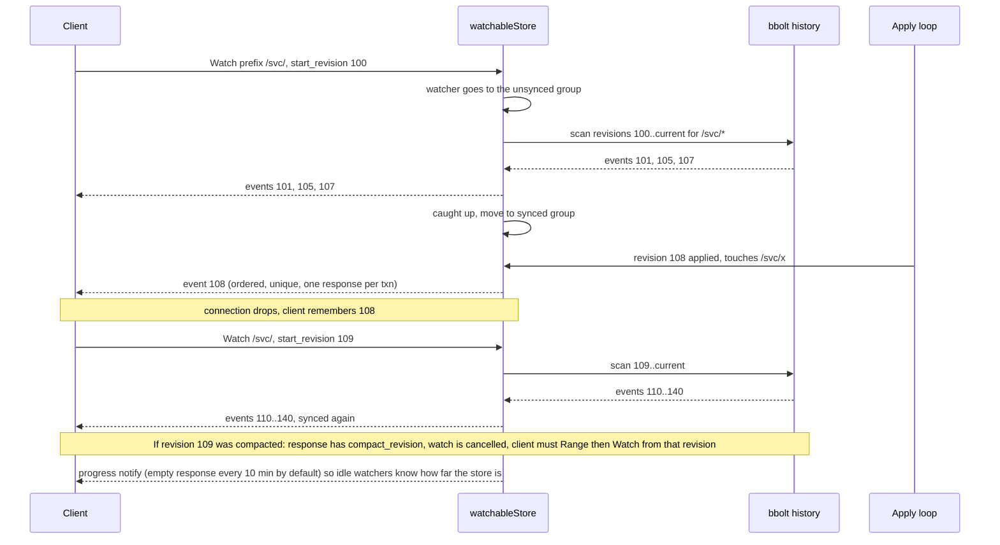

Guarantees from the API guarantees page: **ordered** by revision, **unique** (never twice), **reliable** (no gaps within the retained history), **atomic** (all events of one Txn in one response), and delivered with a bounded delay, about 10 ms on a healthy cluster.

- The **watch cache in the Kubernetes API server** exists because every controller watching every pod would be thousands of etcd watchers on the same prefix. The API server keeps one etcd watch per resource type and fans out in memory. Design lesson: put one watcher in front of many consumers.
- Watchers cost memory on the server (the hardware page: "spends most of the rest of its memory tracking watchers"). Thousands of watchers is the sizing threshold for 16 to 64 GB.
- Recovering from `ErrCompacted` is **list then watch** from the list's `header.revision`. Every etcd client eventually writes this loop; Kubernetes informers are that loop with a cache.

---

## 6. Leases: liveness and keys that die with their owner

A lease is a server-side TTL that the client refreshes. Attach keys to it; when it expires, etcd deletes them and watchers see the deletes. This is ZooKeeper's ephemeral node and Chubby's session, implemented as a first-class object.

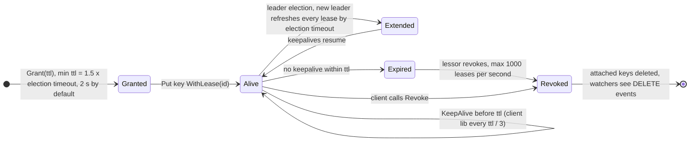

- **Minimum TTL** is 1.5 times the election timeout, rounded up: 2 s with defaults. Ask for 1 s and you get 2 s.
- **Leader change extends every lease** by one election timeout (`lessor.Promote(ElectionTimeout)`), because the new leader cannot know how long ago the old one saw a keepalive. A lock holder that died just before an election keeps its lock ~1 s longer. Design with that slack.
- **Revocation is rate-limited** to 1,000 leases per second, so a mass expiry (a whole fleet losing network) drains over seconds, not instantly.
- The client library's `Session` (concurrency package) is a lease with a default **60 s** TTL and a background keepalive stream. Everything in section 7 rides on a session.

---

## 7. Coordination recipes: lock, election, fencing

The etcd client's `concurrency` package implements a fair mutex and a leader election with one trick: **the lowest `create_revision` under a prefix is the owner**.

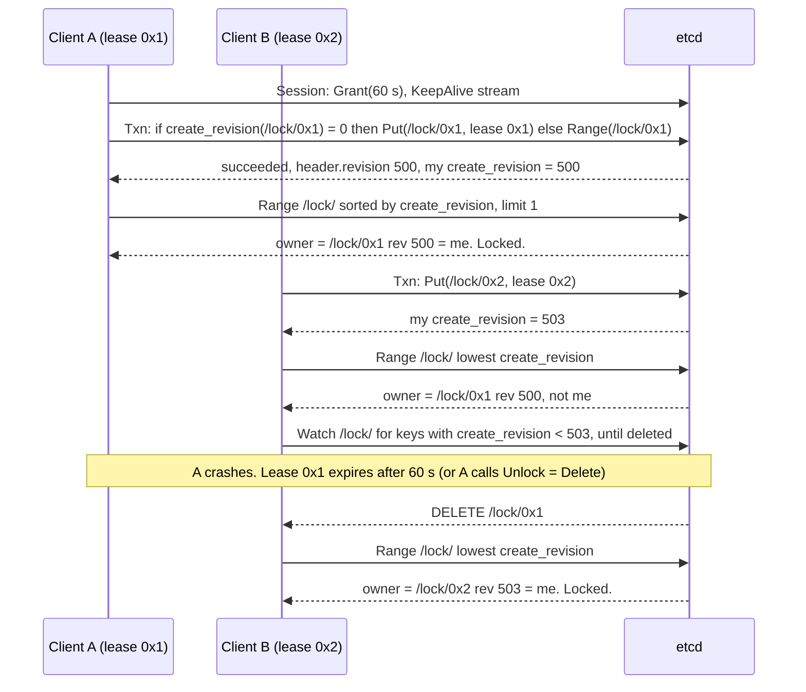

- **Fair and FIFO**: contenders queue by create_revision and each watches only the key ahead of it, so there is no thundering herd on release.
- **Election** is the same code with a value (the leader's name) and an observe stream. `etcdctl elect` and `etcdctl lock` are thin wrappers.
- **The lock alone is not safe.** A holds the lock, pauses for 70 s (GC, VM migration), its lease expires, B takes the lock, A wakes up and writes. Nothing in etcd stops A's write to *your* database. The fix from [leases-fencing-clocks.md](leases-fencing-clocks.md): carry the lock's `create_revision` (or the `header.revision` at acquisition) as a **fencing token** on every downstream write, and have the downstream reject anything lower than the highest it has seen. `Mutex.IsOwner()` returns the comparison `create_revision(myKey) = myRev` so you can put it in a Txn and make writes *to etcd* conditional on still holding the lock.
- Kubernetes leader election (`kube-controller-manager`, `kube-scheduler`) uses a `Lease` object through the API server with the same shape: 15 s lease, 10 s renew deadline, 2 s retry.

---

## 8. Cluster shape and fault tolerance

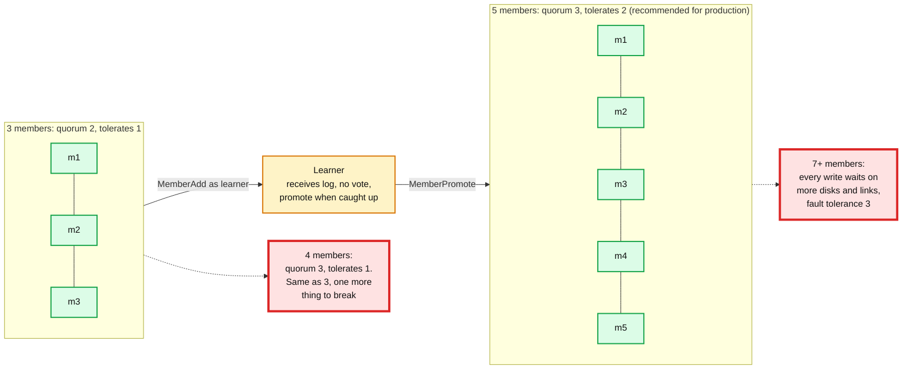

| Members | Quorum | Tolerated failures |
|---|---|---|
| 1 | 1 | 0 |
| 3 | 2 | 1 |
| 4 | 3 | 1 |
| 5 | 3 | 2 |
| 6 | 4 | 2 |
| 7 | 4 | 3 |

- The FAQ: probably never more than 7; Chubby's advice is 5; a 5-member cluster tolerates 2, which is enough in most cases.
- **Add a member as a learner first.** A voting member that never comes up (wrong address) can permanently cost you quorum in a cluster that was already down one.
- **Cross-region** is allowed and raises fault tolerance, at the price of every write paying the cross-region RTT and election timeouts tuned to 10x RTT (up to 50 s for a global cluster). Use it for a control plane that writes rarely, never for a hot path. Compare [replication-and-quorums.md](replication-and-quorums.md).

---

## 9. Storage lifecycle: compaction, defrag, and the NOSPACE alarm

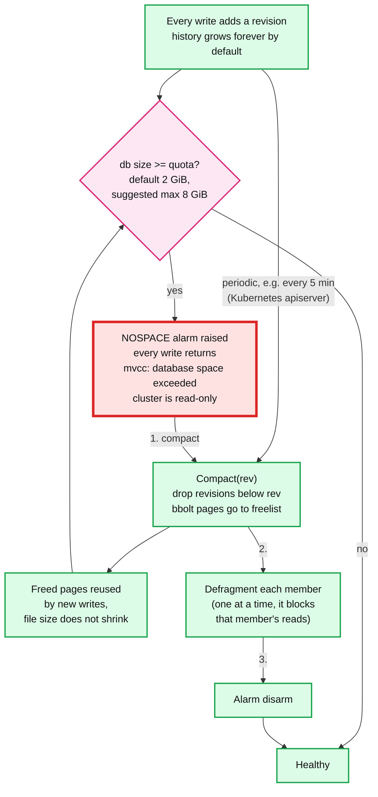

- **Compaction** is logical: it drops old revisions from treeIndex and bbolt. Set `--auto-compaction-retention` (e.g. `5m` or a revision count) or have the client do it. Kubernetes' API server does it every 5 minutes.
- **Defragmentation** is physical: rewrite the bbolt file without the holes. It stalls the member while it runs, so do one member at a time, never the leader first, and run it as a cron, not by hand at 3am.
- **Quota**: 2 GiB default, 8 GiB suggested maximum and etcd warns at startup above it. This is not a disk-space number; it is the point past which a single B+tree file, its mmap, snapshots, and a full member restore stop being operable.
- **Backup** is `etcdctl snapshot save`, a point-in-time copy of the bbolt file; restore rebuilds a new cluster from it. Do it on a schedule and test the restore.

---

## 10. Failure modes and what pages you

| Failure | What happens | Detect / fix |
|---|---|---|
| Leader dies | Followers miss heartbeats for one election timeout (1 s), elect, new leader. Writes fail or stall for ~1 to 2 s, linearizable reads too | `has_leader = 0`, `leader_changes_seen_total` rising. Clients retry; nothing to do if it is rare |
| Slow disk on the leader | Leader cannot commit; may still send heartbeats but is useless, or misses them and triggers spurious elections. "failed to send out heartbeat on time" after 2 missed intervals | `wal_fsync_duration_seconds` p99 > 10 ms or `backend_commit_duration_seconds` p99 > 25 ms. Dedicated SSD, separate disk from the OS and from Kubernetes' own IO |
| Member down (1 of 3) | Cluster continues with quorum 2; any second failure is an outage; slow-follower catch-up on return | Replace within the MTTR you sized for; 10 MB/s recovers 100 MB in 15 s |
| Quorum lost | Cluster read-only at best, unavailable for writes, every Kubernetes mutation fails | Restore from snapshot into a new cluster if members cannot return. This is why 5 in production |
| Network partition | Minority side has no leader, rejects writes and linearizable reads; majority continues. No split brain, by construction | Serializable reads on the minority still answer, stale |
| DB hits quota | NOSPACE alarm, cluster read-only | Section 9. Alert at 70% of quota, not at 100% |
| History compacted under a watcher | Watch cancelled with `compact_revision` | Client does list + watch from the new revision |
| Large request (whole keyspace range) | Long apply, blocks the apply loop for everyone; "apply entries took too long" | Keep requests under a few hundred keys; paginate with `limit` and `WithFromKey` |
| Value over 1.5 MiB | Request rejected | Store a pointer, not the blob. Kubernetes objects inherit this limit |
| Thousands of watchers on one prefix | Server memory and fan-out CPU | Put a caching proxy (the Kubernetes watch cache) in front |
| Lease holder pauses past its TTL | Lock re-granted; old holder still thinks it owns it | Fencing token on every downstream write, section 7 |
| Leader election during lease expiry | All leases extended by 1 election timeout | Assume lock hand-off can be TTL + 1 s late |

Metrics that page someone: `has_leader`, `wal_fsync_duration_seconds` p99, `backend_commit_duration_seconds` p99, `proposals_pending` and `proposals_failed_total`, db size vs quota, `leader_changes_seen_total` rate.

---

## 11. Kubernetes: the reference deployment

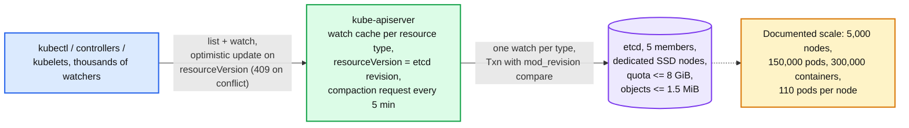

- `resourceVersion` on every Kubernetes object **is** the etcd `mod_revision`. An `Update` with a stale one is a Txn compare failure, surfaced as HTTP 409 Conflict. Informers' "list then watch from resourceVersion" is section 5's recovery loop.
- The API server is the only etcd client. It holds one watch per resource type and serves thousands of client watches from memory (`--watch-cache`, default on). It also issues the compaction request every 5 minutes (`--etcd-compaction-interval 5m0s`).
- Kubernetes docs: five-member cluster for production, dedicated machines or isolated disks, back it up periodically, defragment on a schedule. Events are often moved to a second etcd cluster because they are the highest write-rate object type.
- Other production users of the same shape: Patroni (Postgres leader election and failover), CoreDNS (etcd plugin as a zone backend), Rook, Vitess topology, M3 cluster metadata, Cilium and Calico (etcd as an alternative datastore), TiKV's Placement Driver (embeds etcd for cluster metadata).

---

## 12. When to use it, and when not

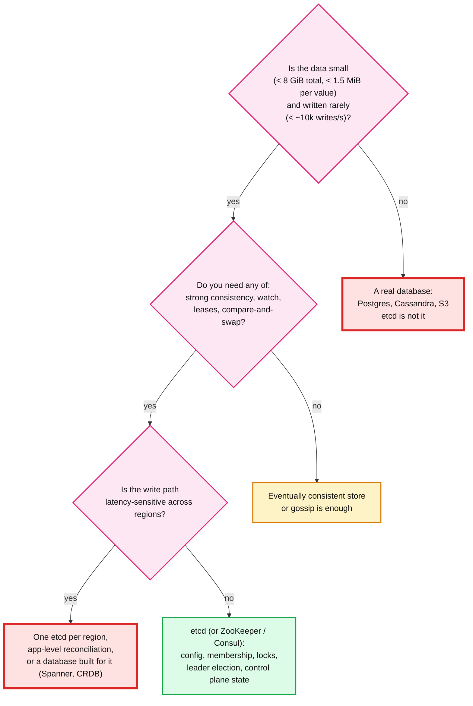

**Use it for**

- Control-plane state: cluster membership, shard-to-node assignment, the consistent-hash ring with an epoch ([sharding.md](sharding.md), `hld/distributed-cache/`).
- Leader election and partition leases with fencing tokens (`hld/distributed-job-scheduler/`, `hld/distributed-file-system/`).
- Configuration and feature flags that thousands of processes watch.
- Service discovery where instances register under a lease and disappear when they die.

**Do not use it for**

- Application data. Rows, blobs, logs, metrics, queues. It has one Raft group, a 2 to 8 GiB file, and every write is a fsync plus a quorum round.
- High write rates. The official benchmark tops out around 50k small writes per second on 8-vCPU SSD machines; Kubernetes-scale clusters run far below that on purpose.
- A message queue. Watch is a change feed with compaction, not a durable consumer-offset log. Use Kafka ([stream-processing.md](stream-processing.md)).
- Anything where a stale read is fine and availability matters more than agreement. That is a cache or gossip ([gossip-protocol.md](gossip-protocol.md)).

| | etcd | ZooKeeper | Consul | Chubby |
|---|---|---|---|---|
| Consensus | Raft | ZAB | Raft | Paxos |
| Data model | Flat keys, MVCC revisions, range queries | Hierarchical znodes, versions, no history | Flat KV plus service catalog | Hierarchical files with locks |
| Liveness | Leases, keys attached to lease | Sessions, ephemeral znodes | Sessions, TTL checks, health checks | Sessions, lock leases |
| Change feed | Watch from any revision, resumable | One-shot watches, re-register each time | Blocking queries | Event notifications |
| Fencing token | `revision` / `create_revision` | `zxid` / znode version | `ModifyIndex` | Sequencer |
| Home | Kubernetes, CNCF | Hadoop, Kafka (pre-KRaft), HBase | HashiCorp stack, service mesh | Google internal |

---

## 13. Numbers worth memorizing

Defaults (v3.5 configuration page): heartbeat **100 ms**, election timeout **1,000 ms** (must be at least 10x RTT, max 50 s), `--snapshot-count` **100,000**, `--max-snapshots` and `--max-wals` **5**, `--quota-backend-bytes` **2 GiB** default with **8 GiB** suggested max, `--max-request-bytes` **1.5 MiB** (1,572,864), `--max-txn-ops` **128**, `--auto-compaction-retention` **0** (off), gRPC keepalive min **5 s** / interval **2 h** / timeout **20 s**, watch progress notify **10 min**, slow apply warning **100 ms**.

Performance (official benchmark, 3x GCE 8 vCPU / 16 GB / 50 GB SSD, 8 B keys, 256 B values):

| Load | Writes | Linearizable reads | Serializable reads |
|---|---|---|---|
| 1 client, 1 connection | 583 QPS, 1.6 ms | 1,353 QPS, 0.7 ms | 2,909 QPS, 0.3 ms |
| 1,000 clients, 100 connections | 44,341 QPS leader-only, 22 ms; 50,104 QPS all members, 20 ms | 141,578 QPS, 5.5 ms | 185,758 QPS, 2.2 ms |

The docs' one-liner: under 1 ms per request under light load, more than 30,000 requests per second under heavy load on a standard 4-vCPU cloud machine.

Hardware (official hardware page): 50 sequential IOPS minimum, 500 for heavy load; fsync **spinning ~10 ms, SSD < 1 ms**; 8 GB RAM typical, 16 to 64 GB for thousands of watchers or millions of keys; 8 to 16 cores when CPU-bound; 10 MB/s disk recovers 100 MB in 15 s; 1 GbE is enough. Sizing tiers: small < 100 clients / < 200 rps / < 100 MB, medium < 500 / < 1,000 / < 500 MB, large < 1,500 / < 10,000 / < 1 GB, xLarge beyond that on 16 vCPU / 64 GB.

Health thresholds (FAQ): `wal_fsync_duration_seconds` p99 **< 10 ms**, `backend_commit_duration_seconds` p99 **< 25 ms**, requests touching **fewer than a few hundred keys**, leader warns after **2 missed heartbeat intervals**.

Leases and locks (source): minimum lease TTL = 1.5x election timeout = **2 s**; leader change extends all leases by **1 election timeout**; revoke rate **1,000 leases/s**; concurrency `Session` default TTL **60 s**.

Kubernetes: **5,000 nodes / 150,000 pods / 300,000 containers / 110 pods per node**; API server compaction every **5 min**; five-member etcd recommended for production; objects bounded by the **1.5 MiB** request limit.

---

## 14. Interview soundbite

> "etcd is a Raft-replicated key-value store for control-plane state: three or five members, every write fsynced on a majority before it is acknowledged, and every write stamped with a global revision. The revision is what makes it more than a map. Watches stream every change after a revision in order with no gaps, so clients recover from a disconnect by resuming, and if that revision has been compacted they list and watch again. Leases attach keys to a heartbeat so a dead owner's keys vanish, which gives me locks and leader election in one Txn: create my key under the lock prefix if absent, and the lowest create_revision owns it. I still carry that revision as a fencing token on downstream writes, because a paused holder can wake up after its lease expired. Operationally the numbers I size against are 2 to 8 GiB of data, 1.5 MiB per value, tens of thousands of writes a second at most, fsync p99 under 10 ms on a dedicated SSD, and a 1 second election timeout during which writes stall. If the data is bigger or hotter than that, it is application data and it belongs in a database, not in etcd."

Follow-ups an interviewer will ask, in order of likelihood:

1. What is the revision and why do you keep bringing it up? (Section 2, global logical clock, fencing token, watch cursor.)
2. How does a watch not miss events after a disconnect? And when can it? (Section 5, MVCC history, ErrCompacted, list + watch.)
3. Linearizable vs serializable reads, which do you use for the lock check? (Section 4.2, ReadIndex; the lock check must be linearizable.)
4. Two clients try to take the lock at once. (Section 7, Txn on create_revision, lowest wins, the other watches the key ahead of it.)
5. The lock holder pauses for a minute. (Section 7, fencing token; etcd cannot protect your database by itself.)
6. What happens during a leader election? (Section 10, ~1 s stall, leases extended by 1 s.)
7. Why 5 members and not 7 or 4? (Section 8, quorum table, write latency grows with members.)
8. The cluster stopped accepting writes with "database space exceeded". (Section 9, compact, defrag, disarm; auto-compaction was off.)
9. How does Kubernetes keep thousands of controllers from hammering etcd? (Section 11, API server watch cache, one watch per type.)
10. Could you shard etcd? (Section 12, no, run separate clusters per concern, like Kubernetes' events cluster; if you need sharded consensus you want multi-Raft, see [raft.md](raft.md).)

Related: [raft.md](raft.md) (the consensus underneath, ReadIndex), [leases-fencing-clocks.md](leases-fencing-clocks.md) (why the lock needs a token), [replication-and-quorums.md](replication-and-quorums.md) (majority math, cross-region cost), [mvcc-and-isolation.md](mvcc-and-isolation.md) (revisions as versions), [sharding.md](sharding.md) (ring ownership stored here), [gossip-protocol.md](gossip-protocol.md) (what to use when agreement is not needed), [temporal-durable-execution.md](temporal-durable-execution.md) (a workflow engine that needs exactly this kind of store for shard ownership), `hld/distributed-job-scheduler/` (partition leases with epochs on etcd), `hld/distributed-cache/` (ring with epoch in a config service).
