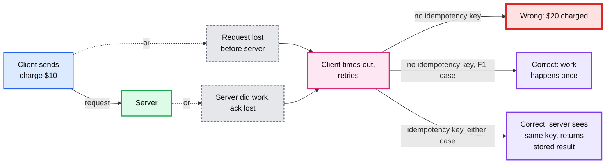
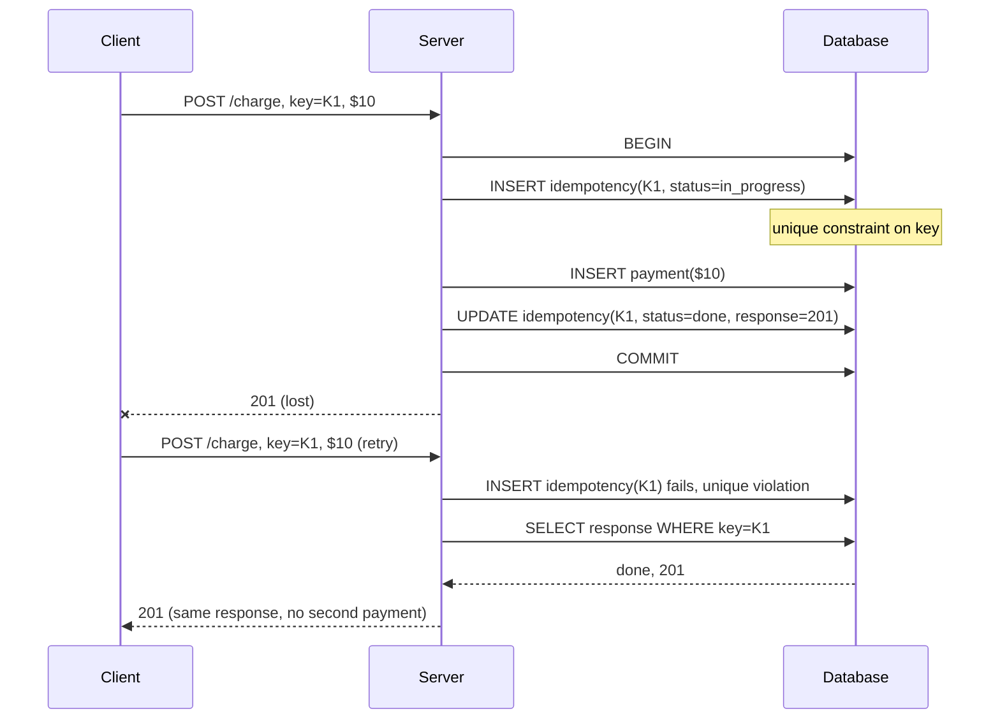
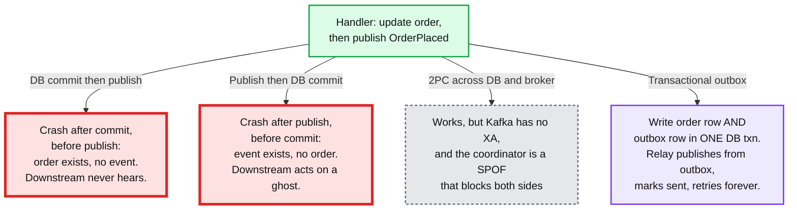
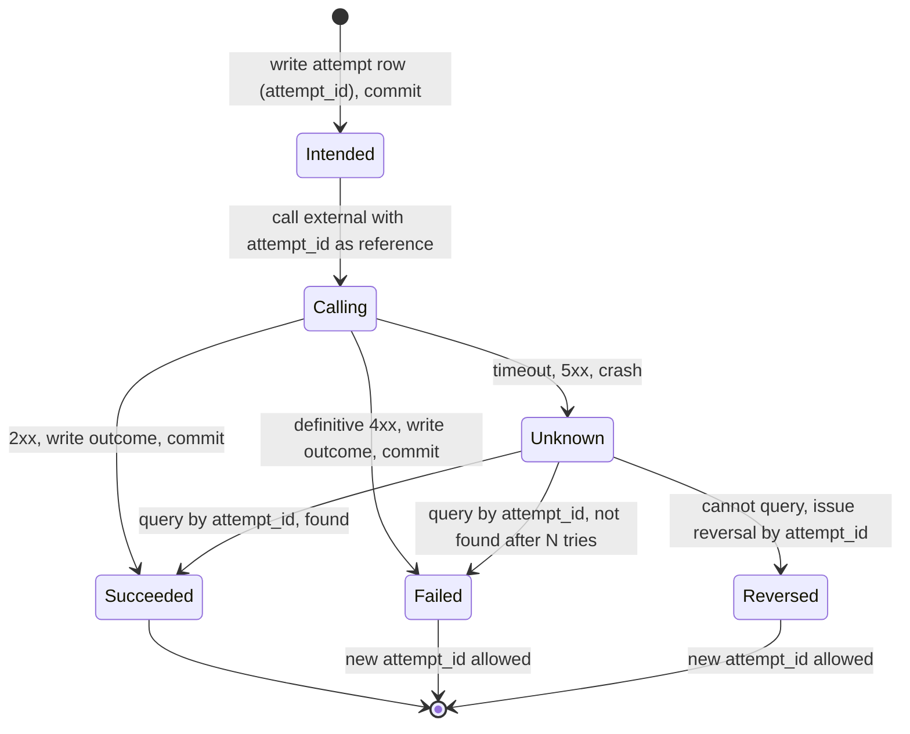

# Concept: Exactly-Once and Idempotency

> One-liner: exactly-once delivery does not exist over a network, but exactly-once **effect** does. You get it by making every retry safe (idempotency key stored in the same transaction as the side effect) and every hand-off durable before acknowledged (transactional outbox), so at-least-once delivery plus idempotent processing equals exactly-once outcome.

Depth target: high-level, same as [raft.md](raft.md) and [merkle-tree.md](merkle-tree.md). It is under test in nine of the forty ranked problems, and every payments, scheduler, and ingestion question ends with "what if that request is retried".

---

## 1. Mental model

A client sends a request. The server does the work and the ack is lost. The client cannot tell "work not done" from "work done, ack lost", so it retries. Now the work happens twice, unless the server can recognise the retry. That recognition is the whole topic.

- **Delivery semantics** are a property of the transport: at-most-once (fire and forget), at-least-once (retry until ack), exactly-once (impossible: the Two Generals problem).
- **Processing semantics** are a property of the receiver: can it apply the same message twice and end up in the state it would have after applying it once? If yes, the receiver is **idempotent**.
- **At-least-once delivery + idempotent receiver = exactly-once effect.** Every system that claims exactly-once (Kafka, Flink, Stripe, Temporal) is this equation with the receiver engineered carefully.

**Why this matters more at Staff level.** Senior answers say "add an idempotency key". Staff answers say where it is stored, in which transaction, how long it lives, what happens when two retries race, and what happens when the *downstream* call (the bank, the cloud API, the email provider) is the thing that cannot be made idempotent.

---

## 2. Idempotency key: the receiver side

The client generates a unique key per logical operation (UUID, or a hash of the request) and sends it on every attempt. The server stores the key and the outcome **in the same transaction** as the side effect.

Rules that turn this from a sketch into something that survives production:

| Rule | Why |
|---|---|
| **Key row and side effect in one transaction** | If the key is written first in a separate txn and the server crashes, the retry sees "done" for work that never happened. If the key is written after, a crash between them allows a duplicate. |
| **Unique constraint, not a read-then-write** | Two retries arriving concurrently both read "not present" and both proceed. The database's unique index is the only race-free check. |
| **Store the response, not just the key** | The retry must return the same status code and body. A retry that gets 200 the first time and 409 the second confuses every client. |
| **Handle `in_progress`** | Retry arrives while the first attempt is still running. Return 409 with retry-after, or block on the row lock. Never start a second execution. |
| **Key is scoped to the caller** | Two tenants using UUIDs will not collide, but if keys are client-chosen strings, prefix them with the tenant or user ID. |
| **Same key, different payload is an error** | Key K1 with $10 then K1 with $20 is a client bug. Return 422. Stripe does exactly this. |
| **TTL on keys, 24 hours is typical** | Unbounded growth. Stripe keeps 24 h. A retry after that creates a new operation, which is the correct behaviour for a client that has given up for a day. |
| **Key is generated by the caller, before the first attempt** | If the server generates it, the client cannot present it on retry. If the client generates it lazily on retry, it is a new key. |

Where the key lives, by layer:

| Layer | Key | Example |
|---|---|---|
| HTTP API | `Idempotency-Key` header | Stripe, Adyen, IETF draft `draft-ietf-httpapi-idempotency-key-header` |
| Message queue consumer | Message ID, or a business key inside the payload | Kafka offset is **not** enough, see section 4 |
| Database write | Natural key with `INSERT ... ON CONFLICT DO NOTHING` | Deterministic entry IDs in a ledger |
| Cloud API | Client token | AWS `ClientRequestToken`, GCP `requestId` |
| Workflow engine | Workflow ID | Temporal rejects a second start with the same ID |

---

## 3. Transactional outbox: the sender side

Idempotency keys protect the receiver. The sender has a mirror problem: "write to my database **and** publish an event" is two systems, and there is no transaction across them.

The outbox pattern:

1. In the same database transaction as the business write, insert a row into an `outbox` table: `(id, aggregate_id, event_type, payload, created_at, sent_at NULL)`.
2. A relay process reads unsent rows, publishes them to the broker, then marks `sent_at`.
3. The relay crashes between publish and mark: on restart it publishes again. **The outbox is at-least-once.** Consumers must be idempotent (section 2), keyed on the outbox row `id`.
4. Ordering: the relay reads in `id` order per aggregate, publishes to a partition keyed by `aggregate_id`.

Two ways to run the relay:

| Relay | How | Trade |
|---|---|---|
| **Polling** | `SELECT ... WHERE sent_at IS NULL ORDER BY id LIMIT 100` every 100 ms | Simple. Adds up to one poll interval of latency and constant read load on the table. Index on `sent_at` and delete sent rows aggressively. |
| **Log tailing (CDC)** | Debezium reads the DB's WAL, sees the outbox insert, publishes it. No polling, no `sent_at` column needed. | Sub-second latency, zero query load. One more moving part (the connector), and the connector's own offset is the new at-least-once boundary. |

**Inbox** is the mirror on the consumer: a `processed_messages(message_id)` table written in the same transaction as the consumer's business write. Outbox on the producer, inbox on the consumer, and the event has exactly-once effect end to end with no cross-system transaction anywhere.

---

## 4. Kafka's version of the same equation

Kafka is the reference implementation because it names each piece.

| Kafka feature | Which half of the equation | Mechanism |
|---|---|---|
| **Idempotent producer** (`enable.idempotence=true`, default since 3.0) | Retry-safe *send* to one partition | Producer gets a PID and attaches a sequence number per partition. Broker rejects a sequence it has already seen. Removes duplicates from network retries only, not from an application-level resend. |
| **Transactional producer** (`transactional.id`) | Atomic write across partitions, and atomic "consume offset + produce output" | Two-phase commit coordinated by a transaction coordinator, with the commit marker written to the log. Consumers with `isolation.level=read_committed` skip uncommitted records. |
| **Consumer offset commit** | The *only* record of progress | Auto-commit is at-most-once if you commit before processing and at-least-once if after. There is no setting that makes it exactly-once on its own. |
| **Kafka Streams `exactly_once_v2`** | The whole pipeline, Kafka to Kafka | Input offset commit and output produce in one transaction. Exactly-once only as long as the sink is Kafka. The moment the sink is a database or an HTTP call, you are back to an idempotent receiver. |

The pattern to say out loud: **"Kafka gives exactly-once between Kafka topics. Leaving Kafka, the sink must be idempotent or transactional with the offset."** A JDBC sink that writes `INSERT ... ON CONFLICT (event_id) DO NOTHING` is the idempotent form. A sink that stores the Kafka offset in the same database transaction as the row (then seeks to that offset on restart, ignoring the broker's committed offset) is the transactional form. Flink's two-phase-commit sink does the latter with its checkpoint as the transaction.

---

## 5. When the downstream cannot be made idempotent

The hard case: your side effect is a call to a system you do not control, and it has no idempotency key. The bank rail, the SMS gateway, the partner's legacy SOAP API.

- **Write the attempt before the call.** An `attempts(attempt_id, payment_id, state)` row committed before the external call means a crash mid-call leaves evidence. On restart, every `Calling` row older than the timeout is an unknown to resolve, never a fresh call.
- **Pass the attempt ID as the external reference.** Most rails let you attach a reference string. It is your query key and your reversal key.
- **Never retry an unknown with the same attempt ID against a non-idempotent API.** Resolve first (query), then either mark done or reverse and issue a *new* attempt ID. A reversal of something that never happened is a no-op on any sane rail, so "reverse then retry" is the safe order when you cannot query.
- **Reconciliation is part of the design, not an afterthought.** A nightly job compares your `Succeeded` set to the rail's settlement file. The discrepancy count is a top-line metric.

This is the `hld/payments-ledger/` pattern: attempt ID per rail call, reversal on unknown outcome, deterministic entry IDs so the ledger write itself is idempotent.

---

## 6. Making the operation itself idempotent

Sometimes you can avoid the key entirely by changing the operation.

| Non-idempotent | Idempotent equivalent | Why it works |
|---|---|---|
| `balance += 10` | `balance = 110` (set, with version check) | Setting an absolute value twice is harmless. Needs the caller to know the current value: optimistic concurrency, `WHERE version = 7`. |
| `INSERT order` | `INSERT order (id = client_uuid) ON CONFLICT DO NOTHING` | The natural key is the idempotency key. No separate table. |
| `send email` | `send email if not sent(message_id)` | Pushes the key into the email service. Only works if the service supports it. |
| `append event` | `append event at position N` (conditional append) | Kafka producer sequence numbers, S3 conditional PUT with `If-None-Match`. Second append at the same position is rejected. |
| `increment counter` | `add (client_id, seq, delta)` to a set, sum on read | Set insert is idempotent. Counter becomes a PN-counter, see [crdt.md](crdt.md). |
| `create VM` | `create VM with ClientRequestToken` | The cloud API stores the token for you. AWS, GCP, Azure all support it, with a 24 h to 7 day window. |

The general rule: **an operation is idempotent if its effect depends only on its arguments, not on how many times it has run.** Absolute writes, keyed inserts, and set unions are naturally idempotent. Relative updates and appends are not, and need a key.

---

## 7. Where you meet it

| System | Mechanism | Detail |
|---|---|---|
| **Stripe** | `Idempotency-Key` header, 24 h retention, same-key-different-body is 400 | The public reference design. Response body is cached and replayed. |
| **AWS** (EC2, SQS FIFO, Lambda) | `ClientRequestToken`, SQS FIFO `MessageDeduplicationId` (5 min window), Lambda async invoke dedups by request ID | SQS FIFO dedup is content-hash based if you do not set the ID. |
| **Kafka** | Idempotent producer, transactions, `exactly_once_v2` | Section 4. |
| **Flink** | Checkpoint barriers plus two-phase-commit sink | The checkpoint is the transaction. Sink pre-commits on snapshot, commits on checkpoint complete. |
| **Temporal / Cadence** | Workflow ID uniqueness, activity idempotency is the developer's job | The engine guarantees each workflow step is recorded once. The activity's external side effect still needs a key. |
| **Debezium outbox event router** | Reads `outbox` table via CDC, routes by `aggregate_type` | The standard outbox implementation. |
| **TCP** | Sequence numbers | The original idempotent receiver: duplicate segments are dropped by sequence number. |
| **HTTP** | `PUT` and `DELETE` are defined idempotent, `POST` is not | Which is why `POST` needs the header and `PUT` does not. |
| **Bank rails (ACH, card networks)** | Reference ID per transaction, reversal by reference | Section 5. |

---

## 8. Practical additions every real implementation has

| Addition | Problem it fixes |
|---|---|
| **Key TTL and cleanup job** | Unbounded idempotency table. 24 h for APIs, 7 days for batch jobs, 5 min for SQS FIFO. |
| **Fingerprint of the request stored with the key** | Detects same-key-different-payload client bugs. |
| **`in_progress` state with lock or 409** | Concurrent retries starting two executions. |
| **Response cached with the key** | Retry returns a different status than the original. |
| **Outbox rows deleted after publish, or partitioned by day** | Outbox table growth kills the polling query. |
| **Per-aggregate ordering key in the outbox** | Events for one order arrive out of order. |
| **Attempt table for external calls** | Crash mid-call leaves no evidence. |
| **Reconciliation job and a discrepancy metric** | Silent drift between your ledger and the rail. |
| **Dedup window sized to the retry horizon** | A consumer dedup cache of 10 min when the producer retries for 1 h lets duplicates through. |
| **Client library that generates and persists the key before the first attempt** | Client crashes before sending, restarts, generates a new key, and the first attempt (which did arrive) is now an orphan duplicate. |

---

## 9. Failure modes and what happens

| Failure | What happens | Fix |
|---|---|---|
| Key written in a separate txn before the work | Crash after key, before work. Retry sees "done". **Work never happens, client believes it did.** | One transaction. |
| Key written after the work | Crash after work, before key. Retry does the work again. **Double charge.** | One transaction. |
| Read-then-write check instead of unique constraint | Two concurrent retries both pass the check. Double execution. | Unique index. |
| Dedup window shorter than retry horizon | Late retry creates a duplicate. | Window >= max client retry time. Or client-generated natural key with no window. |
| Outbox relay publishes, crashes before marking sent | Duplicate event. Harmless *only if* consumers are idempotent on the outbox row ID. | Inbox table on consumers. |
| Consumer commits Kafka offset before processing | Crash mid-process. Message lost. **At-most-once.** | Commit after processing, make processing idempotent. |
| Consumer processes, crashes before committing offset | Message reprocessed. Fine if idempotent, double effect if not. | Inbox table, or offset stored with the business write. |
| Non-idempotent downstream retried on timeout | Double external side effect. Double SMS, double bank transfer. | Attempt ledger, query-or-reverse before a new attempt. |
| Idempotency table on a different shard from the business row | No single transaction spans both. Back to dual-write. | Co-locate: same shard key. |
| Key derived from request content that includes a timestamp | Every retry has a different key. | Key from the logical operation, not the wire bytes. |

---

## 10. Trade-offs

| Gain | Cost |
|---|---|
| Retries become safe, so clients can retry aggressively and the system tolerates at-least-once everywhere. | One extra row per request in the hot write path. At 50k QPS that is 4 billion rows a day before TTL cleanup. |
| No cross-system transactions. Outbox and inbox replace 2PC. | Latency: outbox relay adds 10 ms to 1 s. Duplicates are *expected* and every consumer must handle them. |
| Exactly-once effect end to end is achievable and auditable. | Every hop must participate. One non-idempotent consumer breaks the chain. |
| Attempt ledger makes external calls recoverable. | Reconciliation becomes a permanent operational job. |
| Natural-key idempotency needs no extra table. | Requires the client to generate a stable ID before the first attempt, which pushes complexity to every client. |

**What a Staff answer refuses to build:** 2PC between a database and a message broker, a dedup cache in memory (lost on restart, which is exactly when duplicates appear), an idempotency check that is a `SELECT` followed by an `INSERT`, and any "exactly-once" claim that does not name where the key is stored and in which transaction.

---

## 11. Numbers worth memorizing

- Stripe idempotency key retention: **24 hours**. SQS FIFO dedup window: **5 minutes**. AWS `ClientRequestToken`: 24 h (EC2) to 7 days (some services).
- Idempotency row: ~100 bytes (key, status, response hash, timestamp). 50k QPS at 24 h TTL is ~430 GB before cleanup. Size the table and the TTL job.
- Outbox polling: 100 ms interval is the usual default. CDC relay: sub-second, no polling load.
- Kafka idempotent producer overhead: near zero (sequence number per batch). Transactions: ~3 to 5% throughput cost and one extra round trip per commit.
- Flink checkpoint interval: 10 s to 1 min typical. Exactly-once sink latency is bounded by that interval.
- The Two Generals result: no finite protocol achieves exactly-once delivery over a lossy link. Say it once, then move on to effect.

---

## 12. Interview soundbite

> "Exactly-once delivery is impossible, exactly-once effect is routine. The client sends an idempotency key it generated before the first attempt. The server stores the key and the response in the same transaction as the side effect, behind a unique constraint, so a retry hits the constraint and replays the stored response. For hand-offs between systems, I write an outbox row in the same transaction and let a relay publish it at-least-once; consumers keep an inbox table the same way. When the downstream is a bank rail with no key, I write an attempt row before the call, pass the attempt ID as the reference, and on timeout I query or reverse before ever issuing a new attempt. Every hop is at-least-once, every receiver is idempotent, the outcome is exactly-once."

Follow-ups an interviewer will ask, in order of likelihood:

1. Where exactly is the idempotency key stored, and what if the server crashes between storing it and doing the work? (Section 2, same transaction.)
2. Two retries arrive at the same time. (Section 2, unique constraint plus `in_progress`.)
3. How do you publish an event and write to the DB atomically? (Section 3, outbox.)
4. Kafka says exactly-once. Is that true? (Section 4, only Kafka to Kafka.)
5. The bank API has no idempotency key. (Section 5, attempt ledger, query or reverse.)
6. How long do you keep keys, and what happens after? (Section 2, 24 h, then a new operation.)
7. Can you avoid the key entirely? (Section 6, absolute writes, natural keys.)
8. What is the throughput cost? (Section 11, one row per request, ~3 to 5% for Kafka txns.)

Related: [crdt.md](crdt.md) (idempotent merge as a data-type property), [replication-and-quorums.md](replication-and-quorums.md) (why replicas see duplicates), [distributed-transactions.md](distributed-transactions.md) (sagas need idempotent compensations), [stream-processing.md](stream-processing.md) (checkpoint-based exactly-once), `hld/payments-ledger/` (attempt IDs and reversals in full), `hld/distributed-job-scheduler/` (event log plus rows in one transaction), `popular_systems_deepdive/kafka/` (idempotent and transactional producer internals).
