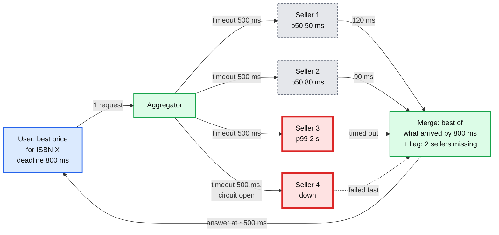
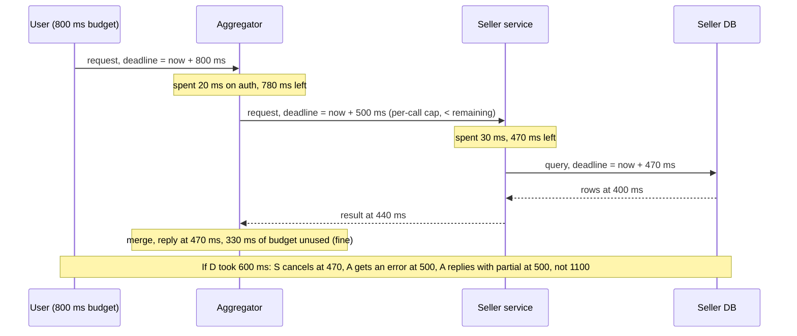
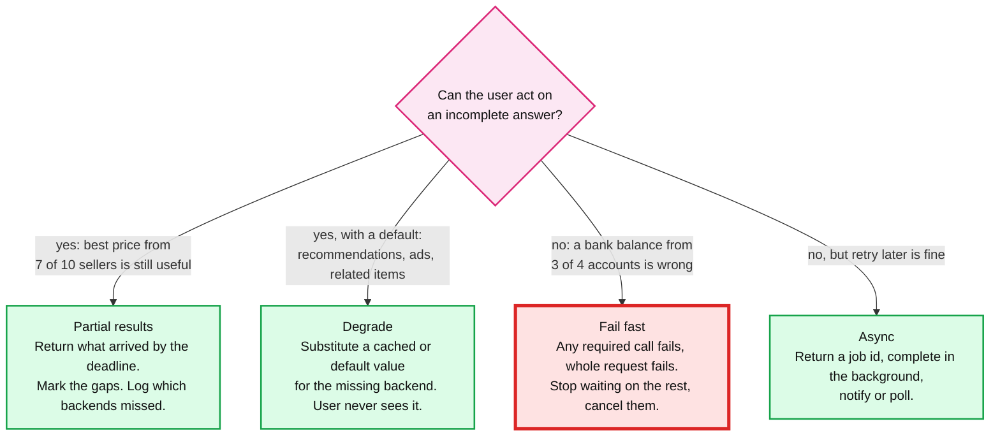
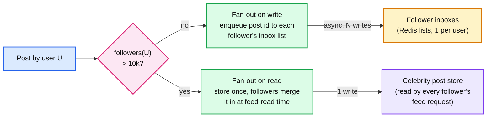

# Concept: Fan-Out / Fan-In and Partial Failure

> One-liner: fan-out sends one request to N backends in parallel and fan-in merges their answers; the maths that governs it is that with N calls the slowest one decides your latency and the least reliable one decides your error rate, so the design is about **bounding the wait** (per-call timeouts, a total deadline, hedged requests) and **defining a useful answer when some calls fail** (partial results, defaults, degraded mode) instead of pretending all N will succeed.

Depth target: high-level, same as [sharding.md](sharding.md) and [exactly-once.md](exactly-once.md). It is the whole of the book seller broker problem (the most reported Databricks question), and it appears again in Slack fan-out, feed delivery, and scatter-gather queries.

---

## 1. Mental model

One user request becomes N backend requests. Each backend has its own latency distribution and its own failure rate. You wait for all N, merge, and reply. The user sees the worst of the N, every time.



Two kinds of fan-out, with different problems:

| Kind | Shape | The hard part | Examples |
|---|---|---|---|
| **Read fan-out** (scatter-gather) | One query, N shards or N providers, merge the answers | Tail latency, partial results, one slow backend | Search across index shards, price aggregation, scatter query without a shard key, dashboard from 10 services |
| **Write fan-out** (broadcast) | One event, N recipients | Amplification (1 write becomes 50M), ordering, delivery guarantees, the celebrity | Feed delivery, chat message to a 100k-member channel, cache invalidation, webhook delivery |

**Why this matters more at Staff level.** Senior answers add a thread pool and a timeout. Staff answers give the tail-latency maths, decide what a partial answer means to the user, protect the backends from the aggregator's retries, and say what the aggregator does when *it* dies mid-request.

---

## 2. The tail latency maths

Every backend has a p99. Fan out to N and the request's p99 is dominated by the chance that at least one of N is slow.

```
P(at least one of N calls is above its p99) = 1 - 0.99^N
```

| N | Probability the request hits at least one p99 |
|---|---|
| 1 | 1% |
| 10 | 10% |
| 50 | 39% |
| 100 | **63%** |
| 500 | 99% |

At N=100 the *median* user experience is one backend's p99. This is Dean and Barroso's "The Tail at Scale" (2013) and it is the single number to quote. The same arithmetic applies to errors: 99.9% availability per backend, 100 backends, and the all-must-succeed request is 90.5% available.

Three levers, in the order to apply them:

1. **Cut N.** Route by shard key so it is 1 shard, not all 100. Cache the aggregate. Batch multiple keys into one call per backend.
2. **Bound the wait.** Per-call timeout below the total deadline. A deadline that propagates down every hop. Return what you have when it fires.
3. **Hedge the tail.** After the p95 elapses with no answer, send a duplicate to another replica and take whichever returns first. Google's BigTable measured a p99.9 drop from 1,800 ms to 74 ms with hedging at ~2% extra load.

---

## 3. Bounding the wait: timeouts, deadlines, hedging



| Mechanism | What it does | Rule |
|---|---|---|
| **Per-call timeout** | Caps one backend | Set from that backend's p99, not a round number. 500 ms for a 50 ms p50 service is a 10x allowance. |
| **Total deadline** | Caps the whole request | Propagated as an absolute time in the request (gRPC deadline, `X-Request-Deadline`). Each hop computes remaining and passes it down. **Never let a downstream hop have a longer timeout than the upstream one.** |
| **Cancellation** | Stops work nobody will use | When the deadline fires or the client disconnects, cancel in-flight calls (context cancellation, request abort). Otherwise backends keep working on dead requests, which is how a slow period becomes an outage. |
| **Hedged requests** | Sends a second copy after a delay | Delay = p95 of that backend. Cap hedges at ~5% of traffic. Only for idempotent reads. Cancel the loser. |
| **Tied requests** | Sends to two replicas at once, each told about the other; the one that starts first tells the other to drop it | Lower latency than hedging, more complex. BigTable and Google's disk layer. |
| **Backup requests with cross-server cancellation** | Same idea, generic name | Say "hedging" and describe it. |

The one rule people break: **retries multiply.** Aggregator retries 3x, each seller service retries 3x to its DB, that is 9 DB calls for one user request during an incident. Retry at **one** layer (usually the outermost that can judge idempotency), with a retry budget (retries capped at 10% of requests, per client), exponential backoff with jitter, and never on timeouts unless the call is idempotent.

---

## 4. Fan-in: what is a useful answer when some calls fail

The aggregator's contract with the user has to say what happens on partial failure. Decide it up front, per use case.



Details of a good merge step:

- **Required vs optional backends.** Search results are required, the "people also bought" panel is optional. Optional ones get a shorter timeout and a default. Required ones decide the status code.
- **Early return.** If the answer is "the best price" and 8 of 10 sellers have replied with the deadline half spent, waiting for the last 2 costs latency for a small chance of a better price. Return when a quorum or a quality threshold is met. Say the number: "return at 80% or at the deadline, whichever first".
- **Late responses.** A seller replies after you have answered the user. Options: drop it, cache it for the next request, or (for a stateful flow like a booking) record it and reconcile. Never block on it.
- **Mark the gaps.** `{"prices": [...], "sellers_missing": ["s3", "s4"], "complete": false}`. The client can show "some sellers unavailable". Silent partial results are a debugging nightmare.
- **Merge is where ordering and dedup happen.** Search: merge-sort by score, dedup by doc ID. Prices: min. Feed: merge by timestamp, dedup by post ID. This step is CPU on the aggregator and it is the aggregator's hot spot at high N.

---

## 5. Protecting the backends: isolation and shedding

The aggregator is a traffic multiplier. Its retries, its hedges, and its failure to cancel are how one slow backend takes down the rest.

| Mechanism | Problem | How |
|---|---|---|
| **Per-backend concurrency limit** (bulkhead) | One slow seller absorbs every aggregator thread, the fast sellers starve | Separate pool or semaphore per backend, sized to `p99 latency x target QPS`. Excess requests to that backend fail fast. |
| **Circuit breaker** | A dead backend costs a full timeout on every request | Track error rate per backend over a window. Above a threshold (50% of 20 requests), open: fail instantly for 30 s, then let one probe through. |
| **Per-backend rate limit** | A seller's contract says 100 QPS, the aggregator sends 1,000 | Token bucket per backend at the aggregator. Queue or shed above it. See [rate-limiting-and-load-shedding.md](rate-limiting-and-load-shedding.md). |
| **Load shedding at the aggregator** | Aggregator itself is overloaded, every request gets slow, none complete | Reject at admission when queue depth or in-flight count exceeds capacity. Prioritise: paying users over free, reads over prefetch. |
| **Batching** | 1,000 keys means 1,000 calls to the same shard | Group keys by shard, one call per shard with a key list. N goes from 1,000 to the shard count. |
| **Coalescing** | 500 users ask for the same ISBN in one second | One in-flight fan-out per key, others wait on it (single-flight). See [caching-patterns.md](caching-patterns.md). |

---

## 6. Write fan-out: feeds, channels, and the celebrity

The write side has the opposite problem: one event, N recipients, and N can be 50 million.



| Strategy | Write cost | Read cost | Fits |
|---|---|---|---|
| **Fan-out on write** (push) | N inbox writes per post, async via a queue | 1 read of the user's inbox | Most users: few followers, many reads. Twitter's default. |
| **Fan-out on read** (pull) | 1 write | Read every followee's recent posts, merge | Celebrities: 1 post would be 50M writes. Also inactive users, whose inbox would never be read. |
| **Hybrid** | Push below a follower threshold, pull above | Inbox read plus a merge of the few celebrity followees | Every large feed system. Threshold ~10k to 100k. |

Rules for the push path:

- **Async through a queue**, never inline. The post is acknowledged when it is durably stored and the fan-out job is enqueued. Fan-out completes over seconds. See [stream-processing.md](stream-processing.md) for the queue semantics.
- **Store IDs, not content.** The inbox holds post IDs; content is fetched (and cached) at read time. 50M inbox writes of 8 bytes is 400 MB, of 2 KB is 100 GB.
- **Skip inactive users.** A user who has not opened the app in 30 days gets no pushes; their feed is built by pull on their next visit. Cuts fan-out by 50% or more.
- **Idempotent inbox insert.** The fan-out job will be retried. `SADD` or `ZADD` with the post ID is naturally idempotent; a list `LPUSH` is not.
- **Chat channels** (Slack, Discord): a 100k-member channel is the same problem. Write the message once to the channel log, fan out only to *connected* members' sockets (thousands, not 100k), and let offline members pull on reconnect.

---

## 7. The aggregator's own failure

The aggregator crashes with 10 calls in flight. What did the user get, and what did the backends do?

- **Stateless read aggregator:** the user gets a connection error and retries. Backends finish their work for nothing. The fix is cancellation on client disconnect so they stop early. Nothing else needed.
- **Stateful fan-out** (a booking that reserves seats at 3 airlines, a payment that charges then notifies): the crash leaves partial side effects. This is a [distributed transaction](distributed-transactions.md) and needs a saga with a persisted state and idempotent steps, not a fan-out with timeouts.
- **Write fan-out job** (feed delivery): the job is in a queue with at-least-once delivery. On crash, it is redelivered and redone. Inbox inserts are idempotent, so the retry is safe. Progress checkpointing (`last_follower_id`) avoids redoing 50M writes.

The line to say: **read fan-out is stateless and cancellable; write fan-out is a queue job with idempotent steps; anything with cross-system side effects is a saga, not a fan-out.**

---

## 8. Where you meet it

| System | Fan-out | Detail |
|---|---|---|
| **Google search, Elasticsearch** | Query to every index shard, merge top-k | Shard count is N. Elasticsearch `adaptive replica selection` picks the least-loaded replica. Partial results returned with `_shards.failed > 0`. |
| **Book seller broker, Kayak, Skyscanner** | One query to N providers with contracts and rate limits | Per-provider timeout and circuit breaker, partial results by deadline, late results cached for the next search. |
| **Twitter, Instagram feed** | Post to N followers | Hybrid at ~10k to 100k followers. Twitter's Earlybird fan-out on write with pull for celebrities. |
| **Slack, Discord** | Message to channel members | Log once, push to connected sockets, pull on reconnect. |
| **BigTable, Spanner, Dynamo** | Hedged reads to replicas | The Tail at Scale numbers. |
| **GraphQL gateways, BFFs** | One page = 10 to 50 service calls | Deadline propagation, DataLoader batching, per-field nullability as the partial-result contract. |
| **Cache invalidation, config push** | One change to N nodes | Best effort plus a version number; nodes pull on mismatch. Never wait for all N. |
| **Webhooks** | One event to N subscribers | Per-subscriber queue, retries with backoff, dead-letter after 24 h, subscriber-level circuit breaker. |
| **MapReduce shuffle, Spark** | Every mapper to every reducer | Stragglers dominate. Speculative execution is hedging for batch jobs. |

---

## 9. Practical additions every real implementation has

| Addition | Problem it fixes |
|---|---|
| **Deadline propagated as absolute time** | Downstream timeouts longer than upstream, work continues after the user gave up. |
| **Cancellation on deadline and disconnect** | Zombie work during incidents. |
| **Per-backend timeout from its p99** | One round number for all backends is wrong for all of them. |
| **Hedging at p95, capped at 5%, idempotent only** | Tail latency at high N. |
| **Retry budget and single retry layer** | Retry storms. |
| **Bulkhead per backend** | Slow backend starves the rest. |
| **Circuit breaker** | Dead backend costs a timeout per request. |
| **Early return at quorum or quality threshold** | Waiting for the last 10% costs 50% of the latency. |
| **Partial-result flag in the response** | Silent incompleteness. |
| **Batching by shard, coalescing by key** | N is bigger than it needs to be. |
| **Async fan-out through a queue with idempotent steps and checkpoints** | Inline write fan-out blocks the writer and cannot survive a crash. |
| **Inactive-user skip, celebrity threshold** | 50M writes for one post. |
| **Late-response handling policy** | Responses after the deadline crash the merge or leak memory. |

---

## 10. Failure modes and what happens

| Failure | What happens | Fix |
|---|---|---|
| No total deadline | Slowest backend sets the latency. At N=100 that is a p99 on most requests. | Deadline plus per-call timeout. |
| Downstream timeout longer than upstream | Upstream gives up, downstream keeps going, no one uses the result. Under load this is a death spiral. | Propagate remaining budget. |
| No cancellation | Same. Backends process dead requests. | Context cancellation on every hop. |
| Retries at every layer | 3 layers x 3 retries = 27x amplification. Backend that was slow is now dead. | One retry layer, retry budget, backoff with jitter. |
| Hedging non-idempotent calls | Duplicate side effects. | Reads only, or idempotency key. |
| Hedging without cancellation | Every hedged request doubles backend load. | Cancel the loser. Cap at 5%. |
| One slow backend, shared thread pool | All threads blocked on it. Fast backends unreachable. Whole aggregator down. | Bulkhead. |
| Dead backend, no breaker | Every request pays the full timeout. p50 becomes the timeout. | Circuit breaker. |
| Silent partial results | Users see fewer results, nobody knows for a week. | `complete: false` in the response, per-backend miss metric. |
| Inline write fan-out | Posting takes 30 s for a user with 1M followers, and fails halfway. | Queue, async, checkpoint. |
| Fan-out job retried without idempotency | Duplicate posts in inboxes. | Set semantics on the inbox. |
| Celebrity on the push path | One post is 50M writes, queue backs up for everyone. | Threshold, pull path. |
| Aggregator crash mid stateful fan-out | Partial side effects, no record. | It was a saga. Persist state before each step. |

---

## 11. Trade-offs

| Gain | Cost |
|---|---|
| Parallel fan-out: latency is max(N), not sum(N). | Latency is the *tail* of N, and the tail gets worse with N. |
| Partial results: available through backend failures. | The contract with the user is weaker and must be explicit. |
| Hedging: p99.9 drops 10x or more. | 2 to 5% extra load, idempotent reads only, needs cancellation. |
| Circuit breakers and bulkheads: one bad backend cannot take the rest. | Requests to that backend fail fast even when it would have succeeded. Tuning per backend. |
| Fan-out on write: reads are one list fetch. | Write amplification by follower count. Celebrities break it. |
| Fan-out on read: writes are cheap. | Reads merge N followees. Slow for users following thousands. |
| Hybrid: both, with a threshold. | Two code paths, a threshold to tune, and posts from a user crossing the threshold live in both. |
| Async fan-out via queue: writer never blocks, survives crashes. | Delivery delay of seconds. Idempotency required everywhere. |

**What a Staff answer refuses to build:** a fan-out with one round-number timeout for all backends, retries at more than one layer, hedging on writes, inline fan-out to followers, a shared thread pool across backends, and any response that hides which backends did not answer.

---

## 12. Numbers worth memorizing

- **`1 - 0.99^N`**: 10% at N=10, 39% at N=50, 63% at N=100. The Tail at Scale.
- Availability of all-must-succeed: `a^N`. 99.9% per backend, 100 backends: 90.5%.
- Hedging: send at p95, cap at 5% of traffic. BigTable: p99.9 from 1,800 ms to 74 ms with 2% extra load.
- Retry budget: 10% of requests. Backoff base 100 ms, cap 10 s, full jitter.
- Circuit breaker: open at 50% errors over 20 requests, half-open probe after 30 s.
- Bulkhead size: `target QPS x p99 latency`. 100 QPS x 0.5 s = 50 concurrent.
- Early return: at 80% of backends or the deadline.
- Celebrity threshold: 10k to 100k followers. Inactive-user skip: 30 days, cuts fan-out ~50%.
- Inbox entry: 8 byte post ID. 50M followers: 400 MB of inbox writes per post if pushed.
- Slack-scale channel: write once, push to connected sockets (thousands), pull on reconnect.

---

## 13. Interview soundbite

> "One request to N backends means the user sees the slowest one, and at N=100 that is a p99 on 63% of requests. So I attach an absolute deadline that propagates to every hop, give each backend a timeout from its own p99, cancel everything on deadline or disconnect, and hedge idempotent reads at the p95 with a 5% cap. The merge returns at a quality threshold or the deadline, marks which backends are missing, and treats optional backends with a default. Backends are protected by a bulkhead and a circuit breaker each, retries happen in exactly one layer with a budget. For write fan-out I push post IDs asynchronously through a queue with idempotent inbox inserts, skip inactive users, and pull for anyone over 10k followers. If the fan-out has cross-system side effects it is a saga, not a fan-out."

Follow-ups an interviewer will ask, in order of likelihood:

1. One seller is slow. What happens to the request? (Section 3, timeout and bulkhead. Section 4, partial result.)
2. A seller responds after you have answered. (Section 4, drop or cache, never block.)
3. Seller has a 100 QPS contract. (Section 5, per-backend token bucket.)
4. The aggregator crashes mid-request. (Section 7, stateless reads are fine, stateful is a saga.)
5. Why not retry the slow call? (Section 3, retry storms, budget, one layer.)
6. What is hedging and when is it unsafe? (Section 3, idempotent only, cancel the loser.)
7. A user with 50M followers posts. (Section 6, pull path.)
8. How does the deadline reach the database? (Section 3, propagate remaining budget.)
9. What does the user see when 3 of 10 backends are down? (Section 4, decided per use case, marked in the response.)

Related: [sharding.md](sharding.md) (why the scatter is N shards and how to cut N), [rate-limiting-and-load-shedding.md](rate-limiting-and-load-shedding.md) (per-backend limits, admission control, retry budgets), [caching-patterns.md](caching-patterns.md) (coalescing and single-flight), [distributed-transactions.md](distributed-transactions.md) (when the fan-out has side effects), [exactly-once.md](exactly-once.md) (idempotent fan-out jobs), [stream-processing.md](stream-processing.md) (the queue under async fan-out), [realtime-client-server-communication.md](realtime-client-server-communication.md) (pushing to connected sockets), `hld/book-seller-broker/` (the full worked problem), `hld/slack-messaging/` (channel fan-out).
