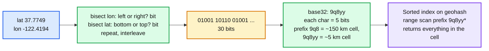
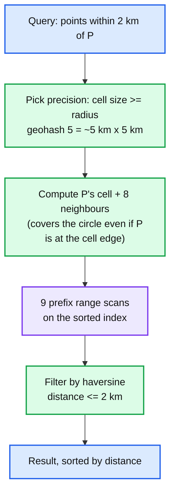

# Concept: Geospatial Indexing

> One-liner: a geospatial index turns a 2D location into something a 1D index can handle, either by encoding (lat, lon) into a single sortable string or integer whose prefix is a cell (geohash, S2, H3), or by building a tree of bounding boxes (R-tree, quadtree); "find everything within 5 km" becomes "scan the handful of cells that cover the circle, then filter exactly", and the two problems are cells that are hot and cells that split a neighbourhood across a boundary.

Depth target: high-level, same as [sharding.md](sharding.md). It is the core of the nearby-friends and Street View problems and appears in any ride-hailing, delivery, or maps question. Because geohash is DSA, this note has runnable code.

---

## 1. Mental model

A B-tree sorts one column. Latitude and longitude are two. Sorting by latitude puts two points at the same latitude on opposite sides of the planet next to each other. The fix is a space-filling curve: walk the map in a zig-zag so that nearby points *usually* land near each other in the 1D order, then index that.



| Approach | Structure | Cell shape | Neighbours | Where |
|---|---|---|---|---|
| **Geohash** | Z-order curve over lat/lon, base32 string, prefix = cell | Rectangles that get skinny near the poles | 8 neighbours computable from the string; cells across a prefix boundary are far apart in the string | Redis `GEO*`, Elasticsearch, many home-grown systems |
| **S2** (Google) | Hilbert curve over a cube projected onto the sphere, 64-bit cell ID, 30 levels | Roughly square, nearly uniform area globally | Hilbert curve keeps neighbours closer than Z-order; covering algorithm gives a minimal set of cells for any region | Google Maps, Foursquare, MongoDB 2dsphere, Pokemon Go |
| **H3** (Uber) | Hexagonal grid, 16 resolutions, 64-bit cell ID | Hexagons, all neighbours equidistant | 6 neighbours, no corner ambiguity; ideal for "how many drivers around me" | Uber, Foursquare, analytics and heatmaps |
| **Quadtree** | Tree; each node splits into 4 when it holds more than N points | Adaptive: dense areas get small cells | Tree walk | In-memory indexes, game maps, tile pyramids |
| **R-tree** | Tree of minimum bounding rectangles | Adaptive, overlapping | Tree walk with box intersection | PostGIS (GiST), SQLite, Oracle Spatial; handles polygons and lines, not just points |
| **Grid** | Fixed cells of one size | Uniform | Trivial | Simplest; fine when density is even |

**Why this matters more at Staff level.** Senior answers say "use a geohash". Staff answers pick the precision from the query radius, explain the boundary problem and the 8-neighbour fix, say what happens to the index when a million drivers move every 4 seconds, and say how a hot city block is sharded.

---

## 2. Querying: radius search with cells



- **The boundary problem**: a point 10 m from P can be in the next cell, whose geohash shares no prefix. Scanning only P's cell misses it. Always scan the 8 neighbours too (or use an S2 covering, which computes the minimal cell set for the exact circle).
- **Precision from radius**: choose the smallest cell that is at least the radius, so 9 cells always cover the circle. Then filter exactly, because the 9 cells cover up to 9x the area of the circle.
- **k-nearest**: start with a small precision, scan 9 cells, if fewer than `k` results drop one precision level (cells 32x bigger for geohash, 4x for S2) and repeat.
- **Polygon queries** ("inside this delivery zone"): S2 or H3 covering of the polygon into a cell set, index lookup by cell, then exact point-in-polygon on candidates.

---

## 3. Code

Python, runnable, no dependencies. Geohash encode, decode to a bounding box, and the 8 neighbours by the arithmetic that real libraries use (decode, step by one cell, re-encode).

```python
BASE32 = "0123456789bcdefghjkmnpqrstuvwxyz"


def encode(lat: float, lon: float, precision: int = 7) -> str:
    lat_lo, lat_hi, lon_lo, lon_hi = -90.0, 90.0, -180.0, 180.0
    bits, out, even = 0, [], True
    bit_count = 0
    while len(out) < precision:
        if even:                                    # longitude bit
            mid = (lon_lo + lon_hi) / 2
            if lon >= mid:
                bits = bits * 2 + 1
                lon_lo = mid
            else:
                bits = bits * 2
                lon_hi = mid
        else:                                       # latitude bit
            mid = (lat_lo + lat_hi) / 2
            if lat >= mid:
                bits = bits * 2 + 1
                lat_lo = mid
            else:
                bits = bits * 2
                lat_hi = mid
        even = not even
        bit_count += 1
        if bit_count == 5:                          # 5 bits per base32 char
            out.append(BASE32[bits])
            bits, bit_count = 0, 0
    return "".join(out)


def decode_box(gh: str) -> tuple[float, float, float, float]:
    """Returns (lat_lo, lat_hi, lon_lo, lon_hi) of the cell."""
    lat_lo, lat_hi, lon_lo, lon_hi = -90.0, 90.0, -180.0, 180.0
    even = True
    for ch in gh:
        v = BASE32.index(ch)
        for shift in (4, 3, 2, 1, 0):
            bit = (v >> shift) & 1
            if even:
                mid = (lon_lo + lon_hi) / 2
                lon_lo, lon_hi = (mid, lon_hi) if bit else (lon_lo, mid)
            else:
                mid = (lat_lo + lat_hi) / 2
                lat_lo, lat_hi = (mid, lat_hi) if bit else (lat_lo, mid)
            even = not even
    return lat_lo, lat_hi, lon_lo, lon_hi


def neighbours(gh: str) -> list[str]:
    """The 8 surrounding cells at the same precision: step one cell in each direction and re-encode."""
    lat_lo, lat_hi, lon_lo, lon_hi = decode_box(gh)
    dlat, dlon = lat_hi - lat_lo, lon_hi - lon_lo
    clat, clon = (lat_lo + lat_hi) / 2, (lon_lo + lon_hi) / 2
    out = []
    for dy in (-1, 0, 1):
        for dx in (-1, 0, 1):
            if dy == 0 and dx == 0:
                continue
            lat = max(-90.0, min(90.0, clat + dy * dlat))
            lon = ((clon + dx * dlon + 180.0) % 360.0) - 180.0      # wrap at the antimeridian
            out.append(encode(lat, lon, len(gh)))
    return out


if __name__ == "__main__":
    sf = encode(37.7749, -122.4194, 5)
    box = decode_box(sf)
    print(f"San Francisco at precision 5: {sf}, cell ~{(box[1]-box[0])*111:.1f} km tall x {(box[3]-box[2])*111*0.79:.1f} km wide")
    print(f"neighbours: {neighbours(sf)}")
    for p in (4, 5, 6, 7):
        b = decode_box(encode(37.7749, -122.4194, p))
        print(f"precision {p}: cell {(b[1]-b[0])*111:.2f} km x {(b[3]-b[2])*111*0.79:.2f} km")
```

Expected output: `9q8yy` for San Francisco at precision 5, a cell around 4.9 km x 3.9 km at that latitude, 8 neighbours all starting `9q8y` or `9q8z` (showing the prefix jump across a boundary), and cells of ~19.5 km, ~4.9 km, ~0.6 km, ~0.15 km tall for precisions 4 to 7 (odd precisions get an extra longitude bit, so the aspect ratio flips each step). The line to remember: alternate longitude and latitude bisections, 5 bits per character.

---

## 4. Moving points: the write problem

Nearby-friends and ride-hailing are not "index a static map". They are a million points updating every few seconds.

| Concern | Design |
|---|---|
| **Update rate** | 1M drivers x 1 update / 4 s = 250k writes/s. Each update is delete-old-cell, insert-new-cell if the cell changed, else a no-op. Most updates do not change a precision-6 cell (1.2 km), so filter at the client or edge: only send when the cell changes or 30 s elapsed. |
| **Storage** | In memory. Redis `GEOADD` (a sorted set keyed by 52-bit geohash integer), or a per-cell set in memory on a sharded service. A million points at ~100 B is 100 MB. Not a database problem. |
| **Sharding** | By cell prefix (precision 3 or 4, ~150 km or ~40 km). Queries touch 9 cells at the query precision, which live in 1 or at most 4 shards at the coarser sharding precision. Hot cities are hot shards: split a hot prefix to a finer precision, [sharding.md](sharding.md) section 5. |
| **Freshness** | TTL every entry (`EXPIRE` or a last-seen timestamp filtered on read). A driver that stops sending disappears in 30 to 60 s. |
| **Pub/sub for "friends near me"** | Subscribe to the 9 cells around you; a friend's location update publishes to their cell; the subscriber filters by friendship and distance. Cell subscriptions change as you move. See [realtime-client-server-communication.md](realtime-client-server-communication.md). |
| **Privacy** | Round the stored location to the cell, not the exact point, for anyone who is not a confirmed friend. Distance shown as a bucket ("within 1 km"). |

---

## 5. Where you meet it

| System | Index | Note |
|---|---|---|
| **Redis GEO** | 52-bit geohash in a sorted set, `GEOSEARCH` by radius or box | Does the 9-cell scan internally. One sorted set per key; shard by region key. |
| **PostGIS** | GiST R-tree on geometry, `ST_DWithin` | Polygons, lines, projections. The default for anything with shapes. |
| **Elasticsearch** | `geo_point` with BKD tree (since 5.x), geohash grid aggregations | Heatmaps via `geohash_grid` buckets. |
| **MongoDB** | `2dsphere` index using S2 cells | `$near`, `$geoWithin`. |
| **Google Maps, Foursquare** | S2 | S2's region coverer is the standard polygon-to-cells tool. |
| **Uber** | H3 for supply/demand, surge pricing, ETA analytics | Hexagons for neighbourhood math; kRing for "cells within N steps". |
| **Pokemon Go** | S2 level 10 to 15 cells for spawns and gyms | Famous for the visible cell-boundary artefacts. |
| **Map tiles (XYZ, slippy map)** | Quadtree of 256 px tiles, zoom 0 to 22 | The tile key `z/x/y` is a quadtree path; Street View storage in `hld/` #27 uses the same keying. |
| **`hld/` #38 nearby friends** | Geohash cells in memory, pub/sub per cell, TTL | The full worked problem. |

---

## 6. Trade-offs

| Gain | Cost |
|---|---|
| Geohash: a string prefix, works in any sorted store, human readable. | Rectangles distort near the poles; neighbours across a boundary have unrelated prefixes; Z-order jumps. |
| S2: near-uniform cells, Hilbert locality, exact coverings. | 64-bit IDs, a library dependency, harder to reason about by eye. |
| H3: equal-distance neighbours, great for aggregation. | Hexagons do not nest exactly (child cells overlap parents slightly); not for exact containment. |
| R-tree: arbitrary shapes, exact. | Tree maintenance under heavy updates, overlapping boxes degrade with skew. |
| Cells in memory with TTL: 250k updates/s is easy. | Everything is lost on restart; rebuild from clients' next updates (30 s). |
| Shard by coarse cell: locality, 9-cell queries hit 1 shard. | Hot cities are hot shards, need finer splitting. |

**What a Staff answer refuses to build:** a radius query on a single cell with no neighbours, lat/lon in a B-tree with a bounding-box `WHERE`, live locations in a disk database, a precision chosen without a radius, and exact coordinates stored for users who only agreed to share "nearby".

---

## 7. Numbers worth memorizing

- Geohash cell sizes (at the equator, width x height): 1: 5,000 x 5,000 km; 3: 156 x 156 km; 4: 39 x 19.5 km; 5: 4.9 x 4.9 km; 6: 1.2 x 0.6 km; 7: 153 x 153 m; 8: 38 x 19 m; 9: 4.8 x 4.8 m.
- S2: level 0 is 1/6 of the earth, each level divides by 4; level 10 ~ 80 km², level 13 ~ 1.3 km², level 20 ~ 80 m², level 30 ~ 1 cm².
- H3: 16 resolutions; res 7 ~ 5 km², res 9 ~ 0.1 km², res 12 ~ 300 m².
- 1 degree of latitude ~ **111 km**. 1 degree of longitude ~ 111 km x cos(lat).
- Nearby-friends scale: 1M active x 1 update / 4 s = 250k/s, ~100 MB in memory, TTL 60 s.
- Radius query: 9 cells at the precision where cell >= radius, then exact filter; expect ~3 to 9x candidate over-fetch.
- Redis `GEOSEARCH` on a sorted set of 1M points: sub-millisecond.

---

## 8. Interview soundbite

> "I encode each location as a geohash, a string whose prefix is a cell, so a sorted index turns a radius query into nine prefix scans, the cell and its eight neighbours at the precision where the cell is at least the radius, followed by an exact distance filter. Live locations live in memory, sharded by a coarse cell prefix so the nine cells hit one shard, with a TTL so silent devices vanish in a minute, and clients only send an update when their cell changes. For friends nearby, each client subscribes to its nine cells and updates publish to the sender's cell. If cell uniformity or polygon coverings matter I use S2; for neighbourhood aggregation I use H3 hexagons; for shapes I use an R-tree in PostGIS."

Follow-ups an interviewer will ask, in order of likelihood:

1. A friend is 10 m away across a cell boundary. (Section 2, 8 neighbours.)
2. How do you choose the precision? (Section 2, cell >= radius.)
3. A million drivers updating every 4 seconds. (Section 4, in-memory, cell-change filtering, sharding.)
4. Downtown is 100x denser than the suburbs. (Section 4, hot cell splitting.)
5. Geohash vs S2 vs H3? (Section 1 table.)
6. Delivery zone as a polygon. (Section 2, covering plus point-in-polygon.)
7. Privacy of exact location. (Section 4, store the cell, bucket the distance.)

Related: [sharding.md](sharding.md) (hot cells are hot shards), [caching-patterns.md](caching-patterns.md) (in-memory tier with TTL), [realtime-client-server-communication.md](realtime-client-server-communication.md) (pub/sub per cell), [skip-list.md](skip-list.md) (what Redis sorted sets are built on), `hld/` #38 nearby friends, #27 Street View (tile quadtree keys).
