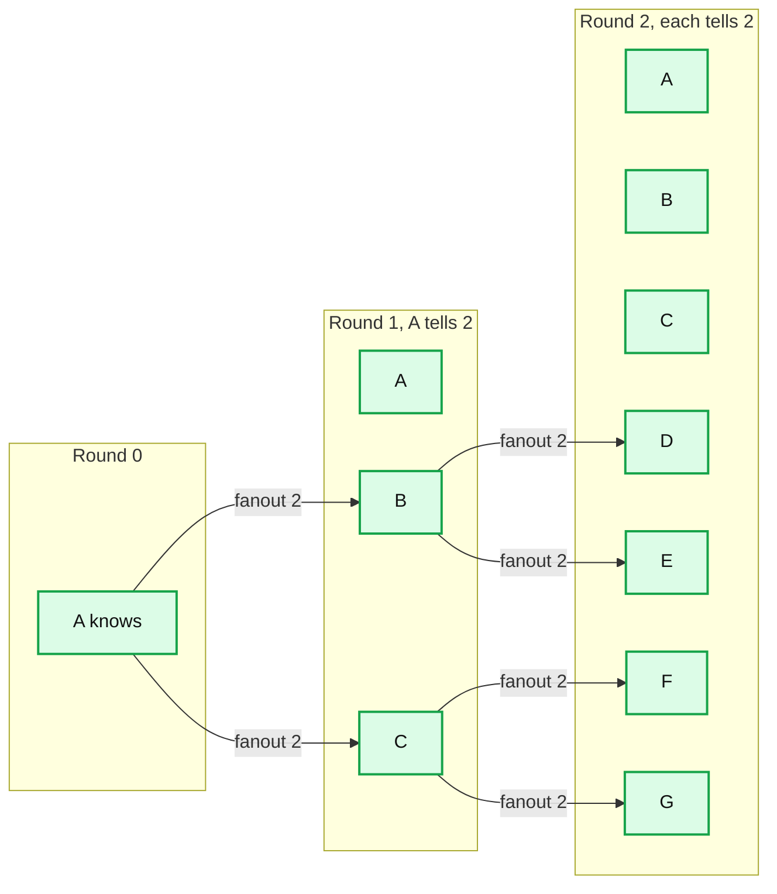
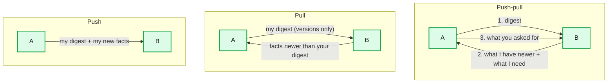
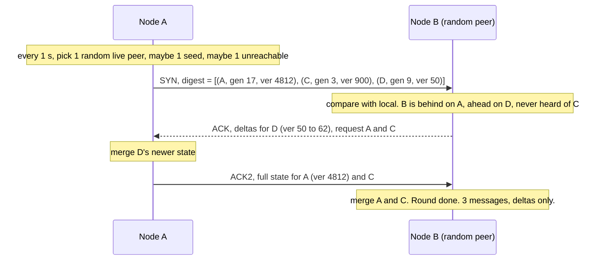
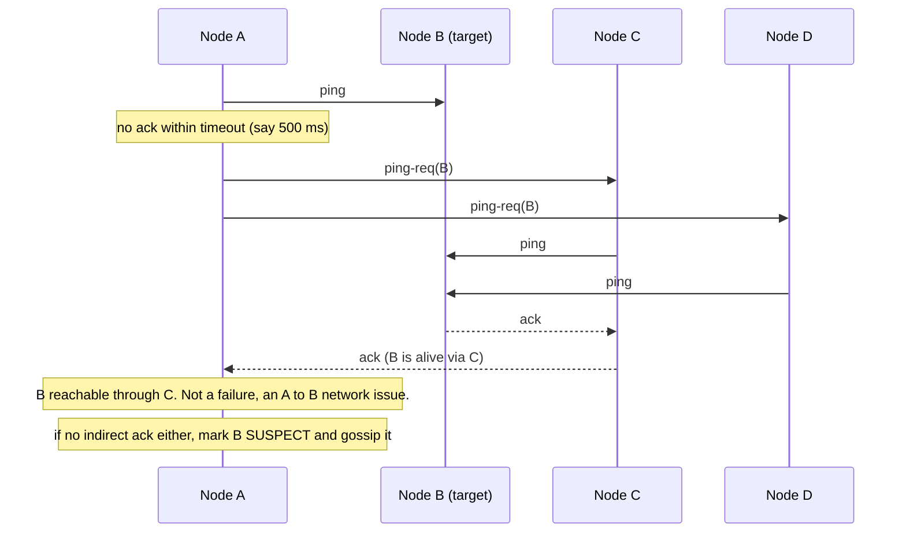
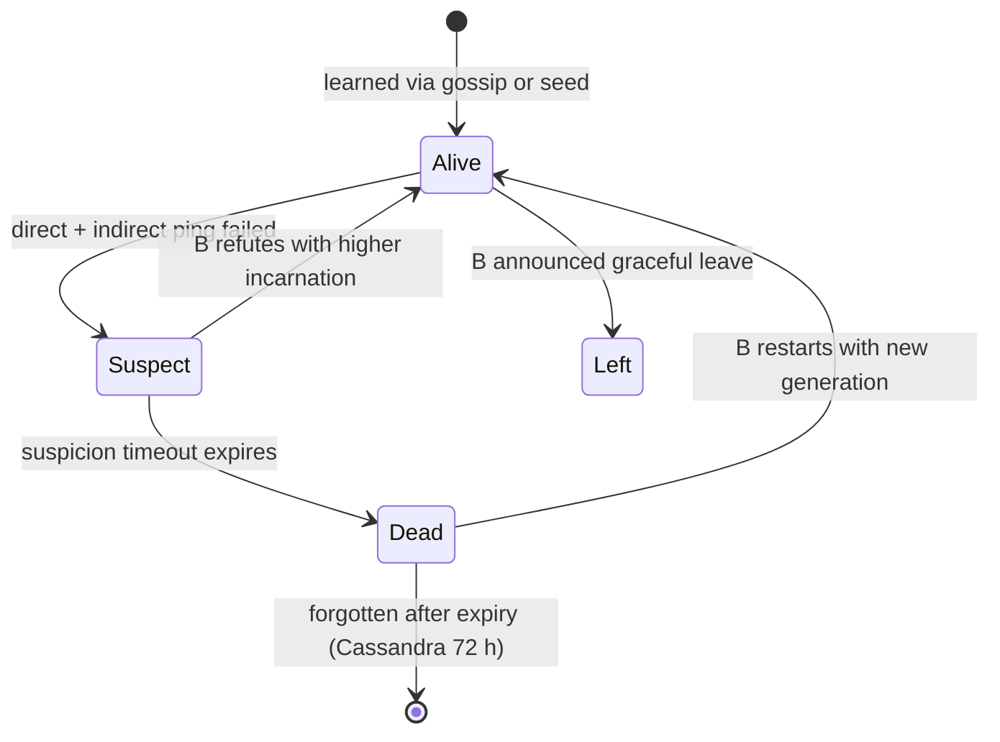
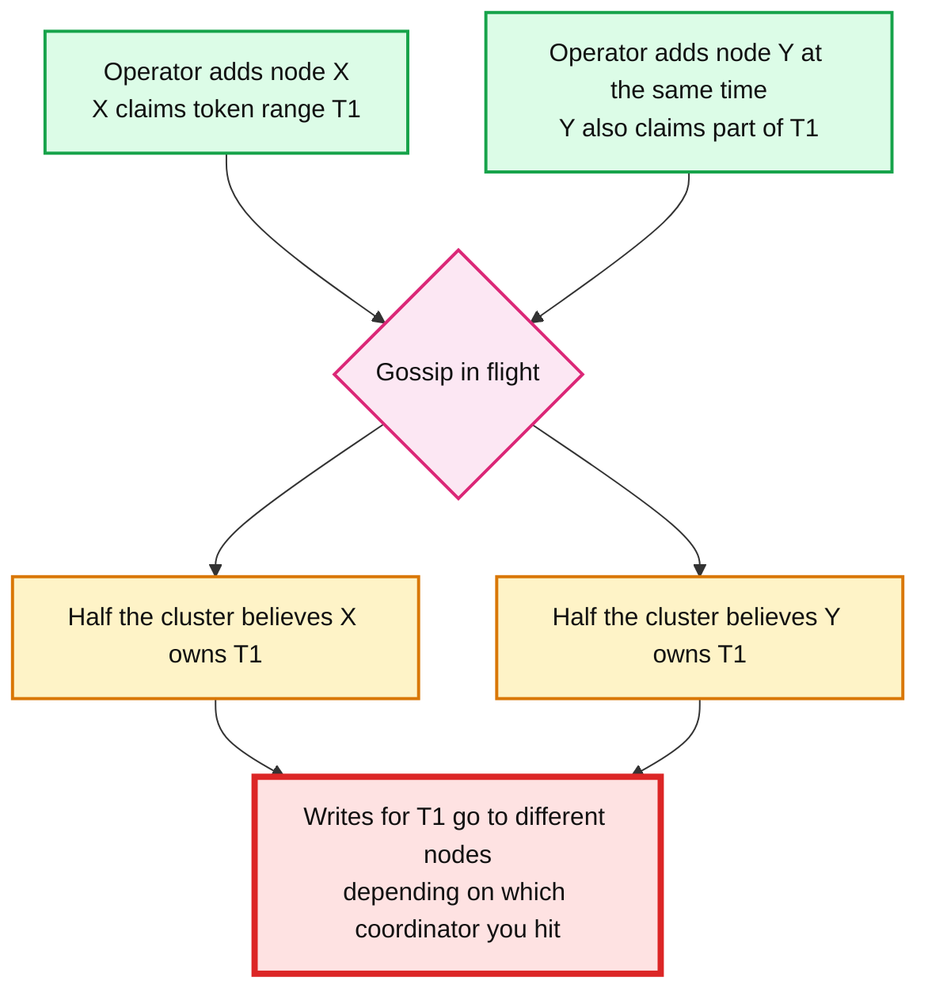

# Concept: Gossip Protocol

> One-liner: Gossip spreads information across a cluster the way a rumor spreads through a crowd: every node periodically picks a few random peers and swaps what it knows, so any update reaches all N nodes in about `log(N)` rounds with no coordinator and constant work per node.

Depth target: high-level, same as [raft.md](raft.md) and [paxos.md](paxos.md). Gossip is the opposite design choice from those two. Consensus buys agreement at the cost of a leader and a quorum. Gossip gives up agreement to get scale and no single point of failure.

---

## 1. Mental model

- Informed nodes grow geometrically: 1, 3, 7, 15, ... With fanout `f` and `N` nodes, everyone knows after roughly `log_f(N)` rounds plus a small tail. 1000 nodes, fanout 3, 1 s rounds: about 7 to 10 s.
- Each node does a fixed amount of work per round regardless of `N`. That is the scaling win.
- No leader. No quorum. Any node can be the source of any update. Any node can die at any time and the rumor still gets through because there are many paths.

**Why gossip exists.** Demers et al. at Xerox PARC, 1987, "Epidemic Algorithms for Replicated Database Maintenance". They needed to keep hundreds of database replicas in sync over an unreliable network and found that deterministic broadcast either overloaded one node or fell over when any node died. Random pairwise exchange is robust to both.

---

## 2. What gets gossiped

Gossip is a **transport for small, versioned facts**. It is not for data. It carries:

| Payload | Example | Who uses it this way |
|---|---|---|
| **Membership** | "Node D joined at 10:42, node F is dead" | Every gossip system |
| **Liveness / heartbeats** | "A's heartbeat counter is now 4812" | Cassandra, Riak, Akka |
| **Per-node metadata** | tokens owned, datacenter, rack, schema version, load, status | Cassandra, ScyllaDB, Redis Cluster (slot map) |
| **Small config** | feature flags, leader hint, epoch | Consul (via Serf), Redis Cluster |
| **Aggregates** | "cluster-wide average CPU", computed by pairwise averaging | Research, monitoring systems |
| **Transactions / blocks** | "here is a new block hash" | Bitcoin, Ethereum peer-to-peer layers |

Rule of thumb: if the fact is bigger than a few KB or changes more than a few times a second, it does not belong in gossip. Gossip the *pointer* (a version or a hash) and fetch the payload out of band.

---

## 3. The three exchange styles

| Style | Fast when | Slow when | Notes |
|---|---|---|---|
| **Push** | Few nodes know the update (early phase) | Almost everyone knows it. The last few uninformed nodes are found only by luck. | Simple. Wasteful at the end. |
| **Pull** | Almost everyone knows it (late phase). An uninformed node asking a random peer almost surely finds it. | Early, when nobody has it to give. | Needs a digest so the reply is small. |
| **Push-pull** | Both phases | Costs 3 messages per pair instead of 1 or 2 | What Cassandra (SYN, ACK, ACK2) and most production systems do. Converges in `O(log log N)` extra rounds after the push phase. |

Two more knobs every implementation has:

- **Anti-entropy vs rumor mongering.** Anti-entropy: exchange your *entire* state digest every round. Slow but guaranteed to converge. Rumor mongering: only forward *hot* new facts, and stop forwarding a fact after `k` peers say "already knew". Fast, low bandwidth, but a rumor can die before reaching everyone (with small probability). Most systems run rumor mongering for speed and anti-entropy underneath as the safety net.
- **Fanout.** How many peers per round. 1 to 3 is typical. Higher fanout converges faster and costs bandwidth linearly.

---

## 4. A gossip round in detail (Cassandra style)

**Versioning is the whole trick.** Each fact is `(nodeId, generation, version, value)`:

- `generation`: bumped when the node restarts (typically boot timestamp). Beats every version from an older incarnation.
- `version`: monotonic counter per node, bumped on every state change and every heartbeat.
- Merge rule: higher generation wins, then higher version. No vector clocks needed because **only the owning node writes its own state**. That single-writer rule is what keeps gossip merges conflict-free.

If you need multiple writers per key (rare in gossip) you are back to vector clocks or [CRDTs](crdt.md), and it is usually a sign the fact does not belong in gossip.

---

## 5. Failure detection

Gossip's second job. Every node forms its **own opinion** about every other node's liveness from how regularly it hears about it. There is no central truth.

Two families:

**Heartbeat + accrual (Cassandra, Akka).** Each node's gossip state carries a heartbeat counter. Every receiver records the arrival times and fits a distribution. Instead of a boolean "dead after T seconds", the phi accrual detector outputs a *suspicion level* `phi`, and the app picks a threshold (Cassandra default `phi_convict_threshold: 8`). Adapts to a slow network automatically.

**SWIM (Consul, memberlist, Serf, ScyllaDB partly).** Scalable Weakly-consistent Infection-style Membership, 2002. Separates *detection* from *dissemination* and uses indirect probes to avoid false positives.

Membership lifecycle as one node sees another:

Key SWIM ideas:

- **Suspect before dead.** A suspicion is gossiped. The suspected node, if alive, hears it and refutes with a higher **incarnation number**. Only its own refutation counts. This kills most false positives from GC pauses and transient partitions.
- **Indirect probing** through `k` random helpers turns "I cannot reach B" into "nobody can reach B".
- **Piggybacking.** Membership updates ride on the ping and ack messages. No separate broadcast.
- **Lifeguard** (HashiCorp, 2017) adds: a node that is itself slow to respond lowers its own confidence in its suspicions (local health), and suspicion timeouts shrink as more independent nodes confirm the suspicion. Cut false positives roughly 20x in Consul.

**The property you must say out loud in an interview:** failure detection by gossip is **weakly consistent**. Node A can think B is dead while C thinks B is alive, for a while or forever. Anything that needs a single truth about liveness (leader election, lock ownership, "who owns this shard") cannot be built on gossip alone. It needs consensus on top.

---

## 6. Peer selection and bootstrap

**Seeds.** A new node has to talk to *someone*. Every system has a static list of seed nodes (Cassandra `seed_provider`, Consul `retry_join`, Redis `CLUSTER MEET`). Seeds are only special at join time. Once a node has a membership list it gossips like everyone else. Losing all seeds does not break a running cluster, it only blocks new joins.

**Random peer choice.** Uniform random over the known live list is the baseline. Real systems bias it:

- Cassandra: 1 random live node, plus a seed with probability that keeps seeds well informed, plus 1 unreachable node so dead nodes are re-probed.
- SWIM: round-robin over a shuffled list, so every node is probed within one cycle of `N` rounds. Bounds the worst-case detection time, which pure random does not.
- Large or WAN clusters: **partial views** (Cyclon, HyParView, Scamp). Each node knows only `log(N)` peers and gossips the peer list itself. Needed once `N` is in the tens of thousands, where a full membership table per node costs too much.

**Topology awareness.** In multi-datacenter setups, gossip mostly locally and cross-DC with a lower rate, otherwise the WAN link carries `N x fanout` messages a second. Cassandra and Consul both do this.

---

## 7. Convergence and consistency

What gossip guarantees:

| Property | Holds? | Notes |
|---|---|---|
| Every update eventually reaches every live node | Yes, with anti-entropy | Probabilistic with pure rumor mongering (a rumor can die early), certain with periodic full digests |
| Bounded time to converge | Roughly `O(log N)` rounds | Tail depends on message loss and fanout |
| All nodes see updates in the same order | **No** | Each node merges in arrival order. Use versions so order does not matter. |
| All nodes agree at any given instant | **No** | Eventual only. Two nodes can disagree for seconds, and during a partition, indefinitely. |
| Survives any minority or majority of nodes dying | Yes | There is no quorum to lose. Each partition keeps gossiping internally. |

The classic failure this produces:

This is real. It is why Cassandra's docs say "never run two topology changes at once", and why Cassandra 5.1/6.0 moves ring ownership and schema onto a Paxos-backed log (Transactional Cluster Metadata, CEP-21) while keeping gossip only for liveness. Same lesson everywhere: **gossip for the facts that tolerate disagreement, consensus for the facts that do not.**

---

## 8. Failure modes and what happens

| Failure | What gossip does | Client-visible effect |
|---|---|---|
| A node dies | Peers stop seeing its heartbeat advance, mark it suspect then dead, gossip that. Detection: seconds. | Requests routed to it fail until its peers update. Coordinators retry elsewhere. |
| Network partition | Each side keeps gossiping. Each side marks the other side dead. | Both sides stay up (AP). Diverging state until heal, then higher versions win on merge. |
| Node restarts fast | New generation beats all old versions. Peers accept the new incarnation immediately. | Brief flap. |
| GC pause or slow node | Heartbeat stalls, peers may falsely mark it dead. Node refutes on wake. | Flapping, spurious rerouting. Phi accrual or Lifeguard reduce this. |
| Stale seed list | Running cluster unaffected. New nodes cannot join. | Silent until the next scale-out. |
| Gossip storm | A fact with a large payload or a bug that bumps versions every round makes every exchange full-size. | CPU and bandwidth spike on every node, other work starves. |
| Zombie / ghost node | A removed node's state keeps circulating because some peer never saw the removal, or a decommissioned node comes back and re-announces itself. | Phantom entries in the ring, connection attempts to a dead IP. Cassandra tombstones removed nodes for 72 h for this reason. |
| Two concurrent topology changes | Divergent ownership views (section 7). | Misrouted writes, data in the wrong place. |

---

## 9. Where you meet gossip

| System | What is gossiped | Flavor |
|---|---|---|
| Cassandra, ScyllaDB | Membership, tokens, schema version, load, heartbeat | Push-pull every 1 s, phi accrual detector |
| Amazon Dynamo, Riak | Ring membership and partition ownership | Anti-entropy, seeds |
| Consul, Nomad, Vault (via Serf / memberlist) | Membership and health of every agent | SWIM + Lifeguard, then Raft on top for the catalog |
| Redis Cluster | Slot ownership, node roles, failure reports | Bus on port +10000, PING/PONG carrying a few random nodes' state |
| Akka Cluster | Membership and leader determination | Push-pull with vector clocks, phi accrual |
| Bitcoin, Ethereum | Transactions and blocks | Flooding with inventory digests, then fetch |
| CockroachDB | Node liveness hints, store capacity, some config | Gossip for hints, Raft for truth |
| Kubernetes (not) | Uses etcd + watch, not gossip. Worth saying: gossip is not the only answer. | |

The pattern in the mature systems: gossip for **liveness and hints**, consensus for **ownership and config**. Consul is the cleanest example. Serf gossips who is alive; Raft decides what the catalog says.

---

## 10. Gossip vs the alternatives

| | Gossip | Consensus (Raft / Paxos) | Central registry (ZooKeeper, etcd watch) |
|---|---|---|---|
| Agreement | Eventual, probabilistic | Linearizable | Linearizable |
| Coordinator | None | Leader | The registry |
| Per-node cost | `O(fanout)` per round, constant | `O(N)` on the leader | `O(1)` per client, `O(N)` on the registry |
| Convergence | `O(log N)` rounds | 1 RTT to a majority | 1 RTT + watch latency |
| Survives partition | Yes, both sides run | Only the majority side | Only the side with the registry |
| Best for | Membership, liveness, small metadata, huge N | Ownership, locks, config | Same as consensus, when you want it as a service |

---

## 11. Trade-offs

| Gain | Cost |
|---|---|
| No SPOF, no leader, no quorum. Any subset of nodes keeps working. | No agreement. Two nodes can hold different truths at the same instant. |
| Constant per-node cost. Scales to thousands of nodes. | Total cluster traffic is `N x fanout` messages per round, all the time, even when nothing changes. |
| Converges in `O(log N)` rounds, self-healing on any failure | Convergence is probabilistic and has a tail. "Usually 5 s" is not "always 5 s". |
| Dead simple to implement and reason about locally | Very hard to reason about globally. Ordering, staleness and ghost entries bite in production. |
| Per-node failure detection adapts to real network conditions | Per-node opinions differ. You cannot build "exactly one owner" on it. |
| Works over WAN and flaky networks | Cross-DC gossip needs rate limiting or it saturates the link. |

**What a Staff answer refuses to build:** shard ownership, leader election or locks on gossip alone (put a consensus log under those), gossip of large payloads (gossip the version, fetch the body), and a home-grown SWIM when `memberlist` exists.

---

## 12. Numbers worth memorizing

- Convergence: about `log_f(N)` rounds. `N = 1000`, `f = 3`, 1 s rounds: 7 to 10 s.
- Cassandra: gossip every **1 s**, to **1** random live peer (+ maybe a seed, + maybe an unreachable), `phi_convict_threshold` **8**, dead node state kept **72 h**.
- SWIM: probe period ~1 s, indirect probe helpers `k = 3`, suspicion timeout a few probe periods. Consul default `probe_interval` 1 s LAN, 5 s WAN.
- Redis Cluster: `cluster-node-timeout` **15 s** default before a primary is flagged `PFAIL`, majority of primaries to escalate to `FAIL`.
- Per-message payload: keep under a few KB. Digests are `(nodeId, generation, version)` per node, so `N x ~24 bytes`.
- Bandwidth per node per round: `fanout x (digest + deltas)`. Constant in `N` once deltas are small.

---

## 13. Interview soundbite

> "Gossip is epidemic broadcast: every second each node swaps versioned state with a couple of random peers, so an update reaches everyone in log N rounds with no leader and constant cost per node. It gives you membership and liveness at any scale, but only eventually and only as per-node opinions. So I use gossip for who is alive and what the hints are, and I put ownership, locks and config on a consensus log. Consul is the textbook split: SWIM for membership, Raft for the catalog."

Follow-ups an interviewer will ask:

1. How do you avoid conflicts when merging gossip state? (Single writer per key, generation + version. Section 4.)
2. How long until a dead node is detected, and can two nodes disagree? (Seconds, and yes, permanently during a partition. Section 5.)
3. Why not build leader election on gossip? (Weakly consistent liveness. Section 5, last paragraph.)
4. Push or pull? (Push-pull. Push is fast early, pull is fast late. Section 3.)
5. What breaks at 10k nodes? (Full membership tables and `N x fanout` traffic. Partial views. Section 6.)
6. What is the seed node's role after bootstrap? (None, except a slight bias so it stays well informed. Section 6.)
7. What happens if two operators change topology at once? (Section 7. The Cassandra hole, fixed by moving ownership onto consensus.)

Related: [raft.md](raft.md), [paxos.md](paxos.md), `popular_systems_deepdive/cassandra/cassandra-06-membership-gossip.md` (the source-verified version of section 4 and 5), `hld/kv-store-wal/`.
