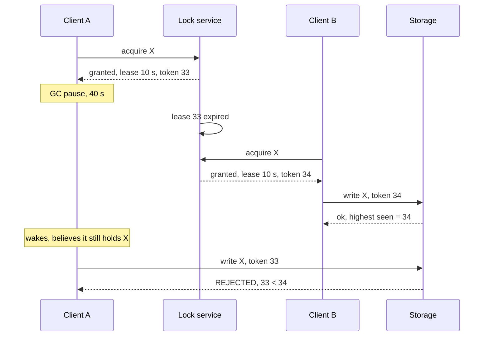
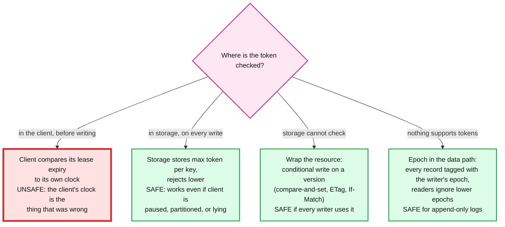
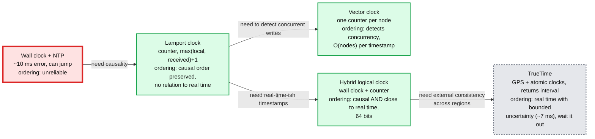
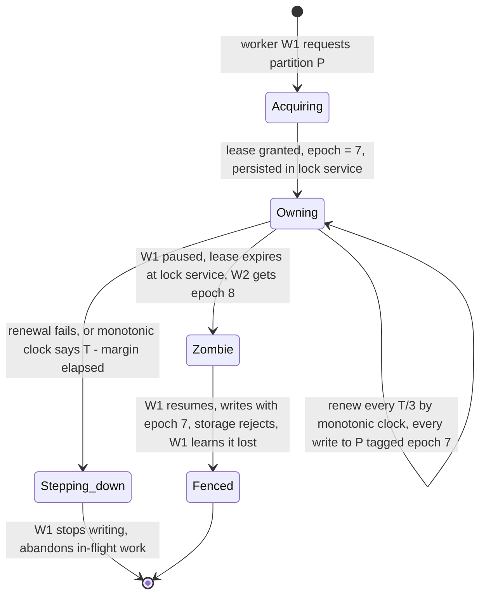

# Concept: Leases, Fencing Tokens, and Clocks

> One-liner: a lease is a lock with an expiry, so a dead holder cannot block forever; a fencing token is a number that increases with every grant, checked by the storage layer, so a holder whose lease expired without it noticing (GC pause, network partition) cannot write after a new holder has taken over. Clocks are why both are needed: no process can know the current time or how long it has been paused, so every protocol must be safe when a node's sense of time is wrong.

Depth target: high-level, same as [raft.md](raft.md) and [replication-and-quorums.md](replication-and-quorums.md). It is the "what if the old leader wakes up" question in the lock service, file system, and job scheduler problems, and the reason single-owner designs are safe.

---

## 1. Mental model

Node A holds a lock on resource X. A pauses (garbage collection, VM migration, a stuck disk) for 40 seconds. The lock service times A out and gives the lock to B. A wakes up, does not know 40 seconds passed, and writes to X. Two writers, one lock.

- **Lease:** a lock that expires. Without expiry, a crashed holder blocks everyone forever. With expiry, a *paused* holder can be replaced while it still thinks it holds the lock.
- **Fencing token:** a monotonically increasing number handed out with each lease. Storage remembers the highest token it has seen and rejects lower ones. The old holder's write bounces.
- **The key insight:** the lock service cannot stop the old holder from *trying* to write. Only the thing being written to can stop it. **Fencing moves the safety check from the lock holder to the resource.**

**Why this matters more at Staff level.** Senior answers say "use a distributed lock". Staff answers say the lock alone is unsafe, name the token, say where it is checked, and explain why the check must be at the storage layer and not in the client.

---

## 2. Leases

A lease is granted for a duration `T`. The holder must renew before `T` elapses or lose it. The grantor considers the lease dead at `T` and hands it out again.

| Parameter | Typical | Trade |
|---|---|---|
| Lease duration `T` | 5 to 30 s for locks, 1 to 10 s for leader leases, 60 s for GFS chunk leases | Short: fast recovery from a dead holder, more renewal traffic, more false expiries under load. Long: slow recovery, fewer false expiries. |
| Renewal interval | `T / 3` | Two missed renewals before expiry. |
| Grace on the holder side | Holder stops using the lease at `T - margin` by its own clock | The holder's clock runs at most `drift` faster than the grantor's. Margin must cover drift plus one round trip. |

**Both sides measure time, and they disagree.** The grantor starts its timer when it *sends* the grant. The holder starts when it *receives* it. Network delay means the holder's view of the lease is always shorter, which is the safe direction. Clock drift (100 to 500 ppm on commodity hardware, that is 0.5 s per hour at the high end) is the unsafe direction and must be covered by the margin.

**Leases as the basis of leadership.** Raft, Chubby, ZooKeeper, and every "single leader" system uses a lease: the leader is only leader while its lease from the majority is fresh. A leader that cannot renew (partitioned from the majority) must **step down by its own clock** before the majority can elect a new one. This is why Raft's election timeout is longer than the heartbeat interval: the old leader's self-imposed step-down happens first, assuming clocks drift within bounds. If clocks are wrong by more than that, two leaders exist briefly, and only fencing (the term number) makes that safe.

**Leases as a read optimisation.** A leader with a valid lease can serve reads without a quorum round trip because no other leader can have committed a write in the meantime. Raft's "lease-based reads", Spanner's leader leases, CockroachDB's range leases. The safety argument depends entirely on clock drift bounds, which is why these systems say "assume drift below 500 ms" in their docs and why Spanner built TrueTime to remove the assumption.

---

## 3. Fencing tokens

The token is a counter the lock service increments on every grant. It must be:

- **Monotonic** across all grants of that lock, including after the lock service restarts (persist it, or derive it from a consensus log index).
- **Carried** on every write the holder makes.
- **Checked** by the storage layer: reject any write whose token is below the highest token that storage has accepted for that resource.

Systems that do this, under other names:

| System | Token name | Checked by |
|---|---|---|
| Raft, Paxos | Term, ballot number | Followers reject `AppendEntries` from a lower term |
| ZooKeeper | `zxid`, and `cversion` on the lock znode | Every write carries the session's view; stale sessions get `SessionExpired` |
| Chubby | Sequencer (lock name, mode, generation) | Servers validate the sequencer with Chubby before honouring a request |
| Kafka | Leader epoch (partition), producer epoch (transactional producer) | Followers and brokers reject requests from an older epoch. A zombie producer with an old epoch gets `ProducerFenced`. |
| GFS | Chunk version number, incremented on each lease grant | Chunkservers with a stale version are excluded from reads and writes |
| HDFS | Generation stamp on each block | Datanodes with an old generation stamp are treated as stale replicas |
| Kubernetes | `resourceVersion` on every object | `UPDATE` with a stale version fails with 409 |
| S3, Azure Blob, GCS | ETag, `If-Match`, `If-None-Match` | Conditional PUT rejects a write over a changed object |
| DynamoDB, Cassandra LWT | Condition expression, `IF` clause | Compare-and-set at the row |
| Job scheduler (`hld/distributed-job-scheduler/`) | Partition epoch | Every task state write includes the worker's epoch; a stale worker's write is rejected |

The token does not need to be a lock service counter. **Any monotonic number that changes on every ownership transfer works**: a Raft log index, a partition epoch, an object version. What matters is that storage checks it.

---

## 4. Clocks: why none of this is simple

A computer has two clocks and neither is what you want.

| Clock | What it gives | What it is for | Failure |
|---|---|---|---|
| **Time-of-day** (`gettimeofday`, `System.currentTimeMillis`) | Wall clock, synchronised by NTP | Timestamps in logs, user-facing time | Jumps forward or backward when NTP corrects it. Drifts 100 to 500 ppm between corrections. NTP over the public internet: 10 to 100 ms error. |
| **Monotonic** (`CLOCK_MONOTONIC`, `System.nanoTime`) | Elapsed time since an arbitrary point, never goes backwards | Timeouts, lease durations, measuring latency | Not comparable across machines. Still stops during a VM pause, so "40 s passed" is invisible to the paused process. |

Rules:

- **Timeouts and leases use the monotonic clock.** A wall-clock timeout can fire early or never when NTP steps the clock.
- **Never compare wall-clock timestamps from two machines to order events.** 10 ms of NTP error is 10 ms of writes that could be ordered wrong. Last-writer-wins by wall clock silently drops the newer write when the older writer's clock is ahead. This is Cassandra's LWW and the reason it is a data-loss mode.
- **A process cannot know it was paused.** GC (seconds, tens of seconds with a large heap), VM live migration, swap, a `SIGSTOP`, a laptop lid. After the pause it resumes mid-instruction with no signal. Every "I checked the time before writing" argument fails here.

| Clock | How | Gives | Used by |
|---|---|---|---|
| **Lamport** | Each node keeps a counter. Increment on every event. On receive, `counter = max(local, received) + 1`. | If A caused B, `ts(A) < ts(B)`. The converse is false: `ts(A) < ts(B)` does not mean A caused B. | Total ordering for mutual exclusion, version numbers |
| **Vector** | A counter per node, `[n1, n2, n3]`. Increment own slot. On receive, element-wise max then increment own. | Detects concurrency: neither vector dominates means the writes were concurrent and must be merged. | Dynamo (original), Riak siblings, [crdt.md](crdt.md) |
| **Hybrid logical (HLC)** | 48 bits of wall clock plus 16 bits of counter. Advances with wall clock when it moves forward, with the counter when it does not. | Causal order, and timestamps within drift of real time, in one 64-bit number. | CockroachDB, YugabyteDB, MongoDB |
| **TrueTime** | GPS and atomic clocks in every datacenter. `now()` returns `[earliest, latest]`, ~7 ms wide. | Commit waits until `latest` has passed, so any transaction that starts after sees a later timestamp. External consistency. | Spanner. AWS has a public version (Amazon Time Sync with clock-bound). |

---

## 5. Putting it together: a safe single-owner design

The pattern that makes job schedulers, file system masters, and partition owners safe. It appears in `hld/distributed-job-scheduler/` as "leased partitions with epochs".

Checklist for the design:

1. **One owner per unit of work** (partition, chunk, job), granted by a lease from a consensus-backed lock service (ZooKeeper, etcd, Chubby, a Raft group).
2. **Epoch persisted with the grant.** The lock service increments it atomically with the ownership record.
3. **Holder renews on a monotonic clock** at `T/3`, and **voluntarily steps down** at `T - margin` if renewal has not succeeded.
4. **Every write tagged with the epoch**, and **storage rejects a stale epoch**. This is the line that makes it safe. Steps 1 to 3 are about liveness; this one is about correctness.
5. **Readers ignore records from a lower epoch** when the storage layer cannot reject at write time (append-only logs).
6. **New owner reads the previous owner's state through the epoch**, never through "whatever is in memory on the old node".

Say out loud: **"the lease makes it live, the epoch makes it safe, and the check is in storage because the client's clock is exactly the thing I cannot trust."**

---

## 6. Where you meet it

| System | Lease | Fencing | Clock note |
|---|---|---|---|
| **Chubby, ZooKeeper, etcd** | Session lease, 5 to 10 s, ephemeral nodes deleted on expiry | Sequencer / `zxid` / lease ID in every request | Client library stops at `T - margin`; ZooKeeper's `SessionExpired` is delivered by the client's own timer |
| **Raft** | Leader lease from the majority via heartbeats | Term number on every message | Election timeout 150 to 300 ms; leader steps down if it cannot reach a majority |
| **GFS** | Primary chunkserver holds a 60 s lease per chunk, renewed by heartbeat | Chunk version number, incremented on each grant | Master waits out the old lease before regranting if the primary is unreachable |
| **Kafka** | Controller and partition leaders via ZooKeeper (or KRaft) | Leader epoch, producer epoch, `ProducerFenced` | Zombie producer on a transactional ID is fenced on the next `InitProducerId` |
| **Spanner** | Paxos leader lease, 10 s | Paxos ballot | TrueTime commit wait, ~7 ms |
| **CockroachDB** | Range lease, epoch-based (node liveness) | Lease sequence number | HLC, max drift 500 ms, node crashes if it detects more |
| **Kubernetes** | Leader election via `Lease` object, 15 s | `resourceVersion` on the lease and on every object | Controllers are level-triggered so a duplicate leader does bounded harm |
| **DynamoDB lock client, Redis Redlock** | TTL on the lock item | DynamoDB: conditional write on a record version. Redlock: **none**, which is the well-known critique. | Redlock relies on bounded clock drift and pause; Kleppmann's 2016 analysis shows a GC pause breaks it |
| **Hadoop HDFS** | NameNode lease per file being written, 60 s soft, 1 h hard | Generation stamp per block | Lease recovery on expiry truncates the last block to the shortest consistent replica |
| **Cassandra LWT** | None (Paxos per row) | Ballot | Wall-clock timestamps for LWW elsewhere, the data-loss trap |

---

## 7. Practical additions every real implementation has

| Addition | Problem it fixes |
|---|---|
| **Monotonic clock for all timeouts** | NTP step makes a lease expire instantly or never. |
| **Renewal at `T/3`** | One missed renewal expires the lease. |
| **Voluntary step-down at `T - margin`** | Holder keeps working past expiry by its own view. |
| **Epoch persisted in the lock service, not in memory** | Lock service restart resets tokens, old holder's token becomes valid again. |
| **Token in every write, checked by storage** | The only step that survives a pause. |
| **Epoch in append-only records, filtered on read** | Storage that cannot reject writes. |
| **Max clock offset check at startup and periodically** | Node with a wildly wrong clock joins and breaks lease reasoning. CockroachDB kills itself above 500 ms. |
| **Lease wait-out before regrant when the holder is unreachable** | Grantor cannot tell "dead" from "partitioned". GFS waits the full 60 s. |
| **HLC instead of wall clock for event timestamps** | Cross-node ordering by wall clock drops writes. |
| **Level-triggered reconciliation for controllers** | A brief double leader does duplicate but idempotent work. |

---

## 8. Failure modes and what happens

| Failure | What happens | Fix |
|---|---|---|
| Lock without expiry, holder dies | Resource locked forever. Manual intervention. | Lease. |
| Lease, no fencing, holder pauses | Two writers. **Data corruption.** The canonical bug. | Fencing token checked by storage. |
| Fencing checked by the client only | Client's clock was wrong, so its check is wrong. | Check in storage. |
| Token resets on lock service restart | Old holder's token looks fresh. | Persist the counter, or derive from consensus log index. |
| Wall clock for lease timeout | NTP step forward: every lease expires at once, mass failover. Step backward: leases never expire. | Monotonic clock. |
| Lease longer on holder than grantor | Holder writes after grantor regranted. | Holder uses `T - margin`, margin covers drift plus RTT. |
| LWW by wall clock, skewed clocks | Older write wins, newer write silently lost. | HLC, or vector clocks with merge, or a single writer per key. |
| Old leader not stepping down during partition | Serves stale reads (with lease reads) or accepts writes that will be discarded. | Step down by own clock before election timeout; term number fences writes. |
| Redlock-style multi-node TTL lock | Safe only if no pause exceeds the TTL. Pauses do. | Add a fencing token, or use a consensus-backed lock service. |
| Grantor regrants immediately on missed heartbeat | Partitioned holder still active with valid (by its clock) lease. | Wait out the full lease duration before regranting. |
| Two leaders, controller not idempotent | Duplicate side effects, conflicting writes. | Fencing plus idempotent, level-triggered operations. |

---

## 9. Trade-offs

| Gain | Cost |
|---|---|
| Lease: automatic recovery from a dead holder. | False expiry under pause or load. Recovery is bounded below by the lease length. |
| Short lease: fast recovery. | More renewals, more false expiries, tighter clock assumptions. |
| Fencing token: correctness even when the holder is wrong about time. | Every write carries a token; every storage layer must check it. Storage that cannot check needs a wrapper. |
| Lease-based leader reads: no quorum round trip. | Safety depends on a drift bound. Violate it and reads are stale. |
| Lamport / HLC: causal ordering with 8 bytes. | No concurrency detection. |
| Vector clocks: detect concurrent writes. | `O(nodes)` per timestamp; must prune. Siblings pushed to the application. |
| TrueTime: external consistency with real timestamps. | GPS and atomic clocks in every datacenter, ~7 ms commit wait on every transaction. |
| Wall clock timestamps: human-readable, cheap. | Never safe for ordering or timeouts. |

**What a Staff answer refuses to build:** a distributed lock with no fencing token, a timeout on the wall clock, last-writer-wins by wall clock for anything that matters, a lease check that lives only in the holder, and Redlock for correctness-critical mutual exclusion.

---

## 10. Numbers worth memorizing

- Clock drift: **100 to 500 ppm**, up to 0.5 s per hour. NTP over the internet: 10 to 100 ms. In-datacenter PTP: sub-microsecond. TrueTime uncertainty: **~7 ms**, commit wait equal to it.
- GC pause on a large JVM heap: **seconds to tens of seconds**. VM live migration: similar. A lease of 10 s is not safe against either, which is the whole point of fencing.
- Lease durations: ZooKeeper session 5 to 10 s, Kubernetes 15 s, Raft leader lease ~1 s (election timeout 150 to 300 ms), GFS chunk lease 60 s, HDFS file lease 60 s soft / 1 h hard, Spanner leader lease 10 s.
- Renew at `T/3`. Step down at `T - margin`, margin ~ drift x T plus one RTT.
- CockroachDB max clock offset: **500 ms**, node exits above it.
- Fencing token size: 64 bits. Never wraps in practice.
- HLC: 48 bits wall clock (ms), 16 bits counter. Vector clock: 8 to 16 bytes per node, pruned at ~10 entries in Riak.

---

## 11. Interview soundbite

> "A lock alone is unsafe because the holder can pause, lose the lease without knowing, and write after someone else took over. So every grant comes with a fencing token, a number that only goes up, persisted in the lock service, and every write carries it. Storage remembers the highest token it has seen per resource and rejects anything lower. That check has to be in storage, not the client, because the client's clock is the thing that was wrong. Leases run on the monotonic clock, renew at a third of the duration, and the holder steps down by its own clock before the grantor would expire it. For ordering events across nodes I never use the wall clock; a hybrid logical clock gives causal order in 64 bits, and only Spanner-style TrueTime gives real-time order, at the cost of a 7 ms commit wait."

Follow-ups an interviewer will ask, in order of likelihood:

1. The leader pauses for a GC. Walk me through what happens. (Section 1 and 5.)
2. Where is the fencing token checked, and why there? (Section 3, storage.)
3. What if the storage system does not support tokens? (Section 3, CAS wrapper or epoch in records.)
4. How long is the lease and why? (Section 2, recovery time vs false expiry.)
5. Why can't the client just check the time before writing? (Section 4, pause is invisible.)
6. How do you order events across machines? (Section 4, Lamport, HLC, TrueTime.)
7. What is wrong with Redlock? (Section 6 and 8, no fencing.)
8. What happens when NTP jumps the clock? (Section 4 and 8, monotonic clock for timeouts.)
9. Why does Raft's leader step down on its own? (Section 2, lease from the majority.)

Related: [raft.md](raft.md) (term as the fencing token, election timeouts), [paxos.md](paxos.md) (ballot numbers), [replication-and-quorums.md](replication-and-quorums.md) (failover, where fencing prevents split brain), [crdt.md](crdt.md) (vector clocks and merge), [exactly-once.md](exactly-once.md) (idempotency makes double leaders survivable), `hld/distributed-job-scheduler/` (leased partitions with epochs), `hld/distributed-file-system/` (chunk leases and version numbers), `popular_systems_deepdive/kafka/` (leader and producer epochs), `popular_systems_deepdive/kubernetes/` (lease objects and `resourceVersion`).
