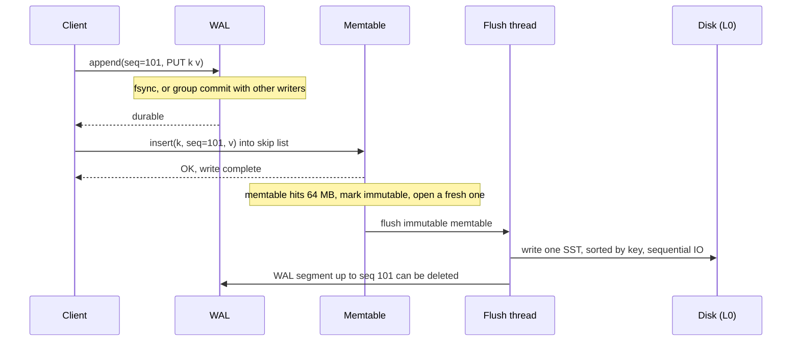
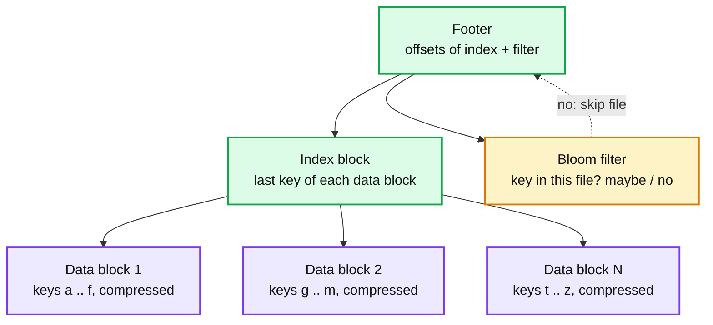
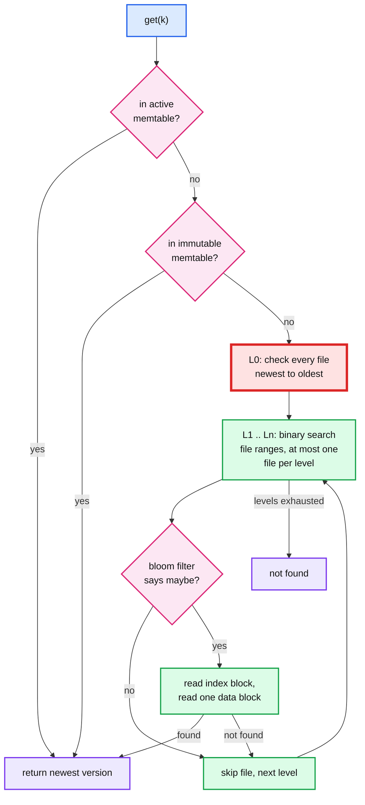
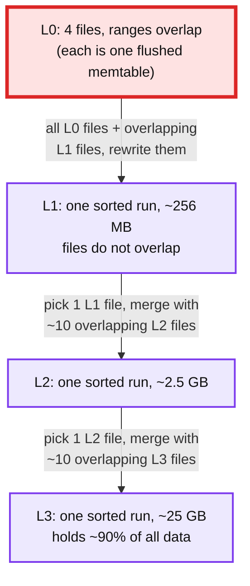
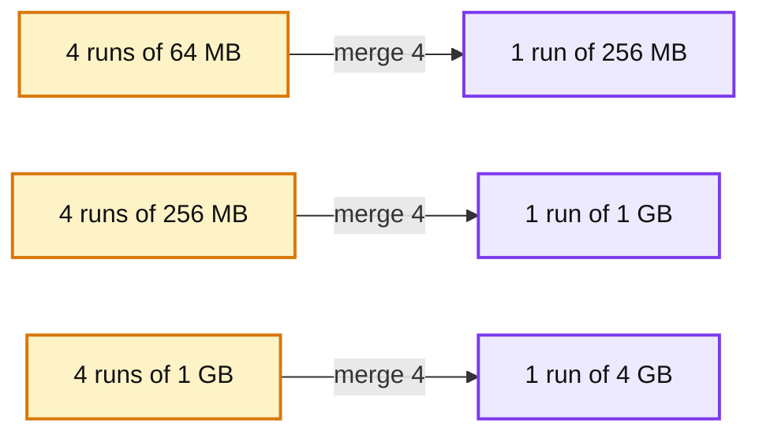
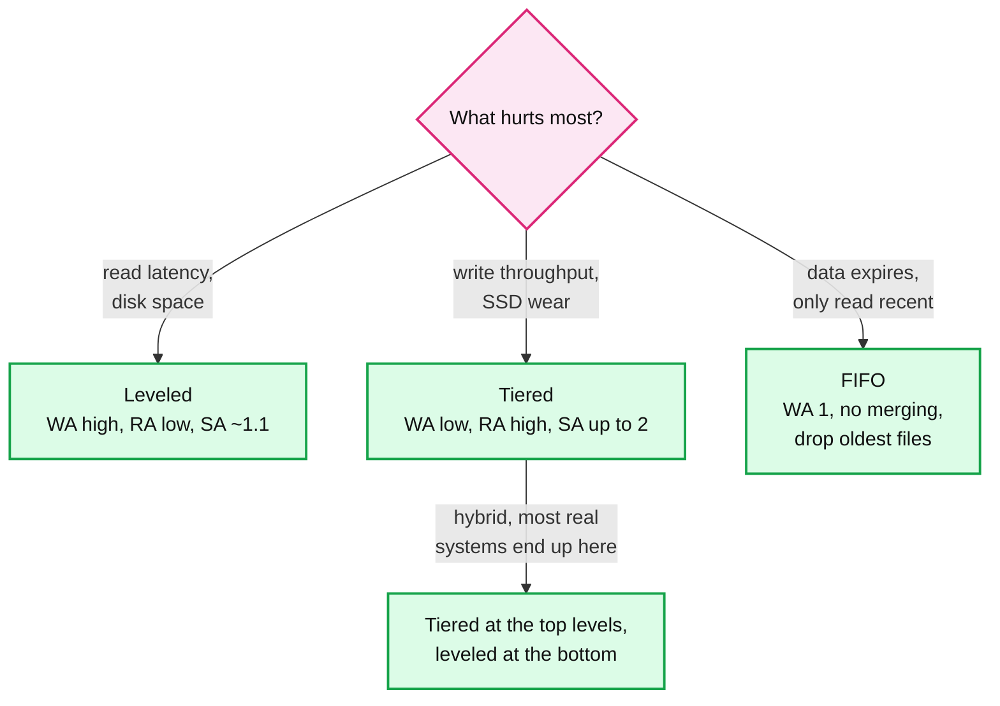
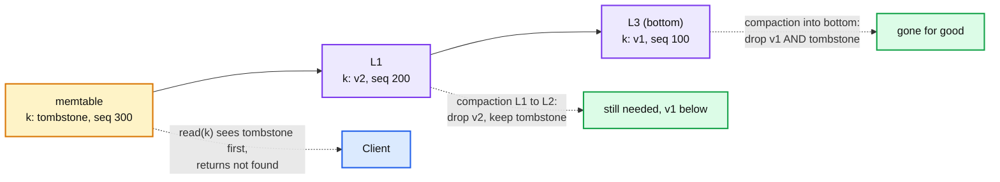
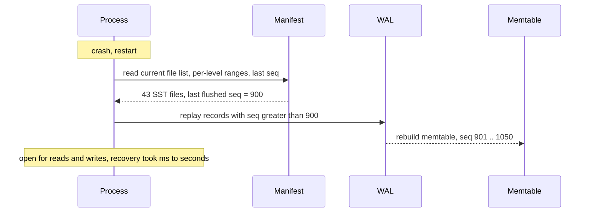

# Concept: LSM Tree (Log-Structured Merge Tree)

> One-liner: an LSM tree turns random writes into sequential ones by appending every write to a log and an in-memory sorted buffer, flushing that buffer to immutable sorted files on disk, and merging those files in the background so reads only have to check a few of them.

Depth target: high-level, same as [raft.md](raft.md). Every moving part is covered at the "explain it on a whiteboard" level. Source-verified depth for one real implementation lives in `popular_systems_deepdive/rocksdb/`.

---

## 1. Mental model

A B-tree updates data **in place**: find the page, modify it, write it back. Random 4 KB writes all over the disk. An LSM tree never updates in place. It **only appends**, then cleans up later. The price is that a key can now live in several places, so reads have to look in more than one spot and a background process has to keep that number small.

```mermaid
%% LSM tree in one picture: writes go to WAL + memtable, flush to L0, compaction pushes data down
flowchart LR
    C[Client]
    WAL[("WAL<br/>append-only log")]
    MT["Active memtable<br/>sorted, in RAM"]
    IMT["Immutable memtable<br/>being flushed"]
    L0["L0 SSTs<br/>overlapping key ranges"]
    L1["L1 SSTs<br/>sorted, 10x bigger"]
    L2["L2 .. Ln SSTs<br/>sorted, 10x per level"]

    C -->|"1. put(k, v)"| WAL
    WAL -->|"2. same write"| MT
    MT -->|"3. full, swap"| IMT
    IMT -->|"4. flush, sequential write"| L0
    L0 -->|"5. compaction"| L1
    L1 -->|"5. compaction"| L2
    C -.->|"get(k): memtables first,<br/>then L0 newest to oldest,<br/>then one file per level"| L2

    class C client
    class WAL,L0,L1,L2 store
    class MT,IMT cache
    class L0 critical
    classDef client   fill:#dbeafe,stroke:#2563eb,stroke-width:2px,color:#111
    classDef store    fill:#ede9fe,stroke:#7c3aed,stroke-width:2px,color:#111
    classDef cache    fill:#fef3c7,stroke:#d97706,stroke-width:2px,color:#111
    classDef critical fill:#fee2e2,stroke:#dc2626,stroke-width:4px,color:#111
```

- Three things exist: a **write-ahead log** (WAL) for durability, a **memtable** for fast sorted writes in memory, and **SSTables** (Sorted String Tables, "SST files") on disk that are written once and never modified.
- The newest version of a key is always the one found first when searching newest to oldest. Older copies are garbage until compaction removes them.
- L0 is red because it is the one place files overlap. Every read has to check every L0 file, and too many L0 files is the classic LSM failure mode (section 11).

**Why LSM exists.** O'Neil et al., 1996, for write-heavy workloads on spinning disks where sequential writes were 100x faster than random ones. It stayed relevant on SSDs for a different reason: SSDs also prefer large sequential writes (erase blocks), and LSM compresses better and wastes less space than a B-tree with half-empty pages. Bigtable (2006) and LevelDB (2011) made it the default for new storage engines.

---

## 2. The write path

Every write touches exactly two things before it is acknowledged: the WAL (disk, sequential) and the memtable (RAM, sorted). Nothing else. That is why LSM writes are fast: no read-before-write, no random IO.

The pieces, and why each exists:

| Piece | What it is | Why |
|---|---|---|
| **Sequence number** | A global counter stamped on every write. | Orders versions of the same key without wall clocks. Also the basis for snapshots (section 8). |
| **WAL** | Append-only file, one record per write (or batch). | Memtable is RAM. If the process dies, the WAL is replayed to rebuild it. |
| **Memtable** | Sorted in-memory structure, usually a **skip list**. Concurrent inserts, ordered iteration. | Keeps recent writes sorted so the flush can write a sorted file in one pass. |
| **Immutable memtable** | The old memtable after a swap. Read-only. | Writers continue into a fresh memtable while the flush runs. No stall. |
| **Flush** | Write the immutable memtable as one SST file to L0. | Turns many small random writes into one large sequential write. |

**Group commit.** One fsync per write caps throughput at disk fsync rate (roughly 1k to 10k per second on SSD). Real engines batch: the first writer becomes the leader, gathers everyone who arrived in the meantime, does one fsync, and wakes them all. Same trick as Raft batching.

**The durability dial.** `fsync` per write (safe), fsync per N ms (may lose the last few ms on a power cut), or no WAL at all (bulk loads, caches). This is the first trade-off an interviewer asks about.

---

## 3. What is inside an SST file

An SST is a sorted, immutable file. Because it is sorted and never changes, it can carry an index and a filter that are built once and never updated.

- **Data blocks**: 4 to 64 KB of sorted key-value pairs, compressed as a unit (Snappy, LZ4, ZSTD). Keys are prefix-compressed against their neighbour.
- **Index block**: one entry per data block. Binary search this to find which block to read. One disk read per lookup once the index is cached.
- **Bloom filter**: a bitmap built from every key in the file. Answers "definitely not here" with zero disk IO, or "maybe here" with ~1% false positives at 10 bits per key. This is what makes multi-level reads affordable.
- **Metadata**: smallest and largest key, sequence range, count. The engine keeps this per file in memory (the **manifest**) so it can skip files by key range without opening them.

Immutability is the whole point. No locks on read, trivially cacheable, safe to copy for backup while live, and deleting a file is the only way to free space.

---

## 4. The read path

A point read walks newest to oldest and stops at the first hit. A tombstone (section 6) counts as a hit.

Cost of a point read, worst case: `L0 file count + number of levels` filter checks, then typically **one** data block read from disk. With filters and a warm block cache, a miss on a 7-level tree costs zero disk reads and a hit costs one.

**Range scans are the weak spot.** A scan of `[a, f)` must open an iterator on every memtable, every L0 file, and one file per level, then **merge them** with a heap, dropping shadowed versions as it goes. Bloom filters do not help (they answer "is this exact key here", not "is anything in this range here"). Cost is proportional to the number of sorted runs, which is exactly what compaction keeps small. Prefix bloom filters help for scans with a known prefix.

**Block cache.** An LRU (or Clock) cache of uncompressed data blocks, shared across all files. Index and filter blocks are pinned or cached separately. Rule of thumb: enough cache for all index and filter blocks, plus as much of the hot data as you can afford. The OS page cache holds the compressed bytes underneath.

---

## 5. Compaction: the real design space

The write path and read path are fixed by the idea. **Compaction** is where every LSM engine spends its engineering, because it is the dial between three costs that cannot all be low at once.

Compaction merges several sorted files into new sorted files, keeps only the newest version of each key, and drops tombstones that have nothing left to hide. It runs in background threads and competes with client traffic for disk bandwidth and CPU.

### Leveled compaction (LevelDB, RocksDB default)

- Each level `L1+` is **one sorted run**: files have disjoint key ranges, so a lookup touches at most one file per level.
- Each level is ~10x the size of the one above. 7 levels cover terabytes.
- Trigger: a level's size exceeds its target. Pick one file, merge it with the ~10 files it overlaps in the next level, write the result, delete the inputs.
- **Cost**: each byte is rewritten ~10 times per level it passes through. Write amplification of 10 to 30 for the whole tree. **Benefit**: few sorted runs (L0 count + 6), so reads and scans are cheap, and space overhead is ~10%.

### Tiered / size-tiered / universal compaction (Cassandra STCS, RocksDB universal, HBase)

- Wait until there are N runs (usually 4) of roughly the same size, merge them into one run in the next tier. Runs in the same tier **overlap**.
- **Cost**: reads must check every run, typically 4 to 10 of them, and during a merge the inputs and output coexist on disk (2x space spike). **Benefit**: each byte is rewritten only once per tier, write amplification of ~4 to 10.

### Which one, when

Other triggers real engines add: **TTL compaction** (rewrite files older than N days to purge expired data), **tombstone-density compaction** (rewrite a file when more than X% of its entries are deletes), and **manual compaction** (operator forces a full merge before a bulk read job).

---

## 6. Deletes and tombstones

You cannot remove a key from an immutable file. So a delete is a **write** of a special marker, the **tombstone**, that shadows every older version.

Rules:

- A tombstone can only be dropped when compaction can **prove no older version exists below it**: at the bottom level, or when the key range does not overlap any lower file.
- Until then, deleted keys still cost disk space and read time. A workload that deletes a lot (queues, TTL caches) can end up with files that are 90% tombstones. Reads of missing keys walk through all of them.
- **Range tombstones** ("delete everything in `[a, f)`") exist for bulk deletes. One marker instead of millions.
- **SingleDelete** (RocksDB): if you promise a key was written exactly once, the tombstone and the value can cancel as soon as they meet, in any level.
- The replication version of this problem is Cassandra's `gc_grace_seconds`: a tombstone must outlive the repair window or a replica that missed the delete will resurrect the value.

---

## 7. Crash recovery

The only thing not on disk in sorted form is the memtable. Everything else is immutable files plus a manifest.

- The **manifest** is itself an append-only log of "add file X to level N, remove file Y". Every flush and compaction appends an edit and fsyncs. This is the LSM's metadata WAL.
- A crash mid-compaction leaves orphan output files on disk. They are not in the manifest, so they are ignored and deleted on startup. Compaction is naturally atomic.
- A torn WAL record at the tail is detected by a per-record checksum and truncated. Everything before it is kept.
- Recovery time is bounded by WAL size, which is bounded by memtable size times the number of unflushed memtables. Seconds, not minutes.

---

## 8. Snapshots and MVCC for free

Because nothing is ever overwritten, every version of every key still exists somewhere until compaction removes it. A **snapshot** is just a sequence number.

- `get(k, snapshot=850)` returns the newest version with `seq <= 850`, ignoring anything newer. Consistent point-in-time reads with no locking and no copy.
- Compaction is told the list of live snapshots and keeps, for each key, the newest version at or below each one. Old versions pile up while a snapshot is open, so long-lived snapshots inflate space.
- Backups: a **checkpoint** hard-links the current SST files into a directory and copies the manifest. Zero data copy, a few ms, because the files will never change.
- Transactions in RocksDB and in databases built on it (MyRocks, TiKV, CockroachDB) use this: snapshot at begin, write set in a private buffer, conflict check by sequence number at commit.

---

## 9. The three amplifications

Every LSM discussion comes down to this table. **You get to pick two.**

| Amplification | Definition | Leveled | Tiered | B-tree |
|---|---|---|---|---|
| **Write** (WA) | Disk bytes written per byte the user wrote | 10 to 30 | 4 to 10 | 2 to 4 per write, but each is a random 4 to 16 KB page write, and doubles with a double-write buffer |
| **Read** (RA) | Sorted runs checked per point read, before filters | L0 count + levels, ~10 | Number of runs, 4 to 20 | 1 (log-depth page walk, usually cached) |
| **Space** (SA) | Disk bytes per live byte | ~1.1 with dynamic level sizing | Up to 2 during a full merge | 1.3 to 2, pages half empty after splits, no compression across rows |

Where the write amplification of leveled comes from: a byte written once by the client is written to the WAL, flushed to L0, then rewritten into L1, then rewritten ~10 times as L1 files merge into L2, and so on. `1 + 1 + 10 * (levels - 1)` in the naive model.

Why WA matters: SSDs wear out after a finite number of program-erase cycles, disk bandwidth is shared between compaction and client writes, and WA of 30 means a 100 MB/s client write load produces 3 GB/s of disk traffic. **Compaction bandwidth, not memtable insert speed, is the LSM throughput ceiling.**

---

## 10. Practical additions every real implementation has

The 1996 paper is memtable + levels. Production engines (RocksDB, Pebble, Cassandra, ScyllaDB, WiredTiger's LSM mode) add:

| Addition | Problem it fixes |
|---|---|
| **Bloom filters per file** (or ribbon filters) | Without them a miss costs one disk read per level. With them it costs zero. |
| **Block cache + row cache** | Hot reads never touch disk. Index and filter blocks pinned so lookups do not page. |
| **Write stalls and slowdowns** | When L0 files or pending compaction bytes cross a threshold, throttle client writes so compaction can catch up. Better a slow write than an unbounded read latency. |
| **Rate-limited compaction** | Cap compaction IO per second so it cannot starve foreground reads. |
| **Subcompactions / parallel compaction** | Split one big L0 to L1 merge by key range across threads. L0 to L1 is the single most expensive compaction and the usual stall cause. |
| **Column families** | Several independent LSM trees sharing one WAL. Different compaction settings per family, atomic writes across them. |
| **Merge operators** | "Add 1 to counter" stored as a delta and resolved at read or compaction time, instead of read-modify-write. |
| **Key-value separation (WiscKey, BlobDB, Titan)** | Store large values in a separate log, keep only keys and pointers in the tree. Compaction rewrites tiny records, WA drops 5 to 10x. Cost: a range scan now does random reads for values, and the value log needs its own garbage collection. |
| **Dynamic level sizing** | Size levels from the bottom up so the last level holds ~90% of data regardless of total size. Keeps space amplification at ~1.1. |
| **Prefix filters, partitioned indexes** | Bloom filters that help `seek(prefix)`, and indexes split into pages so a 1 TB file does not need a 1 GB index in RAM. |
| **Direct IO, io_uring, async reads** | Skip the page cache for SSTs so the block cache is the only cache, and batch the per-level reads of one lookup. |

---

## 11. Failure modes and what happens

| Failure | What the LSM does | Client-visible effect |
|---|---|---|
| Process crash | Manifest + WAL replay on restart. Orphan compaction outputs deleted. | Unavailable for the replay time, ms to seconds. No committed write lost if WAL was fsynced. |
| Power loss with fsync every N ms | Last N ms of writes gone. | Silent loss of a few writes. Acceptable for a replicated store where another replica has them, not for a single node ledger. |
| **Write burst faster than compaction** | L0 files pile up. Read cost grows with every L0 file. Engine first slows writes, then stalls them completely. | Read p99 climbs from 1 ms to 100 ms, then writes block. **The** LSM operational incident. Fix: faster disks, more compaction threads, bigger memtable, tiered top levels, or shed load. |
| Space spike during compaction | A big compaction needs inputs and outputs on disk at once. Tiered full merge can need 2x. | `ENOSPC` mid-compaction, engine goes read-only. Keep 20 to 50% disk headroom. |
| Delete-heavy workload | Tombstones accumulate, reads of absent keys walk every level. | Reads of missing keys get slower over days. Fix: tombstone-triggered compaction, TTL, range deletes. |
| Long-lived snapshot or iterator | Compaction cannot drop old versions. | Space grows without bound. Page on iterator age. |
| Bloom filter false positives on a hot missing key | One wasted data block read per false positive. | Bounded, ~1% at 10 bits per key. Raise bits per key for read-heavy tables. |
| Manifest corruption | Engine cannot list its own files. | Total loss without a repair tool that rescans SST footers. Manifest is small, fsync it, replicate the node. |

---

## 12. Where you meet LSM trees

| System | What the LSM does there |
|---|---|
| LevelDB, RocksDB, Pebble, Speedb | The engine itself. RocksDB is the storage layer inside dozens of systems. |
| Cassandra, ScyllaDB, HBase, Bigtable | Every node is an LSM per table. Size-tiered, leveled, and time-window compaction strategies. |
| CockroachDB (Pebble), TiKV (RocksDB), YugabyteDB (RocksDB fork) | One LSM per store, Raft log and state machine both in it. |
| MyRocks (MySQL), MongoRocks | LSM swapped in for InnoDB or WiredTiger's B-tree to cut space 2 to 3x. |
| Kafka | Not an LSM, but the same idea: append-only segments, background compaction of old segments by key. |
| Lucene, Elasticsearch | Immutable segments merged in tiers. An LSM for inverted indexes. |
| Prometheus, InfluxDB, ClickHouse MergeTree | Time-series and analytics engines, all "write sorted immutable parts, merge in background". |

LSM vs B-tree, the comparison that comes up every time:

| | LSM tree | B-tree |
|---|---|---|
| Writes | Sequential, batched. Very high throughput. | Random in-place page writes. Read-before-write. |
| Point reads | Several runs to check, filters make it ~1 IO. | One tree walk, ~1 IO. Slightly better and more predictable. |
| Range scans | Merge across runs. Slower, gets worse with more runs. | Follow leaf pointers. Fast. |
| Space | Compresses across a whole block, no fragmentation. 2 to 3x smaller in practice. | Pages 50 to 70% full, per-row compression only. |
| Latency predictability | Compaction and stalls cause tail spikes. | Steady, until a checkpoint or page split storm. |
| Concurrency | Immutable files, no page locks. Writers only contend on the memtable. | Page latches, lock coupling, careful engineering. |
| Best for | Write-heavy, key-value, time-series, anything on SSD where space matters. | Read-heavy, range-heavy, OLTP with predictable latency. |

---

## 13. Trade-offs

| Gain | Cost |
|---|---|
| Writes are sequential and batched, 10x the throughput of a B-tree on the same disk | Every byte is rewritten 10 to 30 times by compaction. Compaction bandwidth is the real ceiling and it competes with reads. |
| Immutable files: no locks, trivial backup, safe caching, atomic compaction | A key lives in several places. Reads check several runs, and range scans merge across all of them. |
| Deletes are O(1) writes | Deleted data is not gone until compaction reaches the bottom. Tombstones cost space and read time in the meantime. |
| Compresses 2 to 3x better than a B-tree | Decompress a whole block to read one key. CPU per read is higher. |
| Snapshots and MVCC come free from sequence numbers | Long-lived snapshots block garbage collection, space grows. |
| One knob (compaction style) tunes the WA / RA / SA triangle for the workload | You must know your workload. Leveled defaults on a write-burst workload stall, tiered defaults on a read-heavy workload double the read cost. |
| Recovery is WAL replay, seconds | WAL fsync is on the write path. Group commit or relaxed fsync are the only ways around it. |

**What a Staff answer refuses to build:** a hand-rolled LSM when RocksDB or Pebble exists, an LSM for a read-mostly range-scan workload where a B-tree is simpler and faster, a delete-heavy queue on an LSM without a tombstone compaction plan, and any LSM deployment without headroom on disk and an alert on L0 file count.

---

## 14. Numbers worth memorizing

- Memtable: 64 MB default (RocksDB), 2 to 4 of them in flight. WAL size and recovery time follow from this.
- Levels: 7, each 10x the previous, L1 target ~256 MB. 7 levels reach ~256 TB.
- SST file: 64 MB default, data blocks 4 KB (RocksDB) to 64 KB (Cassandra), bloom at 10 bits per key gives ~1% false positive.
- Write amplification: leveled 10 to 30, tiered 4 to 10, key-value separation cuts it another 5 to 10x for large values.
- Space amplification: leveled ~1.11 with dynamic sizing, tiered up to 2.
- Point read on a warm cache: 1 disk read on hit, 0 on miss with filters. Range scan: proportional to runs, ~10 for leveled.
- L0 stall trigger: RocksDB slows writes at 20 L0 files, stops them at 36. Compaction trigger at 4.
- Disk headroom: keep 20 to 50% free, or a large compaction fails.

---

## 15. Interview soundbite

> "An LSM tree buys write throughput by never updating in place. Writes go to a WAL and a sorted memtable, memtables flush to immutable sorted files, and background compaction merges those files so that a read only touches a handful of them. The whole design is a three-way trade between write, read, and space amplification, and the compaction strategy is the dial. Leveled keeps reads and space cheap by rewriting each byte ten times per level. Tiered rewrites less but makes reads check more runs. The thing that pages you at 3am is L0 filling faster than compaction can drain it."

Follow-ups an interviewer will ask, in order of likelihood:

1. Why is a delete a write, and when is the tombstone actually removed? (Section 6, bottom level only.)
2. What is write amplification and where does the 10x per level come from? (Section 9.)
3. Why are range scans slower than point reads, and why do bloom filters not help? (Section 4.)
4. What happens when writes come in faster than compaction? (Section 11, L0 stall, and the fixes.)
5. When would you pick a B-tree instead? (Section 12, read-heavy, range-heavy, predictable latency.)
6. How does a crash not lose data, and what is the manifest? (Section 7.)
7. How do you get snapshot isolation out of this for free? (Section 8, sequence numbers.)
8. What does key-value separation change? (Section 10, small tree, value log GC, scan cost.)

Related: `popular_systems_deepdive/rocksdb/` (source-verified version of every section above), `popular_systems_deepdive/cassandra/` (size-tiered and time-window compaction across replicas), `hld/kv-store-wal/` (the WAL half of this design), [raft.md](raft.md) (the replicated log that usually sits on top of an LSM in a distributed database).
