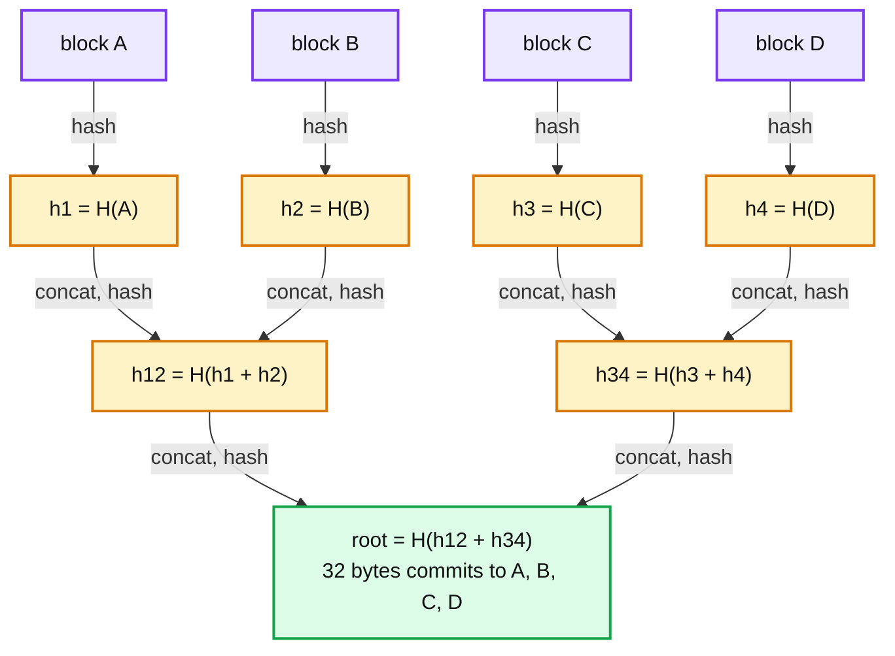
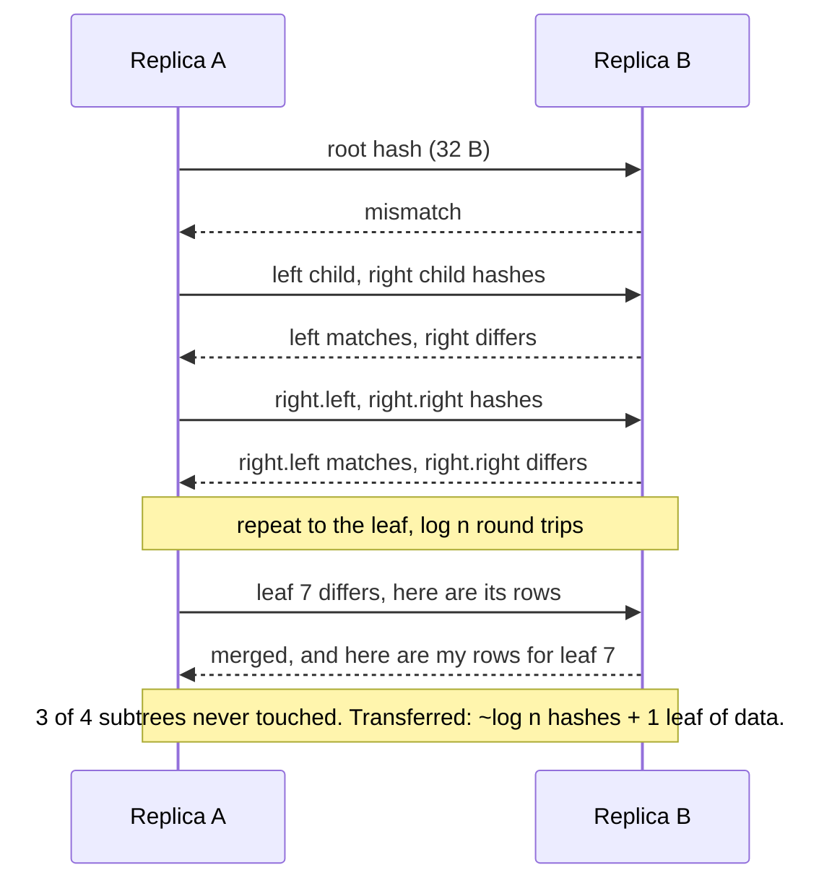
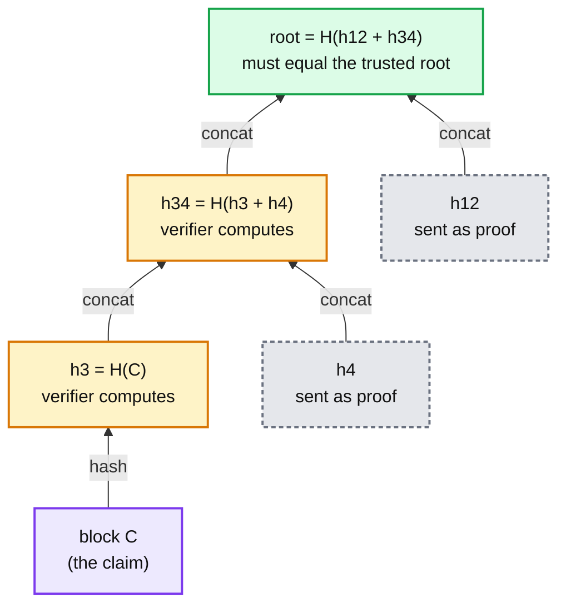
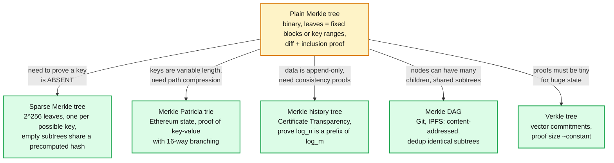
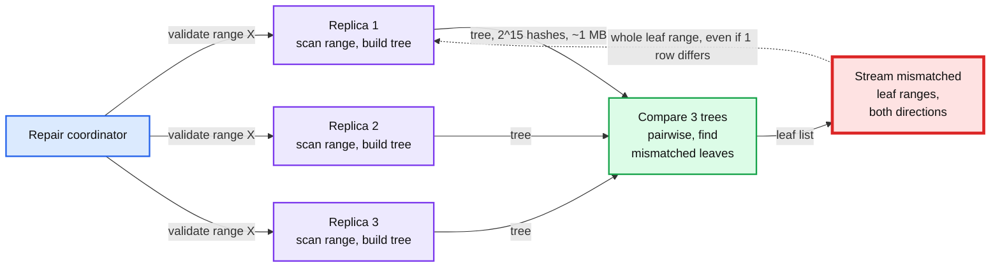

# Concept: Merkle Tree

> One-liner: a Merkle tree is a binary tree of hashes where each leaf is the hash of a data block and each parent is the hash of its two children, so one 32-byte root commits to the whole dataset, any single block can be proven to belong with log n hashes, and two copies of the data can find where they differ by comparing log n hashes instead of the data itself.

Depth target: high-level, same as [bloom-filter.md](bloom-filter.md), [crdt.md](crdt.md), and [gossip-protocol.md](gossip-protocol.md). It is the mechanism behind "how do two replicas find out what they disagree on without shipping everything", which is asked in every eventually consistent storage design. Because it is DSA, this note has runnable code.

---

## 1. Mental model

You have a large dataset on two machines and want to know whether the copies match, and if not, which pieces differ. Hashing the whole thing gives one bit of information: same or not. A Merkle tree hashes it hierarchically, so a mismatch at the root can be narrowed down level by level to the exact block, with each step costing one hash comparison.



- **Leaves** are hashes of data blocks. A block can be a file chunk, a row, a transaction, or every row in a key range.
- **Interior nodes** are hashes of their children's hashes. Change any byte in any block and every hash on the path to the root changes.
- **The root** is a fingerprint of the entire dataset. Two datasets with the same root are (with cryptographic certainty) identical.
- The hashes are amber because they are **derived**: rebuild them from the data at any time. They are never the source of truth.

**Why Merkle trees exist.** Ralph Merkle, 1979, as a way to sign many messages with one signature. The modern reason: any time two parties need to agree on, verify, or diff a large dataset over a slow link, a Merkle tree turns "send the data" into "send log n hashes". The three jobs it does, and the systems that lean on each:

| Job | Question it answers | Who uses it |
|---|---|---|
| **Diff** (anti-entropy) | Which of my 10 million rows differ from yours? | Dynamo, Cassandra, Riak, DynamoDB global tables, ZFS send, rsync-style sync |
| **Proof** (inclusion) | Prove this one block is in the dataset without sending the dataset. | Bitcoin SPV clients, Certificate Transparency, Ethereum, IPFS |
| **Integrity** (tamper evidence) | Has anything changed, and where? | Git, ZFS, Btrfs, BitTorrent, container image layers, software supply chain |

---

## 2. The three operations

### 2.1 Build

Hash each block into a leaf. Pair the leaves, hash each pair into a parent. Repeat until one node is left. For `n` blocks: `n` leaf hashes plus `n - 1` interior hashes, so about `2n` hash calls and `2n` stored hashes. Height is `ceil(log2 n)`.

Two details every implementation must decide:

- **Odd number of nodes at a level.** Either promote the lone node up unchanged (Certificate Transparency), or duplicate it and hash it with itself (Bitcoin, which caused CVE-2012-2459: two different transaction lists could produce the same root).
- **Domain separation.** Prefix leaf input with `0x00` and interior input with `0x01` before hashing. Without this, an attacker can present two interior hashes as a "leaf" and forge an inclusion proof for data that was never in the tree (the second preimage attack). RFC 6962 mandates this.

### 2.2 Diff: find where two copies disagree



- Cost when the copies match: **one 32-byte comparison**, regardless of data size.
- Cost when `d` leaves differ: about `d · log n` hash comparisons and `d` leaves of data. In practice both sides send the whole tree (`2^depth` hashes, ~1 MB for depth 15) in one message and diff locally, trading a little bandwidth for zero round trips.
- The critical constraint: **a leaf is the unit of transfer**. If one row differs inside a leaf that covers 3 MB, 3 MB is streamed. Section 6 covers this.

### 2.3 Proof: show one block belongs

To prove block `C` is in the tree, send `C` plus the **sibling hash at each level** on the path from `C` to the root. The verifier recomputes upward and checks the result equals the root it already trusts.



- Proof size is `log2 n` hashes. A block with 4,000 transactions needs 12 hashes, 384 bytes. A log with 1 billion entries needs 30 hashes, 960 bytes.
- The verifier needs only the root, obtained from somewhere it trusts (a block header, a signed tree head, a value it computed itself earlier).
- This is why a phone can verify a Bitcoin payment without downloading 600 GB of chain: it downloads 80-byte block headers (which contain the root) and asks a full node for a 384-byte proof.

---

## 3. Code

Python, runnable, no dependencies. Build, root, inclusion proof, verify, and diff between two trees. Domain separation included, lone nodes promoted (the RFC 6962 way).

```python
import hashlib

LEAF, NODE = b"\x00", b"\x01"          # domain separation: a leaf can never be mistaken for an interior node


def _h(*parts: bytes) -> bytes:
    return hashlib.sha256(b"".join(parts)).digest()


class MerkleTree:
    def __init__(self, blocks: list[bytes]):
        assert blocks, "empty tree is a special case, define root = H(b'')"
        self.levels = [[_h(LEAF, b) for b in blocks]]      # levels[0] = leaves, levels[-1] = [root]
        while len(self.levels[-1]) > 1:
            cur, nxt = self.levels[-1], []
            for i in range(0, len(cur), 2):
                if i + 1 < len(cur):
                    nxt.append(_h(NODE, cur[i], cur[i + 1]))
                else:
                    nxt.append(cur[i])                      # odd count: promote, do not duplicate
            self.levels.append(nxt)

    @property
    def root(self) -> bytes:
        return self.levels[-1][0]

    def proof(self, index: int) -> list[tuple[bytes, bool]]:
        # Sibling hash at each level plus whether that sibling is on the right.
        out = []
        for level in self.levels[:-1]:
            sib = index ^ 1
            if sib < len(level):
                out.append((level[sib], sib > index))
            index //= 2
        return out

    @staticmethod
    def verify(root: bytes, block: bytes, proof: list[tuple[bytes, bool]]) -> bool:
        h = _h(LEAF, block)
        for sib, sib_is_right in proof:
            h = _h(NODE, h, sib) if sib_is_right else _h(NODE, sib, h)
        return h == root

    def diff(self, other: "MerkleTree") -> list[int]:
        # Leaf indexes where the two trees disagree. Walks only mismatching subtrees.
        assert len(self.levels) == len(other.levels), "trees must have the same shape"
        top = len(self.levels) - 1
        stack, out = [(top, 0)], []
        while stack:
            lvl, i = stack.pop()
            if self.levels[lvl][i] == other.levels[lvl][i]:
                continue                                    # whole subtree matches, skip it
            if lvl == 0:
                out.append(i)
                continue
            for child in (2 * i, 2 * i + 1):
                if child < len(self.levels[lvl - 1]):
                    stack.append((lvl - 1, child))
        return sorted(out)


if __name__ == "__main__":
    rows = [f"row-{i}".encode() for i in range(1000)]
    a = MerkleTree(rows)
    print(f"leaves={len(rows)} height={len(a.levels) - 1} root={a.root.hex()[:16]}...")

    p = a.proof(617)
    print(f"proof for leaf 617: {len(p)} hashes, {len(p) * 32} bytes")
    assert MerkleTree.verify(a.root, rows[617], p)
    assert not MerkleTree.verify(a.root, b"row-forged", p)

    rows_b = list(rows)
    rows_b[42] = b"row-42-stale"
    rows_b[900] = b"row-900-stale"
    b = MerkleTree(rows_b)
    assert a.root != b.root
    print(f"differing leaves: {a.diff(b)}")                 # [42, 900], found by comparing ~40 hashes, not 1000 rows
```

Expected output: `height=10`, a 10-hash proof (320 bytes), and `differing leaves: [42, 900]`. The two lines to remember: `_h(NODE, left, right)` going up in `__init__`, and the `continue` on match in `diff` that prunes whole subtrees.

---

## 4. Variants, and when to reach for each



| Limit of the plain tree | Variant | What it adds | Cost |
|---|---|---|---|
| Cannot prove a key is **absent** | **Sparse Merkle tree**: a leaf for every possible key (2^256), almost all empty. Empty subtrees of the same height hash to the same known value, so the tree is never materialised. | Non-membership proofs. Proof for key `k` walks `k`'s bits from the root. | 256-level paths (compressed in practice). Used in Google Trillian maps, Diem, Ethereum L2s. |
| Fixed block layout, no keyed lookup | **Merkle Patricia trie** (Ethereum): a radix trie where each node is hashed. Path is the key's nibbles. | Prove `account -> balance` mappings. Insert, update, delete keyed data. | Deep paths, 16-way nodes make proofs ~15 hashes per level. Ethereum's state root is the reason clients need 1 TB of disk. |
| Append-only log needs "the log I saw yesterday is a prefix of today's" | **Merkle history tree** (RFC 6962, Certificate Transparency): defined so that any prefix of the log has a well-defined root, and a **consistency proof** of `O(log n)` hashes shows old root is a prefix of new root. | Tamper-evident logs. A monitor can prove no entry was rewritten. | Build order matters. Cannot rebalance. |
| Binary, exactly one parent per node | **Merkle DAG** (Git, IPFS, Docker layers): nodes have arbitrary children and children can be shared. Address is the hash. | Deduplication for free: two directories with the same subtree share it. Content addressing: the hash is the name. | Not a balanced tree, so no `log n` proof guarantee. |
| Proof is `log n` hashes | **Verkle tree**: replace the hash at each node with a polynomial vector commitment (KZG or IPA) to all children. | Proof is a handful of curve points regardless of depth, ~30x smaller for Ethereum state. | Needs pairing-friendly crypto, a trusted setup for KZG, and is 10 to 100x slower to compute per node. |
| No tree at all | **Hash list**: one hash per block, one hash over the list. BitTorrent's original `.torrent` files. | Simpler. | Verifying any one block needs the whole hash list. A 4 GB file at 256 KB pieces is 16,000 hashes, 512 KB, before the first byte can be checked. BitTorrent v2 moved to a Merkle tree for this reason. |

---

## 5. Where you meet Merkle trees

| System | Leaves are | Job | Detail worth saying |
|---|---|---|---|
| **Amazon Dynamo** (paper, 2007), **Riak**, **Cassandra**, **ScyllaDB** | Hash of all rows in a sub-range of the token ring | Diff (anti-entropy repair) | Each node keeps one tree per key range it owns. Repair compares trees with the other replicas and streams only differing leaves. Section 6. |
| **DynamoDB global tables**, **Cosmos DB** | Same idea, per partition | Diff | Cross-region convergence check that does not read every item. |
| **Git** | Blobs (file contents), trees (directories), commits | Integrity, dedup | A commit hash commits to the full snapshot. `git fetch` walks the DAG comparing hashes to find what the remote is missing. Identical files across commits are stored once. Moving from SHA-1 to SHA-256. |
| **Bitcoin** | Transaction IDs in a block | Proof (SPV) | 80-byte header holds the root. A light client verifies a payment with a ~400-byte proof instead of the 1 to 2 MB block. |
| **Ethereum** | Account state, storage slots, transactions, receipts | Proof, integrity | Merkle Patricia trie. Every block header carries a state root, so any node can prove any account's balance to a light client. |
| **Certificate Transparency** (RFC 6962) | Issued TLS certificates, append-only | Proof, consistency | Browsers require certificates to carry a signed proof of inclusion in a public log. Monitors verify the log never rewrote history via consistency proofs. |
| **ZFS**, **Btrfs** | Every data and metadata block | Integrity | Each block pointer stores the child's checksum. A corrupted disk block is detected on read and self-healed from a mirror. The uberblock is the root. `zfs send` uses it for incremental diffs. |
| **IPFS**, **Docker / OCI images**, **Nix** | Content chunks, image layers, build outputs | Dedup, addressing | The hash is the name. Two images sharing a base layer share the bytes. Pull only the layers whose hash you lack. |
| **BitTorrent v2**, **Sigstore / in-toto**, **Android verified boot (dm-verity)** | File pieces, build artefacts, disk blocks | Integrity | Verify each piece as it arrives with a `log n` proof instead of waiting for the whole file. dm-verity checks every 4 KB block against a Merkle tree on boot. |
| **Google Trillian**, **Key Transparency**, **WhatsApp / Apple key verification** | Public keys per user | Proof, non-membership | Sparse Merkle tree over usernames. Your phone can verify the key it got for a contact is the one everyone else sees, and that no second key was slipped in. |
| **Kafka tiered storage checks**, **S3 object checksums (composite)** | Multipart upload parts | Integrity | S3's multipart ETag is a hash-of-hashes over the parts: a two-level Merkle tree. |

---

## 6. Merkle trees in anti-entropy repair (the storage interview use)

The single most important use for a distributed storage design. Replicas in Dynamo-style stores diverge (a node was down, a write timed out, hints expired). Read repair only fixes what gets read. Cold data would diverge forever without a background process that compares whole ranges, and that process cannot afford to ship the whole range.



Details that matter in a storage design:

- **The tree is built by scanning the data, and that scan is the expensive part.** Hashing 100 GB at ~1 GB/s per core is ~2 minutes of CPU and 100 GB of disk reads per replica per repair. The hash comparison afterwards is microseconds. Cassandra calls this a validation compaction and it competes with real compaction for IO. Budget for it.
- **Tree depth is bounded by memory, not data.** A depth-15 tree has 32,768 leaves and costs ~1 MB. Over a 100 GB range, **each leaf covers ~3 MB**. One stale row means 3 MB streamed, in both directions. Scatter 1,000 stale rows across the range and you stream 3 GB to fix a few KB. This is **overstreaming**, the red node above, and it is the reason repair is dreaded in Cassandra operations.
- **The fix is smaller ranges, not deeper trees.** Repair 1 GB sub-ranges at a time with the same depth-15 tree and each leaf covers 30 KB. Same memory, 100x better resolution. Every serious repair scheduler (Reaper, Cassandra 5's automated repair) splits ranges aggressively for this reason.
- **The tree is a snapshot.** Writes arriving during the build land in some leaves and not others, so the comparison sees phantom differences. Either build from an immutable snapshot (SSTables are immutable, so Cassandra hashes a fixed set of them) or accept some wasted streaming.
- **Tree per range per replica, cached and incrementally updated** is how Riak and DynamoDB avoid the rescan: on every write, update the leaf and re-hash the path to the root (`log n` hashes per write). Repair then compares cached trees with no scan. Cost: the tree must be persisted and kept consistent with the data, which is its own failure mode.
- **Three layers, three latencies.** Hinted handoff (seconds, covers known-down nodes), read repair (on access, covers hot data), Merkle repair (hours to days, covers everything). The Merkle layer is the only one with a completeness guarantee, and the only one with a cost proportional to data size rather than traffic.

---

## 7. Practical additions every real implementation has

| Addition | Problem it fixes |
|---|---|
| **Domain separation** (`0x00` leaf, `0x01` node prefix) | Second preimage attack: interior hashes passed off as a leaf to forge a proof. |
| **Defined odd-node rule** (promote, not duplicate) | Duplicating lets two different leaf lists share a root (Bitcoin CVE-2012-2459). |
| **Cached tree with per-write path update** | Full rescan on every repair. `log n` hashes per write instead. |
| **Depth chosen from range size and memory budget** | Overstreaming from coarse leaves, or OOM from fine ones. |
| **Sub-range repair** | Same. Split the range so each leaf covers KB, not MB. |
| **Snapshot before build** | Phantom diffs from writes during the scan. |
| **Non-cryptographic hash for anti-entropy** (xxHash, MurmurHash) | SHA-256 CPU cost when there is no adversary. Cassandra uses a 128-bit non-crypto hash for repair trees, SHA-256 only where tamper resistance matters. |
| **Cryptographic hash for proofs** (SHA-256, BLAKE3) | A non-crypto hash lets anyone forge an inclusion proof. Git's SHA-1 migration is the cautionary tale. |
| **Chunked / streaming build** (BLAKE3 does this internally) | Build in parallel across cores. BLAKE3 is a Merkle tree of 1 KB chunks by design, so it verifies streams incrementally and parallelises to ~10 GB/s. |
| **Signed root** (signed tree head in CT, block header signature) | The root alone proves nothing unless the verifier trusts where it came from. |

---

## 8. Failure modes and what happens

| Failure | What happens | Fix |
|---|---|---|
| **Overstreaming** (leaves too coarse) | Repair streams GBs to fix KBs. Repair takes days, saturates disk and network, and operators stop running it, so replicas drift. | Sub-range repair. Cached trees. Monitor bytes streamed vs bytes actually different. |
| Tree build starves foreground IO | Read latency spikes during repair. | Throttle the validation scan. Run per sub-range with pauses. Build from cached trees. |
| Cached tree out of sync with data | Repair says "consistent" while replicas differ. **Silent divergence.** | Update tree and data atomically (same commit log entry), or periodically rebuild from scratch and compare with the cached root. |
| Writes during build | Phantom mismatches, wasted streaming, but never missed real ones (a real difference still shows up). | Build from an immutable snapshot. |
| No domain separation | Forged inclusion proofs. | Prefix bytes. Always. |
| Odd-node duplication | Two datasets, one root. Hash collision by construction. | Promote the lone node. |
| Weak hash | Collisions. Git's SHA-1 SHAttered attack (2017) made a forged commit theoretically possible. | SHA-256 or BLAKE3 for anything adversarial. |
| Trusting an unsigned root | Verifier accepts a proof against a root the attacker made up. | Root must arrive over a trusted channel: signed, in a block header, or computed locally. |
| Repair never finishes before the next cycle | Ranges never repaired. Tombstones past `gc_grace` on one replica but not another: **deleted data comes back**. | Repair must complete within `gc_grace_seconds` (default 10 days in Cassandra). Alert on repair age per range. |

---

## 9. Trade-offs

| Gain | Cost |
|---|---|
| Compare two datasets of any size in one 32-byte comparison when they match. | Building the tree reads and hashes all the data: `O(n)` IO and CPU. The cheap comparison is paid for by an expensive build. |
| Locate `d` differences in `O(d log n)` hashes, transfer only the differing leaves. | Transfer granularity is a leaf. Coarse leaves mean overstreaming, fine leaves mean memory. |
| `log n` sized inclusion proof, verifiable with just the root. | Verifier must get the root from somewhere it trusts. The tree proves membership, not authenticity of the root. |
| Tamper-evident: any change moves the root. | Not tamper-proof: an attacker who controls the data and the root can rewrite both. Needs a signature or an external witness (CT monitors, blockchain consensus). |
| Incremental update is `log n` hashes per write. | Only if the tree is persisted and kept in sync, which is state to manage and a new way to be silently wrong. |
| Dedup for free in DAG form (Git, IPFS). | Balanced-tree guarantees are lost. Proofs are not `log n`. |
| Simple to implement correctly (~50 lines). | Easy to get subtly wrong: no domain separation, duplicate-last-node, weak hash, unsigned root. |

**What a Staff answer refuses to build:** a Merkle tree as the only anti-entropy mechanism (it is hours-scale, pair it with hints and read repair), a full-range tree over TBs at fixed depth (overstreaming is guaranteed), a cryptographic hash in a repair hot path where no adversary exists, and a "verified" client that accepts roots from the same untrusted peer that sends the proofs.

---

## 10. Numbers worth memorizing

- Root is **32 bytes** (SHA-256). One comparison replaces comparing the whole dataset.
- Build: **~2n hashes** (`n` leaves, `n - 1` interior). Height `log2 n`. 1 million leaves is height 20.
- Proof: **`log2 n` hashes**. 1,000 leaves → 10 hashes, 320 B. 1 million → 20 hashes, 640 B. 1 billion → 30 hashes, 960 B. Bitcoin block of 4,000 tx → 12 hashes, ~400 B against an 80 B header.
- Diff: `d` differing leaves cost ~`d · log n` comparisons. Or send the whole tree: depth 15 = 32,768 leaves = ~1 MB, depth 20 = ~32 MB.
- Overstreaming: depth 15 over 100 GB = **~3 MB per leaf**. Over 1 GB = ~30 KB per leaf. Same memory, 100x resolution.
- Hashing cost: SHA-256 ~1 to 2 GB/s per core, BLAKE3 ~10 GB/s multi-core, xxHash ~30 GB/s. Hashing 100 GB is minutes of CPU, plus reading 100 GB from disk.
- Incremental update: `log n` re-hashes per write. 1 million leaves → 20 hashes per write, ~5 microseconds.
- Cassandra: `repair_session_space` defaults to 1/16 of heap and bounds tree depth. Repair must complete within `gc_grace_seconds` (10 days) or deletes resurrect.
- Domain separation: `0x00` leaf, `0x01` node. Two bytes that prevent a whole attack class.

---

## 11. Interview soundbite

> "A Merkle tree hashes data blocks into leaves and hashes pairs upward until one root commits to everything. Three things fall out. Two replicas compare 32 bytes to know they match, and walk log n hashes down to find exactly which leaf differs, so anti-entropy repair in Dynamo and Cassandra streams only differences. Any single block is provable with log n sibling hashes against a trusted root, which is how a phone verifies a Bitcoin payment from an 80-byte header. And any tampering moves the root, which is Git, ZFS, and Certificate Transparency. The trap in storage systems is that the leaf is the unit of transfer: a depth-15 tree over 100 GB has 3 MB leaves, so one stale row streams 3 MB. You fix that with smaller repair ranges, not deeper trees."

Follow-ups an interviewer will ask, in order of likelihood:

1. Two replicas have 1 TB each and one row differs. Walk me through finding it. (Section 2.2, and section 6 for why it is not actually one row that gets streamed.)
2. Why not just hash the whole range? (One bit of information. The tree tells you *where*.)
3. What is overstreaming and how do you fix it? (Section 6, sub-range repair, cached trees.)
4. How does a light client verify a transaction without the chain? (Section 2.3, proof against the header root.)
5. How do you prove something is *not* in the set? (Section 4, sparse Merkle tree.)
6. What can go wrong with the hash function choice? (Section 7, crypto vs non-crypto, domain separation, odd-node rule.)
7. How is Git a Merkle tree? (Section 4, Merkle DAG. Commit hash commits to the full snapshot. Fetch walks hashes to find what is missing.)
8. Why does Cassandra need Merkle repair if it has read repair and hints? (Section 6, three layers, only Merkle covers cold data.)
9. How would you keep the tree up to date without rescanning? (Section 6, per-write path update, `log n` hashes, and the sync risk that comes with it.)

Related: [gossip-protocol.md](gossip-protocol.md) (membership and hint propagation, the fast anti-entropy layer), [crdt.md](crdt.md) (what to do with the differing rows once found: merge, not overwrite), [bloom-filter.md](bloom-filter.md) (the other "hash instead of store" structure, for membership rather than diff), [lsm-tree.md](lsm-tree.md) (immutable SSTables are what make the snapshot-then-hash build safe), `popular_systems_deepdive/cassandra/cassandra-07-repair-streaming.md` (source-verified repair internals and overstreaming numbers).
