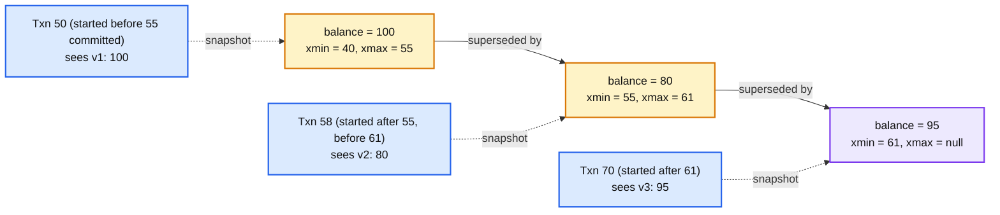
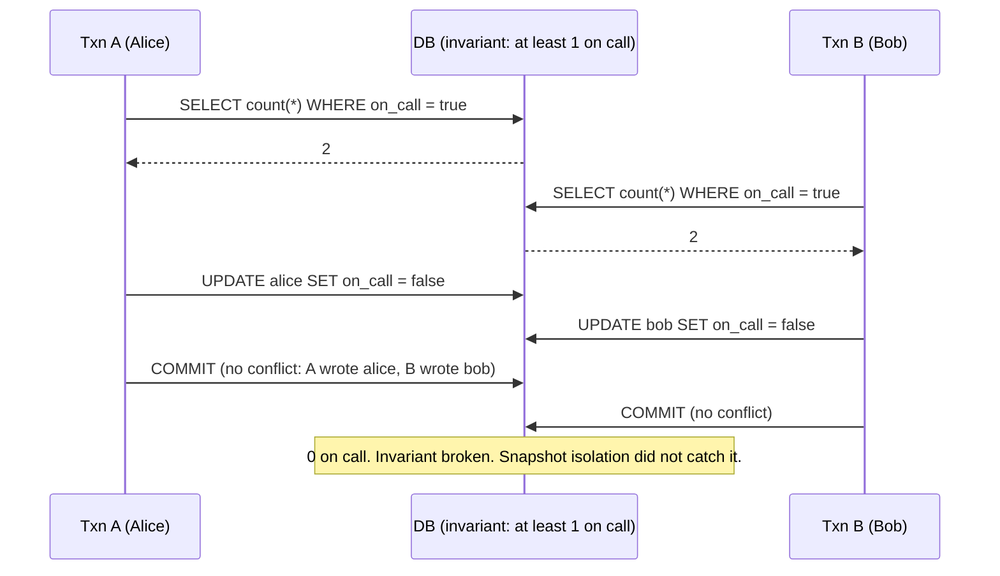

# Concept: MVCC and Isolation Levels

> One-liner: multi-version concurrency control (MVCC) keeps old versions of a row instead of overwriting it, so readers see a consistent snapshot as of their start time without taking locks and writers never block readers; the isolation level then says which anomalies a transaction may observe, with snapshot isolation (the common default) stopping everything except write skew, and serializable stopping that too at the cost of aborting more transactions.

Depth target: high-level, same as [distributed-transactions.md](distributed-transactions.md) and [lsm-tree.md](lsm-tree.md). It is under test in the KV store, Delta Lake, and retry-safe transaction problems, and "what isolation level and what can go wrong" is the follow-up.

---

## 1. Mental model

Two transactions touch the same row. Without MVCC, one waits for the other's lock. With MVCC, the writer creates a new version tagged with its transaction ID, the reader keeps seeing the old version until the writer commits, and readers that started before the commit keep seeing the old one forever.

- Every version carries the ID of the transaction that created it (`xmin`) and the one that deleted or replaced it (`xmax`). Postgres literally has these columns.
- A transaction's **snapshot** is the set of transaction IDs committed when it started. A version is visible if `xmin` is in the snapshot and `xmax` is not.
- **Readers never block writers, writers never block readers.** Writers block writers on the same row.
- Old versions are garbage: someone must remove them once no snapshot can see them (Postgres `VACUUM`, MySQL purge, LSM compaction with a snapshot watermark).

**Why this matters more at Staff level.** Senior answers say "use transactions". Staff answers name the isolation level, name the anomaly it still allows, show the write-skew example, say how old versions are reclaimed and what happens when a long transaction blocks that, and say how MVCC extends to a distributed store with a timestamp oracle.

---

## 2. The anomalies and the levels that stop them

| Anomaly | What it looks like | Stopped by |
|---|---|---|
| **Dirty read** | Read another transaction's uncommitted write, which then aborts | Read committed |
| **Dirty write** | Overwrite another transaction's uncommitted write | Every real level |
| **Non-repeatable read** | Read a row twice in one transaction, get two values because someone committed in between | Repeatable read, snapshot isolation |
| **Phantom** | Run a query twice, get different row sets because someone inserted a matching row | Serializable (and MVCC snapshot for plain reads; not for predicate-then-write) |
| **Lost update** | Two transactions read-modify-write the same row; the second overwrites the first's change | Snapshot isolation with first-committer-wins, or explicit locks, or atomic update |
| **Write skew** | Two transactions each read a set, each write a *different* row based on what they read, and the combined result violates an invariant neither saw broken | Serializable only |

| Level | Reads see | Write conflicts | Anomalies remaining | Default in |
|---|---|---|---|---|
| **Read uncommitted** | Anything | None | All | Nobody sane |
| **Read committed** | Committed data as of each *statement* | Row lock on write | Non-repeatable read, phantom, lost update, write skew | Postgres, Oracle, SQL Server |
| **Repeatable read** (MySQL) | Snapshot as of transaction start, but writes see current | Row lock | Write skew, phantoms on write | MySQL InnoDB |
| **Snapshot isolation** | Snapshot as of transaction start | First-committer-wins on the same row | **Write skew** | Postgres `REPEATABLE READ`, Oracle `SERIALIZABLE` (misnamed), SQL Server `SNAPSHOT`, Spanner reads, CockroachDB below 23 |
| **Serializable** | As if transactions ran one at a time | Detects read-write conflicts too | None | Postgres `SERIALIZABLE` (SSI), CockroachDB, FoundationDB, Spanner read-write |

The one to know cold: **snapshot isolation is not serializable, and the gap is write skew.** Every "check then act" pattern (check balance then withdraw, check seat count then book, check on-call count then leave) is exposed under snapshot isolation when two transactions check the same condition and write different rows.

---

## 3. How serializable is enforced

| Technique | How | Cost | Where |
|---|---|---|---|
| **Two-phase locking (2PL)** | Take shared locks on reads, exclusive on writes, hold all until commit. Predicate or index-range locks for phantoms. | Readers block writers. Deadlocks need detection. Throughput drops under contention. | MySQL `SERIALIZABLE`, SQL Server `SERIALIZABLE`, classic systems |
| **Serializable snapshot isolation (SSI)** | Run under snapshot isolation, track read-write dependencies between concurrent transactions, abort one when a dangerous cycle (two consecutive rw-edges) appears | Aborts and retries. Tracking memory. No blocking. | Postgres 9.1+, CockroachDB (with a variant) |
| **Optimistic (OCC)** | Read freely with a version, validate at commit that nothing read has changed, abort otherwise | Aborts under contention. No locks. | FoundationDB, Delta Lake commits, Spanner read-only, most "version check" application code |
| **Deterministic / single-threaded** | Order all transactions up front, execute serially or deterministically | No conflicts at all. Throughput bounded by one core per partition. | VoltDB, Calvin, the matching engine in `hld/order-execution/`, Redis |
| **Explicit locks under SI** | `SELECT ... FOR UPDATE` on the rows the invariant depends on, or materialise the invariant into a row (`on_call_count`) and update it | Developer must find every write-skew site | Everywhere in practice |

The pragmatic Staff answer: **run snapshot isolation, find the invariants that span rows, and protect each one with `FOR UPDATE`, a materialised row, or a unique constraint.** Turn on serializable only for the transactions that need it, and build retry loops because SSI aborts.

---

## 4. MVCC in a distributed store

Version numbers must be comparable across nodes.

| System | Timestamp source | Snapshot | Conflict detection |
|---|---|---|---|
| **Spanner** | TrueTime, commit wait ~7 ms | Read at a timestamp `T`, any replica that has applied through `T` serves it | 2PL for read-write, lock-free snapshot reads |
| **CockroachDB** | Hybrid logical clock, 500 ms max offset | Read at HLC timestamp; uncertainty window forces a restart if a write lands in it | Write intents plus a timestamp cache of reads; SSI-style push and abort |
| **TiDB / TiKV** | Timestamp oracle (a single PD leader hands out timestamps, ~1M/s) | Percolator model: start_ts and commit_ts | Locks in a separate column family, primary key lock as the commit point |
| **Percolator (Google, 2010)** | Central timestamp oracle | Same | The design TiDB copied |
| **FoundationDB** | Sequencer hands out read and commit versions | Read at a version | Resolver checks read set vs writes since read version |
| **Delta Lake / Iceberg** | Table version number in the log | Read a table version | Optimistic: commit fails if the log advanced with a conflicting change |

The common shape: **one place hands out monotonic timestamps, every write is tagged, every read picks a timestamp and sees writes below it, and either locks or a validation step at commit stops conflicting writers.** The timestamp oracle is a bottleneck (TiDB batches requests to PD) or a clock assumption (CockroachDB) or hardware (Spanner).

---

## 5. Garbage: old versions must go

Every MVCC store accumulates dead versions. The **oldest active snapshot** is the watermark; anything older than it and superseded can go.

| System | Cleanup | The failure |
|---|---|---|
| **Postgres** | `VACUUM` marks dead tuples reusable, autovacuum runs by threshold | A long transaction (an idle-in-transaction connection, a 6-hour report) holds the watermark. Tables bloat, indexes bloat, `VACUUM` cannot reclaim. Also transaction ID wraparound at 2^31: forced shutdown if vacuum falls behind. |
| **MySQL InnoDB** | Undo log purged by the purge thread | Long transaction grows the undo log (history list length). Same bloat. |
| **Oracle** | Undo tablespace with retention | `ORA-01555 snapshot too old`: the reader's version was purged. |
| **LSM stores** (RocksDB, Cassandra) | Compaction drops versions below the snapshot watermark | Snapshots held open pin SST files. |
| **CockroachDB, Spanner** | GC TTL per table (25 h default in CockroachDB) | Time-travel reads limited to the TTL. |

Operability line: **alert on the age of the oldest transaction and on dead-tuple ratio.** Kill idle-in-transaction connections after a timeout.

---

## 6. Trade-offs

| Gain | Cost |
|---|---|
| Readers never block, writers never block readers. | Storage for old versions and a cleanup process that can fall behind. |
| Consistent snapshot for long reads (reports, backups) with no locks. | Long snapshots hold back cleanup. |
| Snapshot isolation stops almost everything with first-committer-wins. | Write skew slips through and is invisible until the invariant is checked. |
| Serializable (SSI, OCC) stops write skew without blocking. | Aborts under contention; every transaction needs a retry loop. |
| 2PL serializable: no aborts from validation. | Blocking, deadlocks, throughput. |
| Distributed MVCC with a timestamp oracle: global snapshots. | The oracle is a bottleneck or a clock assumption. |

**What a Staff answer refuses to build:** "check then act" on separate rows under snapshot isolation without a lock or a materialised invariant, serializable for every transaction by default, a reporting connection that stays in a transaction for hours on the primary, and a distributed store that compares wall-clock timestamps without an uncertainty bound.

---

## 7. Numbers worth memorizing

- Postgres row overhead for MVCC: **~24 bytes** header per tuple (`xmin`, `xmax`, ctid, flags). Transaction ID: 32 bits, wraparound at ~2 billion, `autovacuum_freeze_max_age` 200M.
- CockroachDB GC TTL: **25 hours** default. Max clock offset: 500 ms. Spanner commit wait: ~7 ms.
- TiDB timestamp oracle: ~1M timestamps/s from PD, batched.
- SSI abort rate: low single digits percent on typical OLTP, tens of percent under hot-row contention.
- Postgres default: read committed. MySQL default: repeatable read. Oracle `SERIALIZABLE` is snapshot isolation.
- `idle_in_transaction_session_timeout`: set it. 5 to 15 minutes is common.

---

## 8. Interview soundbite

> "MVCC keeps every version of a row tagged with the writing transaction, so a reader sees the snapshot as of its start and never takes a lock. I run snapshot isolation by default and say out loud that it permits write skew: two transactions that each check an invariant and then write different rows. For each invariant that spans rows I take `SELECT FOR UPDATE` on the rows it depends on or materialise it into one row with a constraint, and I use serializable with a retry loop only for the transactions that genuinely need it. Old versions are reclaimed up to the oldest open snapshot, so I alert on transaction age and kill idle-in-transaction sessions, because one six-hour report can bloat every table. Distributed, the same model needs one source of timestamps: a TrueTime interval, a hybrid logical clock with a bounded offset, or a timestamp oracle."

Follow-ups an interviewer will ask, in order of likelihood:

1. Which isolation level and what does it still allow? (Section 2, snapshot, write skew.)
2. Show me write skew. (Section 2, on-call doctors.)
3. How do you stop it? (Section 3, `FOR UPDATE`, materialised invariant, SSI.)
4. What happens with a long-running transaction? (Section 5, bloat, wraparound.)
5. How does a distributed database get a consistent snapshot? (Section 4, timestamp oracle or bounded clocks.)
6. Optimistic or pessimistic, when? (Section 3, OCC for low contention, locks for hot rows.)
7. Why is Oracle's serializable not serializable? (Section 2, it is snapshot isolation.)

Related: [distributed-transactions.md](distributed-transactions.md) (atomicity across systems; this note is isolation within one), [leases-fencing-clocks.md](leases-fencing-clocks.md) (HLC and TrueTime as the timestamp source), [lsm-tree.md](lsm-tree.md) (versions and compaction watermarks), [exactly-once.md](exactly-once.md) (optimistic version checks as idempotency), `hld/kv-store-wal/` (snapshot reads vs concurrent writers), `hld/` #15 Delta Lake (optimistic commits on a table log), #14 retry-safe transactions.
