# Concept: OAuth 2.0 and OpenID Connect

> One-liner: OAuth 2.0 is a **delegation** protocol. A user lets an app call an API on their behalf without giving the app their password. An **authorization server** checks the user, asks for consent, and gives the app a short-lived, narrowly scoped **access token**. The API checks the token, never the password. **OpenID Connect (OIDC)** is a thin layer on top that adds an **ID token**, a signed statement of "who just logged in", which turns OAuth into single sign-on.

Depth target: high-level, same as [signed-url.md](signed-url.md) and [caching-patterns.md](caching-patterns.md). It is the "how does login work across 50 services", "how does a third-party app read a user's data", and "how do services authenticate each other" question that sits under almost every HLD. The flows are standard. The Staff part is token validation at 70k QPS, revocation, what happens when the authorization server is down, and when OAuth is the wrong tool.

---

## 1. Mental model

Think of a hotel valet key. It starts the car and opens the door, but not the trunk, and it stops working at checkout. The owner never hands over the master key. An access token is that valet key.

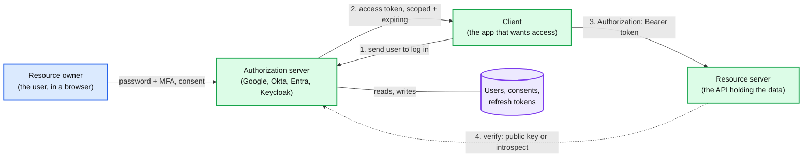

- **Delegation, not authentication.** OAuth answers "may this app read this user's calendar". It does not, by itself, tell the app who the user is. Using a bare access token as proof of login is a classic bug (section 5).
- **The password never reaches the client.** Before OAuth, apps asked for your email password to "import contacts". That gave them everything, forever, with no way to revoke one app.
- **The token is a capability.** Same idea as a [signed URL](signed-url.md): whoever holds a bearer token has the permission written in it. So it must be narrow (scope, audience) and short-lived (minutes to an hour).
- **Three trust zones.** The browser is untrusted and sees every redirect. The client's backend can keep secrets if it is a server. The authorization server (AS) holds the signing keys. Every flow below is shaped by what each zone may see.

**Why this matters at Staff level.** Senior: "we use OAuth with JWTs". Staff: which grant per client type and why, what the API checks per request and what it costs, how a fired employee loses access within N minutes, what breaks when the AS is down, and why a first-party web app with one backend should just use a session cookie.

| Term | Plain meaning |
|---|---|
| Scope | What the token allows, e.g. `calendar.read` |
| Audience (`aud`) | Which API the token is for |
| Consent | The "App X wants to read your calendar" screen |
| Confidential client | Runs on a server, can keep a secret |
| Public client | Single-page app (SPA), mobile, desktop, CLI. Cannot keep a secret, anyone can decompile it |
| Front channel | Browser redirects. Visible to history, extensions, `Referer`, logs |
| Back channel | Direct HTTPS call from server to server |
| Bearer token | Whoever holds it can use it |
| JWT | JSON Web Token: base64url `header.payload.signature` |
| JWKS | JSON Web Key Set: the AS's public keys at a well-known URL |

---

## 2. The one flow to know: authorization code + PKCE

PKCE (Proof Key for Code Exchange, RFC 7636, said "pixy") is what makes the code flow safe for apps that cannot keep a secret. Learn this flow cold; every other grant is a variation.

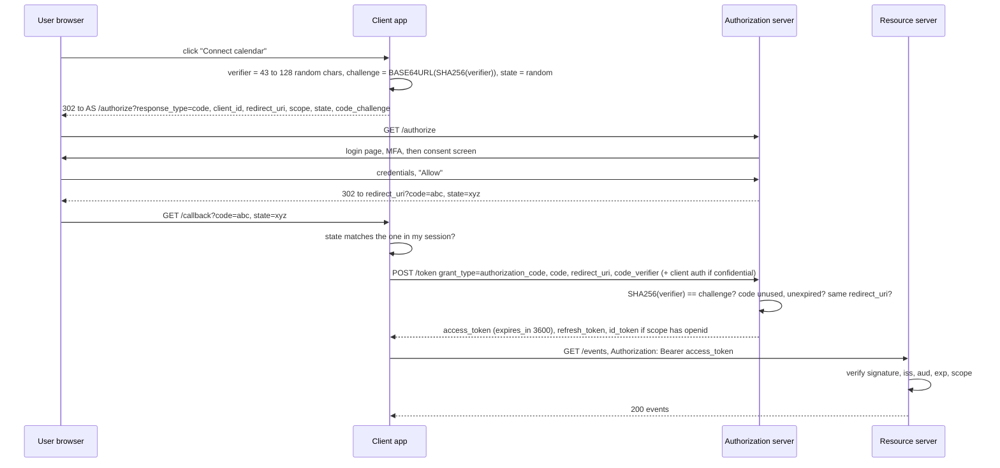

- **Why a code, not the token, in the redirect.** The redirect passes through the browser, where it can leak to history, extensions, `Referer` headers and logs. The code is useless by itself: single use, short lived (RFC 6749: "A maximum authorization code lifetime of 10 minutes is RECOMMENDED"), and redeemable only on the back channel with proof.
- **What PKCE proves.** The party redeeming the code is the same party that started the flow. The verifier never leaves the client. Only its hash travels in the redirect, and a hash does not help an attacker.
- **What `state` proves.** The callback belongs to a login this browser started. Without it an attacker can feed you *their* code, so you end up logged in to the attacker's account and upload your files into it (login CSRF). PKCE also blocks this, and RFC 9700 notes PKCE "prevents CSRF even in the presence of strong attackers". Most clients keep both.
- **Confidential clients also authenticate on `/token`.** A server-side web app adds a `client_secret`, or better, a JWT signed with its private key (`private_key_jwt`) or mutual TLS (mTLS). A SPA or mobile app has nothing secret, so PKCE is its only proof.
- **It is now mandatory.** RFC 9700 (OAuth 2.0 Security Best Current Practice, January 2025): "Public clients MUST use PKCE". For confidential clients it is RECOMMENDED. OAuth 2.1 requires it for everyone.

The attack PKCE stops. On mobile, any app can register the same custom URL scheme (`myapp://callback`), and the OS may hand the redirect to the wrong app.

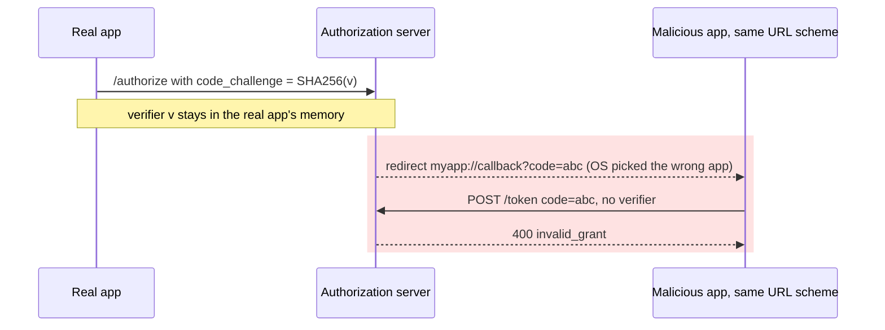

---

## 3. Tokens: what they are and how the API checks them

| Token | Who reads it | Typical lifetime | Format | Sent to |
|---|---|---|---|---|
| **Access token** | The API | 5 to 60 min | JWT or opaque string | The API, on every request |
| **Refresh token** | Only the AS | Days to months, rotates | Opaque, a DB row | Only the AS `/token` endpoint |
| **ID token** (OIDC) | The client | Read once at login | Always a JWT | Nobody. The client reads it and creates its own session |

A decoded JWT access token (RFC 9068 profile):

```json
// header
{"alg": "RS256", "kid": "2026-10-k2", "typ": "at+jwt"}
// payload
{"iss": "https://auth.example.com", "sub": "user_42", "aud": "https://api.example.com",
 "client_id": "web-app", "scope": "orders.read orders.write",
 "iat": 1791018000, "exp": 1791018900, "jti": "8f3c1e0a"}
```

Two ways for the API to check it:

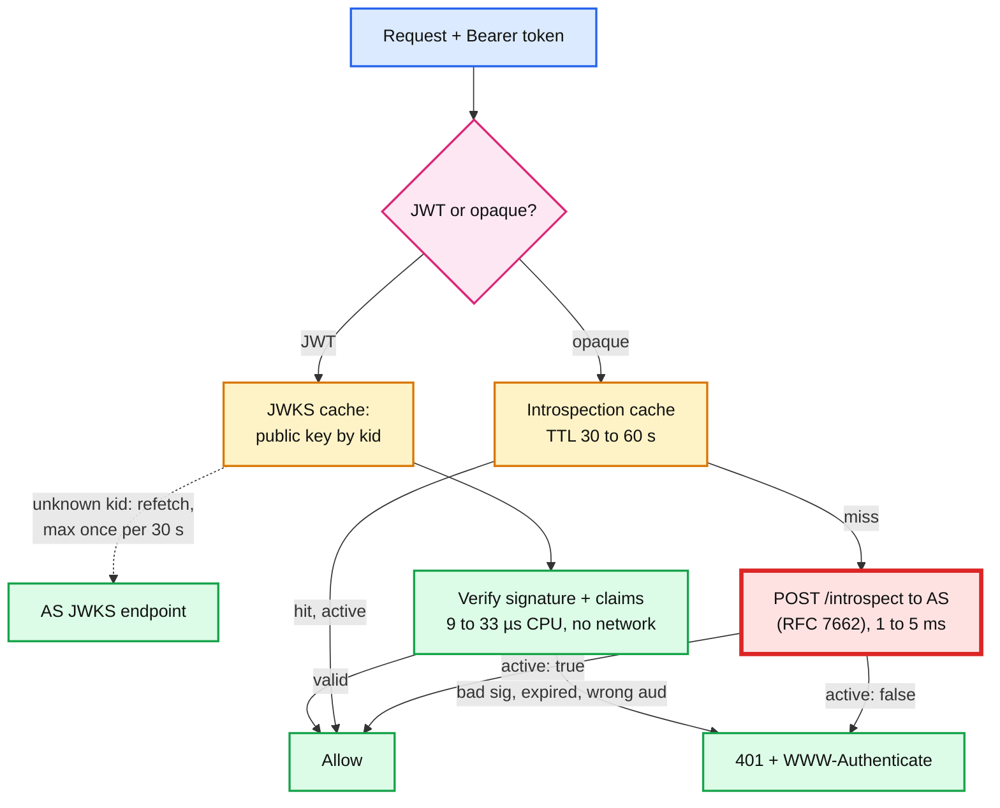

- **Local JWT check** costs one signature verify. Measured on one Apple M-series core with OpenSSL 3.6 (`openssl speed`): RSA-2048 (RS256) verify ~**116k/s** (~9 µs), ECDSA P-256 (ES256) ~**30k/s** (~33 µs), Ed25519 ~**25k/s**. Validation is never the bottleneck. The price: the API cannot know the token was revoked until `exp`.
- **Introspection** asks the AS "is this token active?" Revocation is instant, but the AS is now on the hot path for every request in the company. That is the red box: at 70k QPS (section 6) the AS becomes the most loaded service you own.
- **Hybrid, which most large systems run:** JWT access tokens with a short TTL (5 to 15 min), checked locally, plus a small revocation list (by `jti`, by `sub`, or "tokens for user X issued before T") pushed to every gateway. Push mechanics: [hld/distributed-denylist](../hld/distributed-denylist/).

**Validation checklist.** Every JWT bug in the wild is one of these skipped.

1. **`alg` from your allow-list, never from the token.** `alg: none` and the RS256-to-HS256 confusion (attacker signs with your *public* key as an HMAC secret) are the classic library CVEs.
2. **Signature** with the key matched by `kid`.
3. **`iss`** equals your AS exactly.
4. **`aud`** contains this API. Skipping it lets a token minted for service A be replayed to service B.
5. **`exp` / `nbf`** with small leeway. Library defaults differ: Spring Security 60 s, .NET 5 min, PyJWT 0.
6. **`scope`** or roles cover this endpoint.
7. **`typ` = `at+jwt`** (RFC 9068), so an ID token cannot be passed off as an access token.

### Refresh tokens and rotation

Access tokens are short so that leaks are short. Refresh tokens let the client get a new one silently. Because a refresh token only ever goes to the AS, it is usually an opaque DB row: revocable, and the thing you delete when an employee leaves.

**Rotation with reuse detection** turns a silent theft into a visible one.

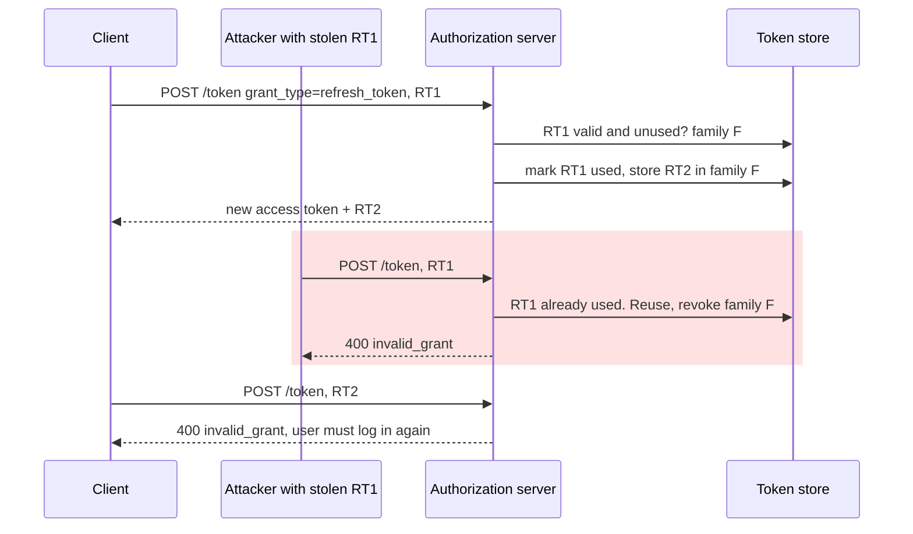

- Both the thief and the user are cut off. The user re-logs in. The thief cannot, because they lack the password and MFA.
- Side effect: two browser tabs refreshing at the same moment look exactly like theft. Fix it twice: single-flight refresh in the client, and a short grace window on the server. Auth0 calls it the "Rotation Overlap Period", there "to avoid concurrency issues".
- RFC 9700: "Refresh tokens for public clients MUST be sender-constrained or use refresh token rotation."
- Not every provider rotates with reuse detection. Microsoft Entra issues a new refresh token on each use but "doesn't revoke old refresh tokens when used to fetch new access tokens".

---

## 4. Grant types: pick by who the client is

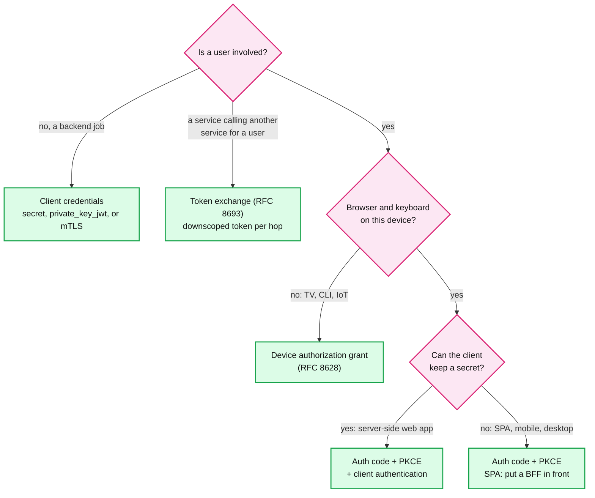

| Grant | Who uses it | User present | Status |
|---|---|---|---|
| Authorization code + PKCE | Web apps, SPAs, mobile, desktop | Yes | The default. PKCE required in OAuth 2.1 |
| Client credentials | Backend jobs, service to service | No | Kept |
| Device authorization (RFC 8628) | TVs, CLIs (`gh auth login`, `az login --use-device-code`), consoles | Yes, on another device | Separate RFC |
| Refresh token | Any client holding one | No, silent | Kept. Public clients must rotate or sender-constrain |
| Token exchange (RFC 8693) | Service A calling B on a user's behalf, workload federation (GCP STS) | Indirectly | Separate RFC |
| Implicit | Old SPAs | Yes | **Removed.** Token sits in the URL fragment. RFC 9700: "SHOULD NOT use the implicit grant" |
| Resource owner password (ROPC) | Legacy first-party apps | Yes | **Removed.** The app sees the password and MFA is impossible. RFC 9700: "MUST NOT be used" |

**Status of OAuth 2.1 itself.** As of 3 September 2026 it is still a draft (`draft-ietf-oauth-v2-1-16`). The working-group milestone is "Submit to IESG" in December 2026. In practice it is OAuth 2.0 plus RFC 9700 folded into one document: PKCE everywhere, implicit and ROPC gone, exact redirect URI matching, no bearer tokens in query strings.

### Device authorization grant (smart TV, CLI)

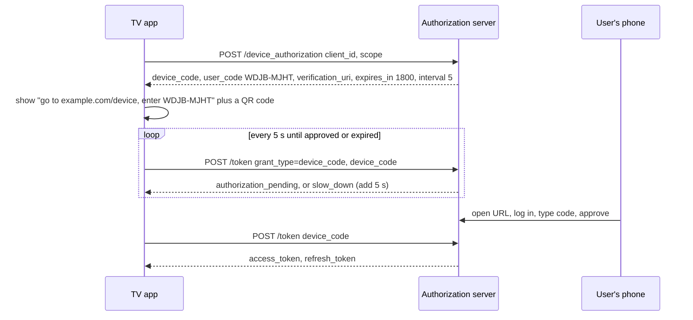

- RFC 8628's suggested user code is 8 characters from 20 consonants (`BCDFGHJKLMNPQRSTVWXZ`, no vowels so it never spells a word), so 20^8 ≈ **2.6 × 10^10** codes. Short expiry plus rate limiting on the entry page makes guessing hopeless.
- The real risk is phishing, not guessing. The attacker starts a flow and sends the victim the code ("enter this to join the meeting"). Microsoft reported Storm-2372 running exactly this "device code phishing" campaign since August 2024, with lures that look like WhatsApp, Signal and Teams. Mitigation: show the client name and the requesting location on the approval page, and allow the device grant only for clients that need it.

---

## 5. OpenID Connect: login on top of OAuth

Add `openid` to the scopes (`scope=openid profile email`) in the same code flow and the AS also returns an `id_token`. The AS is now called an OpenID Provider.

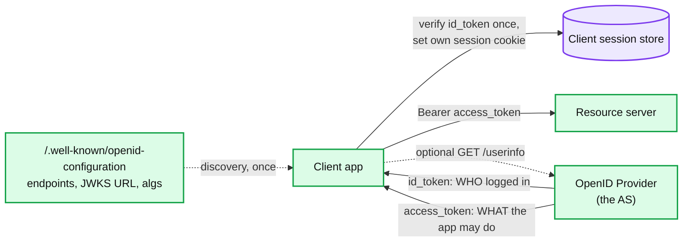

- **ID token claims that matter:** `iss`, `sub`, `aud` (= your `client_id`), `exp`, `iat`, `nonce`, `auth_time`, `amr` (how they authenticated, e.g. `mfa`).
- **Key users by `iss` + `sub`, never by email.** Emails change and get recycled. A recycled address keyed as identity is an account takeover.
- **Check `nonce`** equals the one you sent. It binds the ID token to this login and stops replay.
- **Check `aud` is your `client_id`.** This is the bug OIDC exists to prevent. Plain OAuth "login" goes: get an access token, call `/me`, log in as whoever `/me` returns. But any other app the victim ever authorized holds a valid access token for the victim, and can replay it to your app to log in as them. An ID token is addressed to *your* client, so it cannot be replayed from another app.
- **Who reads which token.** The client reads the ID token. The API reads the access token. Do not send ID tokens to APIs, and do not parse access tokens in the client: their format belongs to the API and can change. (Exception you will meet: Kubernetes' API server accepts OIDC ID tokens as bearer tokens, configured with `--oidc-issuer-url` and `--oidc-client-id`.)
- **OIDC vs SAML.** SAML (Security Assertion Markup Language) is XML assertions over browser POSTs, still dominant for enterprise SSO into SaaS apps. OIDC is JSON and JWT, and works for mobile and APIs. Enterprise identity providers (IdPs) speak both. User provisioning is a separate protocol, SCIM (see [hld/employee-ops-bundle](../hld/employee-ops-bundle/)).

---

## 6. OAuth in an HLD: the auth layer for a 10 M DAU app

**Requirements.** Web, iOS and Android clients, plus third-party developer apps. 50 microservices behind a gateway. Enterprise customers log in through their own Okta or Entra. A disabled account must lose API access within **5 minutes**. AS availability **99.99%**.

**Back-of-envelope.**

| Quantity | Math | Result |
|---|---|---|
| API calls | 10 M DAU x 200 calls/day = 2 B/day ÷ 86,400 | ~23k QPS avg, **~70k QPS peak** (3x) |
| Token refreshes | 15 min access TTL, ~1 h active/user/day = 4 refreshes x 10 M = 40 M/day | ~460/s avg, **~1.4k/s peak** |
| Logins | ~10% of DAU per day (refresh tokens last 30 days) = 1 M/day | ~12/s avg, ~35/s peak |
| Login CPU | Password hash (Argon2id or bcrypt) tuned to ~100 ms | 35/s x 0.1 s = **~4 cores** |
| Introspection instead of JWT | Every API call hits the AS | 70k QPS on the AS, **50x** the refresh load |
| JWT verify CPU, whole fleet | 70k/s ÷ 116k RS256 verifies/s/core | **0.6 core**. Even ES256 is 2.3 cores |
| AS signing CPU | 1.4k/s ÷ 2.9k RS256 signs/s/core | **0.5 core** |
| Live revocation list | 10k revocations/day, each kept only 15 min (until the token would expire anyway) | ~100 entries. A 100x spike is 10k entries, ~500 KB. Fits in every gateway's RAM |
| Refresh token store | 10 M users x ~2 devices x ~300 B | ~6 GB, ~1.4k writes/s peak |

The decision falls out of the numbers: **JWT access tokens validated at the gateway**, a 15-minute TTL as the revocation bound, and a pushed denylist to beat it.

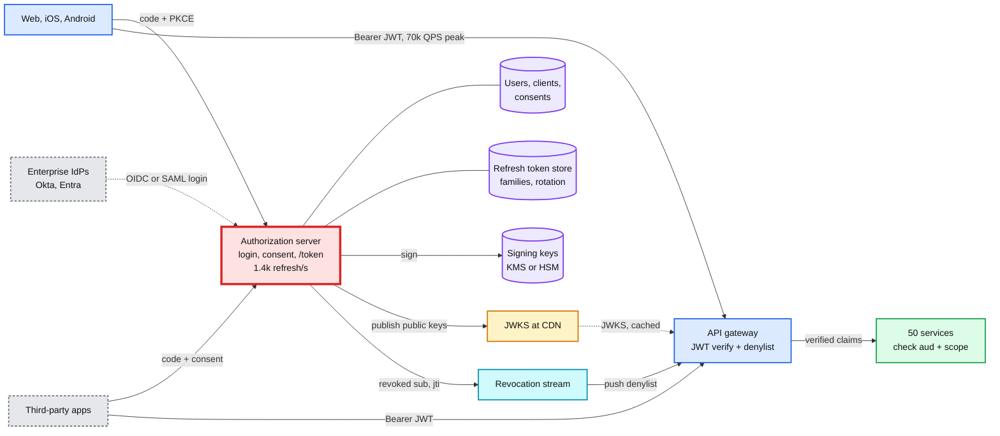

### Why the AS is red, and how to fix it

- **Blast radius.** AS down means no logins and no refreshes. JWTs keep working, so nothing happens for a few minutes. Then every active session dies within one access-token TTL (15 min). That is a full outage on a delay.
- **TTL is the degradation dial.** A longer TTL rides out a longer AS outage but slows revocation. Pick it from the revocation requirement (5 min) and cover the gap with the denylist, not by stretching the TTL.
- **Multi-region active-active AS.** Logins and refreshes go to the nearest region. Signing keys are replicated through KMS. The refresh token store is the hard part (below).
- **Shed load in the right order.** Refresh is cheap (one DB write, one sign) and keeps existing users alive. New logins are expensive (~100 ms of password hashing). Under overload, rate-limit logins first. See [rate-limiting-and-load-shedding.md](rate-limiting-and-load-shedding.md).
- **Thundering herd after a mass logout.** Revoking all 10 M refresh tokens means 10 M logins in about an hour: 2,800/s x 0.1 s = **~280 cores** of password hashing, against a 4-core baseline. Do not revoke everything unless the keys leaked. If you must, queue the login page.
- **Jitter expiry.** Tokens minted together expire together. Microsoft Entra assigns "a random value ranging between 60-90 minutes" so that it "prevents hourly spikes in traffic". Clients should also refresh at a random point between 75% and 90% of the lifetime.

### Consistency model, stated per piece

| Piece | Model | Why |
|---|---|---|
| Access token validity at the gateway | Eventual, bounded staleness = min(token TTL, denylist push lag of a few seconds) | Stateless verification is the point. The 5-min revocation requirement is met by the push, not the TTL |
| Refresh token rotation | Strong, per family (single writer) | Two regions rotating the same family at once either double-issue or trip reuse detection. Pin each family to a home region, or allow a short overlap window. See [replication-and-quorums.md](replication-and-quorums.md) |
| JWKS | Eventual, with a publish-before-use gap | Gateways cache keys. A new key must be visible everywhere before anything is signed with it |
| Consents and grants | Read-your-writes for the user who changed them | A user who revokes an app in settings expects it gone on the next page load |

### Signing key rotation without a 401 storm

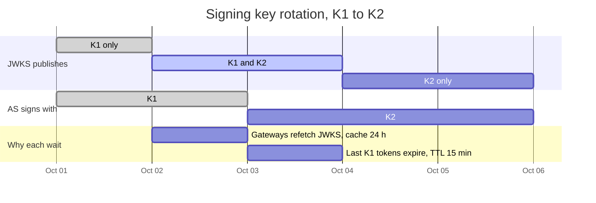

- **Publish, wait, sign, wait, retire.** Wait at least the longest JWKS cache TTL before signing with K2, and at least the longest token lifetime before removing K1.
- **Unknown `kid` at the gateway:** refetch JWKS once, then reject. Rate-limit refetches (e.g. one per 30 s), or an attacker can send random `kid` values and turn your gateways into a denial-of-service on the AS.
- **Emergency rotation** (key leaked) skips the waits. Every outstanding token dies, every client refreshes at once, and the thundering-herd point above applies.

---

## 7. Security rules (mostly from RFC 9700)

- **PKCE with `S256` for every client.**
- **Exact redirect URI matching.** RFC 9700: authorization servers "MUST utilize exact string matching". With prefix or wildcard matching, one open redirect anywhere on your domain ships codes to the attacker.
- **No tokens in the front channel.** That is why implicit and ROPC are gone.
- **Audience-restrict every token.** One `aud` per API. The client asks for it with the `resource` parameter (RFC 8707). A token that works on all 50 services is a skeleton key.
- **Least scope, incremental consent.** Ask for `calendar.read` when the user opens the calendar feature, not every scope at signup.
- **Sender-constrained tokens for high-value APIs.** DPoP (RFC 9449) or mTLS (RFC 8705) bind the token to a key the client holds. A stolen token alone is useless.

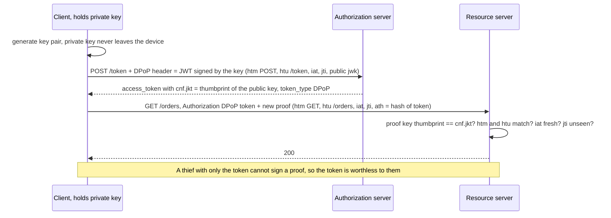

- **Where SPA tokens live.** Tokens in `localStorage` are readable by any cross-site scripting (XSS) bug. Prefer a **backend-for-frontend (BFF)**: a small server that is the OAuth client, keeps tokens server-side, and gives the browser only an `HttpOnly; Secure; SameSite` session cookie. On mobile, use the Keychain or Keystore.

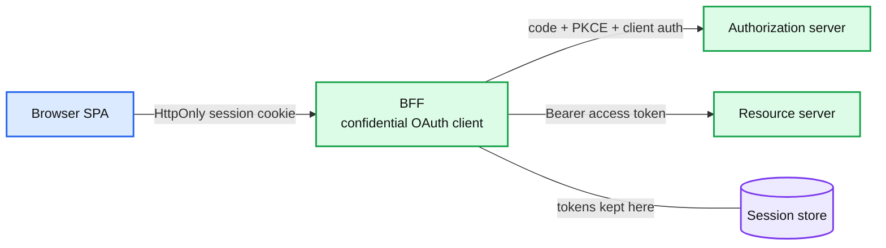

- **Mix-up attacks.** A client that talks to several authorization servers checks the `iss` parameter in the authorization response (RFC 9207). Otherwise a malicious AS can trick it into sending another AS's code to the wrong place.
- **Consent phishing.** A malicious app with a trusted-looking name asks for broad scopes, and users click Allow. Mitigate with app verification, admin consent for sensitive scopes, and "unverified app" warnings.
- **Never log tokens.** Redact `Authorization` headers, `code=` query parameters, and request bodies on `/token`.

---

## 8. Where you meet it

| System | OAuth piece | Detail |
|---|---|---|
| "Sign in with Google / Apple / GitHub" | OIDC, code flow | Key the user on `iss` + `sub`. Check `aud` and `nonce` |
| Third-party apps on GitHub, Slack, Google Workspace | Code flow, scopes, consent | The original use case. GitHub App user tokens expire after 8 h, refresh tokens after 6 months. Slack rotating tokens expire after 12 h |
| `gh auth login`, `az login --use-device-code`, smart TVs | Device grant | Poll every 5 s, user approves on a phone |
| Kubernetes API server | OIDC ID tokens as bearer tokens | `kubectl` gets a token from the company IdP |
| Pods calling AWS or GCP (EKS IRSA, GKE Workload Identity) | The cluster is an OIDC issuer, cloud STS trusts it | Pods get cloud credentials without static keys |
| GitHub Actions deploying to AWS or GCP | CI job's OIDC token exchanged for cloud credentials | No long-lived cloud secrets stored in CI |
| AI gateway and MCP servers ([hld/ai-gateway](../hld/ai-gateway/)) | MCP servers are OAuth resource servers | The MCP spec (2026-07-28) builds on OAuth 2.1 draft 13, requires RFC 9728 resource metadata and RFC 8707 resource indicators, and says servers "MUST NOT accept or transit any other tokens". The gateway uses a credential broker for upstream tokens |
| Employee offboarding ([hld/employee-ops-bundle](../hld/employee-ops-bundle/)) | Revoke grants at the IdP and in every SaaS app | A 5,000-person layoff is ~30k OAuth token cleanup calls against Google's API quota |
| Envoy ([envoy-07-security.md](../popular_systems_deepdive/envoy/envoy-07-security.md)) | `jwt_authn` filter validates JWTs, `oauth2` filter runs the code flow | Validation at the edge proxy, so services trust forwarded claims |
| Service-to-service inside one company | Client credentials, token exchange, or plain mTLS | Often mTLS identity plus the user's downscoped token |

---

## 9. Failure modes and what happens

| Failure | What happens | Mitigation |
|---|---|---|
| AS outage | No logins or refreshes. All sessions die within one access TTL | Multi-region AS. Shed logins before refreshes. TTL is the dial |
| Mass logout or AS recovery | 10 M re-logins, ~280 cores of password hashing, AS melts again | Don't revoke all unless keys leaked. Queue the login page. Rate-limit per IP |
| Synchronized expiry | Tokens minted after a deploy or outage all expire in the same minute | Randomize TTL (Entra does 60 to 90 min). Clients refresh at a random 75% to 90% |
| JWKS rotated wrong | Gateways see an unknown `kid`, 401 storm | Publish before use. Refetch on unknown `kid` |
| Unknown-`kid` flood | Each bogus `kid` triggers a JWKS fetch, DoS on the AS | Refetch at most once per 30 s |
| Concurrent refresh with rotation | Two tabs send RT1, the second trips reuse detection, user logged out | Single-flight refresh in the client. Server overlap window |
| Multi-region rotation race | RT rotated in region A, retry lands in region B before replication | Home region per family, or overlap window |
| Disabled user still has a valid JWT | Fired employee keeps API access until `exp` | Short TTL plus pushed denylist by `sub` |
| Missing `aud` check | Token for service A accepted by service B | One audience per token, checked everywhere |
| `alg: none` or RS/HS confusion | Forged tokens accepted | `alg` allow-list per key |
| Clock skew | Valid tokens rejected, or expired ones accepted | NTP. Leeway 30 to 60 s. See [leases-fencing-clocks.md](leases-fencing-clocks.md) |
| Token bloat | Every group and role in the JWT, header passes 8 KB, proxies return 431 or 400 | Keep entitlements server-side. Put a role id in the token, not 300 group names |
| Third-party integration breached | Attacker uses the integrator's stored tokens against your tenant | Narrow scopes per integration, IP allow-lists, anomaly alerts, bulk revoke by `client_id` |
| Consent phishing | Users authorize a malicious app | App verification, admin consent for sensitive scopes |
| Device code phishing | Victim types the attacker's user code | Show client name and location. Restrict the device grant |

Real incidents behind those rows:

| When | What happened | Lesson |
|---|---|---|
| Sep 2018, Facebook | Three bugs around "View As" let attackers steal access tokens. Facebook reset tokens for "almost 50 million" affected accounts plus "another 40 million" as a precaution, so "around 90 million people" had to log back in | A token minting path is the crown jewel. Mass token reset is the incident response, and it causes a login herd |
| Apr 2022, GitHub | Attacker "abused stolen OAuth user tokens issued to two third-party OAuth integrators, Heroku and Travis-CI, to download data from dozens of organizations, including npm" | Your security includes every integrator's token storage. Bulk revoke by client is a must-have |
| Jan 2024, Microsoft (Midnight Blizzard) | Password spray on "a legacy, non-production test tenant account that did not have multifactor authentication". A legacy test OAuth app was then used to grant malicious apps the Exchange `full_access_as_app` role and read corporate mailboxes | Old OAuth apps with powerful app-only permissions are standing access. Audit and delete them |
| Aug 2025, Salesloft Drift | "Beginning as early as Aug. 8, 2025 through at least Aug. 18, 2025", attackers used stolen OAuth tokens of the Drift integration to export data from Salesforce customer instances, then mined it for AWS keys and Snowflake tokens. On Aug. 20, Salesloft and Salesforce "revoked all active access and refresh tokens" for the app | Same as GitHub 2022, three years later. Refresh tokens held by a vendor are a long-lived key to your data |

---

## 10. Operating it: SLOs, alerts, migration

**SLOs.** `/token` and `/authorize` availability 99.99% (everything depends on them). Token endpoint p99 under 100 ms, excluding password hashing. JWKS served from a CDN.

**What pages someone at 3 am:**

- Gateway 401 rate jumps above baseline. Usually key rotation, JWKS fetch failure, or clock skew. One metric, three root causes, so tag 401s by reason (`bad_sig`, `expired`, `unknown_kid`, `aud`).
- `/token` 5xx rate or latency. Users get logged out within one TTL.
- Refresh reuse-detection rate spikes. Either token theft or a client release that broke single-flight refresh. The client version tag tells you which.
- Login failure rate per IP or ASN. Credential stuffing or password spray.

**Migration from API keys (or session cookies) to OAuth, zero downtime:**

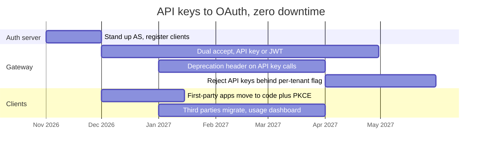

- The gateway maps both credential types to the same internal principal, so services never know which one was used.
- Rollback is a flag flip per tenant. Never delete API keys until the reject phase has run clean for a month.
- Track "calls per key per day". The long tail of a few forgotten cron jobs is the real migration cost.

---

## 11. Trade-offs

| Option | Gain | Cost |
|---|---|---|
| **JWT access tokens** | Local validation in 9 to 33 µs. AS off the hot path | No revocation until `exp`. ~1 KB per request. Key rotation discipline |
| **Opaque tokens + introspection** | Instant revocation. Small token. No claims leak to clients | AS on every request (70k QPS here). Extra 1 to 5 ms. AS outage is an instant API outage |
| **Short TTL (5 to 15 min)** | Revocation bounded | More refreshes. AS outage bites sooner |
| **Long TTL (hours)** | Survives AS outages | A disabled user keeps access for hours |
| **Bearer tokens** | Simple, universal | Stolen means usable |
| **DPoP or mTLS** | A stolen token is useless | Client key management, a signature per request, a `jti` replay cache on the API |
| **BFF for SPAs** | Tokens never in browser JavaScript | Extra hop, a stateful server, CSRF to handle on the cookie |
| **Tokens in the SPA** | No backend needed | Any XSS is an account takeover |
| **Buy (Okta, Auth0, Entra, Cognito)** | Security, compliance and on-call you do not staff | Priced per monthly active user, vendor rate limits, lock-in on login UX |
| **Self-host (Keycloak, Ory Hydra)** | Control, no per-user fee | You own patching, HA, key custody, and the 3 am page |
| **Session cookie, no OAuth** | Simplest for a first-party web app with one backend | No third-party access, no federation, awkward for mobile and many APIs |

**What a Staff answer refuses to build:** a home-grown authorization server or JWT library; the implicit or password grant; tokens in `localStorage`; introspection on every request at 70k QPS; 24-hour JWTs with no revocation path; one token whose audience is every service; and OAuth at all for a first-party web app with one backend, where a server-side session cookie is simpler and revocable.

---

## 12. Numbers worth memorizing

- **Authorization code:** at most 10 min (RFC 6749 recommendation), single use.
- **PKCE verifier:** 43 to 128 characters, "minimum of 256 bits of entropy". The S256 challenge is base64url of a 32-byte SHA-256, so **43 characters**.
- **Device grant:** poll every **5 s** by default, `slow_down` adds **5 s**. RFC example `expires_in` **1800 s**. 8-character base-20 user code, ~**2.6 × 10^10** values.
- **Access token defaults:** Okta org AS **60 min** (custom AS 5 min to 24 h). Entra **60 to 90 min**, random, 75 average. Auth0 **24 h** (86,400 s, max 30 days, a long default worth shortening). GitHub App user token **8 h**. Slack rotating token **12 h**.
- **Refresh token defaults:** Entra **90 days**, but **24 h** for SPAs. Okta org AS **90 days**. GitHub App **6 months**. Auth0 with rotation **30 days**. Google revokes a refresh token unused for **6 months**, keeps at most **100 per account per client** (the oldest is silently invalidated), and expires them in **7 days** while the app is in "Testing".
- **ID token:** Okta **60 min**, Auth0 **10 h** (36,000 s).
- **Signature cost, one Apple M-series core, OpenSSL 3.6:** RS256 verify ~**116k/s**, sign ~**2.9k/s**. ES256 verify ~**30k/s**, sign ~**88k/s**. RSA is cheap to verify and costly to sign. Verifies outnumber signs ~50 to 1, so RS256 is fine. ES256 buys a smaller token.
- **JWT size:** RS256 signature is 256 bytes = **342** base64url chars. ES256 is 64 bytes = **86** chars. A typical access token is **0.8 to 1.5 KB**. nginx's default header buffer is **8 KB**.
- **Clock leeway defaults:** Spring Security **60 s**, .NET **5 min**, PyJWT **0**.
- **The HLD math:** 10 M DAU means ~**70k** API QPS peak but only ~**1.4k/s** refreshes at a 15-min TTL. JWT validation keeps the AS **50x** less loaded than introspection would.

---

## 13. Interview soundbite

> "Users log in at our authorization server with the authorization code flow plus PKCE. Web, mobile and third-party apps all use it, and SPAs sit behind a BFF so tokens never touch browser JavaScript. Access tokens are RS256 JWTs with a 15-minute TTL, one audience per API, validated at the gateway against cached JWKS. That costs about 10 microseconds of CPU and no network call, so the AS sees 1.4k refreshes a second instead of 70k introspections. Refresh tokens are opaque rows with rotation and reuse detection, pinned to a home region so rotation stays strongly consistent. To meet the 5-minute revocation requirement, disabling a user pushes their `sub` to a denylist on every gateway. The AS is the single point of failure: if it is down, everyone is logged out within one TTL. So it runs active-active across regions, sheds new logins before refreshes, and token lifetimes are jittered so expiries never line up. Login uses OIDC: we key users on issuer plus subject, never email, and check `aud` and `nonce` on the ID token."

Follow-ups an interviewer will ask, in order of likelihood:

1. Why not put the access token straight in the redirect? (Section 2: front channel leaks, the code is useless without the verifier.)
2. What does PKCE protect against, if you already have `state`? (Section 2: code interception on mobile. `state` is CSRF.)
3. JWT or opaque token, and how do you revoke a JWT? (Sections 3 and 6: short TTL plus pushed denylist, the 50x math.)
4. A user is fired. How fast do they lose access? (Section 6: denylist push in seconds, TTL as the backstop.)
5. What happens when the authorization server is down? (Section 6, the red box: sessions die within one TTL, multi-region, shed logins first.)
6. How do you rotate signing keys without breaking anything? (Section 6 gantt: publish, wait, sign, wait, retire.)
7. Where does a SPA keep its tokens? (Section 7: BFF and `HttpOnly` cookie.)
8. OAuth vs OIDC: why can't I log users in with an access token? (Section 5: the `aud` replay bug.)
9. How does a TV or a CLI log in? (Section 4: device grant, and the phishing risk.)
10. A refresh token was stolen. How would you even notice? (Section 3: rotation with reuse detection, plus the alert in section 10.)
11. Service A calls B calls C for a user. Which token goes where? (Section 4: token exchange, downscoped per hop.)

Related: [signed-url.md](signed-url.md) (the same capability-token idea for blobs, HMAC vs public-key verifiers), [caching-patterns.md](caching-patterns.md) (JWKS and introspection caches), [leases-fencing-clocks.md](leases-fencing-clocks.md) (expiry on the verifier's clock), [rate-limiting-and-load-shedding.md](rate-limiting-and-load-shedding.md) (protect `/token` and the login page), [replication-and-quorums.md](replication-and-quorums.md) (multi-region refresh token store), [hld/distributed-denylist](../hld/distributed-denylist/) (pushing revocations to every gateway), [hld/ai-gateway](../hld/ai-gateway/) (OAuth for MCP servers), [hld/employee-ops-bundle](../hld/employee-ops-bundle/) (revoking grants at offboarding).

Sources: RFC 6749, 7636, 8628, 9449, 9700 (rfc-editor.org); OAuth 2.1 draft status (datatracker.ietf.org/doc/draft-ietf-oauth-v2-1); Okta OIDC reference; Microsoft Entra access-token and refresh-token docs; Auth0 token lifetime and rotation docs; Google OAuth 2.0 overview; GitHub and Slack token docs; MCP authorization spec 2026-07-28; Facebook security update (2018-09-28); GitHub security alert (2022-04-15); Microsoft Midnight Blizzard guidance (2024-01-25); Google Threat Intelligence on Salesloft Drift (2025); Microsoft Storm-2372 (2025-02-13). Signature speeds measured locally with `openssl speed`, Oct 2026.
