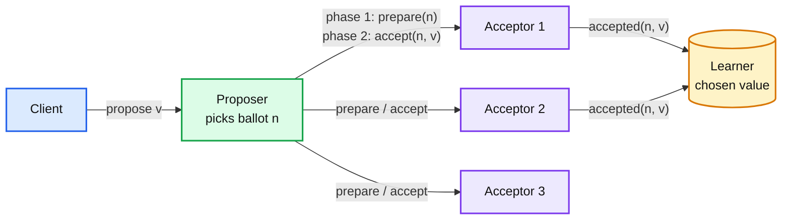
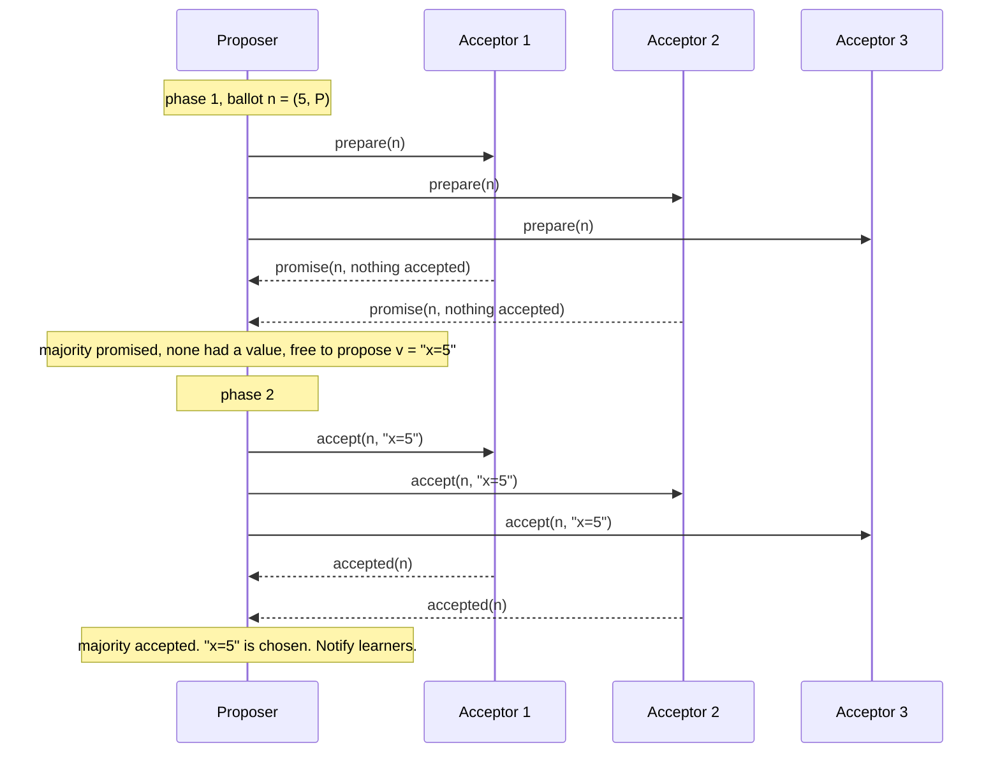
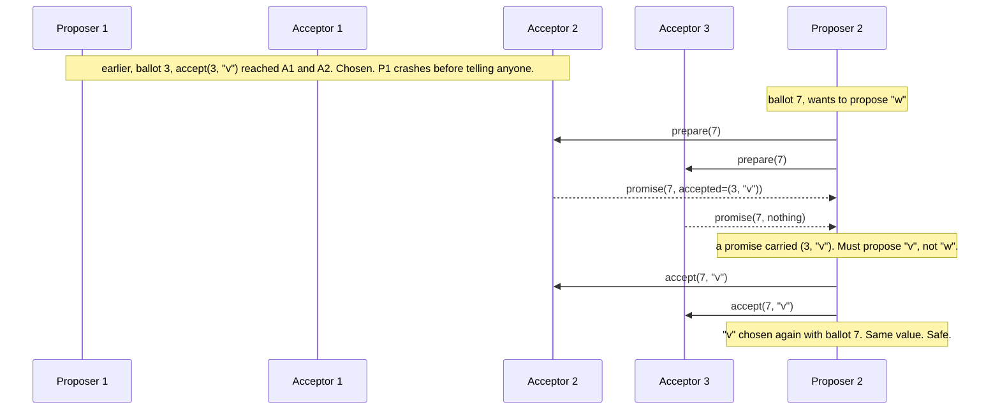
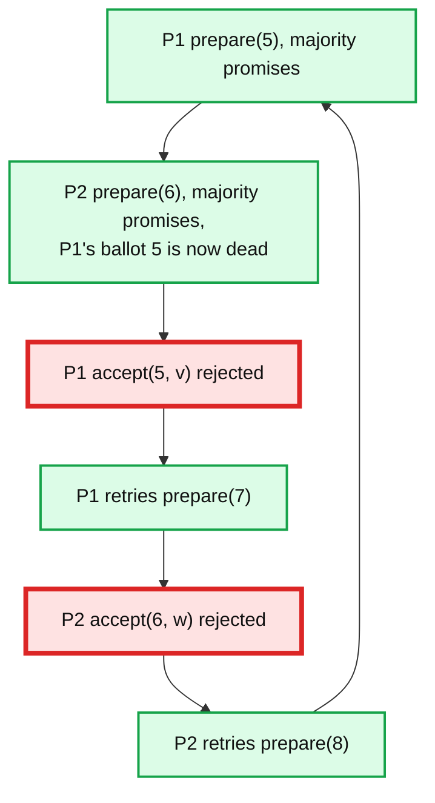
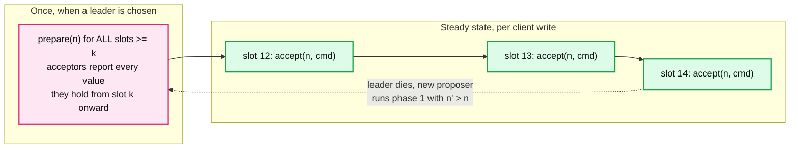
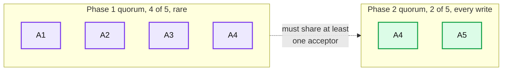

# Concept: Paxos Consensus

> One-liner: Paxos lets a set of unreliable servers agree on one value by having a proposer first reserve a majority with a unique ballot number, then ask that same majority to accept a value, with the rule that the proposer must reuse any value the majority has already accepted.

Depth target: high-level, same as [raft.md](raft.md). Read that one first. Paxos is the theory Raft was simplified from, so most of the vocabulary carries over.

---

## 1. Mental model

Raft asks "who is the leader, then copy their log". Paxos asks a smaller question first: **how do N servers pick one value, once, and never change their mind, even if servers crash and messages are lost?** That is *single-decree Paxos*. Run it once per log slot and you get *Multi-Paxos*, which is a replicated log like Raft.

- A value is **chosen** the moment a majority of acceptors have accepted the same `(ballot, value)`. Nobody may know it yet. That is fine. It is chosen.
- Once chosen, every later ballot is forced to carry the same value. That is the entire safety argument.
- Tolerates `f` failures with `2f + 1` acceptors, same as Raft.

**Why Paxos exists.** Leslie Lamport, 1989 (published 1998, "The Part-Time Parliament"; re-explained in 2001, "Paxos Made Simple"). It is the first proven-safe consensus protocol for asynchronous networks with crash failures. Almost every other one (Raft, ZAB, Viewstamped Replication) is a specialization of it.

---

## 2. The three roles

Unlike Raft, roles are not server states. One process usually plays all three.

| Role | Does what | Persists |
|---|---|---|
| **Proposer** | Picks a ballot number, drives the two phases, retries on conflict. | nothing required (but keep the last ballot to avoid reusing one) |
| **Acceptor** | The memory of the system. Promises, accepts, and refuses stale ballots. | `promisedBallot`, `acceptedBallot`, `acceptedValue` |
| **Learner** | Finds out which value was chosen. Often just the proposer, or every acceptor. | nothing |

**Ballot numbers** must be unique and totally ordered across proposers. Standard trick: `(counter, serverId)` compared lexicographically. Two proposers can never produce the same ballot.

---

## 3. Single-decree Paxos: the two phases

**Phase 1, prepare / promise.**
- Proposer sends `prepare(n)` to all acceptors.
- Acceptor: if `n > promisedBallot`, set `promisedBallot = n` and reply `promise(n, acceptedBallot, acceptedValue)`. Otherwise reject.
- A promise means "I will never accept anything with a ballot lower than n".

**Phase 2, accept / accepted.**
- Once a majority has promised, the proposer chooses the value:
  - If **any** promise carried an accepted value, use the value from the **highest** `acceptedBallot`.
  - Only if **no** promise carried a value may the proposer use its own.
- Send `accept(n, v)`. Acceptor accepts if `n >= promisedBallot`, persists `(n, v)`, replies `accepted`.
- Majority accepted means chosen.

Two round trips minimum. Every acceptor reply must be **fsynced first**, otherwise a crashed acceptor can forget a promise and let two values be chosen.

---

## 4. Why it is safe: the value-adoption rule

The rule "reuse the highest accepted value you see in phase 1" is the whole proof. Here is the case where it matters.

Why the majority intersection guarantees this: any majority P2 talks to in phase 1 overlaps with the majority that accepted `v`. At least one acceptor in the overlap reports `v`, and it reports it with the highest ballot seen, so P2 is forced to carry it. Once a value is chosen it "infects" every future ballot.

Note what P2's own value `w` becomes: dropped. The client who sent `w` gets told "the chosen value is v, retry". This is normal in Paxos and is where Cassandra's `[applied]=false` on a lightweight transaction comes from.

| Property | Plain English |
|---|---|
| Nontriviality | Only a proposed value can be chosen. |
| Safety (agreement) | At most one value is ever chosen. |
| Liveness | Some proposed value is eventually chosen, **if** a single proposer runs alone for long enough. |

Liveness is conditional. Read the next section.

---

## 5. Liveness problem: dueling proposers

Paxos is safe with any number of proposers but can **livelock**.

Standard fixes, in the order real systems use them:

1. **Randomized backoff** before retrying. Cheap, works most of the time.
2. **Distinguished proposer** (a leader). Elect one proposer via a lease or failure detector. Everyone routes proposals through it. This is not needed for safety, only for liveness, so a wrong election is harmless. This is the step that turns Paxos into Multi-Paxos.

Contrast with Raft, where the leader is baked into the safety rules. In Paxos the leader is an optimization.

---

## 6. Multi-Paxos: a log of decisions

Running full two-phase Paxos per log entry costs 2 RTTs per write. Multi-Paxos removes phase 1 from the steady state.

How it works:

- Each log position is an independent Paxos instance ("slot").
- The leader runs **one** phase 1 with ballot `n` that covers every slot from `k` onward. Acceptors reply with everything they have accepted at or after `k`. The leader re-proposes those values in their slots, then fills the rest.
- After that, each new command is a single phase 2 round: 1 RTT + 1 fsync, same as Raft's `AppendEntries`.
- If a new proposer shows up with a higher ballot, the old leader's phase 2 messages start getting rejected. It knows it has been replaced and steps aside.

Where Multi-Paxos differs from Raft, and why it is harder to build:

| Aspect | Multi-Paxos | Raft |
|---|---|---|
| Holes in the log | Allowed. Slot 13 can be chosen before slot 12. Must fill holes with **no-op** entries before applying 14. | Never. Log is a contiguous prefix. |
| Who can become leader | Anyone with the highest ballot. It then **learns** missing entries in phase 1. | Only a server whose log is already most up to date. |
| Leader election | Not specified. Bring your own failure detector and lease. | Specified: randomized timeouts and `RequestVote`. |
| Commit tracking | Each slot chosen independently. Need a separate "executed up to" watermark. | One `commitIndex`. |
| Out-of-order commit | Yes. Independent slots can be in flight in parallel. | No. Head-of-line blocking on a slow entry. |
| Paper-to-code gap | Large. Every real Multi-Paxos is a custom design. | Small. Paper includes the full state and RPCs. |

The Raft paper's line: "Raft is Multi-Paxos with a strong leader, no holes, and a specified election." That is the fair summary.

---

## 7. Learning, compaction, membership

**Learning.** Acceptors send `accepted` to all learners (N x M messages) or only to the proposer, which then broadcasts `chosen` (fewer messages, one extra hop). Most systems do the second. A learner that missed a slot asks any acceptor.

**Log compaction.** Same idea as Raft: snapshot the state machine at slot `k`, discard slots below. Acceptors must keep accepted-but-not-yet-known-chosen entries until they learn the outcome.

**Membership change.** Lamport's answer: the configuration for slot `i` is itself a value decided at slot `i - alpha`. So the set of acceptors is part of the log, decided `alpha` slots ahead, which lets `alpha` slots be in flight in parallel. Elegant, but every implementation ends up doing something simpler, usually joint or single-server changes borrowed from the Raft world.

---

## 8. The Paxos family

Paxos is a design space, not one protocol. The variants you will hear named:

| Variant | Change | Trade |
|---|---|---|
| **Basic / single-decree** | One value, 2 RTTs. | The proof. Rarely used bare. |
| **Multi-Paxos** | Stable leader, phase 1 amortized, 1 RTT per write. | Needs a leader election bolted on. |
| **Fast Paxos** | Clients send directly to acceptors, skipping the leader. 1 RTT when there is no conflict. | Needs a larger quorum (3/4 instead of 1/2) and a recovery path on collision. |
| **Cheap Paxos** | `f + 1` main acceptors plus `f` cheap spares that only wake on failure. | Slower recovery, lower cost. |
| **Flexible Paxos (2016)** | Phase 1 and phase 2 quorums only need to intersect **each other**, not themselves. Phase 2 can be tiny if phase 1 is large. | Writes touch fewer nodes; leader election touches more. Same insight powers Raft's "leader lease" variants. |
| **EPaxos (2013)** | Leaderless. Any replica commits commands that do not conflict in 1 RTT. Builds a dependency graph, executes in dependency order. | Complex execution; slow path on conflicts. |
| **Vertical Paxos** | Reconfiguration driven by an external master. | Used for primary-backup style storage. |

Flexible Paxos deserves one diagram because it changes the "majority" assumption everyone repeats:

Reading: `|Q1| + |Q2| > N` is enough. Writes ack after 2 of 5 acceptors, so p99 write latency is the second fastest, not the third. The cost is that a new leader needs 4 of 5 alive to take over. Pick this when writes are hot and leader changes are rare.

---

## 9. Client interaction

Same problems as Raft, same answers, one extra wrinkle.

- **Exactly once**: client id + sequence number stored in the state machine.
- **Linearizable reads**: log the read, or leader lease. Multi-Paxos leaders usually hold a **time-based lease** from a majority of acceptors, and serve reads locally while it is valid. Spanner does this with TrueTime bounding the clock error.
- **Rejected proposals**: because a proposer can be forced to adopt another value (section 4), the client must be told "your value was not chosen, the chosen one was X". Compare-and-set style APIs (Cassandra LWT, etcd `Txn`) surface this directly.

---

## 10. Failure modes and what happens

| Failure | What Paxos does | Client-visible effect |
|---|---|---|
| Acceptor crashes | Nothing, if a majority remains. On restart it reloads promised/accepted state from disk. | None. |
| Proposer / leader crashes | Any other proposer can run phase 1 with a higher ballot and learn what was in flight. | Writes stall until someone notices and takes over. Delay = failure detector timeout. |
| Two proposers at once | Safe. Possibly livelock (section 5). | Latency spikes, or stall until backoff resolves it. |
| Lose majority of acceptors | No value can be chosen. | Total write outage. CP system. |
| Acceptor loses disk state | May promise ballot 5 then accept ballot 3 after restart. Two values can be chosen. | Silent safety violation. Paxos assumes stable storage. |
| Message reordering / duplication | Handled by design. Ballot numbers make every message idempotent. | None. Paxos does not assume FIFO channels. |
| Clock skew | Only affects lease-based reads and lease-based leader election. Core protocol has no clocks. | Stale reads if leases are used with bad clocks. |

---

## 11. Where you meet Paxos

| System | What Paxos protects | Flavor |
|---|---|---|
| Google Chubby | Lock service, master election for GFS and Bigtable | Multi-Paxos |
| Google Spanner | Every tablet's replica group; 2PC on top for cross-group transactions | Multi-Paxos with TrueTime leader leases |
| Google Megastore | Per-entity-group log, writes can start at any replica | Multi-Paxos with fast local reads |
| Cassandra LWT (`IF NOT EXISTS`) | Compare-and-set on one partition | Single-decree Paxos, 4 round trips per op (prepare, read, propose, commit) |
| Ceph MON | Cluster maps | Multi-Paxos |
| Microsoft Azure Storage | Stream manager metadata | Paxos-based |
| Neo4j Causal Cluster, Amazon (internal), Apple FoundationDB | Coordination, config | Paxos-based |

Everything else you name (etcd, Consul, CockroachDB, TiKV, KRaft) is Raft. In practice Raft won the open-source world; Paxos won inside Google.

---

## 12. Trade-offs

| Gain | Cost |
|---|---|
| Provably safe with any number of proposers, any message loss or reordering, no clocks | Liveness is not guaranteed. You must add a leader or backoff yourself. |
| Leader is an optimization, not a safety requirement. Leader change is just "someone else runs phase 1". | Because the leader is unspecified, every implementation invents its own election, lease and hole-filling logic. Bugs live there. |
| Slots are independent, so commits can be out of order and pipelined freely | Holes must be filled with no-ops before execution. Extra watermark bookkeeping. |
| Quorum flexibility (Flexible Paxos, Fast Paxos) gives latency knobs Raft does not have | Each knob is another proof obligation. Easy to break the intersection property. |
| Same fault tolerance as Raft: `f` of `2f + 1` | Same availability cliff: lose a majority, lose writes. |

**What a Staff answer refuses to build:** a hand-rolled Multi-Paxos when a Raft library exists (the paper leaves too much unspecified), Fast Paxos in a workload with real write contention (the collision recovery erases the gain), and single-decree Paxos for a high-throughput log (2 RTTs per entry).

---

## 13. Numbers worth memorizing

- Basic Paxos: **2 RTTs** and **2 fsyncs** per chosen value.
- Multi-Paxos steady state: **1 RTT**, 1 fsync. Same as Raft.
- Fast Paxos: 1 RTT with a **3/4** quorum instead of 1/2.
- Flexible Paxos: `|Q1| + |Q2| > N` is the only requirement.
- Cassandra LWT: **4 round trips** per write, roughly 4x the latency of a normal `QUORUM` write.
- Acceptor state: three fields, `promisedBallot`, `acceptedBallot`, `acceptedValue`. All on disk before replying.
- Tolerates `f` failures with `2f + 1` acceptors.

---

## 14. Interview soundbite

> "Paxos picks one value with two majority rounds: prepare, which reserves a ballot number and reveals anything already accepted, and accept, which commits a value. The safety rule is that a proposer must adopt the highest-ballot value it saw in phase 1, so once a majority accepts something, every later ballot carries it. Multi-Paxos amortizes phase 1 across a whole log by keeping a stable leader, and at that point it is essentially Raft with holes allowed and the election left up to you."

Follow-ups an interviewer will ask:

1. Why must the proposer adopt the highest accepted value rather than its own? (Section 4. Majority overlap.)
2. Can two values ever be chosen? What if an acceptor forgets its promise? (No, and disk durability is the assumption.)
3. What is the difference between "chosen" and "learned"? (Chosen is a fact about acceptors. Learned is who knows.)
4. Why does Paxos need a leader if it is safe without one? (Liveness, section 5.)
5. How is Multi-Paxos different from Raft in one sentence? (Section 6 table.)
6. Why do Cassandra lightweight transactions cost 4 round trips? (Prepare, read current value, propose, commit. Single-decree Paxos plus a read plus a learn phase.)
7. What does Flexible Paxos let you tune? (Phase 2 quorum size, so write latency vs leader-election availability.)

Related: [raft.md](raft.md), `popular_systems_deepdive/cassandra/cassandra-05-coordinator-consistency.md` (LWT), `hld/kv-store-wal/`.
