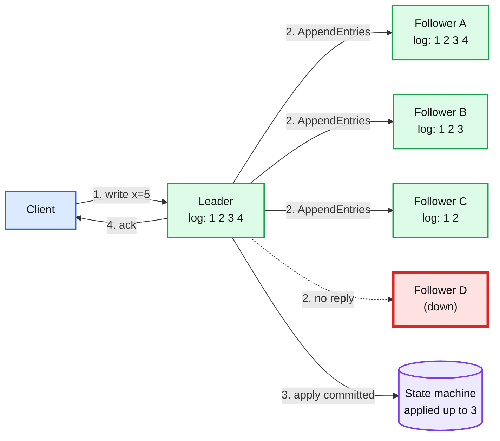
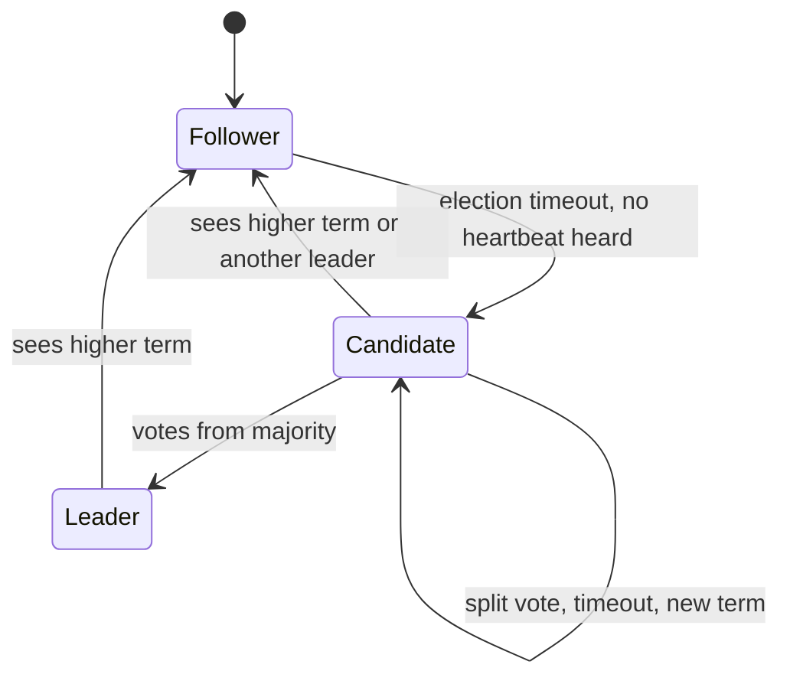
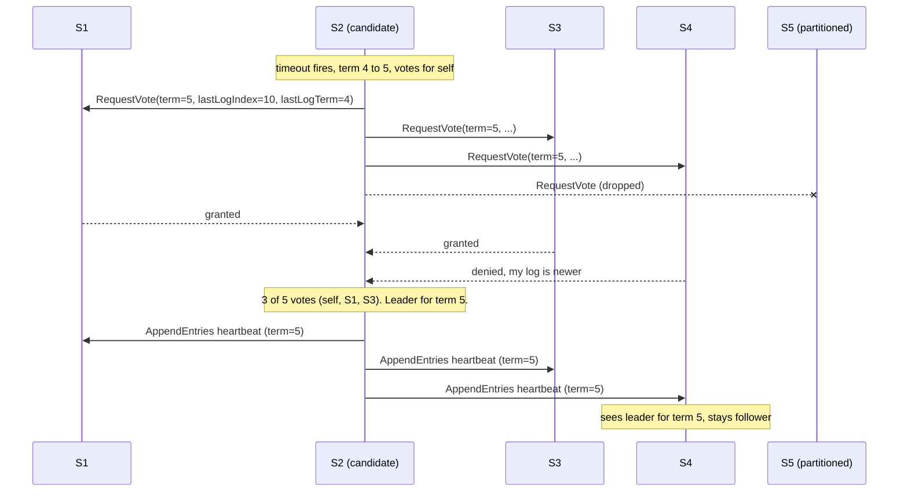
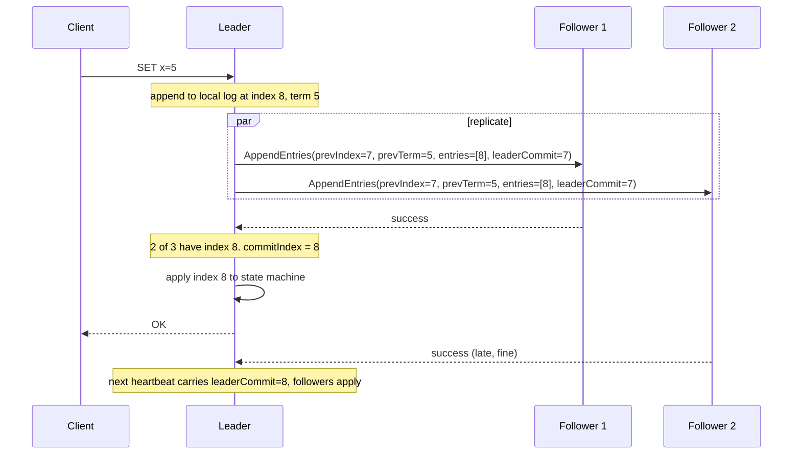
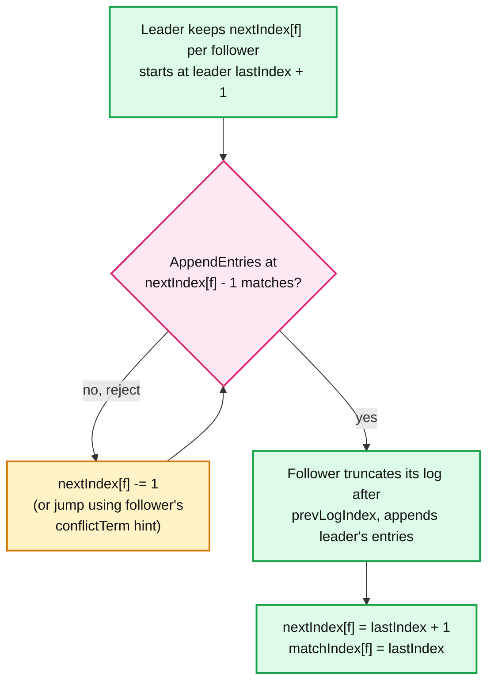
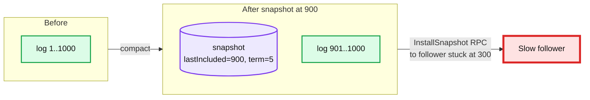
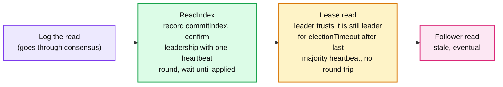

# Concept: Raft Consensus

> One-liner: Raft keeps N servers agreeing on one ordered log of commands by electing a single leader, having the leader append entries to every follower, and calling an entry committed once a majority has stored it.

Depth target: high-level. Every feature of the protocol is covered, but at the "explain it on a whiteboard" level, not the source-verified level of `popular_systems_deepdive/`.

---

## 1. Mental model

Raft is a **replicated state machine**. Each server holds the same log. If every server applies the same log in the same order to a deterministic state machine, every server ends up in the same state. Raft's only job is to make the logs identical.

- 5 servers, majority = 3. Entry 4 is on the leader and follower A only. Not committed yet.
- Entry 3 is on 3 servers. Committed. Safe to apply and ack.
- Follower D being down changes nothing. Raft tolerates `(N-1)/2` failures: 1 of 3, 2 of 5.

**Why Raft exists.** Paxos is correct but famously hard to understand and to turn into a real system. Raft (Ongaro and Ousterhout, 2014) was designed for understandability: one leader, a log that only flows leader to follower, and a small set of rules.

---

## 2. The three roles

Every server is in exactly one of three states. Time is divided into **terms**, numbered integers that only go up. Each term has at most one leader.

| Role | Does what | Count |
|---|---|---|
| Follower | Passive. Responds to RPCs. Resets its timer on every leader heartbeat. | N - 1 |
| Candidate | Asks for votes to become leader for a new term. | transient |
| Leader | Takes all client writes, replicates the log, sends heartbeats. | exactly 1 per term |

**Term rule (the most important rule).** Every RPC carries the sender's term. If a server sees a term higher than its own, it adopts that term and drops to follower. If it sees a lower term, it rejects the RPC. This one rule kills stale leaders.

---

## 3. Only two RPCs

| RPC | Who sends | Purpose | Key fields |
|---|---|---|---|
| `RequestVote` | Candidate | "Vote for me in term T" | `term`, `candidateId`, `lastLogIndex`, `lastLogTerm` |
| `AppendEntries` | Leader | Replicate entries, or heartbeat if empty | `term`, `prevLogIndex`, `prevLogTerm`, `entries[]`, `leaderCommit` |

A third one, `InstallSnapshot`, exists for log compaction (section 7). That is the whole wire protocol.

---

## 4. Leader election

**Trigger.** A follower hears nothing from a leader for one *election timeout* (randomized, typically 150 to 300 ms). It assumes the leader is dead.

Rules that make it safe:

- **One vote per term.** A server votes for at most one candidate per term, first come first served. Persisted to disk before replying.
- **Majority wins.** A candidate needs `N/2 + 1` votes including its own. Two majorities always overlap, so two leaders in one term is impossible.
- **Log up-to-date check (election restriction).** A voter denies the vote if its own log is "more up to date" than the candidate's: compare last entry's term, then last entry's index. This guarantees the new leader already has every committed entry. No catch-up from followers is ever needed.
- **Randomized timeouts break split votes.** If two candidates start together and split the vote, both time out at different random moments and one usually wins the retry. Rule of thumb: `broadcastTime << electionTimeout << MTBF` (roughly 1 ms << 200 ms << months).

---

## 5. Log replication

The leader is the only writer. Log entries flow in one direction only: leader to followers. Followers never push, and a follower's conflicting entries are simply overwritten.

Each entry = `(index, term, command)`. Two indexes drive everything:

- **`commitIndex`**: highest entry known to be on a majority. Advances on the leader when a majority acks, and on followers via `leaderCommit` in the next `AppendEntries`.
- **`lastApplied`**: highest entry fed to the state machine. Always `<= commitIndex`.

**Consistency check.** Every `AppendEntries` carries `prevLogIndex` and `prevLogTerm`. The follower rejects the append if its entry at `prevLogIndex` does not have `prevLogTerm`. By induction, if the check passes, the two logs are identical up to that point. This is the **Log Matching Property**: same index + same term implies same command and same prefix.

**Repairing a divergent follower.**

A follower that was down for an hour just gets walked back and refilled. No special recovery mode.

---

## 6. Safety: the one subtle rule

Everything above is intuitive. The one place people get Raft wrong:

> **A leader may only commit entries from its own term by counting replicas.** Entries from earlier terms get committed indirectly, when a current-term entry that sits after them commits.

Why: a leader could replicate an old-term entry to a majority, crash, and a new leader with a *different* entry at that index (legitimately, because it never saw the first one committed) could win the election and overwrite it. Counting only current-term entries closes that window. This is Figure 8 of the Raft paper and a favorite interview probe.

The guarantees Raft delivers, in the order they build on each other:

| Property | Plain English |
|---|---|
| Election Safety | At most one leader per term. |
| Leader Append-Only | A leader never overwrites or deletes its own entries. |
| Log Matching | Same index and term means the same entry and same history before it. |
| Leader Completeness | Once committed, an entry is in every future leader's log. |
| State Machine Safety | No two servers apply different commands at the same index. |

**What must be on disk before replying to any RPC:** `currentTerm`, `votedFor`, and the `log`. Everything else (`commitIndex`, `nextIndex[]`, `matchIndex[]`) is rebuilt after a restart. If you skip the fsync here, a crash can let a server vote twice in one term and produce two leaders.

---

## 7. Log compaction with snapshots

The log cannot grow forever. Each server independently snapshots its state machine at some `lastIncludedIndex`, records `lastIncludedTerm`, and discards the log up to there.

- **`InstallSnapshot` RPC**: when the leader needs to send index 300 but has compacted past it, it streams the whole snapshot in chunks instead. The follower discards its log and starts from the snapshot.
- Snapshots are local decisions. No consensus needed, because everything below `commitIndex` is already agreed.
- Cost: a snapshot of a large state machine stalls or copies memory. Real systems use copy-on-write (etcd uses a B-tree with immutable pages; some use fork).

---

## 8. Cluster membership changes

Adding or removing servers changes what "majority" means. If you switch configs atomically on every server you cannot, so for a moment two majorities from old and new configs could elect two leaders.

Two safe approaches:

| Approach | How | Used by |
|---|---|---|
| **Joint consensus** (original paper) | Go through an intermediate config `C_old,new` where decisions need a majority of *both* old and new. Then commit `C_new`. | Rarely implemented as-is |
| **Single-server changes** (Ongaro thesis, 2014) | Only add or remove one server at a time. Any old and new majority must overlap, so no transition state is needed. | etcd, Consul, most real systems |

Extra rules that real systems add:

- A new server joins as a **non-voting learner** first, catches up via snapshot, then is promoted. Otherwise a new empty server drags availability down.
- A removed leader keeps leading until `C_new` commits, then steps down.
- Removed servers can still time out and start disruptive elections. Fix: **pre-vote** (section 10).

---

## 9. Client interaction

Raft makes the log linearizable. Making the *client-visible* system linearizable takes two more pieces.

**Exactly-once writes.** A client retries after a timeout, but the first attempt may have committed. Fix: client attaches `(clientId, sequenceNo)` to every command; the state machine keeps the last response per client and returns it on a duplicate. Sessions expire with a lease.

**Reads.** Naive "leader answers from local state" is unsafe: a deposed leader in a partition may not know it is deposed and serves stale data. Three options:

- **Log the read**: simplest, slowest. One disk write per read.
- **ReadIndex** (etcd default): one network round trip, no disk write. Linearizable.
- **Lease read**: zero round trips, but depends on bounded clock drift. If clocks skew, you can read stale data. Pick this only if you accept that risk.
- **Follower read**: fast and scalable, not linearizable. Fine for dashboards, wrong for locks.

A fresh leader must also commit one **no-op entry** in its new term before serving reads, so that its `commitIndex` is known to be current (this is the section 6 rule applied to reads).

---

## 10. Practical additions every real implementation has

The paper is a skeleton. Production Raft (etcd/raft, HashiCorp raft, TiKV) adds:

| Addition | Problem it fixes |
|---|---|
| **Pre-vote** | A partitioned server bumps its term forever, then rejoins and knocks out a healthy leader. Pre-vote asks "would you vote for me?" without incrementing the term. Only if a majority says yes does a real election start. |
| **Check quorum / leader stepdown** | A leader in a minority partition keeps thinking it leads. If it fails to hear from a majority for an election timeout, it steps down. |
| **Leadership transfer** | Graceful handoff before a planned reboot. Leader catches up the target, then tells it to start an election immediately. Avoids a full election-timeout gap. |
| **Batching and pipelining** | Sending one `AppendEntries` per client request is slow. Leaders batch many entries per RPC and keep several RPCs in flight per follower. |
| **Learners / non-voters** | Add capacity for reads and safe joins without changing quorum size. |
| **Async apply** | Apply to the state machine on a separate thread so replication is not blocked by slow state machine writes. |
| **Multi-Raft** | One Raft group per shard (CockroachDB, TiKV). Thousands of groups per node, heartbeats coalesced per node pair. |

---

## 11. Failure modes and what happens

| Failure | What Raft does | Client-visible effect |
|---|---|---|
| Follower crashes | Leader keeps retrying `AppendEntries`. On return, follower is walked back and refilled. | None, if a majority is still up. |
| Leader crashes | Followers time out, elect a new leader from those with the most complete log. | Writes unavailable for ~1 election timeout (hundreds of ms). Uncommitted entries may be lost; committed never are. |
| Network partition, leader in minority | Minority leader cannot commit. Majority side elects a new leader with a higher term. Old leader steps down when partition heals. | Clients on the minority side see timeouts. No split brain for committed data. |
| Lose majority (3 of 5 down) | Cluster is fully unavailable for writes. Safety intact, liveness gone. | Total write outage. This is the CAP choice: Raft is CP. |
| Disk lies (no fsync) | Server may vote twice or forget log entries. Two leaders in a term become possible. | Silent data loss. Raft's guarantees assume durable `term`, `votedFor`, `log`. |
| Slow follower | Leader falls back to `InstallSnapshot`. | Higher tail latency on leader during snapshot transfer. |
| Clock skew | Only matters for lease reads. Elections use timeouts, not wall clocks. | Stale reads if lease reads are enabled. |

---

## 12. Where you meet Raft

| System | What Raft protects |
|---|---|
| etcd (and so Kubernetes) | The entire cluster state store |
| Consul, Nomad | Service catalog, KV, scheduler state |
| CockroachDB, TiKV / TiDB, YugabyteDB | Every data range is its own Raft group (multi-Raft) |
| Kafka KRaft | Cluster metadata, replacing ZooKeeper |
| MongoDB replica sets | Election protocol is Raft-derived (pull-based replication, not push) |
| RabbitMQ quorum queues, NATS JetStream | Message replication |

Raft vs the alternatives:

| | Raft | Multi-Paxos | ZAB (ZooKeeper) |
|---|---|---|---|
| Leader | Strong, required for progress | Optional in theory, always used in practice | Strong |
| Log holes | Never. Log is contiguous. | Allowed, filled later | Never |
| Who can be leader | Only a server with the most complete log | Anyone, then catch up | Most complete log |
| Understandability | Designed for it | Notoriously hard | Medium |
| Practical difference | Small. Multi-Paxos with a stable leader and no holes is basically Raft. | | |

---

## 13. Trade-offs

| Gain | Cost |
|---|---|
| Linearizable writes, no data loss on `(N-1)/2` failures | Every write pays 1 disk fsync on a majority + 1 RTT. p99 is bounded by the slowest of the fastest majority. |
| Single leader keeps the protocol simple | Leader is the write throughput ceiling. All writes go through one node. Scale by sharding into many Raft groups, not by adding voters. |
| Majority quorum | Availability drops to zero when a majority is lost. 5 voters across 3 zones is the usual shape. |
| No holes in the log | A slow entry blocks everything behind it (head-of-line). Paxos can commit out of order. |
| Elections are automatic | Every leader failover costs an election timeout of unavailability. Tune it: lower is faster failover, higher is fewer false elections over flaky networks. |
| Adding voters increases fault tolerance | Each extra voter adds a replication target and grows the "majority" you must wait on. 7 voters is rarely worth it. Use learners instead. |

**What a Staff answer refuses to build:** a Raft group with 2 or 4 voters (same fault tolerance as 1 or 3, worse latency), cross-region Raft for a latency-sensitive write path (every write pays a cross-region RTT), and a hand-rolled Raft when etcd/raft or HashiCorp raft exists.

---

## 14. Numbers worth memorizing

- Tolerates `f` failures with `2f + 1` servers: 3 servers tolerate 1, 5 tolerate 2.
- Election timeout: 150 to 300 ms in the paper. etcd default: 1000 ms election, 100 ms heartbeat.
- Write latency floor: 1 majority RTT + 1 fsync. Same-zone: ~1 to 5 ms. Cross-region: 50 to 150 ms.
- etcd practical limits: ~8 GB backend, ~10k writes/s per group, 1.5 MB max request size. Sharding beyond that means multi-Raft.
- Persist before reply: `currentTerm`, `votedFor`, `log[]`. Three things.
- Two RPCs (`RequestVote`, `AppendEntries`) plus `InstallSnapshot`.

---

## 15. Interview soundbite

> "Raft is a replicated log with one leader per term. The leader appends, a majority ack makes an entry committed, and the election rule that only the most up-to-date log can win means a new leader already has every committed entry. The subtle part is that a leader only counts replicas for entries from its own term, and everything else, snapshots, membership, linearizable reads, is bolted on top of that log."

Follow-ups an interviewer will ask, in order of likelihood:

1. Why can a leader not commit an old-term entry just by counting replicas? (Section 6, Figure 8.)
2. How does a read stay linearizable without going through the log? (ReadIndex vs lease, section 9.)
3. What breaks if you add a server with an empty log as a voter? (Availability drop, use learners, section 8.)
4. Why is a 4-node cluster no better than 3? (Majority of 4 is 3, still tolerates 1.)
5. What is the throughput ceiling and how do you get past it? (Single leader, multi-Raft, section 10.)
6. How does a partitioned old leader avoid serving stale reads? (Check quorum + ReadIndex heartbeat.)

Related: `popular_systems_deepdive/kubernetes/` (etcd), `popular_systems_deepdive/kafka/` (KRaft), `hld/kv-store-wal/` (the log this protocol replicates).
