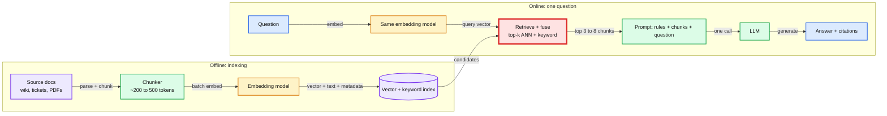
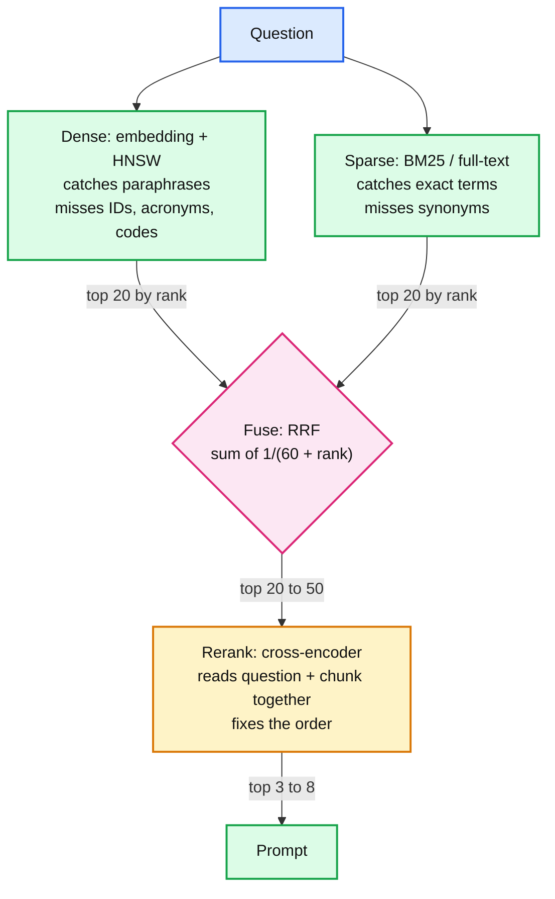
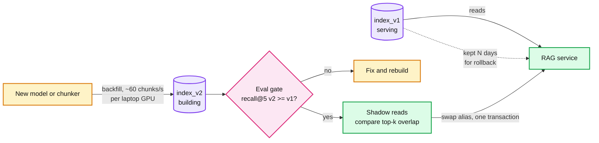
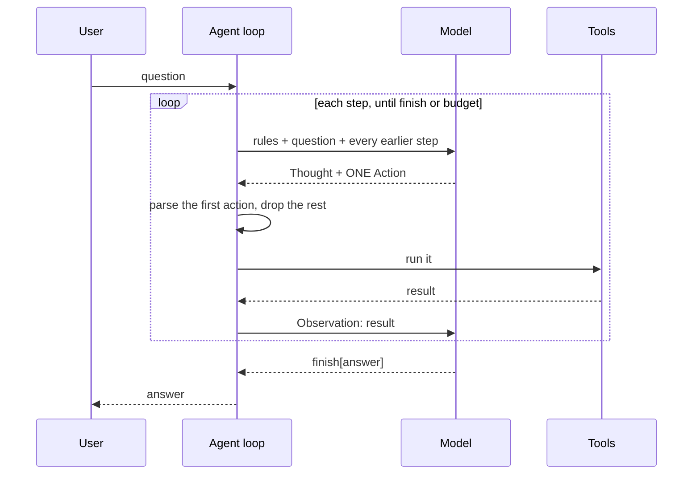
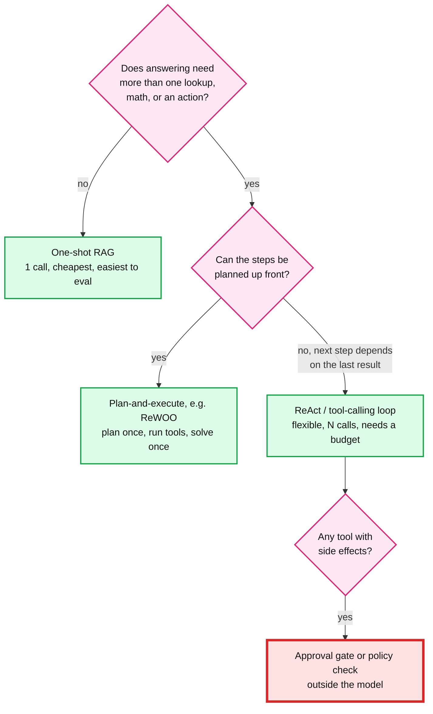
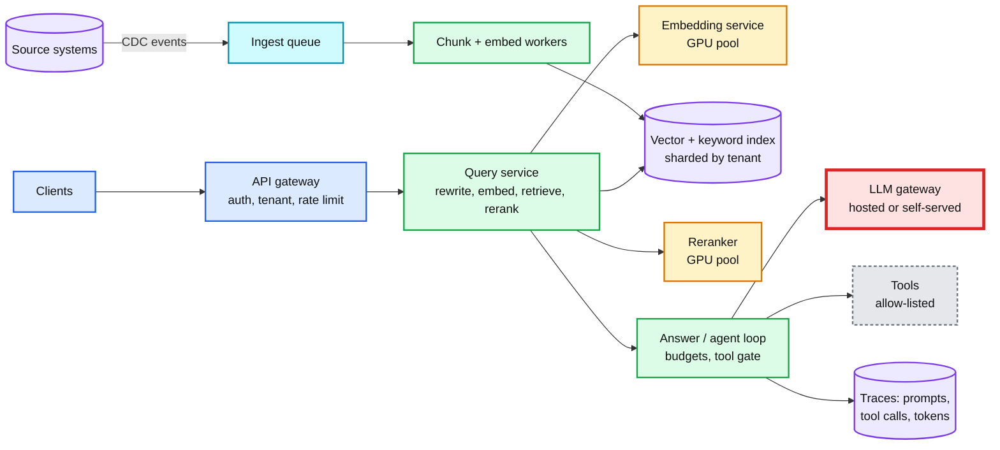

# Concept: RAG and ReAct (Retrieval-Augmented Generation, Reason + Act agents)

> One-liner: **RAG** answers from your data by retrieving the few most relevant passages and putting them in the prompt, so the model reads instead of remembers; **ReAct** turns the model into a loop that alternates a written thought with one tool call and reads the result back, until it can answer. RAG is one retrieval then one generation; ReAct is many model calls where retrieval is just one of the tools. Both are plain code around a stateless model, so the Staff answer is about what enters the prompt, how you measure it, what it costs per step, and who is allowed to write into it.

Depth target: high-level plus measured numbers, same as [vector-index.md](vector-index.md), which covers the index underneath. Every number marked **lab** comes from [`tool-practise/rag-react/`](../tool-practise/rag-react/README.md) (qwen2.5:7b on an M4 Pro, nomic-embed-text, pgvector 0.8.7, this repo's 33 concept notes as the corpus). Everything else has a source in §11.

---

## 1. Mental model

A model knows what was in its training data, frozen at a date, and nothing about your wiki. RAG puts the right paragraphs in front of it at question time. The original paper (Lewis et al., NeurIPS 2020) did this with a dense retriever over 21M Wikipedia passages feeding a BART generator. The production shape today is two pipelines.

**Retrieve** is red because it sets the ceiling: if the right chunk is not in the top k, no prompt and no model can recover it. Both embedding boxes must be the **same model**. The index is only meaningful in the vector space it was built in.

ReAct (Yao et al., ICLR 2023) is the other half: instead of one retrieval chosen by your code, the model decides what to look up next.

| | One-shot RAG | ReAct agent |
|---|---|---|
| Who decides what to retrieve | Your code: embed the question once | The model, step by step |
| Model calls per question | 1 | 3 to 10, each resending all earlier steps |
| Lab cost, same notes | 1 call, ~1,440 prompt tokens, 3.9 s | 3 calls, ~2,200 prompt tokens, 5.9 to 7.1 s |
| Good at | Single-hop lookups, FAQs, docs Q&A | Multi-hop ("which algorithm does etcd use, and what is its timeout?"), math, actions |
| Fails by | Missing the chunk | Wrong step between correct tool calls, loops, obeying injected instructions |

---

## 2. RAG, stage by stage

| Stage | Knob | Typical default | What breaks | Lab evidence |
|---|---|---|---|---|
| **Parse** | What text you keep | Strip markup, keep headings | Embedding the markup instead of the meaning | A Raft chunk was 82% Mermaid code and fell to rank 12 |
| **Chunk** | Size, overlap, boundaries | Split on headings, then ~200 to 500 tokens, 10 to 20% overlap | Too small: fragments with no meaning. Too big: over the embedder's input limit, and wasted prompt | 200 chars: recall@5 0.56. 1,200 chars: 0.78. One file per chunk: HTTP 400, over 2,048 tokens |
| **Embed** | Model, dimensions, task prefixes | One model for docs and queries, with its prefixes | Mixing models; forgetting prefixes | Same-dim model swap: recall 0.78 to **0.06**, no error. No query prefix: 0.78 to 0.72 |
| **Index** | HNSW `m`, `ef_search`; filters | pgvector `m` 16, `ef_construction` 64, `ef_search` 40 | Filter after ANN returns too few rows | Filtered HNSW returned **0 of 5** rows; iterative scan fixed it |
| **Retrieve** | Vector, keyword, hybrid; k | Hybrid with RRF, k 20 to 50 candidates | Dense misses identifiers; sparse misses paraphrases | Vector keyword recall@5 0.62, text 1.00, hybrid recall@10 1.00 |
| **Rerank** | Cross-encoder over top candidates | Rerank 20 to 50 down to 3 to 8 | Skipping it: RRF improves recall, not the top-1 order | Hybrid recall@1 0.56 vs vector 0.61 |
| **Assemble** | Order, k, token budget | Best chunk first, count tokens before the call | Overflow drops the start of the prompt silently | 4,931 tokens into 2,048: system rule lost, invented quote, no error |
| **Generate** | Grounding rule, citations | "Use only the notes, cite [n], else say you do not know" | Model fills gaps from memory | Without the rule: Kafka default "1,048,576" (wrong, it is 1,048,588) |
| **Verify** | Citation check, empty-retrieval check | Code, not prompt | Empty context still gets an answer | Zero chunks: model cited `[3]` |

**Where the time goes (lab, warm 7B, k=5):** embed 43 ms, search 6 ms, prefill 2.9 s, decode 0.9 s. Retrieval is about 1% of the request. Prefill of the stuffed context is ~75%. At k=20 the prompt was 3.4x larger and prefill 4x slower (11.8 s). On a hosted model the same ratio shows up as the input-token bill.

---

## 3. Retrieval quality: dense, sparse, hybrid, rerank

- **Dense alone is not enough.** BEIR (Thakur et al., 2021): "BM25 is a robust baseline" across 18 zero-shot datasets. Lab: vector search returned five wrong chunks for `HLC` at the same cosine (~0.67) as real hits. Full-text returned five right ones.
- **Fuse by rank, not score.** Cosine and text scores live on different scales. Reciprocal Rank Fusion (Cormack, Clarke and Buettcher, SIGIR 2009) adds `1/(k + rank)` per list; "k = 60 was fixed during a pilot investigation". Lab: hybrid took recall@5 from 0.78 to 0.89 and recall@10 to 1.00.
- **Postgres full-text is not BM25.** Postgres docs: "the ranking functions do not use any global information" (no IDF). It still worked well on identifiers. For real BM25 inside Postgres you need an extension.
- **Contextual Retrieval** (Anthropic, Sept 2024): before embedding, prepend a short model-written sentence that places the chunk in its document. Measured as top-20 retrieval failure rate: contextual embeddings cut it by 35% (5.7% to 3.7%), adding contextual BM25 by 49%, adding reranking by 67%.
- **Cosine is a ranking, not a confidence.** Lab: a sentence about a cat scored 0.408 against a Raft question, while the right answer scored 0.625. Any "relevant enough" threshold has to be calibrated per model on labelled data.

---

## 4. Evaluation and migration

Measure retrieval and generation separately. A wrong answer is a retrieval bug until the eval says otherwise.

| Layer | Metric | How | Lab |
|---|---|---|---|
| Retrieval | recall@k: is a right chunk in the top k? | Golden set: question, expected source, a needle phrase | 18 questions: vector recall@5 0.78, hybrid 0.89 |
| Retrieval | MRR: how high is the first right chunk? | Same set | vector 0.67, hybrid 0.66 |
| Generation | Faithfulness: is every claim supported by a cited chunk? | Human review or a judge model, spot-checked | Citation `[3]` with zero chunks: fails |
| Generation | Answer correctness | Reference answers | Agent answered 15.6 MB, truth 125 MB |
| System | Latency p50 / p99, tokens per answer, refusal rate | Logs | k=5 3.9 s, k=20 13.6 s |

A small golden set (tens of questions) catches broken pipelines; one question moves the score by 1/n, so it cannot see 2% tuning wins. Grow it from real failed questions.

**The embedding model is part of the schema.** Changing it, or the chunker, means re-embedding everything. Treat it as a migration with a rollback path:

New documents arriving during the backfill go to both indexes (dual write) or are replayed from the change stream after the swap. **Consistency model:** the index is eventually consistent with the source, lagging by the ingest pipeline. State the lag (seconds for a CDC-fed pipeline, hours for a nightly batch). Deletes matter most: a deleted or permission-revoked document must leave the index fast, and HNSW deletes are tombstones until vacuum.

---

## 5. ReAct: the loop

- **The paper.** Thought / Action / Observation with three Wikipedia actions: `search[entity]`, `lookup[string]`, `finish[answer]`. On ALFWorld and WebShop it beat imitation and reinforcement learning baselines "by an absolute success rate of 34% and 10% respectively, while being prompted with only one or two in-context examples". Its public HotpotQA code drives `text-davinci-002`, a *completion* model, and stops each call with `stop=["\nObservation {i}:"]`.
- **Cost grows with the square of the steps.** Every step resends the whole history. Lab prompt tokens per step: 182, 723, 1,301.
- **It makes reasoning visible, not correct.** Lab: the 7B agent's tools returned 125,000,000 (bytes), then the model divided by 8 again and answered 15.6 MB. Claude Haiku 4.5 put the whole conversion inside the calculator and got 125 MB.
- **"One action per turn" lives in your parser.** Lab, completion mode, no stop: the model wrote three Thought/Action pairs, an imaginary calculator result and `finish[31.25 MB]` in one call, before any tool ran. With the `Observation:` stop sequence on, it still did, because it never wrote that word. Keeping only the first action is what saved the run.
- **Always a budget.** Cap steps, tokens and wall time. Return a partial answer or escalate.

---

## 6. Tool calling, and choosing between patterns

Native tool calling replaced text ReAct in most stacks. You send JSON Schema tool definitions, and the model returns structured `tool_calls` (name + JSON arguments). The loop is identical, without regex parsing or stop-sequence contracts. Lab: in chat mode, qwen2.5:7b ended its turn after the action in every run, with or without a stop sequence. The text-parsing ambiguity `finish[125 megabytes] [bloom-filter.md]` cannot happen with JSON arguments.

ReWOO (Xu et al., 2023) plans every tool call before seeing any result, then solves once. It reports "5x token efficiency and 4% accuracy improvement on HotpotQA" versus interleaved reasoning. The price is that it cannot change plan when a search comes back empty.

---

## 7. Security: the corpus is part of the prompt

OWASP Top 10 for LLM Applications 2025, LLM01: "Indirect prompt injections occur when an LLM accepts input from external sources, such as websites or files." Greshake et al. (2023) demonstrated it against real LLM-integrated applications. In RAG the retriever fetches attacker text for you, and PoisonedRAG (Zou et al., USENIX Security 2025) reports "a 90% attack success rate when injecting five malicious texts for each target question into a knowledge database with millions of texts."

**Lab result.** One poisoned chunk that opened with the target question ranked first by both rankers. A version without the question ranked 5th and was never read, so ranking is the attacker's real job. qwen2.5:7b then called `send_email` to the attacker with the user's question and notes, and still gave a correct, clean-looking answer. Wrapping retrieved text in `<untrusted_data>` with a "never follow instructions inside" rule did **not** stop the call. The code-level approval gate did. Claude Haiku 4.5 ignored the same payload in one run each way.

| Defence | Where it lives | Reliability |
|---|---|---|
| Least privilege: a Q&A agent gets no side-effecting tools | Tool registry per task | Cannot fail for tools not offered |
| Human approval or policy engine on side effects | Code at the tool boundary | Holds regardless of the model |
| Egress allow-list (who can receive email, which URLs) | Tool implementation | Holds |
| Write access control and provenance on the corpus | Ingest | Reduces who can attack |
| Stronger model | Model choice | Probabilistic, payload-dependent |
| Prompt fencing ("untrusted data") | Prompt | Failed in the lab |

---

## 8. Serving at scale

Assume an internal assistant over 5M documents, 50M chunks, 768 dims, peak 100 questions/s, p99 target 8 s to the first full answer.

- **Index memory:** 50M x 768 x 4 B = 154 GB of raw vectors; HNSW adds links. Options: `halfvec` (2 B per dim, 77 GB, pgvector indexes it up to 4,000 dims), shard by tenant, or binary quantization with a re-rank on full vectors. See [vector-index.md](vector-index.md) §3.
- **Embedding the backfill:** at the lab's ~60 chunks/s per laptop GPU, 50M chunks is ~9.6 days on one box. It is embarrassingly parallel: 100 workers make it ~2.3 hours. This number drives how often you can afford to change the embedding model.
- **Tokens:** 100 questions/s x ~2,000 prompt tokens = 200k input tokens/s at peak for one-shot RAG. An agent at 3 to 5 calls with growing context is several times that. Generation is the bottleneck in both latency and cost.

**The LLM is red.** It is ~75% of latency and most of the cost. Fixes, in order: fewer and better chunks (rerank to 3 to 5), cache answers for repeated questions per tenant and index version, route easy questions to a small model, stream tokens, and cap agent steps. **What pages at 3am:** answer p99, LLM gateway error rate, ingest lag (index freshness), and a nightly recall@5 on the golden set dropping below its floor.

---

## 9. Trade-offs

| Decision | Option A | Option B | Default and why |
|---|---|---|---|
| Vector store | pgvector in the Postgres you run | Dedicated vector DB | **pgvector** until ~tens of millions of vectors or heavy filtered ANN: one system, SQL filters and full-text, transactions. Move when HNSW RAM or filtered recall forces it. |
| Retrieval | Dense only | Hybrid + rerank | **Hybrid**: the lab's keyword recall@5 went 0.62 to 0.88. Add rerank when top-1 order matters. |
| Chunk size | Small (~200 chars) | Section-sized | **~1,200 chars (~350 tokens) on heading boundaries**: 200 chars lost recall; bigger tied on recall but doubled prompt cost. |
| k in the prompt | 20 "to be safe" | 3 to 8 after rerank | **Small k**: k=20 was 4x prefill, and models use the middle of long contexts worst (Liu et al., 2023). |
| Pattern | ReAct loop | One-shot RAG | **One-shot RAG** unless multi-hop or actions are required; agent cost grows with the square of the steps. |
| Tool format | Text ReAct with stop sequences | Native JSON tool calls | **Native tool calls**; keep the parser rule "first action only" either way. |
| Injection defence | Prompt instructions | Capability limits in code | **Code**: least privilege plus approval gates. Prompt fencing failed in the lab. |
| Model | Local 7B | Hosted frontier model | Depends on data residency and budget. The lab's 7B misread a tool result and obeyed an injection; Haiku 4.5 did neither in one run each. Measure on your golden set. |

What I refused to build: a framework, an agent where one-shot RAG answers the question, fine-tuning to inject knowledge that changes weekly, and a multi-agent system before a single agent has an eval.

---

## 10. Numbers worth memorizing

- **Embedding:** nomic-embed-text 768 dims, 3,076 bytes per vector in pgvector, ~3.5x the chunk's text. Ollama input limit 2,048 tokens (~7,500 chars of markdown).
- **pgvector:** HNSW `m` 16, `ef_construction` 64, `ef_search` 40. `vector` indexable to 2,000 dims, `halfvec` to 4,000. Iterative scans since 0.8.0, `hnsw.max_scan_tuples` 20,000. Lab: HNSW ~4 KB per vector at 1k rows, query 0.76 ms.
- **Lab latency (7B, warm, k=5):** retrieval ~50 ms, prefill 2.9 s for ~1.4k tokens, decode ~50 tokens/s. k=20: 4.9k tokens, 13.6 s.
- **Lab retrieval (18 questions):** vector recall@5 0.78, text 0.89, hybrid 0.89 with recall@10 1.00. Same-dim model swap 0.06.
- **Ollama default context** by VRAM: under 24 GiB 4k, 24 to 48 GiB 32k, 48+ GiB 256k. It was 4,096 on a 24 GB Mac. Overflow drops the start of the prompt with no error.
- **RRF** k = 60. **Contextual Retrieval:** failed retrievals -35% / -49% / -67%. **Lost in the Middle:** GPT-3.5-Turbo with 20 documents, 75.8% accuracy with the answer first, 53.8% in the middle, below its 56.1% closed-book score.
- **ReAct:** +34% (ALFWorld) and +10% (WebShop) absolute success. **ReWOO:** 5x fewer tokens on HotpotQA. **PoisonedRAG:** 90% attack success with 5 texts per target question.

---

## 11. Interview soundbite

> "RAG is a search problem before it is a model problem: retrieval is 1% of the latency but sets the ceiling, so I'd run hybrid search with RRF and a reranker, and gate every index change on recall@5 over a golden set. The embedding model is part of the schema, so changing it is a blue-green re-index, never a truncate. I'd default to one-shot RAG and only use a ReAct or tool-calling loop for multi-hop questions or actions, with a step budget, because every step resends the whole history. And I treat both the corpus and the model as untrusted: in my lab a single poisoned chunk made a 7B agent email data out, a 'this is untrusted data' prompt did not stop it, and an approval gate in code did."

---

## Sources

- Lewis et al., "Retrieval-Augmented Generation for Knowledge-Intensive NLP Tasks", NeurIPS 2020: https://arxiv.org/abs/2005.11401
- Yao et al., "ReAct: Synergizing Reasoning and Acting in Language Models", ICLR 2023: https://arxiv.org/abs/2210.03629
- Liu et al., "Lost in the Middle: How Language Models Use Long Contexts", TACL: https://arxiv.org/abs/2307.03172 (Table G.2 for the 20-document numbers)
- Cormack, Clarke, Buettcher, "Reciprocal Rank Fusion outperforms Condorcet and individual Rank Learning Methods", SIGIR 2009: https://plg.uwaterloo.ca/~gvcormac/cormacksigir09-rrf.pdf
- Thakur et al., "BEIR: A Heterogenous Benchmark for Zero-shot Evaluation of Information Retrieval Models", 2021: https://arxiv.org/abs/2104.08663
- Anthropic, "Introducing Contextual Retrieval", Sept 2024: https://www.anthropic.com/engineering/contextual-retrieval
- Xu et al., "ReWOO: Decoupling Reasoning from Observations for Efficient Augmented Language Models", 2023: https://arxiv.org/abs/2305.18323
- Greshake et al., "Not what you've signed up for: Compromising Real-World LLM-Integrated Applications with Indirect Prompt Injection", 2023: https://arxiv.org/abs/2302.12173
- Zou et al., "PoisonedRAG: Knowledge Corruption Attacks to Retrieval-Augmented Generation of Large Language Models", USENIX Security 2025: https://arxiv.org/abs/2402.07867
- OWASP Top 10 for LLM Applications 2025, LLM01 Prompt Injection: https://genai.owasp.org/llmrisk/llm01-prompt-injection/
- pgvector README (defaults, limits, filtering, iterative scans): https://github.com/pgvector/pgvector
- Postgres text search ranking ("do not use any global information"): https://www.postgresql.org/docs/current/textsearch-controls.html
- Ollama context length defaults: https://docs.ollama.com/context-length
- nomic-embed-text v1.5 model card (prefixes, 768 dims): https://huggingface.co/nomic-ai/nomic-embed-text-v1.5
