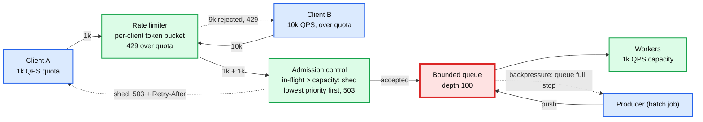
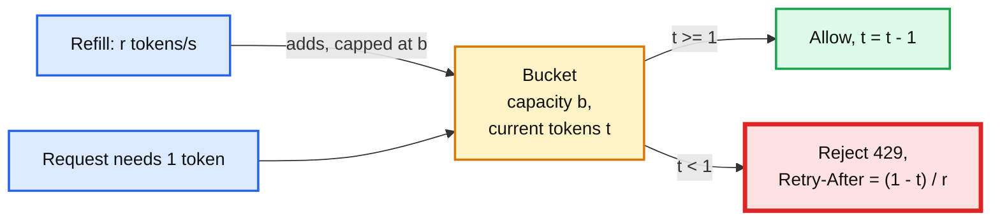
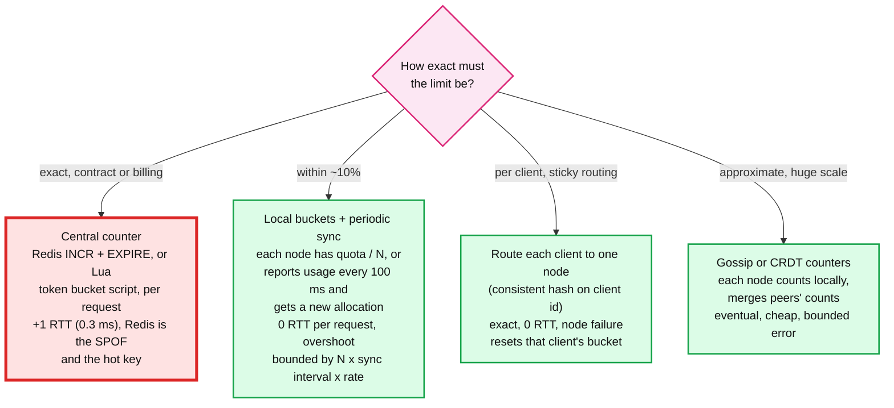

# Concept: Rate Limiting, Backpressure, and Load Shedding

> One-liner: rate limiting rejects requests that exceed a per-client budget so one caller cannot consume everyone's capacity; load shedding rejects requests that exceed the server's total capacity so the server keeps serving *some* requests fast instead of serving all of them slowly and then none; backpressure pushes the "slow down" signal upstream so producers stop before the buffer overflows. All three exist because a system past its capacity does not degrade gracefully on its own, it collapses.

Depth target: high-level, same as [fan-out-fan-in.md](fan-out-fan-in.md) and [caching-patterns.md](caching-patterns.md). It is under test in the throttling, livestream, and "10x traffic" problems, and it is the operability half of every design. Because the token bucket is DSA, this note has runnable code.

---

## 1. Mental model

A server handles 1,000 requests per second at 10 ms each. At 1,001 per second, a queue forms. At 1,200, the queue grows without bound, every request waits in it, latency goes from 10 ms to seconds, clients time out and retry, which adds load, and throughput drops toward zero. This is **congestion collapse**, and the only cure is to reject work early.



| Control | Protects | Decision based on | Response |
|---|---|---|---|
| **Rate limiting** | Other clients, downstream contracts, cost | The caller's identity and its quota | 429 Too Many Requests, `Retry-After` |
| **Load shedding** | The server itself | Current load (in-flight, queue depth, latency, CPU) | 503 Service Unavailable, or a degraded response |
| **Backpressure** | The buffer between producer and consumer | Buffer occupancy | Producer blocks or slows; no request is rejected, it is delayed at the source |

**Why this matters more at Staff level.** Senior answers put a rate limiter at the gateway. Staff answers say what the limit counts (requests, bytes, cost units), where the counter lives and what it costs to keep consistent across nodes, what happens when the counter store is down, which requests get shed first and why, and how retries are prevented from making it worse.

---

## 2. Rate limiting algorithms



| Algorithm | How | Burst | Memory per key | Trap |
|---|---|---|---|---|
| **Token bucket** | Tokens added at rate `r` up to capacity `b`. Request consumes one (or `cost`). | Up to `b` at once, then `r` sustained | 2 numbers: tokens, last refill time | The default. Bursts of `b` are allowed by design; pick `b` from what downstream tolerates. |
| **Leaky bucket** | Requests enter a queue drained at rate `r`. Full queue rejects. | None, output is perfectly smooth | Queue of size `b` | Adds queueing latency. Good for shaping outbound traffic to a strict downstream. |
| **Fixed window** | Counter per `[t, t + 1 min)`. Reject over `N`. | 2N at the window boundary (N at 12:00:59, N at 12:01:00) | 1 number | The boundary burst. Never for a strict contract. |
| **Sliding window log** | Timestamp of every request in the last minute. Count them. | Exact | One timestamp per request. 1k QPS is 60k entries per key. | Exact and expensive. |
| **Sliding window counter** | Previous window count weighted by overlap plus current window count. `prev x (1 - elapsed/window) + curr` | Approximate, no boundary burst | 2 numbers | Cloudflare's choice. Within a few percent of exact. |
| **GCRA** (generic cell rate) | Token bucket expressed as a "theoretical arrival time". One timestamp per key. | Same as token bucket | 1 number | Used in telecom and by some Redis libraries. Same semantics, less state. |

**What to count.** Requests is the naive unit. Better: cost units (a search costs 10, a get costs 1), bytes (bandwidth limits, see `hld/vm-network-qos/`), concurrent in-flight (a semaphore, which also protects against slow requests), or dollars (LLM tokens, cloud API calls).

**Which key.** Per user, per API key, per IP (weak: NAT and proxies), per tenant, per endpoint, per (tenant, endpoint). Real systems apply several: a global limit, a per-tenant limit, and a per-user limit, all must pass. Hierarchical limits (tenant 10k, each user within it 1k) are `hld/network-throttling/`.

---

## 3. Distributed rate limiting

One limiter on one node is easy. A limit that must hold across 100 gateway nodes is the design question.



| Approach | Exactness | Per-request cost | Failure of the counter store |
|---|---|---|---|
| **Central store** (Redis) | Exact, if atomic (Lua script or `INCR`) | One round trip, ~0.3 ms same-AZ | **Fail open or fail closed** is the decision. Fail open: no limits during the outage, downstream may die. Fail closed: everything rejected, your outage. Most choose fail open with local fallback buckets. |
| **Local buckets, static split** | Overshoot up to N x when traffic is uneven across nodes | Zero | None. |
| **Local buckets, periodic report and lease** | Overshoot bounded by `N x interval x rate`. 100 nodes, 100 ms, 1k/s is 10k overshoot on a 100k limit, 10% | Zero per request, one sync per interval | Nodes keep last allocation. Degrades to static split. This is `hld/network-throttling/`'s "batch reporting and leases". |
| **Sticky routing** | Exact | Zero | Node loss resets the bucket for its clients: a free burst of `b`. |
| **Gossip / CRDT** | Eventual, error bounded by gossip round time | Zero | Partition splits the count. |

The sentence to say: **"the central counter is exact but adds a round trip and a hot key at Redis; I use local buckets with a 100 ms sync and accept a bounded overshoot, and fail open with local limits if the sync store is down."**

Redis specifics worth knowing: `INCR` plus `EXPIRE` is two commands and not atomic (use `SET NX EX` then `INCR`, or a Lua script). A token bucket in Lua is ~10 lines and runs atomically. One key per (client, window) is a hot key for a big client; shard the key by appending `hash(node) mod 8` and sum on read, see [sharding.md](sharding.md) section 5.

---

## 4. Code

Python, runnable, no dependencies. A token bucket with cost-based consumption and a `retry_after` estimate, plus a sliding-window counter for comparison. Both are what you would put in a Lua script.

```python
import time


class TokenBucket:
    """rate tokens per second, up to `burst` stored. O(1) memory, lazy refill."""

    def __init__(self, rate: float, burst: float, now=time.monotonic):
        self.rate, self.burst, self._now = rate, burst, now
        self.tokens = burst
        self.last = now()

    def _refill(self):
        t = self._now()
        self.tokens = min(self.burst, self.tokens + (t - self.last) * self.rate)
        self.last = t

    def try_acquire(self, cost: float = 1.0) -> tuple[bool, float]:
        """Returns (allowed, retry_after_seconds)."""
        self._refill()
        if self.tokens >= cost:
            self.tokens -= cost
            return True, 0.0
        return False, (cost - self.tokens) / self.rate


class SlidingWindowCounter:
    """Approximate count over the last `window` seconds using two fixed windows."""

    def __init__(self, limit: int, window: float, now=time.monotonic):
        self.limit, self.window, self._now = limit, window, now
        self.curr_start = self._floor(now())
        self.curr = 0
        self.prev = 0

    def _floor(self, t: float) -> float:
        return t - (t % self.window)

    def try_acquire(self) -> bool:
        t = self._now()
        start = self._floor(t)
        if start != self.curr_start:                       # window rolled: current becomes previous
            self.prev = self.curr if start - self.curr_start == self.window else 0
            self.curr, self.curr_start = 0, start
        weight = 1.0 - (t - start) / self.window           # how much of the previous window still overlaps
        estimate = self.prev * weight + self.curr
        if estimate + 1 > self.limit:
            return False
        self.curr += 1
        return True


if __name__ == "__main__":
    # Fake clock so the demo is deterministic.
    clock = [0.0]
    now = lambda: clock[0]

    tb = TokenBucket(rate=10, burst=20, now=now)
    allowed = sum(tb.try_acquire()[0] for _ in range(30))
    ok, wait = tb.try_acquire()
    print(f"token bucket: burst of 30 requests at t=0 -> {allowed} allowed, next retry_after={wait:.2f}s")
    clock[0] = 1.0
    allowed = sum(tb.try_acquire()[0] for _ in range(30))
    print(f"token bucket: 1 s later, 30 more -> {allowed} allowed (refilled 10)")

    sw = SlidingWindowCounter(limit=100, window=60, now=now)
    clock[0] = 0.0
    a1 = sum(sw.try_acquire() for _ in range(100))        # fill window 1
    clock[0] = 60.0                                        # boundary: fixed window would allow 100 more here
    a2 = sum(sw.try_acquire() for _ in range(100))
    clock[0] = 90.0                                        # half the previous window has aged out
    a3 = sum(sw.try_acquire() for _ in range(100))
    print(f"sliding window: t=0 -> {a1}, t=60 (boundary) -> {a2}, t=90 -> {a3} allowed of 100 each")
```

Expected output: the bucket allows 20 of the first 30 (the burst), `retry_after` = 0.10 s, then 10 more after one second. The sliding counter allows 100 at t=0, **0 at the boundary** (a fixed window would allow 100), and about 50 at t=90 as the old window ages out. The two lines to remember: `min(burst, tokens + elapsed x rate)` and `prev x weight + curr`.

---

## 5. Load shedding

Rate limiting is per client and is configured. Load shedding is about the server's total and is measured. The server decides "I am at capacity" and rejects, choosing which requests to reject.

| Signal | How | Good | Bad |
|---|---|---|---|
| **In-flight count** (concurrency limit) | Semaphore. Above `N` concurrent, reject. `N = target throughput x target latency` (Little's law) | Cheap, direct, also bounds memory | `N` must be tuned per deploy; a slow dependency makes every request "in flight" longer, so the limit trips correctly. |
| **Queue depth or queue time** | Reject if the request waited more than `T` in the accept queue | Reacts to actual overload, not a guess | Needs a queue timestamp. |
| **Adaptive concurrency** (Netflix `concurrency-limits`, Envoy adaptive, TCP Vegas-style) | Measure latency; when it rises above the minimum seen, shrink the limit; probe upward when it falls | Self-tuning across deploys and dependencies | Oscillates if the signal is noisy. Gradient-based algorithms smooth it. |
| **CPU or memory** | Reject above 80% CPU | Simple | Lags the actual overload; CPU can be fine while a downstream is the bottleneck. |
| **CoDel** (controlled delay) | Drop from the queue when the minimum queue delay over an interval exceeds a target (5 ms) | Well studied, prevents bufferbloat | Tuning targets per service. |

**Which to shed.** Not first-come-first-served. Priority:

1. **Criticality tiers** on every request (Google: `CRITICAL_PLUS`, `CRITICAL`, `SHEDDABLE_PLUS`, `SHEDDABLE`). Shed the lowest tier first. A checkout is critical, a recommendations panel is sheddable.
2. **Retries before first attempts.** A retry is load that already failed once. Tag retries; shed them first.
3. **Anonymous before authenticated, free before paid**, if that is the business rule.
4. **Expensive before cheap**, if cost is known up front.
5. **Newest before oldest** (LIFO under overload): an old request is likely already abandoned by its client; serve the new one. Facebook's servers do this.

**Degrade before you shed.** Return a cached or default answer, skip the optional backends ([fan-out-fan-in.md](fan-out-fan-in.md) section 4), reduce result count, disable the expensive feature. A 200 with less is better than a 503.

---

## 6. Backpressure

Rejecting is one response to overload. The other is telling the producer to slow down, which is only possible when the producer can wait.

| Mechanism | Where | How |
|---|---|---|
| **Bounded queues** | Every buffer | A full queue blocks the writer (or rejects). Unbounded queues turn overload into OOM. |
| **TCP flow control** | Every socket | The receive window. If the app stops reading, the sender stops sending. Free backpressure for any request/response protocol, as long as the server does not read faster than it processes. |
| **HTTP/2 and gRPC flow control** | Per stream | Window updates. Same idea per stream. |
| **Reactive Streams** (`request(n)`) | In-process pipelines | Consumer requests `n` items; producer sends at most `n`. |
| **Kafka consumer pull** | Log to consumer | The consumer pulls what it can. Lag accumulates on disk in Kafka rather than in memory in the consumer. The durable log is the buffer. |
| **Credit-based** (Flink) | Operator to operator | Receiver advertises credits. See [stream-processing.md](stream-processing.md) section 6. |
| **`Retry-After` and 429** | Across a network boundary where the client is independent | The signal is a rejection plus a hint. The client must honour it. |

The line: **backpressure inside a system, rate limiting and shedding at its boundaries.** Inside, everything can wait. At the boundary, the caller cannot be trusted to wait, so you reject with a hint.

---

## 7. Retries, the multiplier

Every rejection or timeout triggers a retry somewhere. Retries during overload are the mechanism by which a 10% overload becomes a 300% overload.

| Rule | Why |
|---|---|
| **Exponential backoff with full jitter**: `sleep = random(0, min(cap, base x 2^attempt))` | Without jitter, every client retries at the same instant. AWS's analysis: full jitter beats every other variant. |
| **Retry budget**: at most 10% of requests may be retries, per client per window | Bounds amplification at 1.1x no matter how bad it gets. Google SRE and Envoy both implement this. |
| **Retry at one layer only** | Three layers with three retries is 27x. |
| **Honour `Retry-After`** | The server knows when it will have capacity. |
| **Do not retry on 429 or 503 immediately; do not retry on 4xx at all** | Those are answers, not failures. |
| **Circuit breaker** per dependency | Stop calling a dependency that is failing; probe occasionally. See [fan-out-fan-in.md](fan-out-fan-in.md) section 5. |
| **Token bucket for retries** (Envoy) | Retries consume from a bucket that refills from successes. No successes, no retries. |

---

## 8. Where you meet it

| System | Mechanism | Detail |
|---|---|---|
| **Stripe, GitHub, Twitter APIs** | Token bucket per API key, headers `X-RateLimit-Limit / Remaining / Reset`, 429 with `Retry-After` | Stripe: separate limiters for reads, writes, and a "critical methods" tier. |
| **Cloudflare** | Sliding window counter at every edge node, synced through a central store with local approximation | Their blog post is the standard reference for sliding window counter. |
| **Envoy** | Local rate limit (token bucket per listener), global rate limit (gRPC to a central service, Redis), adaptive concurrency, retry budgets, circuit breakers | The reference implementation of the boundary controls. |
| **Google** (SRE book, "Handling Overload") | Per-customer quotas, client-side adaptive throttling (reject locally when `requests > K x accepts`), criticality tiers, retry budgets | Client-side throttling means the client stops sending before the server has to reject. |
| **Netflix** | `concurrency-limits` library, adaptive Vegas and gradient limiters | Concurrency, not rate, as the primary signal. |
| **Linux kernel** | `tc` token bucket filter (TBF), `htb` hierarchical token bucket, CoDel, fq_codel | Hierarchical token buckets are `hld/network-throttling/`'s model. |
| **AWS** | API request token buckets per account, `ThrottlingException`, SDK exponential backoff with jitter | Every AWS API is rate limited; the SDK retries are the reference client implementation. |
| **Kafka** | Quotas per client ID and user: produce bytes/s, fetch bytes/s, request time | Broker delays the response rather than rejecting, which is backpressure via latency. |
| **Redis** | `redis-cell` module (GCRA), or Lua token bucket | The central store for global limits. |
| **`hld/network-throttling/`, `hld/vm-network-qos/`** | Hierarchical max-min fairness, local enforcement with batch reporting and leases | The full worked distributed limiter. |

---

## 9. Practical additions every real implementation has

| Addition | Problem it fixes |
|---|---|
| **Cost-based tokens** | One expensive request counts the same as a cheap one. |
| **Multiple keys checked per request** (global, tenant, user, endpoint) | One dimension is never enough. |
| **Response headers** (`X-RateLimit-*`, `Retry-After`) | Clients cannot back off intelligently. |
| **Local fallback buckets when the central store is unreachable** | Central store outage becomes an API outage. |
| **Lua script for atomic check-and-decrement** | `GET` then `SET` races. |
| **Hot-key sharding for big tenants** | One tenant's counter saturates one Redis shard. |
| **Adaptive concurrency limit** | Static limits are wrong after every deploy. |
| **Criticality tag on every request** | Shedding is FIFO, checkout dies with recommendations. |
| **Retry tag and retry budget** | Retries amplify overload. |
| **Bounded queues everywhere** | Overload becomes OOM. |
| **Client-side adaptive throttling** | Clients keep sending into a server that rejects everything. |
| **Degraded mode before rejection** | 503s where a cached 200 would do. |
| **Dashboards: reject rate by reason, by tier, by client** | Cannot tell "limiter working" from "limiter broken". |

---

## 10. Failure modes and what happens

| Failure | What happens | Fix |
|---|---|---|
| No limiter, one client at 10x | Everyone's latency rises. One tenant takes the service down. | Per-client token bucket. |
| Fixed window | 2x burst at the boundary. Downstream contract violated. | Sliding window counter or token bucket. |
| Central store down, fail closed | 100% rejection. Self-inflicted outage. | Fail open with local buckets. |
| Central store down, fail open, no local limit | No limits at all. Downstream dies. | Local fallback buckets. |
| Central counter per request | +0.3 ms per request, Redis hot key for big tenants, Redis is the bottleneck. | Local buckets with periodic sync. |
| Unbounded queue | Latency grows to seconds, then OOM. | Bounded queue with queue-time shedding. |
| Shedding FIFO | Critical requests rejected alongside sheddable ones. | Criticality tiers. |
| Retries without jitter | Synchronised retry storm every `base x 2^n` seconds. | Full jitter. |
| Retries without budget | 10% overload becomes 300%. | Retry budget, one layer. |
| Static concurrency limit after a deploy that doubled latency | Limit is 2x too high; overload not detected. | Adaptive limit. |
| Rate limit by IP behind a corporate NAT | One office locked out. | Key by user or API key. |
| Limiter counts requests, not cost | 100 cheap gets and 100 full-table searches cost the same. | Cost units. |
| Server reads the socket faster than it processes | TCP backpressure disabled; requests buffered in memory. | Read only when a worker is free. |
| Limit hit, client ignores `Retry-After` | Hammering continues. | Ban escalation, or client-side throttling in the SDK. |

---

## 11. Trade-offs

| Gain | Cost |
|---|---|
| Token bucket: bursts allowed, O(1) memory, simple. | Burst size is a downstream risk. |
| Leaky bucket: perfectly smooth output. | Queueing latency; no bursts even when capacity is free. |
| Sliding window counter: no boundary burst, 2 numbers. | Approximate by a few percent. |
| Central counter: exact. | Round trip, hot key, SPOF with a fail-open/closed decision. |
| Local buckets with sync: zero per-request cost. | Overshoot bounded by `N x interval x rate`. |
| Load shedding: server stays fast under overload. | Some requests get 503 that would have succeeded slowly. |
| Priority shedding: critical traffic survives. | Every request needs a tier, and the tiers must be honest (everything becomes CRITICAL within a year). |
| Adaptive concurrency: no tuning after deploys. | Can oscillate; needs a smooth signal. |
| Backpressure: nothing rejected, nothing lost. | Only where the producer can wait. Latency rises instead. |
| Retry budgets: bounded amplification. | Some retries that would have succeeded are suppressed. |

**What a Staff answer refuses to build:** a fixed-window limiter for a contract, a central counter on every request with no fallback, an unbounded queue anywhere, retries at more than one layer, shedding without priorities, and a limiter that counts requests when the cost per request varies 100x.

---

## 12. Numbers worth memorizing

- Token bucket state: **2 numbers** per key. Sliding window counter: 2 numbers. Sliding log: 1 per request.
- Redis round trip same-AZ: **~0.3 ms**. Redis single shard: ~100k ops/s, so a central counter tops out around 100k limited requests per second per shard.
- Local sync interval: **100 ms**. Overshoot bound = `nodes x interval x rate`. 100 nodes, 100 ms, 1k/s per node: 10k over.
- Little's law: `concurrency = throughput x latency`. 1k QPS at 10 ms is 10 in flight; at 1 s (overloaded) it is 1,000.
- Retry budget: **10%**. Backoff: base 100 ms, cap 10 to 30 s, full jitter.
- Google adaptive client throttling: reject locally when `requests > 2 x accepts`.
- CoDel target: 5 ms queue delay, 100 ms interval.
- Criticality tiers: 4 (Google). Most systems manage with 2 or 3.
- Stripe: ~100 requests/s per key for live mode, separate read and write buckets.
- Congestion collapse: throughput drops toward zero above ~1.2x capacity without shedding. With shedding, throughput stays flat at capacity.

---

## 13. Interview soundbite

> "Three controls at three places. At the edge, a token bucket per client keyed on tenant and endpoint, counting cost units not requests, enforced locally on every gateway node with a 100 ms sync to Redis so the per-request cost is zero and the overshoot is bounded at a few percent; if Redis is down we fail open on the local buckets. At admission, a concurrency limit from Little's law, adaptive so it survives deploys, shedding by criticality tier with retries shed first and a cached degraded answer where one exists. Inside the system, bounded queues and pull-based consumption so backpressure reaches the source, with a Kafka log as the buffer that turns overload into lag instead of loss. Every rejection carries Retry-After, every client backs off with full jitter under a 10% retry budget, and there is exactly one retry layer."

Follow-ups an interviewer will ask, in order of likelihood:

1. How do you enforce a limit across 100 gateway nodes? (Section 3, local buckets plus sync, bounded overshoot.)
2. Redis goes down. (Section 3, fail open with local fallback.)
3. Token bucket or sliding window, and why? (Section 2, bursts vs smoothness, boundary problem.)
4. The service is at capacity. Which requests do you drop? (Section 5, tiers, retries first, LIFO.)
5. What stops retries from making it worse? (Section 7, jitter, budget, one layer.)
6. Where does backpressure come from in an HTTP service? (Section 6, TCP window, bounded queues, read only when free.)
7. One tenant is 50% of traffic. (Section 3, hot-key sharding of the counter.)
8. How do you pick the concurrency limit? (Section 5, Little's law, then adaptive.)
9. Hierarchical limits: tenant 10k, users 1k each. (`hld/network-throttling/`, max-min fairness.)

Related: [fan-out-fan-in.md](fan-out-fan-in.md) (circuit breakers, bulkheads, retry rules at the aggregator), [sharding.md](sharding.md) (hot-key counters), [caching-patterns.md](caching-patterns.md) (degraded answers from cache), [stream-processing.md](stream-processing.md) (credit-based backpressure, lag), [serverless-architecture.md](serverless-architecture.md) (concurrency limits as the scaling unit), `hld/network-throttling/` and `hld/vm-network-qos/` (hierarchical distributed limiters in full), `hld/` #37 livestream, #39 10x traffic.
