# Concept: Real-Time Client to Server Communication

> One-liner: HTTP cannot start a message from the server, so six workarounds exist. Pick by asking two questions in order: is the payload media (then pull segments over HTTP, or WebRTC if sub-second), and must the client also push continuously on the same channel (then WebSocket, otherwise SSE over HTTP/2 is cheaper on every axis).

Covers WebSocket, SSE (Server-Sent Events), HTTP/2 streams, long-polling, HLS/DASH, WebRTC. Depth target: enough to choose the right one under interview pressure, hold a million connections on one node, and survive a deploy.

Sources are marked **[doc]** (RFC, spec, vendor docs) or **[inf]** (inferred, observed, or reverse-engineered).

Used by: [`hld/slack-messaging/`](../hld/slack-messaging/) (#2), #28 collaborative editing, #36 feed / WhatsApp, and any dashboard, ticker, or LLM streaming question.

---

## 1. Which one, when

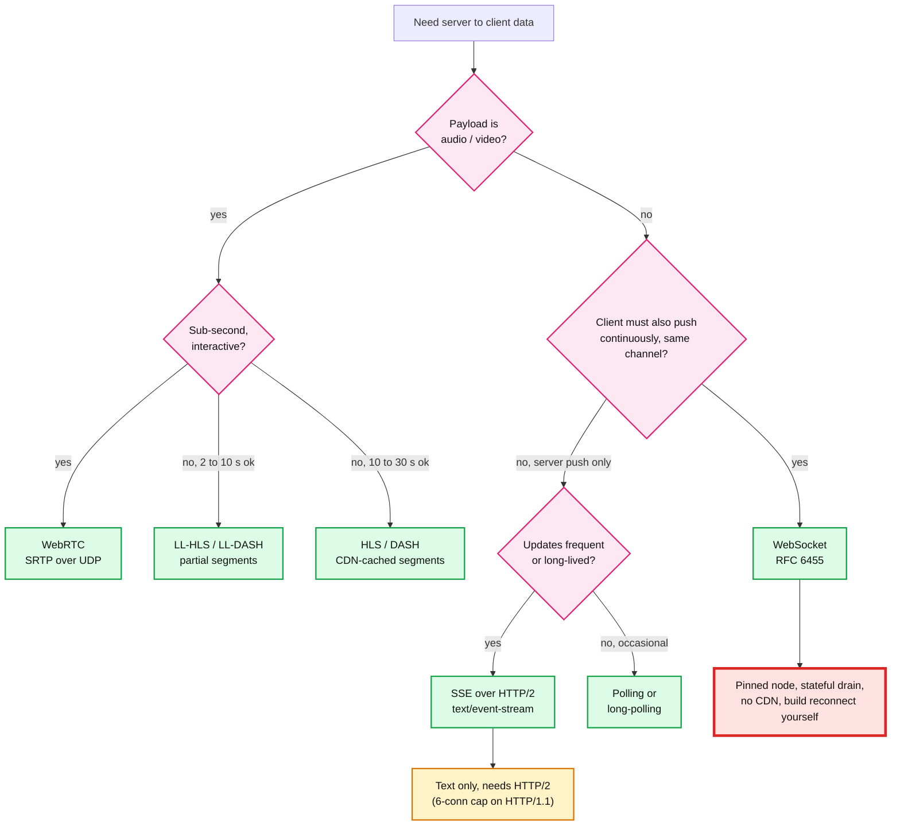

### Quick chooser

| You are building | Use | Why this and not the next one up |
|---|---|---|
| Chat, multiplayer game, collaborative editor, voice mode | **WebSocket** | Client pushes continuously and needs the same ordered channel back. Only case that truly needs full duplex. |
| Price ticker, dashboard, notifications, order status | **SSE over HTTP/2** | Server push only. Free auto-reconnect and replay by `Last-Event-ID`. Trivial to drain on deploy. |
| LLM token streaming (Claude, ChatGPT shape) | **SSE on a POST** via `fetch` + `ReadableStream` | One turn = one POST = one stream. Prompt goes up in the body, tokens come down. No session on the connection. |
| Live chat under a video (YouTube style) | **Polling with server-supplied interval** | Millions read, few post. Server controls the poll interval, which is a load-shedding lever push cannot give you. |
| Occasional updates (a build finishing, a mail arriving) | **Long-polling** | Rare events do not justify a held connection per user. |
| Video on demand, live video at 10 to 30 s delay | **HLS / DASH** | Segments are static files. A CDN serves 10^8 viewers. Client-side pull is required for adaptive bitrate. |
| Live video at 2 to 5 s delay (sports, auctions) | **LL-HLS / LL-DASH** | Same CDN machinery, partial segments published as they are encoded. |
| Video call, sub-second broadcast, betting feeds | **WebRTC** | Only option that drops TCP, so no head-of-line blocking. Pays for it with NAT traversal (STUN / TURN). |

### The mistakes interviewers listen for

- Saying "WebSocket" for anything real-time. Most real-time is one-directional, and SSE is cheaper to build, operate, and drain.
- Conflating media and messaging. They share almost no machinery. The first branch of the tree is always media vs not.
- Assuming a transport from a symptom. "Messages keep arriving without a request each" is equally explained by long-polling, SSE, or WebSocket.
- Claiming HTTP/2 makes SSE two-way. It gives you many one-way streams on one pipe, not one two-way stream (see §10).

---

## 2. The six options side by side

| | WebSocket | SSE | HTTP/2 streams | Long-polling | HLS / DASH | WebRTC |
|---|---|---|---|---|---|---|
| Direction | Full duplex | Server to client | Per-stream one-way | Server to client | Server to client | Full duplex |
| Transport | TCP, own framing | TCP, HTTP body | TCP, HTTP/2 | TCP, HTTP | TCP, HTTP | UDP (SRTP) |
| Binary | Yes | No (base64, +33%) | Yes | Yes | Yes | Yes |
| Auto-reconnect | Build it | **Free** | n/a | n/a | Free (next GET) | Build it |
| Resume / replay | Build it | **`Last-Event-ID`** | n/a | Build it | Free (seek) | n/a |
| CDN-cacheable | No | No | Partially | No | **Yes** | No |
| Latency | ms | ms | ms | RTT + poll gap | 2 to 30 s | < 500 ms |
| Proxy friendliness | Needs upgrade support | **Excellent** | Excellent | Excellent | Excellent | Poor (NAT / TURN) |
| Node drain cost | **High** | Low | Low | None | None | High |
| Typical use | Chat, games, collab, voice | Dashboards, notifications, LLM tokens | General API + streams | Legacy fallback | Video, audio | Calls, ultra-low latency |

**Why WebSocket over SSE**: only when the client must push continuously over the *same* channel. Chat, multiplayer, collaborative editing, live audio.

**Why SSE over WebSocket**: free reconnect and replay, no upgrade negotiation, full HTTP compatibility (auth, cookies, redirects, compression), trivial drain, one fewer protocol to operate.

**Key design bets, one line each**
- WebSocket: burn one HTTP request to escape HTTP entirely, then run a persistent full-duplex framed protocol on the same TCP connection.
- SSE: do not escape HTTP. Just never end the response.
- HLS / DASH: refuse to push at all. Chop media into files, let the client pull, let the CDN cache. This is why media scales to 10^8 viewers and WebSocket never could.
- Scale ceiling: one tuned node holds 10^5 to 10^6 idle connections **[doc]** (Phoenix 2M on one 40-core box, 2015; WhatsApp 2M on FreeBSD, 2012). The limit is memory and file descriptors, not CPU.

---

## 3. WebSocket lifecycle

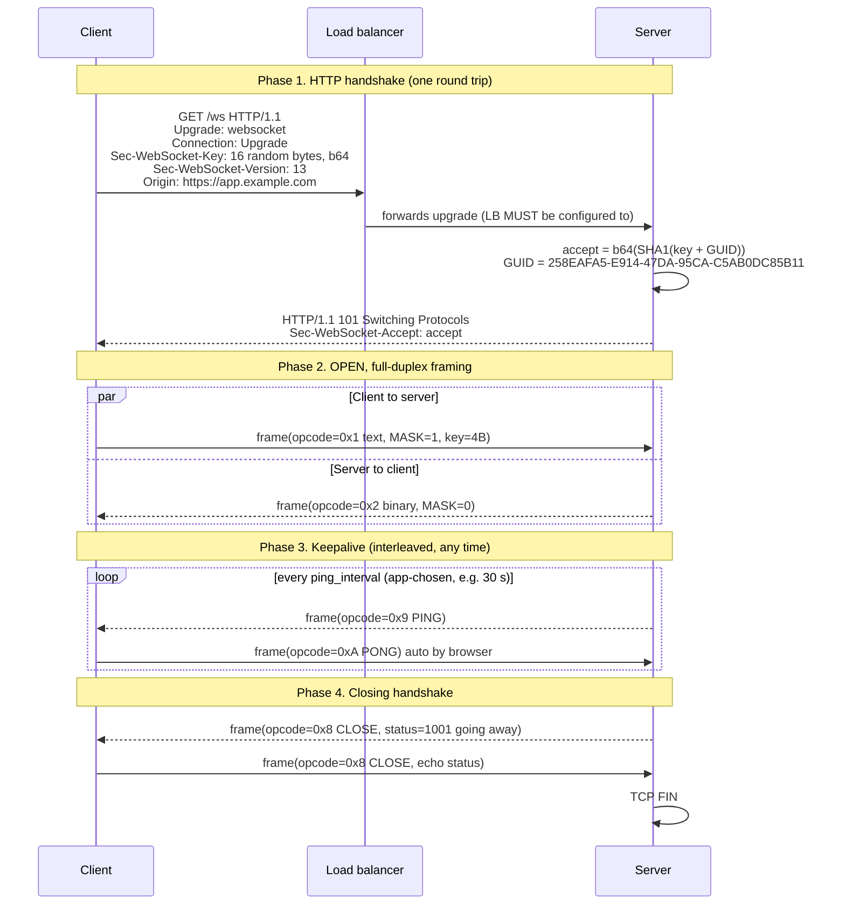

- The handshake is ordinary HTTP, which is exactly why it traverses port 443 and corporate proxies. After the 101, **no HTTP semantics remain**: no headers, no status codes, no paths.
- `Sec-WebSocket-Accept` is not security. It proves the server understood the upgrade, so a naive caching proxy cannot replay a cached 101.
- The ping/pong interval is **not negotiated** in the handshake. Both sides configure it independently. This is the single most misunderstood part of the protocol (see §5).
- A clean close is two CLOSE frames, not one. A TCP reset without CLOSE surfaces as status 1006, which is never sent on the wire, only synthesized locally.

### Frame format **[doc: RFC 6455 §5.2]**

```
 0                   1                   2                   3
 0 1 2 3 4 5 6 7 8 9 0 1 2 3 4 5 6 7 8 9 0 1 2 3 4 5 6 7 8 9 0 1
+-+-+-+-+-------+-+-------------+-------------------------------+
|F|R|R|R| opcode|M| Payload len |    Extended payload length    |
|I|S|S|S|  (4)  |A|     (7)     |             (16/64)           |
|N|V|V|V|       |S|             |   (if len==126 / 127)         |
| |1|2|3|       |K|             |                               |
+-+-+-+-+-------+-+-------------+ - - - - - - - - - - - - - - - +
|     Masking-key (4 bytes, present iff MASK==1)                |
+---------------------------------------------------------------+
|                        Payload Data                           |
+---------------------------------------------------------------+
```

| Opcode | Meaning | Notes |
|---|---|---|
| `0x0` | Continuation | A logical message may span many frames; `FIN=1` ends it |
| `0x1` | Text | Payload MUST be valid UTF-8 |
| `0x2` | Binary | The advantage over SSE: no base64 tax |
| `0x8` | Close | Optional 2-byte status (1000 normal, 1001 going away, 1011 internal error) |
| `0x9` | Ping | Control frame, at most 125 byte payload, cannot be fragmented |
| `0xA` | Pong | Reply MUST echo the ping payload |

- **Masking**: client to server frames MUST be masked with a fresh random 4-byte key XORed over the payload. Server to client frames MUST NOT be. This exists purely to stop a malicious page poisoning proxy caches by making a frame look like a valid HTTP request **[doc]**.
- **Control frames interleave** into the middle of a fragmented message. Ping does not wait for a large in-flight message.
- **`permessage-deflate`** **[doc: RFC 7692]** is the standard compression extension. Each connection carries its own zlib window (default 32 KB each way). At 1M connections that is 64 GB before you store a single byte of app state.

### Full duplex, the mental model

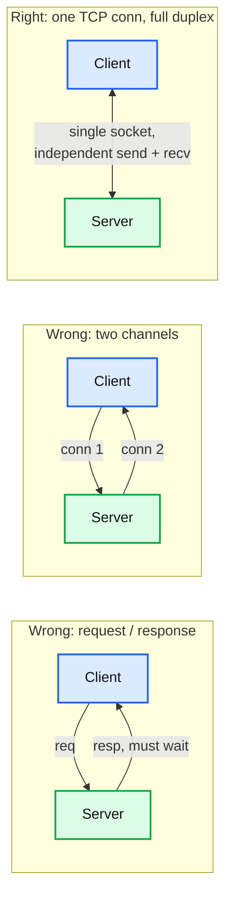

- One TCP connection. TCP is itself full duplex (separate send and receive sequence spaces), so neither direction blocks the other.
- **No message / reply pairing at the protocol level.** If you want request-response, build it: `correlationId` in your envelope plus a pending map on each side.
- Phone call, not walkie-talkie. Both sides may transmit in the same instant.
- Head-of-line blocking still applies *within* the connection: one huge frame delays what is behind it, because it is still one TCP byte stream.

---

## 4. SSE (Server-Sent Events) **[doc: WHATWG HTML]**

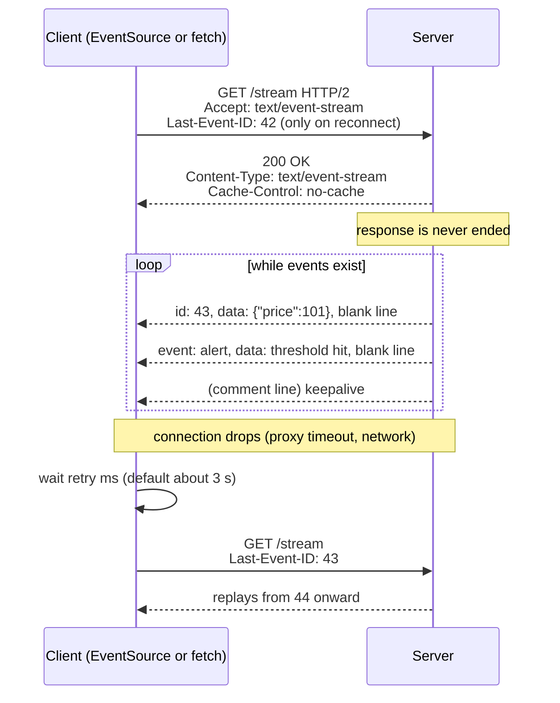

### Wire format

```
id: 43
event: priceUpdate
data: {"symbol":"NIFTY","ltp":24810}
data: continued on a second line
retry: 5000

: this is a comment, used as a keepalive

data: an event with no id or type

```

| Field | Effect |
|---|---|
| `data:` | Payload. Multiple `data:` lines are joined with `\n` |
| `event:` | Custom event name, fires a named listener instead of `onmessage` |
| `id:` | Stored by the browser, echoed as `Last-Event-ID` on reconnect |
| `retry:` | Overrides the client reconnect delay, in ms |
| `:` (comment) | Ignored. The idiomatic keepalive to defeat proxy idle timeouts |
| blank line | **The event delimiter.** `\n\n` terminates an event |

- **No handshake, no upgrade.** A 200 with a content type and a body that never ends. Every HTTP feature (auth headers, cookies, redirects, compression, HTTP/2) keeps working.
- **Auto-reconnect plus `Last-Event-ID` is the killer feature.** Resumable streams with zero client code, if the server can replay from an id. WebSocket gives you nothing here.
- The comment-line keepalive plays exactly the role WebSocket PING plays.
- **Native `EventSource` is GET-only and cannot set custom headers** (cookies only, via `withCredentials`) **[doc]**. This is why most real apps use `fetch` + `ReadableStream` and parse `text/event-stream` themselves.

### Limits

| Limit | Detail | Mitigation |
|---|---|---|
| **6 connections per origin** | HTTP/1.1 browser cap, shared across *all tabs* and *all requests* to that origin. Three tabs with a stream each = half the budget gone, and unrelated fetches hang **[doc]** | **HTTP/2.** About 100 concurrent streams over one TCP connection |
| **Text only** | UTF-8, no binary frames | base64 (+33%) or a side-channel fetch |
| **Uni-directional** | Server to client only | Client sends via ordinary requests |
| **Proxy buffering** | nginx buffers responses by default, which destroys streaming | `proxy_buffering off;` or `X-Accel-Buffering: no` **[doc]** |

> Rule: never run SSE seriously over HTTP/1.1.

---

## 5. Keepalive: who pings, and why timeouts are never negotiated

The failure being defended against is **silent death**: Wi-Fi drops, laptop sleeps, phone loses signal, NAT entry expires. TCP does not notify you. Both ends still believe the socket is open; bytes simply never arrive. Without an active probe you discover this on the next write, possibly hours later.

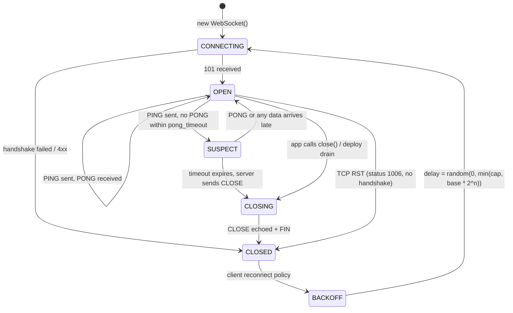

- 1006 (abnormal closure) is the status you see most in production. The peer vanished without a CLOSE frame.
- Pings have a second purpose: they defeat **idle timeouts** in middleboxes, not just detect death.

### Who drives the heartbeat

- **One side owns the ping, normally the server.** The browser WebSocket API auto-replies PONG and does not expose ping to JavaScript **[doc]**, so there is no competing client timer by construction.
- **The client watches for silence.** If nothing arrives (ping *or* data) for longer than expected, it declares the connection dead and reconnects.
- **Client silence timeout must exceed the server ping interval, with margin.** Rule: `client_timeout >= 2 x server_ping_interval`. Ping at 30 s, give up at 60 to 90 s. The gap absorbs one lost ping and prevents false reconnects.
- **Ping interval must sit under the strictest middlebox idle timeout on the path.**

| Middlebox | Default idle timeout | Source |
|---|---|---|
| AWS ALB | 60 s | **[doc]** configurable |
| nginx `proxy_read_timeout` | 60 s | **[doc]** |
| Envoy `stream_idle_timeout` | 5 min | **[doc]** |
| Carrier NAT / mobile | 30 s to 5 min, unknowable | **[inf]** |

> Interview line: "Timeouts are never negotiated. They are configured independently on client, server, and every proxy in between. You make it safe by having only one side ping, setting the client silence budget to at least twice the ping interval, and putting the ping interval under the tightest idle timeout in the path."

---

## 6. Reconnect storms

When a node dies, every connection it held reconnects at once. At 500K connections per node this is a self-inflicted DDoS.

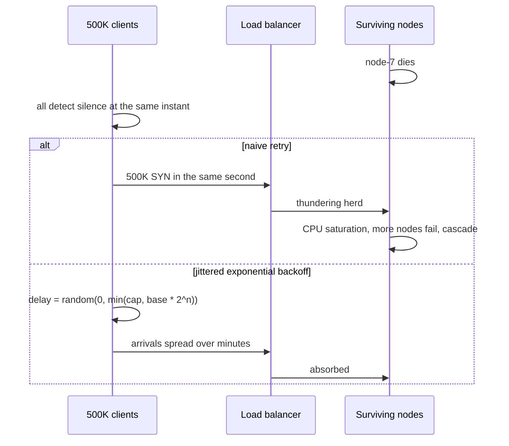

- **Jitter matters more than the backoff.** Pure exponential backoff keeps the herd synchronized; it just retries in synchronized waves. Full jitter (`random(0, window)`) decorrelates them **[doc: AWS Architecture Blog, "Exponential Backoff and Jitter"]**.
- Cap the backoff (e.g. 30 s) or long-tail clients never return.
- Reset the counter only after a *successful, stable* connection. A connect that dies in 2 s should not reset `n`.
- Server-side defence: connection-rate limiting and admission control, so a herd degrades rather than cascades.

---

## 7. How one node holds a million connections

Two separate questions: what a connection *costs*, and how the server *notices* activity on it.

### Cost of an idle connection

| Resource | Per connection | Notes |
|---|---|---|
| File descriptor | 1 | Raise `ulimit -n` and `fs.file-max`. The classic first wall |
| Kernel socket structs | 2 to 4 KB | `struct sock`, `sk_buff` overhead |
| Socket buffers | 4 to 16 KB min, tunable | `net.ipv4.tcp_rmem` / `tcp_wmem`. The dominant term |
| App-level session state | app-dependent | Usually the real hog: subscriptions, user context |
| CPU when idle | about 0 | Idle connections cost *memory*, not CPU |

- Ephemeral port exhaustion (about 28K per (src IP, dst IP, dst port) tuple) bites the **client / LB side**, not the server. A server listening on one port is limited by the 4-tuple, so millions are fine.
- Per-connection compression windows and TLS buffers are frequently what actually blows the memory budget **[inf]**.

### Eventing: the app asks, the kernel never calls back

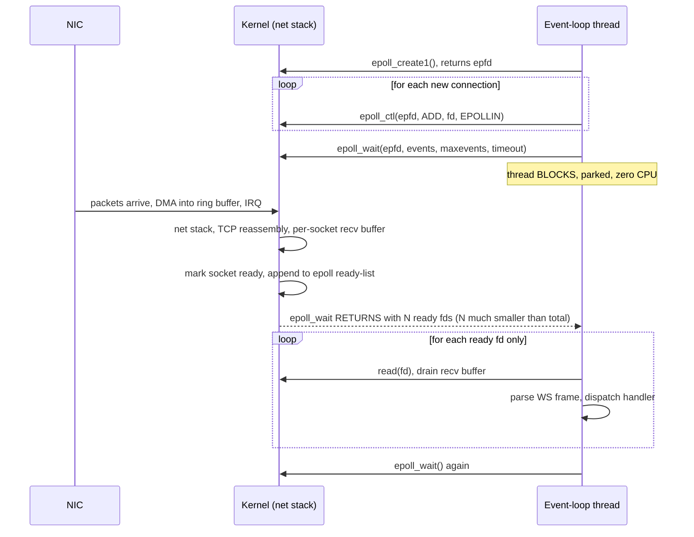

- **Direction of control: the application always asks.** Your thread was already blocked *inside* `epoll_wait`; the kernel simply returns from it. A blocking poll, not a callback.
- **Why `epoll` beats `select` / `poll`**: `select` passes the entire fd set every call and the kernel scans all of it, O(total). `epoll` registers fds once and the kernel keeps a ready-list incrementally, O(active). At 1M connections with 200 active, that is the whole ballgame **[doc: `epoll(7)`]**.
- **No thread per connection.** One or a few event-loop threads serve everything. This is the C10K answer that made C10M possible.
- **Backpressure is automatic and points both ways.** If the app is slow to `read()`, the socket receive buffer fills, TCP shrinks the advertised window, and the *sender* is throttled. A stalled event loop stalls every connection it owns.
- Platform equivalents: `kqueue` (BSD, macOS), IOCP (Windows), `io_uring` (modern Linux, completion-based rather than readiness-based).

---

## 8. Fan-out: routing a message to the node that holds the socket

The connection is pinned to one node. Any other service that wants to notify user X must find that node.

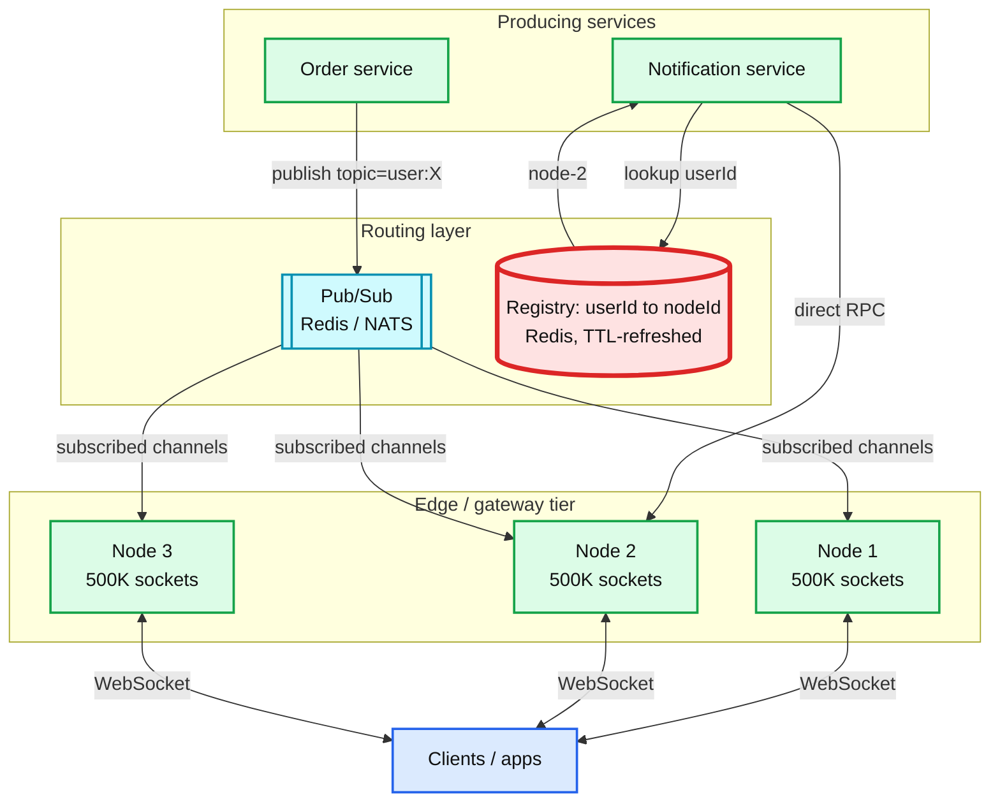

- Two viable designs. **Registry lookup + direct RPC**: precise, one hop, but the registry is a consistency problem across reconnects. **Pub/sub broadcast**: the publisher does not care where the user is and nodes filter locally. Simpler, but every node sees every message unless channels are sharded.
- The registry (red) must be TTL-refreshed and torn down on disconnect, or you accumulate ghost routes pointing at dead nodes. A user who reconnected to node-5 while the entry still says node-2 silently misses messages **[inf]**.
- **Presence is a distributed-systems problem, not a transport problem.** "Is user X online" is genuinely hard under partitions and is where most of the complexity lives. See [`gossip-protocol.md`](gossip-protocol.md) for the liveness side.
- Kafka is a poor fit for per-user channels (topic per user does not scale). Redis pub/sub or NATS subjects fit the fan-out shape **[inf]**.

---

## 9. Worked examples

### LLM chat streaming (Claude / ChatGPT shape) **[inf, observed]**

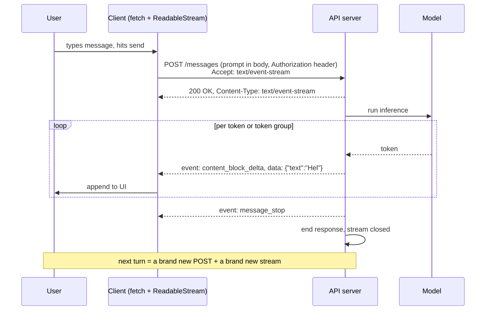

- **One turn = one POST = one SSE stream.** No long-lived connection spans the conversation.
- The *prompt* travels up in the POST body; only the *answer* streams down. A perfect uni-directional fit, no WebSocket needed.
- Because it is a POST with auth headers, native `EventSource` cannot be used. It is `fetch` + manual `text/event-stream` parsing. This detail impresses in interviews.
- Conversation state is carried in the request body each turn, not held on a connection, which is why the API tier stays stateless and horizontally scalable.
- **Voice mode is the opposite shape**: continuous audio up *and* down, with barge-in. True full duplex, so WebSocket, or WebRTC when the latency budget is tightest.

### YouTube live: video + chat on one page

Two independent systems sharing a tab.

| Concern | Mechanism |
|---|---|
| Video | HLS / DASH segments, CDN-cached, client-pulled **[doc, general]** |
| Live chat | Repeated polling of a `get_live_chat` style endpoint returning a batch of messages plus a server-supplied `timeoutMs` for the next poll **[inf, reverse-engineered]** |

- Chat is extremely fan-out skewed: millions read, few post. Reading is server to client; posting is a rare ordinary POST. So it does **not** need full duplex.
- Server-controlled poll interval is a load-shedding lever WebSocket does not give you. Under pressure the server tells everyone to poll less often.

### Slack (#2)

Client sends messages, typing indicators, and presence continuously, and needs them ordered with the inbound stream. That is the "client must push on the same channel" branch, so WebSocket is correct here. The fan-out design in §8 and the drain in §11 are the parts the interviewer probes. See [`hld/slack-messaging/`](../hld/slack-messaging/).

---

## 10. HTTP/2 multiplexing vs WebSocket: the layer distinction

The subtlest point in the topic, worth stating carefully.

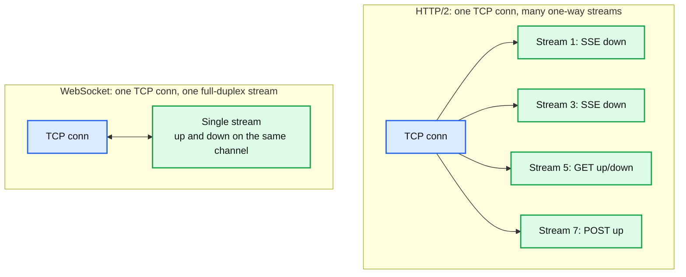

| Dimension | HTTP/2 + SSE | WebSocket |
|---|---|---|
| TCP connections | 1, long-lived | 1, long-lived |
| Logical streams | Many, each short-lived | One, lives for the session |
| Bidirectionality | **Across streams**: many one-way streams on a shared pipe | **Within a stream**: the same channel carries both directions |
| Server-side state | Typically none between streams | Typically rich per-connection session state |
| Framing overhead | HEADERS + DATA frames, HPACK | 2 to 14 byte frame header, no headers at all |
| Node pinning | Yes, same TCP connection | Yes, same TCP connection |
| Drain at deploy | Easy, in-flight streams finish in seconds | Hard, the streams *are* the session |

- **Both pin a long-lived TCP connection to one node.** The idle-connection cost and the "cannot rebalance mid-life" problem are shared. Anyone claiming HTTP/2 avoids that is wrong.
- The real difference is **stream lifetime and statefulness**. HTTP/2 streams are short and stateless, so draining means "let current streams finish, route new ones elsewhere", seconds. WebSocket streams are the session, so draining means killing user sessions or waiting indefinitely.
- HTTP/2 does not make one SSE stream two-way. You get bidirectionality by *having more streams*.
- **RFC 8441** tunnels a WebSocket inside one HTTP/2 stream via extended `CONNECT`, sidestepping the 6-connection limit while keeping full duplex **[doc]**. Support is uneven. **WebTransport over HTTP/3** is the successor direction.

---

## 11. Media streaming: why it is a different world

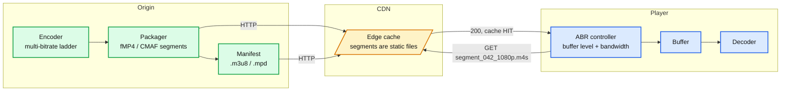

- **HLS** = HTTP Live Streaming (Apple) **[doc: RFC 8216]**. **DASH** = Dynamic Adaptive Streaming over HTTP (MPEG) **[doc: ISO/IEC 23009-1]**. Same idea. HLS is universal on Apple devices, DASH is the open standard but not native on Apple hardware, so most services ship both over one shared CMAF segment set.
- **Why not WebSocket, in one line:** segments are static files, so a CDN serves millions of viewers from the edge. A WebSocket is stateful and personal and cannot be cached at all.
- **Pull is the right shape.** Only the client knows its buffer level, viewport, and bandwidth, so the client must choose the next segment and its quality. That is adaptive bitrate (ABR).
- **Live uses the same machinery.** Latency = segment duration x buffered segments. Classic HLS with 6 s segments lands at 20 to 30 s glass to glass.
- **LL-HLS / LL-DASH** cut this to 2 to 5 s by publishing *partial* segments (CMAF chunks) as they are encoded, plus blocking playlist reloads and preload hints **[doc]**.
- **WebRTC** is the sub-second tier: SRTP over UDP, no TCP head-of-line blocking. Used for interactive betting feeds, auctions, and all two-way voice and video. Full stack, NAT traversal, and SFU scaling in [`concepts/webrtc.md`](webrtc.md).

---

## 12. Load balancers, TLS, and the deploy drain

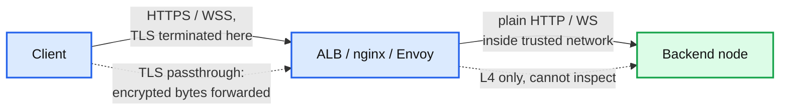

| Issue | Detail | Fix |
|---|---|---|
| **Upgrade stripping** | An LB that does not understand `Upgrade: websocket` drops the header and the handshake fails. Very common real bug | nginx: `proxy_set_header Upgrade $http_upgrade; proxy_set_header Connection "upgrade"; proxy_http_version 1.1;` **[doc]** |
| **LB idle timeout** | The LB is a middlebox with its own clock. ALB defaults to 60 s **[doc]** | Ping interval under it; raise the LB timeout too |
| **Connection pinning** | Post-handshake the LB just tunnels bytes. It cannot rebalance a live connection | Accept it. Plan drain, not rebalance |
| **Client IP loss** | Backend sees the LB IP | `X-Forwarded-For` (L7) or PROXY protocol (L4) **[doc]** |
| **TLS passthrough** | LB cannot see inside: no L7 routing, no header inspection, no upgrade handling. End-to-end encryption though | Terminate unless compliance demands otherwise |

### Deployment drain: the operational punchline

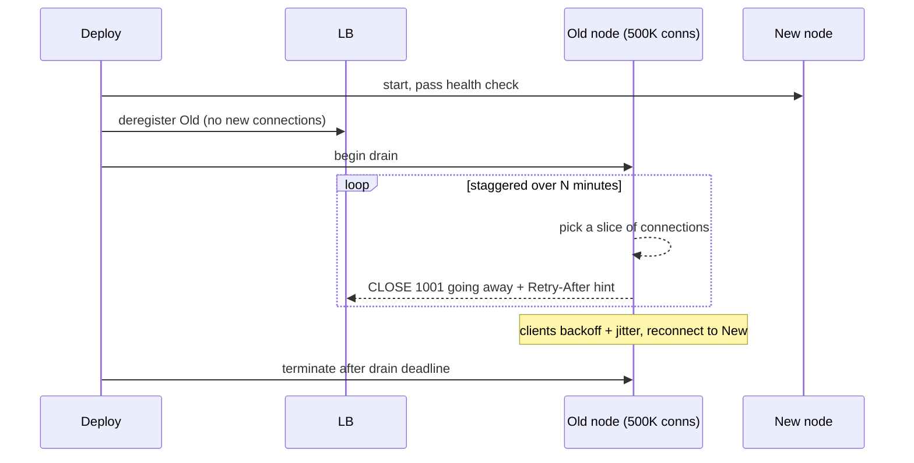

- You cannot migrate a live WebSocket. You can only close it and let the client come back. Design the client to survive that invisibly: resume tokens, replay by last-seen id (borrow SSE `Last-Event-ID`).
- **Stagger the close.** Closing 500K connections at once is a self-inflicted reconnect storm (§6).
- Send close code **1001 (going away)**, not a reset. It tells the client this was intentional and to reconnect promptly rather than back off hard.
- This drain cost is the single strongest argument for preferring SSE over HTTP/2 when you do not need the up direction.

---

## 13. Security

| Risk | Mechanism | Defence |
|---|---|---|
| **Cross-Site WebSocket Hijacking (CSWSH)** | The handshake **is not subject to same-origin policy** and cookies are sent automatically. Any origin can open a WSS to your server with the victim session **[doc]** | **Validate the `Origin` header server-side**, always. Plus a token in the handshake, not just cookies |
| **No CORS preflight** | The browser does not preflight a WS upgrade | Do not rely on CORS. Authenticate the handshake explicitly |
| **Auth on a long connection** | The token was valid at handshake time; it may expire hours later | Re-validate periodically over the connection, or close on token expiry |
| **Resource exhaustion** | 1M unauthenticated connections is a cheap DoS | Authenticate before allocating session state; rate-limit connects per IP; cap per-user connections |
| **Unbounded frames** | `permessage-deflate` zip bombs; giant frames | Max frame and max message size; cap decompression ratio |
| **`wss://` only** | `ws://` is plaintext and gets mangled by intercepting proxies | Always `wss://` |

---

## 14. Failure modes

| Failure | Detection | Recovery | Blast radius |
|---|---|---|---|
| Silent peer death (sleep, Wi-Fi drop) | PING without PONG; client silence timeout | Close + jittered reconnect | 1 connection |
| Proxy idle reap | Connection closes with 1006 | Ping under the idle timeout | All connections through that proxy |
| Slow consumer | Outbound buffer high-water mark | Drop, coalesce, or disconnect the client | 1 client, but memory pressure is node-wide |
| Stalled event loop | Rising `epoll_wait` latency, recv buffers filling | TCP backpressure throttles senders automatically | Every connection on that thread |
| Node loss | Health check / heartbeat to registry | Clients reconnect elsewhere; registry entries expire by TTL | All connections on the node, then a reconnect storm |
| Reconnect storm | Connect-rate spike | Backoff + jitter, connect rate limiting, admission control | Potentially cluster-wide cascade |
| LB strips `Upgrade` | 100% handshake failure right after a config change | Config fix | Total outage, and it looks like an app bug |
| SSE proxy buffering | Events arrive in one burst at the end, or never | `proxy_buffering off` | All SSE clients behind that proxy |

**Slow-consumer policy** is a real design decision: buffer (memory risk), drop oldest (lossy but bounded), coalesce to latest-value-per-key (best for dashboards and tickers), or disconnect (harsh, self-protecting). Pick deliberately **[inf]**.

**What pages someone at 3am**: connect rate (storm), p99 `epoll_wait` latency (stalled loop), per-node connection count vs memory (about to OOM), 1006 rate by proxy (idle reap), handshake failure rate (upgrade stripped).

---

## 15. Trade-offs, the Staff framing

| Decision | Option A | Option B | Pick | Why |
|---|---|---|---|---|
| Transport for server push | WebSocket | SSE over HTTP/2 | SSE | Free reconnect and replay, trivial drain, one fewer protocol. Take WebSocket only for a continuous up direction |
| Routing to the pinned node | Registry + direct RPC | Pub/sub broadcast | Pub/sub until node count is large | Registry consistency across reconnects is the hard part. Broadcast wastes bandwidth but has no ghost-route bug |
| Slow consumer | Buffer | Coalesce to latest | Coalesce for tickers, disconnect for chat | Bounded memory. Chat cannot lose messages, so disconnect and replay from id |
| TLS | Terminate at LB | Passthrough | Terminate | Passthrough loses upgrade handling, header routing, and `X-Forwarded-For` |
| Deploy | Rebalance live connections | Drain and reconnect | Drain, staggered, close 1001 | Live migration of a TCP socket is not a thing. Design the client for resume instead |
| Live video | Push over WebSocket | Pull segments over HTTP | Pull | CDN cacheability and client-side ABR. Push is only right for sub-second, and then it is WebRTC, not WebSocket |

---

## 16. Staff-level questions

1. **Two sides, two independent timers.** Server pings every 30 s; the client gives up after 20 s of silence. Describe the failure mode, quantify the churn at 500K connections, and state the invariant that fixes it. *(False-positive reconnect loop; `client_timeout >= 2 x ping_interval`; only one side drives the heartbeat.)*
2. **Control flow at the kernel boundary.** Does the kernel invoke the application when a frame arrives, or does the application ask? Trace it from NIC IRQ to handler dispatch, and explain what happens when the app stops calling `read()`. *(App blocks in `epoll_wait`; kernel returns from it. Recv buffer fills, TCP window shrinks, sender throttled.)*
3. **Layer confusion.** "HTTP/2 multiplexes streams, so it is bidirectional like WebSocket." Where is this right, where is it wrong, and what operational consequence follows? *(Right at the connection layer, wrong at the stream layer; the consequence is drain cost, driven by stream lifetime and statefulness.)*
4. **Why YouTube does not push video.** Two independent reasons WebSocket is wrong for video on demand, and the one case where video *does* use a persistent duplex channel. *(CDN cacheability; ABR requires client-side pull. Exception: real-time video chat over WebRTC.)*
5. **Deploying to a million live connections.** Design the rollout: how connections drain, what the client does, what close code you send, and how you avoid the second outage you just caused. *(Deregister, staggered close 1001, client resume by id, jittered backoff, connect-rate admission control.)*
6. **Choose for me.** A trading dashboard with 200K users, prices every 100 ms, users occasionally place orders. Which transport, and what is the slow-consumer policy? *(SSE over HTTP/2 for prices, coalesce to latest per symbol; orders are ordinary POSTs. WebSocket would be justified only if order entry needed to be sequenced with the price stream.)*

---

## 17. Patterns that reappear elsewhere

| Pattern | Mechanism | Here | Elsewhere |
|---|---|---|---|
| **Readiness vs completion notification** | Kernel reports which fds are *ready* and the app does the I/O, vs kernel does the I/O and reports completion | `epoll` / `kqueue` (readiness) vs IOCP / `io_uring` (completion) | Reactor vs Proactor; Netty, libuv |
| **Backpressure via flow-control window** | Receiver advertises capacity; sender throttles with no explicit signal | TCP recv window shrinking when the loop stalls | Kafka fetch throttling; gRPC / HTTP-2 `WINDOW_UPDATE`; Reactive Streams `request(n)` |
| **Resumable stream via last-seen cursor** | Client remembers a position; server replays from it | SSE `Last-Event-ID` | Kafka consumer offsets; K8s watch `resourceVersion`; CDC LSN |
| **Jittered exponential backoff** | Decorrelate synchronized retries after a correlated failure | Reconnect storms after node loss | etcd / gRPC retry; AWS SDKs; Raft randomized election timeouts ([raft.md](raft.md)) |
| **Sticky, un-rebalanceable placement** | Long-lived state pins work to a node; you can re-place but not migrate | WebSocket pinning, drain not rebalance | Kafka partition reassignment; contrast K8s pods (recreate, stateless) |
| **Cacheability as the dominant constraint** | The decision is made by what a CDN can serve, not by latency | HLS / DASH pull beating any push design | Static-site generation; edge caching in general |
| **Keepalive as middlebox defence** | Periodic traffic prevents intermediaries reaping idle state | WS PING, SSE comment lines | NAT keepalive; TCP keepalive; gRPC HTTP-2 pings |

---

## 18. Sources

**Specifications**
- RFC 6455, The WebSocket Protocol: https://datatracker.ietf.org/doc/html/rfc6455
- RFC 7692, Compression Extensions for WebSocket: https://datatracker.ietf.org/doc/html/rfc7692
- RFC 8441, Bootstrapping WebSockets with HTTP/2: https://datatracker.ietf.org/doc/html/rfc8441
- RFC 9113, HTTP/2: https://datatracker.ietf.org/doc/html/rfc9113
- WHATWG HTML, Server-Sent Events: https://html.spec.whatwg.org/multipage/server-sent-events.html
- RFC 8216, HTTP Live Streaming: https://datatracker.ietf.org/doc/html/rfc8216
- ISO/IEC 23009-1, MPEG-DASH
- W3C WebRTC 1.0: https://www.w3.org/TR/webrtc/

**Docs**
- `epoll(7)`: https://man7.org/linux/man-pages/man7/epoll.7.html
- MDN WebSocket API / EventSource: https://developer.mozilla.org/en-US/docs/Web/API/WebSockets_API
- Apple LL-HLS: https://developer.apple.com/documentation/http-live-streaming
- AWS ALB idle timeout: AWS ELB user guide
- nginx WebSocket proxying: https://nginx.org/en/docs/http/websocket.html
- AWS Architecture Blog, Exponential Backoff and Jitter

**Background**
- Kegel, The C10K problem: http://www.kegel.com/c10k.html
- Phoenix, The Road to 2 Million WebSocket Connections (2015): https://www.phoenixframework.org/blog/the-road-to-2-million-websocket-connections
- WhatsApp, 2M connections on FreeBSD (2012)

Related: [`gossip-protocol.md`](gossip-protocol.md) (presence, liveness), [`raft.md`](raft.md) (jittered timeouts), [`../popular_systems_deepdive/kafka/`](../popular_systems_deepdive/kafka/) (offsets as resumable cursors).
