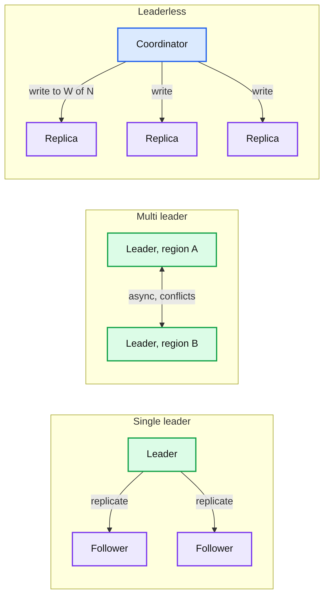
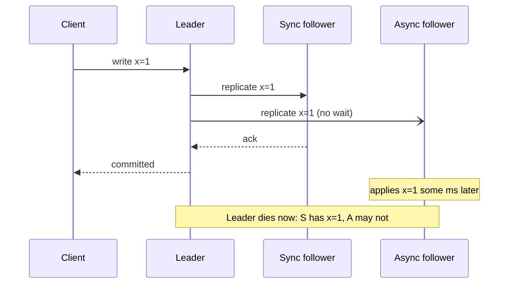
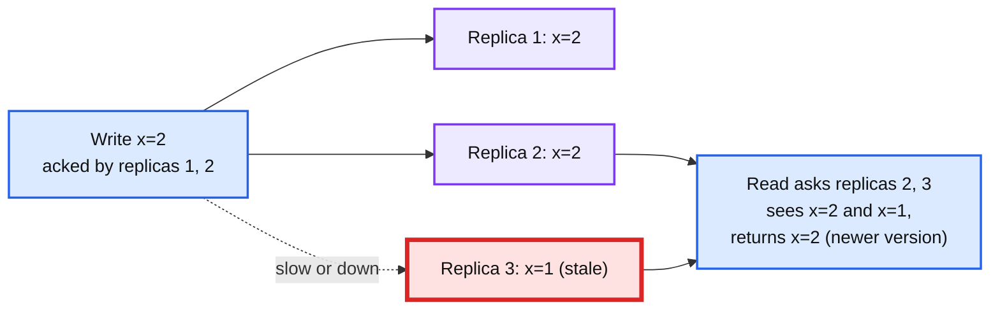
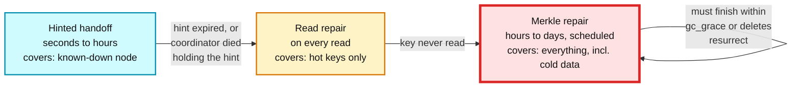
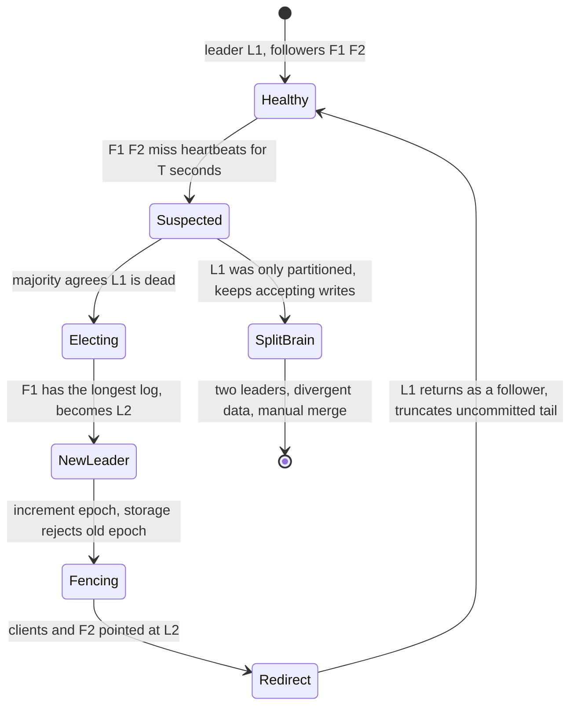

# Concept: Replication and Quorums

> One-liner: replication keeps N copies of the data so one machine dying loses nothing; the two decisions are **who accepts writes** (one leader, or any replica) and **how many copies must confirm before you answer** (write quorum W, read quorum R). With `R + W > N` every read overlaps a write, which gives you consistency for a single key; anything less gives you eventual consistency and a set of repair mechanisms to make "eventual" arrive.

Depth target: high-level, same as [raft.md](raft.md) and [gossip-protocol.md](gossip-protocol.md). It is the block under "what happens when a replica is down for an hour", which is asked in every storage design.

---

## 1. Mental model

You have one copy of the data on one disk. It dies, the data is gone. You make three copies on three machines. Now every write has to reach three places and every read has to decide how many to ask. That decision is the whole topic.

| Topology | Writes go to | Ordering | Conflicts | Failover | Examples |
|---|---|---|---|---|---|
| **Single leader** | One node. Followers replicate its log. | Total order, free | None | Elect a new leader. Async followers may lose recent writes. | PostgreSQL, MySQL, MongoDB, Kafka partitions, Raft groups |
| **Multi leader** | One leader per region. Leaders replicate to each other. | Per-leader order, cross-leader conflicts | Yes, must resolve (LWW, CRDT, app logic) | Each region survives alone | Active-active Postgres (BDR), CouchDB, DynamoDB global tables, calendar apps offline |
| **Leaderless** | Any replica, via a coordinator. | None. Version per key. | Yes, resolved on read (vector clocks, LWW) | Nothing to fail over. Any W nodes suffice. | Dynamo, Cassandra, Riak, ScyllaDB, Voldemort |

**Why this matters more at Staff level.** Senior answers pick a topology. Staff answers say what the client sees during the 30 seconds after a node dies, which reads can go stale, how the stale replica catches up, and what `RF=3, W=2, R=2` actually costs in latency and in disk.

---

## 2. Synchronous vs asynchronous replication

Independent of topology, each replica link is sync or async.

| Mode | Durability on leader loss | Write latency | Availability |
|---|---|---|---|
| **Sync** to all | Zero loss | Slowest replica, cross-region = 50 to 150 ms | One slow or dead follower blocks all writes |
| **Sync to one, async to rest** (semi-sync) | Zero loss if the sync one survives | One fast follower | Promote a new sync follower when the old one dies. MySQL semi-sync, Postgres `synchronous_standby_names`. |
| **Async** to all | Recent writes lost on failover, typically ms to seconds | Local disk only | Never blocked by followers |
| **Quorum** (W of N) | Zero loss as long as W nodes survive | Wth-fastest replica | Any N-W can die |

Replication lag is a number you must state: **p50 sub-second, p99 seconds, and unbounded under load** (a bulk load or a slow disk on one follower makes lag climb until reads from that follower are minutes stale). A follower read is only safe if the application tolerates that.

---

## 3. Quorums: the arithmetic

N replicas. A write is acknowledged when W replicas confirm. A read asks R replicas and returns the newest value it sees.

| Setting | Guarantee | Use |
|---|---|---|
| `R + W > N` | Every read set intersects every write set. Read sees the latest acknowledged write **for that key**. | "Strong" for a single key, not linearizable across keys or under concurrent writes. |
| `W = N, R = 1` | Reads are cheap and always fresh. Writes block on every replica. | Read-heavy, write-rare (config, catalog). |
| `W = 1, R = N` | Writes are cheap. Reads pay. | Write-heavy audit logs read rarely. |
| `W = R = QUORUM = N/2 + 1` | Balanced. N=3 tolerates 1 down for both reads and writes. | The default in Cassandra for anything that matters. |
| `R + W <= N` | Reads can miss the latest write. | Eventual consistency. `ONE/ONE` in Cassandra. Fast, and correct only if the app tolerates it. |

**Numbers for N=3:** `QUORUM` is 2. Tolerates 1 failure. **N=5:** `QUORUM` is 3, tolerates 2. Going from 3 to 5 replicas costs 67% more disk for one more failure tolerated, which is why 3 is the default and 5 is for metadata that must not go down.

What `R + W > N` does **not** give you:

- **Concurrent writes.** Two clients write different values at the same time to different W-sets. Both are "acknowledged". A later read sees both versions. Someone must pick: last-writer-wins by timestamp (loses one), vector clocks and sibling resolution (Riak, original Dynamo), or a CRDT merge ([crdt.md](crdt.md)).
- **Failed writes.** A write reaches 1 of the required 2 replicas and then fails. The client gets an error, but the value is on one replica and will be returned by some future reads. **Writes are not rolled back.** Quorum stores have no atomic abort.
- **Cross-key consistency.** Two keys with separate quorums have no ordering relative to each other. A transaction needs a different tool (consensus, [raft.md](raft.md), or a log).
- **Monotonic reads.** Two reads from different R-sets can go backwards in time. Fix by pinning a session to a coordinator, or by session tokens.

**Sloppy quorum and hinted handoff.** When a home replica is down, Dynamo-style stores write to *any* W reachable nodes, including nodes outside the key's preferred set. The extra node stores a **hint** ("this belongs to node 3") and forwards it when node 3 returns. Availability goes up. Consistency goes down: `R + W > N` no longer guarantees overlap, because the sets are no longer the same N nodes. Cassandra calls this hinted handoff and keeps hints for 3 hours by default; after that the write only reaches node 3 through repair.

---

## 4. Anti-entropy: how "eventual" arrives

Replicas diverge: a node was down past the hint window, a write hit 2 of 3, a disk was replaced. Three mechanisms bring them back, at three latencies.

| Layer | Trigger | Coverage | Cost | Gap it leaves |
|---|---|---|---|---|
| **Hinted handoff** | Write could not reach a replica | Only writes during a known outage | One extra write on the hint holder, replayed later | Hints expire (3 h). Hint holder can die. |
| **Read repair** | Read at `R > 1` sees replicas disagree | Only keys that get read | One extra write per divergent read. Digest reads (send hash, not value) keep it cheap. | Cold data never repaired. |
| **Merkle / full repair** | Scheduled, or an operator | Every key in the range | Scan and hash all data per replica, stream differences. See [merkle-tree.md](merkle-tree.md) section 6. | Overstreaming. Must complete within `gc_grace_seconds` (10 days) or tombstones vanish on one replica and deleted rows come back. |

The Staff line: **hints for speed, read repair for hot data, Merkle repair for correctness. None is sufficient alone.** Cassandra 5 finally ships an automated scheduler for the third because operators kept not running it.

---

## 5. Single-leader failover, step by step

The topology most people pick, and the part they cannot explain.

What to say at each step:

- **Detection**: heartbeat timeout `T`. Too short and a GC pause or network blip triggers a needless failover. Too long and you are down for `T` seconds. 10 to 30 s is common for databases, 150 to 300 ms for Raft groups that expect it.
- **Election**: needs a majority to avoid two leaders. This is consensus, see [raft.md](raft.md). Databases without built-in consensus lean on ZooKeeper, etcd, or Patroni.
- **Choosing the candidate**: the follower with the most complete log. With async replication that follower may still be behind the dead leader. **Those writes are lost.** State the number: at 1 s replication lag and 10k writes/s, that is ~10k acknowledged writes gone.
- **Fencing**: the old leader may still be alive and think it is leader. Every write carries the epoch, and storage (or the followers) rejects a stale epoch. Without this, split brain. See [leases-fencing-clocks.md](leases-fencing-clocks.md).
- **Rejoin**: the old leader comes back with writes that were never replicated. It must discard them (truncate to the new leader's commit point), not merge them. GitHub's 2012 MySQL incident was a rejoin that kept them.
- **Client redirect**: DNS, a proxy, or a service discovery entry. DNS TTL of 60 s means 60 s of writes going to a dead address.

---

## 6. Where you meet it

| System | Topology | Quorum | Detail |
|---|---|---|---|
| **PostgreSQL, MySQL** | Single leader, streaming WAL | Semi-sync configurable | Failover via Patroni (Postgres) or Orchestrator (MySQL) using etcd or Consul for the election. |
| **Kafka** | Single leader per partition, ISR set | `acks=all` waits for every in-sync replica, `min.insync.replicas=2` | The ISR shrinks when a follower lags past `replica.lag.time.max.ms`. With ISR=1 and `acks=all` you have one copy and think you have three. |
| **Raft groups** (etcd, CockroachDB, TiKV) | Single leader with consensus | Majority for commit | Leader is elected, log is the truth, fencing via term number. |
| **Cassandra, ScyllaDB** | Leaderless, RF per keyspace | Tunable per query: `ONE`, `QUORUM`, `LOCAL_QUORUM`, `ALL`, `EACH_QUORUM` | Sloppy quorum via hints. LWT (Paxos) for compare-and-set. |
| **DynamoDB** | Leaderless within a region, three AZs | Writes to 2 of 3, strongly consistent read hits the leader replica | Global tables are multi-leader with LWW conflict resolution. |
| **MongoDB** | Single leader (primary) per replica set | `writeConcern: majority`, `readConcern: majority` | Rollback files for the old primary's unreplicated writes. |
| **Spanner** | Paxos per split, leader per split | Majority | TrueTime for cross-split ordering. |
| **S3, GFS, HDFS** | Chunk replicated to 3, or erasure coded | Write to all 3 in a pipeline | HDFS pipeline: client writes to replica 1, which forwards to 2, which forwards to 3. Ack flows back. |
| **Redis** | Single leader, async | None by default. `WAIT` command for sync. | Redis Cluster failover can lose acknowledged writes. Not a durable store unless you accept that. |

---

## 7. Practical additions every real implementation has

| Addition | Problem it fixes |
|---|---|
| **Digest reads** | Read repair at `R=3` moves three full values. Send one value plus two hashes. |
| **Speculative retry / hedging** | One slow replica makes every quorum read slow. Send to R+1 after p99 elapses, take the first R. |
| **Rack and AZ aware placement** | Three replicas on one rack die together. `NetworkTopologyStrategy`. |
| **`LOCAL_QUORUM`** | Cross-region quorum is 100 ms. Quorum within the local DC, async to remote. |
| **Session consistency tokens** | Read-your-writes across replicas. Client carries the last write's version, replica waits until it has it. |
| **Replica lag metric and read routing** | Followers lagging by minutes serving reads. Route around any follower over a lag threshold. |
| **Hint TTL, hint storage cap** | Hints for a node that is down for a week fill the coordinator's disk. |
| **Repair scheduler** | Operators do not run repair, tombstones expire, deletes resurrect. |
| **Bootstrap and decommission streaming** | Adding a node must copy its ranges before it serves reads, or reads return empty. |
| **Epoch or term in every write** | Old leader's writes accepted after failover. |

---

## 8. Failure modes and what happens

| Failure | What happens | Fix |
|---|---|---|
| Async leader dies | Acknowledged writes on the leader only are lost. | Semi-sync, or state the loss window and accept it. |
| Sync follower is slow | Every write is slow. One follower can take down write availability. | Semi-sync with automatic promotion of a different follower. |
| Split brain | Two leaders accept writes. Divergent data, manual merge. | Majority election plus fencing token. |
| Old leader rejoins without truncating | Its unreplicated writes reappear. | Truncate to the new leader's commit index on rejoin. |
| `R + W <= N` by accident (`ONE/ONE`) | Stale reads immediately after writes. | Default to `QUORUM`. Audit per-query consistency levels. |
| Sloppy quorum, hint holder dies | Write lost until Merkle repair. | Shorter repair interval, more replicas. |
| Repair never runs, past `gc_grace` | Deleted row returns from a replica that missed the tombstone. **Zombie data.** | Repair within `gc_grace`. Alert on repair age. |
| Concurrent writes, LWW | One write silently dropped. With clock skew, the *older* one can win. | CRDT, vector clocks with sibling resolution, or route writes for a key through one node. |
| Kafka ISR shrinks to 1 | `acks=all` is satisfied by one replica. That broker dies, data gone. | `min.insync.replicas=2`, alert on under-replicated partitions. |
| Follower reads with unbounded lag | User writes, refreshes, sees the old value. | Read-your-writes token, or read from leader after a write for N seconds. |

---

## 9. Trade-offs

| Gain | Cost |
|---|---|
| Single leader: total order, no conflicts, simple reasoning. | Failover window, writes block on one node, cross-region writes pay the round trip to the leader. |
| Multi leader: every region writes locally. | Conflicts are guaranteed, resolution is your problem, and "last writer wins" is data loss with a nicer name. |
| Leaderless: no failover, any W replicas suffice, tunable per query. | No ordering, concurrent writes need vector clocks or CRDTs, three repair mechanisms to operate. |
| `R + W > N`: fresh single-key reads without a leader. | Two of three replicas on every read *and* write. Tail latency is the second-slowest replica. |
| Sync replication: zero data loss. | Write latency is the slowest link. One bad disk stalls the cluster. |
| Async replication: fast writes, followers never block. | Acknowledged writes lost on failover. Stale follower reads. |
| Sloppy quorum: available through any failure. | Overlap guarantee broken. Consistency now depends on repair. |

**What a Staff answer refuses to build:** a leaderless store for anything needing a transaction across keys, async replication for a ledger, `ONE/ONE` on a user-facing read-after-write path, a single-leader system with no fencing, and a quorum store with no scheduled repair.

---

## 10. Numbers worth memorizing

- `RF=3, W=2, R=2` is the default that tolerates one failure. `RF=5, QUORUM=3` tolerates two, at 67% more disk.
- Same-AZ replication round trip: **~0.5 to 1 ms**. Cross-AZ: **1 to 2 ms**. Cross-region: **50 to 150 ms**. A sync cross-region write is at least one of those.
- Replication lag: p50 < 100 ms, p99 seconds, unbounded under bulk load. Alert at 10 s.
- Failover: detection 10 to 30 s for databases, 150 to 300 ms for Raft. Election ~1 s. Client redirect bounded by DNS TTL (60 s) or proxy health check (~5 s). Total: **30 to 90 s** of write unavailability for a typical managed database.
- Data lost on async failover: `lag * write rate`. 1 s and 10k/s is 10k writes.
- Cassandra hint window: **3 hours**. `gc_grace_seconds`: **10 days**. Repair must complete inside that.
- Kafka: `replica.lag.time.max.ms` = 30 s default. `min.insync.replicas` = 1 default, set to 2.
- HDFS write pipeline: 3 replicas, 2 racks. GFS: 3 replicas, chunk 64 MB.

---

## 11. Interview soundbite

> "I replicate three ways, sync to one follower and async to the rest, so the leader dying loses nothing and a slow follower cannot block writes. Reads that need read-your-writes go to the leader or carry a session token, everything else goes to followers with a lag cap. For a leaderless store I run `RF=3, W=2, R=2` so reads and writes overlap on at least one replica, and I say out loud that this is single-key consistency only: concurrent writes need a CRDT or a vector clock, and failed writes are never rolled back. Divergence is repaired by hints in seconds, read repair on access, and scheduled Merkle repair within `gc_grace` so tombstones never outlive their replicas. Failover is a majority election plus a fencing epoch so the old leader cannot write after it returns."

Follow-ups an interviewer will ask, in order of likelihood:

1. A replica is down for an hour. What happens to writes, and how does it catch up? (Section 3 hints, section 4 repair.)
2. Leader dies with 1 s of replication lag. What did the user lose? (Section 5, `lag * rate`.)
3. `R + W > N`, so it is strongly consistent, right? (Section 3, single-key only, no concurrent-write or failed-write guarantee.)
4. How do you stop the old leader from accepting writes? (Section 5, fencing epoch.)
5. Why three replicas, not two or five? (Section 10, majority of 3 tolerates 1, 5 costs 67% more for one more.)
6. User writes then reads and sees the old value. (Section 7, session token or leader read.)
7. Why does Cassandra need repair if it has quorums? (Section 4, hints expire, cold data, `gc_grace`.)
8. Cross-region: sync or async? (Section 2 and 7, `LOCAL_QUORUM` sync in region, async across, and state the RPO.)

Related: [raft.md](raft.md) (how the election and log truncation actually work), [merkle-tree.md](merkle-tree.md) (the third repair layer), [gossip-protocol.md](gossip-protocol.md) (how nodes learn who is down), [crdt.md](crdt.md) (resolving concurrent writes without a leader), [leases-fencing-clocks.md](leases-fencing-clocks.md) (why the epoch is necessary), [sharding.md](sharding.md) (which N nodes hold a key), `popular_systems_deepdive/cassandra/cassandra-05-coordinator-consistency.md` and `cassandra-07-repair-streaming.md` (source-verified quorum and repair internals), `popular_systems_deepdive/kafka/` (ISR replication).
