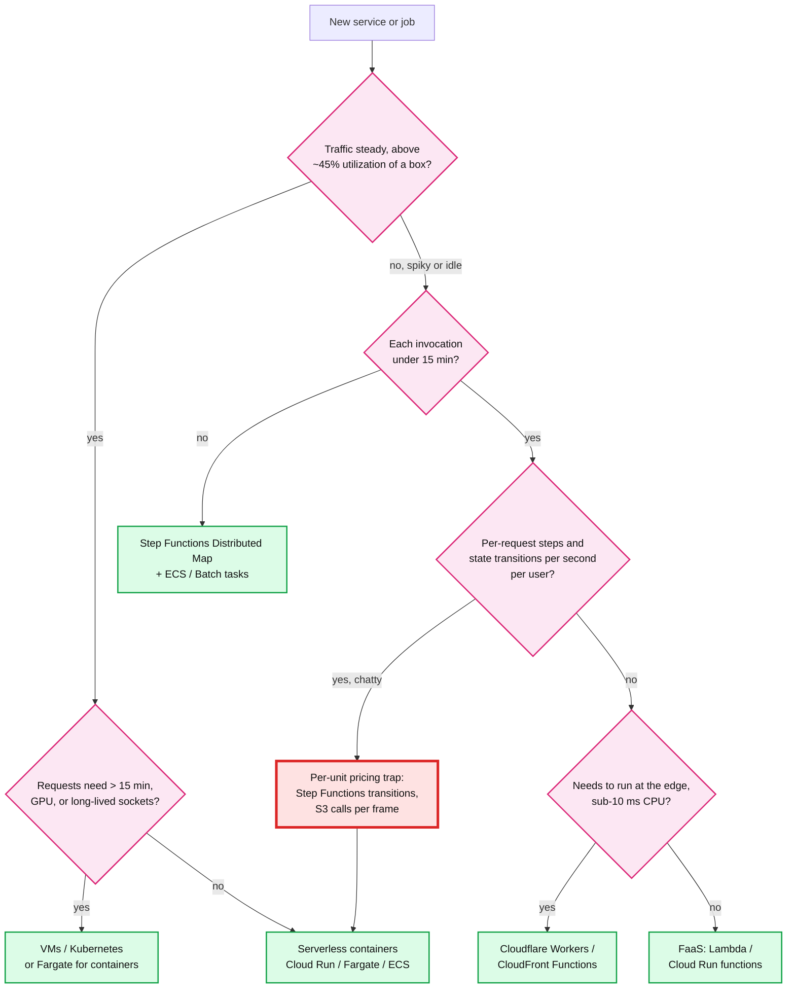
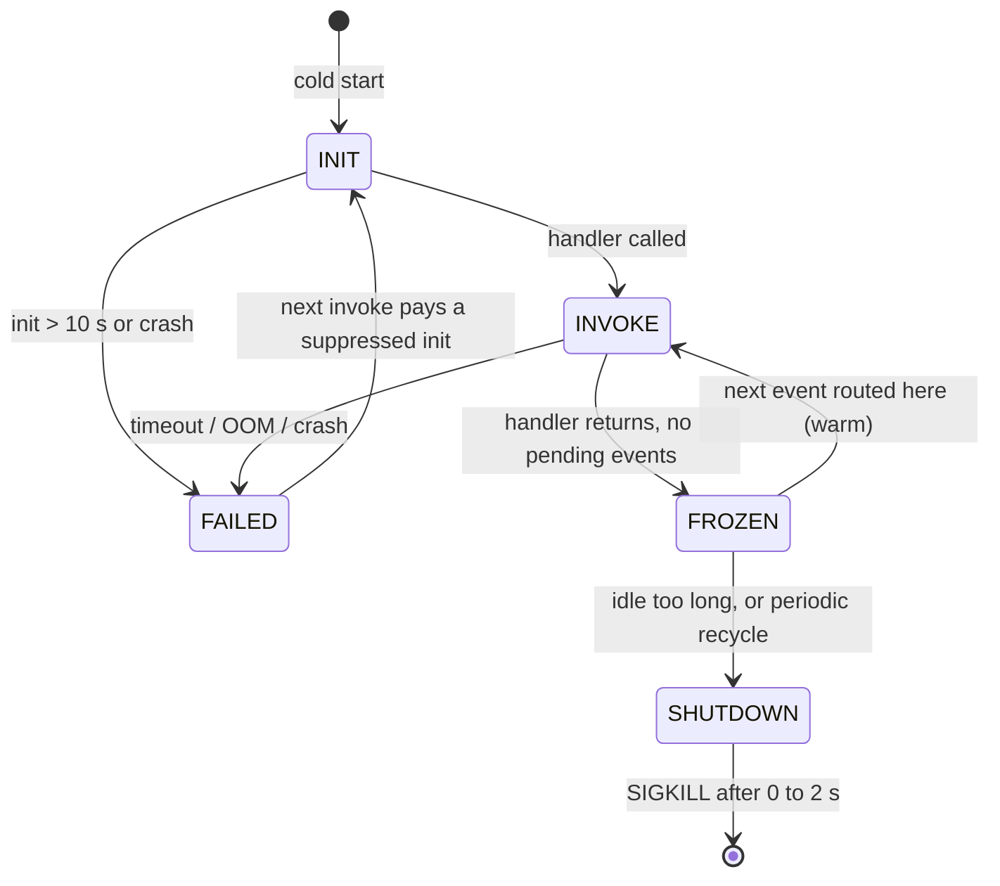
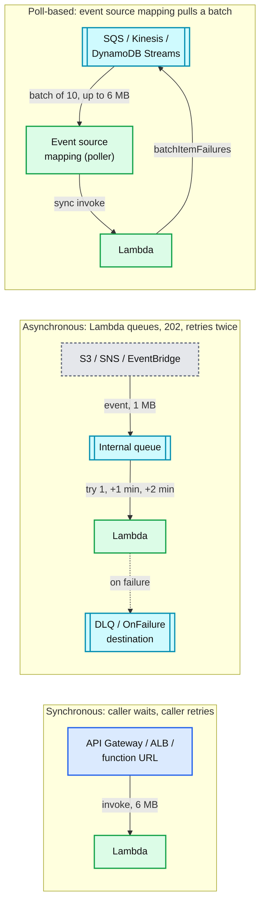
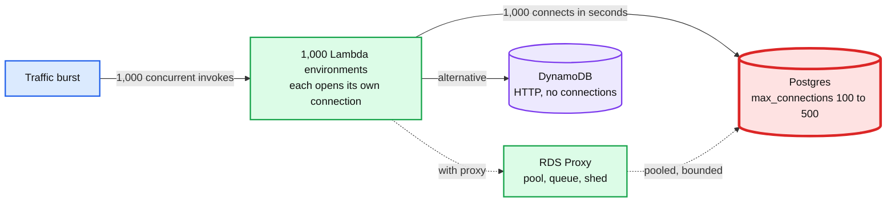
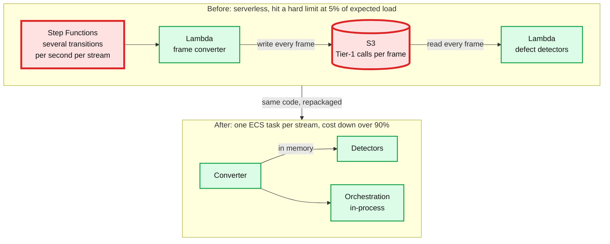

# Concept: Serverless Architecture

> One-liner: serverless is a billing and operations contract, not a technology. The provider owns capacity, you pay per unit of work, idle costs zero. It wins when traffic is spiky or near zero most of the day, requests are short, and the team is small. It loses when the box would be busy more than about 45% of the time, when a request needs a long-lived connection or more than 15 minutes, or when the workload is chatty enough that per-unit pricing (per transition, per object, per request) dominates.

Covers FaaS (Lambda, Cloud Run functions, Azure Functions), serverless containers (Fargate, Cloud Run), edge functions (Cloudflare Workers, Lambda@Edge), and serverless data (DynamoDB on-demand, Aurora Serverless v2, SQS, EventBridge). Depth target: enough to choose, to explain what runs under the hood, to do the cost math out loud, and to name what breaks.

Sources are marked **[doc]** (vendor doc, paper) or **[inf]** (inferred, derived arithmetic, community observed). Prices are us-east-1 list prices, Sep 2026. Full survey with a URL per claim: see §16.

Used by: #7 network throttling (token refill as a scheduled function), #26 monitoring (event pipelines), #1 book seller broker (fan-out to partner APIs), any "design a webhook / image pipeline / cron" question.

---

## 1. Which one, when

### Quick chooser

| You are building | Use | Why this and not the next one up |
|---|---|---|
| Webhook receiver, S3 upload processor, cron job, glue between AWS services | **FaaS (Lambda)** | Event-driven, short, bursty, idle most of the day. Scale to zero is the whole point. |
| Public API at 200 rps steady, 50 ms per call | **Containers (Cloud Run / Fargate)** | At 46% utilization Lambda is more expensive than an always-on box, and Lambda serves one request per environment. See §6 math. |
| Christmas-day IoT activation spike, Black Friday checkout | **FaaS + queues** | 20x to 200x spikes with no pre-provisioning (iRobot, LEGO). Queue absorbs the burst, Lambda drains it. |
| Auth header rewrite, A/B routing, geo redirect | **Edge functions (Workers, CloudFront Functions)** | 5 ms isolate start, runs in 300 PoPs, no origin round trip. |
| Order workflow with retries, waits, and an audit trail | **Step Functions Standard** | Exactly-once state transitions, 1-year duration, visual history. Pay per transition. |
| High-volume idempotent stream transform | **Step Functions Express or plain Lambda + Kinesis** | Per-execution pricing, 5 min cap, at-least-once. |
| Per-frame video analysis, thousands of state transitions per second | **One ECS task, in-memory pipeline** | Prime Video: Step Functions + S3 per frame hit a hard limit at 5% of load; monolith on ECS cut cost by 90%. |
| Long-lived WebSocket chat backend | **Containers** | Lambda invocations are capped at 15 min and hold no socket. API Gateway WebSocket + DynamoDB connection table is the serverless workaround, at a latency and complexity cost. See [`realtime-client-server-communication.md`](realtime-client-server-communication.md). |
| Model training, GPU inference | **Containers / VMs** | Lambda has no GPU and 10 GB RAM max. Cloud Run offers L4 GPUs. |
| Database for the above | **DynamoDB on-demand** or **Aurora Serverless v2** | Connection-free HTTP API (DynamoDB) avoids the pool-exhaustion problem in §8. Aurora v2 scales to 0 ACU. |

### The mistakes interviewers listen for

- Saying "serverless is cheaper". It is cheaper below roughly 20% utilization and more expensive above roughly 45%. Show the arithmetic.
- Chaining Lambdas by synchronous invoke. You pay for both durations and couple their timeouts. Use a queue or a workflow engine.
- Forgetting at-least-once. Every async path (S3, SNS, SQS, EventBridge) can deliver the same event twice. Idempotency is mandatory, not optional.
- Treating the execution environment as stateless. It is reused. Connections and caches outside the handler survive, and that is both the optimization and the leak.
- Claiming "no cold starts" after adding Provisioned Concurrency without saying it costs about the same as an always-on Fargate task.

---

## 2. The spectrum side by side

| Tier | Examples | Unit of deployment | Billed on | Scale to zero | Isolation |
|---|---|---|---|---|---|
| FaaS | Lambda, Cloud Run functions, Azure Functions Flex | handler | requests + GB-s (Lambda), vCPU-s + GiB-s (Cloud Run) | yes | Firecracker microVM (Lambda) |
| Serverless containers | Cloud Run, Fargate, Azure Container Apps | OCI image | vCPU-s + GiB-s | Cloud Run yes, Fargate no (task runs until stopped) | microVM (Fargate), gVisor / microVM (Cloud Run) |
| Edge functions | Cloudflare Workers, Lambda@Edge, CloudFront Functions | JS / Wasm isolate | requests + CPU-ms | yes | V8 isolate, 128 MB |
| Serverless data | DynamoDB on-demand, Aurora Serverless v2, S3, SQS, EventBridge | table / cluster / queue | request units, ACU-hours, GB, messages | DynamoDB yes, Aurora v2 yes at 0 ACU | n/a |

**Key design bets, one line each**
- Lambda: one microVM per execution environment, one request at a time, reuse the environment across invokes, freeze it between them. VM-grade isolation at container-grade density.
- Cloud Run: one container serves up to 1,000 concurrent requests; the autoscaler adds containers. Cheaper per request for I/O-bound services because requests share CPU-seconds.
- Cloudflare Workers: many tenants inside one V8 process as isolates. Cold start is an isolate create (about 5 ms), not a VM boot. Pays for it with a restricted API (no raw sockets, no filesystem) and 128 MB.
- The vendors are converging from both sides **[doc]**: Lambda Managed Instances (2025) runs Lambda on EC2 in your account with multi-concurrency and no scale to zero, at EC2 price plus 15%. Cloud Run added GPUs. The FaaS vs container line is now a dial, not a wall.

---

## 3. Under the hood: Firecracker and the Lambda worker

```mermaid
%% Lambda invoke path. Worker Manager routes to a warm slot; only on a miss does Placement create a new microVM from the pool.
flowchart LR
    Client["Caller<br/>API GW / SDK / event"] -->|"invoke"| FE["Front end<br/>auth, throttle"]
    FE -->|"find warm slot"| WM["Worker Manager<br/>sticky routing"]
    WM -->|"hit: reuse"| Slot1["Warm environment<br/>thawed, handler runs"]
    WM -->|"miss"| PL["Placement<br/>pick a worker"]
    PL -->|"take from pool"| Pool[/"Pre-booted microVM pool<br/>1 pooled VM per 8 creates/s"/]
    Pool -->|"load code, run init"| Slot2["New environment<br/>cold start"]
    Slot1 --> Worker
    Slot2 --> Worker
    subgraph Worker["Worker host (EC2 bare metal)"]
        MM["MicroManager<br/>owns the pool"]
        FC["Firecracker VMM<br/>50k lines Rust, KVM"]
    end

    class Client client
    class FE,WM,PL,Slot1,Slot2,MM,FC service
    class Pool cache
    classDef client  fill:#dbeafe,stroke:#2563eb,stroke-width:2px,color:#111
    classDef service fill:#dcfce7,stroke:#16a34a,stroke-width:2px,color:#111
    classDef cache   fill:#fef3c7,stroke:#d97706,stroke-width:2px,color:#111
```

Numbers from the NSDI 2020 paper (Agache et al., "Firecracker: Lightweight Virtualization for Serverless Applications") **[doc]**:
- Memory overhead under 5 MB per microVM (measured about 3 MB for the VMM). Boots to application code in under 125 ms. Up to 150 microVMs created per second per host.
- About 50k lines of Rust, 96% fewer than QEMU. No PCI, no legacy devices, no live migration. A jailer drops the VMM into seccomp + cgroup + chroot before the guest boots.
- 125 ms is "not fast enough for the scale-up path", so each worker keeps a small pool of pre-booted microVMs. By Little's law at 125 ms per create, one pooled VM covers 8 creates per second.
- Thousands of microVMs per host with about 3% memory overhead.

Container images (up to 10 GB) start fast because of the ATC 2023 "On-demand Container Loading" design **[doc]**: image flattened to a block device, split into 512 KiB content-addressed chunks, deduplicated across tenants, lazily loaded through per-worker cache, AZ cache, then S3. About 80% of newly uploaded functions contain zero unique chunks. Targets 15,000 new containers per second for one customer, starts as low as 50 ms.

### Execution environment lifecycle

- **Init phase** = extensions + runtime + your code outside the handler. Capped at 10 s on on-demand functions **[doc]**. Billed since 1 Aug 2025 for every configuration.
- **Freeze / thaw**: between invokes the environment is frozen. Objects outside the handler (DB connections, SDK clients, caches) survive. `/tmp` content survives, even across an invoke-failure reset.
- **One invoke at a time per environment.** 100 concurrent requests = 100 environments. This is the single biggest architectural difference from Cloud Run.
- Environments are recycled "every few hours" even under continuous load **[doc]**, so out-of-handler state is an optimization, never correctness.

---

## 4. Cold starts

A cold start is: fetch code, boot the microVM, start the language runtime, run your init. AWS states cold starts happen on under 1% of invocations and last from under 100 ms to over 1 s **[doc]**. Interpreted runtimes (Python, Node) start fastest; Java and .NET with a framework can take multiple seconds (AWS's own Spring Boot SnapStart demo measured just over 6 s of init). No official per-runtime table exists **[unverified]**.

| Fix | What it does | Figures | Cost |
|---|---|---|---|
| Smaller package, lazy SDK clients | Less to download and parse | "The largest contributor of latency before function execution comes from initialization code" **[doc]** | Free |
| **SnapStart** (Java 11+, Python 3.12+, .NET 8+) | Runs init at publish time, snapshots the microVM memory + disk, restores on scale-up. 512 KB chunks, L1 per-worker cache about 1 ms, L2 per-AZ single-digit ms | Java "up to 10x faster", demo 6 s to under 200 ms. Python / .NET "several seconds to sub-second" **[doc]** | Free for Java; per GB-hour snapshot + per restore for Python / .NET |
| **Provisioned Concurrency (PC)** | Pre-initialized environments on an alias | "Double-digit millisecond" **[doc]** | $0.0000041667 per GB-s while provisioned. 10 x 1 GB for a month = $109.50 before any invokes **[inf]**, about an always-on 2 vCPU Fargate task |
| Cloud Run min instances | Keeps N containers warm | Idle CPU at $0.0000025 per vCPU-s vs $0.000024 active **[doc]** | About 10% of active rate |

SnapStart caveats **[doc]**: anything random generated in init (seeds, UUIDs, tokens) is cloned into every restore and must be re-randomized. Network connections may not survive restore. No PC, no EFS, `/tmp` capped at 512 MB.

The 2019 VPC fix: before Hyperplane ENIs, every VPC-attached environment created and attached its own ENI at cold start. Now one ENI per subnet + security-group combination is created at function-create time and shared. AWS's example: 14.8 s down to 933 ms **[doc]**.

---

## 5. Hard limits

### Lambda **[doc]**

| Limit | Value |
|---|---|
| Timeout | 900 s (15 min). 90 min for Managed Instances on async / event-source invokes |
| Memory | 128 MB to 10,240 MB. At 1,769 MB you get one full vCPU; CPU scales with memory |
| Package | 50 MB zipped, 250 MB unzipped including layers, 10 GB container image |
| `/tmp` | 512 MB to 10,240 MB |
| Payload | 6 MB sync request and response, 200 MB streamed response, **1 MB async** (older material says 256 KB; the current quotas page says 1 MB) |
| Environment variables | 4 KB total |
| Concurrency, account per Region | 1,000 default, tens of thousands on request |
| Scaling rate | 1,000 new environments every 10 s per function, not accrued. 429 beyond it. (The old 500 to 3,000 initial-burst model is gone from the docs) |
| Sync requests per environment | 10 per second |
| Init | 10 s on demand; up to 15 min with PC / SnapStart / Managed Instances |

**Reserved vs provisioned concurrency**: reserved is a free hard slice of the account pool that is also a ceiling (reserved = 0 is a kill switch; you cannot reserve the last 100 units). Provisioned is pre-warmed environments, charged, and cannot combine with SnapStart.

### Cloud Run **[doc]**

| Limit | Value |
|---|---|
| Request timeout | 300 s default, 3,600 s (60 min) max |
| Memory / vCPU per instance | 32 GiB / 8 vCPU |
| Concurrent requests per instance | 80 default, 1,000 max |
| Instances per project per region | 100 default, adjustable |
| Request / response size (HTTP/1) | 32 MiB each; streaming and HTTP/2 bypass this |
| GPU | NVIDIA L4 available |

### Cloudflare Workers **[doc]**

| Limit | Free | Paid |
|---|---|---|
| Memory per isolate | 128 MB | 128 MB |
| CPU time per request | 10 ms | 30 s default, up to 5 min |
| Wall-clock duration | no hard limit | no hard limit |
| Subrequests | 50 | 10,000 |

CPU time, not wall time, is billed and limited. A Worker awaiting a 2 s upstream fetch burns about 0 CPU-ms **[inf]**.

### Edge on AWS **[doc]**: Lambda@Edge 30 s timeout, 50 MB package, shares the Region concurrency quota. CloudFront Functions 10 KB code, 2 MB memory, header rewrites only.

---

## 6. Pricing and the break-even, with the math

Lambda us-east-1 x86 **[doc]**: $0.20 per 1M requests, $0.0000166667 per GB-second, billed per 1 ms, init included. Free tier 1M requests + 400,000 GB-s per month.

Fargate us-east-1 **[doc]**: $0.04048 per vCPU-hour, $0.004445 per GB-hour.

**Cost of one invoke** (1 GB, 100 ms): 0.1 GB-s x $0.0000166667 = $0.00000167, plus $0.0000002 request = **$0.00000187**.

**Always-on baseline**: Fargate 1 vCPU + 2 GB for 730 h = 730 x (0.04048 + 2 x 0.004445) = **$36.04 / month**.

**Break-even by volume**: 36.04 / 0.00000187 = **19.3M invokes / month = 7.4 rps sustained**. At 100 rps sustained Lambda is $491 / month, 13.6x the Fargate task **[inf]**.

**Break-even by utilization**: Lambda at 1,769 MB (one vCPU) costs 1.769 x 3600 x $0.0000166667 = $0.106 per busy hour. Fargate 1 vCPU + 2 GB costs $0.049 per hour busy or not. **Break-even at 46.5% utilization** **[inf]**.

| Utilization of a right-sized box | Cheaper option | Why |
|---|---|---|
| Under 20% | Lambda, clearly | Idle costs zero and you save the ops time of running the box |
| 20% to 45% | Lambda on raw compute, but close. Ops cost and cold starts decide | Add PC and Lambda loses |
| Over 45% | Containers | Per-second pricing of an always-on box beats per-ms pricing of an idle-capable one |

Other per-unit prices that bite **[doc]**: Step Functions Standard $0.000025 per state transition (10 transitions per second for a month = $657 for orchestration alone **[inf]**). Cloud Run request-based: $0.000024 per vCPU-s active, $0.40 per 1M requests, 100 ms rounding. Cloudflare Workers: $5 / month for 10M requests + 30M CPU-ms, then $0.30 per 1M requests.

---

## 7. Invocation patterns and event sources

| Pattern | Retry contract **[doc]** | Numbers to say |
|---|---|---|
| Sync | Lambda does not retry. The caller does | API Gateway 10,000 rps account throttle, 5,000 burst. REST API integration timeout was hard-capped at 29 s until June 2024, now raisable for Regional and private REST APIs |
| Async | Function errors retried twice (1 min, then 2 min). Throttles and 5xx retried for up to 6 h with backoff | "It is possible for it to receive the same event from Lambda multiple times because the queue itself is eventually consistent" |
| SQS poll | Batch of 10 default, window up to 5 min. Starts at 5 concurrent, adds up to 300 per minute, max 1,250 per mapping | Return `batchItemFailures` so only failed messages go back. Configure the DLQ on the queue, not the function. Max concurrency per mapping (2 to 1,000) protects the downstream |
| Kinesis poll | One batch per shard, in order. ParallelizationFactor 1 to 10 keeps partition-key order | A function error stops the shard until bisect / max-age / max-retries drains it |

**At-least-once is the contract everywhere.** The Powertools idempotency utility hashes the payload, stores it in DynamoDB with a 1 h default expiry, and returns the cached result on a duplicate **[doc]**. See `concepts/exactly-once.md` (todo).

---

## 8. State and connections: what a stateless function still holds

- **Connection exhaustion** is the classic serverless outage. Every warm environment holds a connection; a burst creates them faster than the database accepts them. RDS Proxy "establishes a database connection pool and reuses connections", "queues or throttles application connections that can't be served immediately" and sheds load beyond limits **[doc]**. Alternatives: DynamoDB (HTTP, connection-free), Aurora Data API, or reserved concurrency as a crude connection cap.
- **Two state loopholes**: objects outside the handler survive across invokes of the same environment, and `/tmp` (512 MB to 10 GB) persists while frozen. Use them for SDK clients, JIT warmth, model files. Never for correctness.
- **Anything shared goes to a store**: DynamoDB, S3, ElastiCache, EFS (not with SnapStart).
- **Long-lived connections are the wrong shape.** A WebSocket needs a process that outlives 15 min and holds a socket. API Gateway WebSocket APIs work around this by holding the socket at the gateway and invoking a Lambda per message, with connection ids in DynamoDB. Fine for low-volume notifications, wrong for chat at scale. See [`realtime-client-server-communication.md`](realtime-client-server-communication.md).

---

## 9. Orchestration: chaining functions

Never chain by synchronous invoke. Chain with **queues / events** for throughput and loose coupling, or a **workflow engine** when you need state across steps, retries with backoff, waits, or an audit trail.

| | Step Functions Standard | Step Functions Express |
|---|---|---|
| Max duration | 1 year | 5 minutes |
| Semantics | Exactly-once ("tasks and states are never run more than once") | Async at-least-once, sync at-most-once |
| Pricing | $0.000025 per state transition | $1 per 1M executions + GB-s |
| History | 90 days, console debuggable | CloudWatch Logs only |
| Use for | Payments, order flows, anything non-idempotent | IoT ingestion, streaming transforms, high-volume idempotent work |
| Distributed Map, `.waitForTaskToken` | Yes | No |

**[doc]** for all rows. Azure Durable Functions and the new Lambda Durable Functions do the same thing with event-sourced replay, which is why orchestrator code must be deterministic.

**Fan-out / fan-in**: fan out via SNS or EventBridge with N targets, or Distributed Map. Fan in via Map / Parallel joins, or a DynamoDB counter with a conditional update where the last writer triggers the aggregate **[inf]**. Fannie Mae ran Monte Carlo on 20M mortgages at up to 15,000 concurrent executions in 2 h, 3x faster than before **[doc]**.

---

## 10. Worked example: Prime Video's monitoring service (Mar 2023) **[doc]**

- In their words: "The main scaling bottleneck in the architecture was the orchestration management that was implemented using AWS Step Functions. Our service performed multiple state transitions for every second of the stream, so we quickly reached account limits. Besides that, AWS Step Functions charges users per state transition." And: "the high number of Tier-1 calls to the S3 bucket was expensive."
- Moving to a monolith in a single ECS task "reduced our infrastructure cost by over 90%", and let them use EC2 savings plans.
- **Staff reading**: this is not "serverless bad". It is per-unit pricing applied to a steady, always-on, chatty workload. Every serverless cost lever pointed the wrong way. The right first question was "how many billable units per second per stream", and nobody asked it.

**Where serverless won, same primary-source bar** **[doc]**: iRobot handles 20x Christmas-day spikes with a platform run by under 10 people. LEGO rebuilt on serverless after a 2 h Black Friday outage and now absorbs 200x transaction spikes. FINRA validates 37B market events a day at over 50% lower cost. Coca-Cola shipped touchless Freestyle pouring in 100 days. Common thread: spiky, event-driven, small team. Prime Video's workload had none of these.

---

## 11. Failure modes

| Failure | Mechanism | Mitigation | Blast radius |
|---|---|---|---|
| Throttling (429) | Account concurrency (1,000) or scaling rate (1,000 per 10 s) exhausted | Reserved concurrency on critical functions, raise the quota before launch, alarm on `Throttles` | Every function in the account and Region |
| Noisy neighbour in your own account | The concurrency pool is per account per Region. Lambda@Edge shares it | Reserved concurrency, one account per team or environment | Account-wide |
| Retry storm | Async retries x SQS redrive x caller retries multiply load on a slow dependency | Idempotency keys, DLQ, `MaximumRetryAttempts = 0` on async config, circuit breaker in a Step Functions Catch | Downstream dependency |
| Recursive loop | Function writes to the bucket / queue that triggers it | Since July 2023 Lambda drops after 16 hops for SQS, SNS, and direct chains, and emits `RecursiveInvocationsDropped`. **S3 loops are not detected**: use separate prefixes or buckets **[doc]** | Your bill |
| Cold start p99 | New environments on scale-up or after recycle. Java heaviest | SnapStart, PC on the alias, alarm on `Init Duration` | p99 only |
| Connection exhaustion | §8 | RDS Proxy, reserved concurrency as a cap | The database, so everything |
| Duplicate side effects | At-least-once on every async path | Idempotency, conditional writes | Data correctness |
| Poison record on Kinesis | Error stops the shard | Bisect on error, max retries, on-failure destination | One shard, then `IteratorAge` climbs |
| DynamoDB on-demand throttle | Traffic more than double the previous 30 min peak | Warm throughput, ramp over 30 min | The table |

**What pages someone at 3am**: `Throttles` > 0 on a reserved function, `IteratorAge` climbing on a stream, DLQ depth > 0, `RecursiveInvocationsDropped` > 0, p99 Duration crossing the API Gateway timeout, `ConcurrentExecutions` near the account limit.

---

## 12. Security

| Concern | Rule **[doc]** |
|---|---|
| Execution role | One IAM role per function, scoped to the specific table / bucket / queue ARNs. Never one shared "lambda-role" |
| Who can invoke | Resource-based policy. Function URLs with `AuthType: NONE` are public; deny `NONE` org-wide with an SCP and pin with `lambda:FunctionUrlAuthType` conditions |
| Isolation | Firecracker microVM per environment on shared hardware. Workers rely on V8 isolates plus API restriction, a weaker boundary |
| SnapStart | Snapshots are encrypted. Re-randomize seeds, UUIDs, and tokens after restore because cloned state is identical across environments |
| Destination hijack | Deleting an on-failure S3 bucket without removing it from the function lets another account recreate the name and receive your records. Add an `s3:ResourceAccount` condition |
| Shared responsibility | Provider patches host, hypervisor, managed runtime. You own code, dependencies, IAM, secrets |

---

## 13. Trade-offs, the Staff framing

| Decision | Option A | Option B | Pick | Why |
|---|---|---|---|---|
| Compute for a spiky API | Lambda | Cloud Run / Fargate | Lambda under ~20% utilization, containers over ~45% | §6 arithmetic. In between, ops cost and cold-start tolerance decide |
| Cold starts | SnapStart | Provisioned Concurrency | SnapStart for Java, PC only for a strict p99 SLO | SnapStart is free for Java. PC costs about an always-on Fargate task |
| Orchestration | Step Functions Standard | Queues + idempotent handlers | Standard for non-idempotent flows, queues for volume | Per-transition pricing is the Prime Video trap |
| Database | RDS + Proxy | DynamoDB | DynamoDB when the access pattern allows | Connection-free removes the §8 failure mode entirely |
| Delivery | At-least-once + idempotency | Exactly-once via Standard workflows | At-least-once + idempotency by default | Cheaper, and the idempotency key is needed anyway for caller retries |
| Edge | Workers / CloudFront Functions | Lambda@Edge | Workers or CloudFront Functions for header work | 5 ms isolate start, no Region concurrency shared with your Lambdas |
| Lock-in | Vendor events, IAM, ASL | Portable OCI + Kubernetes | Accept lock-in for glue, keep the core domain in containers | Rewriting a 200-line webhook handler is cheap; rewriting a Step Functions state machine is not |

---

## 14. Staff-level questions

1. **"Our API is 200 rps steady, 50 ms per call, Java. Lambda or containers?"** Containers. Concurrency needed = 200 x 0.05 = 10 environments. Lambda at 1 GB: 26.3M GB-s = $438 plus 526M requests = $105, about $543 / month. A 2 vCPU / 4 GB Fargate task is $72 / month and serves 200 rps with in-process concurrency **[inf]**. Add Java cold starts on every scale-up and one request per environment. Say what you refused to build: PC, SnapStart tuning.
2. **"Why did Prime Video get 90% cheaper on ECS?"** Per-state-transition and per-S3-call pricing on a per-frame, always-on pipeline. They hit a hard limit at 5% of expected load. In-memory data passing in one task removed both per-unit charges. Lesson: count billable units per second before choosing.
3. **"Design an image thumbnailer on S3 + Lambda. What breaks?"** Recursive loop if the output goes to the same prefix (loop detection does not cover S3). At-least-once means idempotent output keys. 6 MB sync / 1 MB async payload means pass keys, not bytes. 15 min cap means video goes to Distributed Map + ECS.
4. **"Cut p99 for a Lambda behind API Gateway from 1.2 s to 200 ms."** Measure `Init Duration` first. If init dominates: SnapStart or PC on the alias, trim the package, lazy-load SDK clients, move DB connect into init behind RDS Proxy. If not init: it is downstream, add caching. State the PC cost you added.
5. **"1,000 concurrent Lambdas hit Postgres. What happens?"** `max_connections` exhausted and connection-churn CPU on the DB. RDS Proxy with load shedding, reserved concurrency as a hard cap, or move the hot path to DynamoDB.
6. **"Exactly-once in Step Functions Standard: what does it mean and why can't Express offer it?"** Standard persists state between transitions so a step never re-runs without an explicit Retry. Express keeps state in memory, runs at-least-once (async) or at-most-once (sync), caps at 5 min, and so needs idempotent steps.
7. **"When would you move a service off serverless?"** When utilization is steady above ~45%, when the workload is chatty per unit (transitions, objects, requests per second per user), when p99 cannot tolerate cold starts and PC costs more than the box, or when you need sockets, GPUs, or more than 15 min. Show one of those with numbers, not adjectives.

---

## 15. Patterns that reappear elsewhere

| Pattern | Here | Elsewhere |
|---|---|---|
| Pool pre-warmed resources sized by Little's law | Firecracker microVM pool, 1 per 8 creates/s at 125 ms | Connection pools, thread pools, pre-allocated shards |
| Content-addressed chunk dedup | 512 KiB container chunks, 80% zero-unique uploads | Git objects, Docker layers, backup systems, [`bloom-filter.md`](bloom-filter.md) for chunk existence checks |
| Snapshot and restore instead of re-init | SnapStart | Database checkpoints, CRIU, VM live migration |
| At-least-once + idempotency key | Async invokes, SQS, Kinesis | Kafka consumers, payment APIs, `concepts/exactly-once.md` |
| Per-unit pricing as a design constraint | Step Functions transitions, S3 calls per frame | DynamoDB request units, egress pricing, API rate cards |
| Reserved capacity as both floor and ceiling | Reserved concurrency | Kubernetes requests and limits, CPU quotas |
| Utilization break-even between on-demand and always-on | ~45% Lambda vs Fargate | Spot vs on-demand, reserved instances, cloud vs colo |

---

## 16. Sources

The full 388-line survey with a URL beside every number is kept outside the repo. The primary sources it draws on:

**Papers**
- Agache et al., Firecracker: Lightweight Virtualization for Serverless Applications, NSDI 2020: https://www.usenix.org/system/files/nsdi20-paper-agache.pdf
- Brooker et al., On-demand Container Loading in AWS Lambda, USENIX ATC 2023: https://www.usenix.org/system/files/atc23-brooker.pdf

**AWS docs and blogs**
- Lambda quotas: https://docs.aws.amazon.com/lambda/latest/dg/gettingstarted-limits.html
- Lambda scaling behaviour: https://docs.aws.amazon.com/lambda/latest/dg/scaling-behavior.html
- Execution environment lifecycle: https://docs.aws.amazon.com/lambda/latest/dg/lambda-runtime-environment.html
- SnapStart: https://docs.aws.amazon.com/lambda/latest/dg/snapstart.html and https://aws.amazon.com/blogs/compute/under-the-hood-how-aws-lambda-snapstart-optimizes-function-startup-latency/
- Cold starts: https://aws.amazon.com/blogs/compute/operating-lambda-performance-optimization-part-1/
- Async retries: https://docs.aws.amazon.com/lambda/latest/dg/invocation-async-error-handling.html
- SQS event source mapping: https://docs.aws.amazon.com/lambda/latest/dg/with-sqs.html
- Kinesis event source mapping: https://docs.aws.amazon.com/lambda/latest/dg/with-kinesis.html
- Hyperplane ENIs (2019): https://aws.amazon.com/blogs/compute/announcing-improved-vpc-networking-for-aws-lambda-functions/
- Recursive loop detection (2023): https://aws.amazon.com/blogs/compute/detecting-and-stopping-recursive-loops-in-aws-lambda-functions/
- RDS Proxy: https://docs.aws.amazon.com/AmazonRDS/latest/UserGuide/rds-proxy.html
- Step Functions Standard vs Express: https://docs.aws.amazon.com/step-functions/latest/dg/choosing-workflow-type.html
- Lambda Managed Instances: https://docs.aws.amazon.com/lambda/latest/dg/lambda-managed-instances.html
- Pricing: https://aws.amazon.com/lambda/pricing/ , https://aws.amazon.com/fargate/pricing/ , https://aws.amazon.com/step-functions/pricing/
- Case studies: https://docs.aws.amazon.com/whitepapers/latest/optimizing-enterprise-economics-with-serverless/case-studies.html , https://aws.amazon.com/solutions/case-studies/irobot-iot/ , https://aws.amazon.com/blogs/industries/building-a-serverless-event-driven-retail-order-management-system/

**Prime Video** (original post, archived): https://web.archive.org/web/20230501000000/https://www.primevideotech.com/video-streaming/scaling-up-the-prime-video-audio-video-monitoring-service-and-reducing-costs-by-90

**GCP and Cloudflare**
- Cloud Run quotas, concurrency, pricing: https://docs.cloud.google.com/run/quotas , https://docs.cloud.google.com/run/docs/about-concurrency , https://cloud.google.com/run/pricing
- Workers limits, pricing, how it works: https://developers.cloudflare.com/workers/platform/limits/ , https://developers.cloudflare.com/workers/platform/pricing/ , https://developers.cloudflare.com/workers/reference/how-workers-works/

Related: [`realtime-client-server-communication.md`](realtime-client-server-communication.md) (why sockets and serverless do not mix), [`bloom-filter.md`](bloom-filter.md), `concepts/exactly-once.md` (todo).
