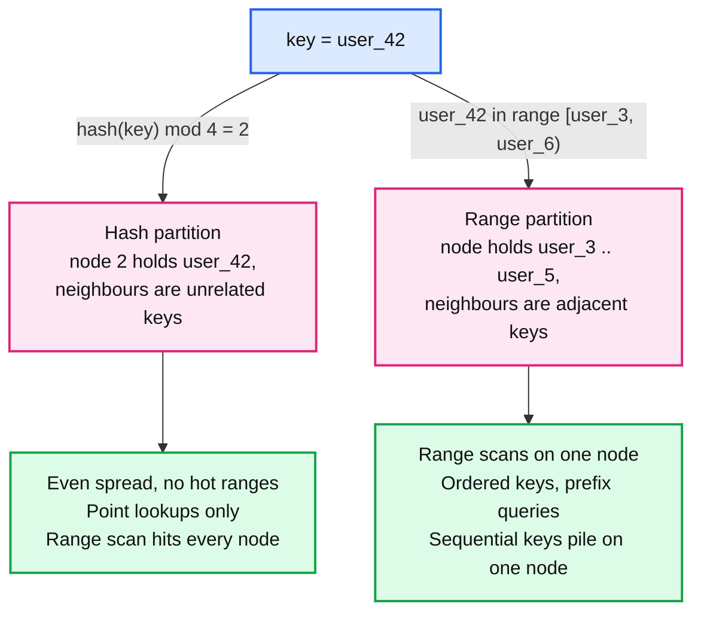
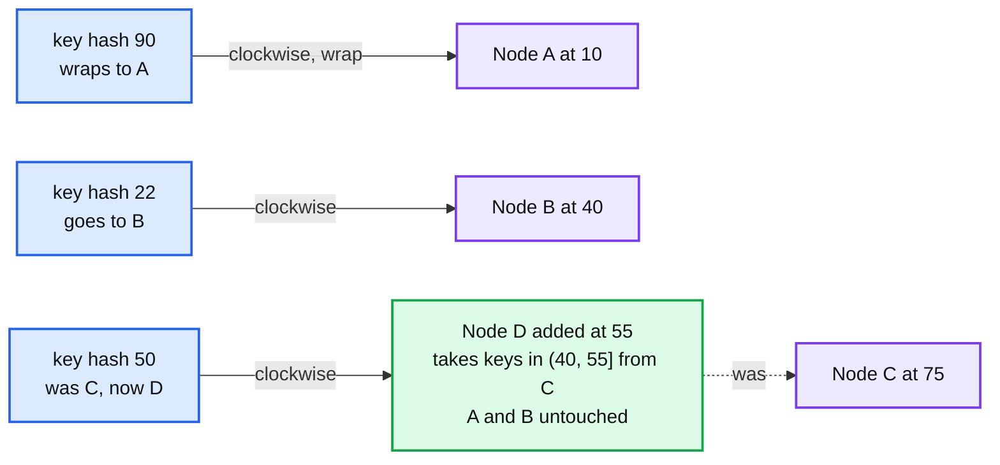
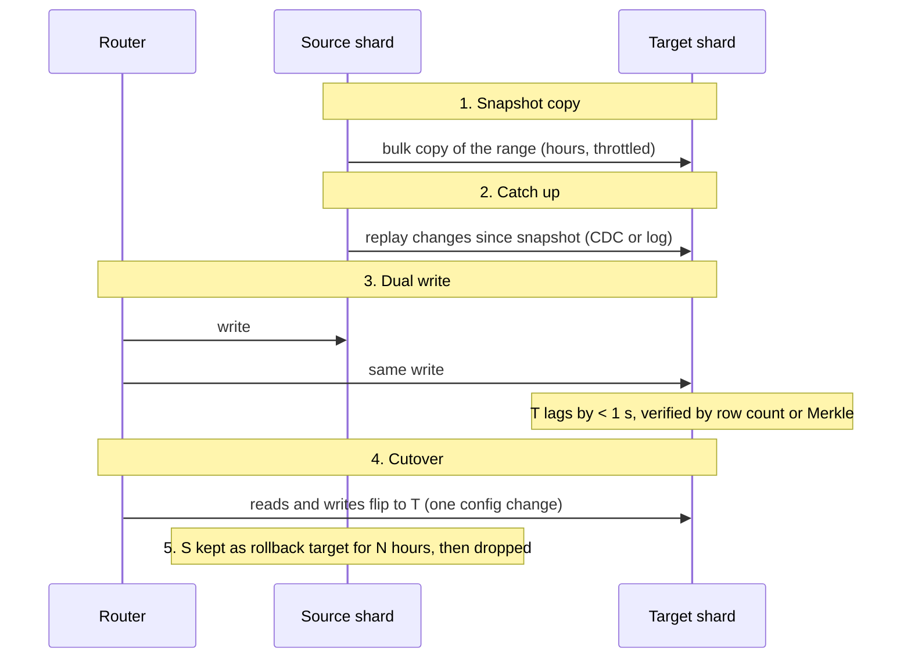
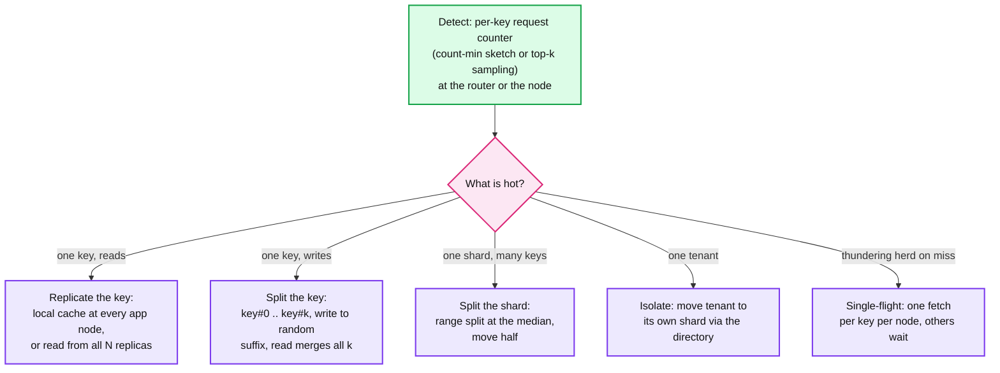

# Concept: Sharding, Consistent Hashing, and Hot Keys

> One-liner: sharding splits one dataset across many nodes by a key so each node holds a slice of the data and a slice of the load; the two decisions are **how a key maps to a node** (hash for even spread, range for ordered scans) and **how the map changes when nodes come and go** (consistent hashing with virtual nodes moves ~1/N of keys instead of all of them). The failure mode is the hot key: one key or one shard getting more traffic than any single node can take, and the map cannot fix that on its own.

Depth target: high-level, same as [replication-and-quorums.md](replication-and-quorums.md) and [bloom-filter.md](bloom-filter.md). It is under test in every cache, feed, rate limiter, and "10x traffic" question. Because consistent hashing is DSA, this note has runnable code.

---

## 1. Mental model

One node can hold ~1 TB and serve ~50k QPS. You have 100 TB and 5M QPS. You need 100 nodes, and every request has to find the right one in one step without asking a central directory on every call.



| Strategy | Key to node | Good | Bad | Examples |
|---|---|---|---|---|
| **Hash** | `hash(key)` onto a ring or mod N | Uniform spread, no planning | No range scans, no locality. Rehash on N change unless consistent. | Cassandra, DynamoDB, Redis Cluster, memcached |
| **Range** | Sorted key space cut into contiguous ranges | Scans, prefix queries, time-ordered data | Hot ranges (newest timestamps), needs split and rebalance | HBase, Bigtable, CockroachDB, Spanner, TiKV, MongoDB ranged |
| **Directory** | Lookup table `key -> shard` | Any placement policy, tenants moved individually | The table is a hot read path and a SPOF; cache it everywhere | Vitess, Slack's channel-to-shard map, most multi-tenant SaaS |
| **Hybrid** | Hash the partition key, range within it | Cassandra's model: even spread by partition, sorted clustering columns inside | Wide partitions become hot | Cassandra, DynamoDB (partition key + sort key), ScyllaDB |

**The shard key is the design.** Pick it from the access pattern: the key that every hot query has in hand. `user_id` for a profile store, `channel_id` for chat, `tenant_id` for SaaS. A query without the shard key is a scatter-gather across all N nodes, which is fine at N=4 and a fan-out disaster at N=400. See [fan-out-fan-in.md](fan-out-fan-in.md).

---

## 2. Consistent hashing

`hash(key) mod N` moves almost every key when N changes: going from 4 to 5 nodes remaps 80% of keys. For a cache that is a total miss storm; for a database it is a full re-shuffle. Consistent hashing (Karger et al., 1997) fixes this by hashing **both keys and nodes** onto the same ring.



- Hash each node to one or more points on a ring of size 2^32 or 2^64. Hash each key to a point. The key belongs to the first node clockwise.
- **Add a node:** it takes over the arc between its predecessor and itself. Only keys in that arc move, ~`1/N` of the total.
- **Remove a node:** its arc goes to the clockwise successor. Again ~`1/N` moves.
- **Replication:** the key's N replicas are the next N distinct physical nodes clockwise. This is Dynamo's preference list.

**Virtual nodes (vnodes).** With one point per node, arcs are uneven (one node might own 40% of the ring) and a removed node's whole load lands on one successor. Give each node `v` points instead: arcs average out (standard deviation drops as `1/sqrt(v)`), and a removed node's load spreads across many successors. Cassandra used 256 vnodes, then dropped to 16 because 256 made the "any 3 nodes down loses some range" probability too high and made repair and streaming slow. 100 to 200 is common for caches where that risk does not apply.

**Alternatives worth naming:**

| Scheme | Idea | Where |
|---|---|---|
| **Ring with vnodes** | Above | Cassandra, Dynamo, Riak, memcached clients (Ketama) |
| **Jump consistent hash** (Google, 2014) | No ring, no memory. `O(log N)` arithmetic maps key to bucket, minimal movement on N change. Only works for numbered buckets, no arbitrary removal. | Load balancers, fixed-size shard sets |
| **Rendezvous / HRW hashing** | For each node compute `hash(key, node)`, pick the max. No ring. Removing a node moves only its keys. | Small N, replica selection, cache peers |
| **Maglev** | Lookup table with minimal disruption, built for hardware speed | Google's load balancer |
| **Fixed slots** | Hash to 16,384 slots, assign slot ranges to nodes explicitly. Move slots, not keys. | Redis Cluster. Rebalance is an operator-visible slot migration. |

---

## 3. Code

Python, runnable, no dependencies. A ring with virtual nodes, replica lookup, and a measurement of how many keys move when a node is added. The measurement is the point: run it, quote the number.

```python
import bisect
import hashlib


def _h(s: str) -> int:
    return int.from_bytes(hashlib.md5(s.encode()).digest()[:8], "big")   # md5 for portability, use xxhash in prod


class Ring:
    def __init__(self, nodes: list[str], vnodes: int = 100):
        self.vnodes = vnodes
        self._points: list[int] = []
        self._owner: dict[int, str] = {}
        for n in nodes:
            self.add(n)

    def add(self, node: str) -> None:
        for i in range(self.vnodes):
            p = _h(f"{node}#{i}")
            self._owner[p] = node
            bisect.insort(self._points, p)

    def remove(self, node: str) -> None:
        for i in range(self.vnodes):
            p = _h(f"{node}#{i}")
            del self._owner[p]
            self._points.pop(bisect.bisect_left(self._points, p))

    def lookup(self, key: str, replicas: int = 1) -> list[str]:
        # First `replicas` DISTINCT physical nodes clockwise from the key's point.
        if not self._points:
            return []
        i = bisect.bisect_right(self._points, _h(key))
        out: list[str] = []
        while len(out) < replicas and len(out) < len(set(self._owner.values())):
            node = self._owner[self._points[i % len(self._points)]]
            if node not in out:
                out.append(node)
            i += 1
        return out


if __name__ == "__main__":
    keys = [f"user_{i}" for i in range(100_000)]
    ring = Ring([f"n{i}" for i in range(10)], vnodes=100)

    before = {k: ring.lookup(k)[0] for k in keys}
    load = {}
    for n in before.values():
        load[n] = load.get(n, 0) + 1
    print(f"10 nodes, 100 vnodes: min {min(load.values())}, max {max(load.values())} keys per node (ideal 10000)")

    ring.add("n10")
    after = {k: ring.lookup(k)[0] for k in keys}
    moved = sum(1 for k in keys if before[k] != after[k])
    print(f"add 11th node: {moved / len(keys):.1%} of keys moved (ideal 1/11 = 9.1%)")

    naive_moved = sum(1 for k in keys if _h(k) % 10 != _h(k) % 11)
    print(f"hash mod N, 10 -> 11: {naive_moved / len(keys):.1%} of keys moved")

    print(f"replicas for user_42: {ring.lookup('user_42', replicas=3)}")
```

Expected output: keys per node within roughly ±20% of ideal with 100 vnodes, about **8 to 9% moved** when adding the 11th node, versus about **91% moved** with `hash mod N`. Try `vnodes=1` to see the spread go to 3x. The line to remember: `bisect_right` on the sorted points, then walk clockwise collecting distinct owners.

---

## 4. Rebalancing without downtime

Moving a shard is a migration, and migration is where Staff answers are won.



- **Snapshot then catch up** is the same shape as adding a database replica. The catch-up must be from a log (CDC, WAL, Kafka), not a second scan.
- **Dual write** is what makes cutover safe: at the moment you flip, both sides have every write. If T is broken, flip back. Cost: dual writes must be idempotent ([exactly-once.md](exactly-once.md)) and the target must tolerate the same write twice (once from catch-up, once from dual write).
- **Verify before cutover.** Row counts are weak. A [merkle-tree.md](merkle-tree.md) comparison of the range, or a sampled checksum, is what you say.
- **Throttle.** A bulk copy at full disk speed starves the source's foreground reads. 50 to 100 MB/s per shard move is a typical cap.
- **Directory-based routing makes this a one-row update.** Hash-ring routing makes it a ring topology change that every client must see at once, which is why ring-based systems (Cassandra) stream ranges while the ring is in a "joining" state and route to both.

**Range splitting** (HBase, CockroachDB, TiKV, Spanner): a range grows past a size (64 MB in TiKV, 512 MB in CockroachDB) or a load threshold and splits at its median key into two ranges, one of which moves. Auto-split handles the "newest timestamps are hot" problem by splitting the hot tail repeatedly. **Pre-splitting** a new table into N ranges avoids the first hour where every write hits one range.

---

## 5. Hot keys and hot shards

Sharding spreads keys evenly. Traffic is not even. One celebrity, one viral post, one tenant running a bulk job, one `country=US` partition, and a single node takes 100x the traffic of the others. The ring cannot fix this because it moves *keys*, and the problem is *one key*.



| Hot pattern | Mitigation | Cost |
|---|---|---|
| **Read-hot key** (celebrity profile, popular product) | Cache it in every application server (local LRU, 1 to 5 s TTL). Or read from any replica, not just the primary. | Staleness bounded by the TTL. Local caches multiply memory by the number of app nodes. |
| **Write-hot key** (like counter on a viral post, a global rate limit) | **Key splitting**: append a random suffix `0..k`, write to one of k sub-keys, read sums all k. | Reads cost k lookups. `k` must be chosen up front or discovered by the detector. |
| **Hot shard from sequential keys** (timestamp, auto-increment ID) | Salt the key: prefix with `hash(key) mod 16`, or reverse the timestamp bits. Or range-split aggressively. | Range scans now need 16 sub-scans. |
| **Hot tenant** | Directory routing: move that tenant to a dedicated shard. Slack moved big workspaces this way. | Needs the directory in the first place. |
| **Cache stampede / thundering herd** (hot key expires, 10k requests miss at once) | Single-flight (one in-flight fetch per key, others wait on it), request coalescing at the cache, jittered TTLs, probabilistic early refresh. | One request pays the latency, the rest queue for ~1 RTT. See [caching-patterns.md](caching-patterns.md). |
| **Celebrity fan-out** (one user with 50M followers posts) | Hybrid fan-out: push to followers for normal users, pull at read time for celebrities above a follower threshold. | Two code paths. The threshold is a tuning knob. See [fan-out-fan-in.md](fan-out-fan-in.md). |

**Detection is the part people forget.** A per-key counter over every key is too expensive; a count-min sketch plus a top-k heap at the router (100 KB of memory) finds the top 100 keys per second with a bounded error. Once detected, the router can apply the split or the local-cache rule to that key only. DynamoDB does this automatically (adaptive capacity), Redis has `--hotkeys`, Cassandra exposes `nodetool toppartitions`.

---

## 6. Where you meet it

| System | Scheme | Detail |
|---|---|---|
| **Cassandra, ScyllaDB** | Hash ring, vnodes (16 default in 4.0+), replicas are next N distinct racks clockwise | Partition key hashed by Murmur3. Wide partitions over 100 MB are the hot-shard failure. |
| **DynamoDB** | Hash on partition key, ~10 GB and 3k RCU / 1k WCU per partition, auto-split | Adaptive capacity moves throughput to hot partitions, but one hot *key* is still capped at one partition's limit. |
| **Redis Cluster** | 16,384 fixed hash slots, `CRC16(key) mod 16384`, slots assigned to nodes | `{hashtag}` in the key forces co-location for multi-key ops. Slot migration is explicit. |
| **memcached clients** | Ketama consistent hashing, 100 to 160 points per server | Server list is client config. Facebook's mcrouter adds pools and replicated hot keys. |
| **Kafka** | `hash(key) mod partitions`, partition count fixed per topic | Adding partitions remaps keys, so key ordering breaks across the change. Over-provision partitions up front. |
| **HBase, Bigtable** | Range on row key, auto-split regions | Row key design is the entire performance model. Salting for time-series. |
| **CockroachDB, TiKV, Spanner** | Range, 64 to 512 MB ranges, auto-split on size and load, Raft per range | Load-based splitting finds hot ranges. Follower reads for hot read ranges. |
| **MongoDB** | Hashed or ranged shard key, chunks of 128 MB moved by the balancer | Choosing a monotonic shard key is the classic mistake. |
| **Vitess** | Keyspace ID via a chosen vindex, directory of shard ranges | Resharding is a first-class online operation with VReplication. |
| **Slack** | Workspace ID to shard via a directory, Vitess underneath | Big workspaces isolated on their own shard. |
| **Elasticsearch** | `hash(_id) mod shards`, fixed at index creation | Cannot change shard count, so reindex. Routing key optional for tenant locality. |

---

## 7. Practical additions every real implementation has

| Addition | Problem it fixes |
|---|---|
| **Vnodes** | Uneven arcs, one successor takes a dead node's whole load. |
| **Rack / AZ aware replica walk** | Three replicas on one rack. Skip nodes in an already-used rack. |
| **Fixed slots (Redis) or explicit ranges** | Ring changes are invisible and hard to control. Slots make rebalancing an operator action. |
| **Pre-splitting** | First hour of a new table is one hot range. |
| **Load-based auto-split** | Size-based split misses a small hot range. |
| **Hot key detector** (count-min + top-k) | Hot keys found after the incident. |
| **Local cache with short TTL** | Read-hot keys hammer one node. |
| **Key suffixing for counters** | Write-hot keys serialise on one node. |
| **Single-flight and coalescing** | Miss storms on expiry. |
| **Throttled, resumable range move** | Rebalance starves foreground traffic or restarts from zero after a blip. |
| **Directory cached in every client, invalidated by version** | Directory is a hot read path. |
| **Scatter-gather query budget** | Query without shard key fans out to all N. Reject or cap at a max shard count. |

---

## 8. Failure modes and what happens

| Failure | What happens | Fix |
|---|---|---|
| `hash mod N` and N changes | ~`(N-1)/N` of keys move. Cache: miss storm and a database overload. DB: full reshuffle. | Consistent hashing or fixed slots. |
| Monotonic shard key (timestamp, auto ID) | All writes to one range. One node at 100%, others idle. | Salt or hash prefix, or accept scatter on scans. |
| One vnode per node | Uneven load (up to 3x), a dead node's arc lands on one successor. | 100+ vnodes for caches, 16 to 64 for databases with repair. |
| Too many vnodes | Any 3 nodes down loses some range at RF=3. Repair and streaming slow. | Cassandra went 256 to 16 for this. |
| Wide partition | One partition over 100 MB. Compaction, repair, and reads on that key stall the node. | Bucket the partition key (`user_id, month`). |
| Shard key not in the hot query | Every query is scatter-gather across all N. | Pick the key from the query, or maintain a secondary index sharded by the other key. |
| Rebalance at full speed | Source shard's p99 goes from 5 ms to 500 ms. | Throttle to 50 to 100 MB/s. |
| Cutover before catch-up finished | Reads on the target miss recent writes. | Verify lag < 1 s and a Merkle or checksum match before flipping. |
| Hot key with no detector | One node pegged, alarms say "node 7 is slow", nobody knows why. | Per-key top-k at the router. |
| Kafka partition count increased | Key ordering breaks across the boundary; consumers see old and new partitions interleaved. | Over-provision partitions (10x expected) at topic creation. |
| Directory down | No request can route. | Cache the directory in every client with a version, serve stale on directory outage. |

---

## 9. Trade-offs

| Gain | Cost |
|---|---|
| Hash partitioning: even spread, no planning. | No range scans, no key locality. |
| Range partitioning: scans and ordered access on one node. | Hot ranges on sequential keys, needs split and move machinery. |
| Directory: any placement, per-tenant moves. | One more system on the read path. |
| Consistent hashing: `1/N` movement on membership change. | Uneven without vnodes. Client must know the ring. |
| Vnodes: even load, spread recovery. | Failure correlation and repair cost grow with vnode count. |
| Key splitting for hot writes: linear write scale on one key. | Reads cost `k`. Must know `k` up front. |
| Local caching for hot reads: unlimited read scale on one key. | Staleness of one TTL. Memory times app nodes. |
| Auto-split: adapts to load without operators. | Split storms under sudden load. Range count grows unbounded without merge. |

**What a Staff answer refuses to build:** `hash mod N` for anything with dynamic membership, a timestamp as a shard key, a shard key that the main query does not have, a rebalance without dual-write and a rollback window, and a "distributed cache" with no hot-key story.

---

## 10. Numbers worth memorizing

- `hash mod N`, N to N+1: **~`N/(N+1)` of keys move** (91% at 10 to 11). Consistent hashing: **~`1/(N+1)`** (9%).
- Vnodes: spread standard deviation ~`1/sqrt(v)`. 1 vnode: up to 3x imbalance. 100: ±10%. Cassandra default 16 (was 256).
- Redis Cluster: **16,384 slots**. Kafka: partitions fixed at creation, over-provision 10x.
- Range sizes: TiKV 64 MB (96 MB split), CockroachDB 512 MB, HBase 10 GB, DynamoDB ~10 GB and 3k RCU / 1k WCU per partition, MongoDB chunk 128 MB.
- Wide partition limit: **100 MB** in Cassandra before things hurt, 2 GB hard-ish limit.
- Rebalance throttle: 50 to 100 MB/s per move. 1 TB shard: 3 to 6 hours.
- Hot key detector: count-min sketch with 4 rows x 2^16 counters is 1 MB, top-100 heap. Finds any key over ~0.1% of traffic.
- Local hot-key cache TTL: 1 to 5 s. Cuts backend load on a hot key by the app node count times requests per TTL.
- Celebrity threshold for hybrid fan-out: ~10k to 100k followers, depending on write budget.

---

## 11. Interview soundbite

> "I shard on the key the hot query already has, hash it onto a consistent hash ring with about 100 virtual nodes per server so adding a server moves one over N of the keys instead of nearly all of them, and the replicas are the next N distinct racks clockwise. If the workload needs range scans I use range partitioning with auto-split and I salt any sequential key so the newest range is not always the hot one. Sharding spreads keys, not traffic, so I put a count-min top-k detector at the router; a read-hot key gets a one-second local cache on every app node, a write-hot key gets split into k suffixed sub-keys, and a hot tenant gets moved to its own shard through the directory. Rebalancing is snapshot, log catch-up, dual write, verify with a checksum, flip one config value, and keep the source for a day as the rollback."

Follow-ups an interviewer will ask, in order of likelihood:

1. What is the shard key and why? (Section 1, from the hot query.)
2. What happens when you add a node? (Section 2 and 3, `1/N` moves, run the code.)
3. One user has 50 million followers. (Section 5, hybrid fan-out, local cache.)
4. How do you move a shard with zero downtime? (Section 4, snapshot, catch-up, dual write, verify, flip.)
5. A query does not include the shard key. (Section 1, scatter-gather, or a secondary index sharded the other way.)
6. Why not `hash mod N`? (Section 8, 91% movement.)
7. How many vnodes and why did Cassandra reduce it? (Section 2, failure correlation.)
8. How do you *find* the hot key? (Section 5, count-min plus top-k.)
9. Timestamp as a shard key. (Section 8, salt it.)

Related: [replication-and-quorums.md](replication-and-quorums.md) (what the N replicas do once placed), [gossip-protocol.md](gossip-protocol.md) (how nodes learn the ring), [merkle-tree.md](merkle-tree.md) (verifying a range move), [caching-patterns.md](caching-patterns.md) (stampede and single-flight in depth), [fan-out-fan-in.md](fan-out-fan-in.md) (scatter-gather cost, celebrity fan-out), [rate-limiting-and-load-shedding.md](rate-limiting-and-load-shedding.md) (the hot-key counter problem), [stream-sketches.md](stream-sketches.md) (count-min sketch internals), `popular_systems_deepdive/cassandra/cassandra-06-membership-gossip.md` (vnodes and the 256 to 16 change), `hld/slack-messaging/` (directory sharding by workspace).
