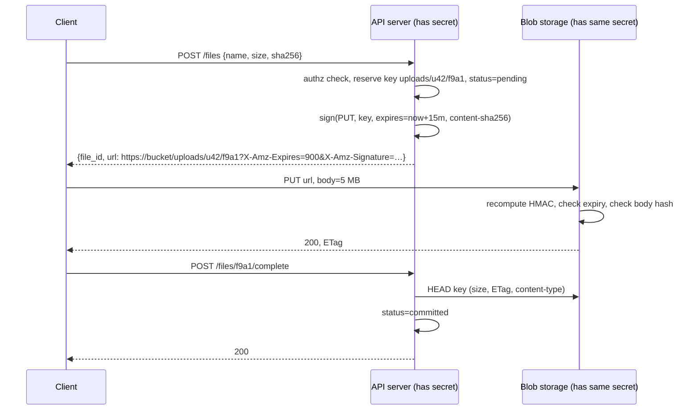
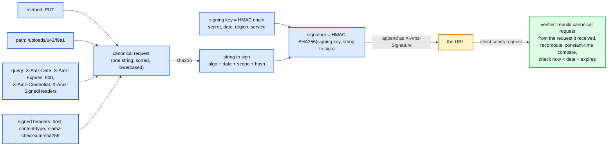
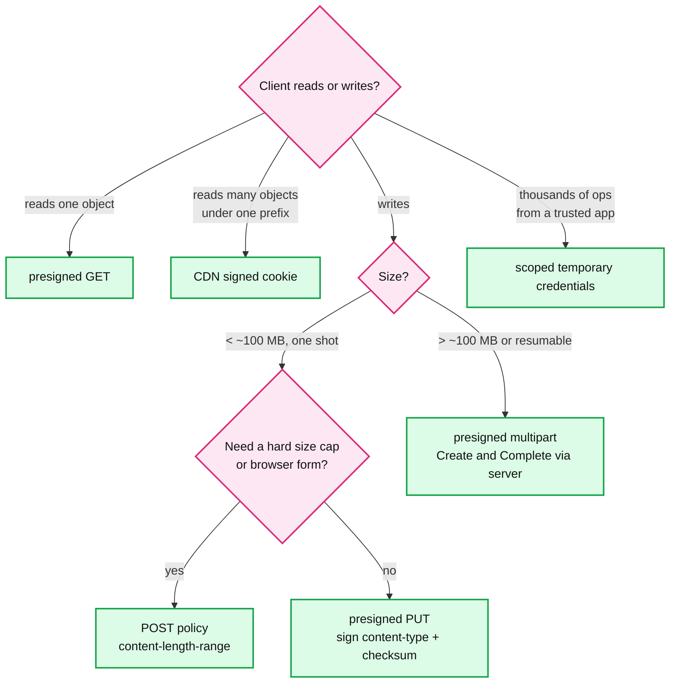
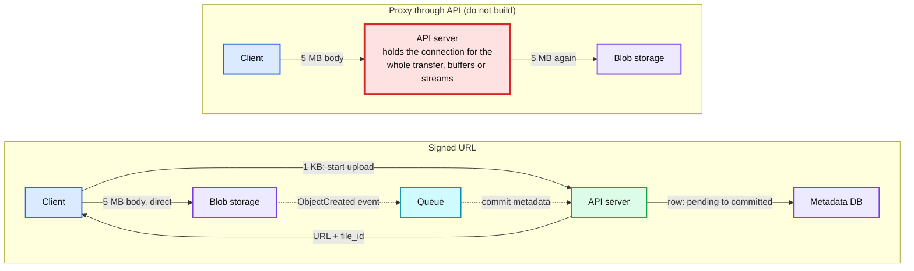
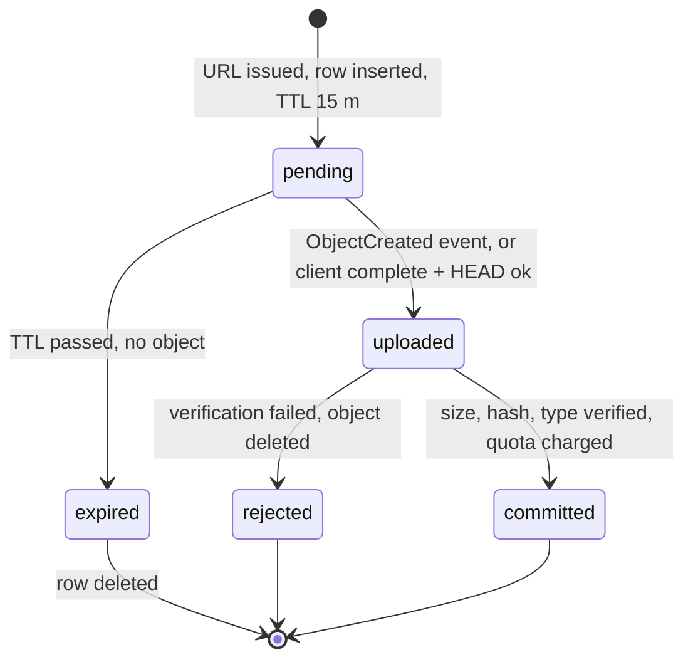
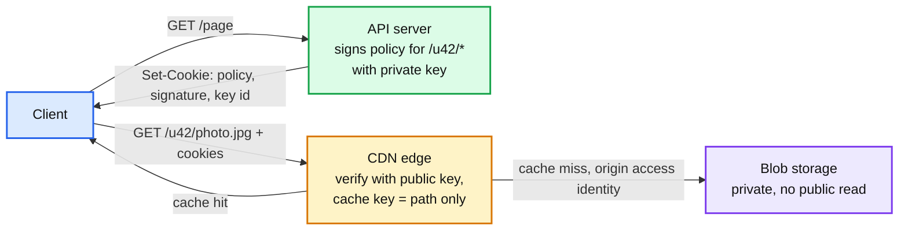

# Concept: Signed URLs

> One-liner: a signed URL is a capability token shaped like a link. The application server, which holds a secret, writes the exact permission (method, object, expiry, optional headers) into the URL and appends an HMAC over it. The client hands that URL straight to blob storage or a CDN, which recomputes the HMAC and serves the bytes. The app server never touches the bytes, and storage never calls the app server to ask "is this allowed".

Depth target: high-level, same as [caching-patterns.md](caching-patterns.md) and [leases-fencing-clocks.md](leases-fencing-clocks.md). It is the "how does a 5 MB photo get from the phone into S3 without going through your API" question in Drive, Slack, Instagram, object store, and ingestion problems.

---

## 1. Mental model

Two problems at once. Bytes: a 5 MB upload should not stream through a stateless API server that exists to do 1 KB metadata calls. Auth: blob storage has no idea who your users are, so it cannot check "does user 42 own file X". A signed URL solves both: the API server does the auth check once, then delegates the *bytes* to storage by minting a proof that storage can verify on its own.



- **Capability, not identity.** Storage does not know who the caller is. Whoever holds the URL has the permission written in it. That is why the URL must be narrow (one method, one key) and short-lived.
- **Stateless verification.** Storage recomputes `HMAC(secret, canonical request)` and compares. No database lookup, no token store, no call back to the app. This is what lets it work at CDN edge scale.
- **The app server stays on the control path only.** Two small calls (start, complete) instead of streaming the body. The bytes take the direct path.

**Why this matters more at Staff level.** Senior answers say "upload to S3 with a presigned URL". Staff answers say what is inside the signature, why the key name is chosen by the server, how the size is bounded, how the metadata row is committed after the bytes land, what happens to orphans, and why the URL cannot be revoked.

---

## 2. How the signature is built and checked

The signer and the verifier agree on a **canonical request**: a fixed serialisation of everything the permission covers. Anything not in the canonical request is not protected and can be changed by the holder.



What the verifier gets for free from this shape:

| Property | How |
|---|---|
| Cannot change the object key | Path is in the canonical request. |
| Cannot turn a GET into a DELETE | Method is in the canonical request. |
| Cannot extend the expiry | `X-Amz-Date` and `X-Amz-Expires` are signed. |
| Cannot upload the wrong content type | Only if `content-type` is in the signed headers. Default SDK output signs only `host`, so this is opt-in. |
| Cannot upload different bytes | Only if a body hash (`Content-MD5`, `x-amz-checksum-sha256`) is signed. Storage then verifies the body against the header. Presigned URLs otherwise sign `UNSIGNED-PAYLOAD`. |
| Cannot be forged | HMAC needs the secret. Verifier holds it, client never does. |
| Cannot replay after expiry | Verifier's clock, not the client's. |

The signing key is derived per day, region, and service (`HMAC(HMAC(HMAC(HMAC("AWS4" + secret, date), region), service), "aws4_request")`), so an app server can be handed a derived key that cannot sign for other regions or dates. That is key scoping, the same idea as fencing a lease to one resource.

**HMAC or public key?** HMAC (symmetric) when signer and verifier are the same trust domain: S3 holds the account secret and issued it to you. RSA or ECDSA (asymmetric) when the verifier is a fleet you do not want holding a secret: CloudFront and every third-party CDN verify with a public key, so a compromised edge node cannot mint URLs. Same reason JWTs for many verifiers use RS256 and JWTs for one verifier can use HS256.

The mechanism in 30 lines (runnable, Python 3):

```python
import hmac, hashlib, time
from urllib.parse import urlencode, parse_qs, urlsplit

SECRET = b"rotate-me"

def canonical(method: str, path: str, expires: int, headers: dict) -> bytes:
    signed = "\n".join(f"{k.lower()}:{v.strip()}" for k, v in sorted(headers.items()))
    return f"{method.upper()}\n{path}\n{expires}\n{signed}".encode()

def sign(method: str, path: str, ttl_s: int, headers: dict | None = None) -> str:
    headers = headers or {}
    expires = int(time.time()) + ttl_s
    sig = hmac.new(SECRET, canonical(method, path, expires, headers), hashlib.sha256).hexdigest()
    q = {"expires": expires, "signed_headers": ";".join(sorted(h.lower() for h in headers)), "sig": sig}
    return f"https://blob.example.com{path}?{urlencode(q)}"

def verify(method: str, url: str, headers: dict) -> bool:
    u = urlsplit(url); q = {k: v[0] for k, v in parse_qs(u.query).items()}
    expires = int(q["expires"])
    if time.time() > expires:
        return False                                          # verifier's clock
    names = [n for n in q["signed_headers"].split(";") if n]
    subset = {n: headers.get(n, "") for n in names}           # only signed headers count
    want = hmac.new(SECRET, canonical(method, u.path, expires, subset), hashlib.sha256).hexdigest()
    return hmac.compare_digest(want, q["sig"])                # constant-time compare

if __name__ == "__main__":
    url = sign("PUT", "/uploads/u42/f9a1", 900, {"Content-Type": "image/jpeg"})
    assert verify("PUT", url, {"content-type": "image/jpeg"})
    assert not verify("DELETE", url, {"content-type": "image/jpeg"})       # method is signed
    assert not verify("PUT", url.replace("f9a1", "f9a2"), {"content-type": "image/jpeg"})  # path is signed
    assert not verify("PUT", url, {"content-type": "text/html"})           # signed header changed
    print("ok")
```

---

## 3. Variants: pick by what the client needs to do

| Variant | Signs | Use when | Limit |
|---|---|---|---|
| **Presigned GET** | one key, expiry, optional `response-content-disposition` | Private download, one object | Bearer: anyone with the URL reads it until expiry. |
| **Presigned PUT** | one key, expiry, optional content-type and body hash | Single-request upload, client already knows the bytes | Cannot bound size unless `Content-Length` is a signed header. Object name fixed by the server. |
| **POST policy** (browser form) | a JSON policy: bucket, key prefix, `content-length-range`, content-type prefix, expiry | Browser `<form>` upload, need a size cap or `starts-with` key | Only S3, GCS, and compatible stores. |
| **Presigned multipart** | one URL per part (`uploadId`, `partNumber`) | Files over ~100 MB, resumable, parallel parts | Create and Complete go through the server, which is where you validate part ETags and total size. |
| **CDN signed URL** | path (wildcards allowed), expiry, optional start time and IP range, signed with a private key | One video, one download, served from edge | Per-asset URL; a page with 200 thumbnails needs 200 signatures. |
| **CDN signed cookie** | same policy, delivered as cookies | Many assets under one prefix (a course, an album, an HLS stream with 1,000 segments) | Cookies do not work cross-origin or for `` on another domain without CORS credentials. |
| **Temporary credentials** (STS `AssumeRole` with a session policy, GCS downscoped tokens, Azure user delegation SAS) | a credential scoped to a prefix, 15 min to 12 h | A desktop sync client doing thousands of operations | Client now signs requests itself, needs an SDK. Broader than one URL. |



Same idea, different names: S3 presigned URL (SigV4, HMAC-SHA256), GCS V4 signed URL (RSA-SHA256 with a service account key, or IAM `signBlob` so no key file on disk), Azure SAS token (HMAC-SHA256 with the account key, or a user delegation SAS signed with an Entra ID key), CloudFront signed URL (RSA-SHA1 over a JSON policy, verified at the edge with a public key from a key group), Cloudflare and Akamai token auth (HMAC over path and expiry in a query parameter or cookie).

---

## 4. The upload pattern in an HLD

This is the shape to draw in Drive, Slack attachments, Instagram, and the object store problem. The bytes never touch a green box.



**Why the proxy box is red.** Take 10 M uploads a day at 5 MB: 50 TB/day, ~580 MB/s average, ~1.7 GB/s at 3x peak. That is 14 Gbps of body traffic through servers that otherwise do 1 KB JSON calls, and it is the *slow* clients that hurt most: a phone on 1 Mbps holds a connection for 40 s per file. 116 uploads/s x 40 s = ~4,600 long-lived connections pinned to thread pools or memory buffers, every deploy drops in-flight uploads, and the API's p99 is now the upload tail. With the signed URL the API handles two small calls per file and the storage tier, which is built for this, takes the bytes.

**The three rules of the upload flow:**

1. **The server names the object.** Never let the client choose the key. Client-chosen keys mean overwrite of someone else's object, path tricks (`../`), and enumeration. Key = `{tenant}/{uuid}`, content-addressed (`sha256`) if you want dedup.
2. **Metadata is committed only after the bytes are verified.** Insert the row as `pending` when the URL is issued. Flip to `committed` on the client's `complete` call (after a `HEAD` for size, ETag, content-type) or on the storage event notification, whichever your design trusts. Never on the client's word alone.
3. **Orphans are expected, so garbage collect them.** Client got a URL and closed the app. Or uploaded and never called `complete`. A sweeper deletes `pending` rows older than the URL TTL plus a margin, and any object in the upload prefix with no committed row. Or set a bucket lifecycle rule on the upload prefix.



**Multipart for large files.** Client calls `start`, server does `CreateMultipartUpload` and returns `upload_id` plus a presigned URL per part (5 MB minimum per part, up to 10,000 parts, 5 TB per object on S3). Client uploads parts in parallel, retries any part alone, then sends the ETag list to the server, which calls `CompleteMultipartUpload`. Resumable for free: on reconnect the client asks the server which parts landed (`ListParts`) and sends the rest. Abandoned multipart uploads are invisible in normal listings and are billed, so a lifecycle rule `AbortIncompleteMultipartUpload` after 1 to 7 days is mandatory.

---

## 5. The download pattern: CDN plus signed cookies

Downloads are 10 to 100x uploads. 100 M downloads a day at 5 MB is 500 TB/day, ~46 Gbps average, 150 Gbps peak. Nothing but a CDN serves that, and the CDN must still enforce "only the owner can read this".



- **Cache key excludes the signature.** If the CDN keys its cache on the full URL, every user's freshly signed URL is a miss and the CDN caches nothing. CloudFront strips its own signature parameters; on a custom CDN you configure the cache key as path only, after the edge validates the query.
- **Bucket is private, edge has an identity.** The origin allows only the CDN's identity (origin access control). A leaked direct bucket URL then 403s.
- **Signed cookie for pages, signed URL for single assets.** A feed page with 50 images, an HLS video with 1,000 segments: one cookie over the prefix. A one-off download link in an email: signed URL.
- **Do not sign forever.** A 1-hour cookie means a revoked user sees content for at most 1 hour. There is no revoke.

---

## 6. Security rules

- **It is a bearer token.** Treat it like a session cookie. HTTPS only. It ends up in browser history, `Referer` headers (set `Referrer-Policy: no-referrer` on pages that embed them), CDN and proxy logs, and screenshots.
- **Short TTL.** Upload: 5 to 15 minutes, long enough for a slow client to *start* the request (S3 checks expiry at request start, not end). Download: 1 to 15 minutes for one-off links, 1 hour for cookies. S3 caps SigV4 at 7 days; the console caps at 12 hours.
- **The URL dies with the credential that signed it.** Signed with temporary credentials (an instance role, STS) the URL is valid only until *those credentials* expire, whatever `X-Amz-Expires` says. Instance profile credentials rotate about every 6 hours. The classic production bug: 7-day download links that stop working at random after a few hours. Sign long-lived links with a long-lived, narrowly scoped IAM user, or regenerate on demand.
- **Least privilege in the signature.** One method, one key, the content-type and checksum signed, size bounded (POST policy `content-length-range`, or `HEAD` and delete after). No wildcards on upload. The signer's own IAM policy should allow only `PutObject` on the upload prefix, because a signed URL can never grant more than the signer has.
- **The signer is an IAM principal, so audit it.** Every signed request shows up in storage access logs under the signer's identity, not the end user's. Put the `file_id` or user id in the key path so logs are attributable.
- **Revocation does not exist.** You can rotate the signing key (kills every outstanding URL), delete or move the object (URL 404s), or use a store that supports a revocable reference (Azure stored access policy, CloudFront key group rotation). Design for short TTL and re-issue instead.
- **Clock skew.** Verifier rejects requests whose `X-Amz-Date` is more than 15 minutes from its clock. A client with a broken clock cannot fix that by any URL you give it; the *server* sets the date, so only the server's NTP matters. Related: [leases-fencing-clocks.md](leases-fencing-clocks.md).

---

## 7. Where you meet it

| System | Use | Detail |
|---|---|---|
| Google Drive, Dropbox (`hld/` #13) | Upload and download of file blocks | Server reserves block ids, client PUTs blocks direct, server commits the file version when all blocks are present. Content-addressed keys give dedup. |
| Slack (`hld/slack-messaging/`) | Attachments | `files.getUploadURLExternal` returns a URL, client uploads, `files.completeUploadExternal` attaches to a message. Exactly the start / bytes / complete shape. |
| Instagram, YouTube, TikTok (`hld/` #36) | Media upload | Multipart signed URLs, then an `ObjectCreated` event kicks off transcoding. Feed reads go through a CDN with signed URLs or cookies. |
| Immutable object store (`hld/immutable-object-store/`) | The API surface itself | Presigned URL generation is a feature the store must offer; the note on canonical request is what its auth layer implements. |
| Street View ingestion (`hld/` #27) | Bulk ingest from vehicles | Scoped temporary credentials per vehicle per day rather than per-object URLs, because each vehicle writes millions of objects. |
| Data export, invoices, reports | Deliver a generated file | Job writes to blob, emits a 15-minute signed GET in the email or API response. Regenerate on click if expired. |
| Webhooks and callbacks | Verify the sender | Same HMAC-over-canonical-payload idea, in a header instead of a URL. Stripe, GitHub, Slack signing secrets. |
| JWT | Same primitive, different container | A signed URL is a JWT whose claims are the request. HS256 when one verifier, RS256 when many. |

---

## 8. Failure modes and what happens

| Failure | What happens | Mitigation |
|---|---|---|
| Client chooses the object key | Overwrites another user's file, or enumerates the bucket. | Server generates the key. `starts-with` condition on POST policy. |
| Presigned PUT with no size bound | User uploads 50 GB against a 10 MB quota. Storage bill, and a `HEAD` after the fact is too late for cost. | POST policy `content-length-range`, or multipart with server-side part accounting, or `HEAD` and delete plus per-user rate limit on URL issuance. |
| Metadata committed on the client's `complete` call without checking storage | Client calls `complete` without uploading. Dangling file rows, broken thumbnails. | `HEAD` the object first, or commit from the storage event, not the client. |
| Metadata committed only on the storage event, event delivery is at-least-once and can be delayed | Duplicate commits, or file shows up minutes late. | Idempotent commit keyed on `file_id`. Client `complete` as the fast path, event as the safety net. See [exactly-once.md](exactly-once.md). |
| Orphan objects | Uploaded, never committed. Quietly costs money forever. | Sweeper on `pending` rows plus bucket lifecycle on the upload prefix. `AbortIncompleteMultipartUpload` rule. |
| URL leaked via `Referer` or logs | Third party reads the object until expiry. | Short TTL, `Referrer-Policy`, do not put signed URLs in `<a>` tags on public pages. |
| Long-TTL URL signed with temporary credentials | Link dies when the role credentials rotate, hours in. Intermittent 403s. | Sign with long-lived scoped credentials, or issue short URLs and regenerate. |
| Signing secret leaked | Attacker mints any URL the signer could. | Rotate. All outstanding URLs die, which is the price of stateless verification. Scope the signer's IAM policy narrowly so the blast radius is one prefix. |
| Verifier clock drifts | Every URL looks expired, or expired URLs still work. | NTP on storage nodes, 15-minute skew window. Not a client problem. |
| CDN cache keyed on full URL including signature | 0% hit rate, origin melts. | Cache key = path. Validate signature before cache lookup. |
| Signed URL for an object that is later made private or deleted | Deleted: 404, fine. ACL change: URL still works until expiry, because the signature grants the signer's permission, not the object's ACL. | Short TTL. |
| Content-type not signed | Client uploads `text/html` to a key served from your domain. Stored XSS. | Sign `content-type`. Serve user content from a separate origin. Set `Content-Disposition: attachment` on download URLs. |

---

## 9. Trade-offs

| Option | Gain | Cost |
|---|---|---|
| **Signed URL, direct to storage** | API servers off the byte path, storage-tier bandwidth, stateless verification, resumable multipart for free. | Bearer token that cannot be revoked, two-phase commit of metadata, orphans to clean up, size hard to bound on PUT. |
| **Proxy through the API** | One place to validate, scan, transform, and count bytes. Simple metadata commit. No orphans. | API bandwidth and connection lifetime become the bottleneck. Every deploy drops in-flight uploads. Double transit. |
| **Scoped temporary credentials** (STS) | One credential for thousands of ops, resumable clients, SDK retry logic. | Client must sign requests, broader grant than one object, credential lifetime 15 min to 12 h, harder to audit per object. |
| **CDN signed cookie** | One signature for a whole prefix, cacheable at edge. | Same-site only, no cross-origin `` without credentials mode, TTL applies to the whole prefix. |
| **HMAC signature** | Fast, one secret, no key management. | Every verifier holds the secret. |
| **Public key signature** | Verifiers hold only the public key, edge fleet cannot mint. | Key pairs to rotate, slower to verify, larger signatures. |
| **Short TTL** | Leak damage bounded, revoke approximated. | Slow clients fail to start in time, links in emails expire before they are clicked, re-issue path required. |
| **Long TTL** | Links just work. | Leak lasts days, no revoke. |

**What a Staff answer refuses to build:** an upload path that streams bytes through the API tier; client-chosen object keys; metadata committed on the client's word; a 7-day URL signed with an instance role; a signed URL for every thumbnail on a feed page when a cookie over the prefix would do; and a "revoke this URL" endpoint, because there is nothing to revoke.

---

## 10. Numbers worth memorizing

- S3 presigned URL max expiry: **7 days** (SigV4 with IAM user credentials), **12 hours** from the console, and no longer than the signing credential lives (instance role credentials rotate ~**6 h**, STS sessions 15 min to 12 h).
- Request time skew tolerance: **15 minutes** on S3, GCS, and Azure.
- Sensible TTLs: upload URL **5 to 15 min**, one-off download **1 to 15 min**, CDN cookie **1 h**, email link **24 h** with a regenerate-on-click fallback.
- Multipart: part size **5 MB minimum** (last part exempt), **10,000 parts max**, **5 TB** max object, **5 GB** max single PUT. Use multipart above ~**100 MB**.
- Bandwidth: 10 M uploads/day x 5 MB = **50 TB/day**, ~**580 MB/s** average, ~**1.7 GB/s** peak. Downloads are 10 to 100x that, so they go through a CDN, not storage, and never through the API.
- Slow client: 5 MB at 1 Mbps = **40 s** per upload. At 116 uploads/s that is **~4,600 concurrent connections** if proxied.
- Signature: HMAC-SHA256, **64 hex characters**. Signing a URL is microseconds of CPU; the API can mint tens of thousands per second per core.
- Abandoned multipart uploads: lifecycle abort after **1 to 7 days** or pay for invisible parts forever.

---

## 11. Interview soundbite

> "Uploads never touch my API servers. The client calls `start upload` with the size and hash, the API does the auth check, reserves a server-generated key, inserts a pending metadata row, and returns a presigned PUT that is valid for 15 minutes for that one key, with the content-type and checksum signed in. The client PUTs straight to blob storage, which verifies the HMAC statelessly. The row flips to committed only after the API sees the object exist, either from the client's `complete` call followed by a HEAD, or from the storage event, whichever arrives first, idempotently. Pending rows older than the TTL are swept and the upload prefix has a lifecycle rule, because orphans are normal. Files over 100 MB use multipart with one URL per part so retries and resume are per part. Downloads go through a CDN with a signed cookie over the user's prefix, the bucket is private with only the CDN's identity allowed, and the cache key is the path without the signature. The URL is a bearer token I cannot revoke, so the TTL is the security control."

Follow-ups an interviewer will ask, in order of likelihood:

1. Why not just upload through your API? (Section 4, the red box and the 4,600 connections.)
2. How does S3 know the URL is valid without calling you? (Section 2, HMAC over the canonical request, verifier holds the secret.)
3. How do you stop a user uploading 50 GB? (Section 3 and 8, POST policy `content-length-range`, multipart accounting, HEAD and delete.)
4. What if the client uploads and never tells you? (Section 4, storage event, sweeper, lifecycle.)
5. What if the client tells you but never uploaded? (Section 4 and 8, HEAD before commit.)
6. How do you revoke a leaked URL? (Section 6, you do not; short TTL, rotate, delete the object.)
7. How does this work for a feed page with 50 private images? (Section 5, signed cookie, cache key on path.)
8. Why did the 7-day links stop working after 6 hours? (Section 6, signed with rotating role credentials.)
9. Large file, flaky network? (Section 4, multipart, per-part retry, ListParts to resume.)
10. HMAC or RSA, and why does CloudFront use RSA? (Section 2, verifier trust domain.)

Related: [caching-patterns.md](caching-patterns.md) (CDN cache keys), [exactly-once.md](exactly-once.md) (idempotent commit from at-least-once storage events), [leases-fencing-clocks.md](leases-fencing-clocks.md) (expiry on the verifier's clock, scoped keys as fencing), [rate-limiting-and-load-shedding.md](rate-limiting-and-load-shedding.md) (limit URL issuance per user, since that is where the quota is enforced), `hld/immutable-object-store/` (the store that implements the verifier), `hld/slack-messaging/` (attachment upload flow).
