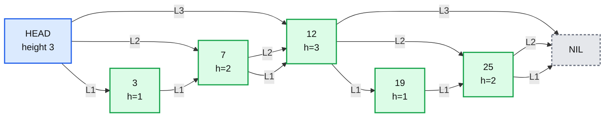
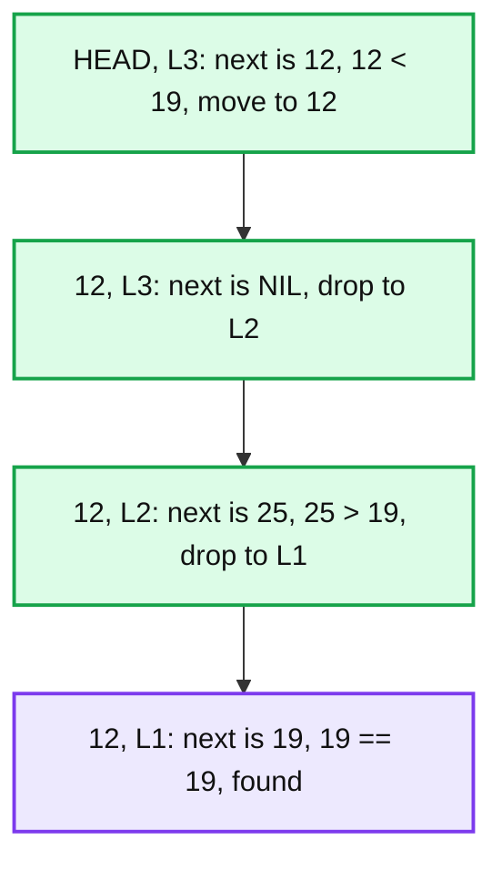
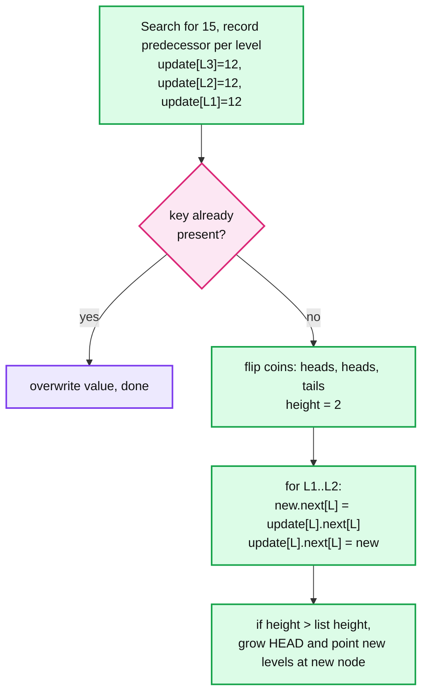
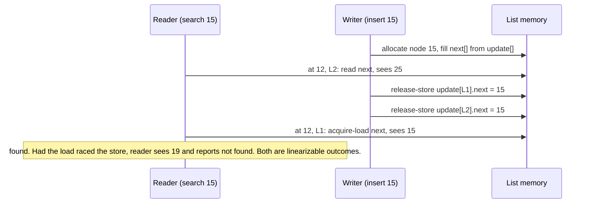
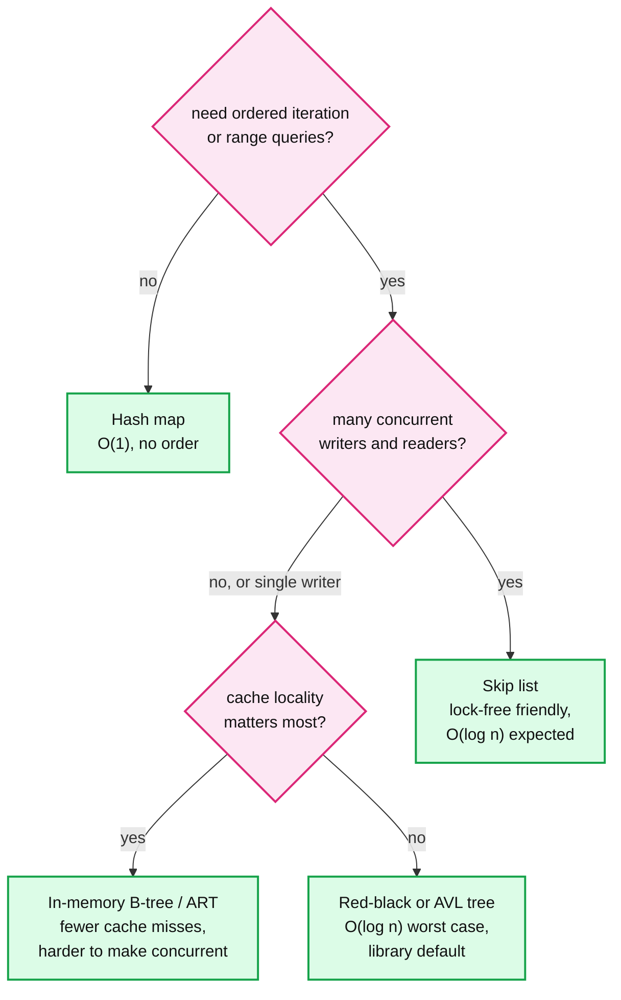

# Concept: Skip List

> One-liner: a skip list is a sorted linked list where each node also gets a random number of "express lane" pointers that skip ahead, so search, insert, and delete run in expected O(log n) without any of the rebalancing a tree needs.

Depth target: high-level, same as [raft.md](raft.md) and [lsm-tree.md](lsm-tree.md). This is the data structure under the LSM memtable, Redis sorted sets, and Java's concurrent sorted map, so it shows up in HLD, LLD, and DSA rounds. Because it is DSA, this note has runnable code.

---

## 1. Mental model

Think of a subway line. The local train stops at every station (the base linked list). The express train stops at every 4th station. The super-express at every 16th. To reach a station, ride the fastest train that does not overshoot, then step down a level and repeat. A skip list is that, except which stations get express stops is decided by coin flips, not by a schedule.



- **Level 1** is a normal sorted singly linked list. Every key is in it.
- A node of height `h` is in levels 1 through `h`. Height is chosen at insert time by flipping a coin: keep going up while it lands heads, with probability `p` (1/2 or 1/4).
- Every level is a sorted sublist of the level below. That invariant is what makes search work, and it costs nothing to maintain because it is true by construction.

**Why skip lists exist.** Pugh, 1990. Balanced trees (AVL, red-black) give O(log n) but need rotations, which are fiddly to write and, more importantly, hard to make concurrent because a rotation touches several nodes at once. A skip list gets the same expected bounds from randomness instead of structure, and an insert only ever touches the pointers immediately around the new node. That last property is why every storage engine picked it for the memtable.

---

## 2. Search

Start at the top level of the head. Move right while the next key is less than the target. When the next key is too big (or NIL), drop one level. At level 1, the next node is either the target or the place it would be.



- Expected steps: at each level you move right about `1/p` times before dropping, and there are about `log(n) / log(1/p)` levels. With `p = 1/2` that is `~2 log2 n`. For a million keys, ~40 comparisons.
- The same walk gives you a **range scan** for free: find the start key, then follow level 1 pointers. This is why LSM memtables and Redis sorted sets use it and a hash map cannot.
- **Worst case** is O(n) if every coin flip lands tails. The probability of a bad shape is vanishingly small and, unlike a tree, does not depend on the insertion order. A sorted insert stream, which degrades a naive BST to a linked list, does nothing to a skip list.

---

## 3. Insert and delete

Insert is a search that remembers the last node visited at every level (the `update` array), then a coin flip for the height, then a splice at each level up to that height.



- **No rebalancing.** The new node's height is independent of everything else. Nothing already in the list moves.
- **Delete** is the mirror: search with `update`, then for each level where `update[L].next[L]` is the target, set it to `target.next[L]`. If the top levels become empty, lower the list height.
- **Cost of both**: one search, O(log n), plus O(height) pointer writes, which is O(1) expected.

**Choosing `p`.** It trades search speed against memory.

| `p` | Expected pointers per node `1 / (1 - p)` | Expected comparisons per search | Used by |
|---|---|---|---|
| 1/2 | 2 | `~2 log2 n` | Pugh's paper, Java `ConcurrentSkipListMap` |
| 1/4 | 1.33 | `~2.67 log2 n` (roughly `log4 n` levels, 4 steps each) | LevelDB, RocksDB, Redis |

`p = 1/4` is the practical default: a third fewer pointers for a search that is only ~30% longer, and in a memtable the comparisons are cheap next to the memory bandwidth.

---

## 4. Code

Python, runnable, no dependencies. Enough to whiteboard from.

```python
import random

class SkipList:
    MAX_LEVEL = 16   # enough for ~4^16 keys at p = 1/4
    P = 0.25

    class Node:
        __slots__ = ("key", "value", "next")
        def __init__(self, key, value, height):
            self.key, self.value = key, value
            self.next = [None] * height   # next[i] is the successor at level i

    def __init__(self):
        self.head = self.Node(None, None, self.MAX_LEVEL)
        self.height = 1                   # number of levels currently in use

    def _random_height(self):
        h = 1
        while h < self.MAX_LEVEL and random.random() < self.P:
            h += 1
        return h

    def _find(self, key):
        """Return (node_before_key_at_level_1, update[]) where update[i] is
        the last node with key < target at level i."""
        update = [None] * self.MAX_LEVEL
        x = self.head
        for i in reversed(range(self.height)):
            while x.next[i] is not None and x.next[i].key < key:
                x = x.next[i]
            update[i] = x
        return x, update

    def get(self, key):
        x, _ = self._find(key)
        x = x.next[0]
        return x.value if x is not None and x.key == key else None

    def put(self, key, value):
        x, update = self._find(key)
        x = x.next[0]
        if x is not None and x.key == key:
            x.value = value
            return
        h = self._random_height()
        if h > self.height:               # grow: new levels hang off head
            for i in range(self.height, h):
                update[i] = self.head
            self.height = h
        node = self.Node(key, value, h)
        for i in range(h):                # splice in at every level it lives on
            node.next[i] = update[i].next[i]
            update[i].next[i] = node

    def delete(self, key):
        x, update = self._find(key)
        x = x.next[0]
        if x is None or x.key != key:
            return False
        for i in range(len(x.next)):
            if update[i].next[i] is x:
                update[i].next[i] = x.next[i]
        while self.height > 1 and self.head.next[self.height - 1] is None:
            self.height -= 1              # shrink if the top level is empty
        return True

    def scan(self, lo, hi):
        """Yield (key, value) for lo <= key < hi. This is why LSM memtables use it."""
        x, _ = self._find(lo)
        x = x.next[0]
        while x is not None and x.key < hi:
            yield x.key, x.value
            x = x.next[0]


if __name__ == "__main__":
    s = SkipList()
    for k in [12, 3, 25, 7, 19]:
        s.put(k, str(k))
    assert s.get(19) == "19" and s.get(4) is None
    assert [k for k, _ in s.scan(5, 20)] == [7, 12, 19]
    assert s.delete(12) and s.get(12) is None
    print("ok, height", s.height)
```

The three lines that matter in an interview: the `reversed(range(self.height))` descent, the `while x.next[i].key < key` walk, and `update[i]` as the splice points.

---

## 5. Concurrency: why storage engines chose it over trees

An insert changes a handful of `next` pointers, each on a different level of one predecessor. Readers who are mid-walk either see the old pointer (they skip the new node, which was not there when they started) or the new one. Both are valid sorted lists. This is what makes lock-free readers possible.



Three concurrency designs in the wild:

| Design | How | Used by |
|---|---|---|
| **Single writer, lock-free readers** | One thread inserts. Pointers are published with release semantics, read with acquire. Nodes are never freed while the list lives (arena). No locks, no CAS. | LevelDB, RocksDB `SkipList` and `InlineSkipList` (writes are serialized by the write group anyway) |
| **Lock-free multi-writer** | Insert with CAS on `next` at each level, bottom level first. If the CAS fails, re-search from the predecessor and retry. Delete marks the node logically first, then unlinks. | Java `ConcurrentSkipListMap`, RocksDB concurrent memtable writes (`allow_concurrent_memtable_write`) |
| **Coarse or per-level locks** | Simple. Serialises everyone. | Redis (single-threaded, needs none), teaching implementations |

The contrast: a red-black tree rotation rewrites parent, child, and grandchild pointers at once, so a concurrent reader can observe a torn tree. Lock-free balanced trees exist but are research-grade. The skip list's "insert touches only the new node's neighbours" property is why it won.

**Memory reclamation is the hard part** of lock-free delete: a reader may still hold a pointer to a node another thread unlinked. Solutions: never free (arena tied to the memtable's lifetime, which is what LSM engines do), epoch-based reclamation, or hazard pointers. Interviewers who know this will ask.

---

## 6. Where you meet skip lists

| System | What the skip list does there |
|---|---|
| LevelDB, RocksDB, Pebble | The **memtable**. Sorted inserts at write speed, ordered iteration for flush and range scans, lock-free reads while the single writer inserts. |
| Redis sorted sets (`ZSET`) | Members ordered by score. A hash map for O(1) `ZSCORE`, a skip list for `ZRANGEBYSCORE`, `ZRANK`, `ZRANGE`. Each node also stores a **span** (how many level-1 nodes the pointer skips) so rank queries are O(log n). |
| Java `ConcurrentSkipListMap` / `Set` | The JDK's concurrent sorted map. `TreeMap` has no concurrent version, this is why. |
| Apache Lucene | Multi-level skip pointers over posting lists so `advance(docId)` skips ahead without decoding every block. |
| Cassandra, HBase memtables | Cassandra uses a `ConcurrentSkipListMap` per partition. HBase `MemStore` is a `ConcurrentSkipListMap` (with a compacting variant). |
| MemSQL / SingleStore | Lock-free skip lists as the in-memory row store index instead of B-trees. |

---

## 7. Skip list vs the alternatives



| | Skip list | Red-black / AVL tree | In-memory B-tree | Hash map |
|---|---|---|---|---|
| Search / insert / delete | O(log n) **expected** | O(log n) worst case | O(log n) worst case | O(1) expected |
| Ordered iteration, range scan | Yes, follow level 1 | Yes, in-order walk | Yes, leaf walk | No |
| Code complexity | ~100 lines | ~400 lines with rotations and deletion cases | Splits and merges | Small |
| Concurrent writes | Easy: local pointer changes, CAS per level | Hard: rotations touch multiple nodes | Medium: latch coupling | Easy with striping |
| Cache behaviour | Poor: pointer chasing, one cache miss per hop | Poor: same | Good: many keys per node | Good |
| Memory per key | ~1.33 to 2 pointers + key | 3 pointers + colour + key | Amortised < 1 pointer | 1 pointer + key + load factor slack |
| Deterministic | No, randomised | Yes | Yes | No (hash) |

The honest answer to "why not a B-tree in memory": a cache-aware B-tree or ART (Adaptive Radix Tree) is usually **faster** single-threaded than a skip list, because a skip list takes a cache miss on almost every hop. Skip lists win on simplicity and concurrency, not raw speed. RocksDB keeps the skip list as the default memtable for that reason, and offers a hash-skiplist and a vector memtable for workloads where it does not fit.

---

## 8. Practical additions every real implementation has

| Addition | Problem it fixes |
|---|---|
| **Arena allocation** | Nodes live in one big block freed with the whole list. No per-node `free`, no reclamation problem for lock-free readers, better locality. This is what makes "never free a node" viable in a memtable. |
| **Inline keys** (`InlineSkipList`) | Store the key bytes right after the `next[]` array in the same allocation. One cache miss per hop instead of two. |
| **Bounded max height** | Cap at 12 (LevelDB, RocksDB) or 32 (Redis) levels. `4^12 = 16M` keys, more than a memtable ever holds. Avoids unbounded `next[]` arrays. |
| **Spans per pointer** (Redis) | Each forward pointer records how many level-1 nodes it skips. Rank of a key, or the k-th key, becomes O(log n). |
| **Backward pointer at level 1** (Redis) | Reverse iteration for `ZREVRANGE` without a second structure. |
| **Insert hints / splice cache** | Remember the last `update[]` array. Sequential or nearby inserts reuse it and skip most of the search. RocksDB's `InsertWithHint` for prefix-local writes. |
| **Fingerprints or key prefixes in the node** | Compare a few bytes before dereferencing the full key. Fewer cache misses on the walk. |
| **Deterministic height from hash** | Some systems derive height from a hash of the key so the structure is reproducible across replicas or for testing. Loses the "adversary cannot predict" property. |

---

## 9. Failure modes and gotchas

| Failure | What happens | Fix |
|---|---|---|
| Bad random source (seeded the same, low entropy, or `p` set to 0.9) | Heights cluster. Either every node is tall (memory blow-up, slow inserts) or every node is short (O(n) search). | Use a real PRNG, `p` of 1/4 or 1/2, cap the height. |
| Adversarial inputs | Cannot degrade the shape. Heights do not depend on keys. | Nothing to do, unless heights are derived from a key hash, then an attacker can craft collisions. |
| Freeing a node while a lock-free reader holds it | Use-after-free, crash or garbage read. | Arena lifetime, epochs, or hazard pointers. Never plain `free` in a lock-free skip list. |
| Publishing the new node top-down instead of bottom-up | A reader at level 3 follows the pointer to a node that is not yet linked at level 1, then drops down into a dangling `next[0]`. | Splice from level 1 upward. Or fill every `next[]` before any pointer to the node is published. |
| Memtable too large | The skip list is fine at 1M keys, but a 1 GB memtable means a 1 GB WAL to replay and a long flush. | This is an LSM sizing decision, not a skip list one. See [lsm-tree.md](lsm-tree.md) section 2. |
| Expecting worst-case O(log n) | A pathological run of tall or short nodes is possible in theory. | Vanishingly rare, `~1/n^c`. If a hard bound is required by a real-time system, use a balanced tree. |

---

## 10. Trade-offs

| Gain | Cost |
|---|---|
| O(log n) search, insert, delete with ~100 lines and no rotations | Bounds are expected, not worst case. Randomised. |
| Insert and delete change only local pointers | One cache miss per hop. A cache-aware tree is 2 to 5x faster single-threaded. |
| Lock-free readers are natural, lock-free writers are tractable | Memory reclamation for lock-free delete is genuinely hard. Most engines dodge it with an arena. |
| Ordered iteration and range scans come free from level 1 | Uses ~1.33 to 2 pointers per key. A hash map would be smaller and O(1) if order were not needed. |
| Insertion order cannot degrade it | Height depends on a random source. A bad or predictable one breaks the guarantees. |
| Easy to add rank, reverse iteration, hints | Every addition is more per-node metadata. Redis nodes carry span + backward + score + member. |

**What a Staff answer refuses to build:** a hand-written concurrent skip list when `ConcurrentSkipListMap` or RocksDB's memtable exists, a skip list where a sorted vector plus binary search would do (small, read-mostly, bulk-loaded), and a skip list as an on-disk structure (it is a pointer-chasing in-memory structure, on disk you want a B-tree or SST).

---

## 11. Numbers worth memorizing

- `p = 1/4`: 1.33 pointers per node, `log4 n` levels, about `2.67 log2 n` comparisons. `p = 1/2`: 2 pointers, `2 log2 n` comparisons.
- 1M keys: ~10 levels at `p = 1/4`, ~20 at `p = 1/2`. ~40 to 50 comparisons per search.
- Max height: LevelDB and RocksDB 12, Redis 32, Java `ConcurrentSkipListMap` 62.
- Probability the list height exceeds `c * log(1/p) n` is about `1 / n^(c-1)`. Worst case is theoretical.
- RocksDB memtable: 64 MB default, single writer into the skip list, concurrent writers optional.
- Redis: skip list node = score (8 B) + member pointer + backward pointer + `level[]` array of (forward, span) pairs. Roughly 40 B overhead per member plus the levels.

---

## 12. Interview soundbite

> "A skip list is a sorted linked list with random express lanes. Each node gets a height from coin flips, and a search rides the top level as far as it can, then drops down. Expected O(log n) for everything, no rebalancing, and an insert only touches the pointers next to it, which is why it is easy to make lock-free. That is the reason it is the memtable in LevelDB and RocksDB, the index in Redis sorted sets, and the only concurrent sorted map in the JDK. The cost is a cache miss per hop, so a cache-aware tree is faster single-threaded, and the bounds are expected, not worst case."

Follow-ups an interviewer will ask, in order of likelihood:

1. Why does a storage engine pick this over a red-black tree for the memtable? (Section 5, local pointer changes, lock-free readers, arena.)
2. Walk me through insert. What is the `update` array? (Section 3 and 4.)
3. What is `p` and what does changing it do? (Section 3, memory vs comparisons.)
4. How do you make it safe for concurrent readers with one writer? (Section 5, bottom-up publish, acquire / release, never free.)
5. How does Redis get `ZRANK` in O(log n)? (Section 8, spans.)
6. What is the worst case, and can an attacker trigger it? (Section 2 and 9, only via a bad random source.)
7. Why is a B-tree faster in memory, and when does that matter? (Section 7, cache misses.)

Related: [lsm-tree.md](lsm-tree.md) (the memtable this structure implements), `popular_systems_deepdive/rocksdb/rocksdb-01-write-path.md` (RocksDB's `InlineSkipList`), `hld/kv-store-wal/` (where the memtable sits in a full design).
