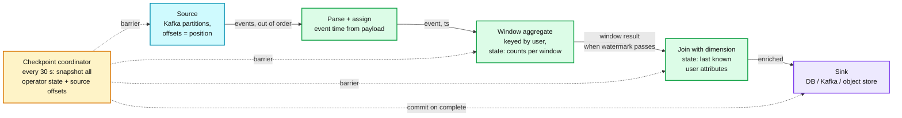
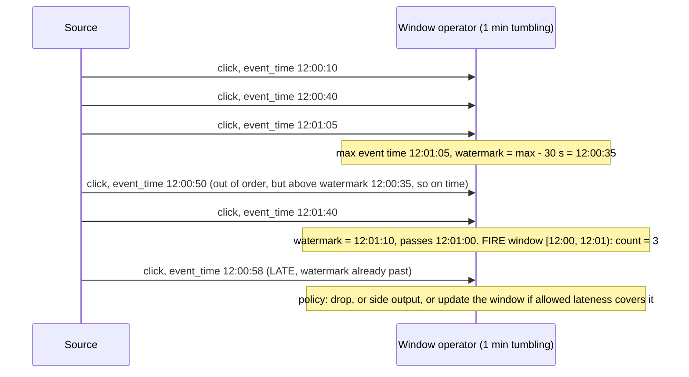
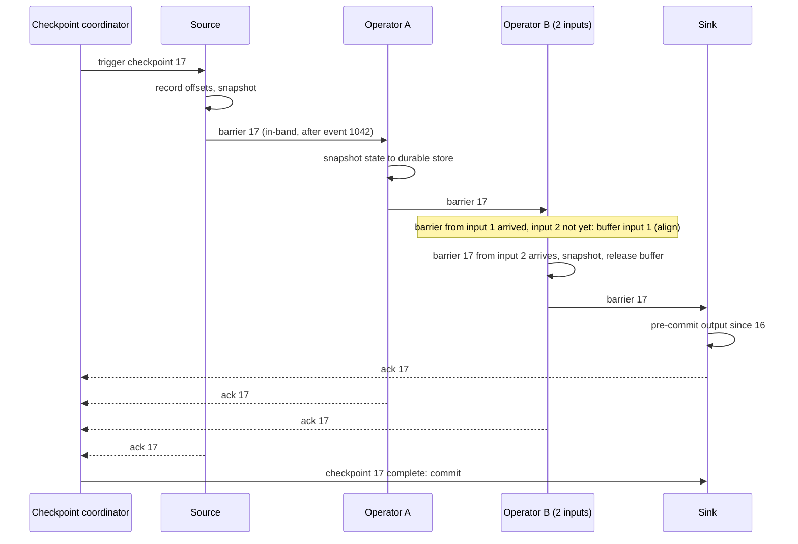
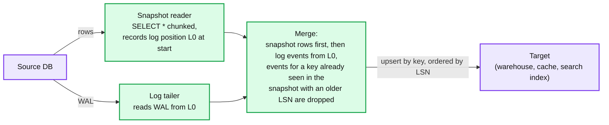

# Concept: Stream Processing Semantics

> One-liner: stream processing computes over events as they arrive instead of over a finished dataset, and the whole difficulty is that events arrive late and out of order; **event time** (when it happened) is separated from **processing time** (when you saw it), **watermarks** declare "no more events before time T are expected" so windows can close, **checkpoints** snapshot every operator's state at one consistent point so a crash replays from there, and the sink is made exactly-once by tying its commit to the checkpoint or by writing idempotently.

Depth target: high-level, same as [exactly-once.md](exactly-once.md) and [time-series-db.md](time-series-db.md). It is under test in ingestion, CDC, trending, monitoring, and experimentation problems, and "what happens to a late event" is the follow-up.

---

## 1. Mental model

Count clicks per minute. In batch, you wait until the day is over and group by minute. In streaming, you must emit the count for 12:00 to 12:01 at some point, but a click that happened at 12:00:59 might arrive at 12:03 because the phone was in a tunnel. When do you emit? What do you do with the click at 12:03?

Four pieces, in the order they matter:

| Piece | Question | Answer |
|---|---|---|
| **Time** | Which clock? | Event time for correctness, processing time for latency. Never confuse them. |
| **Windows and watermarks** | When is a window complete? | When the watermark passes its end. The watermark is a heuristic; late events after it are handled by policy. |
| **State and checkpoints** | What survives a crash? | Operator state (counts, joins, buffers) snapshotted with source offsets at a consistent point. Restart replays from there. |
| **Sink semantics** | Does the output appear once? | Only if the sink commit is tied to the checkpoint (2PC) or the write is idempotent. |

**Why this matters more at Staff level.** Senior answers say "use Flink". Staff answers say what the watermark delay is and what it costs, where late data goes, how big the state is and where it lives, how long recovery takes from a checkpoint, and what the sink does with a duplicate.

---

## 2. Event time, processing time, and watermarks

| Term | Meaning | Example |
|---|---|---|
| **Event time** | When the event happened, from the payload | Click at 12:00:59 on the phone |
| **Ingestion time** | When the source first saw it | Reached Kafka at 12:01:30 |
| **Processing time** | When the operator handles it | Aggregated at 12:03:00 |
| **Watermark** | An assertion flowing through the stream: "all events with event time <= W have arrived" | `W = max_event_time_seen - allowed_delay` |
| **Allowed delay** (bounded out-of-orderness) | How far behind max the watermark trails | 30 s for web clicks, hours for mobile with offline buffering |
| **Allowed lateness** | After the window fires, how long it stays open to accept late events and re-emit | 0 (drop), or 10 min (update), or forever (never close, state grows) |
| **Late event** | Event time below the current watermark | Dropped, side-output to a late topic, or applied as a correction |

Watermark facts to say out loud:

- **A watermark is a trade between latency and completeness.** Delay 0: windows fire instantly and miss every late event. Delay 1 hour: nothing is missed, results are an hour old. Pick from the observed lateness distribution: p99 of (ingestion time minus event time).
- **Watermarks are per source partition, merged by min.** One Kafka partition that stops producing (idle) holds the watermark back for everyone. Fix: idle-source timeout that lets the merged watermark advance without it.
- **A slow or replayed partition drags the watermark.** After a restart, a partition 1 hour behind means the merged watermark is 1 hour behind, and no window fires until it catches up. Backfills must be run with their own watermark strategy.
- **Processing-time windows are simpler and wrong.** They give "events I received between 12:00 and 12:01", which changes every time you replay. Use them only for operational metrics where replayability does not matter.

---

## 3. Windows

| Window | Definition | State | Use |
|---|---|---|---|
| **Tumbling** | Fixed size, no overlap. `[12:00, 12:01)`, `[12:01, 12:02)` | One aggregate per key per window | Per-minute counts, billing |
| **Sliding** (hopping) | Fixed size, fixed slide. 5 min window every 1 min | Each event is in `size/slide` windows, 5x state | Moving averages, "last 5 minutes" dashboards |
| **Session** | Gap-based. Events within 30 min of each other are one session | One open session per key, merges when a gap fills | User sessions, incident grouping |
| **Global with trigger** | Never closes, fires on a condition (count, time, custom) | Grows unless evicted | Custom patterns |

**Triggers** decide when a window emits: on watermark (the default, once), early (every 10 s with a partial result), late (re-emit on late events within allowed lateness). Early firing plus late updates gives dashboards that show a number immediately and correct it later, at the cost of the sink having to accept updates (upserts, not appends).

**Windowed joins.** Stream-stream: buffer both sides for the window duration, join on key, emit, evict when the watermark passes. State is `window size x rate x 2`. Stream-table (enrichment): keep the latest value per key from the table stream, look up on each event. State is the table size. Temporal join: as-of a timestamp, needs versioned table state.

---

## 4. State and checkpoints

Every window count, every join buffer, every dedup set is operator state. It has to survive a crash without recomputing from the beginning of time.

- **Barriers** are markers injected at the source and flowing in-band with events. Everything before the barrier belongs to checkpoint N, everything after to N+1. An operator snapshots when it has seen the barrier on every input. This is Chandy-Lamport (1985) as implemented by Flink.
- **Alignment**: an operator with two inputs must wait for the barrier on both, buffering the faster input. Under backpressure this stalls. Unaligned checkpoints (Flink 1.11+) snapshot the in-flight buffers too, so the barrier overtakes the data.
- **State backend**: in-memory heap for small state (GBs), RocksDB on local disk for large state (TBs across the cluster), with incremental snapshots to S3 or HDFS. See [lsm-tree.md](lsm-tree.md) for what RocksDB is doing underneath.
- **Recovery**: restore every operator's state from checkpoint N, reset sources to the recorded offsets, replay. Everything between N and the crash is recomputed. Time to recover = state download time + replay of the interval. 30 s checkpoints and 10 GB of state on a 1 Gbps link is ~90 s of restore plus 30 s of replay.
- **Checkpoint vs savepoint**: checkpoints are automatic and for failure recovery. Savepoints are manual, versioned, and for upgrades, rescaling, and A/B of code changes. Rescaling redistributes keyed state by key group.

**State size is the number to estimate.** Session windows per user: `active users x per-session state`. A 5-minute sliding window at 1M events/s of 100 B each: `5 x 60 x 1M x 100 B x (size/slide)` = 30 GB times the overlap factor. This decides heap vs RocksDB and how many task slots.

---

## 5. Delivery semantics end to end

| Stage | At-least-once | Exactly-once |
|---|---|---|
| **Source** | Replay from last committed offset. Duplicates after a crash. | Offsets are part of the checkpoint. Replay from the checkpoint's offset, which matches the state. |
| **Operators** | State may be ahead of or behind the offset. | State and offset snapshotted together by the barrier. Internally exactly-once. |
| **Sink** | Writes between checkpoints are visible before the checkpoint completes. Crash, replay, write again: duplicates. | **Two-phase commit sink**: pre-commit on snapshot, commit when the coordinator confirms. Kafka transactional producer, or a staging table renamed on commit. **Or idempotent sink**: upsert by key, so replayed writes overwrite. |

The pattern to say: **Flink and Kafka Streams give exactly-once inside the pipeline. At the sink it is either transactional (commit tied to checkpoint) or idempotent (upsert). A plain append to a database or an HTTP call is at-least-once no matter what the engine claims.** See [exactly-once.md](exactly-once.md) section 4.

Transactional sink cost: output is invisible until the checkpoint commits, so **end-to-end latency is at least one checkpoint interval**. 30 s checkpoints means 30 s of sink latency. Idempotent sinks have no such delay.

---

## 6. Backpressure and flow control

A slow operator (or sink) must not cause unbounded buffering upstream, and must not drop data.

- **Credit-based flow control** (Flink): each receiver advertises how many buffers it can accept; senders stop when credits run out. Pressure propagates hop by hop to the source, which stops pulling from Kafka. Kafka absorbs the backlog on disk. This is why a durable log at the front of a pipeline is the standard shape: the log is the buffer, the pipeline never has to drop.
- **Consumer lag** is the metric: source offset minus latest offset per partition, in messages and in time. Lag growing means the pipeline cannot keep up. Alert on lag in seconds, not messages.
- **Autoscaling** is on lag and on operator busy-time. Scale by rescaling from a savepoint, which redistributes keyed state. Minutes, not seconds.
- **Load shedding** is a policy decision: sample, drop low-priority events, or degrade to a coarser window. Never silent. See [rate-limiting-and-load-shedding.md](rate-limiting-and-load-shedding.md).
- **Skew**: one hot key (one user, one tenant) sends all of its events to one operator instance. That instance is the bottleneck. Fix as in [sharding.md](sharding.md) section 5: pre-aggregate on a salted key, then combine.

---

## 7. CDC and the snapshot-to-stream handoff

Change data capture turns a database into a stream by tailing its write-ahead log. It is the standard source for ingestion and for cache invalidation, and it has one specific hard problem.

- **Handoff**: record the log position before the snapshot starts, snapshot, then tail from that position. Events during the snapshot are seen twice (once in the snapshot row, once in the log); the target must upsert by key so the later write wins. Debezium's incremental snapshot interleaves chunks with log events using a watermark table so the snapshot can run without stopping the log.
- **Ordering**: per key, in log order (LSN, GTID, binlog position). Across keys, no guarantee unless you serialise. Partition the output topic by primary key.
- **Schema evolution**: a column added mid-stream. The event carries a schema version (schema registry); the sink either tolerates unknown fields or the pipeline pauses on incompatible changes. Say which.
- **Tombstones**: a delete becomes an event with a null payload. The sink must apply it as a delete, and the compacted topic must retain it long enough for every consumer to see it.

---

## 8. Where you meet it

| System | Model | Detail |
|---|---|---|
| **Apache Flink** | Event time, watermarks, barrier checkpoints, RocksDB state, 2PC sinks | The reference implementation of everything above. |
| **Kafka Streams** | Same model, state in local RocksDB backed by changelog topics, exactly-once via Kafka transactions | No separate cluster; state recovery by replaying the changelog topic. |
| **Spark Structured Streaming** | Micro-batch (100 ms to seconds), watermarks for late data, checkpoint to object store | Higher latency floor, easier batch/stream code sharing. |
| **Google Dataflow / Beam** | The model that named watermarks and triggers ("The Dataflow Model", 2015) | Unified batch and stream API. |
| **Debezium** | CDC source for MySQL, Postgres, Mongo, etc., into Kafka | Snapshot plus log tail, outbox event router. |
| **Materialize, RisingWave** | Streaming SQL with incremental view maintenance | Windows and joins as materialised views. |
| **Delta Lake / Iceberg streaming** | Append-only commits to a table, readers see snapshots | Exactly-once by transactional commit of files, see `hld/` #15. |
| **`hld/` #18 ingestion, #22 CDC, #24 trending, #26 monitoring, #40 experimentation** | All of the above | Trending is a sliding window over a heavy-hitter sketch. Monitoring is tumbling windows into a time-series store. Experimentation is a stream-table join of exposures with metrics. |

---

## 9. Practical additions every real implementation has

| Addition | Problem it fixes |
|---|---|
| **Watermark delay from measured lateness p99** | Too small drops data, too big delays every result. |
| **Idle source timeout** | One quiet partition freezes all windows. |
| **Late-data side output** | Dropped events vanish silently. Route to a topic, count them, backfill. |
| **Allowed lateness with upsert sink** | Early results are wrong forever. |
| **Incremental RocksDB checkpoints** | Full snapshot of TBs every 30 s. |
| **Unaligned checkpoints** | Barrier alignment stalls under backpressure. |
| **Savepoints before every deploy** | Cannot roll back a bad job version with state. |
| **Key groups for rescaling** | Cannot change parallelism without losing state. |
| **Changelog topics for state** (Kafka Streams) | Local state lost with the instance. |
| **Lag in seconds as the alert** | Lag in messages means nothing across topics. |
| **Dead-letter topic for poison messages** | One unparseable event stops the pipeline. |
| **Schema registry with compatibility rules** | Producer change breaks every consumer. |
| **Salted pre-aggregation for hot keys** | One key saturates one operator. |

---

## 10. Failure modes and what happens

| Failure | What happens | Fix |
|---|---|---|
| Processing-time windows | Results depend on when the job ran. Replay gives different numbers. | Event time. |
| Watermark delay too short | Late events dropped. Counts are low. Nobody notices for a week. | Measure lateness, set delay at p99, side-output the rest and count it. |
| Watermark delay too long | Every result is an hour late. | Early triggers with upsert sink. |
| Idle partition | Watermark stuck. No window ever fires. Pipeline looks healthy, produces nothing. | Idle timeout. |
| Backfill through the live job | Watermark dragged back, live windows stop firing until the backfill catches up. | Separate job or separate watermark strategy. |
| State on heap, grows past memory | OOM, restart, restore, OOM again. | RocksDB backend, TTL on state, bounded windows. |
| No state TTL on session windows | Sessions for users who never return live forever. | State TTL. |
| Checkpoint interval too long | Long replay on recovery. 10 min interval means up to 10 min recomputed. | 10 to 60 s for most jobs. |
| Checkpoint too frequent with large state | Checkpointing dominates, throughput drops. | Incremental snapshots, longer interval, smaller state. |
| Append sink with replay | Duplicates after every recovery. | Upsert sink or 2PC sink. |
| 2PC sink with long checkpoint interval | Output latency equals the interval. Dashboard is 5 minutes behind. | Shorter interval, or idempotent sink. |
| Kafka transaction timeout shorter than checkpoint interval | Sink transaction aborted by the broker before commit. Data loss. | `transaction.timeout.ms` > checkpoint interval plus margin. |
| Poison message | Operator throws, job restarts, same message, throws. Infinite loop. | Dead-letter topic. |
| Hot key | One task at 100%, lag grows on one partition. | Salt and pre-aggregate. |
| Schema change | Deserialisation fails, or a field silently becomes null. | Registry with compatibility checks. |

---

## 11. Trade-offs

| Gain | Cost |
|---|---|
| Event time: correct, replayable results. | Watermark delay adds latency. Late data needs a policy. |
| Processing time: lowest latency, no state for lateness. | Not replayable. Wrong under any delay. |
| Watermarks: windows can close without waiting forever. | A heuristic. Some data is always late. |
| Allowed lateness with updates: late data corrected. | Sink must upsert. State held longer. |
| Barrier checkpoints: consistent recovery with no replay from zero. | Alignment stalls under pressure. Checkpoint interval bounds recovery time and, with 2PC sinks, output latency. |
| RocksDB state: TBs of state per job. | Disk-speed access, serialisation cost, longer restores. |
| 2PC sink: exactly-once output. | Latency equals checkpoint interval. Sink must support transactions. |
| Idempotent sink: exactly-once effect with no latency penalty. | Sink must be keyed and upsertable. Appends and side effects do not qualify. |
| Durable log at the front: never drop under backpressure. | Storage for the backlog. Lag is the thing you watch. |
| Micro-batch (Spark): simpler, shares code with batch. | Latency floor of the batch interval. |

**What a Staff answer refuses to build:** processing-time windows for anything billable, a watermark delay picked without measuring lateness, an append-only sink with "exactly-once" in the design doc, session windows with no state TTL, and a pipeline with no dead-letter path.

---

## 12. Numbers worth memorizing

- Watermark delay: web clicks **30 s to 5 min**, mobile with offline buffering **hours**, server logs **seconds**. Set from lateness p99.
- Checkpoint interval: **10 s to 1 min**. Recovery time ~ state restore plus one interval of replay.
- 2PC sink latency floor = checkpoint interval. Kafka `transaction.timeout.ms` default 60 s, max broker-side 15 min; must exceed the interval.
- Sliding window state multiplier = `size / slide`. 5 min every 1 min = 5x.
- Flink throughput: ~1M events/s per core for simple maps, 100k to 500k/s for keyed aggregations. State: heap up to a few GB per task, RocksDB to TBs per job.
- Kafka consumer lag alert: **lag in seconds > 2x checkpoint interval** is a good default.
- Debezium snapshot: 10k to 50k rows/s per table. A 1B row table is hours; run incremental snapshots.
- Spark micro-batch floor: ~100 ms, typically 1 to 10 s.
- Chandy-Lamport 1985, Dataflow Model 2015, Flink barrier checkpoints 2015.

---

## 13. Interview soundbite

> "I process in event time with a watermark that trails the newest event by the measured p99 lateness, so windows close on the source's clock, not mine, and results replay identically. Late events go to a side output that I count and can backfill, and hot dashboards fire early and upsert corrections. Operator state lives in RocksDB, snapshotted every 30 seconds with in-band barriers together with the source offsets, so recovery restores the snapshot and replays at most 30 seconds. The pipeline is exactly-once internally; at the sink I either tie the commit to the checkpoint, which costs one interval of latency, or write idempotent upserts, which costs nothing. Backpressure propagates to the source and the Kafka log absorbs it, and lag in seconds is the alert. For CDC I snapshot at a recorded log position, tail from it, and upsert so the overlap is harmless."

Follow-ups an interviewer will ask, in order of likelihood:

1. An event arrives 10 minutes late. What happens? (Section 2, watermark, allowed lateness, side output.)
2. The job crashes. What is recomputed? (Section 4, from the last checkpoint, one interval.)
3. Is the output exactly-once? (Section 5, only with a 2PC or idempotent sink.)
4. One Kafka partition goes quiet. (Section 2, idle timeout.)
5. How big is the state and where does it live? (Section 4, estimate it, RocksDB.)
6. A backfill of last week. (Section 2 and 10, separate job or watermark strategy.)
7. The sink is slow. (Section 6, backpressure to the source, lag metric.)
8. One user generates 50% of events. (Section 6, salt and pre-aggregate.)
9. How does CDC not miss rows between snapshot and log? (Section 7, record position first, upsert on overlap.)
10. Why not processing time? (Section 2, not replayable.)

Related: [exactly-once.md](exactly-once.md) (idempotent and transactional sinks), [lsm-tree.md](lsm-tree.md) (the RocksDB state backend), [time-series-db.md](time-series-db.md) (where tumbling-window metrics land), [stream-sketches.md](stream-sketches.md) (count-min and HLL for trending and cardinality), [sharding.md](sharding.md) (hot keys in keyed streams), [caching-patterns.md](caching-patterns.md) (CDC-driven invalidation), [rate-limiting-and-load-shedding.md](rate-limiting-and-load-shedding.md) (shedding policy), `popular_systems_deepdive/kafka/` (the log at the front), `hld/` #18 ingestion, #22 CDC, #24 trending, #26 monitoring, #40 experimentation.
