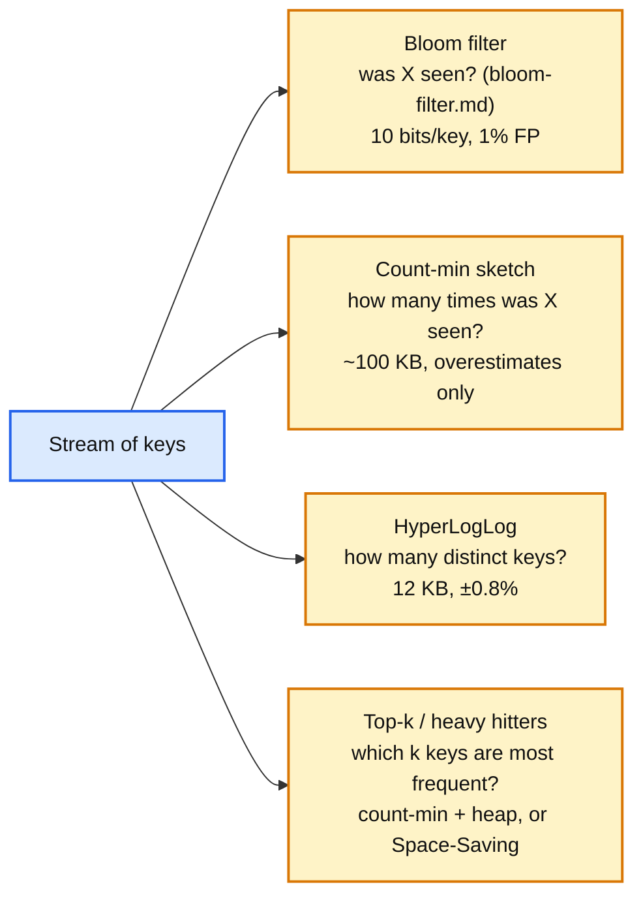
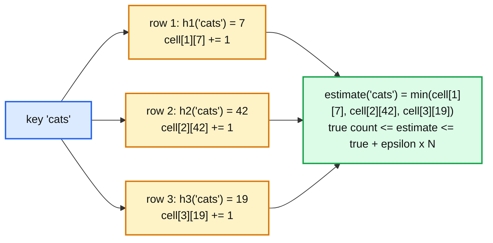

# Concept: Streaming Sketches (Count-Min, HyperLogLog, Top-K)

> One-liner: a sketch is a fixed-size summary of a stream that answers one question approximately, with a provable error bound, in memory that does not grow with the stream; count-min sketch answers "how many times did I see key X" in a few hundred KB, HyperLogLog answers "how many distinct keys" in 12 KB with ~1% error, and a heavy-hitters structure answers "what are the top k keys" without storing every key. They are what makes trending, cardinality, and hot-key detection possible at a billion events per second.

Depth target: high-level, same as [bloom-filter.md](bloom-filter.md), which is the same family (hash into a small array, accept bounded error). It is under test in trending hashtags, monitoring cardinality, and hot-key detection. Because it is DSA, this note has runnable code.

---

## 1. Mental model

Exact counting of 1 billion distinct hashtags needs a hash map with 1 billion entries, tens of GB, and a merge across every node. A sketch hashes each key into a small array, updates a few cells, and reads back an estimate whose error is bounded by the array size. The array is the same size whether you see a thousand keys or a trillion.



| Sketch | Question | Memory | Error | Mergeable | Delete |
|---|---|---|---|---|---|
| **Count-min** (Cormode and Muthukrishnan, 2005) | Frequency of X | `d x w` counters: 4 x 2^16 x 4 B = 1 MB | Overestimates by at most `epsilon x N` with probability `1 - delta` | Yes, cell-wise add | Yes, if counts are signed (count-mean-min) |
| **HyperLogLog** (Flajolet et al., 2007) | Distinct count | `2^p` registers of 6 bits: `p=14` is 12 KB | `1.04 / sqrt(2^p)`: 0.81% at p=14 | Yes, register-wise max | No |
| **Space-Saving / Misra-Gries** | Top k frequent | `k` counters | Each counter's error <= `N / k` | Approximately | No |
| **Count-min + min-heap** | Top k frequent | Sketch plus `k` entries | As count-min | Yes | No |
| **t-digest, DDSketch, KLL** | Quantiles (p50, p99) | ~few KB | Relative or rank error, ~1% | Yes | No |
| **Bloom filter** | Membership | 10 bits/key | 1% FP, no FN | Yes, OR | No |
| **MinHash, SimHash** | Set similarity (Jaccard) | k hashes per set | ~`1/sqrt(k)` | Yes | No |

**Why this matters more at Staff level.** Senior answers say "count in Redis". Staff answers say why exact counts do not fit, which sketch, what the error is, that sketches merge across shards and time windows, and where the exact confirmation happens for the top few.

---

## 2. Count-min sketch

A 2D array of `d` rows and `w` columns, one hash function per row. Increment: for each row `i`, `cell[i][h_i(x)] += 1`. Query: `min over i of cell[i][h_i(x)]`. The minimum is taken because every collision only adds, so the smallest cell is the least polluted estimate.



Sizing: `w = ceil(e / epsilon)`, `d = ceil(ln(1 / delta))`. For error at most 0.01% of the total count (`epsilon = 1e-4`) with 99.9% confidence (`delta = 0.001`): `w = 27,183`, `d = 7`, 190k counters, ~760 KB with 32-bit counters. The error is **additive in N**, so rare keys are overestimated badly in relative terms and heavy keys are estimated well. That is exactly right for heavy-hitter detection.

**Windows.** A sketch per time bucket (one per minute, keep 60), sum the last `n` for a sliding window. Or exponential decay: multiply all cells by a factor each tick. Trending hashtags is "sketch per minute, top-k over the last 10 minutes minus top-k over the previous hour".

---

## 3. HyperLogLog

Hash each key. Count the leading zeros in the hash. Seeing a hash with 20 leading zeros suggests ~2^20 distinct keys, because that pattern appears once per million random hashes. One such observation is noisy, so split the hash: the first `p` bits pick one of `2^p` registers, and each register stores the maximum leading-zero count it has seen. The estimate is a harmonic mean across registers, with bias corrections for small and large ranges.

- `p = 14`: 16,384 registers, 6 bits each, 12 KB, standard error **0.81%**. Redis `PFCOUNT` uses exactly this.
- **Merge is register-wise max.** Count distinct users across 100 shards: merge 100 sketches, no data movement. Distinct users this week from 7 daily sketches: merge 7.
- **Sparse representation** for small cardinalities (Redis stores a list of `(register, value)` pairs until it is denser than 12 KB, then switches). HLL++ (Google, 2013) adds this plus better small-range bias correction.
- Cannot delete, cannot intersect exactly (inclusion-exclusion via union is possible but the error compounds).

---

## 4. Code

Python, runnable, no dependencies. Count-min with top-k tracking, and a HyperLogLog with the standard estimator. Both measured against exact answers.

```python
import hashlib
import heapq
import math
from collections import Counter


def _hash64(key: str, seed: int) -> int:
    return int.from_bytes(hashlib.blake2b(key.encode(), digest_size=8, salt=seed.to_bytes(8, "little")).digest(), "little")


class CountMin:
    def __init__(self, epsilon: float = 1e-4, delta: float = 1e-3):
        self.w = math.ceil(math.e / epsilon)
        self.d = math.ceil(math.log(1 / delta))
        self.cells = [[0] * self.w for _ in range(self.d)]
        self.n = 0

    def add(self, key: str, count: int = 1) -> None:
        self.n += count
        for i in range(self.d):
            self.cells[i][_hash64(key, i) % self.w] += count

    def estimate(self, key: str) -> int:
        return min(self.cells[i][_hash64(key, i) % self.w] for i in range(self.d))


class TopK:
    """Count-min for counts, a small heap for the current top k. Memory is the sketch plus k entries."""

    def __init__(self, k: int, **cm_args):
        self.k, self.cm = k, CountMin(**cm_args)
        self.heap: list[tuple[int, str]] = []      # (estimate, key), min-heap
        self.inheap: set[str] = set()

    def add(self, key: str) -> None:
        self.cm.add(key)
        est = self.cm.estimate(key)
        if key in self.inheap:
            self.heap = [(est if k == key else c, k) for c, k in self.heap]
            heapq.heapify(self.heap)
        elif len(self.heap) < self.k:
            heapq.heappush(self.heap, (est, key)); self.inheap.add(key)
        elif est > self.heap[0][0]:
            _, evicted = heapq.heapreplace(self.heap, (est, key))
            self.inheap.discard(evicted); self.inheap.add(key)

    def top(self) -> list[tuple[str, int]]:
        return [(k, c) for c, k in sorted(self.heap, reverse=True)]


class HyperLogLog:
    def __init__(self, p: int = 14):
        self.p, self.m = p, 1 << p
        self.reg = [0] * self.m
        self.alpha = 0.7213 / (1 + 1.079 / self.m)

    def add(self, key: str) -> None:
        h = _hash64(key, 99)
        idx = h & (self.m - 1)                                   # first p bits pick the register
        rest = h >> self.p
        rank = (64 - self.p - rest.bit_length()) + 1             # leading zeros in the remaining bits, plus 1
        if rank > self.reg[idx]:
            self.reg[idx] = rank

    def count(self) -> float:
        est = self.alpha * self.m * self.m / sum(2.0 ** -r for r in self.reg)
        if est <= 2.5 * self.m:                                  # small-range correction (linear counting)
            zeros = self.reg.count(0)
            if zeros:
                est = self.m * math.log(self.m / zeros)
        return est

    def merge(self, other: "HyperLogLog") -> None:
        self.reg = [max(a, b) for a, b in zip(self.reg, other.reg)]


if __name__ == "__main__":
    import random
    random.seed(7)
    # Zipf-like stream: a few very hot tags, a long tail.
    tags = [f"tag{i}" for i in range(50_000)]
    weights = [1 / (i + 1) for i in range(len(tags))]
    stream = random.choices(tags, weights=weights, k=300_000)
    exact = Counter(stream)

    tk = TopK(k=10, epsilon=1e-4, delta=1e-3)
    for t in stream:
        tk.add(t)
    print(f"count-min: w={tk.cm.w} d={tk.cm.d} ({tk.cm.w * tk.cm.d * 4 / 1024:.0f} KB)")
    print("top-5 sketch vs exact:")
    for (k, est), (ek, ec) in zip(tk.top()[:5], exact.most_common(5)):
        print(f"  {k:>7} est {est:>6}   exact {ek:>7} {ec:>6}")
    rare = "tag5000"
    print(f"rare key {rare}: est {tk.cm.estimate(rare)}, exact {exact[rare]} (overestimate only, bounded by eps x N = {1e-4 * len(stream):.0f})")

    hll_a, hll_b = HyperLogLog(p=14), HyperLogLog(p=14)
    for i in range(500_000):
        hll_a.add(f"user{i}")
    for i in range(250_000, 750_000):                            # overlaps a by 250k
        hll_b.add(f"user{i}")
    ea = hll_a.count()
    hll_a.merge(hll_b)
    print(f"hll: 500k distinct -> {ea:,.0f} ({abs(ea - 500_000) / 5000:.2f}% err), merged 750k distinct -> {hll_a.count():,.0f}, 12 KB each")
```

Expected output: count-min at ~740 KB gets the top 5 exactly right in order with estimates within a few counts of exact, the rare key is overestimated by a small amount and never underestimated, and HLL at 12 KB lands within ~1% of 500,000 and of 750,000 after the merge. The lines to remember: `min` across rows in `estimate`, and `max` across registers in `merge`.

---

## 5. Where you meet it

| System | Sketch | Use |
|---|---|---|
| **Redis** | `PFADD / PFCOUNT / PFMERGE` (HLL, 12 KB), RedisBloom module (Bloom, cuckoo, count-min, top-k, t-digest) | Unique visitors per page per day in 12 KB per page. |
| **Twitter / X trending** | Count-min per time bucket, top-k, compared against a baseline | "Trending" is a spike relative to the key's own history, not raw count. |
| **Google BigQuery, Snowflake, ClickHouse, Presto** | `APPROX_COUNT_DISTINCT` (HLL++), `APPROX_TOP_K`, `APPROX_QUANTILES` | Sketches stored as columns and merged at query time; Apache DataSketches is the library. |
| **Prometheus, monitoring** | Histograms with fixed buckets; t-digest and DDSketch in newer systems | p99 across 1,000 hosts by merging, not by shipping raw samples. See [time-series-db.md](time-series-db.md). |
| **Hot-key detection** (DynamoDB, routers) | Count-min plus top-k at the router | [sharding.md](sharding.md) section 5. |
| **Cassandra `nodetool toppartitions`** | Stream-summary (Space-Saving) sampling | Finds hot partitions over a sampling window. |
| **Kafka Streams, Flink** | Sketches as aggregation state | Windowed distinct counts without a set per window. |
| **Network monitoring (sFlow, NetFlow)** | Heavy hitters for DDoS detection | Top source IPs in a 1 MB sketch at line rate. |
| **Search engines, dedup** | MinHash for near-duplicate documents, SimHash for web pages | Google's crawl dedup. |
| **Spark, Druid, Pinot** | DataSketches theta sketches for set operations across dimensions | Unique users by (country, device) with intersections. |

---

## 6. Trade-offs

| Gain | Cost |
|---|---|
| Fixed memory regardless of stream size. | Approximate, with an error you must state and size for. |
| Mergeable, so shards and time windows combine with no data movement. | Merges compound error slightly; intersections are worse than unions. |
| One pass, O(1) per event. | Cannot enumerate keys (count-min, HLL) without a separate structure. |
| Count-min never underestimates. | Overestimates rare keys badly in relative terms. |
| HLL: 12 KB for billions of distinct keys at 1%. | No delete, no exact intersection. |
| Top-k with a heap: exact ordering for heavy keys. | Keys near the k boundary flicker; a key that starts hot late may be missed until it dominates. |

**What a Staff answer refuses to build:** an exact hash map for distinct counts across shards, a top-k that stores every key, trending by raw count with no baseline, a sketch with an error bound nobody computed, and a sketch as the *only* record when exact counts are needed for billing (sketch for the dashboard, exact batch for the invoice).

---

## 7. Numbers worth memorizing

- Count-min: `w = e / epsilon`, `d = ln(1 / delta)`. `epsilon = 1e-4, delta = 1e-3`: 27,183 x 7 = 190k counters, **~760 KB**. Error additive: at most `epsilon x N`.
- HLL: `p = 14`, 16,384 registers, **12 KB**, error `1.04 / sqrt(m)` = **0.81%**. `p = 12`: 3 KB, 1.6%. `p = 16`: 48 KB, 0.4%.
- Space-Saving: `k` counters guarantee every key with frequency > `N / k` is captured.
- t-digest: ~100 centroids, a few KB, p99 within ~0.1% relative rank error.
- Redis `PFCOUNT` on 1 billion adds: 12 KB, ~1% error. Exact set: ~40 GB.
- Trending window: sketch per 1 minute bucket, top-k over the last 10 minutes vs the previous 24 hours as baseline.
- Merge cost: count-min `d x w` adds, HLL `2^p` maxes. Microseconds.

---

## 8. Interview soundbite

> "For 'how many distinct' I use HyperLogLog: hash each key, keep the max leading-zero count in one of 16k registers, twelve kilobytes for a billion keys at under one percent error, and shards or days merge by taking the register-wise max. For 'how often' and 'top k' I use a count-min sketch, a few hundred kilobytes of counters that never underestimate, with a small heap of the current top keys; per-minute sketches summed over a window give trending, compared against the key's own baseline so a spike is relative, not absolute. Sketches feed the dashboard and the hot-key detector; anything that bills or audits is counted exactly in batch."

Follow-ups an interviewer will ask, in order of likelihood:

1. Why not a hash map? (Section 1, memory grows with keys, merge across shards.)
2. How accurate is it and how do you size it? (Section 2 and 3, `epsilon`, `delta`, `p`.)
3. Distinct users across 100 shards. (Section 3, merge by max.)
4. Trending over the last 10 minutes. (Section 2, per-minute sketches, baseline.)
5. Can count-min undercount? (Section 2, never.)
6. Can you delete from HLL? (Section 3, no.)
7. p99 latency across 1,000 hosts. (Section 5, t-digest merge.)
8. Where do you still need exact counts? (Section 6, billing, audit.)

Related: [bloom-filter.md](bloom-filter.md) (the membership member of the family), [sharding.md](sharding.md) (hot-key detection with count-min plus top-k), [stream-processing.md](stream-processing.md) (sketches as windowed state), [time-series-db.md](time-series-db.md) (histograms and quantile sketches for monitoring), [caching-patterns.md](caching-patterns.md) (TinyLFU uses a count-min for admission), `hld/` #24 trending hashtags, #26 monitoring cardinality.
