# Concept: Temporal and Durable Execution

> One-liner: Temporal lets a multi-step process survive crashes and multi-day waits by recording every external result, timer, and incoming signal in a durable per-workflow **event history**, then re-running the orchestration code against that history (**replay**) so a fresh worker lands in exactly the state the dead one was in. The price: workflow code must be **deterministic**, and every activity must still be **idempotent**, because retries do not go away.

Depth target: high-level, same as [exactly-once.md](exactly-once.md) and [distributed-transactions.md](distributed-transactions.md). It is the answer (or the thing you are being asked to build) in #6 scheduler, #11 async provisioning, #25 booking, #29 payroll, #31 workflow engine, #32 integration platform, and the Uber / YouTube / flash-sale questions.

Source: Hello Interview's Temporal deep dive (https://www.hellointerview.com/learn/system-design/deep-dives/temporal), which builds the model from scratch. Limits and defaults from docs.temporal.io and the Go SDK source, listed in section 12.

---

## 1. Mental model

Split your process into two kinds of code. **Workflow** code decides what happens next and never touches the outside world. **Activity** code does one external thing and returns a result. Temporal writes every activity result, timer, and signal into an append-only history. If the worker dies, any other worker re-runs the workflow code from line one, and every call that already has a recorded result returns instantly from history instead of running again.

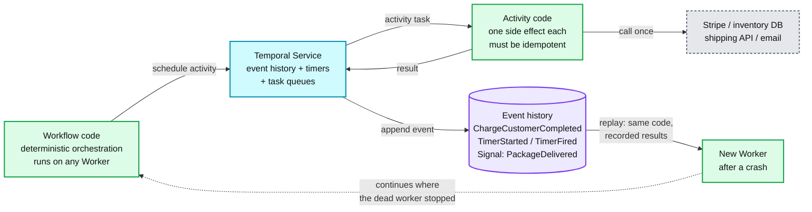

- **Durable execution**: the program's progress is stored outside the process running it. Kill the process and the program has not lost its place.
- **Replay** is the recovery mechanism. **Determinism** is what makes replay safe. **Timers** and **signals** are how a workflow waits for days without holding a process.
- Temporal never runs your code. Your **Workers** poll it for tasks. Temporal only stores state and hands out work.

**Why this matters at Staff level.** A Senior answer says "use Temporal for the order saga". A Staff answer says what Temporal stores per step, why the code has to be deterministic, where retries still create duplicates, what the history cap does to a million-step workflow, and what breaks first when the cluster is overloaded. Also: when the interviewer wants you to design the workflow engine itself, "use Temporal" solves the interview in one box and scores zero.

---

## 2. The problem: one function, five days, one crash

The article starts from the e-commerce order flow everyone wishes they could write as straight-line code.

```
function processOrder(order):
    chargeCustomer(order)        // Stripe
    reserveInventory(order)      // our DB
    requestShipment(order)       // carrier API
    while not isDelivered(order):
        sleep(5 days)
    sendReviewEmail(order)
```

Two things make this impossible as plain code.

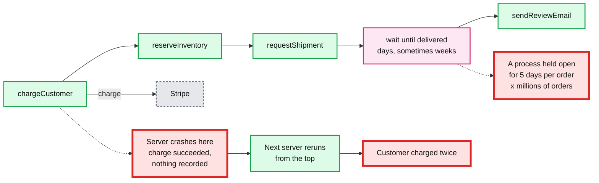

- **Partial failure.** Stripe charged the card, the server died before writing that down. The replacement server cannot tell "not charged" from "charged, not recorded".
- **Long waits.** Nobody keeps a process alive for five days. You end up persisting "which step am I on" and building a scheduler to resume. That is a hand-rolled workflow engine, and it is what Temporal replaces.

---

## 3. Build it yourself in four steps

The fastest way to understand Temporal is to build the minimum framework that fixes section 2, one problem at a time. Each step adds one Temporal concept.

### 3.1 Record every result, replay after a crash

Route every external call through the framework. When the call finishes, write `<step>Completed {result}` to durable storage before doing anything else. After a crash, run the function again from the top. Each call first checks history: recorded result exists, return it without calling out. No record, run it for real and record it.

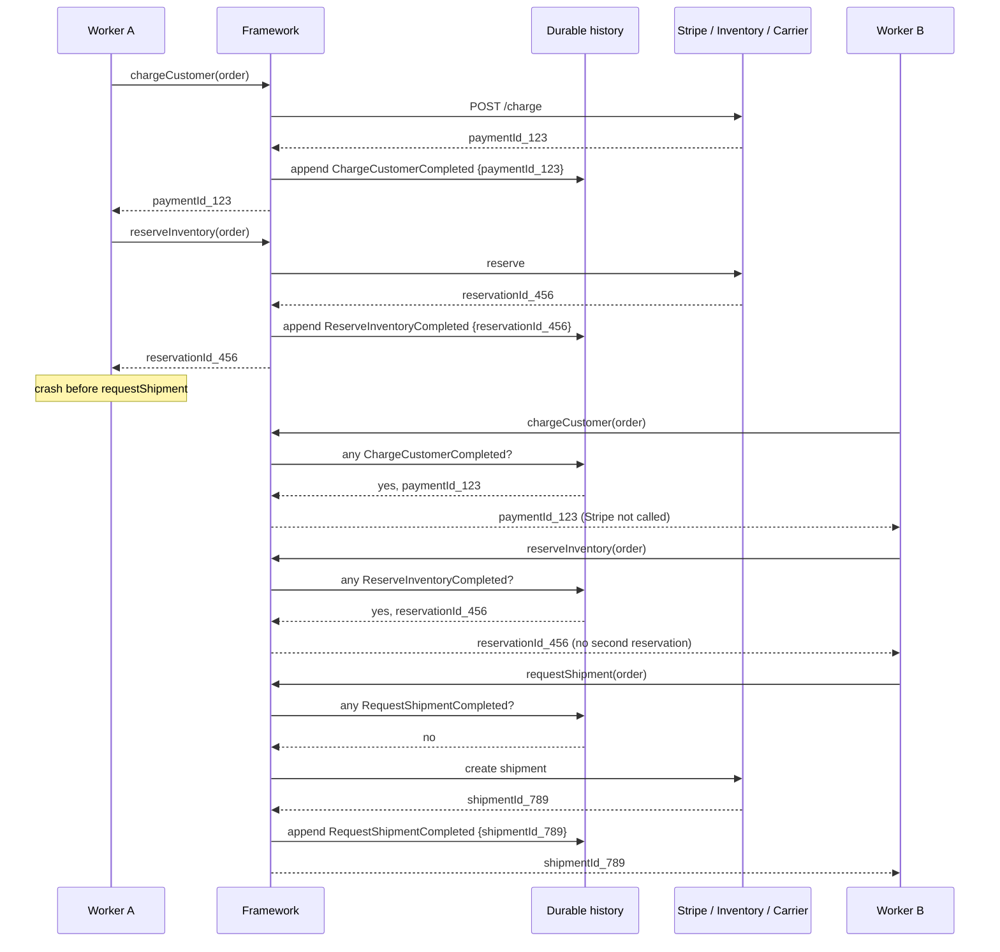

This is **replay**. Worker B never needed Worker A's memory. It rebuilt the same state by re-executing the same code against the same history.

The gap that never closes: if Stripe succeeds and the server dies **before** `ChargeCustomerCompleted` is written, the framework has no record and will retry the charge. So the framework gives you exactly-once *orchestration*, not exactly-once *side effects*. Activities still carry an idempotency key, see [exactly-once.md](exactly-once.md).

Two kinds of code fall out of this:

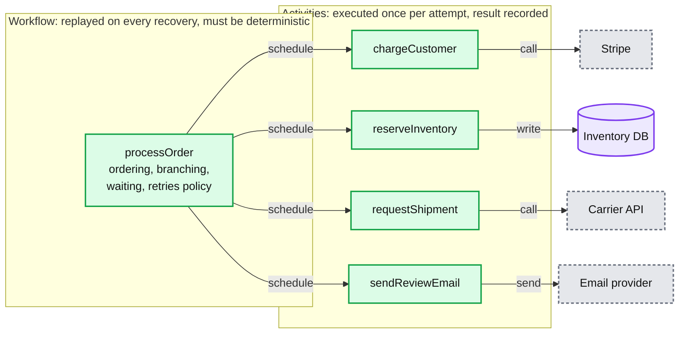

| Temporal term | What it is | Runs where |
|---|---|---|
| **Workflow** | The replayable orchestration function | Any Workflow Worker, many times |
| **Activity** | One external operation whose result gets recorded | An Activity Worker, once per attempt |
| **Event history** | Append-only log of everything that happened to one workflow execution | Temporal's persistence store |

### 3.2 Make replay predictable: determinism

Replay only works if the function takes the **same path** on every run given the same history. Add "same-day pickup if before 5 PM" and it breaks.

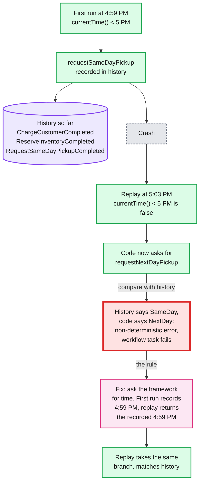

Rules for workflow code, all consequences of "replay must match history":

- No wall clock, no random, no UUIDs, no environment reads. Use the SDK's `workflow.now()`, `workflow.random()`, side-effect helpers. They record the value the first time and return the recorded value on replay.
- No network calls, no DB reads, no file IO. Anything whose answer can change goes in an activity.
- No native threads or unmanaged goroutines. Iteration order over maps must be stable (Go maps are the classic bug).
- **Changing deployed workflow code while executions are in flight is the same bug.** A running order started on version 1 replays on version 2 and diverges. Temporal ships versioning / patching APIs (`workflow.GetVersion`, `patched()`) to branch old executions onto old logic. Staff answer: this is the operational cost of Temporal, and it needs a deploy checklist.

### 3.3 Let the workflow wait: durable timers

`sleep(5 days)` must not hold a worker. When the workflow reaches it, the framework writes `TimerStarted {fireAt}` and **stops running the workflow**. A background timer processor scans timers ordered by deadline. When one is due it appends `TimerFired` and schedules the workflow to run again. Replay reaches `sleep`, sees both events, and continues.

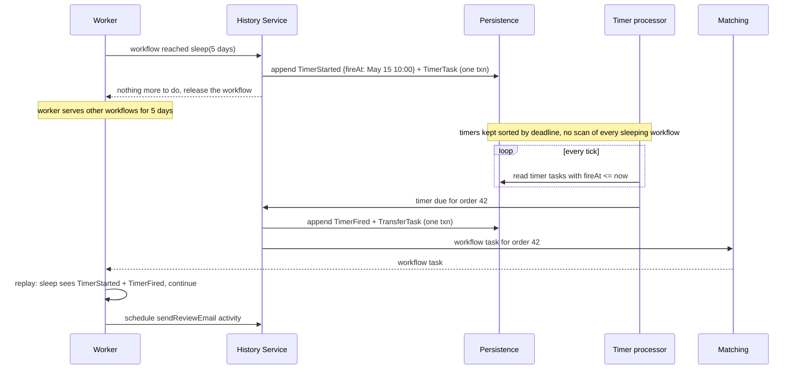

- The timer processor is shared by every workflow on that history shard. A million sleeping orders cost a million rows, zero processes.
- If the History node dies, another takes over its shards and reloads pending timers from storage. An outage **delays** a timer, it never loses one.
- This is the mechanism behind Uber's "offer the ride to this driver, wait 10 s, move on" and the flash-sale "release the reservation after 10 minutes".

### 3.4 Let the outside world wake it: signals

Delivery does not take exactly five days. The workflow should wait **until the carrier says delivered**. Temporal calls that input a **Signal**: an external system sends a named message to a running workflow. Temporal appends it to history and schedules the workflow to run. Replay reaches `waitUntilDelivered`, finds the signal event, and continues.

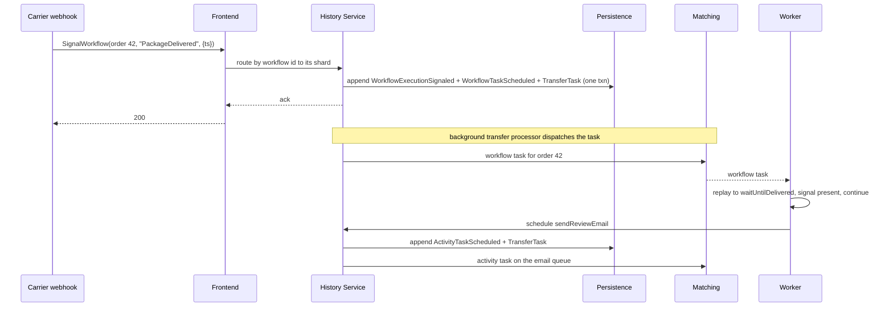

- Signals are durable and ordered per workflow. They are delivered at-least-once from the sender's view (the webhook may retry), so a signal handler should tolerate the same signal twice.
- The mirror of a signal is a **Query**: read workflow state without changing history (a read-only replay on a worker). Beyond the article, but the interviewer's next question is always "how do I see where the order is".

What we built, one problem at a time, is Temporal's programming model. The order flow is back to straight-line code:

```
workflow processOrder(order):
    chargeCustomer(order)
    reserveInventory(order)
    requestShipment(order)
    waitUntilDelivered(order)      // signal
    sendReviewEmail(order)
```

---

## 4. Lifecycle of one workflow execution

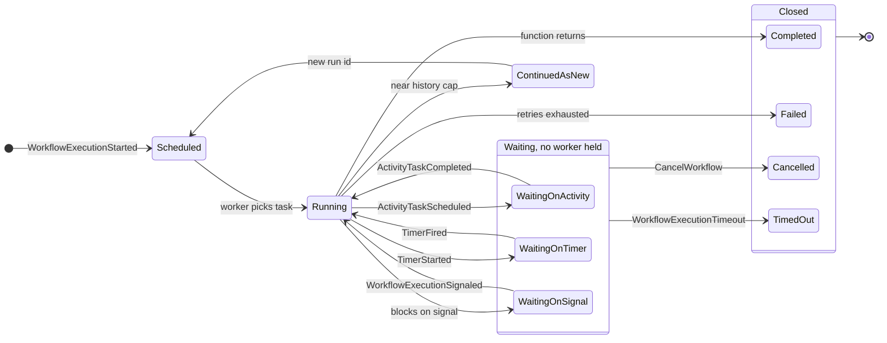

- The three "Waiting" states hold **no worker**. Only `Running` (a workflow task, under 1 s of code) and activity attempts consume compute.
- A failed activity attempt stays in `WaitingOnActivity` and retries per policy (1 s, x2, cap 100 s, unlimited by default). Cancellation runs your compensations (refund, release reservation) as ordinary activities before the workflow closes.
- Each sequential activity costs about 6 history events (ActivityTaskScheduled / Started / Completed plus WorkflowTaskScheduled / Started / Completed). With the 51,200-event cap that is roughly 8,500 sequential steps before you must **Continue-As-New**: end this run, start a new one with the carry-over state as input and an empty history.

---

## 5. Under the hood: the cluster

The interviewer will rarely ask, but the layout explains every scaling and failure answer that follows.

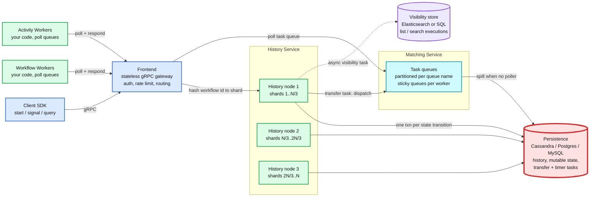

| Component | Owns | Scales by |
|---|---|---|
| **Frontend** | Nothing. Validates, rate-limits, routes to the History shard or Matching partition | Add instances behind a load balancer |
| **History Service** | Workflow state. A fixed number of **history shards**, `hash(workflow id) mod N`; each node owns a subset, ownership moves on failure | Add nodes, up to the shard count. **Shard count is fixed at cluster creation** |
| **Matching Service** | Task queues (the queue is Temporal's own, backed by the persistence store, not Kafka) | Partition hot queues across instances |
| **Workers** | Your workflow and activity code. Temporal never executes user code | Add workers to the queue that has a backlog |
| **Persistence** | Everything durable. Every state transition is one transaction here | Vertical, or Cassandra horizontally. This is where the ceiling is |

Red node: persistence. The article's own sentence: "If workflow state updates become the bottleneck, adding application Workers won't fix that; we'd need more capacity in History or its database." Every activity completion, timer, and signal is at least one write transaction, so the cluster's throughput is measured in **state transitions per second**, not workflows.

---

## 6. One state transition is one transaction (Temporal's built-in outbox)

When `chargeCustomer` completes, History must do three things that must not be separated by a crash: append the event, update the current-state summary, and make sure the workflow runs next. It commits all three in **one transaction**, then a background processor dispatches the work.

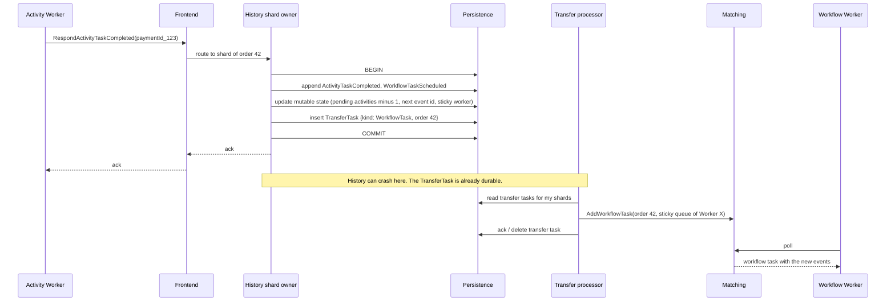

Three things are stored per workflow:

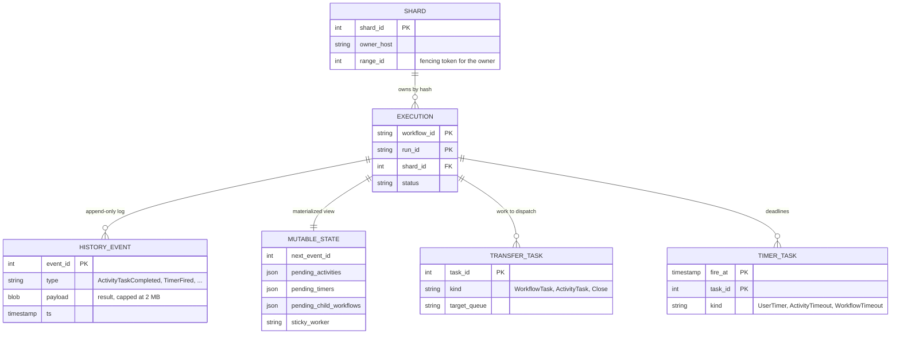

- **Event history** is the durable truth and the input to replay.
- **Mutable state** is a cache of "what is happening right now" (pending activities, open timers, child workflows). It could be rebuilt by scanning history; keeping it materialized makes every transition O(1) instead of O(history).
- **Transfer task** is the outbox row. The processor reads it after commit and hands it to Matching. Same pattern as the transactional outbox in [exactly-once.md](exactly-once.md) section 3, just internal.
- **Timer task** is the same idea keyed by deadline. The shard's `range_id` is a fencing token: a node that lost the shard cannot commit stale writes, see [leases-fencing-clocks.md](leases-fencing-clocks.md).

---

## 7. Not replaying everything: sticky execution and the workflow cache

Replaying a 20,000-event history on every activity completion would be absurd. So the worker that last ran the workflow keeps the rebuilt state **in memory**, and History routes the next workflow task back to that worker through a worker-specific **sticky queue**.

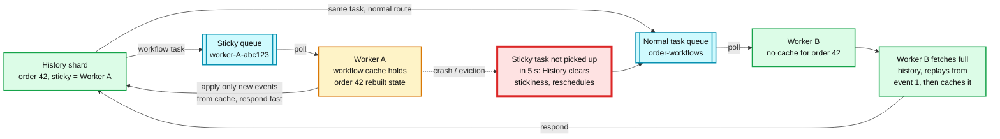

- Each worker polls **two** queues: the shared one and its own sticky one.
- On a sticky hit, the server sends only the events after the cached point. The worker applies them and responds. Cost is O(new events).
- The cache is amber for a reason: it is losable. Correctness comes from history, performance comes from the cache. Worker crash, cache eviction (LRU by cached-workflow count), or a deploy just means one full replay per workflow on the new worker.
- Sticky schedule-to-start timeout default: **5 s** (Go SDK). That is the worst-case added latency when a sticky worker vanishes.

---

## 8. Task queues route work to fleets

The workflow names a **task queue** for each activity. Workers are configured to poll queue names. Matching connects them and knows nothing about what the code does.

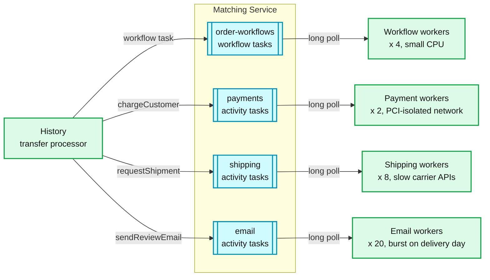

- **Workflow task**: "run the workflow code and tell me what to do next". **Activity task**: "do this one thing". They can run on different machines, or the same process if you do not care.
- Long poll: when a worker is already waiting, Matching hands the task straight through (sync match). Otherwise the task is written to the persistence store until someone polls.
- A hot queue is **partitioned** across Matching instances so one queue name is not one machine.
- GPU work, CPU-heavy transcoding, and PCI-scoped payment calls each get their own queue and fleet. This is the YouTube pipeline answer: split, transcode segments in parallel on a GPU queue, join.

---

## 9. Scaling: which knob fixes which symptom

The point of the architecture: Worker compute scales with **work ready to run**, not with **workflows open**. A million orders waiting for delivery are a million rows and zero workers.

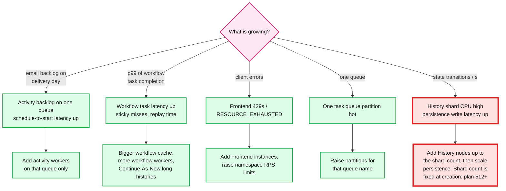

- Capacity planning unit: **state transitions per second** (every activity scheduled or completed, every timer, every signal is 1 to 2). Worker count follows queue depth; History and DB capacity follow transitions.
- Shard count is the irreversible choice: docker dev config ships 4, the Helm chart ships 512, the docs say clusters have run with 1 to 128k. Too few caps History parallelism forever, too many adds per-shard overhead on every node. Changing it means a new cluster and a migration.

---

## 10. Failure modes and blast radius

| Failure | What Temporal does | What you still own |
|---|---|---|
| Activity worker dies mid-call | Attempt times out (start-to-close, or missed heartbeat for long activities), retried per policy on another worker. At-least-once | Idempotency key on every external call. Heartbeat from a separate thread for anything longer than the timeout |
| Workflow worker dies | Sticky task times out in 5 s, task goes to the normal queue, another worker replays | Nothing, unless the history is huge (replay time) |
| History node dies | Its shards move to other nodes, pending timers and transfer tasks reload from storage. Timers delayed, not lost | Alert on shard reassignment time and timer lag |
| Matching node dies | Tasks are already durable in persistence; pollers reconnect via Frontend | Nothing |
| Persistence store down | The whole cluster stalls. No transitions commit, workers get errors on respond, timers do not fire | This is the red node. Run the DB with the same HA bar as the workflows it protects |
| Workflow code deployed with a changed path | Replay diverges from history: non-deterministic error, workflow task fails and retries forever until fixed | Versioning / patching API, replay tests in CI against sampled production histories, worker versioning for hard cuts |
| History passes 10,240 events / 10 MB | Warning. At 51,200 events / 50 MB the execution is terminated | Continue-As-New before the cap: loops, polling, and long-lived entity workflows must budget events |
| Activity fails forever (poison) | Default retry: 1 s initial, x2 backoff, cap 100 s, **unlimited attempts** | Set `MaximumAttempts` or non-retryable error types, or the workflow waits forever |
| Workflow task takes too long | Go SDK deadlock detector fails the task after 1 s of workflow code | Do nothing slow in workflow code. Slow means activity |
| Signal sent twice (webhook retry) | Both appended, both delivered to the handler | Handler must tolerate duplicates |
| Payload over 2 MB | Rejected (blob limit, warning at 256 KB) | Pass references (S3 keys), not data |

---

## 11. When to use it, when not to

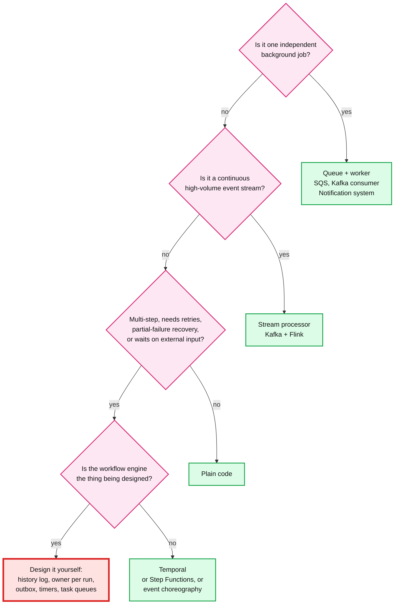

**Use it when**

- Several dependent steps must happen reliably (YouTube: split, transcode in parallel, join).
- The process waits on the world (Uber: offer ride, wait 10 s for the driver, move to the next).
- You must resume from partial execution (a worker died halfway through the DAG).
- You notice you are building a state machine table plus a scheduler plus a retry loop. That is the tell.

**Do not use it when**

- One independent job: a queue is simpler and the retry machinery is the interesting part of the design (the notification-system breakdown deliberately uses a queue).
- High-volume streaming: Temporal is a coordinator, not Kafka. One event per history row does not survive 100k events/s.
- The interviewer wants the engine. Then section 3 to 6 of this note **is** your design: event log per run, one owner per run, transactional outbox for dispatch, timer table by deadline, named task queues. That is exactly `hld/distributed-job-scheduler/`.

---

## 12. Trade-offs

| Gain | Cost |
|---|---|
| Orchestration reads as straight-line code, recovery is free | Workflow code lives under determinism rules. Map iteration, time, random, threads, and deploys all become foot-guns |
| Millions of open workflows cost rows, not processes | Every transition is a DB transaction. Throughput ceiling is the persistence store, and shard count is set once |
| Exactly-once orchestration (a completed step never re-runs) | Still at-least-once side effects. Idempotency keys do not go away |
| Timers and signals for free, durable across outages | Timer precision is "eventually after fireAt", not real-time. Do not build a trading engine on it |
| Retries, backoff, heartbeats, timeouts built in | Unlimited retries by default. A poison activity waits forever unless you cap it |
| Full history per execution for debugging | 51,200 events / 50 MB cap. Long-lived entities must Continue-As-New, which complicates queries and signals in flight |
| Independent scaling of Frontend, History, Matching, Workers | An extra distributed system to run: 4 services plus Cassandra or SQL plus optional Elasticsearch. Or pay Temporal Cloud |

---

## 13. Numbers worth memorizing

- History limits: warn at **10,240 events / 10 MB**, terminate at **51,200 events / 50 MB** per execution. Payload blob: warn 256 KB, error **2 MB**. gRPC message cap **4 MB**.
- About **6 events per sequential activity**, so roughly **8,500 steps** per run before Continue-As-New. A polling loop that checks every minute burns its budget in under 6 days.
- Pending per type per workflow: **2,000** (activities, timers, child workflows, signals awaiting handling).
- Workflow task timeout default **10 s**, max **120 s**. Go SDK deadlock detector: **1 s** of workflow code.
- Sticky schedule-to-start timeout: **5 s** (worst-case extra latency after a workflow worker dies).
- Default activity retry: **1 s** initial, **x2** backoff, **100 s** max interval, **unlimited** attempts.
- History shards: docker dev **4**, Helm default **512**, seen in production from 1 to 128k. Immutable after creation.
- Persistence options for self-hosting: Cassandra, PostgreSQL, MySQL. Visibility: same SQL or Elasticsearch.
- Capacity unit: state transitions per second, not workflows. Each activity round trip is 2 transitions (scheduled, completed) plus a workflow task.

---

## 14. Interview soundbite

> "Temporal gives me durable execution: I write the order flow as straight-line code, but every external call is an activity whose result is appended to a per-workflow event history in one transaction with an outbox-style task, and waits are timers and signals stored the same way. If the worker dies, any other worker replays the code against the history, so completed steps return their recorded result instead of running again. The two costs are that workflow code must be deterministic, which makes deploys a versioning problem, and that activities are still at-least-once, so Stripe still gets an idempotency key. Under load the bottleneck is state transitions per second on the persistence store, not workers, and the history shard count is fixed on day one. If you would rather I design the engine itself, it is a history log per run, one owner per run, a transfer-task outbox, a timer table sorted by deadline, and named task queues."

Follow-ups an interviewer will ask, in order of likelihood:

1. What if Stripe succeeds and the worker dies before the result is recorded? (Section 3.1, retried, so idempotency key.)
2. Why must workflow code be deterministic, and what happens on a code deploy? (Section 3.2, replay diverges, versioning API.)
3. How does a five-day wait not hold a worker? (Section 3.3, TimerStarted row, timer processor, TimerFired.)
4. How does the carrier webhook reach the running workflow? (Section 3.4, signal appended to history, workflow task dispatched.)
5. Does it replay the whole history every time? (Section 7, sticky queue and workflow cache, 5 s fallback.)
6. What breaks first at scale? (Section 5 and 9, persistence, shard count fixed.)
7. What about a workflow that runs for a year? (Section 4 and 13, 51,200 cap, Continue-As-New.)
8. Why not just Kafka plus a state table? (Section 11, you would be building sections 3 to 6 yourself; fine if that is the question.)
9. Where does the outbox pattern show up inside Temporal? (Section 6, transfer task in the same transaction.)
10. Uber offers a ride to one driver at a time with a 10 s timeout. Sketch it. (Section 3.3 timer plus 3.4 signal, per-ride workflow, `select` on accept signal vs timer.)

Related: [exactly-once.md](exactly-once.md) (idempotency keys and the outbox this is built on), [distributed-transactions.md](distributed-transactions.md) (sagas, which a Temporal workflow is one way to run), [leases-fencing-clocks.md](leases-fencing-clocks.md) (shard ownership and the range id), [sharding.md](sharding.md) (fixed shard count vs consistent hashing), [stream-processing.md](stream-processing.md) (what to use instead for high-volume streams), `hld/distributed-job-scheduler/` (the same design built from parts, with the Temporal limits as sizing inputs), `hld/payments-ledger/` (attempt IDs for the non-idempotent rail that Temporal cannot fix).
