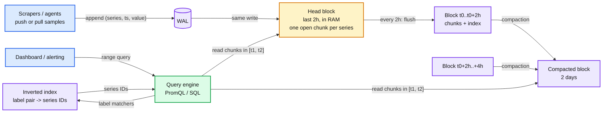
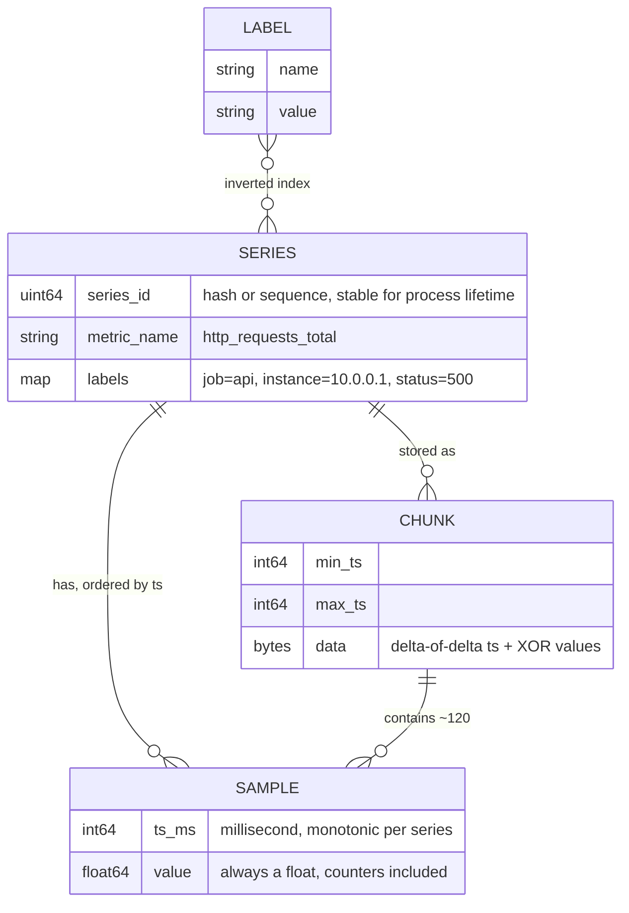
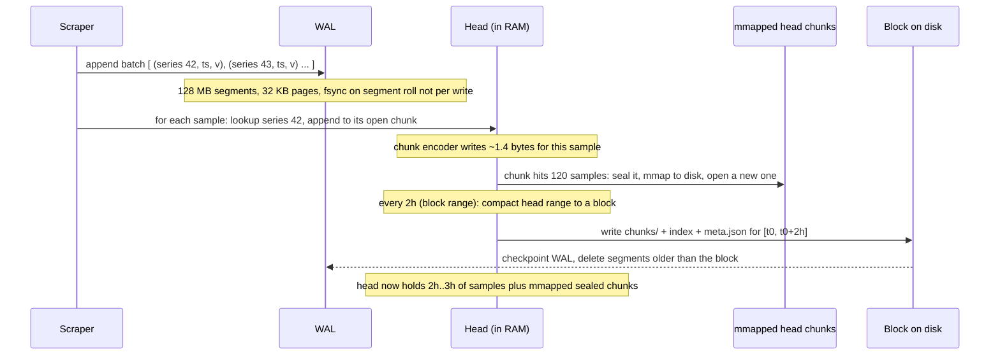
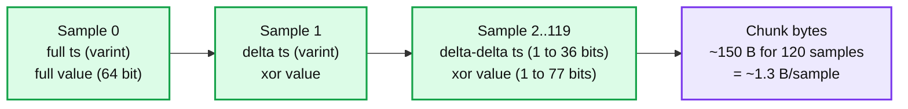
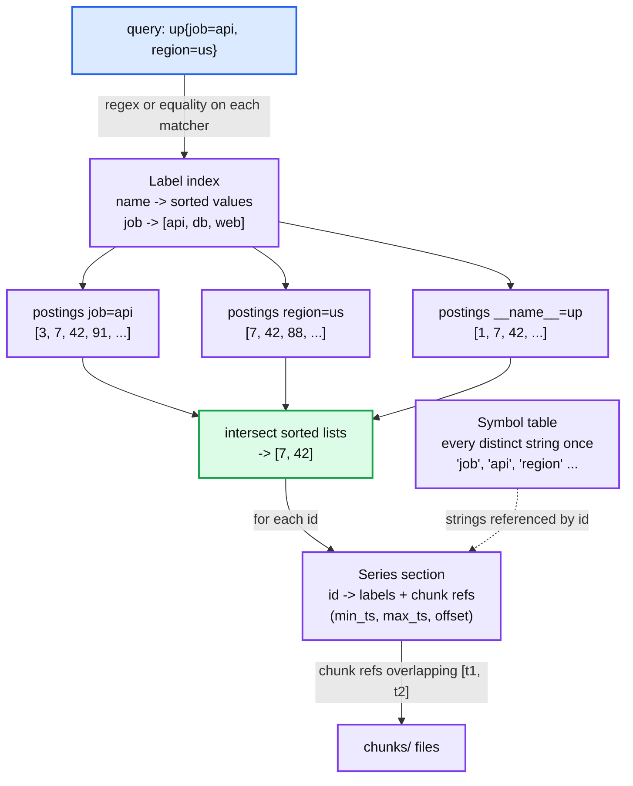
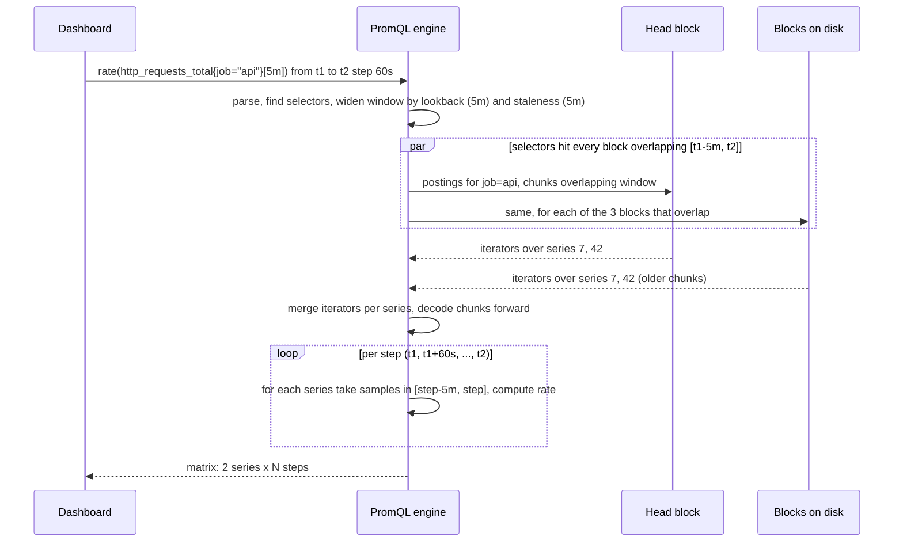
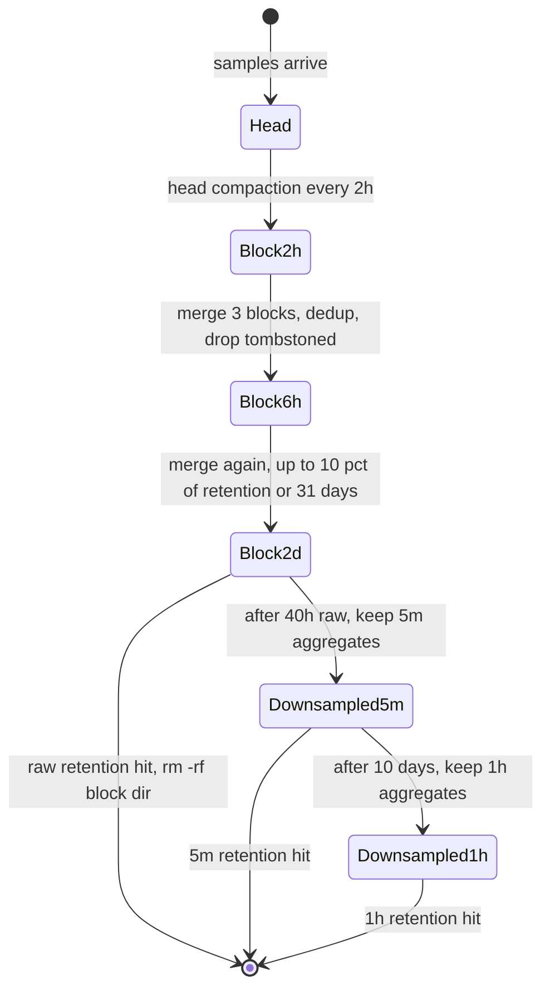
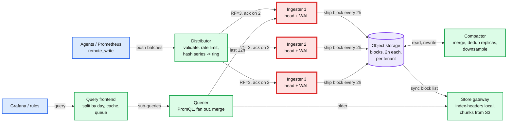
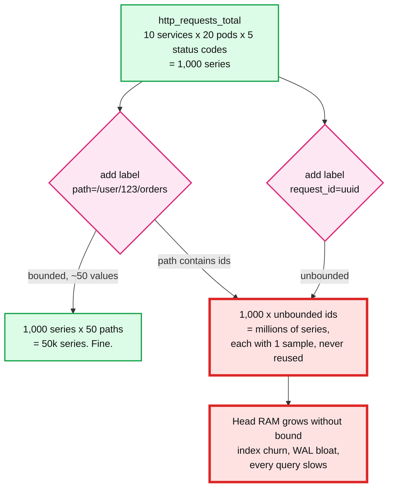
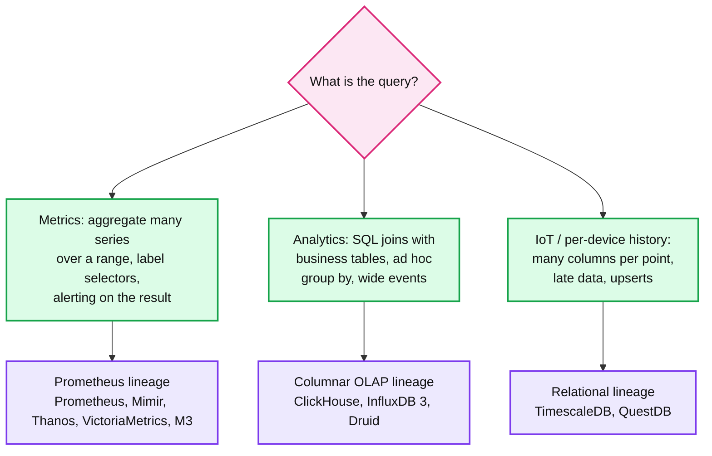

# Concept: Time Series Database (TSDB)

> One-liner: a TSDB is a storage engine specialised for one workload: millions of append-only (timestamp, value) samples per second, grouped into series by a label set, queried as "this range of time, aggregated over these labels". It wins over a general database by storing each series as its own compressed column of time, indexing labels with an inverted index, and deleting old data by dropping whole time blocks instead of rows.

Depth target: high-level, same as [lsm-tree.md](lsm-tree.md). Reference implementation for the internals is the Prometheus TSDB (which borrows from Facebook's Gorilla paper), and the distributed layer is Cortex / Mimir / Thanos, because that is the stack the "design a monitoring system" question is really asking about.

---

## 1. Mental model

The workload is the whole reason a TSDB exists. Get this table into your head and every design choice below follows from it.

| Property of metrics data | Consequence for the engine |
|---|---|
| **Writes are append-only and time-ordered.** New samples arrive for "now". Updates to old samples are rare or forbidden. | Storage can be an append log per series. No in-place update path needed. |
| **Write volume dwarfs read volume.** 10k hosts x 1k metrics x every 15 s = ~700k samples/s. A dashboard reads a few hundred series. | Optimise the write path first. Reads can afford some work per query. |
| **Reads are range scans over time, then aggregate.** "CPU of every host in region X for the last 6 hours, averaged per minute." Nobody asks for one sample. | Store samples contiguously by series and time so a range read is one sequential scan. Column per series, not row per sample. |
| **Consecutive samples look alike.** Timestamps come every 15 s. Values change slowly or not at all. | Delta and XOR encoding gets ~12x compression. This is the single biggest win. |
| **Data gets less valuable as it ages.** Raw resolution for 2 weeks, 5 minute rollups for a year, then gone. | Partition by time. Retention is "drop the oldest block", an O(1) file delete. Downsample old blocks. |
| **Queries select series by label, not by ID.** `http_requests_total{job="api", status=~"5.."}` | Need an inverted index from label pair to the set of series that carry it. |
| **The number of distinct series is the real scaling dimension.** Not samples/s. | Cardinality is the thing that breaks a TSDB. Section 9. |



- It is an LSM tree with the key fixed to `(series, time)`. Same WAL, same in-memory buffer, same immutable files, same compaction. The differences are what gets specialised: the memtable is a map of series to chunks, the files are time partitioned, and the "compaction" also does downsampling.
- Storage is **series-major**. All samples for series 42 sit together, sorted by time. A row store (one row per sample with a B-tree on `(series, ts)`) can do the same job at 10x the bytes and 10x the write IO, which is why "just use Postgres" stops working somewhere around 100k samples/s per node.

**Why TSDBs exist.** RRDtool (1999) did fixed-size circular files per metric. Graphite (2008) did the same with Whisper, one file per series, and died by file descriptor count and random IO once series went past ~1M. OpenTSDB (2010) put metrics into HBase with a clever row key and inherited every HBase problem. Facebook's **Gorilla** paper (VLDB 2015) showed the compression trick that made in-memory TSDB feasible: 16 bytes/sample down to ~1.37. InfluxDB (2013), Prometheus TSDB v3 (2017), and TimescaleDB (2017) are the three modern design lineages, section 11.

---

## 2. Data model: series, samples, labels



The vocabulary, because interviewers use it loosely:

| Term | Meaning | Example |
|---|---|---|
| **Metric** | A name for a kind of measurement. | `http_requests_total` |
| **Label** (tag, dimension) | A key=value pair that qualifies the metric. | `status="500"` |
| **Series** | One metric name + one full label set. **This is the unit of storage.** | `http_requests_total{job="api", instance="10.0.0.1", status="500"}` |
| **Sample** (point) | One `(timestamp, value)` on a series. | `(1726480000000, 1523.0)` |
| **Cardinality** | The count of distinct series. Active cardinality = series that got a sample recently. | 5M active series is "big single node". |
| **Chunk** | A compressed run of consecutive samples from one series, the on-disk unit. | 120 samples, ~150 bytes |
| **Block** | A directory holding all chunks and an index for one time range. | `01HX.../{chunks/, index, meta.json}` for 2 hours |

Two design choices worth defending:

- **Every value is a float64.** No ints, strings, or bools. One type means one compression codec and no schema. Counters are floats that only go up. Log lines are a different product (Loki, Elasticsearch), and mixing them in is how you get a slow TSDB and a bad log store.
- **The series ID is not the label set, it is a small integer assigned at first sight.** Chunks reference the integer. Labels are stored once in the index. This is what makes a 100 byte label set cost nothing per sample.

---

## 3. The write path

Same shape as an LSM write: WAL for durability, memory for speed, flush later. The twist is that the memtable is not a sorted map of keys, it is a map of `series_id -> open chunk`, and each chunk is a tiny append-only compressor.



What each piece is for:

| Piece | Prometheus default | Why it exists |
|---|---|---|
| **WAL** | 128 MB segments, records are `series` (new label sets) and `samples` (batches of `series_id, ts, v`) | Head is RAM. Replay on restart rebuilds it. Series records come first so replay can resolve IDs. |
| **Head** | Most recent block range, 2h, plus up to 1h of slack before compaction | The hot write target. Also serves all "last 2 hours" queries, which is most of them. |
| **Open chunk per series** | 120 samples, or the block range, whichever first | The compressor state lives here. 120 x 15 s = 30 min per chunk, ~150 bytes. |
| **mmapped head chunks** | Sealed chunks written to `chunks_head/` and mmapped | Removes sealed chunks from Go heap. Cut head memory ~40% (Prometheus 2.19). |
| **Block** | Directory per 2h, immutable | Same role as an SST. Its index is self-contained, so a block is a unit of shipping to object storage (section 8). |
| **Checkpoint** | WAL segments older than the block, rewritten to keep only live series and samples | Bounds WAL size and restart time. |

A **new series** is the expensive write. It allocates a `memSeries` struct, inserts into the head's label index, and writes a `series` WAL record. Roughly 1 to 3 KB of RAM and several index ops. A **new sample on an existing series** is a map lookup and a ~1.4 byte append. This 1000x cost asymmetry is why cardinality churn (section 9) is a bigger threat than sample rate.

---

## 4. Compression: the Gorilla trick

This is the section to be able to draw on a whiteboard. It is why a modern TSDB stores a sample in ~1.4 bytes instead of 16.

**Timestamps: delta of delta.** Samples arrive on a schedule. The delta between consecutive timestamps is nearly constant, so the delta of the deltas is nearly always zero.

```
raw ts:      1000   1015   1030   1045   1061   1075
delta:              15     15     15     16     14
delta-delta:               0      0      1     -2
bits:                      1      1      9      9
```

Encoding, per sample: `0` if delta-delta is 0 (1 bit). Otherwise a prefix and a small signed integer: `10` + 7 bits, `110` + 9 bits, `1110` + 12 bits, `1111` + 32 bits. Gorilla measured **96% of timestamps as a single bit** on Facebook's production data.

**Values: XOR with the previous value.** Consecutive floats share sign, exponent, and most mantissa bits. XOR them and you get a 64 bit word that is mostly zeros, with a short run of meaningful bits in the middle.

```
prev:  0x4048_0000_0000_0000   (48.0)
curr:  0x4048_4000_0000_0000   (48.5)
xor:   0x0000_4000_0000_0000   leading zeros 17, meaningful bits 1, trailing zeros 46
```

Encoding, per sample: `0` if xor is 0 (value unchanged, 1 bit). Otherwise `1`, then either `0` + the meaningful bits if they fit inside the previous sample's leading/trailing window, or `1` + 5 bits leading count + 6 bits length + the bits. Gorilla measured **59% of values as a single bit**, and a further 28% inside the previous window (~27 bits).



Properties and costs:

- **Average 1.37 bytes/sample** in the Gorilla paper, from 16. Prometheus reports 1 to 2 bytes/sample in production. A 1M series install at 15 s scrape is ~67k samples/s, ~100 KB/s, **~8 GB/day** of raw data. Without this, 100 GB/day.
- **Chunks are decode-only-forward.** To read sample 100 you decode samples 0 to 99. That is why chunks are capped at 120 samples and why every chunk carries its own `min_ts, max_ts` so the query can skip chunks entirely.
- **Chunks close at 120 samples not at a byte size** so that the 2h block boundary and the decode cost are both predictable.
- Integers, counters, and booleans compress even better as XOR floats than as varints because of the "unchanged = 1 bit" path. Random noise (high-entropy gauges, sub-millisecond jittered timestamps) compresses badly, ~10 bytes/sample. If your timestamps are wall clock at the source with jitter, you lose the 96% single-bit case. Prometheus scrape timestamps are server side and aligned for exactly this reason.
- Later engines add a **columnar** variant: TimescaleDB, InfluxDB 3 and ClickHouse store batches of 1000+ values per column with delta + Gorilla + general purpose (zstd, LZ4) on top. Similar ratio, better vectorised decode, worse for "append one sample".

---

## 5. Indexing: the inverted index over labels

A query does not know series IDs. It knows `{job="api", status=~"5.."}`. The index turns label matchers into a sorted list of series IDs (a **posting list**), the same structure Lucene uses for full-text search.



Sections of a Prometheus block index file, in order:

| Section | Contents | Why |
|---|---|---|
| **Symbol table** | Every distinct label name and value string, sorted, once. | A label set is then a list of small ints. Dedups `instance="10.0.0.1"` across 1000 series. |
| **Series** | For each series ID in label-sorted order: its labels (as symbol refs) and a list of chunk refs `(min_ts, max_ts, file offset)`. | The one place that maps id to where the bytes are. |
| **Label index** | For each label name, the sorted list of its values. | Powers regex matchers: `status=~"5.."` scans values of `status`, not all series. Also powers autocomplete in Grafana. |
| **Postings** | For each `(name, value)` pair, the sorted list of series IDs that carry it. Plus one "all series" posting. | The set operations. Sorted so intersection is a merge, O(n+m). |
| **TOC** | Offsets of the sections above. | Random access into the file via mmap. |

Query planning, in words: resolve each matcher to posting lists, intersect the equality matchers (small lists first), subtract negative matchers, expand regex matchers to a union of postings. Head block keeps the same structure in memory as Go maps. Once you have IDs, the series section gives chunk refs, and you only touch chunks overlapping the query window.

The index is **per block**. A query over 30 days touches ~15 block indexes after compaction. That is why compaction merges blocks (fewer indexes to consult) and why Thanos / Mimir build an **index-header** (symbols + postings offsets only) that they keep local while the full index stays in S3.

---

## 6. The read path



Things that surprise people:

- **Every query is evaluated step by step.** A 6h range at 15 s step is 1440 evaluations, each looking back over a window. The engine walks each series' samples once with a moving window, not 1440 scans, but the cost is still `series x samples`, not `series`. This is why "sum over 10k series for 30 days at 15 s step" is 170M samples decoded, ~2 to 5 s.
- **Staleness.** If a series stops (pod died), when does its last value stop being "current"? Prometheus writes a special NaN **staleness marker** when a target disappears and otherwise uses a 5 minute lookback. Without this, a dead host shows its last CPU value forever.
- **Counter resets.** `rate()` must detect the counter dropping (process restart) and treat it as a reset, not a negative rate. That means the engine needs raw samples, which is why downsampling counters is not "average them" (section 7).
- **Query limits are load shedding, not correctness.** Max series per query, max samples, max query length, and a query-time timeout. Every production TSDB has them because one `{__name__=~".+"}` from a dashboard can OOM the node.

---

## 7. Retention, compaction, downsampling: data ages out



**Retention is a directory delete.** Because data is partitioned by time and a block is self-contained, "delete everything older than 15 days" is `rm -rf` on the block directories whose `max_ts` is past the line. No tombstones, no compaction to reclaim, no row-by-row delete. This is the strongest argument for time partitioning and the thing a B-tree on `(series, ts)` can never match: deleting 1B rows from Postgres is a multi-hour vacuum, dropping a partition is instant.

**Compaction** merges consecutive blocks into bigger ones: 2h x 3 = 6h, 6h x 3 = 18h, then up to a cap. Why bother, if blocks are immutable and self-contained?

- Fewer indexes to open per query (section 5).
- A series' chunks across 3 blocks become contiguous, so a range read is more sequential.
- Explicit deletes (tombstones, rare in a TSDB) get physically removed.
- In the distributed setup, compaction also **dedups replicas** (3 ingesters wrote the same samples, keep one copy) and is called vertical compaction. It cuts object storage 3x.

**Downsampling** is the TSDB-specific step: replace raw 15 s samples with one aggregate per 5 minutes, then one per hour. Two rules that separate a working design from a broken one:

1. **Keep several aggregates, not one.** Thanos stores `count, sum, min, max, counter` per window. `avg` is `sum/count`, `max_over_time` works, and `rate()` on the counter aggregate still handles resets. Storing only `avg` breaks `max` and `rate` forever.
2. **Downsampling does not save much space.** 5 min from 15 s is 20x fewer points but 5 aggregates per point, so ~4x. The real win is **query speed over long ranges**: a 1 year graph reads 8760 points per series instead of 2.1M.

---

## 8. Scaling out: the distributed TSDB

A single Prometheus node comfortably does ~1M active series and a few hundred k samples/s, and has no replication. Past that, or when you want durability beyond one disk, you add three things: a **write ring** to shard by series, **object storage** for blocks, and a **query fan-out** layer. This is the architecture of Cortex, Grafana Mimir, and Thanos Receive, and it is the answer to problem #26 in the [HLD index](../hld/README.md).



How the pieces divide the work:

| Component | State | Job | Scales by |
|---|---|---|---|
| **Distributor** | none | Validate labels, enforce per-tenant limits, hash `(tenant, labels)` onto a consistent hash ring, send to 3 ingesters, ack when 2 respond. | CPU. Add pods. |
| **Ingester** | **hot**: head block + WAL on local disk | Exactly section 3, per tenant. Every 2h, cut a block and upload to S3. Serves queries for the last ~12h. | Active series. ~1 to 2 KB RAM per series, so 10M series per 16 GB ingester is a common target. |
| **Object storage** | durable, all blocks | Source of truth for anything older than the ingester window. Cheap: $0.02 per GB month. | Free. |
| **Compactor** | none | Per tenant: merge the 3 replica blocks into 1 (dedup), merge 2h into 12h into 24h, downsample, apply retention. One tenant at a time, sharded by tenant. | Tenants. |
| **Store gateway** | warm: index-headers on local disk, chunk cache | Serve block queries. Sharded by block via a ring, RF=3 for availability. | Total block count and index size. |
| **Querier** | none | Run PromQL. Pull recent data from ingesters, old data from store gateways, merge, dedup replicas by `(ts)` per series. | Query concurrency. |
| **Query frontend** | results cache | Split one 30 day query into 30 one-day sub-queries (parallel, cacheable), align steps so cache hits, queue per tenant for fairness. | Query concurrency. |

Things the interviewer will probe:

- **Why series-hash sharding and not time sharding?** Time sharding sends every write to one node (the "now" node) and every long query to every node. Series hashing spreads writes evenly and lets each series' data live in one place. The cost is that every query fans out to all ingesters, which is fine because ingester count is tens, not thousands.
- **Why RF=3 with quorum 2 and not consensus?** Samples are idempotent (same `ts, value` written twice is the same). No ordering to agree on, so no Raft needed. Duplicates are removed at query time and by the compactor. Losing one ingester loses nothing. Losing two of the three that own a series loses up to 2h of that series' unshipped data, which is the accepted blast radius.
- **Ingesters are red** because they are the only stateful hot component. A rolling restart must hand off or replay WAL, scaling down must flush to S3 first, and an OOM loses in-flight samples for its share of series. Mimir's answer is zone-aware replication (3 AZs, one replica each) and WAL replay on restart.
- **Ingester window vs S3 lag.** Queriers ask ingesters for the last 12h even though blocks ship every 2h, because the compactor takes hours to merge and the store gateway syncs every 15 min. Set `query_ingesters_within` longer than the pipeline lag or you get gaps in graphs.

**Thanos vs Cortex/Mimir** is the same architecture with the write side swapped: Thanos Sidecar lets each existing Prometheus upload its own blocks (no distributor, no ingester, Prometheus is the ingester), which is simpler to adopt and worse at multi-tenancy and durability of the last 2h.

---

## 9. Cardinality: the thing that actually breaks a TSDB

Series count is the scaling dimension because every series costs memory in the head, an entry in every index, and a posting in every label it carries. Samples cost ~1.4 bytes; a series costs ~1 to 3 KB in RAM plus index churn.



Two flavours, and they need different fixes:

| Flavour | What it looks like | Why it hurts | Fix |
|---|---|---|---|
| **High cardinality** | 50M active series, stable | Head RAM. Index size. Every `sum by (service)` touches every series. | Shard (section 8). Recording rules to precompute aggregates. Drop labels nobody queries. |
| **High churn** | 1M active series but 10M new series/day (pod names, IPs, request IDs, build SHAs in labels) | Each new series is the expensive write (section 3). Index and WAL fill with dead series. Head keeps them until the next compaction. | Relabel at ingest to strip the offending label. Per-tenant series limits that reject, not queue. |

Defences every production TSDB has, in the order you deploy them:

1. **Per-tenant, per-metric series limits at the distributor.** Reject new series past the limit with a 4xx. Existing series keep working. Cheap and immediate.
2. **Relabeling / drop rules at ingest.** `request_id`, `user_id`, `pod_ip` get deleted before storage. This is where 90% of incidents end.
3. **Cardinality analysis API.** Top 10 metrics by series count, top labels by value count. Prometheus `/api/v1/status/tsdb`, Mimir cardinality endpoints. Page on rate of new series, not on total.
4. **Recording rules.** Precompute `sum by (service) (rate(http_requests_total[5m]))` every minute into a new low-cardinality series. Dashboards read that. Raw series stay for debugging.
5. **Sparse / adaptive metrics.** Newer systems (Mimir adaptive metrics, Chronosphere) auto-aggregate labels that no query has referenced in 30 days.

The interview line: **"cardinality is the number of series, not the number of samples. A label with unbounded values turns a metrics system into a log store and it will fall over. I limit series per tenant at ingest and reject, because dropping samples of an existing series is invisible and dropping new series is not."**

---

## 10. Out-of-order writes and late data

The compression in section 4 assumes samples arrive in time order per series. What happens when they do not?

- **Classic Prometheus answer: reject.** A sample older than the newest one in that series is dropped with an "out of order" error. Scrape timestamps are assigned server side so this only happens with `remote_write` from multiple sources or clock skew. Simple, and the reason the Gorilla path is so cheap.
- **Bounded out-of-order window** (Prometheus 2.39+, Mimir): a second head, the OOO head, with its own WAL (the WBL) accepts samples up to N hours late. Compaction merges OOO chunks into the regular blocks. Cost: 2x head structures for those series and a merge step at query time.
- **Backfill** of days-old data goes through a separate path: build a block offline (`promtool tsdb create-blocks-from`) and drop it into the block directory. Never through the head.
- **Columnar engines** (Timescale, InfluxDB 3, ClickHouse) accept any order because they sort on flush and merge on read. The price is a sort per batch and no 1 bit per timestamp trick until the data is sorted.

The design rule: **the tighter the ordering guarantee you accept, the cheaper every sample is**. Choose the window from the data source (IoT devices buffering offline need hours, server scrapes need zero), do not default to "accept anything".

---

## 11. The three design lineages

The question "which TSDB" is really "which storage layout". Three families, and knowing one from each lets you argue trade-offs.



| | **Prometheus family** (Prometheus, Cortex/Mimir, Thanos, VictoriaMetrics, M3DB) | **Columnar OLAP** (ClickHouse MergeTree, InfluxDB 3 IOx on Parquet, Druid) | **Relational extension** (TimescaleDB on Postgres, QuestDB) |
|---|---|---|---|
| **Storage unit** | One compressed chunk per series per 2h. Series-major. | Columnar parts sorted by `(series key, ts)`, thousands of rows per column block, LZ4/zstd on top of type codecs. | Postgres **hypertable**: table auto-partitioned into time chunks. Old chunks converted to columnar (1000 rows per compressed row, ~95% compression). |
| **Index** | Inverted index over labels, per block. | Sparse primary key index (one mark per 8192 rows) + optional skip indexes. No inverted index by default. | Regular B-tree indexes per chunk. |
| **Query language** | PromQL. Purpose-built for rates, aggregations over labels, alerting. No joins. | SQL. Joins, window functions, arbitrary group by. | Full SQL plus time bucketing (`time_bucket`), continuous aggregates. |
| **Write path** | Head + WAL, ordered per series, ~1.4 B/sample. | Batch insert, sort, write part, background merge. Wants 10k+ row batches. | Row insert into current chunk via normal Postgres path, ~100 B/row until compressed. |
| **Sweet spot** | Infrastructure and app metrics, 1M to 1B series, alerting. | Wide events (logs with 50 columns), product analytics, "group by anything". | Mixed workloads that already live in Postgres, IoT with relational joins, < 100k inserts/s per node. |
| **Falls over on** | High cardinality, joins, non-float values. | Single-row appends, point lookups by series, too many small parts ("too many parts" error). | Sustained > 200k inserts/s, huge cardinality (B-tree bloat), no native horizontal scaling. |
| **Retention** | Drop block dir. | Drop partition. | Drop chunk. All three are O(1) per partition. |

Two others worth a sentence: **Gorilla / Beringei** (Facebook) is the in-memory 26h cache in front of HBase, the paper that gave everyone the compression. **OpenTSDB** is metrics on HBase with `metric_id + hour_base_ts + tags` as the row key, a fine 2012 design that pays HBase's operational cost and cannot do label regex without scanning.

---

## 12. Failure modes and what happens

| Failure | Symptom | Blast radius | Mitigation |
|---|---|---|---|
| **Cardinality explosion** (section 9) | Head RAM climbs, OOM, restart, WAL replay takes 20 min, OOM again. | Whole node (or ingester) and every tenant on it. | Series limits that reject. Relabel drops. Alert on new-series rate. |
| **WAL replay after crash** | Node starts, serves nothing for minutes while replaying 2h of WAL. | Gaps in graphs, alerts go silent for the replay window. | Checkpoints every 2h. Snapshot on shutdown (Prometheus `--enable-feature=memory-snapshot-on-shutdown`). RF=3 so other replicas serve. |
| **Disk full** | Compaction fails, head cannot flush, writes block or drop. | Node. | Retention by size not just time. Alert at 80%. Keep 20% headroom for compaction temp files. |
| **Compactor falls behind** | Thousands of 2h blocks in S3, store gateway index sync takes hours, queries slow down 10x. | Long-range queries for that tenant. | Shard compactor by tenant. Alert on oldest uncompacted block age. |
| **Expensive query** | One `{__name__=~".+"}` over 30 days decodes billions of samples, querier OOMs. | Every query sharing that querier. | Max samples/series/duration per query. Query frontend queue per tenant. Kill on timeout. |
| **Clock skew at source** | Out-of-order rejections, or worse, samples 5 min in the future that hide the real ones. | Affected series. | Server-side timestamps on scrape. Reject samples > 10 min ahead. |
| **Ingester lost before ship** | Up to 2h of its share of series gone from one replica. | With RF=3 nothing visible. With RF=1, 2h gap for 1/N of series. | RF=3 across zones. WAL on persistent disk that survives pod reschedule. |
| **Scrape gap / silent target** | Series stops, last value sticks for 5 min, then vanishes. | One target's alerts fire late or not at all. | Staleness markers. Alert on `up == 0`, which is a separate series the scraper writes. |

---

## 13. Trade-offs

| Gain | Cost |
|---|---|
| ~1.4 bytes/sample via delta-of-delta + XOR, 10x less disk and IO than any general store | Only works on ordered, regularly spaced, float data. Out-of-order is a second code path or a rejection. Strings and ints are not welcome. |
| Series-major storage: a range read of one series is one sequential scan | A query across 100k series does 100k random-ish chunk reads. Wide "group by anything" scans are where columnar OLAP wins. |
| Time partitioned blocks: retention is a directory delete, blocks ship to S3 as-is, S3 becomes the long-term store | Every query has to open every block in range. Compaction exists to bound that, and a slow compactor silently degrades read latency. |
| Inverted label index: regex selectors over millions of series in ms | Index size and RAM scale with series count, not sample count. Cardinality becomes the capacity dimension and the operational risk. |
| No consensus, samples are idempotent, RF=3 quorum writes with dedup on read | Two lost replicas lose data. Dedup on read costs query CPU. Exactly-once is not a thing here and never needs to be. |
| PromQL: `rate`, `histogram_quantile`, `sum by`, alerting are first class | No joins with business data. Anything relational goes to a different store. |
| Downsampling with multi-aggregate keeps `rate` and `max` correct on old data | 5 aggregates per point means only ~4x space saving. The real win is query speed, not storage cost. |

**What a Staff answer refuses to build:** a metrics store on a general database past ~100k samples/s (the B-tree, the row overhead, and the row-by-row retention delete will each kill it), a custom compression codec (use Gorilla / the Prometheus chunk format), a TSDB that accepts unbounded labels because "we might need them", a logs-in-metrics setup (`message="..."` as a label), and consensus replication for idempotent samples. It also refuses to skip the series limit "until we see a problem", because by then the problem is an OOM loop at 3am.

---

## 14. Numbers worth memorizing

- **Bytes per sample:** raw 16 (int64 ts + float64 v). Gorilla ~1.37. Prometheus production 1 to 2. Row store in Postgres ~100 with tuple header and index.
- **Chunk:** 120 samples, ~150 bytes, 30 min at 15 s scrape. Head block: 2h, compacted at 3h.
- **Block compaction ladder:** 2h, 6h, 18h, then capped at 10% of retention or 31 days.
- **Single Prometheus:** ~1M active series and a few hundred k samples/s on 8 cores / 32 GB. Head RAM ~1 to 3 KB per active series, so 1M series is 2 to 3 GB of head plus page cache.
- **Ingest math:** 10k hosts x 1k series x 1/15 s = 667k samples/s = ~1 MB/s compressed = ~85 GB/day, ~2.5 TB/month at RF=1 in S3 before dedup and downsampling.
- **Distributed:** Mimir tested at 1B active series across a cluster. Ingester target ~10M series per 16 to 32 GB. RF=3, write quorum 2.
- **Downsampling (Thanos):** raw kept 40h minimum, 5m aggregates after that, 1h aggregates after 10 days. 5 aggregates per point, ~4x space saving, 20x fewer points per query.
- **Query limits (typical):** 50M samples, 100k series, 32 day range per query, 2 min timeout.
- **Gorilla paper stats:** 96% of timestamps compress to 1 bit, 59% of values to 1 bit, 28% of values fit the previous window.

---

## 15. Interview soundbite

> "A time series database is an LSM tree specialised for one key shape, `(series, time)`, and one workload, append now and read ranges later. Three things make it work. Samples for one series are stored together and compressed with delta-of-delta timestamps and XOR floats, which gets 16 bytes down to about 1.4. Labels are looked up through an inverted index so `status=~"5.."` is a posting list intersection. And data is partitioned by time into immutable blocks, so retention is a directory delete and old blocks ship to object storage unchanged. To scale it out you hash series onto a ring of ingesters with replication factor 3 and no consensus, because samples are idempotent. The thing that breaks it is not samples per second, it is series count. One label with unbounded values turns it into a log store, so I cap series per tenant at ingest and reject rather than queue."

Follow-ups an interviewer will ask, in order of likelihood:

1. How does the compression actually work, and when does it stop working? (Section 4, delta-of-delta and XOR, jittered timestamps and noisy gauges.)
2. What is cardinality, why does it matter more than throughput, and how do you defend against it? (Section 9.)
3. How do you find series by label without scanning everything? (Section 5, inverted index and posting list intersection.)
4. How do you scale writes past one node, and why no Raft? (Section 8, series hashing, RF=3, idempotent samples.)
5. How do you keep a year of data queryable without a year of disk? (Section 7, downsampling with multi-aggregate, tiered retention, blocks in S3.)
6. What happens when an ingester dies before it ships its block? (Section 8, blast radius, WAL on persistent disk, zone-aware RF=3.)
7. How does `rate()` survive counter resets and downsampling? (Sections 6 and 7.)
8. When would you not use a TSDB and use ClickHouse or Timescale instead? (Section 11, wide events and joins vs metrics.)
9. What is the difference between a metric, a series and a sample, and which one costs money? (Section 2. The series.)
