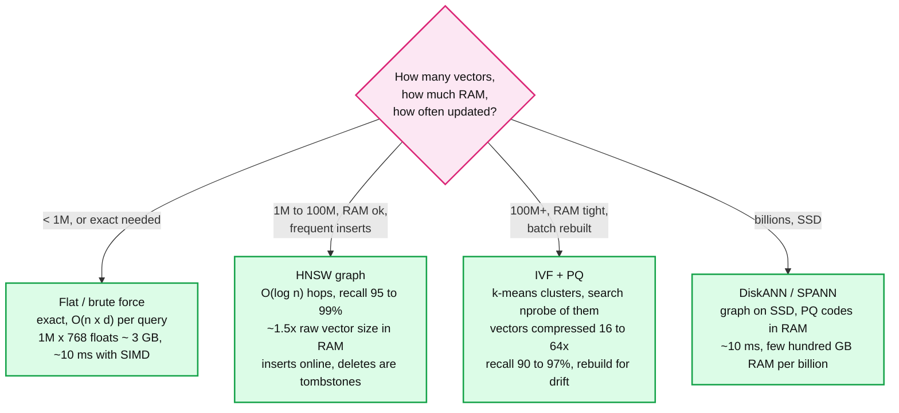
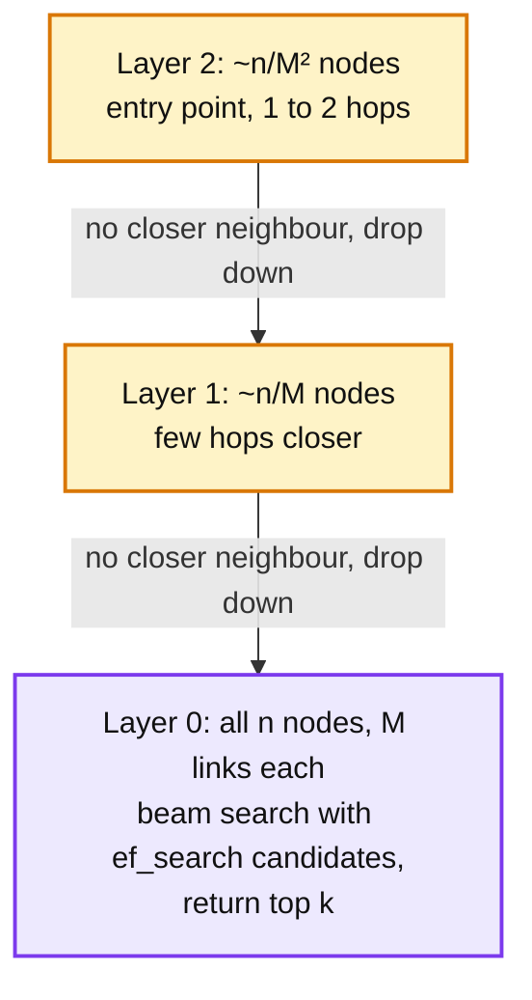
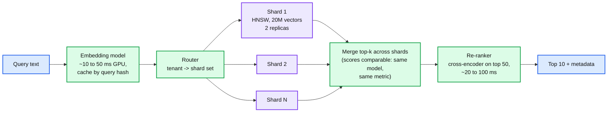

# Concept: Vector Index (HNSW, IVF, Quantization)

> One-liner: a vector index answers "which of my 100 million embeddings are closest to this query vector" in milliseconds by giving up exactness; HNSW builds a multi-layer graph where each search hops greedily toward the query (fast, memory hungry, ~95 to 99% recall), IVF clusters the vectors and searches only the nearest few clusters (cheaper, tunable), and product quantization compresses each vector 10 to 50x so the index fits in RAM at the cost of approximate distances. The design is a recall / latency / memory triangle, and the Staff answer states the recall target and how it is measured.

Depth target: high-level, same as [skip-list.md](skip-list.md) and [columnar-db.md](columnar-db.md). It is the retrieval half of the RAG and recommendation problems, and "why not brute force" and "how do you filter by tenant" are the follow-ups.

---

## 1. Mental model

Every document is a point in 768 or 1,536 dimensions. The query is a point. Brute force computes the distance to every point: 100M vectors x 1,536 floats x 4 bytes = 600 GB read and 150 billion multiply-adds per query. An approximate index visits a few thousand candidates instead and accepts missing a few of the true nearest.

| Family | Build | Query | Memory | Updates | Recall at ~1 ms |
|---|---|---|---|---|---|
| **Flat** | None | Scan all | `n x d x 4 B` | Trivial | 100% |
| **HNSW** (Malkov and Yashunin, 2016) | O(n log n), minutes per 10M | Greedy graph walk, O(log n) | Vectors plus ~`M x 2 x 4 B` links per vector, ~1.2 to 2x raw | Insert online, delete by tombstone plus periodic rebuild | 95 to 99% |
| **IVF** (inverted file) | k-means into `nlist` centroids, assign each vector | Find nearest `nprobe` centroids, scan their lists | Raw vectors plus centroids | Insert into a list; centroids go stale, rebuild periodically | 85 to 98%, tuned by `nprobe` |
| **IVF + PQ** | Same, plus train a codebook, encode vectors to `m` bytes | Same, with table-based approximate distances | `n x m B`, 16 to 64x smaller | Same | 85 to 95%, plus re-rank with raw vectors for the top 100 |
| **DiskANN / Vamana** | Graph tuned for SSD locality | Graph walk with SSD reads for neighbours, PQ in RAM for pruning | ~50 to 100 GB RAM per billion | Batch, or FreshDiskANN for streaming | 95%+ |
| **LSH** | Random hyperplane hashes | Bucket lookup | Many hash tables | Trivial | Low; mostly superseded |

**Why this matters more at Staff level.** Senior answers say "use a vector DB". Staff answers pick the index from `n`, `d`, and RAM, set `ef_search` or `nprobe` from a measured recall curve, explain why filtering by tenant breaks the graph, and put a re-ranker after the index.

---

## 2. HNSW: the one to explain on a whiteboard

A skip list for graphs. Each vector is inserted into layer 0 and, with exponentially decreasing probability, into higher layers. Each layer is a proximity graph where each node links to its `M` nearest neighbours in that layer. Search starts at the top layer's entry point, greedily moves to the neighbour closest to the query, drops a layer when no neighbour is closer, and at layer 0 keeps a beam of `ef_search` candidates.

| Parameter | Meaning | Typical | Effect |
|---|---|---|---|
| `M` | Links per node per layer (layer 0 gets `2M`) | 16 to 32 | Higher: better recall, more memory, slower build |
| `ef_construction` | Beam width during build | 100 to 400 | Higher: better graph, slower build |
| `ef_search` | Beam width during query, must be >= `k` | 50 to 500 | The runtime knob: higher recall, higher latency, roughly linear |

Numbers to say: 10M vectors at 768 dims is 30 GB raw plus ~5 GB of links; query ~1 ms for 95% recall at `ef_search=100` on one core; build ~30 to 60 minutes. See [skip-list.md](skip-list.md) for the layer probability argument, which is identical.

**Deletes are the weakness.** Removing a node breaks paths through it. Implementations mark it deleted, skip it in results, and keep routing through it until a rebuild. A corpus with 20% churn per day needs a nightly rebuild or a segment-based design (Lucene: immutable segments, each with its own graph, merged in the background, exactly the [lsm-tree.md](lsm-tree.md) pattern).

---

## 3. Quantization: fitting in RAM

| Method | Idea | Compression | Recall loss |
|---|---|---|---|
| **Scalar (int8)** | Map each float32 to int8 with a per-dimension scale | 4x | ~0 to 1% |
| **Binary** | 1 bit per dimension (sign) | 32x | Large; used as a first-pass filter, then re-rank |
| **Product quantization (PQ)** | Split `d` dims into `m` subvectors, k-means each into 256 centroids, store 1 byte per subvector | `d x 4 / m`: 768 dims, `m=96`: 3,072 B to 96 B, **32x** | 3 to 10%, recovered by re-ranking the top 100 with raw vectors |
| **Optimized PQ (OPQ)** | Rotate the space before PQ so subvectors carry equal variance | Same as PQ | Better than PQ by a few points |
| **Matryoshka / dimension truncation** | Embedding model trained so the first 256 dims are a good approximation | 3 to 6x | Model-dependent; OpenAI and newer models support it |

The standard pipeline: **IVF or HNSW over PQ codes to get 100 candidates, then exact distance on the raw vectors (from disk or a slower tier) to pick the top 10.** Re-ranking recovers most of the recall lost to quantization, at the cost of 100 random reads.

---

## 4. Filtering: the part that breaks

"Nearest neighbours **where tenant = X and date > Y**." Three options, all with a catch.

| Strategy | How | Breaks when |
|---|---|---|
| **Post-filter** | Search top `k x 10`, then filter | Filter is selective (1% of vectors match): top 100 might contain zero matches. Need `k / selectivity` candidates, which at 1% is 1,000x. |
| **Pre-filter** | Compute the matching ID set first, then brute-force only those | Match set is large (50% of 100M): brute force over 50M. Fine under ~100k matches. |
| **Filtered graph search** | Walk HNSW but only accept nodes passing the filter (Weaviate, Qdrant, Vespa) | Selective filters disconnect the graph: every neighbour fails the filter, the walk stalls. Qdrant switches to pre-filter below a selectivity threshold. |
| **Partition by filter** | One index per tenant (or per tenant shard) | Millions of tenants means millions of tiny indexes; hot tenants need their own shards anyway. The right answer for multi-tenant SaaS. |

The Staff line: **estimate selectivity per query, pre-filter when the match set is under ~100k, partition by tenant when the filter is always the tenant, and post-filter with an over-fetch factor only for loose filters.**

---

## 5. Serving architecture

- **Shard by count** (20 to 50M vectors per shard so the graph fits one node's RAM) or **by tenant**. Query fans out to every count-shard, [fan-out-fan-in.md](fan-out-fan-in.md) applies: per-shard timeout, partial results.
- **Freshness**: new documents go to a small write-side index (flat or a fresh HNSW segment) searched alongside the main one, merged nightly. Same as an LSM memtable.
- **Embedding drift**: changing the model means re-embedding the corpus. Version the index by model; run both during migration. 100M docs at 1,000 embeddings/s per GPU is ~28 GPU-hours.
- **Hybrid search**: BM25 keyword results and vector results merged by reciprocal rank fusion. Keyword catches exact IDs and rare terms that embeddings smear.
- **Latency budget for RAG**: embed 20 ms, retrieve 10 ms, re-rank 50 ms, LLM 1 to 5 s. Retrieval is not the bottleneck; recall is.
- **Measure recall** against a brute-force ground truth on a 1k-query sample, nightly. `recall@10 >= 0.95` is the SLO; `ef_search` is the knob.

---

## 6. Where you meet it

| System | Index | Note |
|---|---|---|
| **FAISS** (Meta) | Flat, IVF, PQ, HNSW, GPU | The reference library. `IndexIVFPQ` and `IndexHNSWFlat` are the two to name. |
| **hnswlib, usearch** | HNSW | Single-node, the fastest CPU HNSW. |
| **Lucene, Elasticsearch, OpenSearch** | HNSW per segment, int8 quantization | Segments merge like LSM; filters via Lucene's bitset with a graph-walk fallback. |
| **pgvector** | HNSW and IVFFlat inside Postgres | Filters via SQL; fine to ~10M vectors per table. |
| **Qdrant, Weaviate, Milvus, Pinecone** | HNSW with filtered search, PQ and scalar quantization, sharding | Milvus adds DiskANN and GPU indexes. |
| **Vespa** | HNSW with true filtered search and tensor ranking | Filter-first when selective. |
| **DiskANN, SPANN** (Microsoft) | SSD-resident graphs | Billion scale on one machine. |
| **ScaNN** (Google) | Anisotropic quantization plus partitioning | Google's production ANN. |
| **`hld/` #12 RAG, #35 feature store / recommendation** | All of the above | Candidate generation is ANN over item embeddings; ranking is a separate model. |

---

## 7. Trade-offs

| Gain | Cost |
|---|---|
| HNSW: best latency-recall on CPU, online inserts. | Memory ~1.5x raw, slow deletes, long builds. |
| IVF: cheap, tunable, easy to shard by cluster. | Centroids drift, edge effects at cluster boundaries, `nprobe` tuning. |
| PQ: 32x compression, index fits RAM. | Approximate distances; needs re-rank; codebook training. |
| Disk-based graphs: billions on one box. | SSD latency per hop, batch updates. |
| Sharding by tenant: filters are free. | Tiny indexes for tiny tenants, hot shards for big ones. |
| Re-ranking with a cross-encoder: big precision gain. | 50 to 100 ms and a GPU. |
| Approximate search at all: 100x faster than brute force. | Recall is a number you must measure, not assume. |

**What a Staff answer refuses to build:** brute force over 100M vectors per query, an HNSW index with no delete strategy for a churning corpus, post-filtering for a 1% selective filter, one global index for a multi-tenant product, and a recall number that was never measured against ground truth.

---

## 8. Numbers worth memorizing

- Vector sizes: 768 dims x 4 B = **3 KB**; 1,536 dims = 6 KB. 100M x 3 KB = 300 GB raw. With PQ at 96 B: ~10 GB.
- HNSW: `M` 16 to 32, `ef_construction` 200, `ef_search` 50 to 500. ~1 ms per query per core at 95% recall on 10M. Build 10M in ~30 to 60 min on 16 cores. Links add ~`2 x M x 4 B` = 128 to 256 B per vector.
- IVF: `nlist ~ sqrt(n)` to `4 x sqrt(n)`; `nprobe` 1 to 10% of `nlist`.
- PQ: `m` = 64 to 128 subvectors for 768 to 1,536 dims, 256 centroids each (1 byte). 16 to 64x compression.
- Recall SLO: **recall@10 >= 0.95** against brute-force ground truth on a sampled query set.
- Embedding throughput: ~1,000 docs/s per GPU for a small model; 100M docs ~ 28 GPU-hours.
- Re-rank: cross-encoder on top 50 to 100, 20 to 100 ms.
- Pre-filter threshold: ~100k matching IDs; below that brute-force the matches.
- Shard size: 20 to 50M vectors per node for HNSW in RAM.

---

## 9. Interview soundbite

> "I index embeddings with HNSW, a layered proximity graph that walks greedily from a sparse top layer down to a dense bottom layer, about a millisecond per query at 95% recall on ten million vectors, sharded at twenty to fifty million per node so the graph stays in RAM. For a hundred million or more I switch to IVF with product quantization so the index is thirty times smaller, and re-rank the top hundred candidates with exact distances. Filters are the trap: for a selective filter I pre-filter and brute force the matches, for multi-tenant I partition the index by tenant, and I only post-filter with over-fetch for loose filters. New documents land in a small write-side segment merged nightly, deletes are tombstones until that merge, and recall at ten is measured nightly against brute force on a sample, with `ef_search` as the knob."

Follow-ups an interviewer will ask, in order of likelihood:

1. Why not brute force? (Section 1, 300 GB scan per query.)
2. What is recall and how do you know yours? (Section 5, measure against ground truth.)
3. Filter by tenant or date. (Section 4.)
4. A document is deleted or updated. (Section 2, tombstone plus rebuild, segments.)
5. The index does not fit in RAM. (Section 3, PQ, DiskANN.)
6. How do you shard and merge? (Section 5, count or tenant shards, scores comparable.)
7. You change the embedding model. (Section 5, re-embed, version, dual-run.)
8. HNSW parameters and what they do. (Section 2.)

Related: [skip-list.md](skip-list.md) (the layer structure HNSW copies), [lsm-tree.md](lsm-tree.md) (segments, tombstones, merges), [sharding.md](sharding.md) (by tenant vs by count), [fan-out-fan-in.md](fan-out-fan-in.md) (scatter across shards), [caching-patterns.md](caching-patterns.md) (embedding and result caches), `hld/` #12 RAG retrieval, #35 recommendation platform.
