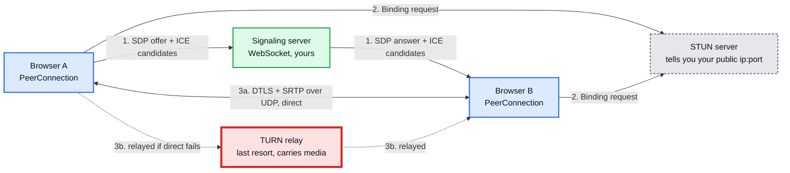
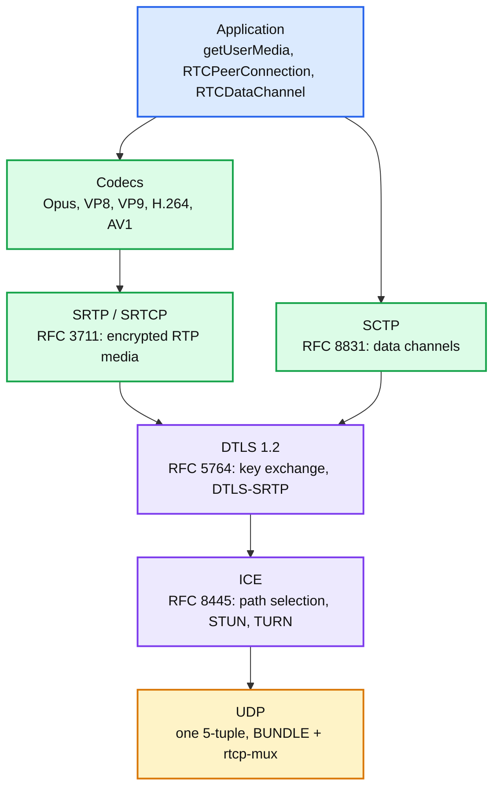
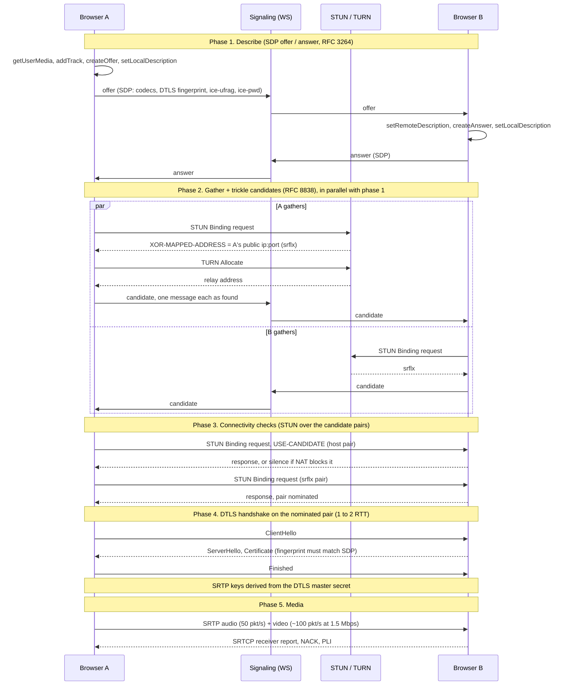
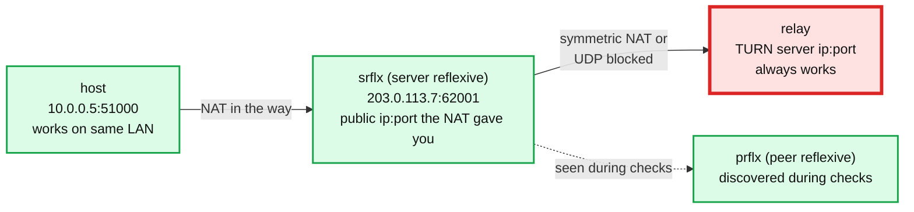
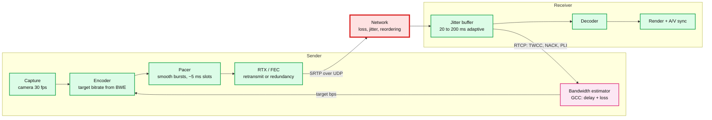
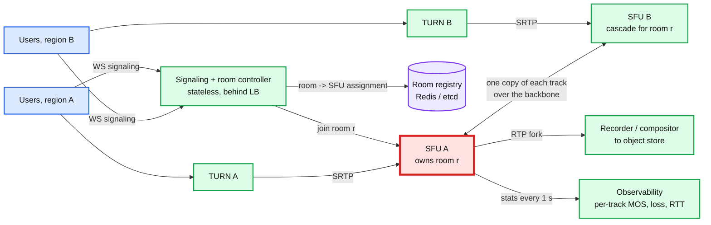
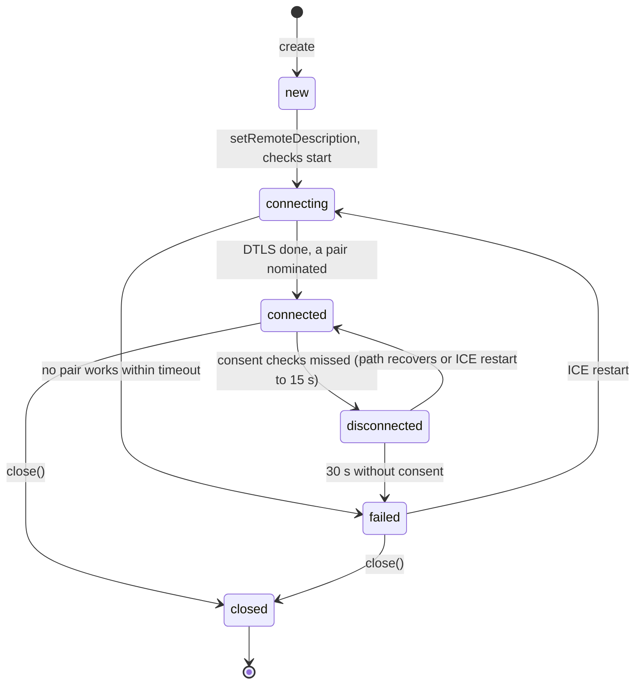

# Concept: WebRTC

> One-liner: WebRTC is the browser's built-in stack for sending encrypted audio, video, and arbitrary data over UDP directly between two endpoints. It standardizes everything except how the two endpoints find each other (signaling), and the hard parts in production are NAT traversal (STUN / TURN) and choosing a server topology (mesh, SFU, MCU) once a call has more than four people.

WebRTC = Web Real-Time Communication. Depth target: draw the full call setup from memory, explain why 10 to 20 percent of calls need a relay, do the mesh vs SFU bandwidth math out loud, and design a Zoom-shaped system that survives a node dying mid-call.

Sources are marked **[doc]** (RFC, W3C spec, vendor docs) or **[inf]** (inferred, observed, or reverse-engineered).

Used by: [`concepts/realtime-client-server-communication.md`](realtime-client-server-communication.md) (the sub-second tier of that decision tree), #37 live comments (the video half), any "design Zoom / Google Meet / Discord voice / Clubhouse" question.

---

## 1. Mental model

- **Signaling is not part of WebRTC.** The spec **[doc: RFC 8829 JSEP]** says "exchange these blobs somehow". Everyone uses a WebSocket (see the sibling note). This is deliberate: it lets WebRTC drop into SIP, XMPP, or a custom protocol.
- **STUN is cheap and stateless.** One UDP round trip, ~100 bytes. A single small box serves millions of clients. Google runs `stun.l.google.com:19302` for free.
- **TURN is expensive and stateful.** It relays every media byte. That is why it is red: it is the cost center and the thing that saturates first. Budget for 10 to 20 percent of sessions landing on it **[inf]**.
- **Media never touches your server** in the two-party case. That is the whole point and also the whole operability problem (you cannot see what is going on).

---

## 2. Protocol stack

| Layer | What it does | Why it is there |
|---|---|---|
| RTP / RTCP **[doc: RFC 3550]** | RTP = packet with sequence number, timestamp, SSRC (stream id). RTCP = the feedback channel (loss reports, NACK, keyframe requests). | Media needs ordering and timing, not reliability. TCP gives the wrong one. |
| SRTP **[doc: RFC 3711]** | Encrypt RTP payload, authenticate header. AES-128-CTR + HMAC-SHA1-80, or AES-GCM. | Header stays in the clear so middleboxes (SFUs) can route without decrypting. |
| DTLS-SRTP **[doc: RFC 5764]** | TLS handshake over UDP. Derives SRTP keys. Certificate fingerprint is pinned in the SDP. | Keys never go through the signaling server, so a compromised signaling server cannot decrypt media. |
| SCTP over DTLS **[doc: RFC 8831]** | Message-oriented, multi-stream, configurable reliability. | Data channels: ordered/unordered, reliable/partially reliable, all over one UDP socket. |
| ICE **[doc: RFC 8445]** | Gather candidate addresses, pair them, probe with STUN, pick the best working pair. | The only way through NATs without configuring routers. |
| BUNDLE **[doc: RFC 8843]** + rtcp-mux **[doc: RFC 5761]** | Audio, video, data, and RTCP all on one port. | One ICE negotiation instead of six. Firewalls see one flow. |

**Mandatory-to-implement codecs [doc: RFC 7874, RFC 7742]:** audio Opus + G.711, video VP8 + H.264. Browsers also ship VP9 and AV1. Opus alone covers 6 to 510 kbps, speech to music, 2.5 to 60 ms frames, with built-in FEC and packet loss concealment.

---

## 3. Call setup, end to end

**Where the time goes [inf]:** signaling round trip (~100 ms), candidate gathering (host instant, srflx ~50 ms, relay ~100 to 300 ms), connectivity checks (tens of ms to a few seconds if the first pairs fail), DTLS (1 to 2 RTT). Total 1 to 3 s glass to glass. Trickle ICE is the single biggest win: without it you wait for every candidate before sending the offer.

**SDP** = Session Description Protocol **[doc: RFC 8866]**. A 1990s text format that every WebRTC engineer hates and every WebRTC engineer must read. Contents that matter: `m=` lines per media section, codec list with payload types, `a=fingerprint` (DTLS cert hash), `a=ice-ufrag` / `a=ice-pwd` (STUN credentials), `a=candidate` lines, `a=ssrc`, `a=simulcast`. Browsers speak **Unified Plan** (one `m=` section per track) **[doc: RFC 8829]**.

**Glare.** Both sides call `createOffer` at the same time and neither answer is valid. The fix is the "perfect negotiation" pattern **[doc: W3C WebRTC]**: designate one side `polite`, it rolls back its own offer when a collision is detected. Interviewers who have shipped WebRTC ask about this.

---

## 4. NAT traversal: ICE, STUN, TURN

**The problem.** Both peers are behind NATs (Network Address Translation). Neither has a public IP. Neither can accept an inbound packet unless its NAT already saw an outbound one to that exact source.

**STUN** = Session Traversal Utilities for NAT **[doc: RFC 8489]**. You send a packet to a public server, it replies with the `ip:port` it saw. Now you know your public address *as this NAT maps it for this destination*.

**Hole punching.** Both peers send to each other's srflx address at roughly the same time. Each NAT sees an outbound packet first, creates a mapping, and the other side's packet is let in. This is what ICE connectivity checks are.

**When it fails.** A **symmetric NAT** allocates a new external port per destination, so the port STUN saw is useless for the peer. Symmetric to symmetric almost never punches. Corporate firewalls that block all UDP also fail. Then:

**TURN** = Traversal Using Relays around NAT **[doc: RFC 8656]**. Client asks the TURN server to allocate a public relay address and forwards everything through it. Works because both peers only ever talk *outbound* to a public server.

| | STUN | TURN |
|---|---|---|
| Traffic through it | One request per candidate, ~100 B | Every media byte, both directions |
| State | None | Allocation per client, 10 min refresh |
| Cost | Negligible, one tiny box | ~$0.01 to 0.10 per GB egress + CPU. A 25 person call relayed is ~5 Mbps per relayed client |
| Share of sessions | 100 % | 10 to 20 % typical, higher for enterprise users **[inf]** |
| Latency added | 0 | 1 extra hop, 5 to 50 ms depending on relay placement |
| Transport | UDP | UDP, TCP, TLS on 443 (the only thing that gets through a strict corporate firewall) |

**Staff-level TURN notes**

- Deploy TURN in every region you have users, and pick by latency (geo DNS or a candidate per region). A relay in the wrong continent adds 150 ms and ruins the call.
- Use short-lived HMAC credentials **[doc: TURN REST API draft]**, never static passwords. Your TURN server is an open relay to anyone who has them.
- ICE-TCP and TURN over TLS:443 are the fallbacks that make enterprise deployments work. Expect 5 percent of users to need them.
- **Consent freshness [doc: RFC 7675]:** peers re-send a STUN check every 5 s. 30 s of silence and the path is considered dead. This is also the NAT keepalive.
- **ICE restart** when the network changes (Wi-Fi to LTE). Same call, new candidates, new DTLS keys are not needed. Fast path: gather the new candidate, check it, switch.

---

## 5. Media pipeline and congestion control

**Why UDP and not TCP.** Media has a deadline. A frame that arrives 300 ms late is worthless, and TCP would stall every later frame behind it (head-of-line blocking) while retransmitting. UDP lets the app decide per packet: retransmit if there is time, skip if not, conceal the gap.

**Bandwidth estimation (BWE).** Browsers run **GCC** (Google Congestion Control) **[doc: draft-ietf-rmcat-gcc]**:
- **Delay-based:** receiver reports arrival time of every packet via **TWCC** (transport-wide congestion control) feedback every ~50 to 100 ms. Sender fits a trendline to inter-arrival deltas. Queues building = delay growing = back off *before* loss happens.
- **Loss-based:** loss < 2 % increase 5 % per second, 2 to 10 % hold, > 10 % cut proportionally.
- Starts at ~300 kbps and probes upward with padding bursts. Getting to 1080p takes several seconds. That is why calls start blurry.
- Output is one number: target bits per second. The encoder honours it by lowering quantizer, then resolution, then frame rate (`degradationPreference`).

**Loss repair, three tools, pick per situation**

| Tool | How | Use when |
|---|---|---|
| **NACK + RTX** **[doc: RFC 4585, RFC 4588]** | Receiver says "missing seq 1042", sender resends from a short cache on a separate SSRC | RTT small enough that the retransmit arrives before the frame's deadline (< ~100 ms RTT) |
| **FEC** (Forward Error Correction) **[doc: RFC 8627 FlexFEC, Opus in-band]** | Send redundant parity packets ahead of time | High RTT or bursty loss where a round trip is too slow. Costs 10 to 30 % extra bandwidth always |
| **PLI / FIR** **[doc: RFC 4585, RFC 5104]** | Receiver says "I lost reference state, send a keyframe" | Decoder is corrupted. Keyframe is 5 to 10x the size of a delta frame, so rate-limit these or a flaky link becomes a keyframe storm |

**Jitter buffer.** Holds packets briefly so the decoder sees a smooth stream. Adaptive: grows under jitter, shrinks when stable. Audio (NetEQ in libwebrtc) also time-stretches speech to catch up without an audible skip. Every ms of buffer is a ms of latency, so it is the direct trade of quality vs delay.

**Latency budget.** ITU-T G.114 **[doc]**: one-way mouth to ear under 150 ms feels natural, up to 400 ms is tolerable, beyond that people talk over each other. A typical budget: capture + encode 30 ms, pacer 5 ms, network 20 to 80 ms, jitter buffer 40 ms, decode + render 20 ms.

---

## 6. Data channels

- `RTCDataChannel` = SCTP over DTLS over UDP **[doc: RFC 8831, RFC 8832]**. Message-oriented, up to 64 KiB messages safely (larger needs care).
- Per channel you choose: `ordered: true/false`, and either `maxRetransmits: N` or `maxPacketLifeTime: ms`. Default is ordered + fully reliable, so it behaves like a WebSocket that happens to be peer to peer.
- Unordered + `maxRetransmits: 0` gives you a UDP-like channel from the browser. This is the only way to get unreliable transport in a browser today (WebTransport is the newer alternative, client to server only).
- Head-of-line blocking exists *within* one ordered channel, not across channels. Game state on an unreliable channel, chat on a reliable one.
- Uses: multiplayer game state, file transfer between peers (no server bandwidth), collaborative cursors, torrent-style CDN offload (WebTorrent, Peer5).

---

## 7. Topologies: mesh, MCU, SFU

```mermaid
%% Three ways to wire n participants. Mesh has no server but n-1 uplinks. MCU has one stream each way but the server decodes everything. SFU forwards without decoding and is what everyone at scale ships.
flowchart TB
    subgraph Mesh["Mesh, n = 4: each client encodes 3x, uploads 3x"]
        M1["A"] <--> M2["B"]
        M1 <--> M3["C"]
        M1 <--> M4["D"]
        M2 <--> M3
        M2 <--> M4
        M3 <--> M4
    end
    subgraph MCU["MCU: decode all, compose one picture, encode once per client"]
        C1["A"] -->|"1 up"| MC["MCU<br/>decode + mix + encode"]
        C2["B"] -->|"1 up"| MC
        MC -->|"1 composite down"| C1
        MC -->|"1 composite down"| C2
    end
    subgraph SFU["SFU: forward packets, never decode"]
        S1["A"] -->|"1 up, 3 simulcast layers"| SF["SFU<br/>route + select layer"]
        S2["B"] -->|"1 up"| SF
        SF -->|"n-1 down, chosen layers"| S1
        SF -->|"n-1 down"| S2
    end

    class M1,M2,M3,M4,C1,C2,S1,S2 client
    class MC critical
    class SF service
    classDef client   fill:#dbeafe,stroke:#2563eb,stroke-width:2px,color:#111
    classDef service  fill:#dcfce7,stroke:#16a34a,stroke-width:2px,color:#111
    classDef critical fill:#fee2e2,stroke:#dc2626,stroke-width:4px,color:#111
```

**The math, n participants, b = 1.5 Mbps per 720p stream**

| | Mesh | MCU | SFU (no simulcast) | SFU + simulcast |
|---|---|---|---|---|
| Client uplink | (n-1) x b | b | b | ~1.4 x b (3 layers: 1.5 + 0.5 + 0.15 Mbps) |
| Client downlink | (n-1) x b | b | (n-1) x b | 1 speaker at b + (n-2) thumbnails at 0.15 b |
| Server ingress | 0 | n x b | n x b | 1.4 n x b |
| Server egress | 0 | n x b | n(n-1) x b | n x (b + (n-2) x 0.15 b) |
| Server CPU | 0 | decode n + encode n, ~1 core per participant | ~0, packet routing only | ~0 plus layer selection |
| Server latency added | 0 | 100 to 200 ms (decode, compose, encode) | < 5 ms | < 5 ms |
| Client encode | n-1 encoders | 1 | 1 | 1 encoder, 3 outputs |
| n = 4 | 4.5 Mbps up per client. OK | fine | 4.5 down, 1.5 up | 1.9 down, 2.1 up |
| n = 25 | 36 Mbps up. Impossible | 25 cores | 36 Mbps down. Impossible | ~6.6 Mbps down, 2.1 up. Fine |
| n = 100 | no | 100 cores per room | no | server egress ~2.3 Gbps per room, needs cascading |

**Where each wins**

- **Mesh:** 2 people, always. 3 to 4 people on good networks. No server cost, no server trust, lowest latency. Dies at 5 because home uplinks are 5 to 20 Mbps and laptops cannot run 4 encoders.
- **MCU** = Multipoint Control Unit. Legacy telephony, PSTN gateways, recording to a single file, clients that can only decode one stream (old hardware, low-end phones). Server cost scales with participants and it adds a decode-encode hop of latency. Also breaks end-to-end encryption by definition.
- **SFU** = Selective Forwarding Unit. What Zoom, Meet, Teams, Discord, LiveKit, Jitsi, mediasoup, Janus all are. Server never decrypts payloads (only reads RTP headers), so CPU is trivial and E2EE is possible. Cost is client downlink and server egress, both fixed with simulcast.

**Simulcast** **[doc: RFC 8853]**: the client encodes the same camera at 3 resolutions (e.g. 720p / 360p / 180p) and sends all three. The SFU picks per receiver: the active speaker gets 720p, thumbnails get 180p, a receiver on a bad link gets 360p. The SFU switches layers at keyframes.

**SVC** (Scalable Video Coding, VP9 / AV1): one bitstream with layered dependencies, so the SFU drops layers by dropping packets instead of switching streams. Cleaner than simulcast, less encoder work, but decoder support is narrower.

---

## 8. Scaling an SFU: the Zoom / Meet shape

**Design points**

- **A room is pinned to an SFU.** Forwarding needs every publisher's packets and every subscriber's feedback in one process. So the unit of scheduling is the room, not the user. Assignment = pick the least-loaded SFU in the region of the first joiner, write `room -> sfu` to the registry with a TTL, and every later joiner is routed there by the signaling layer.
- **The SFU is the SPOF for its rooms.** When it dies, every participant sees `iceConnectionState: failed` within ~30 s (consent freshness). Recovery: the client's reconnect logic re-joins through signaling, the controller assigns a new SFU, and the call resumes with a ~2 to 5 s gap. Make the registry entry expire on missed heartbeats so the dead SFU is not re-picked. Interviewers want to hear "the call drops and comes back", not "it fails over transparently". Media state cannot be replicated at 100 packets per second per stream.
- **Capacity is egress bandwidth, not CPU [inf].** A 10 Gbps node forwarding 1.5 Mbps streams serves ~6,000 subscriptions. A 25-person meeting with simulcast is ~165 Mbps egress, so ~60 such meetings per node. Plan on 60 to 70 percent utilization to absorb speaker changes (everyone upgrades to 720p on the same person at once).
- **Cascading** for cross-region or large rooms: the SFU that owns the room sends *one copy* of each track to a peer SFU in the other region, which fans out locally. Users always connect to the closest SFU, and the long haul carries n tracks instead of n x (n-1). Big webinars (1,000+) are a tree of SFUs, and beyond ~10k viewers you switch the audience to HLS at 5 to 10 s latency and keep WebRTC for the few people who talk.
- **Active speaker detection** runs on the SFU using audio level RTP header extensions **[doc: RFC 6464]**, no decoding needed. It drives which simulcast layer each receiver gets, so it is the biggest lever on egress.
- **Recording:** fork the RTP to a recorder. Either store per-track and compose later (cheap, flexible) or compose live with an MCU-style compositor (expensive, needed for live streaming to YouTube). Push the result to object storage, never keep it on the SFU disk.
- **Deploy drain:** stop assigning new rooms to the node, wait for existing rooms to end (meetings are ~30 to 60 min), then terminate. Forced drain = the reconnect path above, at a chosen time.
- **Observability:** every client posts `getStats()` every few seconds (RTT, jitter, loss, bitrate, frames dropped, chosen candidate pair, TURN or direct). The SFU reports per-track inbound loss. The metric that pages at 3 am is "percent of sessions with > 5 % loss or on TURN", by region and ISP. A regional TURN outage looks exactly like "everyone in Frankfurt has bad calls".

**E2EE on an SFU.** Since the SFU only reads RTP headers, you can encrypt the *payload* a second time with a key the server never has (**SFrame [doc: RFC 9605]**, via Insertable Streams in the browser). Zoom, Meet, and Signal do this. Cost: server-side recording, transcription, and PSTN dial-in all break, so it is a per-meeting opt-in.

---

## 9. Connection lifecycle

- `disconnected` is normal on a phone switching networks. Do not tear down. Start an ICE restart timer (2 to 3 s) and show a "reconnecting" badge.
- `failed` on the *first* attempt with no relay candidate means "no TURN configured or UDP blocked". This is the top support ticket for every WebRTC product.
- Signaling and media fail independently. The WebSocket can drop while the call keeps running. Reconnect signaling in the background without touching the PeerConnection.

---

## 10. Failure modes

| Failure | Symptom | Mitigation |
|---|---|---|
| No TURN, symmetric NAT | 10 to 20 % of calls never connect | Deploy TURN per region, TURN over TLS 443 |
| TURN region wrong | Call connects with 200+ ms RTT | Geo-select TURN, expose the chosen candidate pair in stats |
| Keyframe storm | One flaky receiver sends PLI every 100 ms, sender's bitrate collapses for everyone | Rate-limit PLI on the SFU (max one keyframe per ~1 s per track), serve the flaky receiver a lower layer |
| Speaker switch stampede | Everyone requests 720p of the same publisher at once, SFU egress spikes | Cap concurrent high layers, ramp with a short hysteresis on speaker changes |
| BWE ramp-up | First 5 s of every call are blurry | Start with a stored estimate from the last call on this network, probe faster with padding |
| Bufferbloat on home routers | Delay grows to seconds under load, loss stays at 0 | Delay-based GCC catches it. Loss-only controllers (old SIP) do not |
| Signaling server dies | New joins fail, existing calls keep running | Stateless signaling behind an LB, clients reconnect with a jittered backoff and re-join the room |
| SFU dies | All its rooms drop, 2 to 5 s to rejoin elsewhere | Heartbeat-expired registry, client rejoin logic, drain before deploy |
| Clock drift between sender and receiver | A/V desync after 20 minutes | RTCP sender reports carry NTP time, receiver resamples |
| Firewall does deep inspection | DTLS blocked even on 443 | Nothing good. Offer PSTN dial-in |

---

## 11. Trade-offs, the Staff framing

| Decision | Option A | Option B | Pick when |
|---|---|---|---|
| Transport | WebRTC (UDP, sub-second) | HLS / LL-HLS (HTTP, 2 to 30 s, CDN-cacheable) | WebRTC only if the audience must interact or latency < 1 s matters. Broadcast to 10^5+ viewers is HLS. Hybrid for webinars |
| Topology | Mesh | SFU | Mesh for 2, arguably up to 4. SFU beyond. Never MCU unless you need a single composed stream out |
| Layering | Simulcast | SVC | Simulcast for broad browser support today, SVC (AV1) when your client fleet is controlled |
| Loss repair | NACK / RTX | FEC | NACK when RTT < 100 ms, FEC on long-haul or lossy mobile, both in practice |
| Signaling | Own WebSocket protocol | SIP / XMPP | Own protocol unless you must interop with telephony |
| E2EE | On (SFrame) | Off | Off by default so recording and transcription work, opt-in per meeting |
| Codec | H.264 | VP9 / AV1 | H.264 for hardware encode on phones, VP9 / AV1 for 30 to 50 % less bandwidth at same quality when CPU allows |
| Big rooms | SFU cascade | Switch audience to HLS | Cascade to ~1k, then HLS for the audience, WebRTC for presenters |

**What I refuse to build.** Media failover with replicated SFU state. It is not worth the complexity. The call drops for 3 s and rejoins. Every large vendor does this.

---

## 12. Numbers worth memorizing

- Opus: 6 to 510 kbps, 20 ms frames = 50 packets per second. Speech is fine at 24 to 32 kbps.
- Video: 180p ~150 kbps, 360p ~500 kbps, 720p ~1.5 Mbps, 1080p ~3 Mbps. Keyframe is 5 to 10x a delta frame.
- Simulcast overhead: ~1.4x the top layer's bitrate.
- One-way latency: < 150 ms natural, < 400 ms tolerable (ITU-T G.114).
- Call setup: 1 to 3 s. DTLS is 1 to 2 RTT. Consent freshness every 5 s, timeout 30 s.
- TURN share: 10 to 20 percent of sessions, higher in enterprise. Budget its egress.
- Mesh limit: ~4 participants. SFU: hundreds per room, thousands with cascading, then HLS.
- SFU node: bandwidth-bound, ~6,000 x 1.5 Mbps subscriptions per 10 Gbps NIC.
- MTU: keep RTP packets under ~1,200 bytes to avoid fragmentation over tunnels and TURN.

---

## 13. Staff-level questions

- "Why does your server topology decide whether E2EE is possible?" (SFU forwards encrypted payloads, MCU must decrypt to compose.)
- "A user in a bank cannot connect. Walk me through ICE." (Host fails, srflx fails on UDP block, need TURN over TLS 443, and even that fails under TLS inspection.)
- "How does a 1,000 person town hall differ from a 10 person meeting?" (Cascaded SFUs, audience-only receivers with no uplink, speaker-only WebRTC plus HLS for the rest.)
- "An SFU dies. What do 200 users see?" (Frozen video, `disconnected` after 5 to 15 s, `failed` at 30 s, rejoin via signaling to a new SFU, total 5 to 35 s unless the client detects it faster via signaling heartbeat.)
- "What single metric tells you call quality is degrading?" (Percent of sessions above 5 % loss or 300 ms RTT, sliced by region and whether they are on TURN.)
- "Why not just use WebSocket for voice?" (TCP head-of-line blocking turns 1 % loss into repeated 200 ms stalls. And no browser access to raw UDP.)
- "Where does congestion control live and why is it not TCP's?" (In the app, delay-based, because it must react before loss and by lowering the encoder's bitrate, which TCP cannot do.)

---

## 14. Interview soundbite

> WebRTC gives the browser encrypted UDP media and data between any two endpoints, with STUN to learn your public address and TURN as the relay for the 10 to 20 percent of calls that cannot hole-punch. Two people go peer to peer. Beyond four, you put an SFU in the middle that forwards packets without decoding them, use simulcast so each receiver gets the layer it can afford, pin each room to one SFU, and accept a 3 second rejoin when that node dies.

---

## 15. Sources

- W3C WebRTC 1.0: https://www.w3.org/TR/webrtc/
- RFC 8829 JSEP (offer/answer in browsers): https://www.rfc-editor.org/rfc/rfc8829
- RFC 8445 ICE: https://www.rfc-editor.org/rfc/rfc8445
- RFC 8838 Trickle ICE: https://www.rfc-editor.org/rfc/rfc8838
- RFC 8489 STUN: https://www.rfc-editor.org/rfc/rfc8489
- RFC 8656 TURN: https://www.rfc-editor.org/rfc/rfc8656
- RFC 7675 ICE consent freshness: https://www.rfc-editor.org/rfc/rfc7675
- RFC 3550 RTP, RFC 3711 SRTP, RFC 5764 DTLS-SRTP
- RFC 4585 RTP/AVPF (NACK, PLI), RFC 4588 RTX, RFC 5104 FIR, RFC 8627 FlexFEC
- RFC 8831 / 8832 Data channels (SCTP over DTLS)
- RFC 8853 Simulcast, RFC 6464 audio level extension, RFC 9605 SFrame
- RFC 7874 / 7742 mandatory audio / video codecs
- draft-ietf-rmcat-gcc Google Congestion Control: https://datatracker.ietf.org/doc/draft-ietf-rmcat-gcc/
- ITU-T G.114 one-way transmission time
- webrtcforthecurious.com (free book, the best single walkthrough of the stack)
- Zoom E2EE whitepaper: https://github.com/zoom/zoom-e2e-whitepaper
