# Concept: ZooKeeper

> One-liner: ZooKeeper is a replicated, in-memory tree of small nodes (znodes) with three primitives on top: **sessions** (a client heartbeat the cluster tracks), **ephemeral nodes** (deleted when the session dies), and **one-shot watches** (a callback when a node changes). Writes go through one leader with the Zab atomic broadcast, reads are served locally by any server and can be stale. It is the coordination service under HBase, HDFS HA, Solr, Pulsar, and (until Kafka 4.0) Kafka. Same job as etcd, older API, hierarchical instead of flat, and no revision history.

Depth target: high-level, same as [etcd.md](etcd.md), which is the modern twin. Read that one first if you have not; this note leans on it for the shared ideas (quorum, fencing, why not a database) and spends its space on what ZooKeeper does differently: sessions, ephemeral nodes, one-shot watches, sequential consistency, and the recipes.

Sources: zookeeper.apache.org docs (Overview, Programmer's Guide, Internals, Administrator's Guide, Recipes, Observers, Reconfig), the ZooKeeper USENIX ATC 2010 paper (Hunt, Konar, Junqueira, Reed), HBase reference guide, Kafka 4.0.0 release notes. Every number in section 13 was read from those pages.

---

## 1. Mental model

A ZooKeeper **ensemble** of 3 or 5 servers holds a small filesystem-like tree in memory, replicated through one leader. Each client holds a **session** that the cluster keeps alive with heartbeats. The three things that make it a coordination service and not a cache: a node can be **ephemeral** (tied to a session), a node can be **sequential** (server appends a monotonically increasing counter), and any read can set a **watch** (one notification on change).

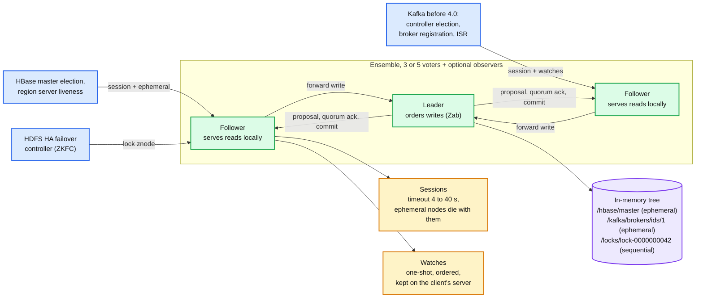

- **Everything is in memory.** The tree is small by design: znode data defaults to under 1 MB (`jute.maxbuffer`), the docs say "on the order of kilobytes". Durability comes from a transaction log fsynced before every write is acknowledged, plus periodic fuzzy snapshots.
- **Writes are linearizable, reads are not.** A read is answered by whichever server you are connected to, from its own copy, with no quorum round. Call `sync()` first if you need the latest.
- **Liveness is the session**, not a lease per key. Everything ephemeral a client created disappears together when its session expires. The cluster decides expiry, not the client.

**Why this matters at Staff level.** Senior answers say "ZooKeeper for leader election". Staff answers say what happens in the 40 seconds between a leader's GC pause and its session expiry (two leaders, unless you fence), why a one-shot watch can miss intermediate changes but never the final state, why 5 servers and not 3 (maintenance), why reads can be stale and when that is fine, and that Kafka spent five years removing it (KRaft) because the metadata write rate outgrew a single Zab leader plus watch fan-out.

---

## 2. Data model: a tree of small versioned nodes

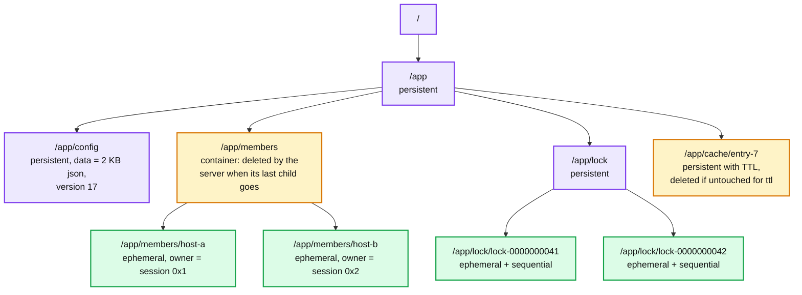

| Node type | Lifetime | Typical use |
|---|---|---|
| **Persistent** | Until deleted | Config, namespace roots |
| **Ephemeral** | Until the creating session expires or closes. Cannot have children | Membership, "I am alive", lock holders |
| **Sequential** | Server appends a 10-digit zero-padded counter (`%010d`, per parent, signed 32-bit) | Fair queues, locks, leader election ordering |
| **Container** (3.5.3) | Deleted by the server some time after its last child is deleted | Parents for lock and election recipes, so they do not leak |
| **TTL** (3.5.3, off by default) | Persistent, but deleted if not modified within `ttl` and childless | Soft state without a session |

Every znode carries a **stat**. The fields that matter:

| Field | Meaning | Use |
|---|---|---|
| `czxid`, `mzxid`, `pzxid` | zxid of the create, the last data change, the last child change | Ordering, fencing (`czxid` of the lock node) |
| `version`, `cversion`, `aversion` | Data, children, ACL change counters | Conditional `setData(path, data, expectedVersion)` and `delete` |
| `ephemeralOwner` | Session id if ephemeral, else 0 | Find who holds a lock |
| `dataLength`, `numChildren` | Sizes | Spot the znode with 100k children before it hurts |

Differences from etcd you will be asked about: **no history** (one version per node, no time-travel reads, no "watch from revision N"), **hierarchical** (`getChildren` is a real operation, not a range scan), and the **1 MB** limit is per node including the child-name list a `getChildren` returns.

---

## 3. The API

Eleven calls, all with sync and async forms. No transactions across calls except `multi`.

| Call | Notes |
|---|---|
| `create(path, data, acl, mode)` | Mode picks persistent / ephemeral / sequential / container / TTL. Returns the actual path (with the sequence number) |
| `delete(path, version)` | Conditional on `version`, `-1` to skip the check. Fails if the node has children |
| `exists(path, watch)` | Returns stat or null. Watch fires on create, delete, or data change |
| `getData(path, watch)` / `setData(path, data, version)` | Read with optional watch; write is compare-and-swap on `version` |
| `getChildren(path, watch)` | Names only. Watch fires when the child list changes |
| `sync(path)` | Flush the pending leader-to-follower stream to the server you are connected to, so the next read is current |
| `multi(ops)` | Atomic batch of create / delete / setData / check. All or nothing, one zxid |
| `addWatch(path, mode)` (3.6.0) | Persistent or persistent-recursive watch that survives triggering |

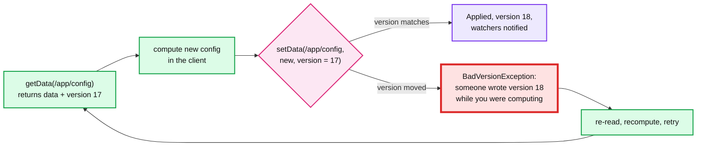

---

## 4. Sessions: the liveness primitive

A session is negotiated at connect time and owned by the **cluster**. The client asks for a timeout; the server clamps it to between `2 x tickTime` and `20 x tickTime` (4 s to 40 s with the default 2,000 ms tick). While idle the client pings; the paper's client pings after `s/3` and switches server if it hears nothing for `2s/3`.

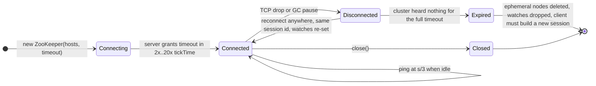

- **Disconnected is not Expired.** During a partition the client is `Disconnected`; the cluster keeps counting. If the client reconnects within the timeout, the session (and its ephemeral nodes) survives. If not, the cluster expires it and deletes everything ephemeral. The client only *learns* it expired when it reconnects.
- **Expiry is decided by the cluster.** A client whose own clock says "I am fine" can still be expired. This is the HBase region server death: a 60 s garbage-collection pause on a 90 s session (`zookeeper.session.timeout`, HBase default 90,000 ms) is survivable, a 100 s pause is not, and the master reassigns the regions while the paused server still thinks it owns them.
- **Session migration** between servers is transparent: the same session id and password authenticate on any server, and the client re-sends its watches.
- Sessions are global state, replicated through Zab, because ephemeral ownership must be agreed. (3.5 added local sessions for read-only clients that never create ephemerals, to keep session churn off the leader.)

---

## 5. Watches: one shot, ordered, local to your server

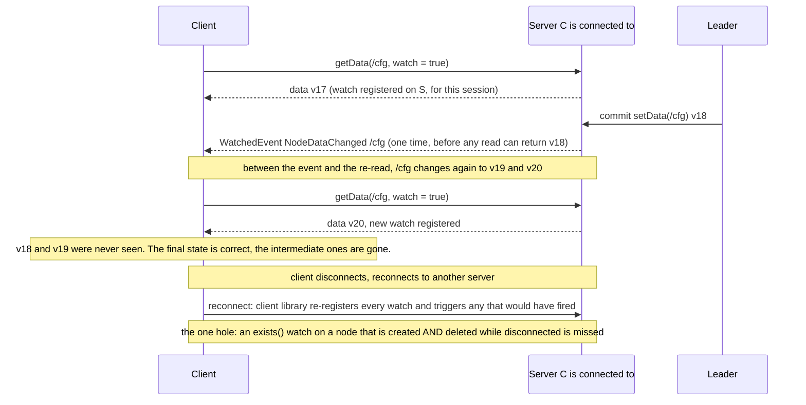

Guarantees from the Programmer's Guide:

- **One-time trigger.** After it fires, you must set a new watch. Between the event and the new watch you can miss changes. Design for "something changed, re-read", never "here is the change".
- **Ordering.** A client never sees a change it has a watch on before it sees the watch event. Events and responses are delivered in the same order to every client.
- **Data watches** (`getData`, `exists`) and **child watches** (`getChildren`) are separate. `setData` fires data watches; `create` fires the node's data watch and the parent's child watch.
- **Local to the server.** Watches live on the server the client is connected to, so they are cheap. They are not received while disconnected, and are re-registered by the client library on reconnect.
- **Persistent and recursive watches** (`addWatch`, 3.6.0) fire repeatedly and, optionally, for the whole subtree. They fix the re-registration race at the cost of more events.

Compared with etcd: an etcd watch is a **stream from a revision** that replays history and cannot miss anything until compaction; a ZooKeeper watch is a **doorbell**. The recipes page's first rule follows from this: avoid the **herd effect**, where every waiter watches the same node and all wake up at once.

---

## 6. Consistency: linearizable writes, sequentially consistent reads

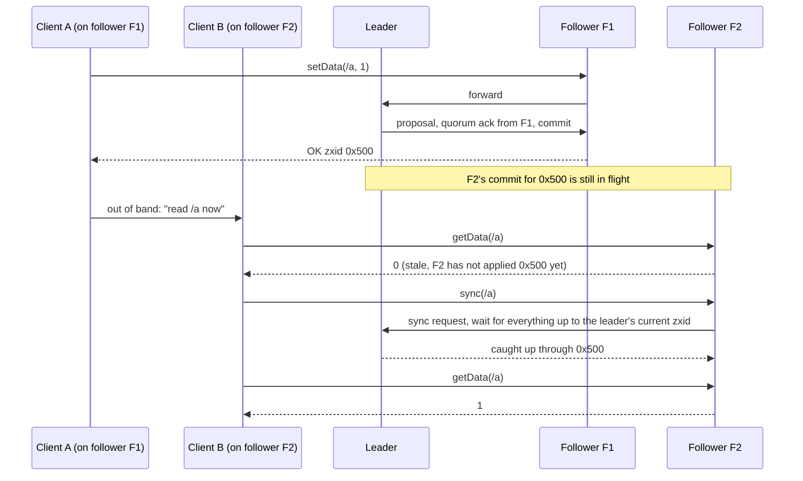

From the Internals page, verbatim in spirit:

- **Writes are linearizable**: every write takes effect atomically at some point between request and response, and all writes are totally ordered by zxid.
- **Reads are not linearizable**: a read is not a quorum operation; the server answers immediately from local state. Reads are **sequentially consistent** (respect each client's own order) and the whole model is "ordered sequential consistency", between sequential consistency and linearizability.
- **Single system image**: a client never sees an older view after failing over to another server with the same session, because the server it lands on must be at least as current as its last-seen zxid.
- **Timeliness**: a client's view is current "within a certain time bound (on the order of tens of seconds)", or the client detects an outage. That is the session timeout talking.
- **Not guaranteed**: simultaneously consistent cross-client views. Two clients on different servers can see different data at the same instant. The documented fix is exactly the diagram: `sync()` then read.

The design choice: ZooKeeper trades read freshness for read throughput, which is why the paper's read curve scales with server count while the write curve falls.

---

## 7. Under the hood: the request pipeline and Zab

```mermaid
%% One write through a follower. Reads never leave the follower. The txn log fsync is the durability point and the latency floor.
flowchart LR
    C["Client"]
    FR["Follower<br/>request processor"]
    LD["Leader<br/>PrepRequestProcessor:<br/>validate, assign zxid"]
    PROP["ProposalRequestProcessor<br/>send PROPOSE to all followers"]
    SYNC[("SyncRequestProcessor<br/>append to txn log, fsync<br/>(dedicated disk)")]
    ACK["AckRequestProcessor<br/>count ACKs, quorum = majority"]
    COMMIT["CommitProcessor<br/>send COMMIT, apply in zxid order"]
    FIN["FinalRequestProcessor<br/>apply to in-memory DataTree,<br/>fire watches, respond"]
    DT[("DataTree<br/>in memory, fuzzy snapshot<br/>every ~100k txns")]

    C -->|"write"| FR -->|"forward"| LD --> PROP --> SYNC --> ACK --> COMMIT --> FIN --> DT
    FIN -->|"response via follower"| C
    C -->|"read"| FR -->|"local DataTree"| C

    class C client
    class FR,LD,PROP,ACK,COMMIT,FIN service
    class SYNC critical
    class DT store
    classDef client   fill:#dbeafe,stroke:#2563eb,stroke-width:2px,color:#111
    classDef service  fill:#dcfce7,stroke:#16a34a,stroke-width:2px,color:#111
    classDef critical fill:#fee2e2,stroke:#dc2626,stroke-width:4px,color:#111
    classDef store    fill:#ede9fe,stroke:#7c3aed,stroke-width:2px,color:#111
```

- **zxid** is a 64-bit number: high 32 bits are the **epoch** (bumped at each new leader), low 32 bits a **counter**. Every proposal gets one, so there is a total order and no two leaders can propose the same zxid.
- **Zab active messaging** looks like two-phase commit without aborts: leader sends PROPOSE in order over FIFO TCP channels, followers append to their log, fsync, and ACK in order, leader sends COMMIT once a majority has ACKed, followers deliver in order.
- **Fuzzy snapshots**: the DataTree is dumped to disk while updates continue, which is safe because replaying the txn log on top of a fuzzy snapshot is idempotent. Snapshot after a random count in `[snapCount/2+1, snapCount]` so servers do not all snapshot at once.
- **Txn log on a dedicated device**, not just a partition. The admin guide is blunt: sharing it "can cause multi-second delays". `fsync.warningthresholdms` logs at 1,000 ms.

### 7.1 Leader activation

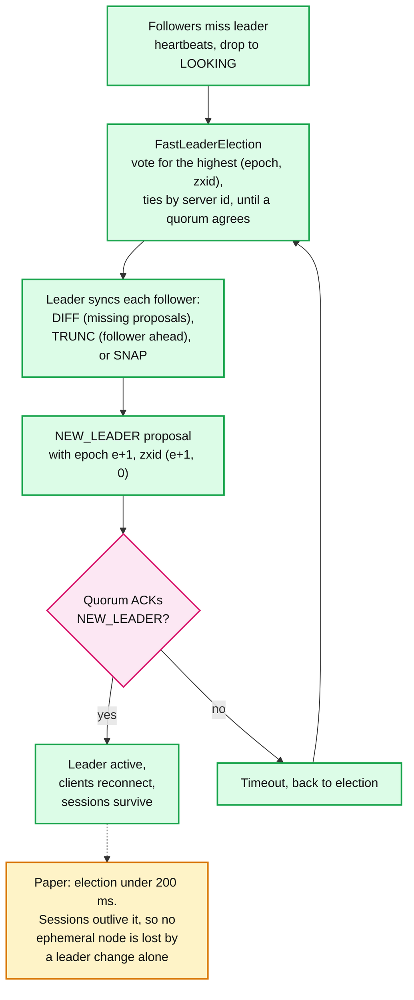

- The invariant: the new leader has the highest zxid any follower in the quorum has seen, so every committed proposal is in its log. Followers with proposals the leader never saw get truncated.
- `initLimit x tickTime` bounds how long followers get to connect and sync, `syncLimit x tickTime` how far behind a follower may fall before it is dropped. The shipped `zoo_sample.cfg` uses 10 and 5 ticks (20 s and 10 s); the admin guide's minimal example uses 5 and 2. Large trees need a larger `initLimit` because a SNAP sync ships the whole DataTree.
- **Dynamic reconfiguration** (3.5.0) changes membership at runtime through the same quorum protocol; before that it was rolling restarts.

---

## 8. Ensemble shape, observers, quorums

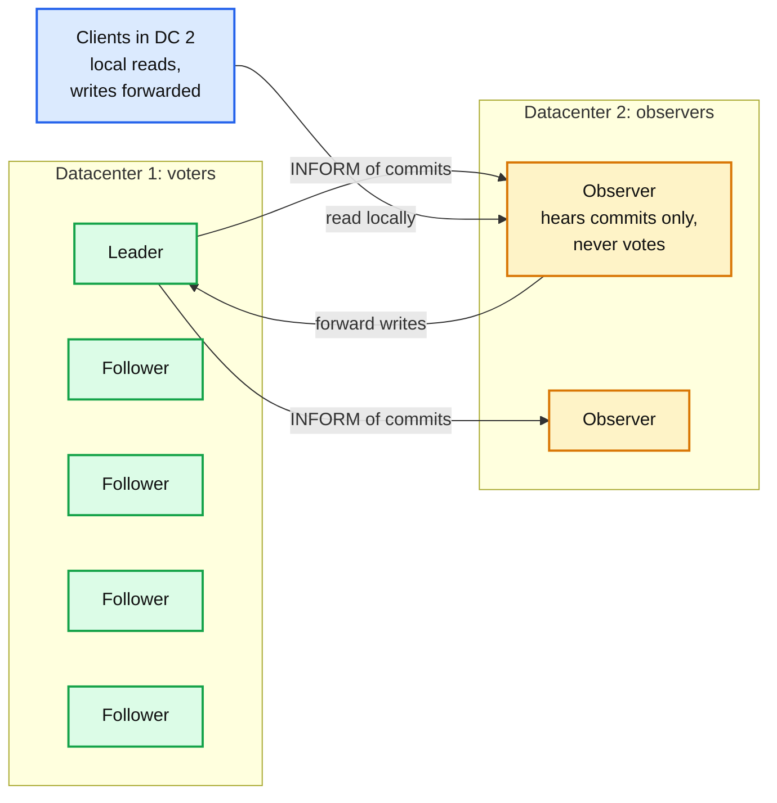

- **Odd numbers.** N voters tolerate `N/2` failures if N is odd, `N/2 - 1` if even, so 4 is no better than 3 and 6 no better than 5.
- **Three is enough, five is what you run.** The admin guide's reason is maintenance: with three, taking one down for an upgrade leaves you one failure from an outage; with five you can take one down and still tolerate one more.
- **Observers** (3.3.0) receive commits but do not vote, so they add read capacity and can sit in a second datacenter without dragging cross-DC latency into every write or causing false leader elections. They are the documented "datacenter bridge".
- **Hierarchical and weighted quorums** exist for multi-site voters, but the practical advice is: voters in one low-latency domain, observers elsewhere.
- More voters means more ACKs per write. The paper: write throughput 21k/s with 3 servers, 8k/s with 13.

---

## 9. Recipes: lock, election, and the two traps

The lock recipe from the docs, which every Curator recipe is a variation of:

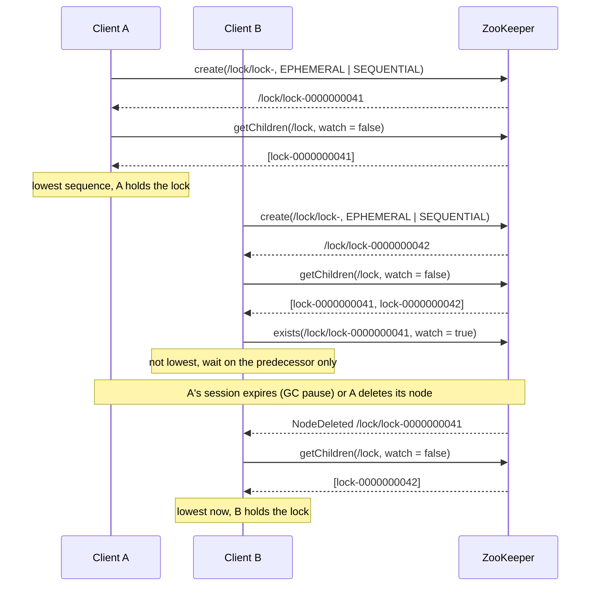

- `getChildren` **without** a watch, then `exists` **with** a watch on the next-lowest node only. One waiter wakes per release: no herd.
- **Leader election** is the same recipe with a `/election` parent; the smallest sequential ephemeral is the leader and everyone else watches the node just ahead of it.
- **Barriers, queues, two-phase commit** on the recipes page are all sequential nodes plus watches. Use Apache Curator rather than re-implementing them; its recipes handle the reconnect and retry cases.

The two traps:

1. **Recoverable errors and the GUID.** A `create` can succeed on the server while the client sees `ConnectionLoss` and never gets the returned path. Retrying creates a second lock node and the client deadlocks behind its own ghost. The docs' fix: put a client-generated GUID in the node name (`lock-<guid>-`), and on `ConnectionLoss` list the children and look for your GUID before creating again.
2. **The lock is not a fence.** A holds the lock, pauses for longer than its session timeout, ZooKeeper deletes A's ephemeral node, B takes the lock, A wakes and writes to your database. ZooKeeper cannot stop A's write. Carry the lock node's **sequence number or `czxid`** as a fencing token on every downstream write and have the downstream reject lower tokens. Same rule as etcd, see [leases-fencing-clocks.md](leases-fencing-clocks.md). HBase and HDFS both learned this the hard way (HDFS ZKFC fences the old NameNode with a separate mechanism because ZooKeeper alone cannot).

---

## 10. Failure modes and what pages you

| Failure | What happens | Detect / fix |
|---|---|---|
| Leader dies | Followers go LOOKING after missing heartbeats, election under ~200 ms in the paper, followers sync, clients reconnect. Sessions survive | `leader_changes`, 4lw `mntr` `zk_server_state`. Rare is fine |
| Client GC pause > session timeout | Session expired by the cluster, every ephemeral node gone, locks and leadership lost while the process still runs | Fencing tokens. Size the timeout to the worst pause you will tolerate (HBase: 90 s), or fix the pause |
| Client GC pause < session timeout | Session survives, nothing happens | The reason timeouts are tens of seconds, not hundreds of ms |
| Slow or shared txn log disk | Every write waits on fsync, leader misses heartbeats, spurious elections, "fsync-ing the write ahead log took Xms" warnings above 1,000 ms | Dedicated log device. `fsync_time` in `mntr` |
| Swapping | Latency goes to seconds, sessions expire in bulk | Heap under physical memory (guide: 3 GB heap on a 4 GB box), no swap |
| Follower falls behind (`syncLimit`) | Dropped from the quorum, re-syncs with DIFF or SNAP | Large trees + small `initLimit` = followers never rejoin |
| Too many children under one znode | `getChildren` response exceeds `jute.maxbuffer` (1 MB), reads of that node fail, snapshot sync slows | Bucket children (`/members/00/..`), keep names short; tens of thousands is the practical ceiling |
| Herd effect | All waiters watch one node, all wake, all call the server at once | Watch the predecessor only (section 9) |
| Missed watch | One-shot watch fired, node changed twice more before re-read | Always re-read after an event; persistent watches in 3.6+ |
| `ConnectionLoss` on create | Unknown whether the node exists | GUID in the name, list before retry |
| Too many outstanding requests | Server throttles at `globalOutstandingLimit` 1,000 across the ensemble | Back off; do not use ZooKeeper as a queue |
| Too many connections from one IP | Refused above `maxClientCnxns` 60 | Share one session per process |
| Quorum lost | Read-only at best, no writes, no session expiry processing | Restore from snapshot + logs; this is why 5 |

---

## 11. Where you meet it, and the Kafka story

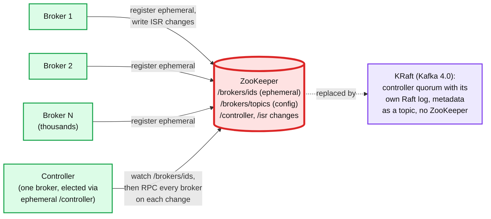

- **Kafka (until 4.0)**: broker liveness via ephemeral nodes, controller election via an ephemeral `/controller`, topic and partition metadata as znodes, ISR changes as writes. The controller watched everything and pushed metadata to every broker by RPC. At thousands of brokers and hundreds of thousands of partitions, controller failover meant re-reading all of it from ZooKeeper. KIP-500 moved metadata into a Raft-replicated log inside Kafka; 4.0.0's release notes remove ZooKeeper mode and the migration code. Interview line: ZooKeeper is fine for small, slow-changing coordination state; when the metadata itself becomes big and hot, you want a log, not a tree.
- **HBase**: master election (ephemeral `/hbase/master`), region server liveness (ephemeral per server), location of the meta region. The 90 s session timeout is tuned for GC.
- **HDFS HA**: the ZooKeeper Failover Controller (ZKFC) on each NameNode holds an ephemeral lock znode; losing it triggers failover plus an explicit fence of the old NameNode.
- **Solr Cloud, Pulsar, Flink HA, Druid**: cluster state, leader election, and config in the same pattern. ClickHouse ships **ClickHouse Keeper**, a Raft-based drop-in that speaks the ZooKeeper protocol, which tells you how sticky the API is.

---

## 12. When to use it, when not, and versus etcd

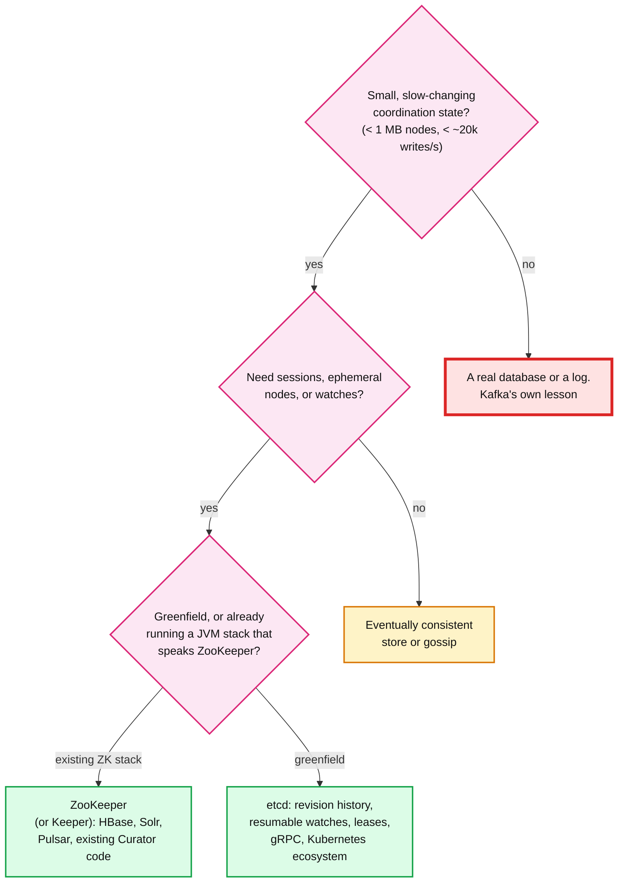

| | ZooKeeper | etcd |
|---|---|---|
| Consensus | Zab (leader, epoch + counter zxid) | Raft |
| Data model | Hierarchical znodes, one version each, 1 MB per node | Flat keys, MVCC revision history, 1.5 MiB per request |
| Liveness | Session per client, ephemeral nodes | Lease per key group, keepalive |
| Watches | One-shot doorbell, re-register, can miss intermediates | Stream from a revision, no gaps until compaction |
| Reads | Local, sequentially consistent, `sync()` for fresh | Linearizable by default (ReadIndex), serializable optional |
| Conditional write | `version` on one node, `multi` for a batch | `Txn` compare on version / revisions / value, 128 ops |
| Fencing token | Sequence number, `czxid` | `revision`, `create_revision` |
| Read scaling | Observers | More members (linearizable reads still hit the leader), or serializable reads |
| Client | Java and C, Curator on top | gRPC, every language |
| Home | Hadoop, HBase, Kafka < 4.0, Solr, Pulsar | Kubernetes, CNCF |

**Do not use it for**: application data, queues (the docs' own queue recipe is a demo), anything with large values, high write rates, or a hot metadata set that is bigger than a few hundred MB in memory. Kafka's migration is the case study.

---

## 13. Numbers worth memorizing

Defaults (Administrator's Guide and `zoo_sample.cfg`): `tickTime` **2,000 ms**; `initLimit` **10** ticks and `syncLimit` **5** ticks in `zoo_sample.cfg` (the admin guide's minimal example uses 5 and 2); session timeout negotiated between **2x** and **20x** tickTime (**4 s to 40 s**); client pings after **s/3**, switches server after **2s/3**; `jute.maxbuffer` **1,048,575 bytes** (0xfffff); `snapCount` **100,000** (random in `[snapCount/2+1, snapCount]`); `maxClientCnxns` **60** per IP; `globalOutstandingLimit` **1,000**; `preAllocSize` **64 MB**; `autopurge.snapRetainCount` **3**, `autopurge.purgeInterval` **0** (off); `fsync.warningthresholdms` **1,000**; `4lw.commands.whitelist` default **`srvr` only**; `electionAlg` **3** (TCP FastLeaderElection, default since 3.2.0); heap guidance **3 GB on a 4 GB machine**; sequential counter **10 digits**, signed 32-bit, overflows at 2,147,483,647.

Versions: observers **3.3.0**, dynamic reconfiguration **3.5.0**, container and TTL nodes **3.5.3**, persistent / recursive watches **3.6.0**, Kafka ZooKeeper mode removed in **Kafka 4.0.0**.

Paper (USENIX ATC 2010, dual-core 2.1 GHz Xeon servers, txn log on its own disk, 250 simulated clients, 1 KB writes):

| Servers | 100% reads | 100% writes |
|---|---|---|
| 3 | 87k ops/s | 21k ops/s |
| 5 | 165k | 18k |
| 7 | 257k | 14k |
| 9 | 296k | 12k |
| 13 | 460k | 8k |

Average request latency **1.2 ms** (3 servers), **1.4 ms** (9). Leader election **under 200 ms**. Reads scale with servers because they never touch Zab; writes shrink because every server must ACK.

Ensemble: N odd tolerates **N/2** failures, N even **N/2 - 1**; run **5** in production for maintenance headroom; "probably no more than 7". HBase `zookeeper.session.timeout` **90,000 ms**. Timeliness bound: "on the order of tens of seconds".

---

## 14. Interview soundbite

> "ZooKeeper is a replicated in-memory tree with sessions, ephemeral nodes, and one-shot watches on top of Zab. Writes go through one leader and are linearizable; reads are served locally by any server, so they can be stale, and I call sync before a read that must be current. Liveness is the session: the cluster, not the client, decides when a session has expired, and every ephemeral node that session created disappears at once. That gives me membership, leader election, and locks with the sequential-ephemeral recipe, where each waiter watches only the node ahead of it so there is no herd. Two things I always add: a GUID in the node name so a ConnectionLoss on create is recoverable, and the sequence number as a fencing token on downstream writes, because a GC pause longer than the session timeout hands the lock to someone else while I still think I hold it. I run five servers, transaction log on its own disk, session timeouts in the tens of seconds, and I keep the tree small: the paper's numbers are about 20k writes per second and a few hundred thousand reads, and Kafka spent five years moving off it once its metadata outgrew that."

Follow-ups an interviewer will ask, in order of likelihood:

1. What is the difference between Disconnected and Expired, and who decides? (Section 4, the cluster; ephemeral nodes go at expiry.)
2. Can a watch miss an update? (Section 5, yes between trigger and re-register, never the final state; persistent watches in 3.6.)
3. Are reads consistent? (Section 6, sequentially consistent, not linearizable; `sync()`.)
4. Walk me through the lock recipe and why it does not herd. (Section 9.)
5. Lock holder pauses for a minute. (Section 9 trap 2, fencing token; ZooKeeper cannot save you.)
6. Why did Kafka remove ZooKeeper? (Section 11, metadata size and write rate vs a single Zab leader plus watch fan-out; a log fits better than a tree.)
7. Why 5 servers, and can I put them in two datacenters? (Section 8, maintenance; voters in one DC, observers in the other.)
8. What is a zxid and what is the epoch for? (Section 7, 32 + 32 bits, no two leaders share a zxid.)
9. Create returned ConnectionLoss. Did it happen? (Section 9 trap 1, GUID in the name.)
10. ZooKeeper or etcd for a new system? (Section 12, etcd unless you already run the JVM stack that speaks ZooKeeper.)

Related: [etcd.md](etcd.md) (the modern twin, and the comparison table), [raft.md](raft.md) (Zab and Raft solve the same problem; the differences are in leader activation), [leases-fencing-clocks.md](leases-fencing-clocks.md) (why the lock needs a token), [replication-and-quorums.md](replication-and-quorums.md) (majority math), [gossip-protocol.md](gossip-protocol.md) (when agreement is not needed), `hld/distributed-job-scheduler/` (partition leases, which could equally be ZooKeeper ephemeral nodes), `popular_systems_deepdive/kafka/` (what replaced it).
