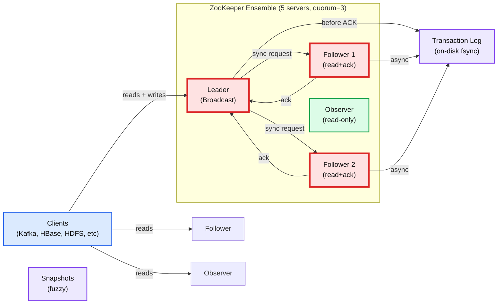

# Apache ZooKeeper: Coordination Service for Distributed Systems

## One-Line Answer
ZooKeeper is a centralized coordination service that maintains a tree of configuration state (znodes) with strong consistency guarantees and atomic operations, enabling leader election, service discovery, and distributed locks in large-scale systems like Kafka, HBase, and Hadoop.

## Data Model & Guarantees

**Znodes**: Hierarchal namespace (like files/directories). Each znode holds data (<1MB via `jute.maxbuffer=1048575` bytes) + stat metadata (czxid, mzxid, ctime, mtime, version, cversion, aversion, ephemeralOwner, dataLength, numChildren).

**Node types**:
- Persistent: survives session end
- Ephemeral: deleted when owning session expires (3.0.0+)
- Sequential: appends monotonic counter (3.0.0+)
- Container: auto-deleted if no children (3.5.3+)
- TTL: optional time-to-live in ms (3.5.3+)

**Session lifecycle**: Client negotiates timeout with server (min 2× tickTime, max 20× tickTime; defaults: min 4s, max 40s with tickTime=2000ms). Server declares session expired if no heartbeat for timeout duration → all ephemeral znodes deleted atomically.

**Watches**: One-shot triggers (not persistent) on data/children/existence changes. Ordering guaranteed: watch event fires before other clients see the change. Between trigger and re-register, data can change—clients can miss intermediate states. Persistent recursive watches added 3.6.0. Single-watcher-per-child prevents "herd effect" in lock recipes.

**Consistency model** (5 guarantees from zookeeperProgrammers.html):
1. Sequential consistency: client updates applied in order sent.
2. Atomicity: all-or-nothing, no partial updates.
3. Single system image: all clients see same view (all reads go to same server OR call sync() before read to freshen).
4. Reliability: applied updates survive across restarts.
5. Timeliness: client view "up-to-date within a certain time bound (on the order of tens of seconds)."

Reads can be stale—no read-your-write guarantee without explicit sync() call.

## Internals: Zab Protocol

**Leader election** via FastLeaderElection: each server votes based on highest zxid (transaction ID) seen + longest leader epoch. Election time: <200ms typical.

**zxid structure**: 64-bit = [32-bit epoch | 32-bit counter]. Epoch increments per leader. Counter increments per transaction. Ensures causality: higher zxid = later proposal.

**Three phases**:
1. **Discovery**: followers send to leader their max zxid; leader identifies what each follower is missing.
2. **Synchronization**: leader sends missing transactions; followers apply + ack.
3. **Broadcast**: leader proposes new requests; followers ack; leader commits when quorum acks.

**Quorum requirement**: >50% of ensemble must ack before commit. For N=5: need 3 acks. For N=4: 3 acks (can only tolerate 1 failure, not 2—use odd numbers).

**Transaction log**: leader fsyncs to disk BEFORE responding to client (critical path). Followers fsync asynchronously. Fuzzy snapshots allow snapshot during active writes.

**Observers** (non-voting nodes): replicate log but don't participate in elections. Added 3.3.0, behavior stabilized 3.4.6/3.5.0. Read-scaling without quorum expansion.

**Dynamic reconfiguration** (3.5.0+): add/remove servers via incremental config changes without full restart.

## Configuration Tuning (Defaults)

| Parameter | Default | Notes |
|-----------|---------|-------|
| tickTime | 2000 ms | heartbeat interval; all other timeouts derive from multiples |
| initLimit | 10 ticks | 20s: follower initial sync time from leader |
| syncLimit | 5 ticks | 10s: follower must ack leader proposal or follower ejected |
| minSessionTimeout | 2× tickTime (4s) | negotiated; server rejects lower |
| maxSessionTimeout | 20× tickTime (40s) | negotiated; server rejects higher |
| snapCount | 100,000 | txns before snapshot triggered |
| maxClientCnxns | 60 | connections per IP (0=unlimited, risky) |
| jute.maxbuffer | 1,048,575 bytes | max znode data + overhead |
| preAllocSize | 64 MB | transaction log pre-allocation |
| globalOutstandingLimit | 1,000 | pending requests across ensemble (throttle backpressure) |
| fsync.warningthresholdms | 1000 | log if fsync slower than this |
| autopurge.snapRetainCount | 3 | min snapshots to keep (must≥3) |
| autopurge.purgeInterval | 0 (disabled) | hours between auto-purge; set >0 in production |
| 4lw.commands.whitelist | 'srvr' | 4-letter-word: stat, ruok, mntr, srvr; new 3.5.3 (security) |

## Use Cases & Adoption

**Coordination patterns**:
- **Kafka**: pre-KRaft, broker discovery, controller election, topic config (removed 4.0+, KRaft mode self-coordinating)
- **HBase**: master election, server presence, balancer lock
- **Hadoop HDFS HA**: active NameNode election, journalnode quorum
- **Solr Cloud**: cluster state, leader election, overseer task queue
- **Pulsar**: broker discovery, partition ownership, namespace config
- **Flink**: JobManager HA, worker slot discovery
- **ClickHouse**: shard election, replica DDL coordination (prefer ClickHouse Keeper in recent versions)
- **Druid**: coordinator election, data source leadership

## Bottlenecks & Failure Modes

**Transaction log I/O**: leader must fsync before responding. Slow disk = system-wide latency hit. Dedicated log disk mandatory.

**Session expiry from GC pauses**: if full GC >session timeout, client thinks server dead; server deletes ephemeral nodes. Tune `-Xmx`, watch pause times.

**Leader election duration**: 10-200ms typical, but network partitions trigger new elections. Ensemble in same datacenter; cross-datacenter sync adds latency.

**syncLimit timeout**: if follower can't keep pace (disk, network), leader removes it from quorum. Watch logs for "FOLLOWING but failed to sync."

**Too many children on one znode**: getChildren() is O(n), blocking. Design schema to partition children across multiple parent znodes.

**No network split-brain**: quorum write-voting prevents split-brain. Partition means minority half goes read-only (no new writes). Correct design.

**Not a database**: designed for small coordination state (<1MB per znode). Do not store large objects, logs, or time-series. Will degrade under load.

## Trade-offs & Design Decisions

| Choice | Upside | Downside |
|--------|--------|----------|
| **Odd ensemble (5 not 4)** | tolerate 2 failures | 1 extra server cost |
| **Session-based ephemeral nodes** | auto-cleanup on crash | GC pauses expiry session unexpectedly |
| **Watches are one-shot** | simple API, avoid herd | must re-register, can miss state changes |
| **Quorum writes before ACK** | strong consistency, no split-brain | >50% latency added vs async |
| **Transaction log fsync** | durability from all acks | leader blocks on disk I/O (bottleneck) |
| **Fuzzy snapshots** | low snapshot overhead | recovery replays more txns (slower) |
| **Observers** | scale reads, defer quorum | adds 2-phase replication complexity |
| **Clients see stale reads** | better latency (no sync()) | app must call sync() for fresh reads |
| **No fencing tokens** | simpler design | lock recipes vulnerable to old leader writing after ejection |

## Recipes & Limitations

**Locks via sequential ephemeral nodes**: watch only next-lower node (not all), eliminating herd effect. But if not designed carefully with GUIDs and delete retries, race conditions on crash.

**Leader election**: sequential ephemeral nodes, election = lowest. Works if heartbeat independent.

**Barriers**: entry (wait all nodes created), exit (wait all nodes deleted).

**Queues**: sequential nodes read by consumers; no isolation if consumer crashes mid-process.

**2PC (two-phase commit)**: ZK can coordinate but doesn't enforce atomicity across systems. Manual undo on rollback.

**No fencing**: old leader can write after ejection if clocks skew. Use version-based fencing externally.

## When NOT to Use ZooKeeper

- **High-throughput data pipelines**: design cap at ~30k ops/sec; Kafka itself moved to self-coordinating KRaft in 4.0.
- **General-purpose databases**: <1MB znodes, no indexes, no querying.
- **Filesystem alternative**: not for large files or blobs.
- **Real-time event streaming**: latency in tens-of-seconds SLA, not milliseconds.
- **Strong cross-datacenter coordination**: network partitions trigger leader election; minority partition stops writes.
- **Replacing consensus library** (Raft, Paxos): ZK suitable for coordination state only, not arbitrary replicated state machines.

## Performance Characteristics

- **Throughput**: ~30k ops/sec with 10:1 read/write ratio on 7-machine ensemble (USENIX 2010 paper).
- **Write latency**: adds fsync delay (disk dependent, 1-10ms typical); read latency <5ms if cached.
- **Leader election**: <200ms.
- **Recovery time**: 30-60s from snapshot + transaction log replay (depends on snapshot age, txn log size).
- **Session timeout**: 2× tickTime (4s) to 20× tickTime (40s).

## Ensemble Sizing Rationale

- **3 servers**: tolerate 1 failure, sufficient for most deployments.
- **5 servers**: tolerate 2 failures, recommended for production HA during maintenance windows.
- **7+ servers**: diminishing returns; coordination overhead >benefit; use observers for read scaling.
- **Odd numbers mandatory**: even-sized ensembles cannot form quorum if split evenly.
- **Cross-datacenter**: minimum 3 datacenters for true HA; ZK designed for low-latency LANs, not WAN.

## Key Takeaway for Interviews

ZooKeeper trades throughput for consistency and simplicity. Pick it when:
- You need distributed coordination (elections, locks, config broadcast).
- Your state fits in memory and is <few GB.
- You can tolerate tens-of-seconds for changes to propagate.
- Operational complexity of dedicated consensus servers is acceptable.

Reject it for storage, high-QPS data serving, or scenarios needing sub-second consistency.

---

**Primary sources cited:**
- https://zookeeper.apache.org/doc/current/zookeeperProgrammers.html
- https://zookeeper.apache.org/doc/current/zookeeperAdmin.html
- https://zookeeper.apache.org/doc/current/zookeeperInternals.html
- https://zookeeper.apache.org/doc/current/recipes.html
- https://zookeeper.apache.org/doc/current/zookeeperOver.html
- https://github.com/apache/zookeeper/blob/master/conf/zoo_sample.cfg
- Verified against Kafka, HBase, Hadoop, Solr, ClickHouse, Pulsar documentation
