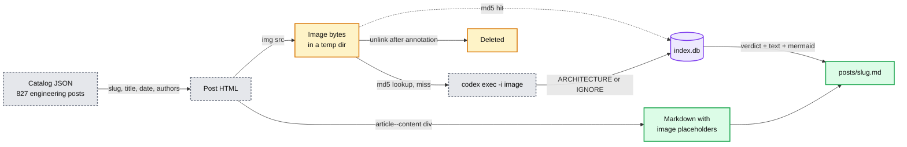

# Databricks engineering blog harvest

Study material pulled from the Databricks engineering blog. Every post becomes one
markdown file, and every architecture image in it becomes text plus a Mermaid diagram
(colored with the repo legend), so the whole thing is greppable and renders in GitHub.

```
databricks/
  harvest.py          the tool (stdlib only, shells out to the Codex CLI)
  classify.py         Codex pass: TECHNICAL vs MARKETING, moves marketing posts out of posts/
  rank.py             Codex pass: 0-5 Staff-interview score, topic, question per technical post
  interview-picks.md  hand-curated study guide: 13 case studies, 11 deep dives, patterns, mock questions
  staff-interview.md  generated table of every post scoring 3+, grouped by topic
  index.db            sqlite: posts, images, post_images, interview (scores)
  index.md            generated table of every technical post (newest first)
  marketing.md        the 176 posts classified as marketing, with reasons
  posts/<slug>.md     one file per technical post
  marketing/<slug>.md one file per marketing post
```

Start with `interview-picks.md`.

## How it works



- **Listing.** The blog's category filter is client-side. The page loads
  `/en-blog-assets/data/blog/posts/engineering.json` (every post in the category, 2013 to
  today) and filters on the `categories=` query param. `harvest.py` reads the same file, so
  it never needs to paginate and gets title, subtitle, ISO date, authors and categories for free.
- **Body.** The `article--content` div is converted to markdown with a small
  `html.parser` subclass. Headings, lists, links, code, tables and figures are kept.
- **Images.** Each `` becomes a `{{IMG:n}}` placeholder. Obvious decoration (logos, icons,
  svg, gif, anything under 150 px) is dropped without a model call. The rest are downloaded to a
  temp dir and sent one at a time to `codex exec -i <file>` with a prompt that asks for a first
  line of `ARCHITECTURE` or `IGNORE`, then summary, components, flows, numbers and a Mermaid
  block. `IGNORE` images are removed from the markdown. Image files are deleted once annotated.
- **Cache.** Verdicts are stored by image MD5 in `index.db`, so a rerun (or a second post that
  reuses the same image) costs nothing. Failed annotations are not cached, so they retry.

This mirrors `CodexAnnotator` in VQTS-Python (`doc_pipeline/annotation/image_annotator.py`):
one ephemeral Codex turn per image, verdict on the first line, MD5 cache, rate-limit retry.
The difference is transport: `codex exec` per image instead of a long-lived `codex app-server`.

## Running it

```bash
python3 databricks/harvest.py --since 2026-08            # recent posts only
python3 databricks/harvest.py --since 2025 --limit 20    # a bounded batch
python3 databricks/harvest.py                            # everything (827 posts, hours of codex)
python3 databricks/harvest.py --skip-codex               # markdown only, images left as links
python3 databricks/harvest.py --force --slug <slug>      # redo one post
python3 databricks/harvest.py --validate-mermaid         # render every diagram with mermaid-cli
python3 databricks/harvest.py --list                     # what is in index.db
python3 databricks/classify.py                           # technical vs marketing (codex, ~20 min)
python3 databricks/rank.py                               # interview score per technical post (codex, ~20 min)
python3 databricks/rank.py --write-only --min-score 4    # regenerate staff-interview.md, tighter cut
```

Reruns are incremental: posts already in `index.db` are skipped unless `--force`.
Useful knobs: `--effort low|medium|high` (Codex reasoning), `--max-workers 3`
(parallel codex processes), `--timeout 240`, `--model`.

Requirements: Python 3.11+, the `codex` CLI on PATH and logged in. `--validate-mermaid`
uses `mmdc` if present, else `npx -y @mermaid-js/mermaid-cli`.

## Keeping it up to date

Every stage is incremental: `harvest.py` skips slugs already in `index.db`, and image
verdicts are cached by MD5, so re-running costs nothing for what is already done.

```bash
python3 refresh.py --dry-run     # what is new on both blogs, spends nothing
python3 refresh.py               # fetch it and run the whole chain
python3 refresh.py --only databricks # this blog only
```

`refresh.py` (repo root) exists because the stages have one working order: `harvest.py`
writes an `index.md` of every post it knows, and `classify.py` rewrites that same file to
technical posts only, so classify has to run after harvest or the marketing posts come back.

Two failure modes to know about:

- An image that fails to download or annotate is recorded in `index.db` with its reason, and
  the post is still marked done, so a normal rerun skips it. `--retry-failed` re-processes
  those posts. Some failures are permanent, such as the two posts here whose diagrams were
  hosted on `lh7-us.googleusercontent.com` and now 403, so this is an occasional opt-in pass
  rather than part of the default chain.
- A post edited upstream after harvest is not refetched. Use `--force --slug <slug>` for that.

## Querying the index

```bash
sqlite3 databricks/index.db "select published, title from posts order by published desc limit 10"
sqlite3 databricks/index.db "select verdict, count(*) from images group by verdict"
sqlite3 databricks/index.db "select slug, arch_count from posts where arch_count >= 3 order by arch_count desc"
sqlite3 databricks/index.db "select score, topic, question from interview join posts using(slug) where score = 5"
```

## Gotchas found while building it

- `codex exec` appends piped stdin to the prompt and blocks until EOF. Run it with
  `stdin=DEVNULL` or every call hangs to the timeout.
- `?page=N` on the listing URL is ignored when `categories=` is present. Server-side
  pagination only exists for the unfiltered category URL. Use the catalog JSON instead.
- The `text-blog-summary` class also appears inside inline `<style>`; anchor the regex on
  `<div class="` or you scrape CSS.
