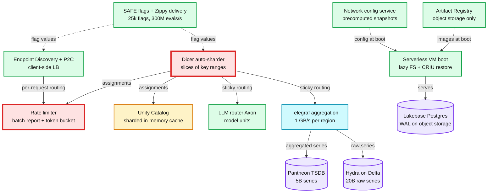

# Staff interview picks from the Databricks engineering blog

**One line:** of 651 technical posts, about 30 describe a real system with named components,
numbers, a rejected alternative and a failure story. Those are the ones worth drilling; the rest
are tutorials or feature notes. This file is the hand-curated list. The full Codex-scored table
(220 posts scoring 3+) is in `staff-interview.md`, and the verdicts live in `index.db` (`interview` table).

Scoring was done by Codex (`rank.py`), then I read the top tier and re-ranked by hand.
Links go to the harvested markdown under `posts/`; each has the source URL at the top.

## How the systems fit together

Most of the strong posts describe pieces of one internal platform. Knowing how they compose
is itself a Staff-level answer ("how would you build the control plane for a multi-cloud
serverless data platform?").



Dicer is red because four other systems depend on its assignments; the rate limiter is red
because it sits on every request path. Both posts spend their trade-off sections on exactly that.

## Tier 1: full case studies (could be the interview question itself)

| # | Post | Interview question it answers | Design in one line | Numbers to quote | The trade-off they made |
|---|---|---|---|---|---|
| 1 | [Open sourcing Dicer](posts/open-sourcing-dicer-databricks-auto-sharder.md) (2026) | Design an auto-sharding layer for stateful services that survives restarts, autoscaling and hot keys | Hash keys to SliceKeys, group into Slices (ranges), an Assigner service moves/splits/replicates slices; Slicelet (server) and Clerk (client) cache the assignment locally, load reported off the hot path | UC cache hit 90-95%; query orchestrator availability dips eliminated; Softstore hit rate 85% vs 54% during rolling restart thanks to state transfer; 99.9% of restarts are planned | Assignments are eventually consistent: availability and fast recovery over strong key ownership. Stateful sharded services beat stateless + Redis on latency, CPU and overread. See `concepts/sharding.md` |
| 2 | [High performance rate limiting](posts/high-performance-ratelimiting-databricks.md) (2025) | Design a distributed rate limiter with no SPOF and sub-ms client cost | Envoy + Redis (SPOF, 10-20 ms p99 hop) replaced by in-memory counting on Dicer-sharded servers; clients do optimistic local counting and batch-report every 100 ms; server replies with rejectTilTimestamp; token bucket instead of fixed window | 10x tail latency win; 500+ fanout calls per batch collapsed by grouping descriptors per Dicer replica; ~5% over-limit tolerated | Accuracy for scalability: enforcement is fuzzy by design. Three rejected options (prefetch, blocking batch, sampling) and why. Migration done in two independent steps with a traffic simulator. See `concepts/rate-limiting-and-load-shedding.md` |
| 3 | [High-availability feature flagging (SAFE)](posts/high-availability-feature-flagging-databricks.md) (2026) | Design a global feature flag / dynamic config system that must be up when everything else is down | Jsonnet DSL in the monorepo, PR-reviewed, compiled to a boolean expression tree; SDK pre-evaluates static dimensions (cloud, region, env) at load and evaluates only runtime dimensions per call; Zippy global to regional to pod delivery | 25k flags, 4k flips/week, 300M evals/s, p95 ~10 us, 3-5 min propagation | Fail static: keep serving last snapshot. Layered fallbacks: operator push to backend, push to regional, cold-start bundle via artifact registry (hours stale, but boots). SDK never throws, fails open to the code default |
| 4 | [Object Storage + WAL: Lakebase](posts/object-storage-wal-lakebase-postgres-agentic-era.md) (2026) | Design a cloud-native Postgres with instant branching, point-in-time restore and scale-to-zero | Compute is stateless Postgres; safekeepers replicate WAL with Paxos quorum (commit point); pageservers materialize pages at any LSN, async; object storage holds immutable image and delta layers; a persistent (copy-on-write) BST finds the covering layer per LSN | 8 KB pages; tens of millions of layers; branch of a 2 TB DB in seconds; suspend after 5 min idle, resume in hundreds of ms | Extra network hop on commit is the same hop synchronous replication already pays. Queries never read object storage directly (RAM, NVMe, pageserver first). Companion posts: [5x faster writes](posts/how-lakebase-architecture-delivers-5x-faster-postgres-writes.md) (drop full-page writes, 94% less WAL), [compute cache](posts/improving-lakebase-postgres-compute-cache.md) (hit rate 70% to 99%), [autoscaling](posts/autoscaling-lakebase-postgres.md). See `hld/kv-store-wal`, `concepts/replication-and-quorums.md` |
| 5 | [Lakebase resilient to cloud failures](posts/how-lakebase-architecture-stays-resilient-cloud-failures.md) (2026) | How do you keep a serverless database available when the cloud provider is failing | Stateless compute on zone-redundant storage; control plane split so start/suspend is its own hot-path service; own virtualization layer on pooled bare metal so no cloud control plane on the critical path; region built from identical cells | Tens of millions of DB starts/day; 90% of sessions under 10 min; May 2026 AZ incident hit 1 of 8 cells so ~13% of DBs; target 30 s max outage; per-database 99.99% attainment published monthly | "Control plane is the new data plane" for agent workloads. Measure per-database availability, not fleet averages. Chaos tests with SqlLancer verifying correctness, not just liveness |
| 6 | [10 trillion samples a day](posts/10-trillion-samples-day-scaling-beyond-traditional-monitoring-infra-databricks.md) (2026) | Design a metrics platform for 70 regions on 3 clouds that must not fly blind during incidents | Pantheon (Thanos fork): two receive groups with 2 h vs 30 min memory retention, 3 isolated StatefulSets for quorum writes, only 2 of 3 upload to object store; Telegraf + Dicer sticky aggregation strips pod labels; Hydra keeps raw high-cardinality series in Delta with PromQL-to-SQL | 5B active series, 10T samples/day, 160 instances, largest 300M series and 1k PromQL QPS; aggregation absorbed a 2-5x surge so TSDB saw 20%; Hydra 50x cheaper, 5 min freshness | Cardinality shield removes exactly the labels you need in an incident, so keep two stores with one metric interface. Rejected Kafka for aggregation state (cost and delay). See `concepts/time-series-db.md` |
| 7 | [Network config delivery to tens of millions of VMs](posts/databricks-network-configuration-delivery-tens-millions-serverless-vms.md) (2026) | Fix a control-plane call on the boot critical path that fans out to N upstream services | Upstream services emit change events (ids only) to a queue; per-partition event manager recomputes the workspace snapshot; serving path is one storage read; periodic reconciler catches missed events | p99 5,000 ms to 125 ms; 99.8% to 99.99%; 86% fewer upstream calls; billions of req/day | Chose eventual consistency plus reconciler over synchronous correctness. Static stability: serve last snapshot during upstream outage. Compound availability of services in series is the bottleneck to name |
| 8 | [Intelligent Kubernetes load balancing](posts/intelligent-kubernetes-load-balancing-databricks.md) (2025) | Why does kube-proxy fail for gRPC and what do you build instead | L4 picks a pod once per HTTP/2 connection, so load skews. Built an xDS Endpoint Discovery Service watching EndpointSlices; Scala RPC client does per-request P2C and zone affinity with spillover; same EDS feeds Envoy ingress | ~20% fewer pods; per-pod QPS 200-550 flattened; P90 stabilised | Rejected headless services (no weights, DNS staleness, no metadata) and Istio (sidecar cost, ops burden, small team, Scala monorepo). Lesson: CPU-based routing failed, trailing signal; use health and in-flight count. Cold-start needed slow-start ramp |
| 9 | [Booting VMs 7x faster](posts/booting-databricks-vms-7x-faster-serverless-compute.md) (2024) + [Artifact Registry](posts/downloading-tens-millions-container-images-daily-serverless-optimized-artifact-registry.md) (2025) | Design serverless compute that is warm in seconds at millions of VMs/day | Trimmed OS; lazy container FS (overlaybd, 4 MB blocks, fetch on first read); CRIU-style checkpoint of the warmed JVM, restored per signature (DBR version, heap, ISA); registry rebuilt with object storage as the only dependency, in-memory caches, cross-region failover | 7x boot; only 6.4% of image bytes needed to start; tens of millions of compute minutes/day saved; registry p99 down 90%, CPU down 80%, 100x burstier than internal traffic | Checkpoints created on demand when a new signature appears rather than enumerating the matrix. RNG reseeding and wall-clock jump on restore. Registry: minimal components equals minimal failure modes; regional failover trades latency and egress. See `concepts/serverless-architecture.md` |
| 10 | [Reliable LLM inference at scale](posts/reliable-llm-inference-scale.md) (2026) + [Superhuman 200K QPS](posts/how-superhuman-and-databricks-built-200k-qps-inference-platform-together.md) (2026) | Design a multi-tenant LLM serving platform with latency SLOs under spiky, variable-cost load | "Model units" abstract capacity (cost = f(input, output tokens), coefficients benchmarked per model and GPU); Dicer routes on model-unit load with sticky sessions; autoscaler on model-unit utilization; prioritized black-box health checks catch silent hangs | 125T tokens/month, 230k QPS peak; 80% GPU saved vs static; false liveness kills from several/week to zero; 3x RPS after fixing OMP_NUM_THREADS and PIL image processing; Superhuman 200K QPS, p99 350 ms, 750 to 1,200 QPS per H100 pod (FP8 30%, multiprocess 20%) | P2C is not enough when misrouting one long-context request is expensive; route on estimated cost. Asymmetric autoscaling (fast up, slow down). Health checks at highest scheduling priority so they do not time out under load |
| 11 | [Zerobus ingest: 12 GB/s to one table](posts/ingesting-milky-way-petabyte-scale-zerobus-ingest.md) (2026) | Design a serverless streaming ingest that autoscales without static partitions | Ordering guaranteed per stream connection, not per partition, so pods can be added and drained; gRPC bidi stream with async highest-committed-offset acks from a WAL; zero-copy protobuf parser (Rust) at 1 GB/s per core | 1 PB in 24 h, 12M rows/s sustained, 2,048 producers; zeroparser 2.29M rows/s per core vs 1.69M for C++ codegen | Kafka couples parallelism and ordering to partition count, which cannot shrink. Moving the ordering unit to the connection buys scale-down. See `hld/streaming-ingestion` |
| 12 | [Real-Time Mode architecture](posts/breaking-microbatch-barrier-architecture-apache-spark-real-time-mode.md) (2026) + [Feature Store sub-second freshness](posts/how-databricks-feature-store-serves-features-sub-second-freshness.md) (2026) | How do you get millisecond latency from a microbatch engine without losing exactly-once | Smaller batches hit a floor (fixed cost per batch: offset log, state upload, planning). Instead: long epochs as checkpoint intervals, concurrent stages with streaming shuffle, non-blocking operators. Feature store: Kafka to RocksDB rolling window to Lakebase JDBC sink | Latency floor at 2,500-row batches was 2,400 ms; RTM 9 ms vs Flink 95 ms on enrichment; feature freshness p99 200 ms; replay at most 5 min on failure | Amortize checkpoint cost over a longer interval and pay it back as replay volume. Rolling windows cost more updates than tumbling but every event moves the served value. See `concepts/stream-processing.md`, `concepts/exactly-once.md` |
| 13 | [Delta Lake transaction log](posts/2019-08-21-diving-into-delta-lake-unpacking-the-transaction-log.md) (2019) + [Transactional writes to cloud storage](posts/2017-05-31-transactional-writes-cloud-storage.md) (2017) | Give ACID to a data lake on object storage that has no rename atomicity | Ordered JSON commits in `_delta_log`, checkpoint every 10 commits, optimistic concurrency with conflict detection and retry, time travel by replay | Petabyte tables; thousands of commit files | Mutual exclusion on commit is the only strong point; readers are snapshot-isolated. Compare to Iceberg. See `hld/delta-lake-transactions` |

## Tier 2: one component or one decision, still worth 20 minutes each

| Post | Reuse it for | Key numbers |
|---|---|---|
| [Versionless Spark for 2B workloads](posts/examining-versionless-apache-sparktm-ai-powered-upgrades-and-seamless-stability-2-billion.md) (2025) | Auto-upgrade with fingerprinting, anomaly detection, automatic rollback and pinning. The "migration with rollback" section of any HLD | 2B workloads, 99.99% success, 0.000006% auto-rollbacks, 12-day remediation |
| [Scalable Kubernetes upgrade using operators](posts/scalable-kubernetes-upgrade-using-operators.md) (2022) | Declarative, idempotent reconciliation across thousands of clusters; PDB-aware draining | 3 clouds, 4 operators, 95% of alerts self-recover |
| [Keeping GPUs reliable](posts/how-we-keep-gpus-reliable-across-databricks-ai.md) + [Fault-tolerant PyTorch training](posts/fast-fault-tolerant-pytorch-training-ai-runtime.md) (2026) | Failure math at scale and layered health checks (crash vs silent slowdown vs corruption); async distributed checkpoints | 1% annual GPU failure means 57% chance of a failure in 30 days on 1,024 GPUs; checkpoint 36 s vs 66 s; recovery 9 s vs 522 s |
| [AI incident investigation](posts/how-databricks-uses-ai-accelerate-incident-investigation.md) (2026) | Operability story: team-owned runbooks, deterministic checks before LLM synthesis, evidence links | 1,500 k8s clusters, 70+ regions, 2,000 investigations/day |
| [Debugging 1000s of databases with AI](posts/how-we-debug-1000s-databases-ai-databricks.md) + [Scaling database reliability](posts/databricks-databricks-scaling-database-reliability.md) (2025) | Multi-cloud control plane with regional data locality and 8 regulatory domains; CI-time query scoring | thousands of OLTP instances, 90% less debug time, 99.95% SLA gate |
| [Async state checkpointing](posts/2022-05-02-speed-up-streaming-queries-with-asynchronous-state-checkpointing.md) (2022) + [Sub-second latency](posts/latency-goes-subsecond-apache-spark-structured-streaming.md) (2023) + [Stateful pipeline improvements](posts/deep-dive-latest-performance-improvements-stateful-pipelines-apache-spark-structured-streaming.md) (2024) | Move offset and commit persistence off the critical path; changelog checkpointing; bounded state memory | 700-900 ms to 150-250 ms; up to 25% task time saved |
| [High-bandwidth BI connectivity](posts/2021-08-11-how-we-achieved-high-bandwidth-connectivity-with-bi-tools.md) (2021) | Coordinator bottleneck for large result sets: spill to cloud storage, presigned URL chunks, hybrid small/large path | 12x throughput, 40 to 470 MB/s, 100 MB spill threshold, 20 MB chunks. See `concepts/signed-url.md` |
| [Spark Connect](posts/2022-07-07-introducing-spark-connect-the-power-of-apache-spark-everywhere.md) (2022) | Decouple client from engine: unresolved logical plan over gRPC, Arrow results, per-tenant isolation and independent upgrades | none, architecture only |
| [Runbot CI](posts/2021-10-14-developing-databricks-runbot-ci-solution.md) (2021) | Replacing a single stateful master (Jenkins) with a stateless service over a database; why complexity blocked improvement | 150+ GB master memory, 100-200 workers, 500 runs/day |
| [Adaptive Query Execution](posts/2020-05-29-adaptive-query-execution-speeding-up-spark-sql-at-runtime.md) (2020), [Dynamic file pruning](posts/2020-04-30-faster-sql-queries-on-delta-lake-with-dynamic-file-pruning.md) (2020), [Catalyst](posts/2015-04-13-deep-dive-into-spark-sqls-catalyst-optimizer.md) (2015), [Tungsten](posts/2015-04-28-project-tungsten-bringing-spark-closer-to-bare-metal.md) (2015) | Query engine fundamentals if the interviewer goes there: replan at shuffle boundaries, skew joins, min/max skipping, whole-stage codegen | AQE up to 8x; DFP 8.6B rows to 66M |
| [H3 geospatial](posts/2023-01-12-supercharging-h3-geospatial-analytics.md) (2023) | Point-in-polygon at scale via hierarchical hex index and compaction | 1.22B joins in 1.4 min on 10 workers. See `concepts/geospatial-index.md` |

Posts the model scored 3 that I would promote if you have time: [Delta DML internals](posts/2020-09-29-diving-into-delta-lake-dml-internals-update-delete-merge.md), [Watermarking deep dive](posts/feature-deep-dive-watermarking-apache-spark-structured-streaming.md), [State rebalancing](posts/state-rebalancing-structured-streaming.md), [Optimized autoscaling](posts/2018-05-02-introducing-databricks-optimized-auto-scaling.md), [GDPR right to be forgotten in Delta](posts/2022-03-23-implementing-the-gdpr-right-to-be-forgotten-in-delta-lake.md), [Admin isolation on shared clusters](posts/admin-isolation-shared-clusters.md).

## Patterns that repeat across the posts

These are the reusable moves. If you can say "Databricks did X, here is the number", it lands.

1. **Stateful and sharded beats stateless plus remote cache.** Dicer's thesis: every request paying a network hop, serialization and overread to Redis is the hidden tax. Unity Catalog went from a DB call per request to 90-95% local hits.
2. **Precompute, snapshot, serve, reconcile.** Network config (5 s to 125 ms) and SAFE both move aggregation off the critical path and add a low-frequency reconciler as the safety net for missed events.
3. **Fail static.** SAFE, network config and Lakebase all keep serving the last known good state during upstream outages. Add a cold-start bundle so a fresh process can boot with no live dependency.
4. **Commit on quorum, materialize async.** Lakebase commits when safekeepers ack the WAL; pages and object-store uploads happen later. Zerobus acks the highest committed offset from its WAL before writing Delta.
5. **Cells for blast radius.** One AZ failure hit one of eight cells, so 13% of databases. Regional deployments become N identical cells and you route new tenants to a fresh cell when one nears limits.
6. **Client-side batch reporting with optimistic enforcement.** Rate limiter clients allow by default, count locally, report every 100 ms. Trade a bounded over-limit (5%) for zero remote calls on the hot path.
7. **Per-request L7 balancing with P2C, then cost-aware when requests are not uniform.** kube-proxy skews gRPC; P2C fixes it for CPU services; LLM serving needs model units because one long-context request can be 50 cheap ones.
8. **Asymmetric autoscaling and slow start.** Scale up fast, scale down slowly, ramp new pods. Every serving post repeats it.
9. **Lazy load and checkpoint/restore.** 6.4% of image bytes are needed to start; restore a warmed JVM instead of warming it again.
10. **Minimal dependencies.** Artifact Registry has one component and one dependency (object storage). Lakebase pools bare metal and runs its own virtualization to keep cloud control planes off the start path.
11. **Two stores, one interface.** Aggregated series in the TSDB for alerts, raw series in the lakehouse for incidents, same PromQL on both.
12. **Measure the customer's view.** Per-database availability attainment, not fleet averages. Chaos tests verify correctness (SqlLancer), not only that the process is up.

## Mock questions to practice with these

| Question | Drill posts | What the interviewer is probing |
|---|---|---|
| Design a feature flag service for 500 services across 3 clouds | 3 | What happens when the flag service is down; propagation vs consistency; review and blast radius controls |
| Design a rate limiter for a multi-tenant API gateway at 1M QPS | 2, 1 | SPOF in Redis; where counting happens; accuracy tolerance; migration plan |
| Design a serverless Postgres with branching and scale to zero | 4, 5 | Where the commit point is; read path caching; why S3 latency is not on the query path; failover |
| Design a metrics platform for 5B series | 6 | Cardinality; tiered retention; quorum writes across StatefulSets; the debugging use case aggregation breaks |
| A boot-time RPC fans out to 6 services and has 5 s p99. Fix it | 7 | Precompute vs cache; consistency model; reconciler; static stability |
| Why is service-to-service gRPC latency uneven on Kubernetes? | 8 | L4 vs L7; P2C; rejected Istio; cold start |
| Design serverless compute that is ready in 5 seconds | 9 | Image pull, JVM warm-up, checkpoint compatibility, registry as a dependency |
| Design an LLM serving platform with per-customer latency SLOs | 10 | Capacity abstraction; routing on cost; health checks that survive overload; GPU blast radius |
| Design Kafka without static partitions | 11 | Ordering unit; scale-down; acks and client buffers |
| Get a stream pipeline from seconds to 10 ms without a new engine | 12 | Fixed cost per batch; concurrent stages; replay trade-off |
| Give ACID to Parquet on S3 | 13 | Atomic commit without rename; optimistic concurrency; snapshot isolation |

## Rebuilding this

```bash
python3 databricks/rank.py                 # score any unscored technical posts, rewrite staff-interview.md
python3 databricks/rank.py --write-only    # rewrite the table only
sqlite3 databricks/index.db "select score, topic, title from interview join posts using(slug) where score >= 4 order by score desc"
```
