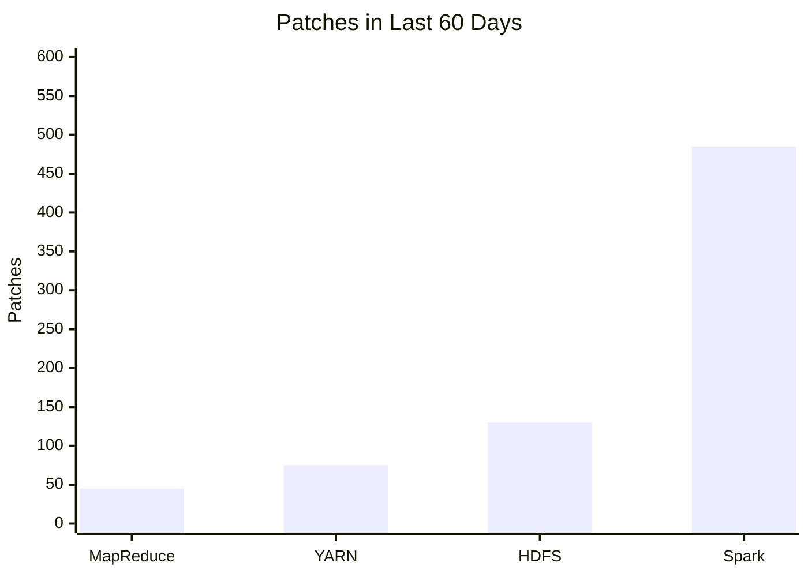

# Announcing Apache Spark 1.0

- Source: https://www.databricks.com/blog/2014/05/30/announcing-spark-1-0.html
- Published: 2014-05-30
- Authors: Patrick Wendell
- Categories: engineering, open-source
- Images: 1 total, 1 extracted as architecture

Today, we’re very proud to announce the release of [Apache Spark 1.0](https://spark.apache.org/releases/spark-release-1-0-0.html). Apache Spark 1.0 is a major milestone for the Spark project that brings both numerous new features and strong API compatibility guarantees. The release is also a huge milestone for the Spark developer community: with more than 110 contributors over the past 4 months, it is Spark’s largest release yet, continuing a trend that has quickly made Spark the most active project in the Hadoop ecosystem.

## New Features

What features are we most excited about in Apache Spark 1.0? While there are dozens of new features in the release, we’d like to highlight three.

**Spark SQL**

The biggest single addition to Apache Spark 1.0 is Spark SQL, a new module that [we’ve previously blogged about](https://www.databricks.com/blog/2014/03/26/spark-sql-manipulating-structured-data-using-spark-2.html). Spark SQL offers integrated support for SQL queries alongside existing Spark code, making it seamless to write applications that load structured data (from sources like Hive and Parquet) and run advanced analytics or ETL. Spark SQL will also be the backend for future versions of Shark, providing a simpler, more agile, and optimized execution engine.

**Management and Deployment**

Apache Spark 1.0 also includes major improvements to management and deployment. It adds full support for the Hadoop/YARN security model, running seamlessly in secured Hadoop clusters. It also drastically simplifies job submission, allowing users to easily deploy the same application and on a single machine, a Spark cluster, EC2, Mesos, or YARN. Packaging and deploying a Spark app has never been easier!

**Java 8 API**

Spark’s Java API has been extended to support Java 8 lambda expressions, allowing much more concise programming for users of Java 8. Spark still supports Java 6 and 7 through the older API.

## Community Growth

We are especially excited about the continued growth of the Spark community. Apache Spark 1.0 is the work of more than 110 individuals over the past 4 months, the most to ever contribute to a Spark release. More impressively, the rapid growth in the community has now made Spark the most active project in the Hadoop ecosystem by a wide margin, and one of the most active projects at Apache. This rapid pace of innovation allows us add features, stability improvements, optimizations and fixes at an unprecedented rate.

 

**Summary:** The chart compares patches delivered by MapReduce, YARN, HDFS, and Spark over the last 60 days.

**Components:**

- MapReduce
- YARN
- HDFS
- Spark

**Flows:**

- none

**Numbers:** 0, 100, 200, 300, 400, 500, 600, 60 days

source image: https://www.databricks.com/wp-content/uploads/2014/05/chart2.png

After the 1.0 release, Spark will target a quarterly cadence for minor releases (1.1, 1.2, 1.3) and will continue to make maintenance releases as-needed to provide stable versions to users.

 

## Databricks’ Commitment to Open Source

At Databricks, we are proud to do all our Apache Spark development in the open -- every new feature and improvement we have made to Spark has been open source. Many of our distribution partners are quickly moving to include 1.0 -- for example, Apache Spark 1.0 will appear in CDH 5.1 in June.

## More Information

This post has only scratched the surface: Apache Spark 1.0 includes dozens of features not mentioned here, including major improvements to MLLib, GraphX, and Spark Streaming. Head over to the official release notes for a longer write-up. Over the next few weeks, we’ll also be writing more blog posts on select new features here.

Finally, if you would like to learn more about Apache Spark or see how it is being used, join us at the [Spark Summit](https://www.databricks.com/dataaisummit) on June 30th--July 2nd. With over 50 talks from organizations using Spark and a full day of training, the Summit will be the largest Spark community event yet.
