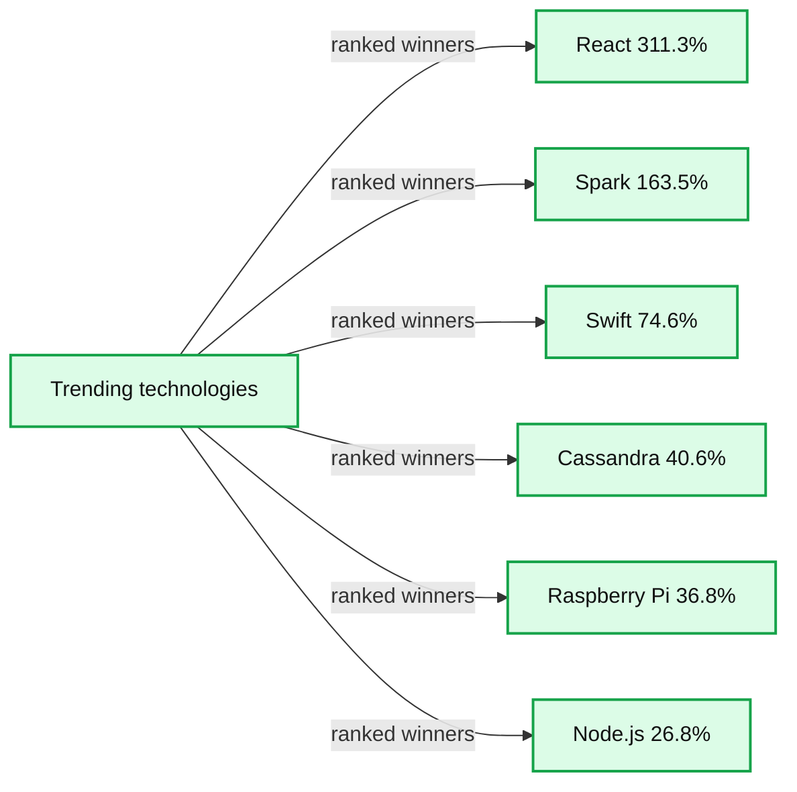
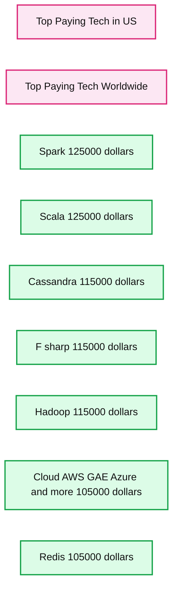
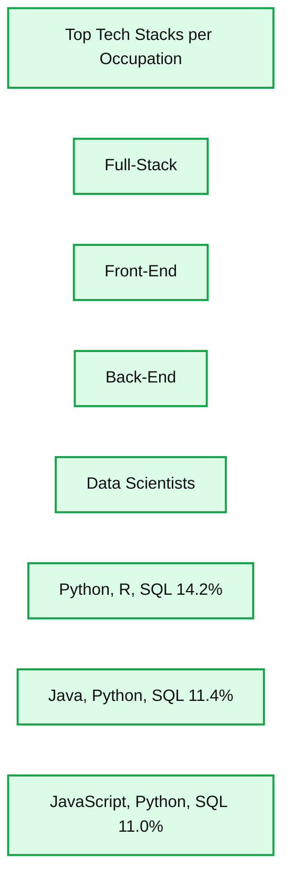

# Apache Spark Trending in the Stack Overflow Survey

- Source: https://www.databricks.com/blog/2016/03/22/apache-spark-trending-in-the-stack-overflow-survey.html
- Published: 2016-03-22
- Authors: Reynold Xin
- Categories: solutions, engineering, open-source
- Images: 4 total, 3 extracted as architecture

*Free Edition has replaced Community Edition, offering enhanced features at no cost. Start using *[*Free Edition *](https://login.databricks.com/?intent=SIGN_UP&amp;signup_experience_step=EXPRESS&amp;provider=DB_FREE_TIER&amp;dbx_source=www)*today.*
 

Last week, Stack Overflow [released the result of their 2016 developer survey](https://insights.stackoverflow.com/survey/2016). This is one of the most significant surveys in the field with responses from 56,033 engineers across 173 countries. A few things from this survey caught my eye:

1. Apache Spark is the second most trending technology, only after React.
2. Apache Spark is the top paying tech.
3. Equally interesting is that 5 out of the top 7 top paying techs are data and cloud computing related.
4. Python, R, and SQL are the top tech stack for data scientists.
5. Vim is a lot more popular than emacs (ok just kidding).

I've included a few charts from the survey for discussion below:

**Summary:** The chart ranks trending technologies on Stack Overflow, with React leading and Spark second.

**Components:**

- Winners tab
- Losers tab
- React
- Spark
- Swift
- Cassandra
- Raspberry Pi
- Node.js

**Flows:**

- none

**Numbers:** IV; 311.3%; 163.5%; 74.6%; 40.6%; 36.8%; 26.8%

source image: https://www.databricks.com/wp-content/uploads/2016/03/stackoverflow-blog-figure-1.png

**Summary:** The chart ranks the top-paying technologies in the US, with Spark and Scala leading at $125,000.

**Components:**

- Spark technology
- Scala technology
- Cassandra technology
- F sharp technology
- Hadoop technology
- Cloud AWS GAE Azure and more
- Redis technology
- Top Paying Tech in US tab
- Top Paying Tech Worldwide tab

**Flows:**

- none

**Numbers:**

- V
- $125,000
- $125,000
- $115,000
- $115,000
- $115,000
- $105,000
- $105,000

source image: https://www.databricks.com/wp-content/uploads/2016/03/stackoverflow-blog-figure-2.png

**Summary:** Top technology stacks are ranked for data scientists, with Python, R, and SQL leading at 14.2%.

**Components:**

- Top Tech Stacks per Occupation chart
- Full-Stack occupation tab
- Front-End occupation tab
- Back-End occupation tab
- Data Scientists occupation tab
- Python, R, SQL stack
- Java, Python, SQL stack
- JavaScript, Python, SQL stack

**Flows:**

- none

**Numbers:** 14.2%, 11.4%, 11.0%

source image: https://www.databricks.com/wp-content/uploads/2016/03/stackoverflow-blog-figure-3.png

[This survey shows that organizations around the world are looking for Spark talent and engineers are eager to learn Spark. In the remainder of this blog post, I’m going to talk about three Databricks initiatives to help these organizations and engineers: (1) MOOCs, (2) Databricks Community Edition, and (3) making Spark easier to use.](https://www.databricks.com/wp-content/uploads/2016/03/stackoverflow-blog-figure-3.png)

[First, in partnership with UC Berkeley and UCLA, Databricks launched two free massive open online courses (MOOCs) last year about Spark, data science, and machine learning. Over 130,000 people signed up. One of these Introduction to Big Data with Apache Spark was rated as one of the](https://www.databricks.com/wp-content/uploads/2016/03/stackoverflow-blog-figure-3.png)[top 10 MOOCs across all fields](https://www.classcentral.com/report/best-free-online-courses-2015/) (i.e. not just computer science) last year.

This year we have increased our investment and will run 5 MOOCs as part of edX’s Data Science and Engineering with Spark series, including:

- CS105x: Introduction to Spark (April 2016)
- CS110x: Big Data Analysis with Spark (May 2016)
- CS120x: Distributed Machine Learning with Spark (June 2016)
- CS125x: Advanced Distributed Machine Learning with Spark (Aug 2016)
- CS115x: Advanced Spark for Data Science and Data Engineering (Oct 2016)

We provided free Databricks accounts to many MOOCs students last year after they told us that some features of the Databricks platform such as collaborative data exploration and automatic cluster management were really useful for learning Spark. In response, we created [Databricks Community Edition](https://www.databricks.com/blog/2016/02/17/introducing-databricks-community-edition-apache-spark-for-all.html) (in beta) for developers, data scientists, data engineers and anyone who wants to learn Spark. On this platform, users have access to a micro-cluster, a cluster manager and a notebook environment to prototype applications. All users can share their notebooks and host them free of charge with Databricks.

[In addition to the platform itself, Databricks Community Edition comes pre-populated with Spark training resources, including the MOOCs. We will also continue to develop Spark tutorials and training materials over time, which will be directly accessible from the Community Edition. Databricks Community Edition is still in private beta and we are slowly rolling it out to as users on the waitlist.](https://www.databricks.com/wp-content/uploads/2016/03/stackoverflow-blog-figure-4.png)[Fill out this form to join the waitlist](https://www.databricks.com/).

Finally, we continue to make Spark easier to use.  We believe that the easiest APIs to learn are the ones that users are already familiar with, in programming languages they already know. DataFrames, machine learning pipelines, SQL, R, and Python support are all features of Spark that build on this idea.

We hope our educational efforts will help even more organizations and engineers build their Spark skills and extract value from data. If you want to learn Spark, sign up for the MOOCs and [the Databricks Community Edition private beta](https://www.databricks.com/).
