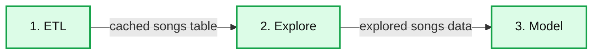

# New Content in Databricks Community Edition

- Source: https://www.databricks.com/blog/2016/04/12/new-content-in-databricks-community-edition.html
- Published: 2016-04-12
- Authors: Ion Stoica
- Categories: solutions, engineering, open-source, data-science-machine-learning
- Images: 1 total, 1 extracted as architecture

*Free Edition has replaced Community Edition, offering enhanced features at no cost. Start using *[*Free Edition *](https://login.databricks.com/?intent=SIGN_UP&amp;signup_experience_step=EXPRESS&amp;provider=DB_FREE_TIER&amp;dbx_source=www)*today.*
 

At the [Spark Summit New York](https://www.databricks.com/dataaisummit), we announced Databricks Community Edition (CE) beta. CE is a free version of the Databricks service that allows everyone to learn and explore Apache Spark by providing a simple, integrated development environment for data scientists and engineers with high quality training materials and sample applications.

The community interest in Databricks CE beta has far exceeded our expectations. Within just a few days from the launch, several thousands of people put themselves on the waiting list! Given such demand, we have been hard at work to scale up the service and operations to give accounts to as many people as possible. The majority of people on the waiting list have now received accounts, and have started experimenting with Spark and Databricks.

One thing our users have particularly enjoyed in Databricks CE is exploring training materials and the collection of sample notebooks. Today, we are happy to announce the availability of additional materials, a MOOC course and two sample applications, for you to learn and explore Spark.

## Machine Learning with Apache Spark MOOC

First, we are delighted to announce the release of all lectures and labs of our second Massive Open Online Course (MOOC), “[Machine learning with Apache Spark](https://www.databricks.com/spark/getting-started-with-apache-spark/machine-learning),” which was taught by [Ameet Talwalkar](http://web.cs.ucla.edu/~ameet/) from UCLA on the EdX platform in July 2015. This is a five week course and introduces the underlying statistical and algorithmic principles required to develop scalable real-world machine learning pipelines.

When offered last year, this course was a huge success, with over 55,000 registered students, of which close to 15% graduated. This is more than twice the average graduation rate of the MOOCs taught on EdX and other premier online education platforms. This speaks volumes about the quality and the demand of this course, and now you too can learn from it in Databricks CE.

## Analysis Pipeline Samples in R and Scala

Second, one of the most successful sample applications available on Databricks CE is an analysis pipeline on a sample of a million songs dataset. This analysis aimed to answer questions such as: When you first hear a song, do you ever categorize it as slow or fast? Is this even a valid categorization? If so, can one do it automatically? This analysis aims to answer such questions.

We wrote the original pipeline in Python. While Python is a very popular language, quite a few of our early users have asked us about porting the pipeline in other languages supported by Spark.

Today, we are happy to announce that we have ported this analysis pipeline in R and Scala, two other popular languages used by Spark users. Like in the original version written in Python, the Scala and R versions parse, explore and model a sample from the million songs dataset. This pipeline consists of three sections:

- **ETL:** Parses raw texts and creates a cached table.
- **Explore:** Explores different aspects of the songs table using graphs.
- **Model:** Uses SparkML to cluster songs based on some of their attributes.

**Summary:** A three-stage analysis pipeline progressing from ETL to exploration to modeling.

**Components:**

- 1. ETL: Parses raw text and creates a cached table.
- 2. Explore: Explores the songs table using graphs.
- 3. Model: Clusters songs using SparkML.

**Flows:**

- 1. ETL -> 2. Explore: Cached songs table
- 2. Explore -> 3. Model: Explored songs data

**Numbers:** 1, 2, 3

source image: https://www.databricks.com/wp-content/uploads/2016/04/Databricks-Community-Edition-analysis-pipeline-diagram.png

 

## Golden State Warrior Pass Analysis: 3rd Party Notebook

Finally, we are happy to include for the first time a notebook created by a Databricks CE user. Using graphs to visualize the number of passes between team members of the Golden State Warriors during the 2015-2016 season, this notebook leverages [GraphFrames](https://www.databricks.com/blog/2016/03/16/on-time-flight-performance-with-graphframes-for-apache-spark.html), a new Spark package that efficiently supports queries on graphs at scale, and a D3 library that performs visualization. As an example, this notebook demonstrates Databricks’ seamless integration with growing number third party packages. Today there are over 200 [Spark packages](https://spark-packages.org/).

The availability of rich content makes Databricks CE an ideal platform to learn spark, enable users to develop useful applications, and share their notebooks with the community.

## Try it now

If you already have access to the Community Edition, [login now](https://community.cloud.databricks.com). Or [get on the waitlist here](https://www.databricks.com/).
