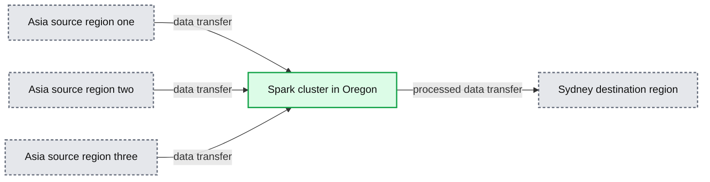

# Next Generation Physical Planning in Apache Spark

- Source: https://www.databricks.com/blog/2017/04/01/next-generation-physical-planning-in-apache-spark.html
- Published: 2017-04-01
- Authors: Aaron Davidson, Eric Liang, Thomas Desrosiers
- Categories: engineering, open-source
- Images: 9 total, 5 extracted as architecture

>  Never underestimate the bandwidth of a station wagon full of tapes hurtling down the highway. —Andrew Tanenbaum, 1981

**

magine** a cold, windy day at Lake Tahoe in California. When a group of [Bricksters](https://www.databricks.com/company/leadership-team) who were cross-country skiing stopped for lunch, one found a 4TB hard drive in their backpack. One brickster remarked that this data had traveled by car over 200 miles in less than 8 hours — accounting for a speed of over 1 Gb/s. This led to an idea: What if Apache Spark leveraged physical storage media and vehicles to move data?

 High throughput physical data channel leading from a [data lake](https://www.databricks.com/discover/data-lakes/introduction) (South Lake Tahoe).

## Transcontinental Data Transfer Shortcomings

In this era of high-volume, inter-continental data processing, with globally distributed, exponentially growing data volumes, networks are too slow. A single link between two nodes in a datacenter may be as slow as 10Gb/s -- and cross-datacenter links are often 100x slower! So how do we better solve the everyday problem of transferring billions, trillions, or quadrillions of bytes around the world?

While for analytical queries it is possible to optimize global execution via proper task and data placement, sometimes data movement is unavoidable, e.g. due to the nature of an [ETL job](https://en.wikipedia.org/wiki/Extract,_transform,_load), compute constraints, or local regulations. We found a number of such use cases when we talked with our customers, including:

- Recurring transfers due to
  - Desire to retain data in particular region (e.g. safe harbor laws)
  - Excess purchased compute capacity available in certain regions
  - Streaming ETL of cross-continental data
- One-time transfer tasks, such as
  - Moving data to implement with data architecture changes
  - Disaster recovery (adding or recovering data replicas)

For example, consider a Spark job in which thousands of terabytes of data distributed in the Mumbai, Singapore, and Seoul regions need to be moved to Sydney, where there is more purchased compute capacity available. We'd also like to repartition the data into an appropriate number of Parquet-encoded files to optimize performance.

Normally, such a job would be expressed in Spark as follows:

However, if a user were to run this job, they would quickly see two problems.

1. Cross-region data transfer across the Internet is incredibly slow. Compared to intra-datacenter networks, Internet egress is orders of magnitude slower.
2. Cross-region data transfer is incredibly expensive. Large data transfers can sometimes cost into the millions of dollars.

Most users, faced with these insurmountable time and cost obstacles, would have to turn to hand-optimizing their data transfers. More sophisticated users may seek to optimize data transfers using private links. Others would consult with maritime shipping agencies to figure out how to ship their data -- in secure physical containers.

A complicated set of undersea cables allows for cross-continental Internet traffic.

*Maritime routes allow for much higher throughput data transfer, at the cost of latency and logistics overhead.*

**Summary:** The map shows maritime data-transfer routes connecting ports across Asia, the Indian Ocean, and Australia.

**Components:**

- Karachi port
- Nhava Sheva port
- Mumbai port
- Colombo port
- Port Klang
- Singapore
- Jakarta
- Tokyo
- Sydney
- Melbourne

**Flows:**

- Karachi -> Nhava Sheva: maritime route
- Nhava Sheva -> Colombo: maritime route
- Colombo -> Port Klang: maritime route
- Port Klang -> Singapore: maritime route
- Singapore -> Jakarta: maritime route
- Singapore -> Tokyo: maritime route
- Singapore -> Sydney: maritime route
- Sydney -> Melbourne: maritime route
- Melbourne -> Tokyo: maritime route

**Numbers:** none



<sub>source image: https://www.databricks.com/wp-content/uploads/2017/03/capp-maritime-routes.jpg</sub>

```mermaid
%% Maritime data transfer routes across Asia and Australia
flowchart LR
    Karachi[Karachi port] -->|maritime route| Nhava[Nhava Sheva port]
    Nhava -->|maritime route| Mumbai[Mumbai port]
    Nhava -->|maritime route| Colombo[Colombo port]
    Colombo -->|maritime route| Klang[Port Klang]
    Klang -->|maritime route| Singapore[Singapore]
    Singapore -->|maritime route| Jakarta[Jakarta]
    Singapore -->|maritime route| Tokyo[Tokyo]
    Singapore -->|maritime route| Sydney[Sydney]
    Sydney -->|maritime route| Melbourne[Melbourne]
    Melbourne -->|maritime route| Tokyo

    classDef client fill:#dbeafe,stroke:#2563eb,stroke-width:2px,color:#111
    classDef service fill:#dcfce7,stroke:#16a34a,stroke-width:2px,color:#111
    classDef store fill:#ede9fe,stroke:#7c3aed,stroke-width:2px,color:#111
    classDef cache fill:#fef3c7,stroke:#d97706,stroke-width:2px,color:#111
    classDef queue fill:#cffafe,stroke:#0891b2,stroke-width:2px,color:#111
    classDef critical fill:#fee2e2,stroke:#dc2626,stroke-width:4px,color:#111
    classDef external fill:#e5e7eb,stroke:#6b7280,stroke-width:2px,color:#111,stroke-dasharray:4 3
    classDef decision fill:#fce7f3,stroke:#db2777,stroke-width:2px,color:#111
    class Karachi,Nhava,Mumbai,Colombo,Klang,Singapore,Jakarta,Tokyo,Sydney,Melbourne external
```

Maritime routes allow for much higher throughput data transfer, at the cost of latency and logistics overhead.

At Databricks, our vision is to make Big Data simple. So we find these sort of workarounds unacceptable. Inspired by their experience with the efficiency of cross-country skiing, our group of engineers turned their efforts towards addressing this issue.

## Introducing Catalyst APP (Actual Physical Planning)

Enter **Catalyst actual physical planning**. Combining the power of the [Spark Catalyst optimizer](https://www.databricks.com/blog/2015/04/13/deep-dive-into-spark-sqls-catalyst-optimizer.html) with [Amazon Snowmobile](https://aws.amazon.com/snowmobile/), Spark identifies queries running with compute in one region and data in another region, and adaptively decides to migrate the data to the local datacenter before running the query. Prior to this approach, all data access would necessarily occur cross-region, going over public Internet links and capped in a best-case scenario at around 100 Gb/s.

*Overview of the Spark Catalyst optimization pipeline.*

**Summary:** Spark Catalyst transforms SQL queries and DataFrames into selected physical plans and RDDs through analysis, optimization, cost evaluation, and code generation.

**Components:**

- SQL Query: Spark SQL input
- DataFrame: Spark DataFrame input
- Unresolved Logical Plan: initial Catalyst plan
- Catalog: metadata source
- Logical Plan: analyzed plan
- Optimized Logical Plan: optimized Catalyst plan
- Physical Plans: candidate execution plans
- Cost Model: plan evaluation component
- Selected Physical Plan: chosen execution plan
- RDDs: Spark execution output
- Analysis: plan analysis phase
- Logical Optimization: logical optimization phase
- Physical Planning: physical planning phase
- Code Generation: execution code generation phase

**Flows:**

- SQL Query -> Unresolved Logical Plan: query input
- DataFrame -> Unresolved Logical Plan: DataFrame input
- Catalog -> Logical Plan: metadata
- Unresolved Logical Plan -> Logical Plan: analysis
- Logical Plan -> Optimized Logical Plan: logical optimization
- Optimized Logical Plan -> Physical Plans: physical planning
- Physical Plans -> Cost Model: candidate plans
- Cost Model -> Selected Physical Plan: cost-based selection
- Selected Physical Plan -> RDDs: generated execution plan

**Numbers:** none



<sub>source image: https://www.databricks.com/wp-content/uploads/2017/03/spark-catalyst-optimization-pipeline.png</sub>

```mermaid
%% Spark Catalyst optimization pipeline from inputs to generated RDDs
flowchart LR
    SQL[SQL Query] -->|query input| ULP[Unresolved Logical Plan]
    DF[DataFrame] -->|DataFrame input| ULP
    CAT[Catalog] -->|metadata| LP[Logical Plan]
    ULP -->|analysis| LP
    LP -->|logical optimization| OLP[Optimized Logical Plan]
    OLP -->|physical planning| PP[Physical Plans]
    PP -->|candidate plans| CM[Cost Model]
    CM -->|cost based selection| SP[Selected Physical Plan]
    SP -->|generated execution plan| RDD[RDDs]

    classDef client fill:#dbeafe,stroke:#2563eb,stroke-width:2px,color:#111
    classDef service fill:#dcfce7,stroke:#16a34a,stroke-width:2px,color:#111
    classDef store fill:#ede9fe,stroke:#7c3aed,stroke-width:2px,color:#111
    classDef cache fill:#fef3c7,stroke:#d97706,stroke-width:2px,color:#111
    classDef queue fill:#cffafe,stroke:#0891b2,stroke-width:2px,color:#111
    classDef critical fill:#fee2e2,stroke:#dc2626,stroke-width:4px,color:#111
    classDef external fill:#e5e7eb,stroke:#6b7280,stroke-width:2px,color:#111,stroke-dasharray:4 3
    classDef decision fill:#fce7f3,stroke:#db2777,stroke-width:2px,color:#111

    class SQL,DF client
    class ULP,LP,OLP,PP,SP,RDD service
    class CAT store
    class CM decision

    %% Legend
    %% client = clients edge gateway or load balancer
    %% service = stateless compute
    %% store = databases or durable storage
    %% cache = Redis CDN or losable data
    %% queue = Kafka streams or asynchronous pipes
    %% critical = bottleneck or single point of failure
    %% external = third party
    %% decision = trade off point
```

Overview of the Spark Catalyst optimization pipeline.

Catalyst APP uses the [Amazon Snowball](https://aws.amazon.com/snowball/) and [Snowmobile](https://aws.amazon.com/snowmobile/) APIs to schedule one or more trucks (depending on the amount of data and desired parallelism) to one datacenter and ship it to the target datacenter. Once the transfer is complete, the query begins on the local data.

Using this technique, we’ve found we can achieve 60x the performance while being 30x cheaper than the alternatives.

|  | Bandwidth | Cost per exabyte |
|---|---|---|
| Over-the-Internet | ~100 Gb/s | $80mm ($0.08/GB) |
| Mail (USPS) (250k 4TB hard drives) | ~53 Gb/s (1 person boxing and unboxing drives constantly for 4 years) | $2.25mm ($1.25mm shipping, $1mm min. salary) |
| Lay your own undersea cable | ~60,000 Gb/s (but takes a couple years to build) | $300mm (fixed cost) |
| Snowmobile (10 trucks, 2 week travel time) | ~6,614 Gb/s | $2.5mm ($0.0025/GB) |
| Improvement | 66x faster than Internet | 32x cheaper than Internet |

Let us describe how Catalyst APP works in detail by considering the previous example of an ETL job. This job requires executing three steps:

1. First, data needs to be read from the three source regions.
2. Second, the data needs to be [efficiently partitioned](https://www.databricks.com/blog/2014/10/10/spark-petabyte-sort.html) into 250,000 slices.
3. Finally, the data needs to be written into the destination region (Sydney).

*.*

**Summary:** Spark cluster in Oregon reads data from three Asian source regions and transfers the processed data to Sydney.

**Components:**

- Spark cluster in Oregon
- Three source regions in Asia
- Destination region in Sydney

**Flows:**

- Asia source regions -> Spark cluster in Oregon: data transfer
- Spark cluster in Oregon -> Sydney destination region: processed data transfer

**Numbers:** none



<sub>source image: https://www.databricks.com/wp-content/uploads/2017/03/capp-spark-transferring-data.png</sub>

 Spark cluster in Oregon transferring data from multiple Asia regions to Sydney. Projection does not indicate optimal transfer route, which depends on [how the path is optimized for partition and piracy tolerance](https://accounts.google.com/ServiceLogin?service=wise&passive=1209600&continue=https://drive.google.com/file/d/0B3Um1hpy8q7gVjhVT3dGUWFxRm8/view&followup=https://drive.google.com/file/d/0B3Um1hpy8q7gVjhVT3dGUWFxRm8/view) .

Normally, Catalyst will only consider one physical strategy for each of these steps, since it has no alternative but to access the data over the network from the Spark executors. This unoptimized query plan is simple:

When we ran the job using this naïve plan, it never finished execution because the WAN transfer was too slow, despite using hundreds of executors. We also saw our AWS bill skyrocket. Eventually, we gave up and cancelled the job after a few months:

*Plan for job using direct cross-region Internet access. The job did not complete.*

**Summary:** The diagram shows a Spark WholeStageCodegen plan where a parquet scan feeds an Exchange stage.

**Components:**

- WholeStageCodegen using Apache Spark
- Scan parquet using parquet
- Exchange using Apache Spark

**Flows:**

- Scan parquet -> Exchange: scanned parquet output

**Numbers:**

- 148022 h
- 170 s
- 228 s
- 21649 s
- Number of output rows: 0
- 148021 h
- 168 s
- 228 s
- 21649 s
- Data size total: 0.0 B
- 0.0 B
- 0.0 B
- 0.0 B

```text
%% mermaid failed to render; kept as text
%% Shows a Spark parquet scan feeding an Exchange stage
flowchart TD
    W[WholeStageCodegen<br/>148022 h<br/>170 s 228 s 21649 s]
    S[Scan parquet<br/>Number of output rows 0<br/>Scan time total<br/>148021 h<br/>168 s 228 s 21649 s]
    E[Exchange<br/>Data size total<br/>0.0 B<br/>0.0 B 0.0 B 0.0 B]

    W -->|contains scan| S
    S -->|scanned output| E

    classDef client fill:#dbeafe,stroke:#2563eb,stroke-width:2px,color:#111
    classDef service fill:#dcfce7,stroke:#16a34a,stroke-width:2px,color:#111
    classDef store fill:#ede9fe,stroke:#7c3aed,stroke-width:2px,color:#111
    classDef cache fill:#fef3c7,stroke:#d97706,stroke-width:2px,color:#111
    classDef queue fill:#cffafe,stroke:#0891b2,stroke-width:2px,color:#111
    classDef critical fill:#fee2e2,stroke:#dc2626,stroke-width:4px,color:#111
    classDef external fill:#e5e7eb,stroke:#6b7280,stroke-width:2px,color:#111,stroke-dasharray:4 3
    classDef decision fill:#fce7f3,stroke:#db2777,stroke-width:2px,color:#111
    W,S service
    E queue
```

<sub>source image: https://www.databricks.com/wp-content/uploads/2017/03/job-using-cross-region-internet-access.png</sub>

Plan for job using direct cross-region Internet access. The job did not complete.

However, with Catalyst ***actual physical planning***, Catalyst can consider alternate strategies for moving the data. Based on data statistics and real-time pricing information, it determines the optimal physical strategy for executing transfers. In the optimized job, from our cluster in the Oregon (us-west-2) region, Spark ingests the data from Mumbai, Singapore, and Seoul via Snowmobile, performs a local [petabyte-scale repartitioning](https://www.databricks.com/blog/2014/10/10/spark-petabyte-sort.html), and then writes it out to Sydney again via Snowmobile.

This optimized plan completed in only a few weeks -- more than fast enough given the scale of the transfer. In fact, if not for some straggler shipments when crossing the Pacific (more on that later) it would have completed significantly faster:

*Plan for a 61 Petabyte job using Catalyst APP + Snowmobile. Completed in*

**Summary:** Catalyst physical planning combines three Snowball transfers into a union, exchanges 61 PB of data, and sends the result through a final Snowball transfer.

**Components:**

- WholeStageCodegen for SIN to PDX, using Apache Spark Catalyst physical planning
- Snowball Transfer SIN to PDX
- Project for SIN to PDX
- WholeStageCodegen for BOM to PDX, using Apache Spark Catalyst physical planning
- Snowball Transfer BOM to PDX
- Project for BOM to PDX
- WholeStageCodegen for ICN to PDX, using Apache Spark Catalyst physical planning
- Snowball Transfer ICN to PDX
- Project for ICN to PDX
- Union combining the three projected inputs
- Exchange performing the repartitioning
- WholeStageCodegen for PDX to SYD, using Apache Spark Catalyst physical planning
- Snowball Transfer PDX to SYD

**Flows:**

- Snowball Transfer SIN to PDX -> Project: transferred records
- Project for SIN to PDX -> Union: projected SIN to PDX data
- Snowball Transfer BOM to PDX -> Project: transferred records
- Project for BOM to PDX -> Union: projected BOM to PDX data
- Snowball Transfer ICN to PDX -> Project: transferred records
- Project for ICN to PDX -> Union: projected ICN to PDX data
- Union -> Exchange: combined data
- Exchange -> WholeStageCodegen for PDX to SYD: repartitioned data
- WholeStageCodegen for PDX to SYD -> Snowball Transfer PDX to SYD: final transfer input

**Numbers:**

- 1865 h for SIN to PDX WholeStageCodegen
- 184 h minimum, 207 h median, 373 h maximum for SIN to PDX WholeStageCodegen
- 37.9e12 output rows for Snowball Transfer SIN to PDX
- 1708 h total ship time for SIN to PDX
- 192 h minimum, 367 h median, 370 h maximum ship time for SIN to PDX
- 1450 h for BOM to PDX WholeStageCodegen
- 143 h minimum, 165 h median, 289 h maximum for BOM to PDX WholeStageCodegen
- 7.1e12 output rows for Snowball Transfer BOM to PDX
- 1402 h total ship time for BOM to PDX
- 141 h minimum, 163 h median, 288 h maximum ship time for BOM to PDX
- 1213 h for ICN to PDX WholeStageCodegen
- 116 h minimum, 139 h median, 226 h maximum for ICN to PDX WholeStageCodegen
- 15.4e12 output rows for Snowball Transfer ICN to PDX
- 1150 h total ship time for ICN to PDX
- 138 h minimum, 188 h median, 225 h maximum ship time for ICN to PDX
- 61 PB total data size at Exchange
- 0.2 TB minimum, 0.2 TB median, 0.3 TB maximum data size
- 3050 h for PDX to SYD WholeStageCodegen
- 350 h minimum, 422 h median, 750 h maximum for PDX to SYD WholeStageCodegen
- 60.1e12 output rows for Snowball Transfer PDX to SYD
- 2905 h total ship time for PDX to SYD
- 348 h minimum, 420 h median, 740 h maximum ship time for PDX to SYD

```mermaid
%% Shows Spark physical planning and Snowball data transfers from three sources to Sydney
flowchart LR
    S1[WholeStageCodegen SIN to PDX] -->|transferred records| T1[Snowball Transfer SIN to PDX]
    T1 -->|projected records| P1[Project SIN to PDX]
    P1 -->|projected data| U[Union]
    S2[WholeStageCodegen BOM to PDX] -->|transferred records| T2[Snowball Transfer BOM to PDX]
    T2 -->|projected records| P2[Project BOM to PDX]
    P2 -->|projected data| U
    S3[WholeStageCodegen ICN to PDX] -->|transferred records| T3[Snowball Transfer ICN to PDX]
    T3 -->|projected records| P3[Project ICN to PDX]
    P3 -->|projected data| U
    U -->|combined data| X[Exchange]
    X -->|repartitioned data| S4[WholeStageCodegen PDX to SYD]
    S4 -->|final transfer input| T4[Snowball Transfer PDX to SYD]

    classDef client fill:#dbeafe,stroke:#2563eb,stroke-width:2px,color:#111
    classDef service fill:#dcfce7,stroke:#16a34a,stroke-width:2px,color:#111
    classDef store fill:#ede9fe,stroke:#7c3aed,stroke-width:2px,color:#111
    classDef cache fill:#fef3c7,stroke:#d97706,stroke-width:2px,color:#111
    classDef queue fill:#cffafe,stroke:#0891b2,stroke-width:2px,color:#111
    classDef critical fill:#fee2e2,stroke:#dc2626,stroke-width:4px,color:#111
    classDef external fill:#e5e7eb,stroke:#6b7280,stroke-width:2px,color:#111,stroke-dasharray:4 3
    classDef decision fill:#fce7f3,stroke:#db2777,stroke-width:2px,color:#111

    class S1,S2,S3,S4 service
    class T1,T2,T3,T4 external
    class P1,P2,P3 service
    class U,X queue
```



<sub>source image: https://www.databricks.com/wp-content/uploads/2017/03/petabyte-job-using-capp-snowmobile.png</sub>

Plan for a 61 Petabyte job using Catalyst APP + Snowmobile. Completed in

## Future Optimizations

While Catalyst *actual physical planning* is already a breakthrough, we also plan on implementing several other physical planning techniques in Spark:

**Physical Shuffle:** The best [distributed sorting implementations](http://sortbenchmark.org/), even using Apache Spark, take hundreds of dollars in compute cost to sort 100 TB of data. In contrast, using physical data containers, an experienced intern at Databricks can sort over 10 PB per hour. We are excited to offer this physical operator to our customers soon. If you are [interested in an internship](https://www.databricks.com/company/careers), applications for that are also open.

3 TB of data partially sorted using the Catalyst Actual Physical Shuffle operator.

**Actual Broadcast Join:** Many Spark applications, ranging from SQL queries to machine learning algorithms, heavily use [broadcast joins](https://github.com/apache/spark/blob/master/sql/core/src/main/scala/org/apache/spark/sql/execution/joins/BroadcastHashJoinExec.scala). On traditional intercontinental networks, broadcast joins soon become impractical for large tables due to congestion. However, the physical electromagnetic spectrum is naturally a broadcast medium. Thanks to the falling cost of [satellite technology](https://www.theverge.com/2017/3/30/15117096/spacex-launch-reusable-rocket-success-falcon-9-landing), we're excited to (literally) launch a Physical Broadcast operator that can transmit terabyte-sized tables to globally distributed datacenters.

**Serverless Transfer:** If the query plan includes no intermediate transformations, it is possible to dispatch Snowmobile jobs that write directly to the output destination. This cuts cost and latency by removing the need for a cluster. In fact, thanks to [deep learning on Apache Spark](https://www.databricks.com/blog/2016/12/21/deep-learning-on-databricks.html), future transfers could be [both serverless and driverless](https://www.databricks.com/blog/2016/12/21/deep-learning-on-databricks.html).

## CAPP (Catalyst Actual Physical Planning) Theorem

In the course of this work, we noticed that in addition to the expected weather delays, piracy is a real problem for high throughput cross-continental data transfers. This is especially true when using low-cost shipping, creating a tradeoff between Piracy and Cost. We formalized this tradeoff in a new paper on an extension to the [CAP Theorem](https://en.wikipedia.org/wiki/CAP_theorem) called [CAPP](https://accounts.google.com/ServiceLogin?service=wise&passive=1209600&continue=https://drive.google.com/file/d/0B3Um1hpy8q7gVjhVT3dGUWFxRm8/view&followup=https://drive.google.com/file/d/0B3Um1hpy8q7gVjhVT3dGUWFxRm8/view). There, we discuss how we ultimately must choose two of the following: [Consistency, Availability, Partition-tolerance, and Piracy-proofness](https://accounts.google.com/ServiceLogin?service=wise&passive=1209600&continue=https://drive.google.com/file/d/0B3Um1hpy8q7gVjhVT3dGUWFxRm8/view&followup=https://drive.google.com/file/d/0B3Um1hpy8q7gVjhVT3dGUWFxRm8/view).

Thankfully Databricks can automatically encrypt data in transit, which means that Catalyst APP is safe even for organizations with the [most stringent data security requirements](https://www.databricks.com/company/newsroom/press-releases/databricks-announces-hipaa-compliance-apache-spark-based-platform-achieves-aws-public-sector-partner-status).

## Conclusion

Catalyst *actual physical planning* enables a new class of exabyte-scale, cross-continent ETL workloads on Databricks, moving us one step closer to our vision of making Big Data simple. Watch out for our entry in this year’s [international sorting competition](http://sortbenchmark.org/). Catalyst *actual physical planning* is now available in private preview for Databricks users. Please [contact us](https://www.databricks.com/) if you are interested in early access.

Also, Happy April 1st!
