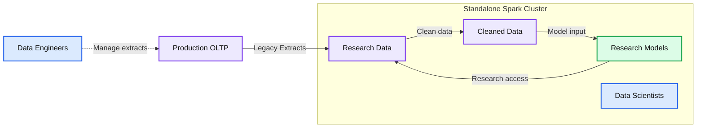
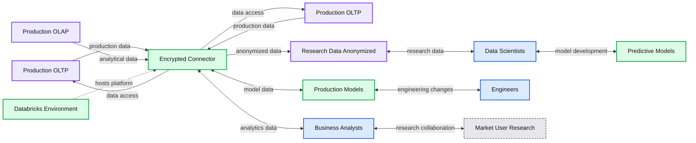

# Using Databricks to Democratize Big Data and Machine Learning at McGraw-Hill Education

- Source: https://www.databricks.com/blog/2017/10/18/using-databricks-democratize-big-data-machine-learning-mcgraw-hill-education.html
- Published: 2017-10-18
- Authors: Matthew Hogan
- Categories: engineering, company, customers
- Images: 5 total, 3 extracted as architecture

*This is a guest post from Matt Hogan, Sr. Director of Engineering, Analytics and Reporting at McGraw-Hill Education.*

---

McGraw-Hill Education is a 129-year-old company that was reborn with the mission of accelerating learning through intuitive and engaging experiences – grounded in research. When we began our journey, our data was locked in silos managed within teams and was secure, but not shared and not fully leveraged. The research needed to create machine learning models that could make predictions and recommendations to students and instructors was hard because the paths to the data needed to train those models were often unclear, slow, and sometimes completely closed off. To be successful, we first needed to change our organizational approach to burst through the silos that were preventing us from unlocking the full potential of shared, consumable information. We needed a culture of data. More precisely, a culture of secure data that protected the privacy of students and institutions that worked with us but allowed enough safe access to stoke intellectual curiosity and innovation across the organization. To guide our research, we founded the McGraw-Hill Education Learning Science Research Council (LSRC). The LSRC is chartered with guiding our own research as well as working with the education and technology communities to drive the field of learning science research forward.

Our transformation is underscored by our deep understanding of learning, including knowledge of how students and instructors leverage both content and learning management solutions. Through exploring how content and learning management systems are used coupled with understanding a student’s progress through material, we’re able to leverage fully anonymized data to drive adaptive models to engage with students and deliver differentiated instruction to drive better outcomes.  Aggregating, processing, developing models, and operationalizing those models as features in learning management systems requires a cohesive data engineering and data science platform, and Databricks has partnered with us to fill that engineering need. We have made some incredible strides forward by coupling the technological edge gained from Databricks with a concerted organizational shift to align security, DevOps, platform, and product teams around a new data-centric paradigm of operating that allows interdisciplinary teams to cross-cut through data silos and unlock insights that would have otherwise not been possible.

### *Democratizing Data and Machine Learning with Databricks*

To test the efficacy of insights generated from learning science research, we first needed to democratize access to data and machine learning thereby reducing the cost of iterating on models and testing their effect in the market and on learners. Databricks provides us with a ubiquitous data environment that can be leveraged by business analysts, data engineers, and data scientists to work collaboratively toward a set of common goals.

Before bringing Databricks on, we had many Apache Spark clusters running on leased hardware. To get data to researchers, we created one-off extracts that would pull data from one of our product databases, scrub Personally Identifiable Information (PII), and store the data as flat files on one of the leased Spark clusters. This led to many problems including data quickly becoming stale, researchers working on models that were out of sync with the data in the extracted flat files, and no clear way to integrate the output of models developed by the data scientists.

**Summary:** The diagram shows a standalone Spark cluster where legacy extracts move from a production OLTP system into research data, cleaned data, and research models.

**Components:**

- Production OLTP: production OLTP database
- Standalone Spark Cluster: Apache Spark cluster
- Research Data: research data files or datasets
- Cleaned Data: cleaned datasets
- Research Models: research machine learning models
- Data Engineers: data engineering users
- Data Scientists: data science users

**Flows:**

- Production OLTP -> Research Data: Legacy extracts
- Data Engineers -> Production OLTP to Research Data flow: manage legacy extracts
- Research Data -> Cleaned Data: data cleaning
- Cleaned Data -> Research Models: cleaned data for modeling
- Research Models -> Research Data: model-related feedback or access

**Numbers:** none

source image: https://www.databricks.com/wp-content/uploads/2017/10/Databricks-MHE-1.png

After adopting Databricks, we could create secure connections between read-replicas of our learning systems and our data platform, ensuring that data was encrypted both in motion and at rest while allowing us to protect the confidentiality of learners. The connections allow researchers to have access to fresh data and current data models in a secure environment. Because the Spark systems are used by both engineering teams and researchers, output from the researchers could be leveraged to create new models and populate our data mart with new insights. As an added benefit, we could provide access to the business analytics teams who are now able to conduct their own research along with the data scientists on a single, unified analytics platform.

**Summary:** Databricks provides a unified environment connecting production data, anonymized research data, predictive models, engineers, data scientists, and business analysts through an encrypted connector.

**Components:**

- Databricks Environment - Databricks analytics platform
- Production OLTP - Production transactional data systems
- Production OLTP - Production transactional data systems
- Production OLAP - Production analytical data system
- Encrypted Connector - Encrypted data integration layer
- Research Data Anonymized - Anonymized research data store
- Data Scientists - Research users
- Predictive Models - Machine learning models
- Production Models - Operational machine learning models
- Engineers - Engineering users
- Business Analysts - Business analytics users
- Market User Research - Market and user research

**Flows:**

- Production OLTP -> Encrypted Connector: production transactional data
- Encrypted Connector -> Production OLTP: connector-mediated access
- Production OLTP -> Encrypted Connector: production transactional data
- Encrypted Connector -> Production OLTP: connector-mediated access
- Production OLAP -> Encrypted Connector: analytical data
- Encrypted Connector -> Research Data Anonymized: anonymized research data
- Research Data Anonymized -> Data Scientists: research data
- Data Scientists -> Research Data Anonymized: research queries or outputs
- Data Scientists -> Predictive Models: model development
- Predictive Models -> Data Scientists: model results
- Encrypted Connector -> Production Models: model inputs or outputs
- Production Models -> Encrypted Connector: model outputs
- Production Models -> Engineers: production models
- Engineers -> Production Models: engineering changes
- Encrypted Connector -> Business Analysts: accessible analytics data
- Business Analysts -> Encrypted Connector: analytics queries
- Business Analysts -> Market User Research: research collaboration
- Market User Research -> Business Analysts: research insights

**Numbers:** none

source image: https://www.databricks.com/wp-content/uploads/2017/10/DB-MHE-iterating-on-connect-attribution-model.png

*Iterating on the Connect Attrition Model*

One of our first efforts catalyzed by Databricks was our Connect student attrition model - a classifier that can predict which students are at risk for dropping a course based on progress working through the material and outcomes on quizzes and assignments - within 2-4 weeks of a class starting. The McGraw-Hill Education Connect Platform is a highly reliable, secure learning management solution that covers homework, assessments, and course content delivery and does so leveraging many adaptive tools to improve student outcomes. While Connect appears to the world as a single, seamless platform and experience, it is made up of several pluggable technologies and products all generating their own data and metrics in real time. These components are hosted through a mix of in-house data centers and Amazon Web Services, making data aggregation, cleaning, and research a challenge.

To facilitate the data science work needed to train the model, we undertook several initiatives:

- Created secure access to read-replicas of the Connect OLTP system
- Created a new platform designed to facilitate rapid iteration and evaluation of models coupled with user experience and impact
- Worked to change McGraw-Hill Education’s culture from one where data silos were the norm to one in which current, secure, anonymized data is made accessible to those who have a valid use for it
- Designed a system of leveraging encrypted S3 buckets (with Parquet in some cases) that researchers and developers could use to securely and easily move, evaluate, and read (using SparkSQL) data

To establish a cycle of rapid feedback with researchers in the academic community as well as a select number of instructors, we created a platform called the Learning Science Dashboard (LSD). The LSD leverages our single sign-on solution to provide access to visualizations that researchers create using Databricks through reading from and writing to S3 buckets. Once the first level of evaluation was completed, we engaged with designers and engineers to build an operational notebook that could use the connector to query data from live classes in Connect and write predictions to a staging area in S3. Using the Databricks job scheduler made the operationalization of the model a trivial task. A new UI was deployed (this time using AngularJS) into the LSD and select instructors with access to Connect could log in and see an evaluation version of the report to gain insights on how their classes are performing.

**Summary:** The diagram shows McGraw-Hill Education’s learning platform architecture connecting users, operational data, research data, data scientists, predictive models, and an analytical data mart.

**Components:**

- Students
- Instructors
- Select Instructors
- Connect UI
- Learning Science Dashboard
- Connect OLTP
- Data Mart OLAP
- Research Data anonymized
- Data Scientists
- Predictive Model
- Databricks
- Secure Insights Pipeline
- Test and Training ETL

**Flows:**

- Students -> Connect UI: class interaction
- Instructors -> Connect UI: platform access
- Select Instructors -> Learning Science Dashboard: dashboard access
- Connect UI -> Connect OLTP: read and write operational data
- Connect OLTP -> Connect UI: operational data
- Learning Science Dashboard -> Data Mart OLAP: query analytical data
- Data Mart OLAP -> Learning Science Dashboard: insights and visualizations
- Connect OLTP -> Research Data anonymized: test and training ETL
- Research Data anonymized -> Data Scientists: anonymized research data
- Data Scientists -> Research Data anonymized: analysis feedback
- Data Scientists -> Predictive Model: model development
- Predictive Model -> Data Scientists: model results
- Connect OLTP -> Predictive Model: secure insights pipeline data
- Predictive Model -> Data Mart OLAP: predictions for visualizations

**Numbers:** none

source image: https://www.databricks.com/wp-content/uploads/2017/10/DB-MHE-deploying-and-market-testing-model.png

```mermaid
%% McGraw-Hill Education learning science architecture and data flows
flowchart LR
    Students[Students]
    Instructors[Instructors]
    Select[Select Instructors]
    UI[Connect UI]
    Dashboard[Learning Science Dashboard]
    OLTP[Connect OLTP]
    Mart[Data Mart OLAP]
    Research[Research Data anonymized]
    Scientists[Data Scientists]
    Model[Predictive Model]
    Databricks1[Databricks ETL]
    Databricks2[Databricks Pipeline]

    Students -->|class interaction| UI
    Instructors -->|platform access| UI
    Select -->|dashboard access| Dashboard
    UI -->|read and write operational data| OLTP
    OLTP -->|operational data| UI
    Dashboard -->|query analytical data| Mart
    Mart -->|insights and visualizations| Dashboard
    OLTP -->|test and training ETL| Research
    Research <-->|analysis feedback| Scientists
    Scientists <-->|model development and results| Model
    OLTP -->|secure insights pipeline data| Model
    Model -->|predictions for visualizations| Mart
    Databricks1 -.->|runs ETL| Research
    Databricks2 -.->|runs pipeline| Model

    classDef client fill:#dbeafe,stroke:#2563eb,stroke-width:2px,color:#111
    classDef service fill:#dcfce7,stroke:#16a34a,stroke-width:2px,color:#111
    classDef store fill:#ede9fe,stroke:#7c3aed,stroke-width:2px,color:#111
    classDef cache fill:#fef3c7,stroke:#d97706,stroke-width:2px,color:#111
    classDef queue fill:#cffafe,stroke:#0891b2,stroke-width:2px,color:#111
    classDef critical fill:#fee2e2,stroke:#dc2626,stroke-width:4px,color:#111
    classDef external fill:#e5e7eb,stroke:#6b7280,stroke-width:2px,color:#111,stroke-dasharray:4 3
    classDef decision fill:#fce7f3,stroke:#db2777,stroke-width:2px,color:#111

    class Students,Instructors,Select client
    class UI,Dashboard,Scientists,Model service
    class OLTP,Mart,Research store
    class Databricks1,Databricks2 queue
```

*Deploying and Market Testing the Model*

The initial visualizations created by the data scientists conveyed important meaning, but were not designed to be consumed by instructors focused on quickly gaining insights on class performance. The first round of visualizations that we tested were created by data scientists in Databricks and exported to S3 buckets with controlled access through the LSD.

The second round of iterations included engineering teams and designers and were designed to quickly convey insights – allowing instructors to focus interventions where they were needed.

### *Thoughts in Closing*

Using Databricks, we could securely transform ourselves from a collection of data silos with limited access to data and minimal collaboration to an organization with democratized access to data and machine learning with data engineers, data scientists, business analysts, and front-end engineers all working in the same space and sharing ideas. By building out some complimentary technologies and processes, we reduced the time to market and created a path by which we could quickly and easily validate both models and insights with external researchers and instructors in the classroom.

Furthermore, our legacy data pipelines (ETL) were decommissioned, resulting in a significant cost savings and simplification of how we run our infrastructure. In the past, we had provisioned EC2 instances running all the time – even when data was not moving. We also had leased hardware running large but statically sized Spark clusters at a cost of thousands per month. Through leveraging Databricks’ dynamic provisioning of instances/clusters when needed coupled with the notion of just-in-time data warehousing, we were able to reduce operational cost of our analytics infrastructure by 30%.
