# Accelerating Innovation With Unified Analytics

- Source: https://www.databricks.com/blog/2018/06/05/accelerating-innovation-with-unified-analytics.html
- Published: 2018-06-05
- Authors: Ali Ghodsi
- Categories: platform, announcements, data-science-machine-learning, company
- Images: 2 total, 1 extracted as architecture

### **The AI Dilemma**

Artificial Intelligence (AI) has massive potential to drive disruptive innovations affecting most enterprises on the planet. However, most enterprises are struggling to succeed with AI . Why is that? Simply put, AI and Data are siloed in different systems and different organizations. Enterprise data is siloed across hundreds of systems such as data warehouses, [data lakes](https://www.databricks.com/discover/data-lakes/introduction), databases and file systems that are not AI-enabled. Popular machine learning frameworks such as [TensorFlow](https://www.databricks.com/glossary/what-is-tensorflow), PyTorch, and SciKit-Learn don’t do data processing. Because these data systems don’t “do AI” and these AI technologies don’t “do data”, it’s extremely hard for enterprises to succeed with AI, which after all requires both ingredients to be successful.

Adding to this data and AI technology divide, companies have siloed teams for data and AI. Data engineers deal with large scale data processing and production deployment, whereas data scientists deal with AI - exploring data, training and validating models. Given the highly iterative nature of AI development, this organizational separation creates significant friction and slows AI initiatives considerably.

### **Unifying Data Science and Engineering**

[Unified Analytics](https://www.databricks.com/glossary/what-is-unified-analytics) is a new category of solutions that unifies data science and engineering, making AI much more achievable for enterprise organizations and enabling them to accelerate their AI initiatives. Unified Analytics brings the disparate worlds of data science and engineering together with a common platform— making it easier for data engineers to build data pipelines across siloed systems and prepare labelled datasets for model building while enabling data scientists to explore and visualize data and build models collaboratively. Unified Analytics provides one engine to prepare high quality data at massive scale and iteratively train machine learning models on the same data. Unified Analytics also provides collaboration capabilities for data scientists and data engineers to work effectively across the entire AI lifecycle. Organizations that succeed in unifying their data at scale and unifying that data with the best AI technologies will have significantly higher chance of success with  AI.

### **Databricks Unified Analytics Platform**

Databricks Unified Analytics Platform, powered by Apache SparkTM, lowers the barrier for enterprises to innovate with AI and accelerates their innovation . It has three major components:

1. Databricks Workspace to empower data science and engineering to collaborate on a common platform; Databricks Workspace is tightly integrated with cloud-native Spark clusters and enables data scientists to productively perform their tasks across the AI lifecycle — from data exploration at scale to the building of predictive models using machine learning and deep learning.
2. Databricks Runtime to unify data and AI technologies at scale; Databricks Runtime uniquely combines data processing capabilities and machine learning frameworks into one unified analytics engine.
3. Databricks Cloud Service automates and simplifies devops by abstracting the complexity of the data infrastructure by auto-configuring and auto-scaling clusters; and provides  enterprise grade security and compliance, along with best-in-class Spark support from the original creators of Apache Spark.

### **New Innovations in Databricks Unified Analytics Platform**

At Spark + AI Summit in San Francisco, we proudly announced the following innovations to further unify data science and engineering to accelerate AI initiatives -

#### **Databricks Delta - Making Data Ready for Machine Learning**

Databricks Delta, now part of the Databricks Runtime, works with Apache Spark to make data reliable and ready for ML through transactional integrity on batch and streaming data. Delta also improves  performance up to 100x through caching and indexing capabilities. With Delta, data engineers can ensure that data scientists have early access to new reliable datasets at scale. Sign up for Databricks Delta [here](https://www.databricks.com/product/delta-lake-on-databricks).

#### **Databricks Runtime for ML - Simplifying Distributing Learning at Scale**

Based on customers demand, we are very excited to announce the new native and deep integration of popular ML libraries including xgboost, scikit-learn, and numpy as well as popular deep learning framework such as TensorFlow, Keras, Horovod. This will dramatically simplify configuration and setup allowing data scientists to focus on their data and model building.

#### **MLflow - Standardizing the Complete Machine Learning Lifecycle**

MLflow is the first open source, cross-cloud framework that dramatically simplifies the workflow associated with building, deploying and iterating on machine learning. With MLflow, organizations can package their code for reproducible runs, execute and compare hundreds of parallel experiments, leverage any of the existing open source projects, and deploy models to production on a variety of serving platforms. You can learn more about MLflow at Matei’s [blog](https://www.databricks.com/blog/2018/06/05/introducing-mlflow-an-open-source-machine-learning-platform.html) and download MLflow [here](https://www.mlflow.org). For future updates on MLflow and Databricks integration, sign-up [here](https://www.databricks.com/product/managed-mlflow).

**Databricks Unified Analytics Platform**

**Summary:** The diagram shows the Databricks Unified Analytics Platform spanning cloud services, the Databricks Runtime, and the Databricks Workspace.

**Components:**

- Databricks Cloud Service: Microsoft Azure and Amazon Web Services
- Databricks Runtime: Apache Spark
- Databricks Delta: reliable and scalable data storage
- ML Frameworks: TensorFlow and XGBoost
- Hadoop, Kafka, and Parquet: data ecosystem technologies
- Databricks Workspace: notebooks, jobs, APIs, models, and dashboards
- MLflow: end-to-end ML lifecycle management

**Flows:**

- none

**Numbers:** none

```mermaid
%% Shows the Databricks Unified Analytics Platform layers and components
flowchart TD
    workspace[Databricks Workspace]
    notebooks[Notebooks]
    jobs[Jobs]
    apis[APIs]
    models[Models]
    dashboards[Dashboards]
    mlflow[MLflow]
    runtime[Databricks Runtime]
    spark[Apache Spark]
    delta[Databricks Delta]
    frameworks[ML Frameworks]
    cloud[Databricks Cloud Service]
    azure[Azure]
    aws[Amazon Web Services]

    workspace --- notebooks
    workspace --- jobs
    workspace --- apis
    workspace --- models
    workspace --- dashboards
    workspace --- mlflow
    runtime --- spark
    runtime --- delta
    runtime --- frameworks
    cloud --- azure
    cloud --- aws

    classDef client fill:#dbeafe,stroke:#2563eb,stroke-width:2px,color:#111
    classDef service fill:#dcfce7,stroke:#16a34a,stroke-width:2px,color:#111
    classDef store fill:#ede9fe,stroke:#7c3aed,stroke-width:2px,color:#111
    classDef cache fill:#fef3c7,stroke:#d97706,stroke-width:2px,color:#111
    classDef queue fill:#cffafe,stroke:#0891b2,stroke-width:2px,color:#111
    classDef critical fill:#fee2e2,stroke:#dc2626,stroke-width:4px,color:#111
    classDef external fill:#e5e7eb,stroke:#6b7280,stroke-width:2px,color:#111,stroke-dasharray:4 3
    classDef decision fill:#fce7f3,stroke:#db2777,stroke-width:2px,color:#111

    class workspace,notebooks,jobs,apis,models,dashboards,mlflow,runtime,spark,frameworks,cloud service
    class delta,azure,aws store
```

source image: https://www.databricks.com/wp-content/uploads/2018/06/Marketecture-notitle.png

### **Conclusion**

Our goal is to accelerate innovation by [unifying data](https://www.databricks.com/glossary/unified-data-analytics-platform) science, engineering and business. We will continue to drive data science and engineering unification by adding new capabilities to the Databricks Unified Analytics Platform. Get started today with [Databricks Unified Analytics Platform](https://www.databricks.com/try-databricks).
