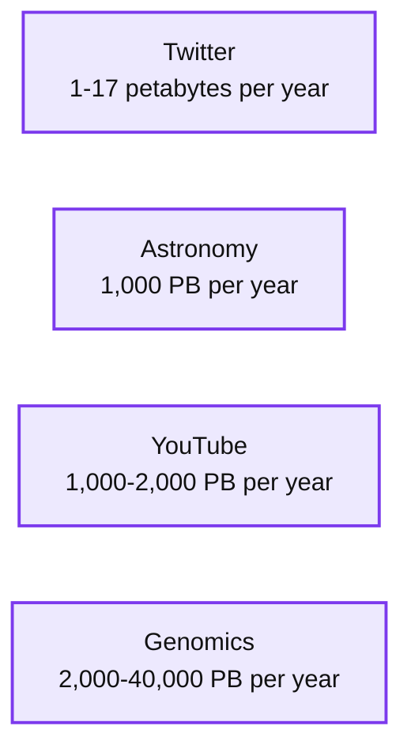
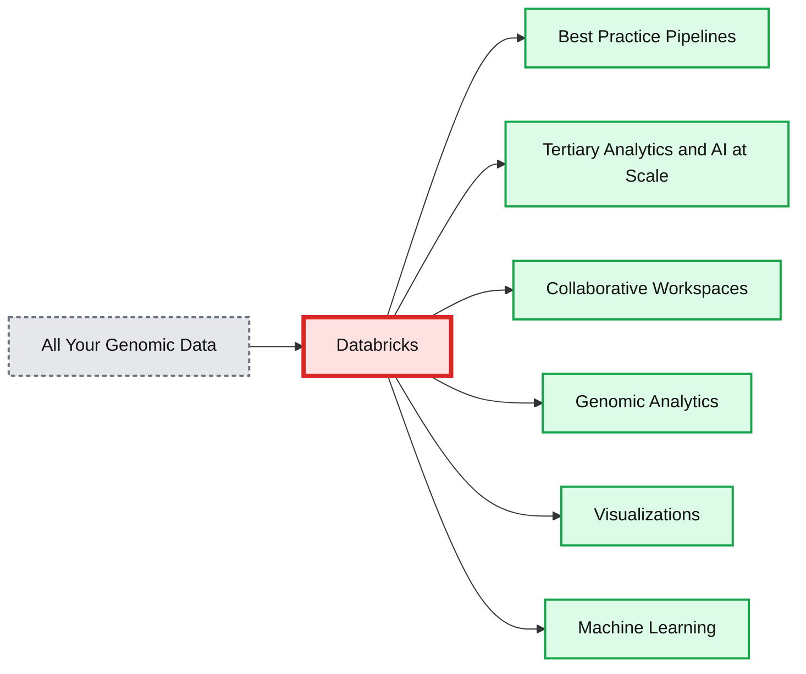

# Accelerating Discovery with a Unified Analytics Platform for Genomics

- Source: https://www.databricks.com/blog/2018/06/06/unified-analytics-platform-for-genomics.html
- Published: 2018-06-06
- Authors: Ion Stoica, Frank Austin Nothaft, Ram Sriharsha, Michael Ortega
- Categories: platform, product, announcements, engineering, company
- Images: 3 total, 3 extracted as architecture

Today we are proud to introduce the Databricks Unified Analytics Platform for Genomics. With a unified platform for genomic data processing, tertiary analytics, and machine learning at massive scale, healthcare and life sciences organizations can accelerate the discovery of life changing treatments and further advancements in personalized and preventative care.

### **The Genomic Data Explosion**

The first human genome took 13 years and over $2.5 billion to sequence. Today, a human genome can be sequenced in a couple days for less than the price of the latest iPhone. As a result, pharmaceutical and healthcare organizations are profiling the genomes of millions of patients, generating thousands of petabytes of data. To put this in perspective, genomic sequencing is expected to generate up to 40 exabytes of data per year by 2025. This will dwarf the amount of data generated by Youtube and Twitter combined.

**Summary:** Projected annual storage in 2025 compares genomics data volume with Twitter, astronomy, and YouTube.

**Components:**

- Twitter, technology unspecified
- Astronomy, technology unspecified
- YouTube, technology unspecified
- Genomics, technology unspecified

**Flows:**

- none

**Numbers:** 2025; 1-17 petabytes per year; 1,000 PB/year; 1,000-2,000 PB/year; 2,000-40,000 PB/year; 7 July 2015

source image: https://www.databricks.com/wp-content/uploads/2018/06/genomics_data_youtube.jpg

When paired with clinical data, genomic data offers huge potential to accelerate drug discovery, predict disease risks, and personalize treatments. This will enable healthcare providers to significantly improve patient outcomes.

### **The Technology Challenges of Modern Genomic Workflows**

The potential to impact care has never been greater. Yet, the tools and systems that genomic researchers rely on do not provide the speed, scale and flexibility needed to draw insight from these massive genomic datasets. These challenges fall into three key areas:

- **Messy sequence data and complex pipelines -** a genomic pipeline for processing the petabytes of messy data coming off of a [DNA sequencer](https://www.databricks.com/glossary/dna-sequence) is typically constructed of 5-10 tools (e.g., GATK, BWA, etc) that are stitched together in up to 40 stages. Building and maintaining these complex pipelines is costly, time consuming, and leads to unnecessary delays in downstream analytics.

**Summary:** A multi-stage genomics processing pipeline connects raw sequencing data to variant annotation, with quality control, model training, recalibration, filtering, and specialized bioinformatics tools.

**Components:**

- Raw Data: sequencing input
- Quality Control: FastQC
- Trim: cutadapt
- Alignment: BWA
- Fix Metadata: SAMtools
- Sort: SAMtools
- De-duplicate: SAMtools
- Recalibrate: Picard
- Train Model: GATK
- Quality Control: Picard
- Call Variants: GATK
- Apply Filtration Model: GATK
- Variant Annotation: SnpEff

**Flows:**

- Raw Data -> Trim: raw sequencing data
- Raw Data -> Quality Control: data for quality assessment
- Quality Control -> FastQC: quality control input
- Trim -> Alignment: trimmed reads
- Trim -> cutadapt: trimming operation
- Alignment -> Fix Metadata: aligned reads
- Alignment -> BWA: alignment operation
- Alignment -> SAMtools: alignment processing
- Fix Metadata -> Sort: metadata-corrected reads
- Fix Metadata -> SAMtools: metadata fixing
- Sort -> De-duplicate: sorted reads
- Sort -> SAMtools: sorting operation
- De-duplicate -> Recalibrate: duplicate-marked reads
- De-duplicate -> Train Model: training data
- De-duplicate -> SAMtools: duplicate removal
- Recalibrate -> Call Variants: recalibrated reads
- Recalibrate -> Quality Control: recalibration quality assessment
- Recalibrate -> Train Model: model training input
- Quality Control -> Picard: quality control operation
- Train Model -> Recalibrate: trained model
- Call Variants -> Apply Filtration Model: called variants
- Call Variants -> GATK: variant calling operation
- Apply Filtration Model -> Variant Annotation: filtered variants
- Apply Filtration Model -> Quality Control: filtration quality assessment
- Apply Filtration Model -> Train Model: filtration model training
- Variant Annotation -> SnpEff: annotation operation
- Recalibrate -> GATK: recalibration operation

**Numbers:** none

```mermaid
%% Genomics processing pipeline from raw data to annotated variants
flowchart LR
    A[Raw Data] -->|reads| B[Quality Control FastQC]
    A -->|raw data| C[Trim cutadapt]
    C -->|trimmed reads| D[Alignment BWA]
    D -->|aligned reads| E[Fix Metadata SAMtools]
    E -->|corrected reads| F[Sort SAMtools]
    F -->|sorted reads| G[De duplicate SAMtools]
    G -->|training data| H[Train Model GATK]
    G -->|deduplicated reads| I[Recalibrate Picard]
    H -->|trained model| I
    I -->|recalibrated reads| J[Call Variants GATK]
    J -->|called variants| K[Apply Filtration Model GATK]
    K -->|filtered variants| L[Variant Annotation SnpEff]
    I -->|quality assessment| M[Quality Control Picard]
    K -->|quality assessment| M

    classDef client   fill:#dbeafe,stroke:#2563eb,stroke-width:2px,color:#111
    classDef service  fill:#dcfce7,stroke:#16a34a,stroke-width:2px,color:#111
    classDef store    fill:#ede9fe,stroke:#7c3aed,stroke-width:2px,color:#111
    classDef cache    fill:#fef3c7,stroke:#d97706,stroke-width:2px,color:#111
    classDef queue    fill:#cffafe,stroke:#0891b2,stroke-width:2px,color:#111
    classDef critical fill:#fee2e2,stroke:#dc2626,stroke-width:4px,color:#111
    classDef external fill:#e5e7eb,stroke:#6b7280,stroke-width:2px,color:#111,stroke-dasharray:4 3
    classDef decision fill:#fce7f3,stroke:#db2777,stroke-width:2px,color:#111

    class A client
    class B,C,D,E,F,G,H,I,J,K,L,M service
```

source image: https://www.databricks.com/wp-content/uploads/2018/06/complex_genomic_pipeline3.png

- **Antiquated analytics tools -** many of the genomics tools used today are command line programs built for single node machines. They were not designed for the cloud and trying to run them as such is incredibly challenging and adds multiple processing steps. Additionally, bioinformatics tools typically have complex dependencies, leading users to package them into monolithic Docker containers, which are deployed via a workflow management system. This makes developing and deploying pipelines labor intensive and time consuming, and makes scaling analytics to current data volumes infeasible. A basic set of queries can take days or weeks to execute. And advanced analytics like cross-cohort joint variant calling and machine learning are simply not possible.
- **Siloed research teams - **whether you’re developing a new drug or prescribing a personalized treatment, diverse teams must work together to process, analyze, and interpret insights from genomic and clinical data. The disjointed nature of today’s tools force bioinformaticians, computational biologists, and clinicians to work in silos which further hampers the discovery process.

At Databricks, we’ve seen these problems manifest at organizations across the health ecosystem from pharmaceutical companies to healthcare providers to biotech startups. Based on this experience, we’ve been looking for ways to radically simplify and scale genomic analysis. In short, what if we could enable teams to explore today’s largest genomic datasets using cutting edge analytics and machine learning without any of the wait times? This is exactly what we set out to solve.

### **Accelerating Discovery with Unified Analytics for Genomics**

The Databricks Unified Analytics Platform for Genomics provides the speed and scale bioinformatics teams need to unlock insights buried in their genomic data. We’ve extended the existing capabilities of the Databricks Unified Analytics Platform with genomic-specific toolkits and optimizations to deliver on three specific goals:

- **Simplified genomic pipelines - **prebuilt best practice pipelines are provided out-of-the-box ready in a hosted cloud platform. Instead of manually configuring a complex pipeline, all it takes is a few clicks to provision cloud resources, connect to read, variant, and feature data in Azure or AWS and kick-off bulk processing jobs.
- **Interactive tertiary analytics and AI at scale - **prepackaged genomic analytics—such as Joint Variant Calling, GWAS, PheWas, eQTL—and machine learning frameworks are provided in a unified platform. Genomic queries are optimized to run in parallel at speeds 60-100x faster than open source tools so you can interactively explore your genomic data at scale.
- **Improved productivity across integrated teams - **shared workspaces with detailed revision tracking fosters collaboration across the discovery and diagnosis lifecycle.  Support for SQL, R, Python, Java, and Scala enable bioinformatics teams and data scientists to explore data with their favorite scripting language while interactive dashboards can be deployed making it easy for business users, clinicians and researchers to review findings.

**Summary:** Unified Databricks platform consolidates genomic data into pipelines, scalable analytics and AI, and collaborative workspaces that support genomic analytics, visualizations, and machine learning.

**Components:**

- All Your Genomic Data: genomic data inputs
- Databricks: cloud-managed analytics platform
- Best Practice Pipelines: genomic data processing pipelines
- Tertiary Analytics and AI at Scale: analytics and AI workloads
- Collaborative Workspaces: shared analysis environments
- Genomic Analytics: GWAS and eQTL analysis
- Visualizations: analytical dashboards and charts
- Machine Learning: machine learning workloads

**Flows:**

- All Your Genomic Data -> Databricks: genomic data
- Databricks -> Genomic Analytics: genomic analysis outputs
- Databricks -> Visualizations: visualization outputs
- Databricks -> Machine Learning: machine learning inputs

**Numbers:** 10x-100x; GWAS; eQTL

source image: https://www.databricks.com/wp-content/uploads/2018/06/unified_analytics_genomics_title.png

All of these capabilities are built on an Apache SparkTM-optimized engine that improves the performance of genomic tasks by up to 100x. By unifying these capabilities in a single platform we enable healthcare and life sciences organizations to fully leverage their genomic data to reduce drug development timelines and deliver on precision care initiatives.

### **Getting Started with Unified Analytics for Genomics**

The [Unified Analytics Platform for Genomics](https://www.databricks.com/product/genomics) is currently in preview with multiple Databricks customers. The platform will be generally available on Databricks Azure and AWS later this year, but if you’re interested in participating in the preview, please sign up on the product page [www.databricks.com/genomics](https://www.databricks.com/product/genomics) and we will be in touch!

### **Conclusion**

While genomic data has become widely available over the last decade, the processing and downstream analytics required to turn these massive datasets into life changing insight has become the new bottleneck. With the Databricks Unified Analytics Platform for Genomics, we’ve made significant leaps in addressing these challenges. Instead of wrestling with complex pipelines and reducing the scope of research due to rigid tools, healthcare and life sciences organizations can now accelerate critical discovery with a single, collaborative platform for genomic data processing, tertiary analytics and AI at massive scale.

### **Try it!**

- [Sign-up for the Preview](https://pages.databricks.com/genomics-preview.html)
- [Read our Solution Primer](https://www.databricks.com/product/genomics)
