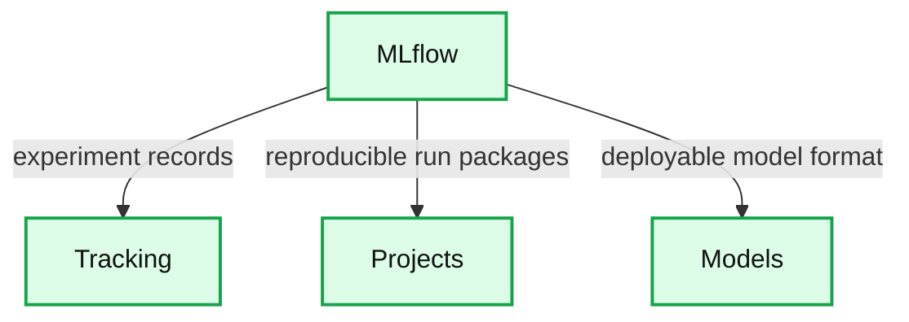

# Highlights from first expanded Spark + AI Summit

- Source: https://www.databricks.com/blog/2018/06/26/highlights-from-first-expanded-spark-ai-summit.html
- Published: 2018-06-26
- Authors: Bharath Gowda, Angelos Mikelatos
- Categories: announcements, open-source, data-science-machine-learning, events
- Images: 2 total, 1 extracted as architecture

## Keynotes show how Unified Analytics (Data + AI) is accelerating innovation

Databricks hosted the first expanded[Data + AI Summit](https://www.databricks.com/dataaisummit) (formerly Spark Summit) at Moscone Center in San Francisco just a couple of weeks ago and the conference drew over 4,000 Apache Spark and machine learning enthusiasts.  The overall theme of **unifying data + AI technologies and unifying data science + engineering organizations to accelerate innovation **resonated in many sessions across Spark + AI Summit 2018, including the keynotes and more than 200 technical sessions on big data and machine learning.

**Here are a few highlights from the keynotes:**

Matei Zaharia, the original creator of Apache Spark and co-founder of Databricks, introduced [MLflow](https://www.mlflow.org/) - a new open source machine learning platform to address the challenges of tracking experiments, reproducing results, and deploying models on cloud and on-premise infrastructures.

**Summary:** MLflow connects machine learning workflows across tracking experiments, packaging reproducible projects, and deploying models.

**Components:**

- MLflow: Open source machine learning platform
- Tracking: Records and queries experiment code, data, configuration, and results
- Projects: Packages reproducible runs for any platform
- Models: Provides a general format for sending models to diverse deployment tools

**Flows:**

- MLflow -> Tracking: Experiment code, data, configuration, and results
- MLflow -> Projects: Reproducible run packaging
- MLflow -> Models: Models for deployment tools

**Numbers:** none

source image: https://www.databricks.com/wp-content/uploads/2018/06/mlflow-1-1024x512.png

Dominique Brezinski, principal engineer at Apple, discussed the emerging data and analytics challenges in the world of security monitoring and threat response with the growing volumes of log and telemetry data. Michael Armbrust, the creator of [Databricks Delta Lake](https://www.databricks.com/product/delta-lake-on-databricks), joined Dom on stage to showcase the fruits of collaboration with Dom’s team - a stable and optimized platform for [Unified Analytics](https://www.databricks.com/product/data-lakehouse) that allows the security team to focus on analyzing real-time data correlated with historical data spread across years using streaming, SQL, graph, and ML.

Ali Ghodsi, co-founder, and CEO of Databricks, discussed the power of Unified Analytics and key innovations from Databricks ([Databricks Delta Lake](https://www.databricks.com/product/delta-lake-on-databricks)  & [Databricks Runtime](https://www.databricks.com/product/data-lakehouse) for ML ) to tackle data science and engineering challenges. In this keynote, Ali covers the story of the inception of the Spark project at the University of California Berkeley and how Databricks has continued to simplify and drive the adoption of Apache Spark in the enterprise with its Unified Analytics platform. He also highlights Databricks’ expanded capabilities for deep learning frameworks such as [TensorFlow](https://www.databricks.com/glossary/what-is-tensorflow).

Reynold Xin, co-founder and chief architect at Databricks, kicked off the Summit and presented Project Hydrogen, a development proposal to efficiently integrate the Spark execution engine with popular machine learning and deep learning frameworks.

Ion Stoica, co-founder and Executive Chairman at Databricks, along with Frank Austin Nothaft, Genomics Lead at Databricks, introduced the [Databricks Unified Analytics Platform for Genomics](https://www.databricks.com/product/genomics). With this unified platform for genomic data processing, tertiary analytics, and machine learning at massive scale, healthcare and life sciences organizations can accelerate the discovery of life-changing treatments and further advancements in personalized and preventative care.

**Dive deeper with the technical session videos: **

If you are interested in going deeper on a range of data and machine learning topics, the technical sessions from all of the tracks (Deep Learning Techniques, Productionizing ML, Python and Advanced Analytics, Enterprise Use Cases, Hardware in the Cloud and more), you can find the session [videos here](https://www.databricks.com/sparkaisummit/north-america/sessions).
