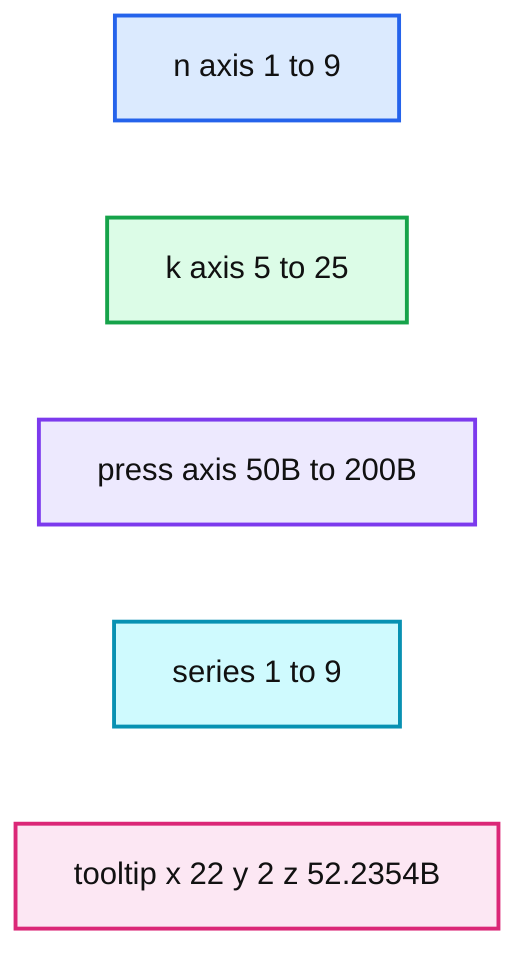

# Announcing RStudio and Databricks Integration

- Source: https://www.databricks.com/blog/2018/06/27/rstudio-integration.html
- Published: 2018-06-27
- Authors: Brian Dirking, Hossein Falaki, Denny Lee
- Categories: announcements, product, partners, engineering, data-science-machine-learning, company
- Images: 2 total, 1 extracted as architecture

*At Databricks, we are thrilled to announce the integration of RStudio with the Databricks Unified Analytics Platform. You can try it out now with this RMarkdown notebook (Rmd | *[*HTML*](https://docs.databricks.com/_static/notebooks/knn-regression-rstudio-databricks.html)*) or visit us at databricks.com/partners/rstudio.*

For R practitioners looking at scaling out R-based advanced analytics to big data, Databricks provides a Unified Analytics Platform that gets up and running in seconds, integrates with RStudio to provide ease of use, and enables you to automatically run and execute R workloads at unprecedented scale across single or multiple nodes.

Integrating Databricks and RStudio together allows data scientists to address a number of challenges including:

1. **Increase productivity among your data science teams**: Data scientists using R can use their favorite IDE using [SparkR](https://spark.apache.org/docs/latest/sparkr.html) or [sparklyr](https://spark.rstudio.com/) to seamlessly execute jobs on Spark to scale your R-based analytics. At the same time you can get your environment up and running quickly to provide scale without the need for cluster management.
2. **Simplify access and provide the best possible dataset**: R users can get access to the full ETL capabilities of Databricks to provide access to relevant datasets including optimizing data formats, cleaning up data, and joining datasets to provide the perfect dataset for your analytics
3. **Scale R-based analytics to big data**: Move from data science to big data science by scaling up current R-based analysis to the analytics volume based on Apache Spark running on Databricks. At the same time, you can keep costs under control with the auto-scaling of Databricks to automatically scale usage up and down based upon your analytics needs.

****Introducing Databricks RStudio Integration****
With Databricks RStudio Integration, both popular R packages for interacting with Apache Spark, [SparkR](https://spark.apache.org/docs/latest/sparkr.html) or [sparklyr](https://spark.rstudio.com/) can be used the inside the RStudio IDE on Databricks. When multiple users use a cluster, each creates a separate [SparkR](https://www.databricks.com/glossary/what-is-sparkr) Context or [sparklyr](https://www.databricks.com/glossary/sparklyr) connection, but they are all talking to a single Databricks [managed Spark](https://www.databricks.com/glossary/managed-spark) application allowing unique opportunities for collaboration between users. Together, RStudio can take advantage of Databricks’ cluster management and Apache Spark to perform such as a massive model selection as noted in the figure below.

**Summary:** A 3D benchmark chart shows press values across n and k combinations for series 1 through 9.

**Components:**

- n axis: parameter values 1 through 9
- k axis: parameter values 5 through 25
- press axis: benchmark values measured in billions
- Series legend: nine plotted series labeled 1 through 9
- Data tooltip: selected point coordinates and press value

**Flows:**

- none

**Numbers:** 1, 2, 3, 4, 5, 6, 7, 8, 9, 10, 15, 20, 22, 25, 50B, 100B, 150B, 200B, 52.2354B

source image: https://www.databricks.com/wp-content/uploads/2018/06/R-min-surface-1024x765.png

You can run this demo on your own using this k-nearest neighbors (KNN) RMarkdown regression demo (Rmd | [HTML](https://docs.databricks.com/_static/notebooks/knn-regression-rstudio-databricks.html)).

****Next Steps****
Our goal is to make R-based analytics easier to use and more scalable with RStudio and Databricks. To dive deeper into the RStudio integration architecture, technical details on how users can access RStudio on Databricks clusters, and examples of the power of distributed computing and the interactivity of RStudio - and to get started today, visit databricks.com/partners/rstudio.
