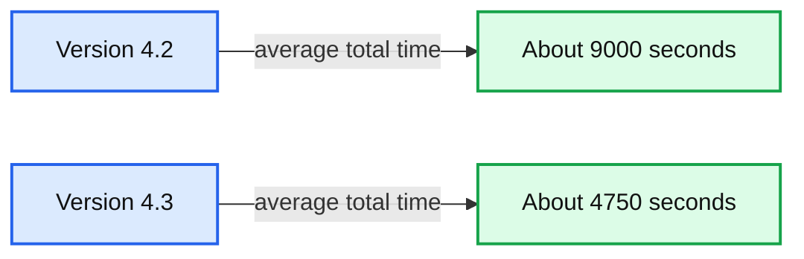

# Announcing Databricks Runtime 4.3

- Source: https://www.databricks.com/blog/2018/08/27/announcing-databricks-runtime-4-3.html
- Published: 2018-08-27
- Authors: Todd Greenstein
- Categories: company, product, engineering, announcements, platform
- Images: 1 total, 1 extracted as architecture

I'm pleased to announce the release of Databricks Runtime 4.3, powered by Apache Spark.  We've packed this release with an assortment of new features, performance improvements, and quality improvements to the platform.   We recommend moving to Databricks Runtime 4.3 in order to take advantage of these improvements.

In our obsession to continually improve our platform’s performance, the Databricks Runtime 4.3 release benefits from substantial performance gains over previous versions of the Databricks Runtime. We have seen over 15% improvement in AWS with the performance improvements in 4.3. With improvements from DBIO caching to skip data more efficiently we’re experiencing over 55% performance improvements with [TPC-DS](https://www.databricks.com/blog/2017/07/12/benchmarking-big-data-sql-platforms-in-the-cloud.html) at 1 Terabyte scale on Azure:

**Summary:** Bar chart comparing average total processing time for Azure Databricks versions 4.2 and 4.3.

**Components:**

- Azure Databricks version 4.2, blue bar
- Azure Databricks version 4.3, red bar
- Average total processing time, measured in seconds
- Vertical scale from 0 to 10000 seconds

**Flows:**

- none

**Numbers:** 4.2, 4.3, 0, 2500, 5000, 7500, 10000, seconds

source image: https://www.databricks.com/wp-content/uploads/2018/08/image1-5.png

Find out more about the DBIO Caching capabilities in Azure Databricks premium SKU with Ls series VMs and how to enable caching with other VM types in Azure in the [technical documentation](https://docs.microsoft.com/en-us/azure/databricks/delta/optimizations/delta-cache).

In addition to the performance improvements, we've also added new functionality to Databricks Delta:

- **Truncate Table:** with Delta you can delete all rows in a table using truncate.  It's important to note we do not support deleting specific partitions.  Refer to the documentation for more information: [Truncate Table](https://docs.databricks.com/spark/latest/spark-sql/language-manual/sql-ref-syntax-ddl-truncate-table.html)
- **Alter Table Replace columns:** Replace columns in a Databricks Delta table, including changing the comment of a column, and we support reordering of multiple columns.   Refer to the documentation for more information: [Alter Table](https://docs.databricks.com/spark/latest/spark-sql/language-manual/sql-ref-syntax-ddl-alter-table.html)
- **FSCK Repair Table: **This command allows you to Remove the file entries from the transaction log of a Databricks Delta table that can no longer be found in the underlying file system. This can happen when these files have been manually deleted.  Refer to the documentation for more information: [Repair Table](https://docs.databricks.com/spark/latest/spark-sql/language-manual/delta-fsck.html)
- **Scaling “Merge” Operations:** This release comes with experimental support for larger source tables with “Merge” operations. Please contact [support](https://www.databricks.com/support) if you would like to try out this feature.

We’ve added great improvements to Structured Streaming that I’d also like to highlight:

- We now support streaming writes using the [Azure SQL Data Warehouse Connector](https://docs.databricks.com/data/data-sources/azure/synapse-analytics.html).
- Support for foreachBatch() in Python (already available in Scala). See [foreach and foreachBatch documentation](https://docs.databricks.com/spark/latest/structured-streaming/foreach.html) for more details.
- Changes to the watermark policy allow you to specify either a min or a max watermark when there are multiple input streams in a query instead of defaulting to the minimum timestamp.   See the [multiple watermark policy](https://docs.databricks.com/spark/latest/structured-streaming/production.html#multiple-watermark-policy) for more details.

To read more about the above new features and to see the full list of improvements included in Databricks Runtime 4.3, please refer to the release notes in the following locations:

- Amazon Web Services: [Databricks Runtime 4.3 release notes](https://docs.databricks.com/release-notes/runtime/4.3.html)
- Azure: [Databricks Runtime 4.3 release notes](https://docs.microsoft.com/en-us/azure/databricks/release-notes/runtime/4.3)
